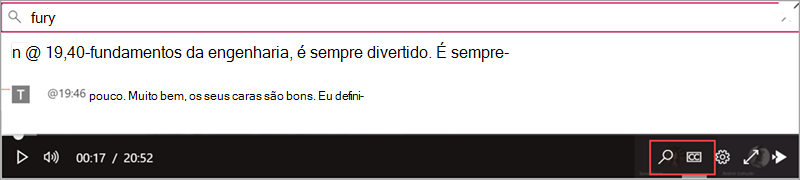

# Gerenciar políticas de reunião no TeamsManage meeting policies in Teams

::: zone target="docs"
As políticas de reunião são usadas para controlar os recursos disponibilizados para os participantes de reuniões programadas pelos usuários de sua organização.Meeting policies are used to control the features that are available to meeting participants for meetings that are scheduled by users in your organization. Depois de criar uma política e fazer suas alterações, você pode atribuir usuários à política.After you create a policy and make your changes, you can then assign users to the policy. Você gerencia políticas de reunião no centro de administração do Microsoft Teams ou usando o [PowerShell](teams-powershell-overview.md).You manage meeting policies in the Microsoft Teams admin center or by using [PowerShell](teams-powershell-overview.md).

> [!NOTE]
> Para obter informações sobre como usar funções para gerenciar as permissões de apresentadores e participantes da reunião, consulte [funções em uma reunião do teams](https://support.microsoft.com/en-us/office/roles-in-a-teams-meeting-c16fa7d0-1666-4dde-8686-0a0bfe16e019?ui=en-us&rs=en-us&ad=us).For information about using roles to manage the permissions of meeting presenters and attendees, see [Roles in a Teams meeting](https://support.microsoft.com/en-us/office/roles-in-a-teams-meeting-c16fa7d0-1666-4dde-8686-0a0bfe16e019?ui=en-us&rs=en-us&ad=us).

Você pode implementar políticas das seguintes maneiras, que afetam a experiência de reunião para os usuários antes de iniciar uma reunião, durante uma reunião ou após uma reunião.You can implement policies in the following ways, which affect the meeting experience for users before a meeting starts, during a meeting, or after a meeting.

|Tipo de implementaçãoImplementation type  |DescriçãoDescription  |
|---------|---------|
|Por organizadorPer-organizer    |Quando você implementa uma política por organizador, todos os participantes da reunião herdam a política do organizador.When you implement a per-organizer policy, all meeting participants inherit the policy of the organizer. Por exemplo, **admitir pessoas automaticamente** é uma política por organizador e controla se os usuários ingressam na reunião diretamente ou esperam no lobby para reuniões agendadas pelo usuário ao qual a política é atribuída.For example, **Automatically admit people** is a per-organizer policy and controls whether users join the meeting directly or wait in the lobby for meetings scheduled by the user who is assigned the policy.          |
|Por usuárioPer-user    |Quando você implementa uma política por usuário, somente a política por usuário se aplica para restringir determinados recursos para o organizador e/ou participantes da reunião.When you implement a per-user policy, only the per-user policy applies to restrict certain features for the organizer and/or meeting participants. Por exemplo, **permitir reunir agora em canais** é uma política por usuário.For example, **Allow Meet now in channels** is a per-user policy.     |
|Por organização e por usuárioPer-organizer and per-user     |Quando você implementa uma combinação de uma política por organização e por usuário, certos recursos são restritos para participantes da reunião com base em sua política e na política do organizador.When you implement a combination of a per-organizer and per-user policy, certain features are restricted for meeting participants based on their policy and the organizer's policy. Por exemplo, **permitir gravação na nuvem** é uma política por organização e por usuário.For example, **Allow cloud recording** is a per-organizer and per-user policy. Ative essa configuração para permitir que o organizador da reunião e os participantes iniciem e parem de gravar.Turn on this setting to allow the meeting organizer and participants to start and stop a recording.

Por padrão, uma política chamada global (padrão para toda a organização) é criada.By default, a policy named Global (Org-wide default) is created. Por padrão, todos os usuários de sua organização recebem a política de reunião global.All users in your organization are assigned the Global meeting policy by default. Você pode fazer alterações nele ou criar uma ou mais políticas personalizadas e atribuir usuários a elas.You can either make changes to it or create one or more custom policies and assign users to them. Os usuários receberão a política global, a menos que você crie e atribua uma política personalizada.Users will get the Global policy unless you create and assign a custom policy. Quando você cria uma política personalizada, pode permitir ou impedir que determinados recursos sejam disponibilizados para seus usuários e, em seguida, atribuí-los a um ou mais usuários que terão as configurações aplicadas a eles.When you create a custom policy, you can allow or prevent certain features from being available to your users, and then assign it to one or more users who will have the settings applied to them.

> [!NOTE]
> O botão detalhes da reunião estará disponível se um usuário tiver as licenças de conferência de áudio habilitadas ou o usuário for permitido para a conferência de áudio, caso contrário, os detalhes da reunião não estarão disponíveis.Meeting details button will be available if a user has the audio conference licenses enabled or the user is allow for audio conferencing, if not, the meeting details will not be available.

## Alterar ou criar uma política de reuniãoChange or create a meeting policy

Para alterar ou criar uma política de reunião, acesse o centro de administração do Microsoft Teams > **Reuniões** > **Políticas de reunião**.To change or create a meeting policy, go to the Microsoft Teams admin center > **Meetings** > **Meeting policies**. Selecione uma política na lista ou selecione **Adicionar**.Select a policy from the list or select **Add**. Se você estiver criando uma nova política, adicione um nome e uma descrição.If you're creating a new policy, add a name and description. O nome não pode conter caracteres especiais ou ter mais de 64 caracteres.The name can't contain special characters or be longer than 64 characters. Escolha as configurações e, em seguida, selecione **salvar**.Choose your settings, and then select **Save**.

Por exemplo, digamos que você tenha um grupo de usuários e queira limitar a quantidade de largura de banda que a reunião exigiria.For example, say you have a bunch of users and you want to limit the amount of bandwidth that their meeting would require. Você criaria uma nova política personalizada chamada "Largura de banda limitada" e desativaria as seguintes configurações:You would create a new custom policy named "Limited bandwidth" and disable the following settings:

Em **Áudio e vídeo**:Under **Audio & video**:
- Desative a opção Permitir gravação na nuvem.Turn off Allow cloud recording.
- Desative a opção Permitir vídeo IP.Turn off Allow IP video.

Em **Compartilhamento de conteúdo**:Under **Content sharing**:
- Desative o modo de compartilhamento de tela.Disable screen sharing mode.
- Desative a opção Permitir quadro de comunicações.Turn off Allow whiteboard.
- Desative a opção Permitir anotações compartilhadas.Turn off Allow shared notes.

Em seguida, atribua a política aos usuários.Then assign the policy to the users.

> [!NOTE]
> Somente uma política de reunião pode ser atribuída a um usuário de cada vez.A user can be assigned only one meeting policy at a time.

## Atribuir uma política de reunião aos usuáriosAssign a meeting policy to users

Para atribuir uma política de reunião a um usuário:To assign a meeting policy to one user:

1. Na barra de navegação à esquerda do centro de administração do Microsoft Teams, vá para **Usuários** e clique no usuário.In the left navigation of the Microsoft Teams admin center, go to **Users**, and then click the user.
2. Selecione o usuário clicando à esquerda do nome de exibição do usuário e clique em **Editar configurações**.Select the user by clicking to the left of the user name, and then click **Edit settings**.
3. Em **Política de reunião**, selecione a política que você deseja atribuir e clique em **Aplicar**.Under **Meeting policy**, select the policy you want to assign, and then click **Apply**.

Para atribuir uma política a vários usuários por vez:To assign a policy to multiple users at a time:

1. Na barra de navegação à esquerda do centro de administração do Microsoft Teams, vá para **Usuários** e, em seguida, pesquise os usuários ou filtre o modo de exibição para mostrar os usuários que você deseja.In the left navigation of the Microsoft Teams admin center, go to **Users**, and then search for the users or filter the view to show the users you want.
2. Na coluna **&#x2713;** (marca de seleção), selecione os usuários.In the **&#x2713;** (check mark) column, select the users. Para selecionar todos os usuários, clique na (marca de seleção) &#x2713; na parte superior da tabela.To select all users, click the &#x2713; (check mark) at the top of the table.
3. Clique em **Editar configurações**, faça as alterações desejadas e, em seguida, clique em **Aplicar**.Click **Edit settings**, make the changes that you want, and then click **Apply**.  

Ou, você também pode fazer o seguinte:Or, you can also do the following:

1. Na navegação à esquerda do centro de administração do Microsoft Teams, vá para políticas de reunião de **reuniões**  >  **Meeting policies**.In the left navigation of the Microsoft Teams admin center, go to **Meetings** > **Meeting policies**.
2. Escolha a política clicando à esquerda do nome da política.Select the policy by clicking to the left of the policy name.
3. Escolha **Gerenciar usuários**.Select **Manage users**.
4. No painel **Gerenciar usuários**, procure o usuário pelo nome de exibição ou pelo nome de usuário, escolha o nome e marque **Adicionar**.In the **Manage users** pane, search for the user by display name or by user name, select the name, and then select **Add**. Repita esta etapa para cada usuário que você deseja adicionar.Repeat this step for each user that you want to add.
5. Após terminar de adicionar usuários, selecione **salvar**.After you finish adding users, select **Save**.

> [!NOTE]
> Você não pode excluir uma política se usuários estiverem atribuídos a ela.You can't delete a policy if users are assigned to it. Primeiro, você deve atribuir uma política diferente a todos os usuários afetados. em seguida, é possível excluir a política original.You must first assign a different policy to all affected users, and then you can delete the original policy.

## Configurações da política de reuniãoMeeting policy settings

Ao selecionar uma política existente na página **políticas de reunião** ou selecionar **Adicionar** para adicionar uma nova política, você pode definir as configurações para o seguinte.When you select an existing policy on the **Meeting policies** page or select **Add** to add a new policy, you can configure settings for the following.

- [GeralGeneral](#meeting-policy-settings---general)
- [Áudio & vídeoAudio & video](#meeting-policy-settings---audio--video)
- [Compartilhamento de conteúdoContent sharing](#meeting-policy-settings---content-sharing)
- [Participantes & convidadosParticipants & guests](#meeting-policy-settings---participants--guests)

::: zone-end 

## Configurações da política de reunião-geralMeeting policy settings - General

- [Permitir reunir agora em canaisAllow Meet now in channels](#allow-meet-now-in-channels)
- [Permitir o suplemento do OutlookAllow the Outlook add-in](#allow-the-outlook-add-in)
- [Permitir agendamento de reunião de canalAllow channel meeting scheduling](#allow-channel-meeting-scheduling)
- [Permitir agendamento de reuniões particularesAllow scheduling private meetings](#allow-scheduling-private-meetings)
- [Permitir reunião agora em reuniões privadasAllow Meet now in private meetings](#allow-meet-now-in-private-meetings)

### Permitir reunir agora em canaisAllow Meet now in channels

Esta é uma política por usuário e se aplica antes de iniciar uma reunião.This is a per-user policy and applies before a meeting starts. Esta configuração controla se um usuário pode iniciar uma reunião ad hoc em um canal do teams.This setting controls whether a user can start an ad hoc meeting in a Teams channel. Se você ativar esta opção, quando um usuário postar uma mensagem em um canal do Teams, o usuário pode clicar em **reunir agora** na caixa de texto para iniciar uma reunião ad hoc no canal.If you turn this on, when a user posts a message in a Teams channel, the user can click **Meet now** under the compose box to start an ad hoc meeting in the channel. O valor padrão é True.The default value is True.

### Permitir o suplemento do OutlookAllow the Outlook add-in

Esta é uma política por usuário e se aplica antes de iniciar uma reunião.This is a per-user policy and applies before a meeting starts. Esta configuração controla se as reuniões de equipes podem ser agendadas dentro do Outlook (Windows, Mac, Web e celular).This setting controls whether Teams meetings can be scheduled from within Outlook (Windows, Mac, web, and mobile).

Se você desativar essa opção, os usuários não poderão agendar reuniões do teams ao criarem uma nova reunião no Outlook.If you turn this off, users are unable to schedule Teams meetings when they create a new meeting in Outlook. Por exemplo, no Outlook no Windows, a **nova opção de reunião do teams** não aparece na faixa de opções.For example, in Outlook on Windows, the **New Teams Meeting** option won't show up in the ribbon.

### Permitir agendamento de reunião de canalAllow channel meeting scheduling

Esta é uma política por usuário e se aplica antes de iniciar uma reunião.This is a per-user policy and applies before a meeting starts. Esta configuração controla se os usuários podem agendar uma reunião em um canal do teams.This setting controls whether users can schedule a meeting in a Teams channel.  Se você desativar essa opção, a opção **agendar uma reunião** não estará disponível para o usuário quando ele iniciar uma reunião em um canal do Teams e a opção **Adicionar canal** estiver desabilitada para os usuários do teams.If you turn this off, the **Schedule a meeting** option won't be available to the user when they start a meeting in a Teams channel and the **Add channel** option is disabled for users in Teams. O valor padrão é True.The default value is True.

### Permitir agendamento de reuniões particularesAllow scheduling private meetings

Esta é uma política por usuário e se aplica antes de iniciar uma reunião.This is a per-user policy and applies before a meeting starts. Esta configuração controla se os usuários podem agendar reuniões privadas no Teams.This setting controls whether users can schedule private meetings in Teams. Uma reunião é particular quando não é publicada em um canal de uma equipe.A meeting is private when it's not published to a channel in a team.

Observe que, se você desativar a opção **permitir reuniões privadas de agendamento** e **permitir agendamento de reunião de canal**, a opção **Adicionar participantes necessários** e **Adicionar canal** estará desabilitada para os usuários do teams.Note that if you turn off **Allow scheduling private meetings** and **Allow channel meeting scheduling**,  the **Add required attendees** and **Add channel** options are disabled for users in Teams. O valor padrão é True.The default value is True.

### Permitir reunião agora em reuniões privadasAllow Meet now in private meetings

Esta é uma política por usuário e se aplica antes de iniciar uma reunião.This is a per-user policy and applies before a meeting starts. Esta configuração controla se um usuário pode iniciar uma reunião privada ad hoc.This setting controls whether a user can start an ad hoc private meeting.  O valor padrão é True.The default value is True.

## Configurações da política de reunião-áudio & vídeoMeeting policy settings - Audio & video

- [Permitir transcriçãoAllow transcription](#allow-transcription)
- [Permitir gravação na nuvemAllow cloud recording](#allow-cloud-recording)
- [Permitir vídeo IPAllow IP video](#allow-ip-video)
- [Taxa de bits de mídia (KBS)Media bit rate (Kbs)](#media-bit-rate-kbs)

### Permitir transcriçãoAllow transcription

Trata-se de uma combinação de uma política por organização e por usuário.This is a combination of a per-organizer and per-user policy. Esta configuração controla se as legendas e os recursos de transcrição estão disponíveis durante a reprodução de gravações de reunião.This setting controls whether captions and transcription features are available during playback of meeting recordings. Se você desativar essa opção, as opções de **pesquisa** e **CC** não estarão disponíveis durante a reprodução de uma gravação de reunião.If you turn this off, the **Search** and **CC** options won't be available during playback of a meeting recording. A pessoa que iniciou a gravação precisa desta configuração ativada para que a gravação também inclua transcrição.The person who started the recording needs this setting turned on so that the recording also includes transcription. 

Observe que a transcrição para reuniões gravadas no momento só tem suporte para os usuários que têm o idioma no Microsoft Teams definido como Inglês e quando o inglês está falado na reunião.Note that transcription for recorded meetings is currently only supported for users who have the language in Teams set to English and when English is spoken in the meeting.

### Permitir gravação na nuvemAllow cloud recording

Trata-se de uma combinação de uma política por organização e por usuário.This is a combination of a per-organizer and per-user policy. Esta configuração controla se as reuniões deste usuário podem ser registradas.This setting controls whether this user's meetings can be recorded. A gravação pode ser iniciada pelo organizador da reunião ou por outro participante da reunião se a configuração de política estiver ativada para o participante e se for um usuário autenticado da mesma organização.The recording can be started by the meeting organizer or by another meeting participant if the policy setting is turned on for the participant and if they're an authenticated user from the same organization.

Pessoas de fora da sua organização, como usuários federados e anônimos, não podem iniciar a gravação.People outside your organization, such as federated and anonymous users, can't start the recording. Os usuários convidados não podem iniciar ou parar a gravação.Guest users can't start or stop the recording. 

Vamos dar uma olhada no exemplo a seguir.Let's look at the following example.

|UsuárioUser |Políticas de reuniãoMeeting policy  |Permitir gravação na nuvemAllow cloud recording |
|---------|---------|---------|
|DanielaDaniela | GlobalGlobal   | FalsoFalse |
|AmandaAmanda | Location1MeetingPolicyLocation1MeetingPolicy | VerdadeiroTrue|
|John (usuário externo)John (external user) | Não aplicávelNot applicable | Não aplicávelNot applicable|

Reuniões organizadas por Daniela não podem ser gravadas e Amanda, que tem a configuração de política habilitada, não pode gravar reuniões organizadas por Daniela.Meetings organized by Daniela can't be recorded and Amanda, who has the policy setting enabled, can't record meetings organized by Daniela. Reuniões organizadas por Amanda podem ser registradas, no entanto, Daniela, que têm a configuração de política desabilitada e John, que é um usuário externo, não pode gravar reuniões organizadas por Amanda.Meetings organized by Amanda can be recorded, however,  Daniela, who has the policy setting disabled and John who is an external user, can't record meetings organized by Amanda.

Para saber mais sobre a gravação de reunião em nuvem, consulte [gravação de reunião na nuvem do teams](cloud-recording.md).To learn more about cloud meeting recording, see [Teams cloud meeting recording](cloud-recording.md).

### Permitir vídeo IPAllow IP video

Trata-se de uma combinação de uma política por organização e por usuário.This is a combination of a per-organizer and per-user policy. Vídeo é um componente importante para reuniões.Video is a key component to meetings. Em algumas organizações, os administradores podem querer ter mais controle sobre quais reuniões de usuários têm vídeo.In some organizations, admins might want more control over which users' meetings have video. Esta configuração controla se o vídeo pode ser ativado em reuniões hospedadas por um usuário e em chamadas do 1:1 e chamadas em grupo iniciadas por um usuário.This setting controls whether video can be turned on in meetings hosted by a user and in 1:1 calls and group calls started by a user. Reuniões organizadas por um usuário que tem essa política habilitada, permitir o compartilhamento de vídeo na reunião pelos participantes da reunião, se os participantes da reunião também tiverem a política habilitada.Meetings organized by a user who has this policy enabled, allow video sharing in the meeting by the meeting participants, if the meeting participants also have the policy enabled. Os participantes da reunião que não têm políticas atribuídas (por exemplo, participantes anônimos e federados) herdam a política do organizador da reunião.Meeting participants who don't have any policies assigned (for example, anonymous and federated participants) inherit the policy of the meeting organizer.

Vamos dar uma olhada no exemplo a seguir.Let's look at the following example.

|UsuárioUser |Políticas de reuniãoMeeting policy  |Permitir vídeo IPAllow IP Video |
|---------|---------|---------|
|DanielaDaniela   | GlobalGlobal   | VerdadeiroTrue        |
|AmandaAmanda    | Location1MeetingPolicyLocation1MeetingPolicy        | FalsoFalse      |

Reuniões hospedadas pela Daniela permitem que o vídeo seja ativado.Meetings hosted by Daniela allow video to be turned on. Daniela pode ingressar na reunião e ativar o vídeo.Daniela can join the meeting and turn on video. O Amanda não pode ativar o vídeo na reunião do Daniela porque a política de Amanda está definida como não permitir vídeo.Amanda can't turn on video in Daniela's meeting because Amanda's policy is set to not allow video. Amanda pode ver vídeos compartilhados por outros participantes da reunião.Amanda can see videos shared by other participants in the meeting.

Em reuniões hospedadas pela Amanda, ninguém pode ativar o vídeo, independentemente da política de vídeo atribuída a ele.In meetings hosted by Amanda, no one can turn on video, regardless of the video policy assigned to them. Isso significa que o Daniela não pode ativar o vídeo nas reuniões do Amanda.This means Daniela can't turn on video in Amanda's meetings.  

Se Daniela chama Amanda com vídeo ativado, o Amanda pode atender a chamada somente com áudio.If Daniela calls Amanda with video on, Amanda can answer the call with audio only.  Quando a chamada estiver conectada, Amanda poderá ver o vídeo do Daniela, mas não poderá ativar o vídeo.When the call is connected, Amanda can see Daniela's video, but can't turn on video. Se o Amanda chama Daniela, Daniela pode atender a chamada com vídeo e áudio.If Amanda calls Daniela, Daniela can answer the call with video and audio. Quando a chamada estiver conectada, o Daniela poderá ativar ou desativar o vídeo, conforme necessário.When the call is connected, Daniela can turn on or turn off her video, as needed.

### Taxa de bits de mídia (KBS)Media bit rate (Kbs)

Esta é uma política por usuário.This is a per-user policy. Essa configuração determina a taxa de bits de mídia para transmissões de compartilhamento de áudio, vídeo e aplicativos baseados em vídeo em chamadas e reuniões para o usuário.This setting determines the media bit rate for audio, video, and video-based app sharing transmissions in calls and meetings for the user. Ela é aplicada à passagem de mídia uplink e de downlink para usuários na chamada ou reunião.It's applied to both the uplink and downlink media traversal for users in the call or meeting. Essa configuração lhe dá controle granular sobre o gerenciamento da largura de banda em sua organização.This setting gives you granular control over managing bandwidth in your organization. Dependendo dos cenários de reuniões exigidos pelos usuários, recomendamos ter largura de banda suficiente para ter uma boa experiência de qualidade.Depending on the meetings scenarios required by users, we recommend having enough bandwidth in place for a good quality experience. O valor mínimo é de 30 kbps e o valor máximo depende do cenário da reunião.The minimum value is 30 Kbps and the maximum value depends on the meeting scenario. Para saber mais sobre a largura de banda mínima recomendada para reuniões de boa qualidade, chamadas e eventos dinâmicos no Teams, consulte [requisitos de largura de banda](prepare-network.md#bandwidth-requirements).To learn more about the minimum recommended bandwidth for good quality meetings, calls, and live events in Teams, see [Bandwidth requirements](prepare-network.md#bandwidth-requirements).

Se não houver largura de banda suficiente para uma reunião, os participantes verão uma mensagem indicando uma qualidade de rede ruim.If there isn't enough bandwidth for a meeting, participants see a message that indicates poor network quality.

Para reuniões que precisam de experiência com vídeo de alta qualidade, como reuniões de tabuleiro de CEO e eventos ao vivo da equipe, recomendamos que você defina a largura de banda como 10 Mbps.For meetings that need the highest quality video experience, such as CEO board meetings and Teams live events, we recommend you set the bandwidth to 10 Mbps. Mesmo quando a experiência máxima é definida, a pilha de mídia do teams se adapta às condições de pouca largura de banda quando determinadas condições de rede são detectadas, dependendo do cenário.Even when the maximum experience is set, the Teams media stack adapts to low bandwidth conditions when certain network conditions are detected, depending on the scenario. 

## Configurações da política de reunião – compartilhamento de conteúdoMeeting policy settings - Content sharing

- [Modo de compartilhamento de telaScreen sharing mode](#screen-sharing-mode)
- [Permitir que um participante conceda ou solicite o controleAllow a participant to give or request control](#allow-a-participant-to-give-or-request-control)
- [Permitir que um participante externo conceda ou solicite controleAllow an external participant to give or request control](#allow-an-external-participant-to-give-or-request-control)
- [Permitir compartilhamento do PowerPointAllow PowerPoint sharing](#allow-powerpoint-sharing)
- [Permitir quadro de comunicaçõesAllow whiteboard](#allow-whiteboard)
- [Permitir anotações compartilhadasAllow shared notes](#allow-shared-notes)

### Modo de compartilhamento de telaScreen sharing mode

Trata-se de uma combinação de uma política por organização e por usuário.This is a combination of a per-organizer and per-user policy. Esta configuração controla se a área de trabalho e/ou o compartilhamento de janela é permitida na reunião do usuário.This setting controls whether desktop and/or window sharing is allowed in the user's meeting. Os participantes da reunião que não têm políticas atribuídas (por exemplo, participantes anônimos, convidados, B2B e federados) herdam a política do organizador da reunião.Meeting participants who don't have any policies assigned (for example, anonymous, guest, B2B, and federated participants) inherit the policy of the meeting organizer.

|Valor de configuraçãoSetting value |ComportamentoBehavior  |
|---------|---------|
|**Tela inteira****Entire screen**    | Compartilhamento de área de trabalho e compartilhamento de aplicativos completos são permitidos na reuniãoFull desktop sharing and application sharing is allowed in the meeting |
|**Único aplicativo****Single application**   | O compartilhamento de aplicativos é permitido na reuniãoApplication sharing is allowed in the meeting        |
|**Desabilitado****Disabled**     |Compartilhamento de tela e compartilhamento de aplicativos desativados na reunião.Screen sharing and application sharing turned off in the meeting.       |

Vamos dar uma olhada no exemplo a seguir.Let's look at the following example.

|UsuárioUser |Políticas de reuniãoMeeting policy |Modo de compartilhamento de telaScreen sharing mode |
|---------|---------|---------|
|DanielaDaniela  | GlobalGlobal   | Tela inteiraEntire screen |
|AmandaAmanda   | Location1MeetingPolicyLocation1MeetingPolicy  | DesabilitadoDisabled |

Reuniões hospedadas pela Daniela permitem que os participantes da reunião compartilhem sua tela inteira ou um aplicativo específico.Meetings hosted by Daniela allow meeting participants to share their entire screen or a specific application. Se o Amanda entrar na reunião do Daniela, o Amanda não poderá compartilhar a tela ou um aplicativo específico, pois a configuração da política estará desabilitada.If Amanda joins Daniela's meeting, Amanda can't share her screen or a specific application as her policy setting is disabled. Em reuniões hospedadas pela Amanda, ninguém tem permissão para compartilhar a tela ou um único aplicativo, independentemente da política do modo de compartilhamento de tela atribuída a eles.In meetings hosted by Amanda, no one is allowed to share their screen or a single application, regardless of the screen sharing mode policy assigned to them. Isso significa que o Daniela não pode compartilhar sua tela ou um único aplicativo nas reuniões do Amanda.This means that Daniela can't share her screen or a single application in Amanda's meetings.  

Atualmente, os usuários não podem reproduzir vídeo ou compartilhar sua tela em uma reunião do teams se estiverem usando o Google Chrome.Currently, users can't play video or share their screen in a Teams meeting if they're using Google Chrome.

### Permitir que um participante conceda ou solicite o controleAllow a participant to give or request control

Esta é uma política por usuário.This is a per-user policy. Esta configuração controla se o usuário pode dar o controle da área de trabalho ou janela compartilhada para outros participantes da reunião.This setting controls whether the user can give control of the shared desktop or window to other meeting participants. Para dar controle, passe o mouse sobre a parte superior da tela.To give control, hover over the top of the screen. 

Se essa configuração estiver ativada para o usuário, a opção **conceder controle** será exibida na barra superior de uma sessão de compartilhamento.If this setting is turned on for the user, the **Give Control** option is displayed in the top bar in a sharing session. 

Se as configurações estiverem desativadas para o usuário, a opção **conceder controle** não estará disponível.If the settings is turned off for the user, the **Give Control** option isn't available.

Vamos dar uma olhada no exemplo a seguir.Let's look at the following example.

|UsuárioUser |Políticas de reuniãoMeeting policy  |Permitir que o participante conceda ou solicite o controleAllow participant to give or request control |
|---------|---------|---------|
|DanielaDaniela   | GlobalGlobal   | VerdadeiroTrue       |
|BabekBabek    | Location1MeetingPolicyLocation1MeetingPolicy        | FalsoFalse   |

O Daniela pode dar ao controle da área de trabalho compartilhada ou janela para outros participantes de uma reunião organizada por Babek, enquanto o Babek não pode conceder ao controle outros participantes.Daniela can give control of the shared desktop or window to other participants in a meeting organized by Babek whereas Babek can't give control to other participants.

Para usar o PowerShell para controlar quem pode conceder controle ou aceitar solicitações de controle, use o cmdlet AllowParticipantGiveRequestControl.To use PowerShell to control who can give control or accept requests for control, use the AllowParticipantGiveRequestControl cmdlet.

> [!NOTE]
> Para dar e assumir o controle do conteúdo compartilhado durante o compartilhamento, ambas as partes devem usar o cliente da área de trabalho do teams.To give and take control of shared content during sharing, both parties must be using the Teams desktop client. Não há suporte para controle quando ambas as partes estiverem executando o Teams em um navegador.Control isn't supported when either party is running Teams in a browser. Isso ocorre devido a uma limitação técnica de que estamos planejando corrigir.This is due to a technical limitation that we're planning to fix. 

### Permitir que um participante externo conceda ou solicite controleAllow an external participant to give or request control

Esta é uma política por usuário.This is a per-user policy. Esta configuração controla se os participantes externos em uma reunião podem dar o controle da sua área de trabalho compartilhada ou janela para outros participantes da reunião.This setting controls whether external participants in a meeting can give control of their shared desktop or window to other participants in the meeting. Os participantes externos em reuniões de equipes podem ser categorizados da seguinte maneira:External participants in Teams meetings can be categorized as follows:  

- Usuário anônimoAnonymous user
- Usuários convidadosGuest users  
- Usuário B2BB2B user
- Usuário federadoFederated user  

Se os usuários federados podem dar controle aos usuários externos enquanto o compartilhamento é controlado pela configuração **permitir que um participante externo conceda ou solicite o controle** em sua organização.Whether federated users can give control to external users while sharing is controlled by the **Allow an external participant to give or request control** setting in their organization.

Para usar o PowerShell para controlar se os participantes externos podem conceder controle ou aceitar solicitações de controle, use o cmdlet AllowExternalParticipantGiveRequestControl.To use PowerShell to control whether external participants can give control or accept requests for control, use the AllowExternalParticipantGiveRequestControl cmdlet.

### Permitir compartilhamento do PowerPointAllow PowerPoint sharing

Esta é uma política por usuário.This is a per-user policy. Esta configuração controla se o usuário pode compartilhar apresentações de slides do PowerPoint em uma reunião.This setting controls whether the user can share PowerPoint slide decks in a meeting. Usuários externos, incluindo usuários anônimos, convidados e federados, herdam a política do organizador da reunião.External users, including anonymous, guest, and federated users, inherit the policy of the meeting organizer.

Vamos dar uma olhada no exemplo a seguir.Let's look at the following example.

|UsuárioUser |Políticas de reuniãoMeeting policy  |Permitir compartilhamento do PowerPointAllow PowerPoint sharing |
|---------|---------|---------|
|DanielaDaniela   | GlobalGlobal   | VerdadeiroTrue       |
|AmandaAmanda   | Location1MeetingPolicyLocation1MeetingPolicy        | FalsoFalse   |

O Amanda não pode compartilhar apresentações de slides do PowerPoint em reuniões, mesmo que ela seja o organizador da reunião.Amanda can't share PowerPoint slide decks in meetings even if she's the meeting organizer. Daniela pode compartilhar decks de slides do PowerPoint mesmo se a reunião for organizada por Amanda.Daniela can share PowerPoint slide decks even if the meeting is organized by Amanda. O Amanda pode exibir os decks de slides do PowerPoint compartilhados por outras pessoas na reunião, mesmo que ele não possa compartilhar os slides do PowerPoint.Amanda can view the PowerPoint slide decks shared by others in the meeting, even though she can't share PowerPoint slide decks.

### Permitir quadro de comunicaçõesAllow whiteboard

Esta é uma política por usuário.This is a per-user policy. Esta configuração controla se um usuário pode compartilhar o quadro de comunicações em uma reunião.This setting controls whether a user can share the whiteboard in a meeting. Usuários externos, incluindo usuários anônimos, B2B e federados, herdam a política do organizador da reunião.External users, including anonymous, B2B, and federated users, inherit the policy of the meeting organizer. 

Vamos dar uma olhada no exemplo a seguir.Let's look at the following example.

|UsuárioUser |Políticas de reuniãoMeeting policy  |Permitir quadro de comunicaçõesAllow whiteboard|
|---------|---------|---------|
|DanielaDaniela   | GlobalGlobal   | VerdadeiroTrue       |
|AmandaAmanda   | Location1MeetingPolicyLocation1MeetingPolicy        | FalsoFalse   |

O Amanda não pode compartilhar o quadro de comunicações em uma reunião, mesmo que ela seja o organizador da reunião.Amanda can't share the whiteboard in a meeting even if she's the meeting organizer. Daniela pode compartilhar o quadro de comunicações mesmo se uma reunião for organizada por Amanda.Daniela can share the whiteboard even if a meeting is organized by Amanda.  

### Permitir anotações compartilhadasAllow shared notes

Esta é uma política por usuário.This is a per-user policy. Esta configuração controla se um usuário pode criar e compartilhar anotações em uma reunião.This setting controls whether a user can create and share notes in a meeting. Usuários externos, incluindo usuários anônimos, B2B e federados, herdam a política do organizador da reunião.External users, including anonymous, B2B, and federated users, inherit the policy of the meeting organizer. No momento, a guia **anotações da reunião** só tem suporte em reuniões com menos de 20 participantes.The **Meeting Notes** tab is currently only supported in meetings that have less than 20 participants.

Vamos dar uma olhada no exemplo a seguir.Let's look at the following example.

|UsuárioUser |Políticas de reuniãoMeeting policy  |Permitir anotações compartilhadasAllow shared notes |
|---------|---------|---------|
|DanielaDaniela   | GlobalGlobal   | VerdadeiroTrue       |
|AmandaAmanda   | Location1MeetingPolicyLocation1MeetingPolicy | FalsoFalse |

Daniela pode fazer anotações nas reuniões do Amanda, e o Amanda não pode fazer anotações em nenhuma reunião.Daniela can take notes in Amanda's meetings and Amanda can't take notes in any meetings.

## Configurações de política de reunião-participantes & convidadosMeeting policy settings - Participants & guests

Essas configurações controlam quais participantes da reunião aguardam no lobby antes de serem admitidos para a reunião e o nível de participação que eles são permitidos em uma reunião.These settings control which meeting participants wait in the lobby before they are admitted to the meeting and the level of participation they are allowed in a meeting.

- [Permitir que as pessoas anônimas iniciem uma reuniãoLet anonymous people start a meeting](#let-anonymous-people-start-a-meeting)
- [Admitir pessoas automaticamenteAutomatically admit people](#automatically-admit-people)
- [Permitir que os usuários de discagem ignorem o lobbyAllow dial-in users to bypass the lobby](#allow-dial-in-users-to-bypass-the-lobby)
- [Habilitar legendas dinâmicasEnable live captions ](#enable-live-captions)
- [Permitir chat em reuniõesAllow chat in meetings ](#allow-chat-in-meetings)

> [!NOTE]
>As opções para ingressar em uma reunião irão variar, dependendo das configurações de cada grupo de equipe e do método de conexão.Options to join a meeting will vary, depending on the settings for each Teams group, and the connection method. Se o seu grupo tiver uma videoconferência e usar-a para se conectar, consulte [videoconferências](https://docs.microsoft.com/microsoftteams/audio-conferencing-in-office-365).If your group has audio conferencing, and uses it to connect, see [Audio Conferencing](https://docs.microsoft.com/microsoftteams/audio-conferencing-in-office-365). Se o grupo Teams não tiver videoconferências, consulte [ingressar em uma reunião no Teams](https://support.office.com/article/join-a-meeting-in-teams-1613bb53-f3fa-431e-85a9-d6a91e3468c9).If your Teams group does not have audio conferencing, refer to [Join a meeting in Teams](https://support.office.com/article/join-a-meeting-in-teams-1613bb53-f3fa-431e-85a9-d6a91e3468c9).

### Permitir que as pessoas anônimas iniciem uma reuniãoLet anonymous people start a meeting

Trata-se de uma política de um organizador que permite reuniões de discagem de discagem de discagem de discagem líder.This is a per-organizer policy that allows for leaderless dial in conferencing meetings. Esta configuração controla se a discagem de usuários pode ingressar na reunião sem um usuário autenticado da organização em participação.This setting controls whether dial in users can join the meeting without an authenticated user from the organization in attendance. O valor padrão é falso, que significa que os usuários de discagem aguardarão no lobby até que um usuário autenticado da organização ingresse na reunião.The default value is False which means dial in users will wait in the lobby until an authenticated user from the organization joins the meeting. 

**Observação** Se falso e um usuário de discagem ingressar na reunião primeiro e for colocado no lobby, um usuário da organização deverá ingressar na reunião com um cliente do teams para admitir o usuário do lobby.**Note** If False and a dial in user joins the meeting first and is placed in the lobby, an organization user must join the meeting with a Teams client to admit the user from the lobby. Não há controles de lobby disponíveis para discar em usuários.There are no lobby controls available for dialed in users. 

### Admitir pessoas automaticamenteAutomatically admit people

Esta é uma política por organizador.This is a per-organizer policy. Esta configuração controla se as pessoas ingressam em uma reunião diretamente ou esperam no lobby até serem admitidas por um usuário autenticado.This setting controls whether people join a meeting directly or wait in the lobby until they are admitted by an authenticated user. Esta configuração não se aplica a usuários de discagem.This setting does not apply to dial in users. 

 Os organizadores da reunião podem clicar em **Opções de reunião** no convite da reunião para alterar essa configuração para cada reunião agendada.Meeting organizers can click **Meeting Options** in the meeting invitation to change this setting for each meeting they schedule.
 
 **Observação** Nas opções de reunião, a configuração é rotulada como "quem pode ignorar o lobby"**Note** In the meeting options the setting is labeled "Who can bypass the lobby"
  
|Valor de configuraçãoSetting value  |Comportamento da junçãoJoin behavior |
|---------|---------|
|**Todos****Everyone**   |Todos os participantes da reunião ingressam na reunião diretamente sem esperar no lobby.All meeting participants join the meeting directly without waiting in the lobby. Isso inclui usuários autenticados, usuários externos de organizações confiáveis (federadas), convidados e usuários anônimos.This includes authenticated users, external users from trusted organizations (federated), guests, and anonymous users.     |
|**Todos em sua organização e organizações federadas****Everyone in your organization and federated organizations**     |Usuários autenticados dentro da organização, incluindo usuários convidados e os usuários de organizações confiáveis, ingressam na reunião diretamente sem esperar no lobby.Authenticated users within the organization, including guest users and the users from trusted organizations, join the meeting directly without waiting in the lobby.  Usuários anônimos esperam no lobby.Anonymous users wait in the lobby.   |
|**Todos em sua organização****Everyone in your organization**    |Os usuários autenticados de dentro da organização, incluindo os usuários convidados, ingressam na reunião diretamente sem esperar no lobby.Authenticated users from within the organization, including guest users, join the meeting directly without waiting in the lobby.  Os usuários de organizações confiáveis e usuários anônimos esperam no lobby.Users from trusted organizations and anonymous users wait in the lobby. Esta é a configuração padrão.This is the default setting.           |

### Permitir que os usuários de discagem ignorem o lobbyAllow dial-in users to bypass the lobby

Esta é uma política por organizador.This is a per-organizer policy. Esta configuração controla se as pessoas que discam por telefone entram diretamente na reunião ou esperam no lobby, independentemente da configuração de usuário **admitir pessoas automaticamente** .This setting controls whether people who dial in by phone join the meeting directly or wait in the lobby regardless of the **Automatically admit people** setting. O valor padrão é False.The default value is False. Quando for falso, os usuários de discagem aguardarão no lobby até que o usuário da organização ingresse na reunião com um cliente do Teams e os admite.When False, dial in users will wait in the lobby until a organization user joins the meeting with a Teams client and admits them. Quando for verdadeiro, discar os usuários entrarão automaticamente na reunião quando um usuário da organização ingressar na reunião.When True, dial in users will automatically join the meeting when an organization user joins the meeting. 

**Observação** Se um usuário de discagem ingressar em uma reunião antes de um usuário da organização ingressar na reunião, ela será colocada no lobby até que o usuário da organização ingresse na reunião usando um cliente do Team e os inscreva.**Note** If a dial in user joins a meeting before an organization user joins the meeting, they will be placed in the lobby until an organization user joins the meeting using a Teams client and admits them. 

### Habilitar legendas dinâmicasEnable live captions

Esta é uma política por usuário e aplica-se durante uma reunião.This is a per-user policy and applies during a meeting. Esta configuração controla se a opção **Ativar legendas dinâmicas** está disponível para o usuário ativar e desativar legendas dinâmicas em reuniões que o usuário participa.This setting controls whether the **Turn on live captions** option is available for the user to turn on and turn off live captions in meetings that the user attends.  

|Valor de configuraçãoSetting value |ComportamentoBehavior  |
|---------|---------|
|**Desabilitado, mas o usuário pode substituir****Disabled but the user can override**     | As legendas dinâmicas não são ativadas automaticamente para o usuário durante uma reunião.Live captions aren't automatically turned on for the user during a meeting. O usuário vê a opção **Ativar legendas ao vivo** no menu de estouro (**...**) para ativá-las.The user sees the **Turn on live captions** option in the overflow (**...**) menu to turn them on. Esta é a configuração padrão.This is the default setting. |
|**Desabilitado****Disabled**     | As legendas ao vivo são desabilitadas para o usuário durante uma reunião.Live captions are disabled for the user during a meeting. O usuário não tem a opção de ativá-los.The user doesn't have the option to turn them on.          |

### Permitir chat em reuniõesAllow chat in meetings

Esta é uma política por organizador.This is a per-organizer policy. Esta configuração controla se o chat da reunião é permitido na reunião do usuário.This setting controls whether meeting chat is allowed in the user's meeting.

## Configurações da política da reunião – modo de função do apresentador designadoMeeting policy settings - Designated presenter role mode

Esta é uma política por usuário.This is a per-user policy. Essa configuração permite alterar o valor padrão da configuração **quem pode apresentar?** em opções de **reunião** no cliente do teams.This setting lets you change the default value of the **Who can present?** setting in **Meeting options** in the Teams client. Essa configuração de política afeta todas as reuniões, incluindo reunir reuniões agora.This policy setting affects all meetings, including Meet Now meetings.

A configuração **quem pode apresentar?** permite que os organizadores da reunião escolham quem pode ser apresentadores em uma reunião.The **Who can present?** setting lets meeting organizers choose who can be presenters in a meeting. Para saber mais, confira [alterar as configurações de participante de uma reunião](https://support.microsoft.com/article/change-participant-settings-for-a-teams-meeting-53261366-dbd5-45f9-aae9-a70e6354f88e) e funções de equipe [em uma reunião de equipe](https://support.microsoft.com/article/roles-in-a-teams-meeting-c16fa7d0-1666-4dde-8686-0a0bfe16e019).To learn more, see [Change participant settings for a Teams meeting](https://support.microsoft.com/article/change-participant-settings-for-a-teams-meeting-53261366-dbd5-45f9-aae9-a70e6354f88e) and [Roles in a Teams meeting](https://support.microsoft.com/article/roles-in-a-teams-meeting-c16fa7d0-1666-4dde-8686-0a0bfe16e019).

No momento, você só pode usar o PowerShell para definir essa configuração de política.Currently, you can only use PowerShell to configure this policy setting. Você pode editar uma política de reunião do teams existente usando o cmdlet [set-CsTeamsMeetingPolicy](https://docs.microsoft.com/powershell/module/skype/set-csteamsmeetingpolicy) .You can edit an existing Teams meeting policy by using the [Set-CsTeamsMeetingPolicy](https://docs.microsoft.com/powershell/module/skype/set-csteamsmeetingpolicy) cmdlet. Ou crie uma nova política de reunião do teams usando o cmdlet [New-CsTeamsMeetingPolicy](https://docs.microsoft.com/powershell/module/skype/new-csteamsmeetingpolicy) e atribua-a a usuários.Or, create a new Teams meeting policy by using the [New-CsTeamsMeetingPolicy](https://docs.microsoft.com/powershell/module/skype/new-csteamsmeetingpolicy) cmdlet and assign it to users.

Para especificar o valor padrão da configuração **quem pode apresentar?** no Teams, defina o parâmetro **DesignatedPresenterRoleMode** como um dos seguintes:To specify the default value of the **Who can present?** setting in Teams, set the **DesignatedPresenterRoleMode** parameter to one of the following:

- **EveryoneUserOverride**: todos os participantes da reunião podem ser apresentadores.**EveryoneUserOverride**:  All meeting participants can be presenters. Esse é o valor padrão.This is the default value. Esse parâmetro corresponde à configuração **todos** no Teams.This parameter corresponds to the **Everyone** setting in Teams.
- **EveryoneInCompanyUserOverride**: os usuários autenticados na organização, incluindo os usuários convidados, podem ser apresentadores.**EveryoneInCompanyUserOverride**: Authenticated users in the organization, including guest users, can be presenters. Esse parâmetro corresponde à configuração **pessoas na minha organização** no Teams.This parameter corresponds to the **People in my organization** setting in Teams.
- **OrganizerOnlyUserOverride**: somente o organizador da reunião pode ser um apresentador e todos os participantes da reunião são designados como participantes.**OrganizerOnlyUserOverride**: Only the meeting organizer can be a presenter and all meeting participants are designated as attendees. Esse parâmetro corresponde à **única configuração eu** do teams.This parameter corresponds to the **Only me** setting in Teams.

Lembre-se de que depois de definir o valor padrão, os organizadores da reunião ainda podem alterar essa configuração no Teams e escolher quem pode apresentar nas reuniões agendadas.Keep in mind that after you set the default value, meeting organizers can still change this setting in Teams and choose who can present in the meetings that they schedule.

## Configurações de política de reunião-relatório de presença de reuniãoMeeting policy settings - Meeting attendance report

Esta é uma política por usuário.This is a per-user policy. Esta configuração controla se os organizadores da reunião podem baixar o [relatório de participação da reunião](teams-analytics-and-reports/meeting-attendance-report.md).This setting controls whether meeting organizers can download the [meeting attendance report](teams-analytics-and-reports/meeting-attendance-report.md).

No momento, você só pode usar o PowerShell para definir essa configuração de política.Currently, you can only use PowerShell to configure this policy setting. Você pode editar uma política de reunião do teams existente usando o cmdlet [set-CsTeamsMeetingPolicy](https://docs.microsoft.com/powershell/module/skype/set-csteamsmeetingpolicy) .You can edit an existing Teams meeting policy by using the [Set-CsTeamsMeetingPolicy](https://docs.microsoft.com/powershell/module/skype/set-csteamsmeetingpolicy) cmdlet. Ou crie uma nova política de reunião do teams usando o cmdlet [New-CsTeamsMeetingPolicy](https://docs.microsoft.com/powershell/module/skype/new-csteamsmeetingpolicy) e atribua-a a usuários.Or, create a new Teams meeting policy by using the [New-CsTeamsMeetingPolicy](https://docs.microsoft.com/powershell/module/skype/new-csteamsmeetingpolicy) cmdlet and assign it to users.

Para habilitar um organizador da reunião para baixar o relatório de presença de reunião, defina o parâmetro **AllowEngagementReport** como **habilitado**.To enable a meeting organizer to download the meeting attendance report, set the **AllowEngagementReport** parameter  to **Enabled**. Quando habilitada, a opção para baixar o relatório é exibida no painel **participantes** .When enabled, the option to download the report is displayed in the **Participants** pane.

Para impedir que um organizador da reunião Baixe o relatório, defina o parâmetro como **desabilitado**.To prevent a meeting organizer from downloading the report, set the parameter to **Disabled**. Por padrão, essa configuração está desabilitada e a opção de baixar o relatório não está disponível.By default, this setting is disabled and the option to download the report isn't available.

## Configurações de política de reunião – provedor de reunião para o modo de ilhasMeeting policy settings - Meeting provider for Islands mode

Esta é uma política por usuário.This is a per-user policy. Esta configuração controla qual suplemento de reunião do Outlook é usado para *os usuários que estão no modo de ilhas*.This setting controls which Outlook meeting add-in is used for *users who are in Islands mode*. Você pode especificar se os usuários só podem usar o suplemento de reunião do Teams e os suplementos de reunião do Skype for Business para agendar reuniões no Outlook.You can specify whether users can only use the Teams Meeting add-in or both the Teams Meeting and Skype for Business Meeting add-ins to schedule meetings in Outlook.

Você só pode aplicar essa política a usuários que estão no modo de ilhas e ter o parâmetro **AllowOutlookAddIn** definido como **true** na política de reunião do Microsoft Teams.You can only apply this policy to users who are in Islands mode and have the **AllowOutlookAddIn** parameter set to **True** in their Teams meeting policy.

No momento, você só pode usar o PowerShell para definir essa política.Currently, you can only use PowerShell to set this policy. Você pode editar uma política de reunião do teams existente usando o cmdlet [set-CsTeamsMeetingPolicy](https://docs.microsoft.com/powershell/module/skype/set-csteamsmeetingpolicy) .You can edit an existing Teams meeting policy by using the [Set-CsTeamsMeetingPolicy](https://docs.microsoft.com/powershell/module/skype/set-csteamsmeetingpolicy) cmdlet. Ou crie uma nova política de reunião do teams usando o cmdlet [New-CsTeamsMeetingPolicy](https://docs.microsoft.com/powershell/module/skype/new-csteamsmeetingpolicy) e atribua-a a usuários.Or, create a new Teams meeting policy by using the [New-CsTeamsMeetingPolicy](https://docs.microsoft.com/powershell/module/skype/new-csteamsmeetingpolicy) cmdlet and assign it to users.

Para especificar o suplemento de reunião que você deseja disponibilizar para os usuários, defina o parâmetro **PreferredMeetingProviderForIslandsMode** da seguinte maneira:To specify which meeting add-in you want to be available to users, set the **PreferredMeetingProviderForIslandsMode** parameter as follows:

- Defina o parâmetro como **TeamsAndSfB** para habilitar o suplemento de reunião do Teams e o suplemento Skype for Business no Outlook.Set the parameter to **TeamsAndSfB** to enable both the Teams Meeting add-in and Skype for Business add-in in Outlook. Esse é o valor padrão.This is the default value.
- Defina o parâmetro como **TeamsOnly** para habilitar somente o suplemento de reunião do teams no Outlook.Set the parameter to **TeamsOnly** to enable only the Teams Meeting add-in in Outlook. Essa configuração de política garante que todas as reuniões futuras tenham um link de ingressar na reunião do teams.This policy setting ensures that all future meetings have a Teams meeting join link. Não migra a reunião do Skype for Business existente para ingressar nos links para o Microsoft Teams.It doesn't migrate existing Skype for Business meeting join links to Teams. Essa configuração de política não afeta a presença, o chat, as chamadas PSTN ou qualquer outro recurso no Skype for Business, o que significa que os usuários continuarão a usar o Skype for Business para esses recursos.This policy setting doesn't affect presence, chat, PSTN calling, or any other capabilities in Skype for Business, which means that users will continue to use Skype for Business for these capabilities.

  Se você definir o parâmetro para **TeamsOnly**e, em seguida, retornar ao **TeamsAndSfB**, ambos os suplementos de reunião serão habilitados.If you set the parameter to **TeamsOnly**, and then switch back to **TeamsAndSfB**, both meeting add-ins are enabled. No entanto, observe que a reunião de equipes existentes que ingressam em links não será migrada para o Skype for Business.However, note that existing Teams meeting join links won't be migrated to Skype for Business. Somente as reuniões do Skype for Business agendadas após a alteração terão o link de ingresso na reunião do Skype for Business.Only Skype for Business meetings scheduled after the change will have a Skype for Business meeting join link.

## Configurações de política de reunião-modo de filtros de vídeoMeeting policy settings - Video filters mode

Esta é uma política por usuário.This is a per-user policy. Esta configuração controla se os usuários podem personalizar a tela de fundo do vídeo em uma reunião.This setting controls whether users can customize their video background in a meeting.

No momento, você só pode usar o PowerShell para definir essa política.Currently, you can only use PowerShell to set this policy. Você pode editar uma política de reunião do teams existente usando o cmdlet [set-CsTeamsMeetingPolicy](https://docs.microsoft.com/powershell/module/skype/set-csteamsmeetingpolicy) .You can edit an existing Teams meeting policy by using the [Set-CsTeamsMeetingPolicy](https://docs.microsoft.com/powershell/module/skype/set-csteamsmeetingpolicy) cmdlet. Ou crie uma nova política de reunião do teams usando o cmdlet [New-CsTeamsMeetingPolicy](https://docs.microsoft.com/powershell/module/skype/new-csteamsmeetingpolicy) e, em seguida, atribua a política aos usuários.Or, create a new Teams meeting policy by using the [New-CsTeamsMeetingPolicy](https://docs.microsoft.com/powershell/module/skype/new-csteamsmeetingpolicy) cmdlet, and then assign the policy to users.

Para especificar se os usuários podem personalizar a tela de fundo do vídeo em uma reunião, defina o parâmetro **VideoFiltersMode** da seguinte maneira:To specify whether users can customize their video background in a meeting, set the **VideoFiltersMode** parameter as follows:

|Valor de configuração no PowerShellSetting value in PowerShell |ComportamentoBehavior  |
|---------|---------|
|**Sem filtros****NoFilters**     |O usuário não pode personalizar o plano de fundo do vídeo.User can't customize their video background.|
|**BlurOnly****BlurOnly**     |O usuário tem a opção de desfocar a tela de fundo do vídeo.User has the option to blur their video background. |
|**BlurandDefaultBackgrounds****BlurandDefaultBackgrounds**     |O usuário tem a opção de desfocar o plano de fundo do vídeo ou escolher um conjunto de imagens para usar como plano de fundo.User has the option to blur their video background or choose from a set of images to use as their background. |
|**Filtros****AllFilters**     |Use tem a opção de desfocar a tela de fundo do vídeo, escolher de um conjunto de imagens ou carregar imagens personalizadas para usar como plano de fundo.Use has the option to blur their video background, choose from a set of images, or upload custom images to use as their background. |

> [!NOTE]
> Imagens carregadas pelos usuários não são filtradas pelo Teams.Images uploaded by users aren't screened by Teams. Ao usar a configuração **filtros** , você deve ter políticas de organização internas para impedir que os usuários carreguem imagens ofensivas ou inadequadas, ou imagens que sua organização não tem direitos de usar para planos de fundo de reunião do teams.When you use the **AllFilters** setting, you should have internal organization policies to prevent users from uploading offensive or inappropriate images, or images your organization don't have rights to use for Teams meeting backgrounds.

## Tópicos relacionadosRelated topics

- [Visão Geral do PowerShell do TeamsTeams PowerShell overview](teams-powershell-overview.md)
- [Atribuir políticas a seus usuários no TeamsAssign policies to your users in Teams](assign-policies.md)
