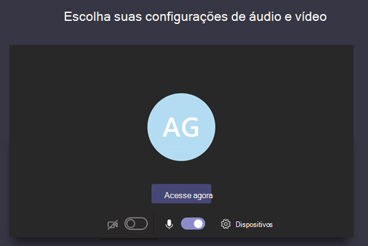

# Gerenciar políticas de reunião no TeamsManage meeting policies in Teams

::: zone target="docs"
Use as políticas de reunião para controlar os recursos disponíveis para os participantes de reuniões agendadas por usuários em sua organização.Use meeting policies to control the features that are available to meeting participants for meetings that are scheduled by users in your organization. Você pode usar a política global (padrão em toda a organização) criada automaticamente ou criar e atribuir políticas personalizadas. You can use the global (Org-wide default) policy that's automatically created or create and assign custom policies. Você gerencia as políticas de reunião no Centro de Administração do Microsoft Teams ou usando o [PowerShell](teams-powershell-overview.md).You manage meeting policies in the Microsoft Teams admin center or by using [PowerShell](teams-powershell-overview.md).

> [!NOTE]
> Para obter informações sobre como usar as funções para gerenciar as permissões de apresentadores e participantes da reunião, confira [funções em uma reunião no Teams](https://support.microsoft.com/office/roles-in-a-teams-meeting-c16fa7d0-1666-4dde-8686-0a0bfe16e019?ui=en-us&rs=en-us&ad=us).For information about using roles to manage the permissions of meeting presenters and attendees, see [Roles in a Teams meeting](https://support.microsoft.com/office/roles-in-a-teams-meeting-c16fa7d0-1666-4dde-8686-0a0bfe16e019?ui=en-us&rs=en-us&ad=us).

Você pode implementar políticas das seguintes maneiras, o que afeta a experiência da reunião para os usuários antes, durante, ou depois de uma reunião.You can implement policies in the following ways, which affect the meeting experience for users before a meeting starts, during a meeting, or after a meeting.

|Tipo de implementaçãoImplementation type  |DescriçãoDescription  |
|---------|---------|
|Por organizadorPer-organizer    |Ao implementar uma política por organizador, todos os participantes da reunião herdam a política do organizador.When you implement a per-organizer policy, all meeting participants inherit the policy of the organizer. Por exemplo, **Admitir pessoas automaticamente** é uma política por organizador.For example, **Automatically admit people** is a per-organizer policy. Isso controla se os usuários entram na reunião diretamente ou se esperam o lobby de reuniões agendadas pelo usuário que atribuiu a política.It controls whether users join the meeting directly or wait in the lobby for meetings scheduled by the user who is assigned the policy.          |
|Por usuárioPer-user    |Ao implementar uma política por usuário, somente a política por usuário se aplica à restrições de certos recursos para o organizador e/ou os participantes da reunião.When you implement a per-user policy, only the per-user policy applies to restrict certain features for the organizer and/or meeting participants. Por exemplo, **Permitir Reunir agora nos canais** é uma política por usuário.For example, **Allow Meet now in channels** is a per-user policy.     |
|Por organizador e por usuárioPer-organizer and per-user     |Ao implementar uma combinação de uma política por organizador e por usuário, alguns recursos são restritos para os participantes da reunião com base em sua política e a política do organizador.When you implement a combination of a per-organizer and per-user policy, certain features are restricted for meeting participants based on their policy and the organizer's policy. Por exemplo, **Permitir gravação na nuvem** é uma política por organizador e por usuário.For example, **Allow cloud recording** is a per-organizer and per-user policy. Ative essa configuração para permitir que os usuários iniciem e parem uma gravação.Turn on this setting to allow users to start and stop a recording.

Você pode editar as configurações na política global ou criar e atribuir uma ou mais políticas personalizadas.You can edit the settings in the global policy or create and assign one or more custom policies. Os usuários terão a política global, a menos que você crie e atribua uma política personalizada.Users will get the global policy unless you create and assign a custom policy.

> [!NOTE]
> O botão detalhes da reunião estará disponível se um usuário tiver as licenças de conferência de áudio habilitadas ou se o usuário permitir a conferência de áudio, caso contrário, os detalhes da reunião não estarão disponíveis.Meeting details button will be available if a user has the audio conference licenses enabled or the user is allow for audio conferencing, if not, the meeting details will not be available.

## Criar uma política de reunião personalizadaCreate a custom meeting policy

1. Na barra de navegação à esquerda do Centro de Administração do Microsoft Teams, vá para **Reuniões** > **Políticas de Reunião**.In the left navigation of the Microsoft Teams admin center, go to **Meetings** > **Meeting policies**.
2. Selecione **Adicionar**.Select **Add**.
3. Insira um nome e uma descrição para a política.Enter a name and description for the policy. O nome não pode conter caracteres especiais ou ter mais de 64 caracteres.The name can't contain special characters or be longer than 64 characters.
4. Escolha as configurações que deseja.Choose the settings that you want.
5. Selecione **Salvar**.Select **Save**.

Por exemplo, digamos que você tenha um grupo de usuários e queira limitar a quantidade de largura de banda que a reunião exigiria.For example, say you have a bunch of users and you want to limit the amount of bandwidth that their meeting would require. Você criaria uma nova política personalizada chamada "Largura de banda limitada" e desativaria as seguintes configurações:You would create a new custom policy named "Limited bandwidth" and disable the following settings:

Em **Áudio e vídeo**:Under **Audio & video**:

- Desative a opção Permitir gravação na nuvem.Turn off Allow cloud recording.
- Desative a opção Permitir vídeo IP.Turn off Allow IP video.

Em **Compartilhamento de conteúdo**:Under **Content sharing**:

- Desative o modo de compartilhamento de tela.Disable screen sharing mode.
- Desative a opção Permitir quadro de comunicações.Turn off Allow whiteboard.
- Desative a opção Permitir anotações compartilhadas.Turn off Allow shared notes.

Em seguida, atribua a política aos usuários.Then assign the policy to the users.

## Editar uma política de retençãoEdit a meeting policy

Você pode editar a política global e as políticas personalizadas que criar.You can edit the global policy and any custom policies that you create.

1. Na barra de navegação à esquerda do Centro de Administração do Microsoft Teams, vá para **Reuniões** > **Políticas de Reunião**.In the left navigation of the Microsoft Teams admin center, go to **Meetings** > **Meeting policies**.
2. Escolha a política clicando à esquerda do nome da política e selecionando **Editar**.Select the policy by clicking to the left of the policy name, and then select **Edit**.
3. A partir daqui, faça as alterações desejadas.From here, make the changes that you want.
4. Selecione **Salvar**.Select **Save**.

> [!NOTE]
> Um usuário pode receber apenas uma política de reunião por vez.A user can be assigned only one meeting policy at a time.

## Atribuir uma política de reunião aos usuáriosAssign a meeting policy to users

[!INCLUDE [assign-policy](includes/assign-policy.md)]

> [!NOTE]
> Você não pode excluir uma política se usuários estiverem atribuídos a ela.You can't delete a policy if users are assigned to it. Primeiro, você deve atribuir uma política diferente a todos os usuários afetados. em seguida, é possível excluir a política original.You must first assign a different policy to all affected users, and then you can delete the original policy.

## Configurações de política de reuniãoMeeting policy settings

Selecione uma política existente na página **Políticas de reunião** ou selecione **Adicionar** para adicionar uma nova política.Select an existing policy on the **Meeting policies** page or select **Add** to add a new policy. Defina as configurações para os seguintes.Configure settings for the following.

- [GeralGeneral](#meeting-policy-settings---general)
- [Áudio e vídeoAudio & video](#meeting-policy-settings---audio--video)
- [Compartilhamento de conteúdoContent sharing](#meeting-policy-settings---content-sharing)
- [Participantes e convidadosParticipants & guests](#meeting-policy-settings---participants--guests)

::: zone-end

## Configurações de política de reunião - GeralMeeting policy settings - General

- [Permitir Reunir Agora em canaisAllow Meet now in channels](#allow-meet-now-in-channels)
- [Permitir o suplemento do OutlookAllow the Outlook add-in](#allow-the-outlook-add-in)
- [Permitir o agendamento de reunião do canalAllow channel meeting scheduling](#allow-channel-meeting-scheduling)
- [Permitir o agendamento de reuniões privadasAllow scheduling private meetings](#allow-scheduling-private-meetings)
- [Permitir Reunir Agora em reuniões privadasAllow Meet now in private meetings](#allow-meet-now-in-private-meetings)

### Permitir Reunir agora nos canaisAllow Meet now in channels

Permitir que o **Reunir Agora** seja uma política por usuário e se aplicar antes de começar uma reunião.Allow **Meet now** is a per-user policy and applies before a meeting starts. Essa configuração controla se um usuário pode iniciar uma reunião não planejada em um canal do Teams.This setting controls whether a user can start an unplanned meeting in a Teams channel. Se você ativar essa configuração, os usuários poderão selecionar o botão **Reunir** para iniciar uma reunião não planejada ou agendar uma reunião no canal.If you turn on this setting, users can select the **Meet** button to start an unplanned meeting or schedule a meeting in the channel. O valor padrão é True.The default value is True.

### Permitir o suplemento do OutlookAllow the Outlook add-in

Permite que o suplemento do Outlook seja uma política por usuário e se aplica antes do início de uma reunião.Allow the Outlook add-in is a per-user policy and applies before a meeting starts. Essa configuração controla se as reuniões do Teams podem ser agendadas a partir do Outlook (Windows, Mac, Web e dispositivo móvel).This setting controls whether Teams meetings can be scheduled from within Outlook (Windows, Mac, web, and mobile).

Se você desabilitar esse recurso, os usuários não conseguirão agendar.If you turn off this feature, users are unable to schedule. As reuniões do Teams ao criar uma nova reunião no Outlook.Teams meetings when they create a new meeting in Outlook. Por exemplo, no Outlook no Windows, a opção **Nova reunião do Teams** não será exibida na faixa de opções.For example, in Outlook on Windows, the **New Teams Meeting** option won't show up in the ribbon.

### Permitir o agendamento de reunião do canalAllow channel meeting scheduling

Use a política existente AllowChannelMeetingScheduling para controlar os tipos de eventos que podem ser criados nos calendários do canal de equipe.Use the existing AllowChannelMeetingScheduling policy to control the types of events that can be created on the team channel calendars. Essa é uma política por usuário e se aplica antes de começar uma reunião.This is a per-user policy and applies before a meeting starts. Essa configuração controla se os usuários podem agendar uma reunião em um canal do Teams.This setting controls whether users can schedule a meeting in a Teams channel. Por padrão, essa configuração é ativada.By default, this setting is turned on.

Se essa política estiver desativada, os usuários não conseguirão criar novas reuniões de canal.If this policy is turned off, users can't create new channel meetings. No entanto, as reuniões existentes no canal podem ser editadas pelo organizador do evento.However, existing channel meetings can be edited by the organizer of the event.

Agendar uma reunião será desabilitada.Schedule a meeting will be disabled.

 

A seleção de canal está desabilitada.Channel selection is disabled.

Na página dos posts de canal, os seguintes recursos serão desabilitados:In the channel posts page, the following features will be disabled:

- Botão **Agendar uma reunião** na caixa de texto responder ao canal.**Schedule a meeting** button on the channel reply compose box.
  
  
- Botão **Agendar uma reunião** no cabeçalho do canal.**Schedule a meeting** button on the channel header.
  

No calendário do canal:In the channel calendar:

- Botão **Adicionar novo evento** no cabeçalho do calendário do canal será desabilitado.**Add new event** button on channel calendar header will be disabled.
  

- Os usuários não podem arrastar e selecionar um bloco de tempo no calendário do canal para criar uma reunião de canal.Users can't drag and select a time block on the channel calendar to create a channel meeting.

- Os usuários não podem usar atalhos de teclado para criar uma reunião no calendário do canal.Users can't use Keyboard shortcuts to create a meeting on the channel calendar.

No Centro de Administração:In the admin center:

O aplicativo de calendário de canal será mostrado na seção **Aplicativos da Microsoft** na página de políticas de permissão do aplicativo.The channel calendar app will show up in the **Microsoft apps** section on the app permission policies page.

 

### Permitir o agendamento de reuniões particularesAllow scheduling private meetings

O agendamento de reuniões privadas é uma política por usuário e se aplica antes do início de uma reunião.Scheduling private meetings is a per-user policy and applies before a meeting starts. Essa configuração controla se os usuários podem agendar reuniões particulares no Teams.This setting controls whether users can schedule private meetings in Teams. Uma reunião é particular quando não é publicada em um canal de uma equipe.A meeting is private when it's not published to a channel in a team.

Se você desabilitar **Permitir agendamento de reuniões** privadas e **Permitir agendamento de reunião** de canal, as opções **Adicionar participantes necessários** e **Adicionar canal** serão desabilitadas para usuários no Teams.If you turn off **Allow scheduling private meetings** and **Allow channel meeting scheduling**, the **Add required attendees** and **Add channel** options are disabled for users in Teams. Por padrão, essa configuração é ativada.By default, this setting is turned on.

### Permitir Reunir Agora em reuniões particularesAllow Meet now in private meetings

Essa é uma política por usuário e se aplica antes de começar uma reunião.This is a per-user policy and applies before a meeting starts. Essa configuração controla se um usuário pode iniciar uma reunião privada não planejada.This setting controls whether a user can start an unplanned private meeting. Por padrão, essa configuração é ativada.By default, this setting is turned on.

## Configurações de política de reunião - Áudio e vídeoMeeting policy settings - Audio & video

- [Permitir transcriçãoAllow transcription](#allow-transcription)
- [Permitir gravação em nuvemAllow cloud recording](#allow-cloud-recording)
- [Modo de áudio IPMode for IP audio](#mode-for-ip-audio)
- [Modo de vídeo IPMode for IP video](#mode-for-ip-video)
- [Permitir vídeo IPAllow IP video](#allow-ip-video)
- [Taxa de bits de mídia (Kbs)Media bit rate (Kbs)](#media-bit-rate-kbs)

### Permitir transcriçãoAllow transcription

Essa política ativa a Transcrição ao vivo.This policy turns on Live transcription. Permitir transcrição é uma política por usuário.Allow transcription is a per-user policy. Essa configuração controla se essa específica reunião do Teams pode ser transcrita.This setting controls whether this specific Team's meeting can be transcribed.

A transcrição ao vivo mostra a conversão de fala em texto do conteúdo falado durante uma reunião do Teams em tempo real.Live transcription shows speech-to-text of spoken content during a Teams meeting in near real time. O texto aparece junto com o vídeo da reunião, incluindo o nome do locutor e um carimbo de data/hora.The text appears alongside the meeting video, including the speaker's name and a time stamp. Para saber mais, confira [Exibir transcrição ao vivo em uma reunião do Teams](https://support.microsoft.com/office/view-live-transcription-in-a-teams-meeting-dc1a8f23-2e20-4684-885e-2152e06a4a8b).To learn more, see [View live transcription in a Teams meeting](https://support.microsoft.com/office/view-live-transcription-in-a-teams-meeting-dc1a8f23-2e20-4684-885e-2152e06a4a8b).

Atualmente, a transcrição ao vivo tem suporte para o cliente de área de trabalho do Teams.Currently, live transcription is supported on the Teams desktop client. A transcrição tem suporte para o inglês falado dos EUA.Transcription is supported for spoken U.S. English. A transcrição fica disponível após a reunião na área de trabalho ou na Web do Teams.The transcript is available after the meeting on Teams desktop or web.

Veja como as configurações de política **Permitir transcrição** e **Permitir gravação na nuvem** funcionam juntas.Here's how the **Allow transcription** and **Allow cloud recording** policy settings work together. A tabela a seguir descreve os valores para essas configurações e o comportamento da reunião.The following table describes the values for these settings and the meeting behavior.

|Permitir transcriçãoAllow transcription|Permitir gravação na nuvemAllow cloud recording|ComportamentoBehavior|
|---------|---------|---------|
|**Ativado****On**|**Ativado****On**|A opção **Iniciar transcrição** está disponível nas reuniões do Teams.The **Start transcription** option is available in Teams meetings. O organizador ou os participantes da reunião podem iniciar e parar a transcrição.The meeting organizer or meeting participants can start and stop transcription. A opção **Iniciar gravação** está disponível nas reuniões do Teams.The **Start recording** option is available in Teams meetings. O organizador ou os participantes da reunião podem iniciar e parar a gravação.The meeting organizer or meeting participants can start and stop recording. |
|**Ativado****On**|**Desativado****Off**|A opção **Iniciar transcrição** está disponível nas reuniões do Teams.The **Start transcription** option is available in Teams meetings. A opção **Iniciar gravação** não está disponível nas reuniões do Teams.The **Start recording** option isn't available in Teams meetings. |
|**Desativado****Off**|**Ativado****On**|A opção **Iniciar gravação** está disponível nas reuniões do Teams.The **Start recording** option is available in Teams meetings. A opção **Iniciar transcrição** não está disponível nas reuniões do Teams.The **Start transcription** option isn't available in Teams meetings.|
|**Desativado****Off**|**Desativado****Off**|A gravação e a transcrição não estão disponíveis nas reuniões do Teams.Recording and transcription aren't available in Teams meetings.  |

### Permitir gravação na nuvemAllow cloud recording

A opção Permitir gravação na nuvem é controlada através de uma política por usuário.Allow cloud recording is controlled at a per-user policy. Essa configuração controla se um usuário pode gravar.This setting controls whether a user can record. A gravação poderá ser iniciada pelo organizador da reunião ou por outro participante da reunião se sua configuração de política específica for ativada, e se for um usuário autenticado da mesma organização que o organizador.The recording can be started by the meeting organizer or by another meeting participant if their specific policy setting is turned on and if they're an authenticated user from the same organization as the organizer.

Pessoas de fora da sua organização, como usuários federados e anônimos, não conseguem iniciar a gravação.People outside your organization, such as federated and anonymous users, can't start the recording. Os usuários convidados não podem iniciar ou interromper a gravação.Guest users can't start or stop the recording.

Para saber mais sobre a gravação de reunião na nuvem, confira [Gravação de reunião na nuvem do Teams](cloud-recording.md).To learn more about cloud meeting recording, see [Teams cloud meeting recording](cloud-recording.md).

### Modo de áudio IPMode for IP audio

O modo de áudio IP é uma política por usuário.Mode for IP audio is a per-user policy. Essa configuração controla se o áudio pode ser habilitado em reuniões e chamadas em grupo.This setting controls whether audio can be turned on in meetings and group calls. Esses são os valores dessa configuração.Here are the values for this setting.

|Valor de configuraçãoSetting value |ComportamentoBehavior  |
|---------|---------|
|**Áudio de saída e entrada habilitado****Outgoing and incoming audio enabled**    |O vídeo de saída e entrada, que é permitido na reunião, é a configuração padrão.Outgoing and incoming audio is allowed in the meeting. This is the default setting. |
|**Desabilitado****Disabled**     |O áudio de entrada e saída não é permitido na reunião.Outgoing and incoming audio is turned off in the meeting.     |

Se definido como **Desabilitado** para um usuário, esse usuário ainda poderá agendar e organizar reuniões, mas não poderá usar o áudio.If set to **Disabled** for a user, that user can still schedule and organize meetings but can't use audio. Para participar de uma reunião, o usuário deve discar por meio da PSTN (Rede Telefônica Pública Comutada) ou fazer com que a reunião seja chamada e ingressar o usuário por telefone.To join a meeting, the user has to dial in through the Public Switched Telephone Network (PSTN) or have the meeting call to join the user by phone. Os participantes da reunião que não têm políticas atribuídas (por exemplo, participantes anônimos) têm essa configuração para **Áudio de saída e de entrada habilitado** por padrão.Meeting participants who don't have any policies assigned (for example, anonymous participants) have this set to **Outgoing and incoming audio enabled** by default. Em clientes móveis do Teams, se essa configuração estiver desabilitada, o usuário precisará discar para a reunião por meio da PSTN.On Teams mobile clients, if this setting is disabled, the user has to dial in to the meeting through the PSTN.

Essa configuração não se aplica à chamadas 1:1.This setting doesn't apply to 1:1 calls. Para restringir chamadas 1:1, configure uma [política de chamada](teams-calling-policy.md) e desabilite a configuração **Fazer chamadas privadas**.To restrict 1:1 calls, configure a Teams [calling policy](teams-calling-policy.md) and turn off the **Make private calls** setting. Essa configuração também não se aplica aos dispositivos da sala de conferência, como dispositivos de Surface Hub e Salas do Microsoft Teams. This setting also doesn't apply to conference room devices such as Surface Hub and Microsoft Teams Rooms devices.

Essa configuração ainda não está disponível para ambientes de Nuvem da Comunidade Governamental (GCC) da Microsoft 365, GCC Altos ou para o Departamento de Defesa (DoD).This setting isn't yet available for Microsoft 365 Government Community Cloud (GCC), GCC High, or Department of Defense (DoD) environments.

Para saber mais, confira [Gerenciar áudio/vídeo para participantes da reunião](#manage-audiovideo-for-meeting-participants).To learn more, see [Manage audio/video for meeting participants](#manage-audiovideo-for-meeting-participants).

### Modo de vídeo IPMode for IP video

O modo de vídeo IP é uma política por usuário.Mode for IP video is a per-user policy. Essa configuração controla se o vídeo pode ser habilitado em reuniões e chamadas em grupo.This setting controls whether video can be turned on in meetings and group calls. Esses são os valores dessa configuração.Here are the values for this setting.

|Valor de configuraçãoSetting value |ComportamentoBehavior  |
|---------|---------|
|**Vídeo de saída e entrada habilitado****Outgoing and incoming video enabled**    | O vídeo de saída e entrada, que é permitido na reunião, é a configuração padrão.Outgoing and incoming video is allowed in the meeting is the default setting. |
|**Desabilitado****Disabled**     | O vídeo de entrada e saída não é permitido na reunião.Outgoing and incoming video is turned off in the meeting. Em clientes móveis do Teams, os usuários não podem compartilhar vídeos ou fotos na reunião.On Teams mobile clients, users can't share videos or photos in the meeting.   Se o **Modo de áudio IP** estiver desabilitado, o **Modo de vídeo IP** também permanecerá desabilitado.If **Mode for IP audio** is disabled, then **Mode for IP video** will also remain disabled.  |

Se definido como **Desabilitado** para um usuário, esse usuário não poderá ativar o vídeo ou exibir vídeos compartilhados por outros participantes da reunião.If set to **Disabled** for a  user, that user can't turn on video or view videos shared by other meeting participants. Os participantes da reunião que não têm políticas atribuídas (por exemplo, participantes anônimos) têm essa configuração para **Vídeo de saída e de entrada habilitado** por padrão.Meeting participants who don't have any policies assigned (for example, anonymous participants) have this set to **Outgoing and incoming video enabled** by default.

Essa configuração não se aplica aos dispositivos da sala de conferência, como dispositivos de Surface Hub e Salas do Microsoft Teams. This setting doesn't apply to conference room devices such as Surface Hub and Microsoft Teams Rooms devices.

Essa configuração ainda não está disponível para ambientes de Nuvem da Comunidade Governamental (GCC) da Microsoft 365, GCC Altos ou para o Departamento de Defesa (DoD).This setting isn't yet available for Microsoft 365 Government Community Cloud (GCC), GCC High, or Department of Defense (DoD) environments.

> [!NOTE]
> Lembre-se de que essa configuração controla o vídeo de saída e de entrada, enquanto a configuração **Permitir vídeo IP** controla o vídeo de saída.Keep in mind that this setting controls both outgoing and incoming video whereas the **Allow IP video** setting controls outgoing video. Para saber mais, confira [Qual configuração de política de vídeo IP tem prioridade?](#which-ip-video-policy-setting-takes-precedence) e [Gerenciar áudio/vídeo para os participantes da reunião](#manage-audiovideo-for-meeting-participants).To learn more, see [Which IP video policy setting takes precedence?](#which-ip-video-policy-setting-takes-precedence) and [Manage audio/video for meeting participants](#manage-audiovideo-for-meeting-participants).

Para saber mais, confira [Gerenciar áudio/vídeo para participantes da reunião](#manage-audiovideo-for-meeting-participants).To learn more, see [Manage audio/video for meeting participants](#manage-audiovideo-for-meeting-participants).

### Permitir vídeo IPAllow IP video

Permitir vídeo IP é uma combinação de política por usuário e por organizador.Allow IP video is a combination of a per-organizer and per-user policy. O vídeo é um componente fundamental para reuniões.Video is a key component to meetings. Em algumas organizações, os administradores podem querer ter mais controle sobre quais reuniões têm vídeo.In some organizations, admins might want more control over which users' meetings have video. Essa configuração controla se o vídeo pode ser habilitado em reuniões hospedadas por um usuário e em chamadas 1:1 e de grupo iniciadas por um usuário.This setting controls whether video can be turned on in meetings hosted by a user and in 1:1 and group calls started by a user. Em clientes móveis do Teams, essa configuração controla se os usuários podem compartilhar fotos e vídeos em uma reunião.On Teams mobile clients, this setting control whether users can share photos and videos in a meeting.

As reuniões organizadas por um usuário que possui essa configuração de política habilitada permitem o compartilhamento de vídeo na reunião pelos participantes da reunião, caso os participantes também tenham a configuração de política habilitada.Meetings organized by a user who has this policy setting enabled, allow video sharing in the meeting by the meeting participants, if the participants also have the policy setting enabled. Os participantes da reunião que não possuem políticas atribuídas (por exemplo, participantes anônimos e federados) herdam a política do organizador da reunião.Meeting participants who don't have any policies assigned (for example, anonymous and federated participants) inherit the policy of the meeting organizer.

> [!NOTE]
> Lembre-se de que essa configuração controla o vídeo de saída, enquanto a configuração **Modo de vídeo IP** controla o vídeo de entrada e saída.Keep in mind that this setting controls outgoing video whereas the **Mode for IP video** setting controls both outgoing and incoming video. Para saber mais, confira [Qual configuração de política de vídeo IP tem prioridade?](#which-ip-video-policy-setting-takes-precedence) e [Gerenciar áudio/vídeo para os participantes da reunião](#manage-audiovideo-for-meeting-participants).To learn more, see [Which IP video policy setting takes precedence?](#which-ip-video-policy-setting-takes-precedence) and [Manage audio/video for meeting participants](#manage-audiovideo-for-meeting-participants).

| Cliente Teams da Web e da área de trabalhoTeams desktop and web client |Cliente de dispositivo móvel do TeamsTeams mobile client  |
|:-------:|:-------:|
|    |          |

Observe o exemplo a seguir.Let's look at the following example.

|UsuárioUser |Políticas de reuniãoMeeting policy  |Permitir vídeo IPAllow IP video |
|---------|---------|---------|
|DanielaDaniela   | GlobalGlobal   | HabilitadoOn       |
|AmandaAmanda    | Location1MeetingPolicyLocation1MeetingPolicy        | DesabilitadoOff      |

Reuniões hospedadas pela Daniela permitem que o vídeo seja habilitado.Meetings hosted by Daniela allow video to be turned on. A Daniela pode entrar na reunião e ativar o vídeo.Daniela can join the meeting and turn on video. A Amanda não pode ativar o vídeo na reunião da Daniela, pois a política da Amanda está definida para não permitir vídeo.Amanda can't turn on video in Daniela's meeting, because Amanda's policy is set to not allow video. A Amanda pode ver os vídeos compartilhados por outros participantes da reunião.Amanda can see videos shared by other participants in the meeting.

Nas reuniões hospedadas por Amanda, ninguém poderá ativar o vídeo, independentemente da política de vídeo atribuída a eles.In meetings hosted by Amanda, no one can turn on video, regardless of the video policy assigned to them. Isso significa que a Daniela não pode ativar o vídeo nas reuniões da Amanda.This means Daniela can't turn on video in Amanda's meetings.  

Se Daniela liga para a Amanda com o vídeo habilitado, a Amanda poderá atender à chamada somente com o áudio.If Daniela calls Amanda with video on, Amanda can answer the call with audio only. Quando a chamada estiver conectada, a Amanda poderá ver o vídeo da Daniela, mas não poderá ativar o vídeo.When the call is connected, Amanda can see Daniela's video, but can't turn on video. Se a Amanda liga para a Daniela, Daniela poderá atender à chamada com vídeo e áudio.If Amanda calls Daniela, Daniela can answer the call with video and audio. Quando a chamada estiver conectada, a Daniela poderá ativar ou desativar o vídeo, se necessário.When the call is connected, Daniela can turn on or turn off her video, as needed.

Para saber mais, confira [Gerenciar áudio/vídeo para participantes da reunião](#manage-audiovideo-for-meeting-participants).To learn more, see [Manage audio/video for meeting participants](#manage-audiovideo-for-meeting-participants).

#### Qual configuração de política de vídeo IP tem prioridadeWhich IP video policy setting takes precedence

Para um usuário, a configuração de política mais restritiva para o vídeo tem prioridade. Veja alguns exemplos.For a user, the most restrictive policy setting for video takes precedence. Here's some examples.

|Permitir vídeo IPAllow IP video|Modo de vídeo IPMode for IP video|Experiência de compartilhamentoMeeting experience|
|---------|---------|---------|
|Organizador: **Habilitado**Organizer: **On**  Participante: **Habilitado**Participant: **On** |Participante: **Desabilitado**Participant: **Disabled**        |A configuração **Modo para vídeo IP** tem prioridade.The **Mode for IP video** setting takes precedence. O participante atribuído a essa política não poderá ativar nem exibir vídeos compartilhados por outras pessoas.The participant who is assigned this policy can't turn on or view videos shared by others.|
|Organizador: **Habilitado**Organizer: **On**  Participante: **Habilitado**Participant: **On** |Participante: **Vídeo de saída e de entrada habilitado**Participant: **Outgoing and incoming video enabled**          |O participante atribuído a essa política poderá ativar e exibir vídeos compartilhados por outras pessoas.The participant who is assigned this policy can turn on or view videos shared by others.         |
|Organizador: **Habilitado**Organizer: **On**  Participante: **Desabilitado**Participant: **Off** |Participante: **Vídeo de saída e de entrada habilitado**Participant: **Outgoing and incoming video enabled**         |A configuração **Permitir modo de vídeo IP** tem prioridade.The **Allow IP video** setting takes precedence. Os participantes só poderão ver os vídeos recebidos e não poderão enviar vídeo de saída.Participants can only see incoming video and can't send outgoing video.         |
|Organizador: **Habilitado**Organizer: **On**  Participante: **Desabilitado**Participant: **Off** |Participante: **Desabilitado**Participant: **Disabled**         |A configuração **Modo de vídeo IP** tem prioridade.The **Mode for IP video** setting takes precedence. O participante não consegue ver o vídeo de entrada ou de saída.The participant can't see incoming or outgoing video.|
|Organizador: **Desabilitado**Organizer: **Off**    |       |A configuração **Permitir vídeo IP** tem prioridade porque está desativada para o organizador.The **Allow IP video** setting takes precedence because it's turned off for the organizer. Ninguém pode ativar o vídeo em reuniões organizadas pelo usuário que recebeu essa política.No one can turn on video in meetings organized by the user who is assigned this policy.         |

### Gerenciar áudio/vídeo para participantes da reuniãoManage audio/video for meeting participants

|Se desejar...If you want to...  |Definir as seguintes configurações de políticaSet the following policy settings  |
|---------|---------|
|Desabilitar áudio e vídeo para os participantes das reuniõesDisable audio and video for participants in meetings  |Modo de áudio IP: **Desabilitado**Mode for IP audio: **Disabled**  Modo de vídeo IP: **Desabilitado**Mode for IP video: **Disabled** Permitir vídeo IP: N/AAllow IP video: N/A       |
|Habilitar apenas vídeo e áudio de entrada para os participantes nas reuniõesEnable only incoming video and audio for participants in meetings  |Modo de áudio IP: **Áudio de entrada e saída habilitado**Mode for IP audio: **Outgoing and incoming audio enabled**  Modo de vídeo IP: **Vídeo de entrada e saída habilitado**Mode for IP video: **Outgoing and incoming video enabled** Permitir vídeo IP: **Desativado**Allow IP video: **Off**       |
|Desabilitar o vídeo para os participantes nas reuniões (os participantes só têm áudio)Disable video for participants in meetings (participants have audio only)|  Modo de áudio IP: **Habilitar o áudio de entrada e saída**Mode for IP audio: **Enable outgoing and incoming audio**  Modo de vídeo IP: **Desabilitado**Mode for IP video: **Disabled** Permitir vídeo IP: N/AAllow IP video: N/A
|Habilitar áudio e vídeo para os participantes das reuniõesEnable audio and video for participants in meetings    |Modo de áudio IP: **Áudio de entrada e saída habilitado** (padrão)Mode for IP audio: **Outgoing and incoming audio enabled** (default)  Modo de vídeo IP: **Vídeo de entrada e saída habilitado** (padrão)Mode for IP video: **Outgoing and incoming video enabled** (default) Permitir vídeo IP: **Habilitado** (padrão)Allow IP video: **On** (default)    |

A política mais restritiva entre a política do organizador da reunião e a política do usuário será aplicada.The most restrictive policy between the meeting organizer’s policy and the user’s policy applies. Por exemplo, se um organizador tiver uma política que restringe vídeo e a política de um usuário não restringe vídeo, os participantes da reunião herdam a política do organizador da reunião e não têm acesso ao vídeo em reuniões.For example, if an organizer has a policy that restricts video and a user’s policy doesn't restrict video, meeting participants inherit the policy of the meeting organizer and don't have access to video in meetings. Isso significa que eles podem ingressar à reunião apenas com o áudio.This means that they can join the meeting with audio only.

> [!NOTE]
> Quando um usuário iniciar uma chamada de grupo para entrar por telefone, a tela **Usar telefone para áudio** não será exibida.When a user starts a group call to join by phone, the **Use phone for audio** screen doesn't appear. Esse é um problema conhecido que estamos trabalhando para resolver.This is a known issue that we're working to resolve. Para evitar esse problema, selecione **Áudio do telefone** em **Outras opções de ingresso**.To work around this issue, select **Phone audio** under **Other join options**.  

#### Cliente de dispositivo móvel do TeamsTeams mobile clients

Para os usuários do Teams em dispositivo móvel, a capacidade de compartilhar fotos e vídeos durante uma reunião também é determinada pela configuração **Permitir vídeo IP** ou **Modo de vídeo de IP**.For users on Teams mobile clients, the ability to share photos and videos during a meeting is determined by the **Allow IP video** or **IP video mode** setting. Dependendo da configuração da política, a capacidade de compartilhar vídeos e fotos não estará disponível.Depending on which policy setting takes precedence, the ability to share videos and photos won't be available. Isso não afeta o compartilhamento de tela, que você configura usando um modo separado de [Compartilhamento de tela](#screen-sharing-mode).This doesn't affect screen sharing, which you configure using a separate [Screen sharing mode](#screen-sharing-mode) setting. Além disso, você pode definir uma [Política de mobilidade do Teams](/powershell/module/skype/new-csteamsmobilitypolicy) para impedir que os usuários móveis usem o vídeo por meio de uma conexão de rede celular, o que significa que devem usar uma conexão WiFi.Additionally, you can set a [Teams mobility policy](/powershell/module/skype/new-csteamsmobilitypolicy) to prevent mobile users from using IP video over a cellular connection, which means they must use a WiFi connection.

### Taxa de bits de mídia (Kbs)Media bit rate (Kbs)

Essa é uma política por usuário.This is a per-user policy. Esta configuração determina a taxa média total de bits da mídia para as transmissões de compartilhamento de áudio, vídeo e aplicativos baseados em vídeo em chamadas e reuniões do usuário.This setting determines the total average media bit rate for audio, video, and video-based app sharing transmissions in calls and meetings for the user. Ela é aplicada à travessia da mídia de uplink e de downlink para os usuários da chamada ou da reunião.It's applied to both the uplink and downlink media traversal for users in the call or meeting. Essa configuração oferece controle meticuloso sobre o gerenciamento de largura de banda na sua organização.This setting gives you granular control over managing bandwidth in your organization. Dependendo dos cenários de reuniões necessários para os usuários, recomendamos o uso de largura de banda suficiente para ter uma boa experiência de qualidade.Depending on the meetings scenarios required by users, we recommend having enough bandwidth in place for a good quality experience. O valor mínimo é de 30 kbps e o valor máximo depende do cenário da reunião.The minimum value is 30 Kbps and the maximum value depends on the meeting scenario. Para saber mais sobre a largura de banda mínima recomendável para reuniões em boas-qualidade, chamadas e eventos ao vivo no Teams, confira [Requisitos de largura de banda](prepare-network.md#bandwidth-requirements).To learn more about the minimum recommended bandwidth for good quality meetings, calls, and live events in Teams, see [Bandwidth requirements](prepare-network.md#bandwidth-requirements).

Se não houver largura de banda suficiente para uma reunião, os participantes verão uma mensagem que indica uma qualidade de rede ruim.If there isn't enough bandwidth for a meeting, participants see a message that indicates poor network quality.

Para reuniões que precisem da experiência de qualidade de vídeo mais alta, como as reuniões da diretoria e eventos ao vivo do Teams, recomendamos que você defina a largura de banda como 10 Mbps.For meetings that need the highest-quality video experience, such as CEO board meetings and Teams live events, we recommend you set the bandwidth to 10 Mbps. Mesmo quando a experiência máxima é definida, a pilha das mídias da do Teams se adapta às condições de baixa largura de banda quando determinadas condições de rede são detectadas, dependendo do cenário.Even when the maximum experience is set, the Teams media stack adapts to low-bandwidth conditions when certain network conditions are detected, depending on the scenario.

## Configurações de política de reunião - Compartilhamento de conteúdoMeeting policy settings - Content sharing

- [Modo de compartilhamento de telaScreen sharing mode](#screen-sharing-mode)
- [Permitir que um participante conceda ou solicite o controleAllow a participant to give or request control](#allow-a-participant-to-give-or-request-control)
- [Permitir que um participante externo conceda ou solicite o controleAllow an external participant to give or request control](#allow-an-external-participant-to-give-or-request-control)
- [Permitir o compartilhamento do PowerPointAllow PowerPoint sharing](#allow-powerpoint-sharing)
- [Permitir quadro de comunicaçõesAllow whiteboard](#allow-whiteboard)
- [Permitir anotações compartilhadasAllow shared notes](#allow-shared-notes)

### Modo de compartilhamento de telaScreen sharing mode

> [!NOTE]
> Esse recurso ainda está em desenvolvimento. O compartilhamento de tela é uma política por participante, no entanto, pode ser afetado pelas configurações de compartilhamento de tela do organizador, conforme descrito nesta seção.This feature is still in development. Screen sharing is a per-participant policy, however, it can be affected by the organizer's screen sharing settings, as described in this section.

Essa configuração controla se a área de trabalho e/ou o compartilhamento de janela é permitido na reunião do usuário.This setting controls whether desktop and/or window sharing is allowed in the user's meeting. Os participantes da reunião que não possuem políticas atribuídas (por exemplo, participantes anônimos e federados, convidado, B2B) herdam a política do organizador da reunião.Meeting participants who don't have any policies assigned (for example, anonymous, guest, B2B, and federated participants) inherit the policy of the meeting organizer.

|Valor de configuraçãoSetting value |ComportamentoBehavior  |
|---------|---------|
|**Tela inteira****Entire screen**    | Compartilhamento completo de área de trabalho e compartilhamento de aplicativos são permitidos na reuniãoFull desktop sharing and application sharing are allowed in the meeting |
|**Único aplicativo****Single application**   | O compartilhamento de aplicativos é permitido na reuniãoApplication sharing is allowed in the meeting        |
|**Desabilitado****Disabled**     |Compartilhamento de tela e compartilhamento de aplicativos desativados na reunião.Screen sharing and application sharing turned off in the meeting.       |

Observe o exemplo a seguir.Let's look at the following example.

|UsuárioUser |Políticas de reuniãoMeeting policy |Modo de compartilhamento de telaScreen sharing mode |
|---------|---------|---------|
|DanielaDaniela  | GlobalGlobal   | Tela inteiraEntire screen |
|AmandaAmanda   | Location1MeetingPolicyLocation1MeetingPolicy  | DesabilitadoDisabled |

As reuniões hospedadas pela Daniela permitem que os participantes da reunião compartilhem toda a tela ou um aplicativo específico.Meetings hosted by Daniela allow meeting participants to share their entire screen or a specific application. Se a Amanda ingressar na reunião da Daniela, a Amanda não poderá compartilhar sua tela ou um determinado aplicativo, pois a configuração de política está desabilitada.If Amanda joins Daniela's meeting, Amanda can't share her screen or a specific application as her policy setting is disabled. Nas reuniões hospedadas por Amanda, ninguém tem permissão para compartilhar a tela ou um único aplicativo, independentemente da política de modo de compartilhamento de tela atribuída a eles.In meetings hosted by Amanda, no one is allowed to share their screen or a single application, regardless of the screen sharing mode policy assigned to them. Isso significa que a Daniela não pode compartilhar sua tela ou um único aplicativo nas reuniões da Amanda.This means that Daniela can't share her screen or a single application in Amanda's meetings.  

No momento, os usuários não podem reproduzir vídeo ou compartilhar a tela em uma reunião do Teams se estiverem usando o Google Chrome.Currently, users can't play video or share their screen in a Teams meeting if they're using Google Chrome.

### Permitir que um participante conceda ou solicite o controleAllow a participant to give or request control

Essa é uma política por usuário.This is a per-user policy. Essa configuração controla se o usuário pode conceder o controle da área de trabalho ou da janela para outros participantes da reunião.This setting controls whether the user can give control of the shared desktop or window to other meeting participants. Para dar controle, passe o mouse sobre a parte superior da tela.To give control, hover over the top of the screen.

Se essa configuração estiver ativada para o usuário, a opção **Atribuir controle** será exibida na barra superior de uma sessão de compartilhamento.If this setting is turned on for the user, the **Give Control** option is displayed in the top bar in a sharing session.

Se as configurações estiverem desativadas para o usuário, a opção **Conceder Controle** não estará disponível.If the setting is turned off for the user, the **Give Control** option isn't available.

Observe o exemplo a seguir.Let's look at the following example.

|UsuárioUser |Políticas de reuniãoMeeting policy  |Permitir que o participante conceda ou solicite o controleAllow participant to give or request control |
|---------|---------|---------|
|DanielaDaniela   | GlobalGlobal   | HabilitadoOn       |
|BabekBabek    | Location1MeetingPolicyLocation1MeetingPolicy        | DesabilitadoOff   |

A Daniela pode dar o controle da área de trabalho compartilhada ou da janela a outros participantes de uma reunião organizada por Babek, enquanto Babek não pode conceder o controle para outros participantes.Daniela can give control of the shared desktop or window to other participants in a meeting organized by Babek whereas Babek can't give control to other participants.

Para usar o PowerShell para controlar quem pode conceder controle ou aceitar solicitações de controle, use o cmdlet AllowParticipantGiveRequestControl.To use PowerShell to control who can give control or accept requests for control, use the AllowParticipantGiveRequestControl cmdlet.

> [!NOTE]
> Para conceder e assumir o controle do conteúdo compartilhado durante o compartilhamento, as duas partes devem usar o cliente da área de trabalho do Teams.To give and take control of shared content during sharing, both parties must be using the Teams desktop client. Não há suporte para controle quando ambas as partes estiverem executando o Teams em um navegador.Control isn't supported when either party is running Teams in a browser. Isso ocorre devido a uma limitação técnica de que estamos planejando corrigir.This is due to a technical limitation that we're planning to fix.

### Permitir que um participante externo conceda ou solicite o controleAllow an external participant to give or request control

Essa é uma política por usuário.This is a per-user policy. Se uma organização tiver esse conjunto para um usuário, não controla o que os participantes externos podem fazer, independentemente do que o organizador da reunião definiu.Whether an organization has this set for a user doesn't control what external participants can do, regardless of what the meeting organizer has set. Esse parâmetro controla se os participantes externos podem receber ou solicitar controle da tela de compartilhamento do participante, dependendo do que o participante do compartilhamento definiu dentro das políticas da sua organização.This parameter controls whether external participants can be given control or request control of the sharer's screen, depending on what the sharer has set within their organization's meeting policies. Os participantes externos nas reuniões das Teams podem ser categorizados da seguinte maneira:External participants in Teams meetings can be categorized as follows:  

- Usuário anônimoAnonymous user
- Usuários convidadosGuest users  
- Usuário B2BB2B user
- Usuário federadoFederated user  

Se os usuários federados podem conceder controle aos usuários externos enquanto o compartilhamento é controlado pela configuração **Permitir que um participante externo conceda ou solicite o controle** na organização.Whether federated users can give control to external users while sharing is controlled by the **Allow an external participant to give or request control** setting in their organization.

Para usar o PowerShell para controlar se os participantes externos podem conceder controle ou aceitar solicitações de controle, use o cmdlet AllowExternalParticipantGiveRequestControl.To use PowerShell to control whether external participants can give control or accept requests for control, use the AllowExternalParticipantGiveRequestControl cmdlet.

### Permitir compartilhamento do PowerPointAllow PowerPoint sharing

Essa é uma política por usuário.This is a per-user policy. Essa configuração controla se o usuário pode compartilhar os decks de slides do PowerPoint em uma reunião.This setting controls whether the user can share PowerPoint slide decks in a meeting. Os usuários externos, incluindo usuários anônimos, convidados e federados, herdam a política do organizador da reunião.External users, including anonymous, guest, and federated users, inherit the policy of the meeting organizer.

Observe o exemplo a seguir.Let's look at the following example.

|UsuárioUser |Políticas de reuniãoMeeting policy  |Permitir compartilhamento do PowerPointAllow PowerPoint sharing |
|---------|---------|---------|
|DanielaDaniela   | GlobalGlobal   | HabilitadoOn       |
|AmandaAmanda   | Location1MeetingPolicyLocation1MeetingPolicy        | DesabilitadoOff   |

Amanda não pode compartilhar os conjunto de slides do PowerPoint nas reuniões, mesmo que ela seja a organizadora da reunião.Amanda can't share PowerPoint slide decks in meetings even if she's the meeting organizer. Daniela pode compartilhar os conjunto de slides do PowerPoint mesmo se a reunião for organizada pela Amanda.Daniela can share PowerPoint slide decks even if the meeting is organized by Amanda. Amanda pode exibir os conjunto de slides do PowerPoint compartilhados por outras pessoas na reunião, apesar de não poder compartilhar os conjunto de slides do PowerPoint.Amanda can view the PowerPoint slide decks shared by others in the meeting, even though she can't share PowerPoint slide decks.

### Permitir o quadro de comunicaçõesAllow whiteboard

Essa é uma política por usuário.This is a per-user policy. Essa configuração controla se um usuário pode compartilhar o quadro de comunicações em uma reunião.This setting controls whether a user can share the whiteboard in a meeting. Os usuários externos, incluindo usuários anônimos, B2B e federados, herdam a política do organizador da reunião.External users, including anonymous, B2B, and federated users, inherit the policy of the meeting organizer.

Observe o exemplo a seguir.Let's look at the following example.

|UsuárioUser |Políticas de reuniãoMeeting policy  |Permitir o quadro de comunicaçõesAllow whiteboard|
|---------|---------|---------|
|DanielaDaniela   | GlobalGlobal   | HabilitadoOn       |
|AmandaAmanda   | Location1MeetingPolicyLocation1MeetingPolicy        | DesabilitadoOff   |

Amanda não pode compartilhar o quadro de comunicações em uma reunião, mesmo que ela seja a organizadora da reunião.Amanda can't share the whiteboard in a meeting even if she's the meeting organizer. Daniela pode compartilhar o quadro de comunicações mesmo se uma reunião for organizada por Amanda.Daniela can share the whiteboard even if a meeting is organized by Amanda.  

### Permitir notas compartilhadasAllow shared notes

Essa é uma política por usuário.This is a per-user policy. Essa configuração controla se um usuário pode criar e compartilhar anotações em uma reunião.This setting controls whether a user can create and share notes in a meeting. Os usuários externos, incluindo usuários anônimos, B2B e federados, herdam a política do organizador da reunião.External users, including anonymous, B2B, and federated users, inherit the policy of the meeting organizer. A guia **Anotações da Reunião** tem suporte em reuniões com até 100 participantes.The **Meeting Notes** tab is supported in meetings with up to 100 participants.

Observe o exemplo a seguir.Let's look at the following example.

|UsuárioUser |Políticas de reuniãoMeeting policy  |Permitir notas compartilhadasAllow shared notes |
|---------|---------|---------|
|DanielaDaniela   | GlobalGlobal   | HabilitadoOn       |
|AmandaAmanda   | Location1MeetingPolicyLocation1MeetingPolicy | DesabilitadoOff |

Daniela pode fazer anotações nas reuniões da Amanda e a Amanda não pode fazer anotações em qualquer reunião.Daniela can take notes in Amanda's meetings and Amanda can't take notes in any meetings.

<!-- Bookmark used by Context Sensitive Help (CSH). Do not delete. -->

<!-- Do not remove the bookmark link above. -->

## Configurações de política de reunião - Participantes e convidadosMeeting policy settings - Participants & guests

Essas configurações controlam quais participantes da reunião devem aguardar no lobby, antes que eles sejam admitidos na reunião e o nível de participação deles permitidos em uma reunião.These settings control which meeting participants wait in the lobby before they are admitted to the meeting and the level of participation they are allowed in a meeting.

- [Permitir que pessoas anônimas iniciem uma reuniãoLet anonymous people start a meeting](#let-anonymous-people-start-a-meeting)
- [Admitir pessoas automaticamenteAutomatically admit people](#automatically-admit-people)
- [Permitir que os usuários de acesso telefônico ignorem o lobbyAllow dial-in users to bypass the lobby](#allow-dial-in-users-to-bypass-the-lobby)
- [Permitir que os membros da equipe ignorem o lobbyAllow team members to bypass the lobby](#allow-team-members-to-bypass-the-lobby)
- [Habilitar legendas ao vivoEnable live captions](#enable-live-captions)
- [Permitir chat em reuniõesAllow chat in meetings](#allow-chat-in-meetings)

> [!NOTE]
>As opções para ingressar em uma reunião variam, dependendo das configurações de cada grupo do Teams e do método de conexão.Options to join a meeting will vary, depending on the settings for each Teams group, and the connection method. Se o seu grupo tiver audioconferência e a usar para se conectar, confira [Audioconferência](./audio-conferencing-in-office-365.md).If your group has audio conferencing, and uses it to connect, see [Audio Conferencing](./audio-conferencing-in-office-365.md). Se o seu grupo do Teams não tiver audioconferência, confira [Participar de uma reunião do Teams](https://support.office.com/article/join-a-meeting-in-teams-1613bb53-f3fa-431e-85a9-d6a91e3468c9).If your Teams group doesn't have audio conferencing, refer to [Join a meeting in Teams](https://support.office.com/article/join-a-meeting-in-teams-1613bb53-f3fa-431e-85a9-d6a91e3468c9).

### Permitir que pessoas anônimas iniciem uma reuniãoLet anonymous people start a meeting

Essa é uma política por organizador que permite reuniões de conferência sem liderança.This is a per-organizer policy that allows for leaderless conferencing meetings. Essa configuração controla se usuários anônimos podem participar da reunião sem a presença de um usuário autenticado da organização.This setting controls whether anonymous users can join the meeting without an authenticated user from the organization in attendance. Por padrão, essa configuração está desativada, o que significa que usuários anônimos aguardam no lobby até que um usuário autenticado da organização ingresse na reunião.By default, this setting is turned off which means anonymous users will wait in the lobby until an authenticated user from the organization joins the meeting.

> [!NOTE]
> Se essa configuração estiver desativada e um usuário anônimo ingressar da reunião primeiro e for colocado no lobby, um usuário da organização deverá ingressar na reunião com um cliente do Teams para admitir o usuário do lobby. Não há controles de lobby disponíveis para usuários de acesso telefônico.If this setting is turned off and an anonymous user joins the meeting first and is placed in the lobby, an organization user must join the meeting with a Teams client to admit the user from the lobby. There are no lobby controls available for dialed in users.

### Aceitar pessoas automaticamenteAutomatically admit people

Esta é uma política por organizador.This is a per-organizer policy. Essa configuração controla se as pessoas participam de uma reunião ou esperam no lobby até que sejam admitidas por um usuário autenticado.This setting controls whether people join a meeting directly or wait in the lobby until they are admitted by an authenticated user. Essa configuração não se aplica aos usuários de acesso telefônico.This setting does not apply to dial-in users.

 Os organizadores de reuniões podem selecionar **Opções de reunião** no convite da reunião para alterar essa configuração para cada reunião agendada.Meeting organizers can select **Meeting Options** in the meeting invitation to change this setting for each meeting they schedule.

> [!NOTE]
> Nas opções da reunião, a configuração é rotulada "Quem pode ignorar o lobby". Se você alterar a configuração padrão para qualquer usuário, ela será aplicada a todas as novas reuniões organizadas por esse usuário e a qualquer reunião anterior em que o usuário não tiver modificado as Opções de reunião.In the meeting options the setting is labeled "Who can bypass the lobby". If you change the default setting for any user, it will apply to all new meetings organized by that user and any prior meetings where the user didn't modify Meeting options.
  
|Valor de configuraçãoSetting value  |Comportamento de ingressoJoin behavior |
|---------|---------|
|**Todos****Everyone**   |Todos os participantes da reunião participam da reunião diretamente, sem aguardar no lobby.All meeting participants join the meeting directly without waiting in the lobby. Isso inclui usuários autenticados, usuários externos de organizações confiáveis (federado), convidados e usuários anônimos.This includes authenticated users, external users from trusted organizations (federated), guests, and anonymous users.     |
|**Pessoas da minha organização e organizações confiáveis****People in my organization, trusted organizations, and guests**     |Usuários autenticados dentro da organização, incluindo usuários convidados e os usuários de organizações confiáveis, entram na reunião diretamente sem aguardar no lobby. Os usuários anônimos esperam no lobby.Authenticated users within the organization, including guest users and the users from trusted organizations, join the meeting directly without waiting in the lobby. Anonymous users wait in the lobby.   |
|**Pessoas na minha organização e convidados****People in my organization and guests**    |Usuários autenticados dentro da organização, incluindo usuários convidados, entram na reunião diretamente sem aguardar no lobby.Authenticated users from within the organization, including guest users, join the meeting directly without waiting in the lobby. Os usuários de organizações confiáveis e usuários anônimos aguardam o lobby.Users from trusted organizations and anonymous users wait in the lobby. Essa é a configuração padrão.This is the default setting.           |
|**Organizador somente****Organizer only**    |Somente os organizadores da reunião participam da reunião diretamente, sem aguardar no lobby.Only meeting organizers can join the meeting directly without waiting in the lobby. Todas as outras pessoas, incluindo os usuários autenticados dentro da organização, os usuários convidados, os usuários de organizações confiáveis e usuários anônimos devem aguardar no lobby.Everyone else, including authenticated users within the organization, guest users, users from trusted organizations and anonymous users must wait in the lobby.           |
|**Pessoas na minha organização****People in my organization**  |Usuários autenticados de dentro da organização, excluindo usuários convidados, ingressam na reunião diretamente, sem esperar no lobby.Authenticated users from within the organization, excluding guest users, join the meeting directly without waiting in the lobby. Convidados e usuários de organizações confiáveis e usuários anônimos aguardam no lobby.Guests and users from trusted organizations and anonymous users wait in the lobby.|

### Permitir que os usuários de acesso telefônico ignorem o lobbyAllow dial-in users to bypass the lobby

Esta é uma política por organizador.This is a per-organizer policy. Essa configuração controla se as pessoas que se conectam por telefone ingressam diretamente na reunião ou esperam o lobby, independentemente da configuração **Aceitar pessoas automaticamente**.This setting controls whether people who dial in by phone join the meeting directly or wait in the lobby regardless of the **Automatically admit people** setting. Por padrão, essa configuração é desabilitada.By default, this setting is turned off. Quando essa configuração estiver desativada, os usuários de acesso telefônico aguardarão no lobby até que um usuário da organização ingresse na reunião com um cliente do Teams e os admita.When this setting is turned off, dial-in users will wait in the lobby until an organization user joins the meeting with a Teams client and admits them. Quando essa configuração é ativada, os usuários de acesso telefônico ingressam automaticamente na reunião.When this setting is turned on, dial-in users will automatically join the meeting.

> [!NOTE]
> Se você alterar a configuração padrão para qualquer usuário, ela será aplicada a todas as novas reuniões organizadas por esse usuário e a qualquer reunião anterior em que o usuário não tiver modificado as Opções de reunião.If you change the default setting for any user, it will apply to all new meetings organized by that user and any prior meetings where the user didn't modify Meeting options.

### Permitir que os membros da equipe ignorem o lobbyAllow team members to bypass the lobby

As políticas de reunião têm uma configuração que permite aos membros da equipe ignorar o lobby da reunião.Meeting policies have a setting for letting team members bypass the meeting lobby. Adicionamos a opção EveryoneInCompanyExcludingGuests para que as pessoas na organização ignorem o lobby, mas excluam os usuários convidados de ignorar o lobby.We've added the EveryoneInCompanyExcludingGuests option for people in the organization to bypass the lobby but exclude guest users from bypassing the lobby.

### Habilitar legendas ao vivoEnable live captions

Essa é uma política por usuário e se aplica durante uma reunião.This is a per-user policy and applies during a meeting. Essa configuração controla se a opção **Ativar legendas ao vivo** está disponível para que o usuário ative e desative as legendas ao vivo nas reuniões que o usuário faz.This setting controls whether the **Turn on live captions** option is available for the user to turn on and turn off live captions in meetings that the user attends.  

|Valor de configuraçãoSetting value |ComportamentoBehavior  |
|---------|---------|
|**Desabilitado, mas o usuário pode ignorar****Disabled but the user can override**     | As legendas ao vivo não são automaticamente ativadas para o usuário durante uma reunião.Live captions aren't automatically turned on for the user during a meeting. O usuário verá a opção **Ativar legendas ao vivo** no menu flutuante (**...**) para ativá-las.The user sees the **Turn on live captions** option in the overflow (**...**) menu to turn them on. Essa é a configuração padrão.This is the default setting. |
|**Desabilitado****Disabled**     | As legendas ao vivo estão desabilitadas para o usuário durante uma reunião.Live captions are disabled for the user during a meeting. O usuário não tem a opção para ativá-las.The user doesn't have the option to turn them on.          |

### Permitir chat em reuniõesAllow chat in meetings

Essa é uma configuração por participante. Essa configuração controla se o chat de reunião é permitido na reunião do usuário.This is a per-participant setting. This setting controls whether meeting chat is allowed in the user's meeting.

## Configurações de política de reunião- Modo função de apresentador designadoMeeting policy settings - Designated presenter role mode

Essa é uma política por usuário.This is a per-user policy. Essa configuração permite alterar o valor padrão da configuração **Quem pode apresentar?** nas **Opções de reunião** no cliente Teams.This setting lets you change the default value of the **Who can present?** setting in **Meeting options** in the Teams client. Essa configuração de política afeta todas as reuniões, incluindo reuniões Reunir Agora.This policy setting affects all meetings, including Meet Now meetings.

A configuração **Quem pode apresentar?** permite que os organizadores de reunião escolham quem pode apresentar na reunião.The **Who can present?** setting lets meeting organizers choose who can be presenters in a meeting. Para saber mais, confira [Alterar as configurações de participante de uma reunião do Teams](https://support.microsoft.com/article/change-participant-settings-for-a-teams-meeting-53261366-dbd5-45f9-aae9-a70e6354f88e) e [Funções em uma reunião do Teams](https://support.microsoft.com/article/roles-in-a-teams-meeting-c16fa7d0-1666-4dde-8686-0a0bfe16e019).To learn more, see [Change participant settings for a Teams meeting](https://support.microsoft.com/article/change-participant-settings-for-a-teams-meeting-53261366-dbd5-45f9-aae9-a70e6354f88e) and [Roles in a Teams meeting](https://support.microsoft.com/article/roles-in-a-teams-meeting-c16fa7d0-1666-4dde-8686-0a0bfe16e019).

Você pode editar uma política de reunião do Teams existente usando o cmdlet [Set-CsTeamsMeetingPolicy](/powershell/module/skype/set-csteamsmeetingpolicy).You can edit an existing Teams meeting policy by using the [Set-CsTeamsMeetingPolicy](/powershell/module/skype/set-csteamsmeetingpolicy) cmdlet. Ou crie uma nova política de reunião do Teams usando o cmdlet [New-CsTeamsMeetingPolicy](/powershell/module/skype/new-csteamsmeetingpolicy) e atribua-a aos usuários.Or, create a new Teams meeting policy by using the [New-CsTeamsMeetingPolicy](/powershell/module/skype/new-csteamsmeetingpolicy) cmdlet and assign it to users.

Para especificar o valor padrão de **Quem pode apresentar?** configuração no Teams, defina o parâmetro **DesignatedPresenterRoleMode** para uma das seguintes configurações:To specify the default value of the **Who can present?** setting in Teams, set the **DesignatedPresenterRoleMode** parameter to one of the following settings:

- **EveryoneUserOverride**: todos os participantes da reunião podem ser apresentadores.**EveryoneUserOverride**:  All meeting participants can be presenters. Esse é o valor padrão.This is the default value. Esse parâmetro corresponde à configuração **Todos** no Teams.This parameter corresponds to the **Everyone** setting in Teams.
- **EveryoneInCompanyUserOverride**: os usuários autenticados na organização, incluindo os usuários convidados, podem ser apresentadores.**EveryoneInCompanyUserOverride**: Authenticated users in the organization, including guest users, can be presenters. Esse parâmetro corresponde à configuração **Pessoas na minha organização** no Teams.This parameter corresponds to the **People in my organization** setting in Teams.
- **OrganizerOnlyUserOverride**: somente o organizador da reunião pode ser um apresentador e todos os participantes da reunião são designados como participantes.**OrganizerOnlyUserOverride**: Only the meeting organizer can be a presenter and all meeting participants are designated as attendees. Esse parâmetro corresponde à configuração **Somente eu** no Teams.This parameter corresponds to the **Only me** setting in Teams.

Além disso, você pode editar essa política no Centro de administração do Teams.Additionally, you can edit this policy in the Teams admin center.

Lembre-se de que, depois de definir o valor padrão, os organizadores de reunião ainda poderão alterar essa configuração no Teams e escolher quem poderá apresentar nas reuniões agendadas por eles.Keep in mind that after you set the default value, meeting organizers can still change this setting in Teams and choose who can present in the meetings that they schedule.

## Configurações de política de reunião - relatório de participação da reuniãoMeeting policy settings - Meeting attendance report

Essa é uma política por usuário.This is a per-user policy. Essa configuração controla se o organizador da reunião pode baixar o relatório de participação da [Reunião](teams-analytics-and-reports/meeting-attendance-report.md).This setting controls whether meeting organizers can download the [meeting attendance report](teams-analytics-and-reports/meeting-attendance-report.md).

No momento, você só pode usar o PowerShell para definir essa configuração de política.Currently, you can only use PowerShell to configure this policy setting. Você pode editar uma política de reunião do Teams existente usando o cmdlet [Set-CsTeamsMeetingPolicy](/powershell/module/skype/set-csteamsmeetingpolicy).You can edit an existing Teams meeting policy by using the [Set-CsTeamsMeetingPolicy](/powershell/module/skype/set-csteamsmeetingpolicy) cmdlet. Ou crie uma nova política de reunião do Teams usando o cmdlet [New-CsTeamsMeetingPolicy](/powershell/module/skype/new-csteamsmeetingpolicy) e atribua-a aos usuários.Or, create a new Teams meeting policy by using the [New-CsTeamsMeetingPolicy](/powershell/module/skype/new-csteamsmeetingpolicy) cmdlet and assign it to users.

Para permitir que o organizador de uma reunião baixe o relatório de participação da reunião, defina o parâmetro **AllowEngagementReport** para **Habilitado**.To enable a meeting organizer to download the meeting attendance report, set the **AllowEngagementReport** parameter  to **Enabled**. Quando habilitada, a opção para baixar o relatório é exibida no painel **Participantes**.When enabled, the option to download the report is displayed in the **Participants** pane.

Para impedir que o organizador da reunião baixe o relatório, defina o parâmetro como **Desabilitado**.To prevent a meeting organizer from downloading the report, set the parameter to **Disabled**. Por padrão, essa configuração está desabilitada e a opção de baixar o relatório não está disponível.By default, this setting is disabled and the option to download the report isn't available.

## Configurações de política de reunião - provedor de reunião para o modo Uso ParaleloMeeting policy settings - Meeting provider for Islands mode

Essa é uma política por usuário.This is a per-user policy. Essa configuração controla qual suplemento de reunião do Outlook é usado para os *usuários que estão no modo Uso Paralelo*.This setting controls which Outlook meeting add-in is used for *users who are in Islands mode*. Você pode especificar se os usuários podem usar apenas o suplemento de reunião do Teams ou os suplementos de reunião do Teams e de reunião do Skype for Business para agendar reuniões no Outlook.You can specify whether users can only use the Teams Meeting add-in or both the Teams Meeting and Skype for Business Meeting add-ins to schedule meetings in Outlook.

Você só pode aplicar esta política aos usuários que estão no modo Uso Paralelo e possuem o parâmetro **AllowOutlookAddIn** definido como **Verdadeiro** na política de reunião do Teams.You can only apply this policy to users who are in Islands mode and have the **AllowOutlookAddIn** parameter set to **True** in their Teams meeting policy.

No momento, você só pode usar o PowerShell para definir essa política.Currently, you can only use PowerShell to set this policy. Você pode editar uma política de reunião do Teams existente usando o cmdlet [Set-CsTeamsMeetingPolicy](/powershell/module/skype/set-csteamsmeetingpolicy).You can edit an existing Teams meeting policy by using the [Set-CsTeamsMeetingPolicy](/powershell/module/skype/set-csteamsmeetingpolicy) cmdlet. Ou crie uma nova política de reunião do Teams usando o cmdlet [New-CsTeamsMeetingPolicy](/powershell/module/skype/new-csteamsmeetingpolicy) e atribua-a aos usuários.Or, create a new Teams meeting policy by using the [New-CsTeamsMeetingPolicy](/powershell/module/skype/new-csteamsmeetingpolicy) cmdlet and assign it to users.

Para especificar o suplemento de reunião que você deseja disponibilizar para os usuários, defina o parâmetro **PreferredMeetingProviderForIslandsMode** da seguinte maneira:To specify which meeting add-in you want to be available to users, set the **PreferredMeetingProviderForIslandsMode** parameter as follows:

- Defina o parâmetro como **TeamsAndSfB** para habilitar o suplemento de reunião do Teams e o suplemento Skype for Business no Outlook.Set the parameter to **TeamsAndSfB** to enable both the Teams Meeting add-in and Skype for Business add-in in Outlook. Esse é o valor padrão.This is the default value.
- Defina o parâmetro como **Teams** para habilitar somente o suplemento de reunião do Teams no Outlook.Set the parameter to **Teams** to enable only the Teams Meeting add-in in Outlook. Essa configuração de política garante que todas as reuniões futuras possuam um link de ingresso na reunião do Teams.This policy setting ensures that all future meetings have a Teams meeting join link. Ela não migra links de ingresso existentes do Skype for Business para o Teams.It doesn't migrate existing Skype for Business meeting join links to Teams. Essa configuração de política não afeta a presença, o chat, a chamada PSTN ou qualquer outro recurso no Skype for Business, o que significa que os usuários continuarão a usar o Skype for Business para esses recursos.This policy setting doesn't affect presence, chat, PSTN calling, or any other capabilities in Skype for Business, which means that users will continue to use Skype for Business for these capabilities.

  Se você definir o parâmetro para **Teams** e, em seguida, retornar para **TeamsAndSfB**, os suplementos para ambas reuniões serão habilitados.If you set the parameter to **Teams**, and then switch back to **TeamsAndSfB**, both meeting add-ins are enabled. Links de ingresso existentes de reunião do Teams **não** serão migradas para o Skype for Business.Existing Teams meeting join links **won't** be migrated to Skype for Business. Somente as reuniões do Skype for Business agendadas depois da alteração terão um link de ingresso na reunião do Skype for Business.Only Skype for Business meetings scheduled after the change will have a Skype for Business meeting join link.

## Configurações de política de reunião - modo de filtros de vídeoMeeting policy settings - Video filters mode

Essa é uma política por usuário. Essa configuração controla se os usuários podem personalizar o plano de fundo do vídeo em uma reunião.This is a per-user policy. This setting controls whether users can customize their video background in a meeting.

No momento, você só pode usar o PowerShell para definir essa política.Currently, you can only use PowerShell to set this policy. Você pode editar uma política de reunião do Teams existente usando o cmdlet [Set-CsTeamsMeetingPolicy](/powershell/module/skype/set-csteamsmeetingpolicy).You can edit an existing Teams meeting policy by using the [Set-CsTeamsMeetingPolicy](/powershell/module/skype/set-csteamsmeetingpolicy) cmdlet. Ou crie uma nova política de reunião do Teams usando o cmdlet [New-CsTeamsMeetingPolicy](/powershell/module/skype/new-csteamsmeetingpolicy) e atribua essa política aos usuários.Or, create a new Teams meeting policy by using the [New-CsTeamsMeetingPolicy](/powershell/module/skype/new-csteamsmeetingpolicy) cmdlet, and then assign the policy to users.

Para especificar se os usuários podem personalizar o plano de fundo do vídeo em uma reunião, defina o parâmetro **VideoFiltersMode** da seguinte maneira:To specify whether users can customize their video background in a meeting, set the **VideoFiltersMode** parameter as follows:

|Valor de configuração no PowerShellSetting value in PowerShell |ComportamentoBehavior  |
|---------|---------|
|**NoFilters****NoFilters**     |O usuário não pode personalizar o plano de fundo do vídeo.User can't customize their video background.|
|**BlurOnly****BlurOnly**     |Os usuários podem desfocar o plano de fundo do vídeo.Users can blur their video background. |
|**BlurandDefaultBackgrounds****BlurandDefaultBackgrounds**     |O usuário tem a opção de borrar o plano de fundo do vídeo ou escolher entre o conjunto padrão de imagens a ser usado como plano de fundo.User has the option to blur their video background or choose from the default set of images to use as their background. |
|**AllFilters****AllFilters**     |O usuário tem a opção de borrar o plano de fundo do vídeo, escolher entre o conjunto padrão de imagens, ou fazer o upload de imagens personalizadas para usá-las como plano de fundo.User has the option to blur their video background, choose from the default set of images, or upload custom images to use as their background. |

> [!IMPORTANT]
> As imagens carregadas pelos usuários não são filtradas pelo Teams.Images uploaded by users aren't screened by Teams. Quando você usa a configuração **AllFilters**, você deve ter políticas internas da organização para impedir que os usuários façam o upload de imagens ofensivas ou inadequadas, ou imagens que sua organização não tem direitos de uso para os planos de fundo de reunião do Teams.When you use the **AllFilters** setting, you should have internal organization policies to prevent users from uploading offensive or inappropriate images, or images your organization don't have rights to use for Teams meeting backgrounds.

> [!NOTE]
> Esses recursos não estão disponíveis para todos os clientes do Teams.These features are not available for all Teams clients. Para saber mais, confira o título _Vídeo e planos de fundo_ em [Reuniões e eventos ao vivo](https://support.microsoft.com/office/meetings-and-live-events-5c3e0646-dc37-45ad-84a4-1666fac62d4e).For more information, see the _Video and backgrounds_ title in [Meetings and live events](https://support.microsoft.com/office/meetings-and-live-events-5c3e0646-dc37-45ad-84a4-1666fac62d4e).

## Configurações de política de reunião – Reações de reuniãoMeeting policy settings - Meeting reactions

A configuração AllowMeetingReactions só pode ser aplicada usando o PowerShell.The AllowMeetingReactions setting can only be applied using PowerShell. Não há nenhuma opção para ativar ou desativar AllowMeetingReactions no Centro de administração do Teams.There is no option to toggle AllowMeetingReactions on or off from the Teams admin center.

As reações de reunião estão ativadas por padrão.Meeting reactions are Off by default. Desativar as reações para um usuário não significa que ele não possa usar as reações nas reuniões agendadas por ele.Turning off reactions for a user doesn't mean that a user can't use reactions in meetings they schedule. O organizador da reunião ainda pode ativar as reações na página de opção da reunião, independentemente da configuração padrão.The meeting organizer can still turn on reactions from the meeting option page, regardless of the default setting.

## Tópicos relacionadosRelated topics

- [Visão Geral do PowerShell do TeamsTeams PowerShell overview](teams-powershell-overview.md)
- [Atribuir políticas aos usuários no Microsoft TeamsAssign policies to your users in Teams](assign-policies.md)
- [Remover a política de reunião do Teams RestrictedAnonymousAccess dos usuáriosRemove the RestrictedAnonymousAccess Teams meeting policy from users](meeting-policies-restricted-anonymous-access.md)
