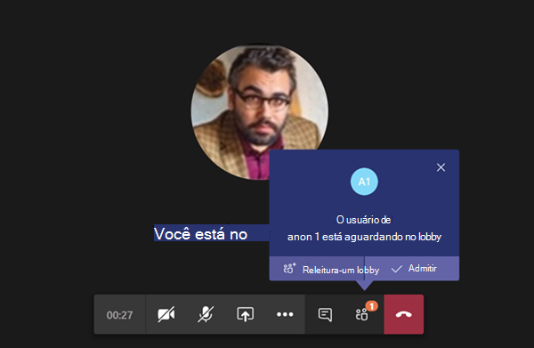
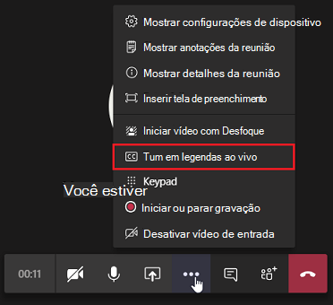

# <a name="meeting-policy-settings---participants--guests"></a>Configurações de política de reunião - Participantes e convidados

<a name="bkmeetingparticipants"> </a>

Essas configurações controlam quais participantes da reunião devem aguardar no lobby, antes que eles sejam admitidos na reunião e o nível de participação deles permitidos em uma reunião.

- [Permitir que pessoas anônimas iniciem uma reunião](#let-anonymous-people-start-a-meeting)
- [Admitir pessoas automaticamente](#automatically-admit-people)
- [Permitir que os usuários de acesso telefônico ignorem o lobby](#allow-dial-in-users-to-bypass-the-lobby)
- [Legendas ao vivo](#live-captions)
- [Chat em reuniões](#chat-in-meetings)

> [!NOTE]
>As opções para ingressar em uma reunião variam, dependendo das configurações de cada grupo do Teams e do método de conexão. Se o seu grupo tiver audioconferência e a usar para se conectar, confira [Audioconferência](/microsoftteams/audio-conferencing-in-office-365). Se o seu grupo do Teams não tiver audioconferência, confira [Participar de uma reunião do Teams](https://support.office.com/article/join-a-meeting-in-teams-1613bb53-f3fa-431e-85a9-d6a91e3468c9).


## <a name="let-anonymous-people-start-a-meeting"></a>Permitir que pessoas anônimas iniciem uma reunião

Essa configuração é uma política por organizador que permite reuniões de conferência discada sem líderes. Essa configuração controla se os usuários de acesso telefônico podem participar da reunião sem um usuário autenticado da organização em participação. Por padrão, essa configuração está desligada, o que significa que os usuários de discagem aguardarão no lobby até que um usuário autenticado da organização insisse na reunião.

> [!NOTE]
> Se essa configuração estiver desativada e um usuário de acesso telefônico participar da reunião primeiro e for colocado no lobby, um usuário da organização deverá participar da reunião com um cliente do Teams para admitir o usuário do lobby. Não há controles de lobby disponíveis para os usuários.

## <a name="automatically-admit-people"></a>Aceitar pessoas automaticamente

Esta é uma política por organizador. Essa configuração controla se as pessoas participam de uma reunião ou esperam no lobby até que sejam admitidas por um usuário autenticado. Essa configuração não se aplica aos usuários de acesso telefônico.



 Os organizadores de reuniões podem clicar em **Opções de reunião** no convite da reunião para alterar essa configuração para todas as reuniões agendadas.

> [!NOTE]
> Nas opções da reunião, a configuração é rotulada "Quem pode ignorar o lobby". Se você alterar a configuração padrão para qualquer usuário, ela será aplicada a todas as novas reuniões organizadas por esse usuário e a qualquer reunião anterior em que o usuário não tiver modificado as Opções de reunião.
  
|Valor de configuração  |Comportamento de ingresso |
|---------|---------|
|**Todos**   |Todos os participantes da reunião participam da reunião diretamente, sem aguardar no lobby. Isso inclui usuários autenticados, usuários externos de organizações confiáveis (federado), convidados e usuários anônimos.     |
|**Pessoas na minha organização e convidados**     |Os usuários autenticados dentro da organização, incluindo os usuários convidados, insto na reunião diretamente sem esperar no lobby. Os usuários de organizações confiáveis e usuários anônimos aguardam no lobby. Essa é a configuração padrão.    |
|**Pessoas da minha organização e organizações confiáveis**     |Usuários autenticados dentro da organização, incluindo usuários convidados e os usuários de organizações confiáveis, entram na reunião diretamente sem aguardar no lobby.  Os usuários anônimos aguardam o lobby.   |
|**Pessoas na minha organização**    |Os usuários autenticados de dentro da organização insuem na reunião diretamente sem esperar no lobby.  Os usuários de organizações confiáveis, usuários convidados e usuários anônimos aguardam no lobby.          |
|**Organizador somente**    |Somente os organizadores da reunião participam da reunião diretamente, sem aguardar no lobby. Todos os outros, incluindo usuários autenticados dentro da organização, usuários convidados, usuários de organizações confiáveis e usuários anônimos devem aguardar no lobby. Na página Teams de reunião do cliente, ele aparece como "Somente eu".          |
|**Somente usuários convidados**    |Somente usuários convidados e organizadores de reuniões podem participar da reunião diretamente sem esperar no lobby. Todos os outros, incluindo usuários autenticados dentro da organização, usuários convidados, usuários de organizações confiáveis e usuários anônimos devem aguardar no lobby. Na página Teams de reunião do cliente, ela aparece como "Pessoas que eu convidar". Os usuários adicionados como parte de um grupo de distribuição terão que passar pelo lobby.      |

 > [!NOTE]
> As organizações confiáveis são domínios com os que você permite comunicações federadas Teams. Se você habilitar **Permitir todos os domínios externos** para acesso externo no centro de administração Teams, qualquer usuário autenticado em qualquer Teams organização será confiável. Se você optar por especificar domínios externos permitidos e bloquear todos os outros, os domínios permitidos se tornarão organizações confiáveis. Qualquer domínio bloqueado é considerado como não uma organização confiável.

## <a name="allow-dial-in-users-to-bypass-the-lobby"></a>Permitir que os usuários de acesso telefônico ignorem o lobby

Esta é uma política por organizador. Essa configuração controla se as pessoas que se conectam por telefone ingressam diretamente na reunião ou esperam o lobby, independentemente da configuração **Aceitar pessoas automaticamente**. Por padrão, essa configuração é desabilitada. Quando essa configuração estiver desativada, os usuários de acesso telefônico aguardarão no lobby até que um usuário da organização ingresse na reunião com um cliente do Teams e os admita. Quando essa configuração é ativada, os usuários de acesso telefônico ingressam automaticamente na reunião quando um usuário da organização ingressa na reunião.

> [!NOTE]
> Se um usuário de acesso telefônico participar de uma reunião antes de um usuário da organização ingressar na reunião, ele será colocado no lobby até que um usuário da organização ingresse na reunião usando um cliente de equipes e o admita. Se você alterar a configuração padrão para qualquer usuário, ela será aplicada a todas as novas reuniões organizadas por esse usuário e a qualquer reunião anterior em que o usuário não tiver modificado as Opções de reunião.

## <a name="live-captions"></a>Legendas ao vivo

Essa configuração é uma política por usuário e se aplica durante uma reunião. Essa configuração controla se a opção **Ativar legendas ao vivo** está disponível para que o usuário ative e desative as legendas ao vivo nas reuniões que o usuário faz.  



|Valor de configuração |Comportamento  |
|---------|---------|
|**Desabilitado, mas o usuário pode ignorar**     | As legendas ao vivo não são automaticamente ativadas para o usuário durante uma reunião. O usuário verá a opção **Ativar legendas ao vivo** no menu flutuante (**...**) para ativá-las. Essa é a configuração padrão. |
|**Desabilitado**     | As legendas ao vivo estão desabilitadas para o usuário durante uma reunião. O usuário não tem a opção para ativá-las.          |

<a name="bkcontentsharing"> </a>

## <a name="chat-in-meetings"></a>Chat em reuniões

Essa configuração é uma configuração por participante. Essa configuração controla se o chat de reunião é permitido na reunião do usuário.

|Valor de configuração |Comportamento  |
|---------|---------|
|**A ativar para todos**     | Todos os participantes podem gravar e exibir mensagens de chat. |
|**Desativar para todos**     | O chat de reunião está desligado para todos os participantes.  |
|**Ativos para todos, menos usuários anônimos**| Os usuários anônimos não podem conversar durante reuniões, mas podem ler mensagens. |

<a name="bkparticipantsandguests"> </a>

## <a name="enable-meeting-policy-settings"></a>Habilitar configurações de política de reunião

Para habilitar as configurações de política de reunião, você pode usar [o](https://admin.teams.microsoft.com/policies/meetings) centro de administração do Teams (**Políticas** >  de **ReuniãoEditar** um **policyParticipants** >  & convidados) ou o cmdlet [Set-CsTeamsMeetingPolicy](/powershell/module/skype/set-csteamsmeetingpolicy?view=skype-ps) no Teams PowerShell. 

Neste exemplo, usamos o PowerShell para modificar a política de reunião global para permitir que qualquer pessoa inicie ou participe de uma reunião.

```powershell
Set-CsTeamsMeetingPolicy -Identity Global -AutoAdmittedUsers "Everyone" -AllowAnonymousUsersToStartMeeting $True -AllowPSTNUsersToBypassLobby $True
```

Depois de configurar uma política, você precisa aplicá-la aos usuários. Se você modificou a política Global (padrão em toda a organização), ela será aplicada automaticamente aos usuários. Você precisa esperar pelo menos 4 horas para que qualquer alteração de política entre em vigor, mas pode levar até 24 horas.


## <a name="related-topics"></a>Tópicos relacionados

- [Visão Geral do PowerShell do Teams](teams-powershell-overview.md)
- [Atribuir políticas aos usuários no Microsoft Teams](policy-assignment-overview.md)
- [Remover a política de reunião do Teams RestrictedAnonymousAccess dos usuários](meeting-policies-restricted-anonymous-access.md)
