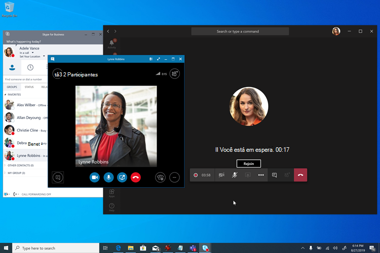
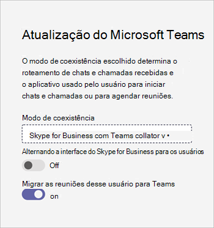

# Meetings First

"Reuniões Primeiro" é direcionado e otimizado para organizações Skype for Business Server com Enterprise Voice locais que querem começar a usar reuniões Teams o mais rápido possível. Para essas organizações, o Meetings First é uma alternativa ao uso do modo **Ilhas** que prioriza a experiência Teams reuniões.

## O que é Reuniões Primeiro?

Reuniões Primeiro se baseia no modo de coexistência **SfBWithTeamsCollabAndMeetings.** Reuniões Primeiro não é um produto ou um recurso, é uma configuração que usa recursos e recursos do Teams e Skype for Business para fornecer uma experiência de coexistência personalizada exclusiva.

Em Reuniões Primeiro, os usuários criam sua reunião Teams, enquanto continuam a usar Skype for Business para chat, chamada e presença. Não há sobreposição de modalidades entre Teams e Skype for Business. Chat, chamada e presença estão Skype for Business e desligados Teams. Isso permite cenários exclusivos "melhor juntos" entre Skype for Business e Teams que aprimoram a experiência do usuário durante a coexistência, bem como cenários de interoperabilidade com usuários **Teams Somente** usuários.

> [!Important]
> Reuniões Primeiro é uma melhor combinação para organizações que não têm nem poucos usuários Teams chat ativos. Os Teams de chat ativos não devem ser trocados para o modo Primeiro de Reuniões, pois eles perderiam a capacidade de conversar no Teams e acessar seu histórico de chat. Em vez disso,  esses usuários devem ser acossados no modo Ilhas, e as Reuniões Primeiro só são concedidas aos usuários que ainda não estão ativos no chat Teams.

## Who considerar Reuniões Primeiro?

As Reuniões Primeiro foram projetadas para organizações que usam o Skype for Business Server com o Enterprise Voice que querem acelerar sua movimentação para reuniões de Teams, especialmente aquelas com forte disciplina de IT que querem um caminho de atualização gerenciado e determinístico para Teams.

Para organizações complexas ou grandes, as migrações de voz geralmente são feitas site a site e podem levar muito tempo, potencialmente vários anos, resultando em cenários de coexistência estendidos. Se essa coexistência estiver no modo **Ilhas,** os usuários sempre terão a opção de duas soluções de reunião (Skype for Business e Teams), o que pode resultar em situações confusas ou suboptimais. Ao contrário das migrações de voz, as migrações de reuniões geralmente podem ser concluídas em toda a empresa em um curto período de tempo. As organizações que querem mudar completamente para Teams reuniões o mais rapidamente possível (e sem esperar que a migração de voz seja concluída) devem considerar reuniões primeiro.

As Reuniões Primeiro podem não ser úteis para organizações que não têm Enterprise Voice usuários. Essas organizações devem ser capazes de atualizar para Teams **somente** assim que eles podem adotar Teams reuniões. Eles devem considerar ignorar reuniões primeiro.

Além disso, Reuniões Primeiro é útil para organizações cujo escopo é uma solução de reunião pura, por exemplo, quando um RFP "somente reuniões" está sendo emitido.

## Recursos em reuniões primeiro

A Reunião Primeiro reúne os seguintes recursos:

- [Provisione um Skype for Business Server (local)](./tutorial-audio-conferencing.yml?tutorial-step=3) com Teams [Audioconferência.](tutorial-audio-conferencing.yml)
- [Serviço de Migração](/skypeforbusiness/audio-conferencing-in-office-365/setting-up-the-meeting-migration-service-mms)de Reuniões : As reuniões organizadas pelo usuário serão migradas para a nuvem e convertidas em reuniões Teams à medida que o usuário for promovido para Reuniões Primeiro (exige Exchange Online).
- Experiência do usuário simplificada no Teams, centralizada em reuniões Teams equipes e canais (que podem, opcionalmente, ser [ocultos](teams-app-permission-policies.md)usando a política permissões do aplicativo ); [Teams chat privado, chamada e auto-presença](teams-client-experience-and-conformance-to-coexistence-modes.md) não são expostos em Reuniões Primeiro, permitindo que o esforço de implantação e adoção se concentre totalmente nas reuniões.
- Experiência [de Teams de reunião superior.](tutorial-meetings-in-teams.yml)
- "Melhor Juntos" entre Teams e Skype for Business: 
  - Espera automática: quando em uma reunião no Teams, entrar em uma chamada no Skype for Business colocará a reunião Teams em espera e vice-versa. Isso impede que os usuários tenha suas chamadas privadas ouvidas pelos participantes das reuniões.
    
  - Reconciliação de presença: a atividade no Teams é refletida na presença do usuário, que é a Skype for Business, já que o chat e a chamada estão em Skype for Business. Especificamente, quando os primeiros usuários de reuniões estão em uma reunião Teams, sua presença será atualizada para refletir isso. Quando eles apresentarem sua tela, sua presença será atualizada para mostrar Não Incomodar (com base em suas configurações em Skype for Business).
  - Reconciliação de controle HID do dispositivo USB (também disponível no Mac): os controles HID são Teams durante reuniões Teams reuniões e por Skype for Business em todas as outras circunstâncias.
  - A menos que mencionado de outra forma, os recursos Better Together exigem clientes Windows de área de trabalho recentes no momento.

## Pré-requisitos para reuniões primeiro

Os únicos requisitos rígidos para Reuniões Primeiro são os mesmos dos requisitos para o Teams com o Active Directory local e uma implantação Skype for Business local:

- [Pré-requisitos gerais para Teams](upgrade-plan-journey-prerequisites.md), incluindo
- [Identidade e autenticação em Teams](identify-models-authentication.md) e
- [Configure Azure Active Directory para Teams e Skype for Business](/skypeforbusiness/hybrid/configure-azure-ad-connect).

Uma [Skype for Business de topologia](/skypeforbusiness/hybrid/configure-federation-with-skype-for-business-online) híbrida não é necessária, mas é recomendada. Alguns recursos, como o Serviço de Migração de Reuniões e interoperabilidade, dependem dessa topologia.

As Reuniões Primeiro são suportadas com qualquer versão do Skype for Business Server (e conhecida por trabalhar com o Lync Server sem mais suporte). Ele é suportado com qualquer cliente Skype for Business suporte, no entanto, os recursos Better Together exigem um cliente recente.

Depois que esses requisitos são atendidos (e não anteriores), os usuários podem ser licenciados para Microsoft 365 [ou Office 365 e Teams](/office365/enterprise/assign-licenses-to-user-accounts).

Para a melhor experiência de reuniões, os usuários devem estar habilitados para [Exchange Online,](exchange-teams-interact.md) [SharePoint Online](sharepoint-onedrive-interact.md)e OneDrive for Business e Microsoft 365 de grupo. As Reuniões Primeiro são suportadas para usuários cuja caixa de correio está no Exchange local, ou que não têm o SharePoint Online ou o OneDrive For Business ou Microsoft 365 criação de grupo. No entanto, sua experiência será menos completa. Em particular, para organizações que usam o Exchange Server local, pode haver (dependendo da versão do Exchange Server) algumas limitações para criar e exibir reuniões do cliente Teams, bem como em relação aos recursos de conformidade.

No mínimo, os usuários devem ser [licenciados para Teams](/microsoft-365/admin/manage/assign-licenses-to-users). Além disso, eles podem ser licenciados para [Audioconferência](set-up-audio-conferencing-in-teams.md), se necessário.

Recomendamos que [você conceda o modo **SfBOnly** ou **SfBWithTeamsCollab**](/powershell/module/skype/grant-csteamsupgradepolicy?view=skype-ps) como padrão de locatário no momento em que licenciar os usuários. Isso garante que os usuários não comecem a usar  Teams por conta própria no modo de Ilhas padrão antes de você estar pronto para iniciar reuniões primeiro.

As Reuniões Primeiro são suportadas em clientes de área de trabalho completa (Windows e Mac), em clientes do navegador e em clientes móveis. Ele também é compatível com [Salas do Microsoft Teams](/microsoftteams/room-systems/). O Better Together requer o cliente de área de trabalho completo.

## Prepare-se para Teams reuniões em Reuniões Primeiro

Para que os usuários tenham a melhor experiência possível em Teams reuniões, você deve:

- Siga as etapas em [Reuniões e conferências Microsoft Teams](deploy-meetings-microsoft-teams-landing-page.md), em particular.
- [Avalie seu ambiente](3-envision-evaluate-my-environment.md).
- [Prepare a rede da sua organização para Microsoft Teams](prepare-network.md).
- Atualize suas salas de reunião com Teams dispositivos e soluções de sala de reunião capazes [ou](/skypeforbusiness/certification/devices-meeting-rooms?bc=%2fmicrosoftteams%2fbreadcrumb%2ftoc.json&toc=%2fMicrosoftTeams%2ftoc.json)use o Cloud [Video Interop](cloud-video-interop.md) para Microsoft Teams para permitir que suas salas e dispositivos de terceiros existentes participem de reuniões Teams reuniões.
- Equipar seus usuários com [dispositivos de áudio e vídeo USB certificados.](/skypeforbusiness/certification/devices-usb-devices?bc=%2fmicrosoftteams%2fbreadcrumb%2ftoc.json&toc=%2fMicrosoftTeams%2ftoc.json)
- Prepare-se [para impulsionar a conscientização e a adoção para Teams reuniões.](adopt-microsoft-teams-landing-page.md)
- [Planeje seu gerenciamento de serviço](4-envision-plan-my-service-management.md).
- Familiarize-se com os relatórios rich Call Analytics para [solucionar problemas de qualidade de chamada ruim.](use-call-analytics-to-troubleshoot-poor-call-quality.md)

Você pode considerar executar um piloto pronto para produção em escala moderada neste estágio.

## Configurar usuários para reuniões primeiro

Depois de licenciar seus usuários e preparar sua organização para Teams reuniões, é hora de habilitar seus usuários para reuniões primeiro. Facilitamos a tarefa: uma única configuração fará tudo isso!

Todos os recursos e experiências do usuário em Reuniões  Primeiro, incluindo a configuração do cliente Teams e a conformidade automática da experiência do usuário, o Serviço de Migração de Reuniões e os recursos Melhor Juntos, são configurados concedendo ao usuário (ou grupo de usuários ou locatário padrão) o modo de coexistência [SfBWithTeamsCollabAndMeetings](setting-your-coexistence-and-upgrade-settings.md) no centro de administração do [Microsoft Teams](manage-teams-in-modern-portal.md) ou usando o [PowerShel l](/powershell/module/skype/grant-csteamsupgradepolicy?view=skype-ps).

Opcionalmente, você deve ocultar o aplicativo Teams e Canais da navegação à esquerda do cliente Teams dos usuários para concentrar ainda mais sua experiência em reuniões, o que pode ser feito usando a política de Instalação de [Aplicativos](teams-app-setup-policies.md).

## Análise de relatórios e de chamada

Relatórios e Análise de Chamada para Teams reuniões em Reuniões Primeiro não são alteradas do que estão em outros modos.

## Links relacionados

Depois de revisar este artigo, talvez você queira consultar [Escolher](upgrade-and-coexistence-of-skypeforbusiness-and-teams.md)sua jornada de atualização, diretrizes de migração e [interoperabilidade](migration-interop-guidance-for-teams-with-skype.md)e [Coexistência](coexistence-chat-calls-presence.md) com Skype for Business para obter mais detalhes.
