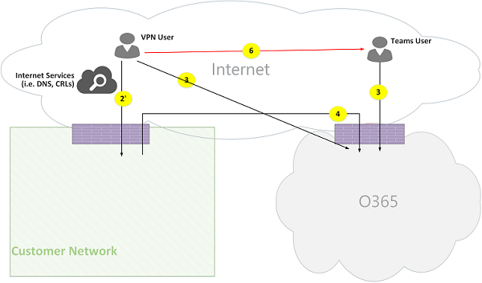
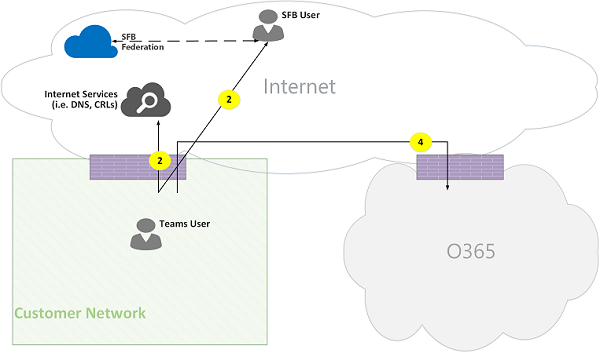
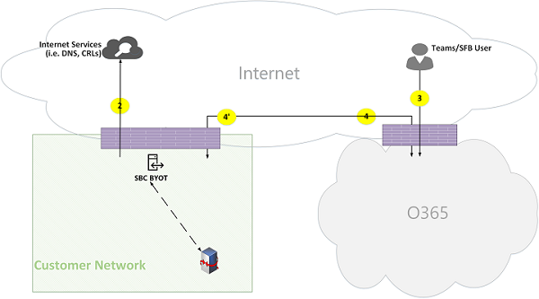
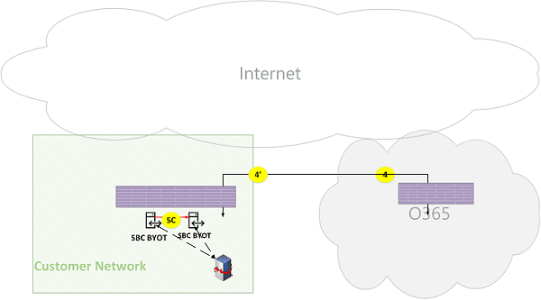

# Fluxos de chamadas do Microsoft Teams

> [!TIP]
> Assista a esta sessão para saber como Teams aproveita sua rede e como planejar a conectividade de rede ideal: [Teams Planejamento de Rede.](https://aka.ms/teams-networking)

## Visão Geral

Este artigo descreve como o Teams usa Microsoft 365 ou Office 365 de chamada em várias topologias. Além disso, ele descreve fluxos Teams exclusivos que são usados para comunicação de mídia ponto a ponto. O documento descreve esses fluxos, sua finalidade e sua origem e término na rede. Para fins deste artigo, suponha o seguinte:

- Flow X é usado pelo cliente local para se comunicar com o serviço Microsoft 365 ou Office 365 na nuvem. Ele se origina da rede do cliente e termina como um ponto de extremidade no Microsoft 365 ou Office 365.

- Flow Y é usado pelo cliente local para se comunicar com um serviço na Internet que Microsoft 365 ou Office 365 tem uma dependência. Ele se origina da rede do cliente e termina como ponto de extremidade na Internet.

Este artigo aborda as seguintes informações:

- **Plano de fundo**. Fornece informações em segundo plano, como redes que os fluxos podem percorrer, tipos de tráfego, diretrizes de conectividade da rede do cliente para pontos de extremidade do serviço Microsoft 365 ou Office 365, interoperabilidade com componentes de terceiros e princípios usados pelo Teams para selecionar fluxos de mídia.

- **Fluxos de chamada em várias topologias.** Ilustra o uso de fluxos de chamada em várias topologias. Para cada topologia, a seção enumera todos os fluxos com suporte e ilustra como esses fluxos são usados em vários casos de uso. Para cada caso de uso, ele descreve a sequência e a seleção de fluxos usando um diagrama de fluxo.

- **Teams otimização de Rota Expressa**. Descreve como esses fluxos são usados quando a Rota Expressa é implantada para otimização, ilustrada usando uma topologia simples.

## Plano de fundo

### Segmentos de rede

**Rede do cliente**. Esse é o segmento de rede que você controla e gerencia. Isso inclui todas as conexões do cliente em escritórios de clientes, com fio ou sem fio, conexões entre edifícios do office, conexões com datacenters locais e suas conexões com provedores de Internet, Rota Expressa ou qualquer outro par particular.

Normalmente, uma rede do cliente tem vários perímetros de rede com firewalls e/ou servidores proxy, que impõem as políticas de segurança da sua organização e que permitem apenas determinado tráfego de rede que você configurou e configurou. Como você gerencia essa rede, tem controle direto sobre o desempenho da rede e recomendamos que você conclua avaliações de rede para validar o desempenho dentro de sites em sua rede e de sua rede para a rede Microsoft 365 ou Office 365 rede.

**Internet**. Esse é o segmento de rede que faz parte da rede geral que será usado pelos usuários que estão se conectando ao Microsoft 365 ou Office 365 de fora da rede do cliente. Ele também é usado por algum tráfego da rede do cliente para Microsoft 365 ou Office 365.

**Rede privada visitada ou convidada.** Esse é o segmento de rede fora da sua rede de clientes, mas não na Internet pública, que seus usuários e seus convidados podem visitar (por exemplo, uma rede privada local ou uma rede privada corporativa, que não implanta o Teams, onde seus usuários e seus clientes que interagem com serviços Teams podem residir).

> [!NOTE]
> A conectividade com Microsoft 365 ou Office 365 também é aplicável a essas redes.

**Microsoft 365 ou Office 365**. Esse é o segmento de rede que oferece suporte Microsoft 365 ou Office 365 serviços. Ele é distribuído em todo o mundo com bordas próximas à rede do cliente na maioria dos locais. As funções incluem Retransmissão de Transporte, servidor de conferência e Processador de Mídia.

**Rota Expressa (opcional)**. Esse é o segmento de rede que faz parte de sua rede geral que lhe dará uma conexão exclusiva e privada com a rede Microsoft 365 ou Office 365 rede.

### Tipos de tráfego

**Mídia em tempo real**. Dados encapsulados em RTP (Protocolo de Transporte em Tempo Real) que suportam cargas de trabalho de áudio, vídeo e compartilhamento de tela. Em geral, o tráfego de mídia é altamente sensível à latência, portanto, você deseja que esse tráfego pegue o caminho mais direto possível e use UDP versus TCP como o protocolo de camada de transporte, que é o melhor transporte para mídia interativa em tempo real de uma perspectiva de qualidade. (Observe que, como último recurso, a mídia pode usar TCP/IP e também ser tunelada dentro do protocolo HTTP, mas não é recomendada devido a implicações de má qualidade.) O fluxo RTP é protegido usando SRTP, no qual apenas a carga é criptografada.

**Sinalização**. O link de comunicação entre o cliente e o servidor ou outros clientes usados para controlar atividades (por exemplo, quando uma chamada é iniciada) e entregar mensagens instantâneas. A maioria do tráfego de sinalização usa as interfaces REST baseadas em HTTPS, embora em alguns cenários (por exemplo, a conexão entre Microsoft 365 ou Office 365 e um Controlador de Borda de Sessão) use o protocolo SIP. É importante entender que esse tráfego é muito menos sensível à latência, mas pode causar interrupções de serviço ou tempo limite de chamada se a latência entre os pontos de extremidade exceder vários segundos.

### Conectividade com Microsoft 365 ou Office 365

Teams requer [conectividade com a Internet](/office365/enterprise/assessing-network-connectivity). Teams URLs de ponto de extremidade e intervalos de endereços IP estão listados [Office 365 URLs e intervalos de endereços IP.](/office365/enterprise/urls-and-ip-address-ranges) (Observe que a conectividade aberta às portas TCP 80 e 443 e às portas UDP 3478 a 3481 é necessária.) Além disso, Teams tem uma dependência do Skype for Business Online, que também deve estar conectado à Internet.

Teams conectividade de fluxos de mídia é implementada usando procedimentos padrão de Estabelecimento de Conectividade Interativa (ICE) do IETF.

### Restrições de interoperabilidade

**Retransmissão de mídia de terceiros**. Um Teams de mídia (ou seja, onde um dos pontos de extremidade de mídia é Teams) pode percorrer apenas Teams ou Skype for Business retransmissão de mídia nativa. Não há suporte para interoperabilidade com retransmissão de mídia de terceiros. (Observe que um SBC de terceiros no limite com PSTN deve encerrar o fluxo RTP/RTCP, protegido usando SRTP e não retransmiti-lo para o próximo salto.)

**Servidores proxy SIP de terceiros.** Uma Teams sip de sinalização com um SBC de terceiros e/ou gateway pode percorrer Teams ou Skype for Business sip nativos. Não há suporte para interoperabilidade com um proxy SIP de terceiros.

**B2BUA de terceiros (ou SBC)**. Um Teams de mídia de e para o PSTN é encerrado por um SBC de terceiros. No entanto, a interoperabilidade com um SBC de terceiros na rede Teams (onde um SBC de terceiros media dois pontos de extremidade Teams ou Skype for Business de terceiros) não é suportada.

### Tecnologias que não são recomendadas com Microsoft Teams

**Rede VPN**. Não é recomendado para tráfego de mídia (ou fluxo 2'). O cliente VPN deve usar o túnel dividido e roteá-Teams tráfego de mídia como qualquer usuário externo que não seja VPN, conforme especificado em Habilitando a mídia [do Lync](https://techcommunity.microsoft.com/t5/Skype-for-Business-Blog/Enabling-Lync-Media-to-Bypass-a-VPN-Tunnel/ba-p/620210)para ignorar um túnel VPN.

> [!NOTE]
> Embora o título indique Lync, ele também é aplicável Teams também.

**Shapers de pacote**. Qualquer tipo de snipper de pacote, inspeção de pacotes ou dispositivos de formador de pacotes não são recomendados para o tráfego de mídia Teams e podem degradar significativamente a qualidade.

### Princípios

Há quatro princípios gerais que ajudam você a entender os fluxos de chamada para Microsoft Teams:

- Uma Microsoft Teams é hospedada por Microsoft 365 ou Office 365 na mesma região em que o primeiro participante ingressou. (Observe que, se houver exceções a essa regra em algumas topologias, elas serão descritas neste documento e ilustradas por um fluxo de chamada apropriado.)

- Um Teams de mídia no Microsoft 365 ou Office 365 é usado com base nas necessidades de processamento de mídia e não com base no tipo de chamada. (Por exemplo, uma chamada ponto a ponto pode usar um ponto de extremidade de mídia na nuvem para processar mídia para transcrição ou gravação, enquanto uma conferência com dois participantes pode não usar nenhum ponto de extremidade de mídia na nuvem.) No entanto, a maioria das conferências usará um ponto de extremidade de mídia para fins de combinação e roteamento, alocados onde a conferência está hospedada. O tráfego de mídia enviado de um cliente para o ponto de extremidade de mídia pode ser roteado diretamente ou usar um Retransmissão de Transporte no Microsoft 365 ou Office 365 se necessário devido às restrições de firewall de rede do cliente.

- O tráfego de mídia para chamadas ponto a ponto leva a rota mais direta disponível, supondo que a chamada não exige um ponto de extremidade de mídia na nuvem (consulte o princípio anterior). A rota preferencial é direta para o par remoto (cliente), mas se essa rota não estiver disponível, uma ou mais Retransmissão de Transporte retransmitirão o tráfego. É recomendável que o tráfego de mídia não transversa servidores como shapers de pacotes, servidores VPN e assim por diante, pois isso afetará a qualidade da mídia.

- O tráfego de sinalização sempre vai para o servidor mais próximo do usuário.

Para saber mais sobre os detalhes sobre o caminho de mídia escolhido, consulte [Understanding Media Flows in Microsoft Teams - BRK4016](https://www.youtube.com/watch?v=1tmHMIlAQdo).

## Fluxos de chamada em várias topologias

### Teams topologia

Essa topologia é usada pelos clientes que aproveitam os serviços Teams da nuvem sem qualquer implantação local, como Skype for Business Server ou Sistema de Telefonia Roteamento Direto. Além disso, a interface para Microsoft 365 ou Office 365 é feita pela Internet sem a Rota Expressa do Azure.

*Figura 1 - Teams topologia*

Observe que:

- A direção das setas no diagrama acima reflete a direção de iniciação da comunicação que afeta a conectividade nos perímetros da empresa. No caso de UDP para mídia, o primeiro(s) pacote(s) pode fluir na direção inversa, mas esses pacotes podem ser bloqueados até que os pacotes na outra direção fluam.
- Teams é implantado lado a lado com o Skype for Business Online, portanto, os clientes são exibidos como "usuário Teams/SFB".

Você pode encontrar mais informações sobre as seguintes topologias opcionais posteriormente no artigo:

- Skype for Business implantação local é descrita em **Teams topologia híbrida.**
- Sistema de Telefonia Roteamento Direto (para conectividade PSTN) é descrito **em Teams com topologia de Roteamento Direto.**
- Rota Expressa é descrita em Teams **otimização de Rota Expressa.**

**Flow descrições**:

- **Flow 2** – Representa um fluxo iniciado por um usuário na rede do cliente para a Internet como parte da experiência Teams usuário. Exemplos desses fluxos são DNS e mídia ponto a ponto.
- **Flow 2'** – Representa um fluxo iniciado por um usuário remoto Teams dispositivo móvel, com VPN para a rede do cliente.
- **Flow 3** – Representa um fluxo iniciado por um usuário de dispositivo móvel remoto Teams para Microsoft 365 ou Office 365/Teams pontos de extremidade.
- **Flow 4** – Representa um fluxo iniciado por um usuário na rede do cliente para Microsoft 365 ou Office 365/Teams pontos de extremidade.
- **Flow 5** – Representa um fluxo de mídia ponto a ponto entre um usuário Teams e outro usuário Teams ou Skype for Business na rede do cliente.
- **Flow 6** – Representa um fluxo de mídia ponto a ponto entre um usuário de dispositivo móvel remoto Teams e outro usuário móvel remoto Teams ou Skype for Business pela Internet.

#### Caso de uso: Um para um

As chamadas um para um usam um modelo comum no qual o chamador obterá um conjunto de candidatos que consistem em endereços IP/portas, incluindo candidatos locais, retransmissivos e reflexivos (endereço IP público do cliente, conforme visto pela retransmissão). O chamador envia esses candidatos para a parte chamada; a parte chamada também obtém um conjunto semelhante de candidatos e os envia para o chamador. As mensagens de verificação de conectividade do STUN são usadas para encontrar quais caminhos de mídia do chamador/chamado funcionam e o melhor caminho de trabalho está selecionado. Mídia (ou seja, pacotes RTP/RTCP protegidos usando SRTP) são enviados usando o par de candidatos selecionado. A retransmissão de transporte é implantada como parte Microsoft 365 e Office 365.

Se os candidatos locais de endereço IP/porta ou os candidatos reflexivos têm conectividade, o caminho direto entre os clientes (ou usando um NAT) será selecionado para mídia. Se os clientes estão ambos na rede do cliente, o caminho direto deve ser selecionado. Isso requer conectividade UDP direta na rede do cliente. Se os clientes são ambos usuários de nuvem mamímica, dependendo do NAT/firewall, a mídia pode usar a conectividade direta.

Se um cliente for interno na rede do cliente e um cliente for externo (por exemplo, um usuário de nuvem móvel), é improvável que a conectividade direta entre os candidatos locais ou reflexivos está funcionando. Nesse caso, uma opção é usar um dos candidatos de Retransmissão de Transporte de qualquer cliente (por exemplo, o cliente interno obteve um candidato de retransmissão da retransmissão de transporte no Microsoft 365 ou Office 365; o cliente externo precisa ser capaz de enviar pacotes STUN/RTP/RTCP para a retransmissão de transporte). Outra opção é o cliente interno enviar para o candidato de retransmissão obtido pelo cliente de nuvem móvel. Observe que, embora a conectividade UDP para mídia seja altamente recomendada, o TCP é suportado.

**Etapas de alto nível:**

1. Teams O Usuário A resolve o nome de domínio da URL (DNS) usando o fluxo 2.
1. Teams O Usuário A aloca uma porta de Retransmissão de mídia Teams Transport Relay usando o fluxo 4.
1. Teams O Usuário A envia "convidar" com candidatos a ICE usando o fluxo 4 para Microsoft 365 ou Office 365.
1. Microsoft 365 ou Office 365 envia notificação para Teams Usuário B usando o fluxo 4.
1. Teams O Usuário B aloca uma porta de Retransmissão de mídia Teams Transport Relay usando o fluxo 4.
1. Teams O usuário B envia "resposta" com candidatos a ICE usando o fluxo 4, que é encaminhado de volta para Teams Usuário A usando Flow 4.
1. Teams O usuário A e Teams Usuário B invocam testes de conectividade ICE e o melhor caminho de mídia disponível está selecionado (consulte diagramas abaixo para vários casos de uso).
1. Teams Os usuários enviam telemetria para Microsoft 365 ou Office 365 usando o fluxo 4.

**Na rede do cliente:**

*Figura 2 - Dentro da rede do cliente*

Na etapa 7, o fluxo de mídia ponto a ponto 5 é selecionado.

A mídia é bidirecional. A direção do fluxo 5 indica que um lado inicia a comunicação de uma perspectiva de conectividade, consistente com todos os fluxos neste documento. Nesse caso, não importa qual direção é usada porque ambos os pontos de extremidade estão dentro da rede do cliente.

**Rede do cliente para usuário externo (mídia retransmitida Teams Retransmissão de Transporte):**

*Figura 3 - Rede do cliente para usuário externo (mídia retransmitida Teams Retransmissão de Transporte)*

Na etapa 7, o fluxo 4, da rede do cliente para o Microsoft 365 ou Office 365, e o fluxo 3, do usuário do Teams móvel remoto para o Microsoft 365 ou Office 365, estão selecionados. Esses fluxos são retransmitir Teams Retransmissão de Transporte dentro Microsoft 365 ou Office 365.

A mídia é bidirecional, onde a direção indica qual lado inicia a comunicação de uma perspectiva de conectividade. Nesse caso, esses fluxos são usados para sinalização e mídia, usando diferentes protocolos de transporte e endereços.

**Rede do cliente para usuário externo (mídia direta):**

*Figura 4 - Rede do cliente para usuário externo (mídia direta)*

Na etapa 7, o fluxo 2, da rede do cliente para a Internet (ponto do cliente), está selecionado.

- A mídia direta com o usuário móvel remoto (não repassada por meio Microsoft 365 ou Office 365) é opcional. Em outras palavras, o cliente pode bloquear esse caminho para impor um caminho de mídia por meio do Retransmissão de Transporte em Microsoft 365 ou Office 365.

- A mídia é bidirecional. A direção do fluxo 2 para o usuário móvel remoto indica que um lado inicia a comunicação de uma perspectiva de conectividade.

**Usuário VPN para usuário interno (mídia retransmitida Teams Retransmissão de Transporte)**

*Figura 5 - Usuário VPN para usuário interno (mídia retransmitida por Teams Retransmissão de Transporte)*

A sinalização entre a VPN para a rede do cliente está usando o fluxo 2'. A sinalização entre a rede do cliente e Microsoft 365 ou Office 365 está usando o fluxo 4. No entanto, a mídia ignora a VPN e é roteada usando fluxos 3 e 4 Teams retransmissão de mídia em Microsoft 365 ou Office 365.

**Usuário VPN para usuário interno (mídia direta)**

*Figura 6 - Usuário VPN para usuário interno (mídia direta)*

A sinalização entre a VPN para a rede do cliente está usando o fluxo 2'. A sinalização entre a rede do cliente e Microsoft 365 ou Office 365 está usando o fluxo 4. No entanto, a mídia ignora a VPN e é roteada usando o fluxo 2 da rede do cliente para a Internet.

A mídia é bidirecional. A direção do fluxo 2 para o usuário móvel remoto indica que um lado inicia a comunicação de uma perspectiva de conectividade.

**Usuário VPN para usuário externo (mídia direta)**

*Figura 7 - Usuário VPN para usuário externo (mídia direta)*

A sinalização entre o usuário VPN para a rede do cliente está usando o fluxo 2' e usando o fluxo 4 para Microsoft 365 ou Office 365. No entanto, a mídia ignora a VPN e é roteada usando o fluxo 6.

A mídia é bidirecional. A direção do fluxo 6 para o usuário móvel remoto indica que um lado inicia a comunicação de uma perspectiva de conectividade.

#### Caso de uso: Teams para PSTN por meio Microsoft 365 ou Office 365 Tronco

Microsoft 365 e Office 365 têm um Sistema de Telefonia que permite fazer e receber chamadas da PSTN (Rede Telefônica Pública Comutado). Se o tronco PSTN estiver conectado usando o plano de chamada Sistema de Telefonia, não haverá requisitos de conectividade especiais para esse caso de uso. (Se você quiser conectar seu próprio tronco PSTN local ao Microsoft 365 ou Office 365, você pode usar Sistema de Telefonia Roteamento Direto.)

*Figura 8 - Teams PSTN por meio Office 365 Tronco*

#### Caso de uso: Teams reunião

O servidor de conferência de áudio/vídeo/tela (VBSS) faz parte Microsoft 365 e Office 365. Ele tem um endereço IP público que deve ser acessível a partir da rede do cliente e deve ser acessível a partir de um cliente de Nuvem Mamómico. Cada cliente/ponto de extremidade precisa ser capaz de se conectar ao servidor de conferência.

Os clientes internos obterão candidatos locais, reflexivos e de retransmissão da mesma maneira descrita para chamadas um para um. Os clientes enviarão esses candidatos para o servidor de conferência em um convite. O servidor de conferência não usa uma retransmissão, pois tem um endereço IP publicamente acessível, então ele responde com seu candidato a endereço IP local. O cliente e o servidor de conferência verificarão a conectividade da mesma maneira descrita para chamadas um para um.

Observe que:

- Teams clientes não podem participar Skype for Business reuniões e Skype for Business clientes não podem participar Teams reuniões.

- Um usuário PSTN opcionalmente "Disca" ou é "Discado para fora", dependendo do provisionamento de Chamada PSTN e/ou conferência do organizador da reunião.

- Um usuário convidado ou um usuário do cliente pode ingressar em uma rede privada de convidados, que é protegida usando FW/NAT com regras estritas.

*Figura 9 - Teams Reunião*

#### Caso de uso: federação com Skype for Business local

**Mídia retransmitida Teams Retransmissão de Transporte em Microsoft 365 ou Office 365**

*Figura 10 - Mídia retransmitida Teams Retransmissão de Transporte no Office 365*

Observe que:

- Federação é, por definição, uma comunicação entre dois locatários. Nesse caso, o locatário A, que usa Teams, federa com o locatário B, que usa Skype for Business local. Se o locatário B também estiver usando Microsoft 365 ou Office 365, o cliente Skype for Business teria usado o fluxo 3 para se conectar ao Microsoft 365 ou Office 365.

- A sinalização e a mídia do cliente Skype for Business federado para o local Skype for Business Server está fora do escopo deste documento. No entanto, ele é ilustrado aqui para clareza.

- A sinalização entre Teams e Skype for Business é ponteada por um gateway.

- A mídia nesse caso é retransmitida pelo Teams Transporte para a rede do cliente e para o cliente Skype for Business remoto usando o fluxo 4.

**Mídia retransmitida por Skype for Business Retransmissão de Mídia em locatário federado**

*Figura 11 - Mídia retransmitida Skype for Business Retransmissão de Mídia em locatário federado*

Observe que:

- A sinalização e a mídia do cliente Skype for Business federado para um Skype for Business Server local está fora do escopo deste documento. No entanto, ele é ilustrado aqui para clareza.

- A sinalização entre Teams e Skype for Business é ponteada por um Gateway.

- A mídia nesse caso é retransmitida pelo Skype for Business retransmissão de mídia local para a rede do cliente usando o fluxo 2. (Observe que o tráfego de Teams usuário para o Retransmissão de Mídia remoto na rede de cliente federada será inicialmente bloqueado pelo Media Relay até que o tráfego na direção inversa comece a fluir. No entanto, o fluxo bidirecional abrirá a conectividade em ambas as direções.)

**Direct (ponto a ponto)**

*Figura 12 - Direto (ponto a ponto)*

### Teams topologia híbrida

Essa topologia inclui Teams com uma implantação Skype for Business local.

*Figura 13 - Teams topologia híbrida*

- A direção das setas no diagrama acima reflete a direção de iniciação da comunicação que afeta a conectividade nos perímetros da empresa. No caso de UDP para mídia, o primeiro(s) pacote(s) pode fluir na direção inversa, mas esses pacotes podem ser bloqueados até que os pacotes na outra direção fluam.

- Teams é implantado lado a lado com o Skype for Business Online, portanto, os clientes são exibidos como "usuário Teams/SFB".

Fluxo adicional (sobre a topologia Teams):

- **Flow 5A** – Representa um fluxo de mídia ponto a ponto entre um usuário Teams dentro da rede do cliente e uma retransmissão de mídia local Skype for Business na borda da rede do cliente.

#### Caso de uso: Teams Skype for Business um para um

**Híbrido na rede do cliente**

*Figura 14 - Híbrida na rede do cliente*

A sinalização entre Teams e Skype for Business é ponteada por um gateway. No entanto, a mídia é roteada diretamente ponto a ponto na rede do cliente usando o fluxo 5.

**Rede de cliente híbrida com usuários Skype for Business externos – reedados por Microsoft 365 ou Office 365**

*Figura 15 - Rede de cliente híbrida com usuários Skype for Business externos - reedados por Office 365*

Observe que:

- A sinalização e a mídia do Skype for Business cliente para um Skype for Business Server local está fora do escopo deste documento. No entanto, ele é ilustrado aqui para clareza.

- A sinalização entre Teams e Skype for Business é ponteada por um gateway.

- A mídia é retransmitida Teams Retransmissão de Transporte para a rede do cliente por meio do fluxo 4.

**Rede de cliente híbrida com Skype for Business usuário externo – relayed by on-premises Edge**

*Figura 16 - Rede de cliente híbrida com usuário Skype for Business externo - reedida por Borda local*

Observe que:

- A sinalização e a mídia Skype for Business cliente para um local Skype for Business Server está fora do escopo deste documento. No entanto, ele é ilustrado aqui para clareza.

- A sinalização é ponteada por um gateway.

- A mídia é retransmitida pelo Skype for Business Retransmissão de Mídia dentro Skype for Business Borda local para Teams usuário dentro da rede do cliente usando o fluxo de mídia 5A.

### Teams com Sistema de Telefonia de Roteamento Direto

Essa topologia inclui Teams com Sistema de Telefonia Roteamento Direto.

O Roteamento Direto permite que você use um provedor de serviço PSTN (Rede Telefônica Pública Comutado) de terceiros emparelhando um dispositivo de hardware SBC (Controlador de Borda de Sessão) de propriedade do cliente com suporte para Microsoft 365 ou Office 365 e conectando o tronco de telefonia a esse dispositivo.

Para dar suporte a esse cenário, o cliente deve implantar um SBC certificado para Roteamento Direto de um dos parceiros certificados da Microsoft. O SBC deve ser configurado conforme recomendado pelo fornecedor e ser instável Microsoft 365 ou Office 365 para tráfego UDP direto. A mídia pode fluir diretamente do Teams e/ou do cliente Skype for Business para o SBC (ignorando o gateway Teams) ou atravessando o gateway Teams. A conectividade com o SBC, quando o tronco é configurado para ignorar o gateway Teams, é baseada no ICE, onde o SBC dá suporte ao ICE-Lite, enquanto o ponto de extremidade de mídia Teams/Skype for Business suporta o ICE Full Form.

*Figura 17 - Teams com Sistema de Telefonia topologia de Roteamento Direto

Observe que:

- A direção das setas no diagrama acima reflete a direção de iniciação da comunicação que afeta a conectividade nos perímetros da empresa. No caso de UDP para mídia, o primeiro(s) pacote(s) pode fluir na direção inversa, mas esses pacotes podem ser bloqueados até que os pacotes na outra direção fluam.

- Teams é implantado lado a lado com o Skype for Business Online, portanto, os clientes são exibidos como "usuário Teams/SFB".

Fluxos adicionais (além da topologia Teams online):

- **Flow 4'** - Representa um fluxo do Microsoft 365 ou Office 365 para a rede do cliente, usado para estabelecer uma conexão entre o servidor de mídia Teams na nuvem com o SBC local.
- **Flow 5B** – Representa um fluxo de mídia entre o usuário Teams dentro da rede do cliente com o SBC de Roteamento Direto no modo bypass.
- **Flow 5C** – Representa um fluxo de mídia entre o SBC de Roteamento Direto para outro SBC de Roteamento Direto em um modo de desvio de chamada de hairpin PSTN.

**Usuário interno com Roteamento Direto (mídia retransmitida Teams Retransmissão de Transporte)**

*Figura 18 - Usuário interno com Roteamento Direto (mídia retransmitida Teams Retransmissão de Transporte)*

Observe que:

- O SBC deve ter um endereço IP público que seja table de Microsoft 365 ou Office 365.

- A sinalização e a mídia do SBC para Microsoft 365 ou Office 365 e vice-versa usam o fluxo 4 e/ou o fluxo 4'.

- Sinalização e mídia do cliente dentro da rede do cliente para Microsoft 365 ou Office 365 usar o fluxo 4.

**Usuário remoto com Roteamento Direto (a mídia é roteada por meio de um servidor de mídia (MP))**

*Figura 19 - Usuário remoto com Roteamento Direto (a mídia é roteada por meio de um servidor de mídia (MP))*

Observe que:

- O SBC deve ter um endereço IP público que seja table de Microsoft 365 ou Office 365.

- A sinalização e a mídia do SBC para Microsoft 365 ou Office 365 e vice-versa usam o fluxo 4 e/ou o fluxo 4'.

- Sinalização e mídia do cliente na Internet para Microsoft 365 ou Office 365 usar o fluxo 3.

**Roteamento Direto do usuário interno (bypass de mídia)**

*Figura 20 - Roteamento Direto do usuário interno (desvio de mídia)*

Observe que:

- O SBC deve ter um endereço IP público que seja table de Microsoft 365 ou Office 365.

- A sinalização de SBC para Microsoft 365 ou Office 365 e vice-versa usam o fluxo 4 e/ou o fluxo 4'.

- A sinalização do cliente dentro da rede do cliente para Microsoft 365 ou Office 365 usar o fluxo 4.

- A mídia do cliente dentro da rede do cliente para o SBC dentro da rede do cliente usa o fluxo 5B.

**Usuário remoto com Roteamento Direto (bypass de mídia retransmitida Teams Retransmissão de Transporte)**

*Figura 21 - Usuário remoto com Roteamento Direto (bypass de mídia retransmitida pelo Teams De Transporte)*

Observe que:

- O SBC deve ter um endereço IP público que seja table Microsoft 365 ou Office 365 Internet.

- A sinalização do SBC para Microsoft 365 ou Office 365 e vice-versa usa o fluxo 4 e/ou o fluxo 4'.

- A sinalização do cliente na Internet para Microsoft 365 ou Office 365 usa o fluxo 3.

- A mídia do cliente na Internet para o SBC na rede do cliente usa os fluxos 3 e 4, retransmitida pelo Teams Transport Relay.

**Roteamento Direto do usuário remoto (desvio de mídia direto)**

*Figura 22 - Roteamento Direto do Usuário Remoto (desvio de mídia direto)*

Observe que:

- O SBC deve ter um endereço IP público que seja table Microsoft 365 ou Office 365 internet.

- A sinalização do SBC para Microsoft 365 ou Office 365 e vice-versa usa o fluxo 4 e/ou o fluxo 4'.

- A sinalização do cliente na Internet para Microsoft 365 ou Office 365 usa o fluxo 3.

- A mídia do cliente na Internet para o SBC dentro da rede do cliente usa o fluxo 2.

**Roteamento Direto (desvio de mídia) – Chamada de hairpin PSTN (devido ao encaminhamento/transferência de chamada)**

*Figura 23 - Roteamento Direto (desvio de mídia) - Chamada de hairpin PSTN (devido ao encaminhamento/transferência de chamada)*

Observe que:

- O SBC deve ter um endereço IP público que seja table de Microsoft 365 ou Office 365.

- A sinalização do SBC para Microsoft 365 ou Office 365 e vice-versa usa o fluxo 4 e/ou o fluxo 4'.

- O cliente está fora do loop de sinalização e mídia depois que a chamada é empinada de PSTN para PSTN.

- A mídia da instância SBC A na rede do cliente para a instância B do SBC na rede do cliente (onde, A e B podem ser a mesma instância) usa o fluxo 5C.

**Roteamento Direto (mídia por Microsoft 365 ou Office 365) – Chamada de hairpin PSTN em dois locatários**

*Figura 24 - Roteamento Direto (mídia por Microsoft 365 ou Office 365) – Chamada de hairpin PSTN em dois locatários*

Observe que:

- O SBC deve ter um endereço IP público que seja table de Microsoft 365 ou Office 365.

- A sinalização do SBC para Microsoft 365 ou Office 365 e vice-versa usa o fluxo 4 e/ou o fluxo 4'.

- O cliente está fora do loop de sinalização e mídia depois que a chamada é empinada de PSTN para PSTN.

- A mídia da instância SBC A na rede do cliente X para a instância B do SBC deve ser repassada pelo Microsoft 365 ou Office 365 Media Server e não pode usar o modo de bypass.

## Teams otimização de Rota Expressa

*Figura 25 - Teams otimização de Rota Expressa*

No caso de a Rota Expressa ser justificada e implantada, Teams fluxos podem ser re-roteados do fluxo 4 para o fluxo 1 e do fluxo 4' para o fluxo 1'. No entanto, Teams aplicativo tem uma dependência difícil de outros Microsoft 365 ou Office 365 flui pela Internet usando os fluxos 4 e 4'; portanto, esses fluxos não devem ser bloqueados.

Observe que Skype for Business de Borda híbrida é roteado para a Internet e não para Rota Expressa para se comunicar com usuários externos e federar com outros locatários.

Para evitar fluxos assimétricos, o roteamento deve estar em ambas as direções. Em outras palavras, um endereço dentro da rede do cliente é roteável por meio da Internet ou rota expressa, com base na otimização, mas não por meio de ambos.

**Rede do cliente para usuário externo (mídia retransmitida Teams Retransmissão de Transporte):**

*Figura 26 - Rede do cliente para usuário externo (mídia retransmitida Teams Retransmissão de Transporte)*

**Etapas de alto nível:**

1. Teams O usuário na rede do cliente resolve o DNS (nome de domínio da URL) usando o flow2.
1. Teams O usuário na rede do cliente aloca uma porta de Retransmissão de mídia Teams Transport Relay usando o fluxo 1.
1. Teams O usuário na rede do cliente envia "convite" com candidatos ICE usando o fluxo 1 para Microsoft 365 ou Office 365.
1. Microsoft 365 ou Office 365 envia notificação para usuários externos Teams usando o fluxo 3.
1. Teams usuário externo aloca uma porta de Retransmissão de mídia Teams Retransmissão de Transporte usando o fluxo 3.
1. Teams usuário externo envia "resposta" com candidatos ICE usando o fluxo 3, que é encaminhado de volta para o Teams usuário A usando Flow 1.
1. Teams O usuário A e Teams Usuário B invocam testes de conectividade ICE e selecionam os fluxos 1 e 3, que são retransmitir pelo Teams Transporte.
1. Teams Os usuários enviam telemetria para Microsoft 365 ou Office 365 usando fluxos 1 e 3.

> [!NOTE]
> Flow 4 deve ser habilitado para dar suporte às dependências do Teams aplicativo em outros micross serviços que determinam o fluxo 4.
