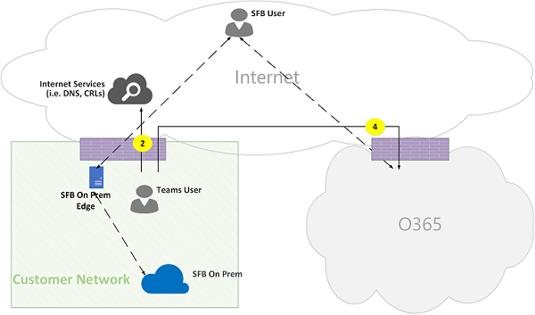

# Fluxos de chamada de equipes da Microsoft OnlineMicrosoft Teams Online Call Flows

## Visão geralOverview
Este documento descreve como a carga de trabalho de equipes utiliza fluxos do Office 365 em várias topologias.This document describes how Teams workload utilizes Office 365 flows in various topologies. Além disso, ele especifica exclusivos fluxos de equipes que são usados para comunicação de mídia ponto a ponto.In addition, it specifies unique Teams flows that are used for peer to peer media communication. O documento enumera esses fluxos e descreve suas finalidades e suas redes de origem/rescisão.The document enumerates these flows and describes their purpose and their origin/termination networks. Por exemplo, o fluxo de X é usado pelo cliente do Office 365 no local para se comunicar com o serviço Office 365 na nuvem, originada de rede do cliente e terminada por um ponto de extremidade na nuvem do Office 365, e Y do fluxo é usado pelo cliente do Office 365 no local para se comunicar com um serviço na Internet, que o Office 365 tem dependência em, originada de rede do cliente e é terminado por um ponto de extremidade na Internet.For example, flow X is used by Office 365 client on premises to communicate with Office 365 service in the cloud, originated from the Customer Network and terminated by an endpoint in Office 365 cloud, and flow Y is used by Office 365 client on premises to communicate with a service on the Internet, that Office 365 has dependency on, originated from the Customer Network, and is terminated by an endpoint on the Internet.

O documento tem três seções principais.The document has three main sections. O primeiro fornece um informações básicas, como redes (que podem atravessar fluxos do Office 365), o tipo de tráfego, diretrizes de conectividade de rede do cliente para pontos de extremidade de serviço Office 365, interoperabilidade com componentes de terceiros e entidades que são usados pelas equipes para selecionar os fluxos de mídia.The first provides a background information, such as networks (that Office 365 flows may traverse), type of traffic, connectivity guidance from Customer Network to Office 365 service endpoints, interoperability with third party components and principals that are used by Teams to select media flows. A segunda ilustra o uso desses fluxos em várias topologias.The second illustrates the usage of these flows in various topologies. Para cada topologia, ele enumera todos os fluxos de suportados e ilustra como esses fluxos são usados por meio de vários casos de uso.For each topology, it enumerates all supported flows and illustrates how these flows are used via several use cases. Para cada caso de uso, ele descreve a sequência e seleção de fluxos por meio de um diagrama de fluxo.For each use case, it describes the sequence and selection of flows via a flow diagram. A terceira descreve como esses fluxos são utilizados quando Express rota será implantada para otimização, ilustrada por meio de uma topologia simples.The third describes how these flows are utilized when Express Route is deployed for optimization, illustrated via a simple topology.

## Plano de fundoBackground
### Segmentos de redeNetwork Segments
**Rede do cliente**: esse é o segmento de rede que faz parte da sua rede geral que você controlar e gerenciar.**Customer Network**: This is the network segment that is part of your overall network that you control and manage. Isso inclui todas as conexões de cliente em escritórios de cliente, se com ou sem fio, entre prédios, em centros de dados local e as conexões estabelecidas com o Internet provedores, rota Express ou qualquer outro privada correspondência.This includes all customer connections within customer offices, whether wired or wireless, between office buildings, to on-premises datacenters, and your connections to Internet providers, Express Route or any other private peering. 

Geralmente, uma rede de cliente tem várias perímetro de rede com firewalls e/ou servidores proxy, qual aplicar políticas de segurança de uma organização e que permitir apenas determinado tráfego de rede que você configure e configurou.Typically, a customer network has several network perimeters with firewalls and/or proxy servers, which enforce an organization's security policies and that only allow certain network traffic that you have set up and configured. Porque o cliente gerencia esta rede, o cliente tem controle direto sobre o desempenho da rede e é altamente recomendável que o cliente completo rede avaliações para validar o desempenho dentro dos sites em sua rede e de seu rede a rede do Office 365.Because the customer manages this network, the customer has direct control over the performance of the network, and it is highly recommended that the customer complete network assessments to validate performance both within sites in your network and from your network to Office 365 network. Skype para negócios na implantação local e PSTN Session Border Controller para se conectar com PSTN por meio de sua rede (ou seja, direto roteamento) são opcionais.Skype for Business on premises deployment and PSTN Session Border Controller to connect with PSTN through your network (i.e., Direct Routing) are optional.

**Internet**: esse é o segmento de rede que faz parte da sua rede geral que será usada pelos usuários que estiverem se conectando ao Office 365 na nuvem de fora da rede do cliente.**Internet**: This is the network segment that is part of your overall network that will be used by users who are connecting to Office 365 Cloud from outside of the Customer Network. Ele também é usado por alguns tráfego de rede do cliente para Office 365 na nuvem.It is also used by some traffic from the Customer Network to Office 365 Cloud. 

**Visitado/convidado de rede privada**: esse é o segmento de rede fora da rede do cliente, mas não no Internet pública, que seus usuários e/ou seus convidados podem visitar.**Visited/Guest private Network**: This is the network segment outside your Customer Network, but not in the public Internet, that your users and/or their guests may visit. Por exemplo, rede privada residencial ou em uma rede privada, empresa, que não implante equipes, onde os seus usuários e/ou seus clientes que interagem com os serviços de equipes, podem residir.For example, home private network or an Enterprise private Network, that does not deploy Teams, where your users and/or their customers that interact with Teams services, may reside.

>**Observação**: conectividade com o Office 365b também é aplicável a essas redes.**Note**: Connectivity to Office 365b is also applicable to these networks.

**Office 365 na nuvem**: esse é o segmento de rede que ofereça suporte a serviços do Office 365.**Office 365 Cloud**: This is the network segment that supports Office 365 services. Ele é distribuído em todo o mundo com bordas próximos de rede do cliente na maioria dos locais.It is distributed worldwide with edges in proximity to Customer Network in most locations. Funções mencionadas neste documento incluem a retransmissão de transporte, o servidor de webconferência e o processador de mídia.Functions mentioned in this document include Transport Relay, conferencing server and Media Processor. 

**Rota Express (opcional)**: Este é o segmento de rede que faz parte da sua rede geral que fornecerá a você uma conexão dedicada, privada para a rede do Office 365.**Express Route (Optional)**: This is the network segment that is part of your overall network that will give you a dedicated, private connection to the Office 365 network.

### Tipos de tráfegoTypes of traffic

**Mídia em tempo real**: dados encapsulados dentro RTP (real-time Transport Protocol) e suporte a áudio, vídeo e compartilhamento de cargas de trabalho de tela.**Real-time media**: Data encapsulated within RTP (Real-time Transport Protocol) and supports audio, video and screen sharing workloads. Em geral, o tráfego de mídia é altamente latência minúsculas, portanto você gostaria que esse tráfego assuma o caminho mais direto possíveis e usar UDP versus TCP como o protocolo de camada de transporte, que é o transporte recomendado para a mídia de tempo de interativo real da perspectiva de qualidade.In general, media traffic is highly latency sensitive, so you would want this traffic to take the most direct path possible, and to use UDP versus TCP as the transport layer protocol, which is the best transport for interactive real time media from quality perspective. (Observação: como último recurso, mídia pode usar o TCP/IP e também ser encapsulada no protocolo HTTP, mas isso não é recomendável devido às implicações de qualidade ruim.) Fluxo RTP é protegido por meio do SRTP, no qual apenas a carga é criptografada.(Note: As a last resort, media can use TCP/IP and also be tunneled within HTTP protocol, but it is not recommended due to bad quality implications.) RTP flow is secured via SRTP, in which only the payload is encrypted.

**Sinalização**: O link de comunicação entre o cliente e servidor ou outros clientes que são usados para controlar as atividades (por exemplo, quando uma chamada é iniciada) e entregar mensagens instantâneas.**Signaling**: The communication link between the client and server, or other clients that are used to control activities (for example, when a call is initiated), and deliver instant messages. Tráfego de sinalização mais usa as interfaces do REST baseada em HTTPS, embora em alguns cenários (por exemplo, a conexão entre o Office 365 na nuvem e um controlador de borda de sessão) usa o protocolo SIP.Most signaling traffic uses the HTTPS-based REST interfaces, though in some scenarios (for example, connection between Office 365 Cloud and a Session Border Controller) uses SIP Protocol. É importante entender que esse tráfego é muito menos sensível a latência, mas pode causar interrupções de serviço ou chamada tempos limite se latência entre os pontos de extremidade exceder vários segundos.It's important to understand that this traffic is much less sensitive to latency but may cause service outages or call timeouts if latency between the endpoints exceed several seconds. 

### Conectividade com o Office 365Connectivity to Office 365

Serviço de equipes requer [conectividade à Internet](https://support.office.com/article/connectivity-to-the-internet-64b420ef-0218-48f6-8a34-74bb27633b10).Teams service requires [connectivity to the Internet](https://support.office.com/article/connectivity-to-the-internet-64b420ef-0218-48f6-8a34-74bb27633b10). Pontos de extremidade de equipes URLs e intervalos de endereços de IP são listados em [URLs do Office 365 e intervalos de endereços IP](https://docs.microsoft.com/office365/enterprise/urls-and-ip-address-ranges).Teams endpoints URLs and IP address ranges are listed in [Office 365 URLs and IP address ranges](https://docs.microsoft.com/office365/enterprise/urls-and-ip-address-ranges). (Observação: exige a conectividade para as portas TCP 80 e 443 aberta e as portas UDP 3478 3481 até.) Além disso, o serviço de equipes tem dependência em Skype para serviço online de business, daí é necessária para conectar-se também esse serviço para a Internet.(Note: It requires to open connectivity to TCP ports 80 and 443 and UDP ports 3478 through 3481.) Furthermore, Teams service has dependency on Skype for business online service, hence it is required to connect also this service to the Internet.

Conectividade de fluxos de mídia de equipes é implementada por meio de procedimentos padrão da IETF ICE (estabelecimento de conectividade interativa).Teams media flows connectivity is implemented via standard IETF ICE (Interactive Connectivity Establishment) procedures.

### Restrições de interoperabilidadeInteroperability Restrictions
**Mídia de terceiros retransmite**: fluxo de mídia de equipes de uma (ou seja, um dos pontos de extremidade de mídia é equipes) pode atravessar somente equipes ou Skype retransmissões mídia nativo de negócios.**Third party media relays**: A Teams media flow (i.e., one of the media endpoints is Teams) may traverse only Teams or Skype for Business native media relays. Não há suporte para a interoperabilidade com uma retransmissão de mídia de terceiros.Interoperability with a third party media relay is not supported. (Observação: um terceiro SBC o limite com PSTN deve encerrar o fluxo RTP/RTCP, protegido por meio do SRTP e não retransmiti-lo para o próximo salto.)(Note: A third party SBC on the boundary with PSTN MUST terminate RTP/RTCP stream, secured via SRTP, and not relay it to the next hop.)

**Servidores Proxy SIP de terceiros**: equipes de uma caixa de diálogo SIP com um terceiro SBC e/ou Gateway de sinalização pode atravessar equipes ou Skype para proxies SIP nativos de negócios.**Third party SIP Proxy Servers**: A Teams signaling SIP dialog with a third party SBC and/or Gateway may traverse Teams or Skype for Business native SIP proxies. Não há suporte para a interoperabilidade com terceiros Proxy SIP.Interoperability with a third party SIP Proxy is not supported.

**B2BUA de terceiros (isto é, SBC)**: fluxo de mídia A equipes de/para PSTN é encerrado por um terceiro SBC.**Third party B2BUA (i.e., SBC)**: A Teams media flow from/to PSTN is terminated by a third party SBC. No entanto, interoperabilidade com terceiros SBC dentro da rede de equipes (ou seja, a terceira parte SBC Media dois pontos de extremidade de equipes/Skype For Business) não é suportada.However, interoperability with a third party SBC within Teams network (i.e., third party SBC mediates two Teams/Skype For Business endpoints) is not supported.

### Tecnologias altamente não são recomendadas com Microsoft TeamsTechnologies that are strongly not recommended with Microsoft Teams

**Rede VPN**: altamente não é recomendado para o tráfego de mídia (ou seja, fluxo 2').**VPN Network**: It is strongly not recommended for media traffic (i.e., flow 2'). Cliente VPN deve utilizar divisão VPN e rotear tráfego de mídia como qualquer usuário externo não VPN, conforme especificado nahttps://blogs.technet.microsoft.com/nexthop/2011/11/14/enabling-lync-media-to-bypass-a-vpn-tunnel/VPN client SHOULD use split VPN and route media traffic like any external non-VPN user, as specified in https://blogs.technet.microsoft.com/nexthop/2011/11/14/enabling-lync-media-to-bypass-a-vpn-tunnel/ 

>**Observação**: Embora o título do Lync, é aplicável às equipes também.**Note**: Although the title is Lync, it is applicable to Teams as well.

**Pacote Shapers**: qualquer tipo de snippers de pacotes, inspeção de pacotes ou dispositivos de Modelador de pacotes altamente não são recomendados e pode reduzir significativamente a qualidade.**Packet Shapers**: Any kind of packet snippers, packet inspection, or packet shaper devices are strongly not recommended and may degrade quality significantly. 

### PrincípiosPrinciples
Existem quatro princípios gerais que o ajudarão a entender fluxos de chamada for Microsoft Teams.There are four general principles that help you understand call flows for Microsoft Teams. 
1.  Uma conferência do Microsoft Teams é hospedada pelo Office 365 na nuvem na mesma região onde o primeiro participante entrou.A Microsoft Teams conference is hosted by Office 365 cloud in the same region where the first participant joined. (Observação: se haverá exceções a essa regra em algumas topologias, eles serão descritos neste documento, ilustrada por um fluxo de chamadas apropriada.)(Note: If there will be exceptions to this rule in some topologies, then they will be described in this document, illustrated by an appropriate call flow.)
2.  Uma empresa de mídia de equipes (MP) no Office 365 nuvem é usado com base em necessidades de processamento de mídia e não com base no tipo de chamada.A Teams media endpoint (MP) in Office 365 cloud is used based on media processing needs and not based on call type. (Por exemplo, uma chamada ponto a ponto pode usar um ponto de extremidade de mídia na nuvem para mídia de processo para transcrição e/ou gravação, enquanto uma conferência com dois participantes não pode usar qualquer ponto de extremidade de mídia na nuvem.) No entanto, a maioria das conferências usará um MP para misturar e roteamento finalidades, alocadas onde a conferência está hospedada.(For example, a point to point call may use a media endpoint in the cloud to process media for transcription and/or recording, while a conference with two participants may not use any media endpoint in the cloud.) However, most conferences will use an MP for mixing and routing purposes, allocated where the conference is hosted. O tráfego de mídia enviado de um cliente para o MP poderão ser roteadas diretamente ou usar uma retransmissão de transporte, em nuvem do Office 365, se for necessário devido a restrições de firewall de rede do cliente.The media traffic sent from a client to the MP may be routed directly or use a Transport Relay, in Office 365 Cloud, if required due to Customer Network firewall restrictions. 
3.  Tráfego de mídia para chamadas ponto a ponto levar a rota mais direta que está disponível, supondo que a chamada não exige um MP na nuvem (consulte #2 acima).Media traffic for peer-to-peer calls take the most direct route that is available, assuming that the call doesn't mandate an MP in the cloud (see #2 above). A rota preferencial é direta ao peer remoto (cliente), mas se essa rota não estiver disponível, um ou mais retransmissões de transporte irá retransmitir o tráfego.The preferred route is direct to the remote peer (client), but if that route isn't available, then one or more Transport Relays will relay traffic. É recomendável que o tráfego de mídia deve servidores não transversal como shapers de pacotes, servidores VPN, etc., pois isso afetará a qualidade de mídia.It is recommended that media traffic shall not transverse servers such as packet shapers, VPN servers, etc., since this will impact the media quality.
4.  Tráfego de sinalização sempre vai para o servidor mais próximo ao usuário.Signaling traffic always goes to the closest server to the user. 

Para saber mais sobre os detalhes sobre o caminho de mídia for escolhido, consulte https://www.youtube.com/watch?v=aD5mUg2ZzLQ.To learn more about the details on the media path that is chosen, see https://www.youtube.com/watch?v=aD5mUg2ZzLQ.

## Fluxos de chamada em várias topologiasCall Flows in Various Topologies
### Topologia ("pura") Online de equipesTeams Online ("pure") Topology
Esta topologia é usada por clientes que utilizam serviços de equipes da nuvem sem implantar qualquer servidor, como Skype para negócios e SBC para roteamento direto, no local.This topology is used by customers that leverage Teams services from the cloud without deploying any server, such as Skype for business and SBC for Direct Routing, on premises. Além disso, a interface para o Office 365 é feita através da Internet sem rota Express do Azure.In addition, the interface to Office 365 is done via the Internet without Azure Express Route. 

*Figura 1 - topologia ('puro') Online de equipes**Figure 1 - Teams Online ('pure') Topology*

>**Observações**:**Notes**:
>- A direção das setas no diagrama acima refletem a direção de iniciação da comunicação que afeta o perímetro corporativo de conectividade.The direction of the arrows on the diagram above reflect the initiation direction of the communication that affects connectivity at the enterprise perimeters. No caso de UDP para a mídia, o primeiro pacote pode fluir na direção contrária, mas esses pacotes poderão ser bloqueados até que os pacotes na outra direção fluirá.In the case of UDP for media, the first packet(s) may flow in the reverse direction, but these packets may be blocked until packets in the other direction will flow.
>- As equipes Online será implantada lado a lado com Skype para Business Online, daí os clientes são exibidos como "User equipes/SFB".Teams Online is deployed side by side with Skype for Business Online, hence clients are displayed as "Teams/SFB user".

- Skype opcional para negócios na implantação local é descrito neste documento na seção **Topologia híbrida Online de equipes**Optional Skype for Business on premises deployment is described in this document in the section **Teams Online Hybrid Topology**
- O roteamento direto opcional para o PSTN é descrito neste documento na seção **Equipes Online com topologia de roteamento direto**Optional Direct Routing for PSTN is described in this document in the section **Teams Online with Direct Routing Topology**
- Roteiro de Express opcional é descrito neste documento na seção **equipes c / otimização de rota Express**Optional Express Route is described in this document in the section **Teams w/ Express Route optimization**

**Flui descrições**:**Flows Descriptions**:
- **Fluxo 2** – representa um fluxo iniciado por um usuário na rede de cliente para a Internet como parte da sua experiência de equipes.**Flow 2** – Represents a flow initiated by a user on Customer Network to the Internet as a part of his Teams experience. Exemplos desses fluxos são DNS e mídia ponto a ponto.Examples of these flows are DNS and peer to peer media.
- **Fluxo 2'** – representa um fluxo iniciado por um celular equipes usuário remoto, qual VPN para a rede do cliente.**Flow 2'** – Represents a flow initiated by a remote mobile Teams user, which VPN to Customer Network. 
- **Fluxo de 3** – representa um fluxo iniciado por um usuário de equipes móvel remoto aos pontos de extremidade do Office 365/Teams.**Flow 3** – Represents a flow initiated by a remote mobile Teams user to Office 365/Teams endpoints. 
- **Fluxo de 4** – representa um fluxo iniciado por um usuário na rede do cliente para pontos de extremidade do Office 365/Teams.**Flow 4** – Represents a flow initiated by a user on the Customer Network to Office 365/Teams endpoints.
- **Fluxo de 5** – representa um fluxo de mídia ponto a ponto entre o usuário de equipes e outro equipes ou Skype para usuário corporativos, dentro da rede do cliente.**Flow 5** – Represents a peer to peer media flow between Teams user and another Teams or Skype for Business user, within Customer Network.
- **Fluxo 6** – representa o fluxo de mídia de uma ponto a ponto entre um usuário remoto de equipes móvel e outro remoto equipes móveis ou Skype para o usuário de negócios, pela Internet.**Flow 6** – Represents a peer to peer media flow between a remote mobile Teams user and another remote mobile Teams or Skype for Business user, over the Internet.

#### Caso de uso: um para umUse Case: One-to-one
Chamadas-to-usar um modelo comum que o chamador será obter um conjunto de candidatos consistindo endereços IP/portas; local, retransmissão e reflexiva (endereço IP público do cliente, como visto pela retransmissão).One-to-one calls use a common model the caller will obtain a set of candidates consisting of IP addresses/ports; local, relay, and reflexive (public IP address of client as seen by the relay). O chamador envia essas candidatos para a parte chamada no convite da, a parte chamada também obtém um conjunto similar de candidatos e as envia para o chamador.The caller sends these candidates to the called party in the invite, the called party also obtains a similar set of candidates and sends them to the caller. Verificação de conectividade STUN mensagens são usadas para localizar qual chamador/chamado funcionam de caminhos de mídia de terceiros e o melhor caminho de trabalho está selecionada.STUN connectivity check messages are used to find which caller/called party media paths work, and the best working path is selected. Mídia (ou seja, pacotes RTP/RTCP protegidos por meio do SRTP), em seguida, é enviadas usando o par de candidato selecionado.Media (i.e., RTP/RTCP packets secured via SRTP) are then sent using the selected candidate pair. A retransmissão de transporte é implantada como parte do Office 365 nuvem.The Transport relay is deployed as part of the Office 365 Cloud.

Se o IP local endereço/porta candidatos ou os candidatos reflexivas tem conectividade, e em seguida, o caminho direto entre os clientes (ou por meio de um NAT) será selecionado para a mídia.If the local IP address/port candidates or the reflexive candidates have connectivity, then the direct path between the clients (or via a NAT) will be selected for media. Se os clientes estiverem na rede do cliente, o caminho direto deve ser selecionado.If the clients are both on the Customer network, then the direct path should be selected. Isso requer conectividade direta de UDP dentro da rede do cliente.This requires direct UDP connectivity within the Customer Network. Se os clientes forem ambos os usuários na nuvem nômades, em seguida, dependendo do NAT/firewall, mídia pode usar conectividade direta.If the clients are both nomadic cloud users, then depending on the NAT/firewall, media may use direct connectivity.

Se um cliente é interno na rede do cliente e um cliente é externa (por exemplo, o usuário móvel nuvem), em seguida, ele é improvável que conectividade direta entre os candidatos locais ou reflexivas está funcionando.If one client is internal on the Customer Network and one client is external (e.g., mobile cloud user), then it is unlikely that direct connectivity between the local or reflexive candidates is working. Nesse caso, uma opção é usar um dos candidatos transporte retransmissão de qualquer cliente (por exemplo, o cliente interno obtido um candidato a retransmissão da retransmissão de transporte no Office 365 na nuvem, o cliente externo deve ser capaz de enviar pacotes STUN/RTP/RTCP para o retransmissão de transporte).In this case, an option is to use one of the Transport Relay candidates from either client (e.g., the internal client obtained a relay candidate from the Transport relay in Office 365 Cloud, the external client needs to be able to send STUN/RTP/RTCP packets to the transport relay). Outra opção é que o cliente interno envia para o candidato a retransmissão obtido pelo cliente móvel de nuvem.Another option is the internal client sends to the relay candidate obtained by the mobile cloud client. Observe que, embora conectividade UDP para a mídia é altamente recomendável, TCP é suportado.Note that although UDP connectivity for media is highly recommended, TCP is supported.

**Etapas de alto nível**:**High Level Steps**:
1. As equipes de usuário resolve URL nome de domínio (DNS) via Fluxo2Teams User A resolves URL domain name (DNS) via flow2
2. O usuário de equipes A porta de retransmissão em equipes transporte Relay via fluxo 4 de uma mídia alocaTeams User A allocates a media Relay port on Teams Transport Relay via flow 4
3. As equipes de usuário A envia "convidar" com candidatos ICE via fluxo 4 para o Office 365Teams User A sends "invite" with ICE candidates via flow 4 to Office 365
4. OFFICE 365 envia uma notificação para o usuário B equipes via fluxo 4OFFICE 365 sends notification to Teams User B via flow 4
5. O usuário B equipes aloca uma mídia porta de retransmissão em equipes transporte Relay via fluxo 4Teams User B allocates a media Relay port on Teams Transport Relay via flow 4
6. As equipes usuário B envia "answer" com candidatos ICE via fluxo 4, que é encaminhada de volta ao usuário equipes via fluxo 4Teams User B sends "answer" with ICE candidates via flow 4, which is forwarded back to Teams User A via Flow 4
7. Equipes usuário B e equipes usuário invocam ICE testes de conectividade e o melhor caminho de mídia disponível está selecionado (consulte diagramas abaixo para diversas casos de uso)Teams User A and Teams User B invoke ICE connectivity tests and the best available media path is selected (see diagrams below for various use cases)
8. Usuários de equipes enviam telemetria para Office 365 via fluxo 4Teams Users send telemetry to Office 365 via flow 4

**Dentro da rede do cliente:****Within Customer Network:**

*Figura 2 - dentro da rede do cliente**Figure 2 - Within Customer Network*
 
Na etapa 7, o fluxo de mídia "peer-to-peer" 5 for selecionadoIn step 7, "peer to peer" media flow 5 is selected 
>**Observação**: mídia é bidirecional.**Note**: Media is bidirectional. A direção do fluxo de 5 indica que um lado inicia a comunicação da perspectiva de conectividade, consistente com todos os fluxos neste documento.The direction of flow 5 indicates that one side initiates the communication from connectivity perspective, consistent with all the flows in this document. Nesse caso, não importa qual direção é usada porque os dois pontos de extremidade estão dentro da rede do cliente.In this case, it doesn't matter which direction is used because both endpoints are within the Customer Network.

**Rede de cliente para usuários externos (retransmitidas por equipes transporte retransmissão de mídia):****Customer Network to External User (media relayed by Teams Transport Relay):**

*Figura 3 - rede do cliente para usuários externos (retransmitidas por equipes transporte retransmissão de mídia)**Figure 3 - Customer Network to External User (media relayed by Teams Transport Relay)*
 
Na etapa 7, fluxo 4, da rede de cliente para o Office 365 e fluxo de 3, do usuário remoto de equipes móvel para o Office 365, são selecionados.In step 7, flow 4, from Customer Network to Office 365, and flow 3, from remote mobile Teams user to Office 365, are selected. Esses fluxos são retransmitidos por equipes retransmissão de transporte no Office 365.These flows are relayed by Teams Transport Relay within Office 365.

>**Observação**: mídia é bidirecional, onde a direção indica qual lado inicia a comunicação da perspectiva de conectividade.**Note**: Media is bidirectional, where direction indicates which side initiates the communication from connectivity perspective. Nesse caso, esses fluxos são usados para a sinalização e mídia, por meio de endereços e protocolos de transporte diferentes.In this case, these flows are used for signaling and media, via different transport protocols and addresses.

**Rede de cliente para usuários externos (direct media):****Customer Network to External User (direct media):**

*Figura 4 - rede do cliente para usuários externos (direct mídia)**Figure 4 - Customer Network to External User (direct media)*
 
Na etapa 7, 2, de fluxo de rede do cliente para a Internet (peer do cliente), está selecionado.In step 7, flow 2, from Customer Network to Internet (client's peer), is selected.
>**Observações**:**Notes**: 
>- Direcionar mídia com o usuário móvel remoto (ou seja, não serão retransmitidas por meio do Office 365 na nuvem) é opcional.Direct media with remote mobile user (i.e., not relayed through Office 365 cloud) is optional. Em outras palavras, o cliente pode bloquear este caminho e fazendo isso, impor um caminho de mídia por meio de retransmissão de transporte no Office 365 na nuvem.In other words, customer may block this path and by doing so, enforce a media path through Transport Relay in Office 365 cloud.
>- Mídia é bidirecional.Media is bidirectional. A direção do fluxo de 2 para o usuário móvel remoto indica que um lado inicia a comunicação de uma perspectiva de conectividade.The direction of flow 2 to remote mobile user indicates that one side initiates the communication from a connectivity perspective. 

**Usuário de VPN para usuário interno (retransmitidas por equipes transporte retransmissão de mídia)****VPN User to Internal User (media relayed by Teams Transport Relay)**

*Figura 5 - usuário VPN para usuário interno (retransmitidas por equipes transporte retransmissão de mídia)**Figure 5 - VPN User to Internal User (media relayed by Teams Transport Relay)*
 
Sinalização VPN para a rede do cliente via fluxo 2' e fluxo de 4 para o Office 365.Signaling VPN to Customer Network via flow 2' and flow 4 to Office 365. No entanto, bypass de mídia "" VPN e roteado por meio de fluxos de 3 e 4 a retransmissão de mídia de equipes no Office 365 na nuvem.However, media "bypass" VPN and routed via flows 3 and 4 through Teams media relay in Office 365 cloud.

**Usuário de VPN para usuário interno (direct mídia)****VPN User to Internal User (direct media)**

*Figura 6 - usuário VPN para usuário interno (direct mídia)**Figure 6 - VPN User to Internal User (direct media)*

Sinalização VPN para a rede do cliente via fluxo 2' para a rede do cliente e fluxo de 4 para o Office 365.Signaling VPN to Customer Network via flow 2' to Customer Network and flow 4 to Office 365. No entanto, bypass de mídia "" VPN e roteado por meio de fluxo 2 da rede do cliente para a internet.However, media "bypass" VPN and routed via flow 2 from Customer Network to the internet.

>**Observação**: mídia é bidirecional.**Note**: Media is bidirectional. A direção do fluxo de 2 para o usuário móvel remoto indica que um lado inicia a comunicação de uma perspectiva de conectividade.The direction of flow 2 to remote mobile user indicates that one side initiates the communication from a connectivity perspective.

**Usuário de VPN para usuários externos (direct mídia)****VPN User to External User (direct media)**

*Figura 7 - usuário VPN para usuários externos (direct mídia)**Figure 7 - VPN User to External User (direct media)*

Sinalização VPN para a rede do cliente via fluxo 2' para a rede do cliente e fluxo de 4 para o Office 365.Signaling VPN to Customer Network via flow 2' to Customer Network and flow 4 to Office 365. No entanto, bypass de mídia "" VPN e roteado por meio de fluxo de 6.However, media "bypass" VPN and routed via flow 6.

>**Observação**: mídia é bidirecional.**Note**: Media is bidirectional. A direção do fluxo de 6 para usuários móveis remotos indica que um lado inicia a comunicação de uma perspectiva de conectividade.The direction of flow 6 to remote mobile user indicates that one side initiates the communication from a connectivity perspective.

#### Caso de uso: As equipes PSTN através de tronco do Office 365Use Case: Teams to PSTN through Office 365 Trunk
Nuvem do Office 365 tem um sistema telefônico que permite fazer e receber as chamadas da rede telefônica pública comutada.Office 365 Cloud has a Phone System that allows placing and receiving the calls from Public Switched Telephone Network. Se o tronco PSTN estiver conectado por meio do Office 365 na nuvem, existem requisitos especiais de conectividade para este caso de uso.If the PSTN Trunk is connected via Office 365 cloud, then there are no special connectivity requirements for this use case. Caso contrário, (roteamento direto é implantado), em seguida, consulte a seção **TBD**.Otherwise, (Direct Routing is deployed) then see section **TBD**.

*Figura 8 - as equipes de PSTN por meio de tronco do Office 365**Figure 8 - Teams to PSTN through Office 365 Trunk*

#### Caso de uso: Reunião de equipesUse Case: Teams Meeting

A áudio/vídeo/compartilhamento de tela (VBSS) o servidor de conferência é parte da nuvem Office 365.The audio/video/screen sharing (VBSS) conferencing server is part of the Office 365 cloud. Ele tem um endereço IP público que deve ser alcançados da rede do cliente e deve ser acessível a partir de um cliente de nuvem nômades.It has a public IP address that must be reachable from the Customer network and must be reachable from a Nomadic Cloud client. Cada cliente/ponto de extremidade precisa ser capaz de conectar o servidor de conferência.Each client/endpoint needs to be able to connect to the conferencing server.

Os clientes internos obterão local, reflexiva e candidatos de retransmissão como da mesma maneira como descrito para chamadas de um para um.Internal clients will obtain local, reflexive, and relay candidates in the same manner as described for one-to-one calls. Os clientes enviará esses candidatos para o servidor de conferência em um convite.The clients will send these candidates to the conference server in an invite. O servidor de conferência não usa uma retransmissão, pois ele tem um endereço IP publicamente acessível, para que ele responde com apenas seu local candidato de endereço IP.The conferencing server does not use a relay since it has a publicly reachable IP address, so it responds with just its local IP address candidate. O servidor de conferência e o cliente verificar a conectividade da mesma forma descrita para chamadas de um para um.The client and conferencing server will check connectivity in the same manner described for one-to-one calls. 

>**Observações**:**Notes**:
>- Clientes de equipes não conseguem ingressar Skype para reuniões de negócios e Skype para clientes corporativos não conseguem ingressar em reuniões de equipes.Teams clients cannot join Skype for business meetings, and Skype for Business clients cannot join Teams meetings.
>- Usuário PSTN opcionalmente "disca pol" ou "Discado check-OUT", depende da reunião organizador chamada PSTN e/ou o provisionamento de conferência.PSTN user optionally "Dials IN" or "Dialed OUT", depends on meeting's organizer PSTN Calling and/or conferencing provisioning. 
>- Um usuário convidado ou do cliente podem ingressar de uma rede privada convidado, que é protegida por meio de firmware/NAT com regras de estrita.A guest user or a customer user may join from a guest private network, which is protected via FW/NAT with strict rules.

*Figura 9 - às equipes de reunião**Figure 9 - Teams Meeting*

#### Uso de caso: Federação com Skype for Business no localUse Case: Federation with Skype for Business on premises

**Mídia retransmitidas por equipes retransmissão de transporte na nuvem do Office 365****Media relayed by Teams Transport Relay in Office 365 Cloud**

*Figura 10 - mídia retransmitido por equipes retransmissão de transporte na nuvem do Office 365**Figure 10 - Media relayed by Teams Transport Relay in Office 365 Cloud*

>**Observações**:**Notes**: 
>- "Federação" é, por definição, uma comunicação entre dois inquilinos."Federation" is, by definition, a communication between two Tenants. Nesse caso, o locatário A, que usa as equipes Online, agrupa com locatário B, que usa o Skype para negócios no local.In this case, tenant A, which uses Teams Online, federates with tenant B, which uses Skype for business on premises. Se locatário B também estiver usando o Office 365, em seguida, Skype para Business client teria que usar fluxo 3 para se conectar com o Office 365.If tenant B is also using Office 365, then Skype For Business client would have used flow 3 to connect with Office 365.
>- Sinalização e a mídia do cliente do Skype para negócios federado para sua Skype for Business no servidor local está fora do escopo deste documento.Signaling and media from federated Skype For Business client to its Skype for Business on premises server is out of scope of this document. No entanto, ele é mostrado aqui para manter a clareza.However, it is illustrated here for clarity.

Sinalização entre equipes e Skype para negócios "com ponte" por um Gateway na nuvem do Office 365.Signaling between Teams and Skype for Business is "bridged" by a Gateway in Office 365 cloud.

Nesse caso, mídia é retransmitida por equipes retransmissão de transporte no Office 365 na nuvem para a rede do cliente e do Skype remoto para o cliente de negócios via fluxos 4.Media in this case is relayed by Teams Transport Relay in Office 365 cloud to Customer Network and Remote Skype for Business client via flows 4.

**Mídia retransmitidas por Skype para retransmissão de mídia de negócios no locatário federado****Media relayed by Skype for Business Media Relay in federated tenant**

*Figura 11 - mídia retransmitido por Skype para retransmissão de mídia de negócios no locatário federado**Figure 11 - Media relayed by Skype for Business Media Relay in federated tenant*

>**Observação**: sinalização e mídia do cliente do Skype para negócios federado para sua Skype for Business no servidor local está fora do escopo deste documento.**Note**: Signaling and media from federated Skype For Business client to its Skype for Business on premises server is out of scope of this document. No entanto, ele é mostrado aqui para manter a clareza.However, it is illustrated here for clarity.

Sinalização entre equipes e Skype para negócios "com ponte" por um Gateway na nuvem do Office 365.Signaling between Teams and Skype for Business is "bridged" by a Gateway in Office 365 cloud.

Nesse caso, mídia é retransmitida por Skype for Business no local de retransmissão de mídia para a rede do cliente via fluxo 2.Media in this case is relayed by Skype for Business on premises Media Relay to Customer Network via flow 2. (Observe que o tráfego de usuário de equipes para a retransmissão de mídia remoto na rede do cliente federado será inicialmente bloqueado pela retransmissão de mídia até que o tráfego na direção contrária começa a fluxo.(Note that traffic from Teams user to the remote Media Relay in federated customer network will be initially blocked by the Media Relay until traffic in the reverse direction starts to flow. No entanto, o fluxo bidirecional abrirá conectividade em ambas as direções.)However, the bidirectional flow will open connectivity in both directions.)

**Direto (ponto a ponto)****Direct (peer to peer)**

*Figura 12 - direta (ponto a ponto)**Figure 12 - Direct (peer to peer)*

### Topologia híbrida Online de equipesTeams Online Hybrid Topology
Esta topologia é semelhante ao padrão de equipes Online ("puro"), mas "adiciona nos" Skype para negócios no local.This topology is similar to Teams Online default ("pure") but "adds on" Skype for business on premises.

*Figura 13 - topologia híbrida Online de equipes**Figure 13 - Teams Online Hybrid Topology*
 
>**Observações**:**Notes**:
>- A direção das setas no diagrama acima refletem a direção de iniciação da comunicação que afeta o perímetro corporativo de conectividade.The direction of the arrows on the diagram above reflect the initiation direction of the communication that affects connectivity at the enterprise perimeters. No caso de UDP para a mídia, o primeiro pacote pode fluir na direção contrária, mas esses pacotes poderão ser bloqueados até que os pacotes na outra direção fluirá.In the case of UDP for media, the first packet(s) may flow in the reverse direction, but these packets may be blocked until packets in the other direction will flow.
>- As equipes Online será implantada lado a lado com Skype para Business Online, daí os clientes são exibidos como "User equipes/SFB".Teams Online is deployed side by side with Skype for Business Online, hence clients are displayed as "Teams/SFB user".

Fluxos de adicionais (na parte superior de topologia "puro" equipes Online):Additional Flows (on top of Teams Online "pure" topology):
- **Fluxo 5A** – representa um fluxo de mídia ponto a ponto entre o usuário de equipes dentro da rede de cliente com um Skype for Business no retransmissão de mídia local na borda da rede do cliente.**Flow 5A** – Represents a peer to peer media flow between Teams user within Customer Network with a Skype for Business on premises media relay at the Customer Network edge.

#### Caso de uso: Equipes Skype para negócios-para-umUse Case: Teams to Skype for Business One-to-one
**Híbrido dentro da rede do cliente****Hybrid within Customer Network**

*Figura 14 - híbrida dentro da rede do cliente**Figure 14 - Hybrid within Customer Network*
 
Sinalização entre equipes e Skype para negócios "com ponte" por um Gateway na nuvem do Office 365.Signaling between Teams and Skype for business is "bridged" by a Gateway in Office 365 cloud. No entanto, mídia é roteada diretamente "peer-to-peer" dentro da rede do cliente via fluxo 5.However, media is routed directly "peer to peer" within Customer Network via flow 5.

**Rede de cliente híbrido com Skype externa para usuário de negócios – retransmitido pelo Office 365****Hybrid Customer Network with External Skype for Business user – relayed by Office 365**

*Figura 15 - rede de cliente híbrido com Skype externa para usuário comercial - retransmitidos pelo Office 365**Figure 15 - Hybrid Customer Network with External Skype for Business user - relayed by Office 365*
 
>**Observação**: sinalização e mídia do Skype para o cliente de negócios para Skype for Business no servidor local está fora do escopo deste documento.**Note**: Signaling and media from Skype for Business client to Skype for Business on premises server is out of scope of this document. No entanto, ele é mostrado aqui para manter a clareza.However, it is illustrated here for clarity.

Sinalização entre equipes e Skype para negócios "com ponte" por um Gateway na nuvem do Office 365.Signaling between Teams and Skype for Business is "bridged" by a Gateway in Office 365 cloud.

Mídia é retransmitida por meio de retransmissão de transporte de equipes no Office 365 para a rede do cliente por meio de fluxos de 4.Media is relayed through Teams Transport Relay in Office 365 to Customer Network through flows 4.

**Rede de cliente híbrido com Skype externa para usuário de negócios – retransmitido na borda de local****Hybrid Customer Network with External Skype for Business user – relayed by on premises edge**

*Figura 16 - rede de cliente híbrido com Skype externa para usuário comercial - retransmitidos na borda de local**Figure 16 - Hybrid Customer Network with External Skype for Business user - relayed by on premises edge*
 
>**Observação**: sinalização e mídia do Skype para o cliente de negócios para Skype para negócios no servidor local está fora do escopo deste documento.**Note**: Signaling and media from Skype for Business client to Skype for business on premises server is out of scope of this document. No entanto, ele é mostrado aqui para manter a clareza.However, it is illustrated here for clarity.

Sinalização "com ponte" por um Gateway na nuvem do Office 365.Signaling is "bridged" by a Gateway in Office 365 cloud.

Mídia é retransmitida por Skype para retransmissão de mídia de negócios dentro do Skype for Business no local de borda para o usuário de equipes dentro da rede do cliente via 5A de fluxo de mídia.Media is relayed by Skype for Business Media Relay within Skype for Business on premises Edge to Teams user within Customer Network via media flow 5A.

### Equipes Online com topologia "Roteamento direto"Teams Online with "Direct Routing" Topology
Esta topologia é semelhante ao equipes Online ("puro"), mas "adiciona nos" roteamento direto.This topology is similar to Teams Online ("pure") but "adds on" Direct Routing. 

Direcione o roteamento, anteriormente conhecido como BYOT (trazer suas próprias tronco), com um provedor de serviço de telefônica comutada pública de terceiros.Direct Routing, previously known as BYOT (Bring Your Own Trunk), with a third party Public Switched Telephone Service provider. Esse método é possível emparelhamento um compatível e local do cliente de propriedade Session Border Controller dispositivo de hardware para Office 365 na nuvem, e conectando o tronco de telefonia a esse dispositivo.This method is possible by pairing a supported on-premises customer-owned Session Border Controller hardware device to Office 365 Cloud, and connecting the telephony trunk to that device. 

Para oferecer suporte a esse cenário, o cliente deve implantar certificados SBC(s) para roteamento direto de um dos parceiros certificados da Microsoft.To support this scenario, the customer must deploy certified SBC(s) for Direct Routing from one of Microsoft's certified partners. O SBC deve ser configurado adequadamente, conforme recomendado pelo fornecedor e ser roteável da nuvem do Office 365 para direcionar o tráfego UDP.The SBC must be configured properly, as recommended by the vendor, and be routable from Office 365 Cloud for direct UDP traffic. A mídia pode fluir diretamente a partir de equipes/Skype para o cliente de negócios para o SBC (ignorar equipes Gateway (ou seja, MP)) ou desviar por meio do Gateway de equipes.The media may flow directly from Teams/Skype for Business client to the SBC (bypass Teams Gateway (i.e., MP)) or traverse through Teams Gateway. A conectividade com o SBC, quando tronco é configurado para ignorar o Gateway de equipes, se baseia em ICE, onde SBC suporta Lite ICE, enquanto as equipes/Skype para ponto de extremidade de mídia de negócios oferece suporte a ICE completo.The connectivity with the SBC, when trunk is configured to bypass Teams Gateway, is based on ICE, where SBC supports ICE-Lite, while Teams/Skype for Business media endpoint supports ICE Full. 

*Figura 17 - on-line equipes com topologia 'Roteamento direto'**Figure 17 - Teams Onine with 'Direct Routing' Topology*

>**Observações**:**Notes**:
>- A direção das setas no diagrama acima refletem a direção de iniciação da comunicação que afeta o perímetro corporativo de conectividade.The direction of the arrows on the diagram above reflect the initiation direction of the communication that affects connectivity at the enterprise perimeters. No caso de UDP para a mídia, o primeiro pacote pode fluir na direção contrária, mas esses pacotes poderão ser bloqueados até que os pacotes na outra direção fluirá.In the case of UDP for media, the first packet(s) may flow in the reverse direction, but these packets may be blocked until packets in the other direction will flow.
>- As equipes Online será implantada lado a lado com Skype para Business Online, daí os clientes são exibidos como "User equipes/SFB".Teams Online is deployed side by side with Skype for Business Online, hence clients are displayed as "Teams/SFB user".

Fluxos de adicionais (na parte superior de topologia "puro" equipes Online):Additional Flows (on top of Teams Online "pure" topology):
- **Fluxo 4'** - representa um fluxo do Office 365 na nuvem para rede do cliente, usada para estabelecer uma conexão entre o servidor de mídia de equipes na nuvem com o SBC no local.**Flow 4'** - Represents a flow from Office 365 cloud to Customer Network, used to establish a connection between Teams media server in the cloud with the SBC on premises.
- **Fluxo 5B** – representa um fluxo de mídia entre o usuário de equipes dentro da rede de cliente com SBC direto de roteamento no modo "Ignorar".**Flow 5B** – Represents a media flow between Teams user within Customer Network with Direct Routing SBC in "bypass" mode.
- **Fluxo 5c** – representa um fluxo de mídia entre SBC direto de roteamento para outra SBC roteamento direto no modo de "Ignorar" do chamada PSTN "hairpin".**Flow 5C** – Represents a media flow between Direct Routing SBC to another Direct Routing SBC in PSTN hairpin call "bypass" mode.

**Usuário direto roteamento interno (mídia retransmitidas por equipes retransmissão de transporte no Office 365)****Internal User Direct Routing (media relayed by Teams Transport Relay in Office 365)**

*Figura 18 - usuário direto roteamento interno (mídia retransmitidas por equipes retransmissão de transporte no Office 365)**Figure 18 - Internal User Direct Routing (media relayed by Teams Transport Relay in Office 365)*
 
>**Observação**: SBC deve ter um endereço IP público que seja roteável do Office 365.**Note**: SBC MUST have a public IP address that is routable from Office 365.

Sinalização e mídia de SBC para Office 365 e vice-versa usam fluxo 4 e/ou fluxo 4'.Signaling and Media from SBC to Office 365 and vice versa use flow 4 and/or flow 4'.

Sinalização e a mídia do cliente dentro da rede do cliente para o Office 365 na nuvem usam fluxo 4.Signaling and Media from client within Customer Network to Office 365 cloud use flow 4.

**Remoto usuário direto roteamento (mídia é roteada por meio de um servidor de mídia (MP) no Office 365)****Remote User Direct Routing (media is routed through a media server (MP) in Office 365)**

*Figura 19 - remoto usuário direto roteamento (mídia é roteada por meio de um servidor de mídia (MP) no Office 365)**Figure 19 - Remote User Direct Routing (media is routed through a media server (MP) in Office 365)*
 
>**Observação**: SBC deve ter um endereço IP público que seja roteável do Office 365.**Note**: SBC MUST have a public IP address that is routable from Office 365.

Sinalização e mídia de SBC para Office 365 e vice-versa usam fluxo 4 e/ou fluxo 4'.Signaling and Media from SBC to Office 365 and vice versa use flow 4 and/or flow 4'.

Sinalização e a mídia do cliente na Internet para o Office 365 na nuvem usam fluxo 3.Signaling and Media from client on the Internet to Office 365 cloud use flow 3.

**Usuário interno direto roteamento (bypass de mídia)****Internal user Direct Routing (media bypass)**

*Figura 20 - usuário interno direto roteamento (bypass de mídia)**Figure 20 - Internal user Direct Routing (media bypass)*
 
>**Observação**: SBC deve ter um endereço IP público que seja roteável do Office 365.**Note**: SBC MUST have a public IP address that is routable from Office 365.

Uso de sinalização de SBC para o Office 365 e vice-versa flow 4 e/ou fluxo 4'.Signaling from SBC to Office 365 and vice versa use flow 4 and/or flow 4'.

Sinalização de cliente dentro da rede do cliente para o fluxo de uso do Office 365 nuvem 4.Signaling from client within Customer Network to Office 365 cloud use flow 4.

Mídia do cliente dentro da rede do cliente para SBC dentro da rede do cliente use 5B fluxo.Media from client within Customer Network to SBC within Customer Network use flow 5B.

**Usuário remoto direto roteamento (bypass de mídia retransmitidos por equipes retransmissão de transporte no Office 365)****Remote user Direct Routing (media bypass relayed by Teams Transport Relay in Office 365)**

*Figura 21 - direto (bypass de mídia retransmitidos por equipes retransmissão de transporte no Office 365) de roteamento de usuário remoto**Figure 21 - Remote user Direct Routing (media bypass relayed by Teams Transport Relay in Office 365)*
 
>**Observação**: SBC deve ter um endereço IP público que seja roteável do Office 365 e a Internet.**Note**: SBC MUST have a public IP address that is routable from Office 365 and Internet.

Uso de sinalização de SBC para o Office 365 e vice-versa flow 4 e/ou fluxo 4'.Signaling from SBC to Office 365 and vice versa use flow 4 and/or flow 4'.

Sinalização do cliente na Internet ao fluxo de uso do Office 365 nuvem 3.Signaling from client on the Internet to Office 365 cloud use flow 3.

Mídia do cliente na Internet para SBC dentro da rede do cliente use fluxos 3 e 4, retransmitidos por equipes retransmissão de transporte no Office 365 na nuvem.Media from client on the Internet to SBC within Customer Network use flows 3 and 4, relayed by Teams Transport Relay in Office 365 cloud. 

**Usuário remoto roteamento direto (direto de bypass de mídia)****Remote user Direct Routing (media bypass direct)**

*Figura 22 - usuário remoto roteamento direto (direto de bypass de mídia)**Figure 22 - Remote user Direct Routing (media bypass direct)*
 
>**Observação**: SBC deve ter um endereço IP público que seja roteável do Office 365 e a Internet.**Note**: SBC MUST have a public IP address that is routable from Office 365 and Internet.

Uso de sinalização de SBC para o Office 365 e vice-versa flow 4 e/ou fluxo 4'.Signaling from SBC to Office 365 and vice versa use flow 4 and/or flow 4'.

Sinalização do cliente na Internet ao fluxo de uso do Office 365 nuvem 3.Signaling from client on the Internet to Office 365 cloud use flow 3.

Mídia do cliente na Internet para SBC dentro da rede do cliente usam fluxo 2.Media from client on the Internet to SBC within Customer Network use flow 2.

**Direcionar circulação (bypass de mídia) – chamada "hairpin" da PSTN (devido à transferência/encaminhamento de chamada)****Direct Routing (media bypass) – PSTN hairpin call (due to call forward/transfer)**

*Chamada de "hairpin" Figura 23 - roteamento direto (bypass de mídia) - PSTN (devido à transferência/encaminhamento de chamada)**Figure 23 - Direct Routing (media bypass) - PSTN hairpin call (due to call forward/transfer)*
 
>**Observação**: SBC deve ter um endereço IP público que seja roteável do Office 365.**Note**: SBC MUST have a public IP address that is routable from Office 365.

Uso de sinalização de SBC para o Office 365 e vice-versa flow 4 e/ou fluxo 4'.Signaling from SBC to Office 365 and vice versa use flow 4 and/or flow 4'.

Cliente está sem a sinalização e mídia loop após a chamada "hairpin" do PSTN para PSTN.Client is out of the signaling and media loop after the call is hairpin from PSTN to PSTN.

Mídia de instância SBC uma dentro da rede do cliente para a instância SBC B dentro da rede do cliente (onde, A e B podem ser a mesma instância) usar fluxo c de 5.Media from SBC instance A within Customer Network to SBC instance B within Customer Network (where, A and B can be the same instance) use flow 5C.

**Direcionar roteamento (mídia por meio do Office 365) – chamada "hairpin" PSTN entre dois locatários****Direct Routing (media through Office 365) – PSTN hairpin call across two tenants**

*Chamada de "hairpin" Figura 24 - roteamento direto (mídia por meio do Office 365) – PSTN entre dois locatários**Figure 24 - Direct Routing (media through Office 365) – PSTN hairpin call across two tenants*
 
>**Observação**: SBC deve ter um endereço IP público que seja roteável do Office 365.**Note**: SBC MUST have a public IP address that is routable from Office 365.

Uso de sinalização de SBC para o Office 365 e vice-versa flow 4 e/ou fluxo 4'.Signaling from SBC to Office 365 and vice versa use flow 4 and/or flow 4'.

Cliente está sem a sinalização e mídia loop após a chamada "hairpin" do PSTN para PSTN.Client is out of the signaling and media loop after the call is hairpin from PSTN to PSTN.

Modo de desvio de mídia da instância SBC uma dentro da rede de cliente X à instância SBC B deve ser retransmitida por meio do servidor de mídia do O365 e não é possível usar.Media from SBC instance A within Customer Network X to SBC instance B must be relayed through O365 Media Server and can't use bypass mode.

## Equipes c / otimização de rota ExpressTeams w/ Express Route optimization

*Figura 25 - equipes com otimização de rota Express**Figure 25 - Teams with Express Route optimization*
 
No caso em que a rota Express é justificada e implantada, em seguida, fluxos de equipes poderiam ser encaminhados novamente do fluxo 4 para fluxo 1 e do fluxo 4' para o fluxo 1'.In the case that Express Route is justified and deployed, then Teams flows could be re-routed from flow 4 to flow 1 and from flow 4' to flow 1'. No entanto, o aplicativo de equipes tem dependência difícil em outros fluxos do OFFICE 365 pela internet via fluxos 4 e 4'; Portanto, não precisa ser bloqueados esses fluxos.However, Teams Application has hard dependency on other OFFICE 365 flows over the internet via flows 4 and 4'; hence these flows must not be blocked. 

Observe que o Skype para tráfego de negócios híbrida borda é roteado para a Internet e não à rota de Express para se comunicar com usuários externos e "federação" com outros tenants.Note that Skype for Business Hybrid Edge traffic is routed to the Internet and not to Express Route to communicate with external users and "federation" with other tenants. 

Para impedir que fluxos assimétricas, reroteamento deve ser em ambas as direções.To prevent asymmetrical flows, re-routing must be in both directions. Em outras palavras, um endereço de rede do cliente seja roteável através da Internet ou rota Express, com base em otimização, mas não por meio de ambos.In other words, an address within Customer Network is routable either through Internet or Express Route, based on optimization, but not through both.

Por exemplo:For example:

**Rede de cliente para usuários externos (retransmitidas por equipes transporte retransmissão de mídia):****Customer Network to External User (media relayed by Teams Transport Relay):**

*Figura 26 - rede do cliente para usuários externos (retransmitidas por equipes transporte retransmissão de mídia)**Figure 26 - Customer Network to External User (media relayed by Teams Transport Relay)*
 
**Etapas de alto nível:****High Level Steps:**
1. Equipes de usuário dentro da rede do cliente resolve o nome de domínio (DNS) URL via Fluxo2Teams User within Customer Network resolves URL domain name (DNS) via flow2
2. As equipes de usuário dentro da rede do cliente aloca uma mídia porta de retransmissão em equipes transporte Relay via fluxo 1Teams User within Customer Network allocates a media Relay port on Teams Transport Relay via flow 1
3. As equipes de usuário dentro da rede de cliente envia "convidar" com candidatos ICE via fluxo 1 para o Office 365Teams User within Customer Network sends "invite" with ICE candidates via flow 1 to Office 365
4. OFFICE 365 envia uma notificação para usuários externos de equipes via fluxo 3OFFICE 365 sends notification to external Teams User via flow 3
5. As equipes de usuário externo aloca uma mídia porta de retransmissão em equipes transporte Relay via fluxo 3Teams external User allocates a media Relay port on Teams Transport Relay via flow 3
6. As equipes de usuário externo envia "answer" com candidatos ICE via fluxo 3, que é encaminhada de volta ao usuário equipes via fluxo 1Teams external User sends "answer" with ICE candidates via flow 3, which is forwarded back to Teams User A via Flow 1
7. As equipes de usuário B e equipes usuário invocar testes de conectividade do ICE e seleciona fluxos 1 e 3, que serão retransmitidas por equipes retransmissão de transporte no Office 365 na nuvem.Teams User A and Teams User B invoke ICE connectivity tests and selects flows 1 and 3, which are relayed by Teams Transport Relay in Office 365 cloud.
8. Usuários de equipes enviam telemetria para Office 365 via fluxos 1 e 3Teams Users send telemetry to Office 365 via flows 1 and 3

>**Observação**: fluxo 4 deve ser habilitado para suportar dependências do aplicativo de equipes em outros serviços de micro mandatos de fluem de 4.**Note**: Flow 4 must be enabled to support dependencies of Teams application on other micro-services that mandates flow 4.
