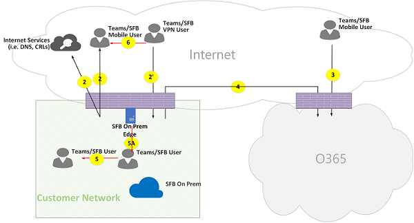
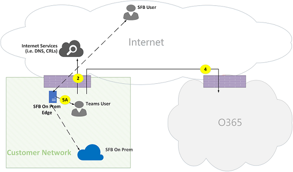

# Fluxos de chamadas do Microsoft TeamsMicrosoft Teams call flows

> [!TIP]
> Assista a esta sessão para saber como o Teams aproveita sua rede e como planejar uma conectividade de rede ideal: [Planejamento de rede do Teams.](https://aka.ms/teams-networking)Watch this session to learn how Teams leverages your network and how to plan for optimal network connectivity: [Teams Network Planning](https://aka.ms/teams-networking).

## Visão GeralOverview

Este artigo descreve como o Teams usa o Microsoft 365 ou o Office 365 fluxos de chamada em várias topologias.This article describes how Teams uses Microsoft 365 or Office 365 call flows in various topologies. Além disso, descreve fluxos exclusivos do Teams que são usados para comunicação de mídia ponto a ponto.In addition, it describes unique Teams flows that are used for peer-to-peer media communication. O documento descreve esses fluxos, sua finalidade, sua origem e rescisão na rede.The document describes these flows, their purpose, and their origin and termination on the network. Para fins deste artigo, suponha o seguinte:For purposes of this article, assume the following:

- O Flow X é usado pelo cliente local para se comunicar com o serviço do Microsoft 365 ou do Office 365 na nuvem.Flow X is used by the on-premises client to communicate with the Microsoft 365 or Office 365 service in the cloud. Ela se origina da rede do cliente e termina como ponto de extremidade no Microsoft 365 ou no Office 365.It originates from the customer network, and it terminates as an endpoint in Microsoft 365 or Office 365.

- O Fluxo Y é usado pelo cliente local para se comunicar com um serviço na Internet com o que o Microsoft 365 ou o Office 365 tem dependência.Flow Y is used by the on-premises client to communicate with a service on the Internet that Microsoft 365 or Office 365 has a dependency on. Ela se origina da rede do cliente e termina como ponto de extremidade na Internet.It originates from the customer network, and it terminates as an endpoint on the Internet.

Este artigo aborda as seguintes informações:This article covers the following information:

- **Plano de fundo.****Background**. Fornece informações de plano de fundo, como redes que os fluxos podem percorrer, tipos de tráfego, diretrizes de conectividade da rede do cliente para os pontos de extremidade de serviço do Microsoft 365 ou office 365, interoperabilidade com componentes de terceiros e princípios que são usados pelo Teams para selecionar fluxos de mídia.Provides background information such as networks that the flows may traverse, types of traffic, connectivity guidance from the customer network to Microsoft 365 or Office 365 service endpoints, interoperability with third-party components, and principles that are used by Teams to select media flows.

- **Fluxos de chamada em várias topologias.****Call flows in various topologies**. Ilustra o uso de fluxos de chamada em várias topologias.Illustrates the use of call flows in various topologies. Para cada topologia, a seção enumera todos os fluxos com suporte e ilustra como esses fluxos são usados em vários casos de uso.For each topology, the section enumerates all supported flows and illustrates how these flows are used in several use cases. Para cada caso de uso, descreve a sequência e a seleção de fluxos usando um diagrama de fluxo.For each use case, it describes the sequence and selection of flows using a flow diagram.

- **Equipes com otimização de Rota Expressa.****Teams with Express Route optimization**. Descreve como esses fluxos são usados quando a Rota Expressa é implantada para otimização, ilustrada usando uma topologia simples.Describes how these flows are used when Express Route is deployed for optimization, illustrated using a simple topology.

## Plano de fundoBackground

### Segmentos de redeNetwork segments

**Rede do cliente.****Customer network**. Esse é o segmento de rede que você controla e gerencia.This is the network segment that you control and manage. Isso inclui todas as conexões do cliente nos escritórios de clientes, seja com fio ou sem fio, conexões entre edifícios de escritório, conexões com datacenters locais e suas conexões com provedores de Internet, Rota Expressa ou qualquer outro peering particular.This includes all customer connections within customer offices, whether wired or wireless, connections between office buildings, connections to on-premises datacenters, and your connections to Internet providers, Express Route, or any other private peering.

Normalmente, uma rede do cliente tem vários perímetros de rede com firewalls e/ou servidores proxy, que impõem as políticas de segurança da sua organização e que só permitem determinado tráfego de rede que você configurou e configurou.Typically, a customer network has several network perimeters with firewalls and/or proxy servers, which enforce your organization's security policies, and that only allow certain network traffic that you have set up and configured. Como você gerencia essa rede, tem controle direto sobre o desempenho da rede e recomendamos concluir avaliações de rede para validar o desempenho dentro de sites em sua rede e de sua rede para a rede do Microsoft 365 ou do Office 365.Because you manage this network, you have direct control over the performance of the network, and we recommend that you complete network assessments to validate performance both within sites in your network and from your network to the Microsoft 365 or Office 365 network.

**Internet.****Internet**. Esse é o segmento de rede que faz parte de sua rede geral que será usado por usuários que estão se conectando ao Microsoft 365 ou ao Office 365 de fora da rede do cliente.This is the network segment that is part of your overall network that will be used by users who are connecting to Microsoft 365 or Office 365 from outside of the customer network. Ele também é usado por algum tráfego da rede do cliente para o Microsoft 365 ou o Office 365.It is also used by some traffic from the customer network to Microsoft 365 or Office 365.

**Rede privada visitada ou convidada.****Visited or guest private network**. Esse é o segmento de rede fora da sua rede do cliente, mas não na Internet pública, que seus usuários e seus convidados podem visitar (por exemplo, uma rede privada de casa ou uma rede privada corporativa, que não implanta o Teams, onde seus usuários e seus clientes que interagem com os serviços do Teams podem residir).This is the network segment outside your customer network, but not in the public Internet, that your users and their guests may visit (for example, a home private network or an enterprise private network, that does not deploy Teams, where your users and their customers that interact with Teams services may reside).

> [!NOTE]
> A conectividade com o Microsoft 365 ou o Office 365 também é aplicável a essas redes.Connectivity to Microsoft 365 or Office 365 is also applicable to these networks.

**Microsoft 365 ou Office 365.****Microsoft 365 or Office 365**. Esse é o segmento de rede compatível com os serviços do Microsoft 365 ou do Office 365.This is the network segment that supports Microsoft 365 or Office 365 services. Ele é distribuído em todo o mundo com bordas próximas à rede do cliente na maioria dos locais.It is distributed worldwide with edges in proximity to the customer network in most locations. As funções incluem Retransmissão de Transporte, servidor de conferência e Processador de Mídia.Functions include Transport Relay, conferencing server, and Media Processor.

**Rota Expressa (opcional).****Express Route (optional)**. Esse é o segmento de rede que faz parte de sua rede geral que lhe dará uma conexão dedicada e privada com a rede do Microsoft 365 ou do Office 365.This is the network segment that is part of your overall network that will give you a dedicated, private connection to the Microsoft 365 or Office 365 network.

### Tipos de tráfegoTypes of traffic

**Mídia em tempo real.****Real-time media**. Dados encapsulados em RTP (Protocolo de Transporte em Tempo Real) que suportam cargas de trabalho de áudio, vídeo e compartilhamento de tela.Data encapsulated within Real-time Transport Protocol (RTP) that supports audio, video, and screen sharing workloads. Em geral, o tráfego de mídia é altamente sensível à latência, portanto, você deseja que esse tráfego pegue o caminho mais direto possível e use UDP versus TCP como protocolo de camada de transporte, que é o melhor transporte para mídias interativas em tempo real a partir de uma perspectiva de qualidade.In general, media traffic is highly latency sensitive, so you would want this traffic to take the most direct path possible, and to use UDP versus TCP as the transport layer protocol, which is the best transport for interactive real time media from a quality perspective. (Observe que, como último recurso, a mídia pode usar TCP/IP e também ser túnel dentro do protocolo HTTP, mas não é recomendável devido a implicações de má qualidade.) O fluxo RTP é protegido usando SRTP, no qual somente a carga é criptografada.(Note that as a last resort, media can use TCP/IP and also be tunneled within the HTTP protocol, but it is not recommended due to bad quality implications.) RTP flow is secured using SRTP, in which only the payload is encrypted.

**Sinalização.****Signaling**. O vínculo de comunicação entre o cliente e o servidor ou outros clientes que são usados para controlar atividades (por exemplo, quando uma chamada é iniciada) e entregar mensagens instantâneas.The communication link between the client and server, or other clients that are used to control activities (for example, when a call is initiated), and deliver instant messages. A maioria do tráfego de sinalização usa as interfaces REST baseadas em HTTPS, embora em alguns cenários (por exemplo, a conexão entre o Microsoft 365 ou o Office 365 e um Controlador de Borda de Sessão) use protocolo SIP.Most signaling traffic uses the HTTPS-based REST interfaces, though in some scenarios (for example, connection between Microsoft 365 or Office 365 and a Session Border Controller) it uses SIP protocol. É importante compreender que esse tráfego é muito menos sensível à latência, mas pode causar interrupções de serviço ou tempos limite de chamada se a latência entre os pontos de extremidade exceder vários segundos.It's important to understand that this traffic is much less sensitive to latency but may cause service outages or call timeouts if latency between the endpoints exceeds several seconds.

### Conectividade com o Microsoft 365 ou o Office 365Connectivity to Microsoft 365 or Office 365

O Teams [requer conectividade com a Internet.](https://docs.microsoft.com/office365/enterprise/assessing-network-connectivity)Teams requires [connectivity to the Internet](https://docs.microsoft.com/office365/enterprise/assessing-network-connectivity). UrLs do ponto de extremidade e intervalos de endereços IP do Teams são listados em URLs e intervalos de [endereços IP do Office 365.](https://docs.microsoft.com/office365/enterprise/urls-and-ip-address-ranges)Teams endpoint URLs and IP address ranges are listed in [Office 365 URLs and IP address ranges](https://docs.microsoft.com/office365/enterprise/urls-and-ip-address-ranges). (Observe que a conectividade aberta para portas TCP 80 e 443 e para portas UDP 3478 a 3481 é necessária.) Além disso, o Teams tem uma dependência com o Skype for Business Online, que também deve estar conectado à Internet.(Note that open connectivity to TCP ports 80 and 443, and to UDP ports 3478 through 3481, is required.) Furthermore, Teams has a dependency on Skype for Business Online, which must also be connected to the Internet.

A conectividade de fluxos de mídia do Teams é implementada usando os procedimentos padrão de Estabelecimento de Conectividade Interativa (ICE) IETF.Teams media flows connectivity is implemented using standard IETF Interactive Connectivity Establishment (ICE) procedures.

### Restrições de interoperabilidadeInteroperability restrictions

**Retransmissão de mídia de terceiros.****Third-party media relays**. Um fluxo de mídia do Teams (ou seja, onde um dos pontos de extremidade de mídia é o Teams) pode passar apenas por retransmissão de mídia nativa do Teams ou skype for Business.A Teams media flow (that is, where one of the media endpoints is Teams) may traverse only Teams or Skype for Business native media relays. Não há suporte para interoperabilidade com retransmissão de mídia de terceiros.Interoperability with a third-party media relay is not supported. (Observe que um SBC de terceiros no limite com PSTN deve encerrar o fluxo RTP/RTCP, protegido usando SRTP e não retransmiti-lo para o próximo salto.)(Note that a third-party SBC on the boundary with PSTN must terminate RTP/RTCP stream, secured using SRTP, and not relay it to the next hop.)

**Servidores proxy SIP de terceiros.****Third-party SIP proxy servers**. Uma caixa de diálogo SIP de sinalização do Teams com um SBC de terceiros e/ou gateway pode percorrer proxies sip nativos do Teams ou skype for Business.A Teams signaling SIP dialog with a third-party SBC and/or gateway may traverse Teams or Skype for Business native SIP proxies. Não há suporte para interoperabilidade com um proxy SIP de terceiros.Interoperability with a third-party SIP proxy is not supported.

**B2BUA (ou SBC)** de terceiros.**Third-party B2BUA (or SBC)**. Um fluxo de mídia do Teams de e para o PSTN é encerrado por um SBC de terceiros.A Teams media flow to and from the PSTN is terminated by a third-party SBC. No entanto, não há suporte para interoperabilidade com um SBC de terceiros na rede do Teams (onde um SBC de terceiros media dois pontos de extremidade do Teams ou skype for Business).However, interoperability with a third-party SBC within the Teams network (where a third-party SBC mediates two Teams or Skype for Business endpoints) is not supported.

### Tecnologias que não são recomendadas com o Microsoft TeamsTechnologies that are not recommended with Microsoft Teams

**Rede VPN.****VPN network**. Não é recomendável para tráfego de mídia (ou fluxo 2').It is not recommended for media traffic (or flow 2'). O cliente VPN deve usar a VPN dividida e rotear o tráfego de mídia como qualquer usuário externo que não seja VPN, conforme especificado na habilitação de mídia do [Lync](https://techcommunity.microsoft.com/t5/Skype-for-Business-Blog/Enabling-Lync-Media-to-Bypass-a-VPN-Tunnel/ba-p/620210)para ignorar um túnel VPN.The VPN client should use split VPN and route media traffic like any external non-VPN user, as specified in [Enabling Lync media to bypass a VPN tunnel](https://techcommunity.microsoft.com/t5/Skype-for-Business-Blog/Enabling-Lync-Media-to-Bypass-a-VPN-Tunnel/ba-p/620210).

> [!NOTE]
> Embora o título indique o Lync, ele também é aplicável ao Teams.Although the title indicates Lync, it is applicable to Teams as well.

**Shapers de pacote.****Packet shapers**. Qualquer tipo de equipamento de pacote, inspeção de pacotes ou dispositivos de modelador de pacotes não são recomendados e podem prejudicar significativamente a qualidade.Any kind of packet snippers, packet inspection, or packet shaper devices are not recommended and may degrade quality significantly.

### PrincípiosPrinciples

Há quatro princípios gerais que ajudam você a entender os fluxos de chamada do Microsoft Teams:There are four general principles that help you understand call flows for Microsoft Teams:

- Uma conferência do Microsoft Teams é hospedada pelo Microsoft 365 ou pelo Office 365 na mesma região em que o primeiro participante ingressou.A Microsoft Teams conference is hosted by Microsoft 365 or Office 365 in the same region where the first participant joined. (Observe que, se houver exceções a essa regra em algumas topologias, elas serão descritas neste documento e ilustradas por um fluxo de chamada apropriado.)(Note that if there are exceptions to this rule in some topologies, they will be described in this document and illustrated by an appropriate call flow.)

- Um ponto de extremidade de mídia do Teams no Microsoft 365 ou no Office 365 é usado com base nas necessidades de processamento de mídia e não com base no tipo de chamada.A Teams media endpoint in Microsoft 365 or Office 365 is used based on media processing needs and not based on call type. (Por exemplo, uma chamada ponto a ponto pode usar um ponto de extremidade de mídia na nuvem para processar mídia para transcrição ou gravação, enquanto uma conferência com dois participantes pode não usar nenhum ponto de extremidade de mídia na nuvem.) No entanto, a maioria das conferências usará um ponto de extremidade de mídia para fins de combinação e roteamento, alocados onde a conferência está hospedada.(For example, a point-to-point call may use a media endpoint in the cloud to process media for transcription or recording, while a conference with two participants may not use any media endpoint in the cloud.) However, most conferences will use a media endpoint for mixing and routing purposes, allocated where the conference is hosted. O tráfego de mídia enviado de um cliente para o ponto de extremidade de mídia pode ser roteado diretamente ou usar uma Retransmissão de Transporte no Microsoft 365 ou no Office 365, se necessário, devido a restrições de firewall de rede do cliente.The media traffic sent from a client to the media endpoint may be routed directly or use a Transport Relay in Microsoft 365 or Office 365 if required due to customer network firewall restrictions.

- O tráfego de mídia para chamadas ponto a ponto assume a rota mais direta que está disponível, supondo que a chamada não resumente um ponto de extremidade de mídia na nuvem (veja o princípio anterior).Media traffic for peer-to-peer calls take the most direct route that is available, assuming that the call doesn't mandate a media endpoint in the cloud (see previous principle). A rota preferencial é direta para o ponto remoto (cliente), mas se essa rota não estiver disponível, uma ou mais Retransmissão de Transporte retransmiti o tráfego.The preferred route is direct to the remote peer (client), but if that route isn't available, then one or more Transport Relays will relay traffic. É recomendável que o tráfego de mídia não transversa servidores, como shapers de pacotes, servidores VPN e assim por diante, pois isso afetará a qualidade da mídia.It is recommended that media traffic shall not transverse servers such as packet shapers, VPN servers, and so on, since this will impact the media quality.

- O tráfego de sinalização sempre vai para o servidor mais próximo do usuário.Signaling traffic always goes to the closest server to the user.

Para saber mais sobre os detalhes sobre o caminho de mídia escolhido, consulte Noções básicas sobre fluxos de mídia no [Microsoft Teams - BRK4016.](https://www.youtube.com/watch?v=1tmHMIlAQdo)To learn more about the details on the media path that is chosen, see [Understanding Media Flows in Microsoft Teams - BRK4016](https://www.youtube.com/watch?v=1tmHMIlAQdo).

## Fluxos de chamada em várias topologiasCall flows in various topologies

### Topologia do TeamsTeams topology

Essa topologia é usada pelos clientes que aproveitam os serviços do Teams na nuvem sem qualquer implantação local, como o Skype for Business Server ou o Roteamento Direto do Sistema de Telefonia.This topology is used by customers that leverage Teams services from the cloud without any on-premises deployment, such as Skype for Business Server or Phone System Direct Routing. Além disso, a interface do Microsoft 365 ou do Office 365 é feita pela Internet sem a Rota Expressa do Azure.In addition, the interface to Microsoft 365 or Office 365 is done over the Internet without Azure Express Route.

*Figura 1 - topologia do Teams**Figure 1 - Teams topology*

Observe que:Note that:

- A direção das setas no diagrama acima refletem a direção inicial da comunicação que afeta a conectividade nos perímetros da empresa.The direction of the arrows on the diagram above reflect the initiation direction of the communication that affects connectivity at the enterprise perimeters. No caso de UDP para mídia, o primeiro(s) pacote(s) pode fluir na direção inversa, mas esses pacotes podem ser bloqueados até que os pacotes na outra direção fluam.In the case of UDP for media, the first packet(s) may flow in the reverse direction, but these packets may be blocked until packets in the other direction will flow.
- O Teams é implantado lado a lado com o Skype for Business Online, portanto, os clientes são exibidos como "Usuário do Teams/SFB".Teams is deployed side by side with Skype for Business Online, hence clients are displayed as "Teams/SFB user."

Você pode encontrar mais informações sobre as seguintes topologias opcionais mais adiante no artigo:You can find more information on the following optional topologies later in the article:

- A implantação local do Skype for Business é descrita na **topologia híbrida do Teams.**Skype for Business on-premises deployment is described in **Teams hybrid topology**.
- O Roteamento Direto do Sistema telefônico (para conectividade PSTN) é descrito no **Teams com topologia de Roteamento Direto.**Phone System Direct Routing (for PSTN connectivity) is described in **Teams with Direct Routing topology**.
- Rota Expressa é descrita no **Teams com otimização de Rota Expressa.**Express Route is described in **Teams with Express Route optimization**.

**Descrições de fluxo:****Flow descriptions**:

- **Fluxo 2** – Representa um fluxo iniciado por um usuário na rede do cliente para a Internet como parte da experiência do Teams do usuário.**Flow 2** – Represents a flow initiated by a user on the customer network to the Internet as a part of the user's Teams experience. Exemplos desses fluxos são DNS e mídia ponto a ponto.Examples of these flows are DNS and peer-to-peer media.
- **Flow 2'** – Representa um fluxo iniciado por um usuário remoto do Teams móvel, com VPN para a rede do cliente.**Flow 2'** – Represents a flow initiated by a remote mobile Teams user, with VPN to the customer network.
- **Flow 3** – Representa um fluxo iniciado por um usuário remoto do Teams móvel para os pontos de extremidade do Microsoft 365 ou do Office 365/Teams.**Flow 3** – Represents a flow initiated by a remote mobile Teams user to Microsoft 365 or Office 365/Teams endpoints.
- **Flow 4** – Representa um fluxo iniciado por um usuário na rede do cliente para os pontos de extremidade do Microsoft 365 ou Office 365/Teams.**Flow 4** – Represents a flow initiated by a user on the customer network to Microsoft 365 or Office 365/Teams endpoints.
- **Flow 5** – Representa um fluxo de mídia ponto a ponto entre um usuário do Teams e outro usuário do Teams ou skype for Business dentro da rede do cliente.**Flow 5** – Represents a peer-to-peer media flow between a Teams user and another Teams or Skype for Business user within the customer network.
- **Flow 6** – Representa um fluxo de mídia ponto a ponto entre um usuário remoto do Teams móvel e outro usuário remoto do Teams ou skype for Business pela Internet.**Flow 6** – Represents a peer-to-peer media flow between a remote mobile Teams user and another remote mobile Teams or Skype for Business user over the Internet.

#### Caso de uso: Um para umUse case: One-to-one

As chamadas um para um usam um modelo comum no qual o chamador obterá um conjunto de candidatos consistindo em endereços IP/portas, incluindo candidatos locais, retransmissão e reflexivos (endereço IP público do cliente, como visto pela retransmissão).One-to-one calls use a common model in which the caller will obtain a set of candidates consisting of IP addresses/ports, including local, relay, and reflexive (public IP address of client as seen by the relay) candidates. O chamador envia esses candidatos para o chamador; a parte chamada também obtém um conjunto semelhante de candidatos e os envia para o chamador.The caller sends these candidates to the called party; the called party also obtains a similar set of candidates and sends them to the caller. As mensagens de verificação de conectividade STUN são usadas para descobrir qual chamador/chamador de caminhos de mídia de festa funcionam e o melhor caminho de trabalho é selecionado.STUN connectivity check messages are used to find which caller/called party media paths work, and the best working path is selected. Mídia (ou seja, pacotes RTP/RTCP protegidos usando SRTP) são enviados usando o par de candidatos selecionado.Media (that is, RTP/RTCP packets secured using SRTP) are then sent using the selected candidate pair. A retransmissão de transporte é implantada como parte do Microsoft 365 e do Office 365.The Transport relay is deployed as part of Microsoft 365 and Office 365.

Se os candidatos locais de endereço IP/porta ou os candidatos reflexivos têm conectividade, o caminho direto entre os clientes (ou usando um NAT) será selecionado para mídia.If the local IP address/port candidates or the reflexive candidates have connectivity, then the direct path between the clients (or using a NAT) will be selected for media. Se os clientes estão ambos na rede do cliente, o caminho direto deve ser selecionado.If the clients are both on the customer network, then the direct path should be selected. Isso requer conectividade UDP direta dentro da rede do cliente.This requires direct UDP connectivity within the customer network. Se os clientes são ambos usuários de nuvem mônica, então, dependendo do NAT/firewall, a mídia pode usar conectividade direta.If the clients are both nomadic cloud users, then depending on the NAT/firewall, media may use direct connectivity.

Se um cliente for interno na rede do cliente e um cliente for externo (por exemplo, um usuário de nuvem móvel), é improvável que a conectividade direta entre os candidatos locais ou reflexivos está funcionando.If one client is internal on the customer network and one client is external (for example, a mobile cloud user), then it is unlikely that direct connectivity between the local or reflexive candidates is working. Nesse caso, uma opção é usar um dos candidatos à Retransmissão de Transporte de um dos clientes (por exemplo, o cliente interno obteve um candidato à retransmissão de transporte no Microsoft 365 ou no Office 365; o cliente externo precisa ser capaz de enviar pacotes STUN/RTP/RTCP para a retransmissão de transporte).In this case, an option is to use one of the Transport Relay candidates from either client (for example, the internal client obtained a relay candidate from the Transport relay in Microsoft 365 or Office 365; the external client needs to be able to send STUN/RTP/RTCP packets to the transport relay). Outra opção é o cliente interno enviar para o candidato à retransmissão obtido pelo cliente de nuvem móvel.Another option is the internal client sends to the relay candidate obtained by the mobile cloud client. Observe que, embora a conectividade UDP para mídia seja altamente recomendável, o TCP tem suporte.Note that, although UDP connectivity for media is highly recommended, TCP is supported.

**Etapas de alto nível:****High-level steps**:

1. O Usuário A do Teams resolve o DNS (nome de domínio da URL) usando o fluxo 2.Teams User A resolves URL domain name (DNS) using flow 2.
1. O Usuário do Teams A aloca uma porta de Media Relay no Teams Transport Relay usando o fluxo 4.Teams User A allocates a media Relay port on Teams Transport Relay using flow 4.
1. O Usuário A do Teams envia "convite" com candidatos ICE usando o fluxo 4 para o Microsoft 365 ou o Office 365.Teams User A sends "invite" with ICE candidates using flow 4 to Microsoft 365 or Office 365.
1. O Microsoft 365 ou o Office 365 envia uma notificação ao usuário B do Teams usando o fluxo 4.Microsoft 365 or Office 365 sends notification to Teams User B using flow 4.
1. O Usuário B do Teams aloca uma porta de Media Relay na Retransmissão de Transporte do Teams usando o fluxo 4.Teams User B allocates a media Relay port on Teams Transport Relay using flow 4.
1. O Usuário B do Teams envia "resposta" com candidatos ICE usando o fluxo 4, que é encaminhado de volta ao Usuário A do Teams usando o Flow 4.Teams User B sends "answer" with ICE candidates using flow 4, which is forwarded back to Teams User A using Flow 4.
1. O Usuário A do Teams e o Usuário B do Teams invocam testes de conectividade ICE e o melhor caminho de mídia disponível está selecionado (consulte os diagramas abaixo para ver vários casos de uso).Teams User A and Teams User B invoke ICE connectivity tests and the best available media path is selected (see diagrams below for various use cases).
1. Os usuários do Teams enviam telemetria para o Microsoft 365 ou o Office 365 usando o fluxo 4.Teams Users send telemetry to Microsoft 365 or Office 365 using flow 4.

**Na rede do cliente:****Within customer network:**

*Figura 2 – Na rede do cliente**Figure 2 - Within customer network*

Na etapa 7, o fluxo de mídia ponto a ponto 5 está selecionado.In step 7, peer-to-peer media flow 5 is selected.

A mídia é bidirecional.Media is bidirectional. A direção do fluxo 5 indica que um lado inicia a comunicação a partir de uma perspectiva de conectividade, consistente com todos os fluxos neste documento.The direction of flow 5 indicates that one side initiates the communication from a connectivity perspective, consistent with all the flows in this document. Nesse caso, não importa qual direção é usada porque os dois pontos de extremidade estão dentro da rede do cliente.In this case, it doesn't matter which direction is used because both endpoints are within the customer network.

**Rede do cliente para usuário externo (mídia retransmitida pela Retransmissão de Transporte do Teams):****Customer network to external user (media relayed by Teams Transport Relay):**

*Figura 3 - Rede do cliente para usuário externo (mídia retransmitida pela Retransmissão de Transporte do Teams)**Figure 3 - Customer network to external user (media relayed by Teams Transport Relay)*

Na etapa 7, o fluxo 4, da rede do cliente para o Microsoft 365 ou o Office 365 e o fluxo 3, do usuário móvel remoto do Teams para o Microsoft 365 ou o Office 365, estão selecionados.In step 7, flow 4, from customer network to Microsoft 365 or Office 365, and flow 3, from remote mobile Teams user to Microsoft 365 or Office 365, are selected. Esses fluxos são retransmitir pela Retransmissão de Transporte do Teams no Microsoft 365 ou no Office 365.These flows are relayed by Teams Transport Relay within Microsoft 365 or Office 365.

A mídia é bidirecional, onde a direção indica qual lado inicia a comunicação a partir de uma perspectiva de conectividade.Media is bidirectional, where direction indicates which side initiates the communication from a connectivity perspective. Nesse caso, esses fluxos são usados para sinalização e mídia, usando diferentes protocolos de transporte e endereços.In this case, these flows are used for signaling and media, using different transport protocols and addresses.

**Rede do cliente para usuário externo (mídia direta):****Customer network to external user (direct media):**

*Figura 4 – Rede do cliente para usuário externo (mídia direta)**Figure 4 - Customer network to external user (direct media)*

Na etapa 7, o fluxo 2, da rede do cliente para a Internet (ponto do cliente), está selecionado.In step 7, flow 2, from customer network to the Internet (client's peer), is selected.

- A mídia direta com o usuário móvel remoto (não repassado pelo Microsoft 365 ou pelo Office 365) é opcional.Direct media with remote mobile user (not relayed through Microsoft 365 or Office 365) is optional. Em outras palavras, o cliente pode bloquear esse caminho para impor um caminho de mídia por meio da Retransmissão de Transporte no Microsoft 365 ou no Office 365.In other words, customer may block this path to enforce a media path through Transport Relay in Microsoft 365 or Office 365.

- A mídia é bidirecional.Media is bidirectional. A direção do fluxo 2 para o usuário móvel remoto indica que um lado inicia a comunicação a partir de uma perspectiva de conectividade.The direction of flow 2 to remote mobile user indicates that one side initiates the communication from a connectivity perspective.

**Usuário VPN para usuário interno (mídia retransmitida pela Retransmissão de Transporte do Teams)****VPN user to internal user (media relayed by Teams Transport Relay)**

*Figura 5 – Usuário VPN para usuário interno (mídia retransmitida pela Retransmissão de Transporte do Teams)**Figure 5 - VPN user to internal user (media relayed by Teams Transport Relay)*

A sinalização entre a VPN para a rede do cliente está usando o fluxo 2'.Signaling between the VPN to the customer network is using flow 2'. A sinalização entre a rede do cliente e o Microsoft 365 ou o Office 365 está usando o fluxo 4.Signaling between the customer network and Microsoft 365 or Office 365 is using flow 4. No entanto, a mídia ignora a VPN e é roteada usando os fluxos 3 e 4 por meio da retransmissão de mídia do Teams no Microsoft 365 ou no Office 365.However, media bypasses the VPN and is routed using flows 3 and 4 through Teams media relay in Microsoft 365 or Office 365.

**Usuário VPN para usuário interno (mídia direta)****VPN user to internal user (direct media)**

*Figura 6 – usuário VPN para usuário interno (mídia direta)**Figure 6 - VPN user to internal user (direct media)*

A sinalização entre a VPN para a rede do cliente está usando o fluxo 2'.Signaling between the VPN to the customer network is using flow 2'. A sinalização entre a rede do cliente e o Microsoft 365 ou o Office 365 está usando o fluxo 4.Signaling between the customer network and Microsoft 365 or Office 365 is using flow 4. No entanto, a mídia ignora a VPN e é roteada usando o fluxo 2 da rede do cliente para a Internet.However, media bypasses the VPN and is routed using flow 2 from the customer network to the Internet.

A mídia é bidirecional.Media is bidirectional. A direção do fluxo 2 para o usuário móvel remoto indica que um lado inicia a comunicação a partir de uma perspectiva de conectividade.The direction of flow 2 to the remote mobile user indicates that one side initiates the communication from a connectivity perspective.

**Usuário VPN para usuário externo (mídia direta)****VPN user to external user (direct media)**

*Figura 7 – usuário VPN para usuário externo (mídia direta)**Figure 7 - VPN user to external user (direct media)*

A sinalização entre o usuário VPN para a rede do cliente está usando o fluxo 2' e usando o fluxo 4 para o Microsoft 365 ou o Office 365.Signaling between the VPN user to the customer network is using flow 2' and using flow 4 to Microsoft 365 or Office 365. No entanto, a mídia ignora VPN e é roteada usando o fluxo 6.However, media bypasses VPN and is routed using flow 6.

A mídia é bidirecional.Media is bidirectional. A direção do fluxo 6 para o usuário móvel remoto indica que um lado inicia a comunicação a partir de uma perspectiva de conectividade.The direction of flow 6 to the remote mobile user indicates that one side initiates the communication from a connectivity perspective.

#### Caso de uso: Teams para PSTN por meio do Microsoft 365 ou do Tronco do Office 365Use Case: Teams to PSTN through Microsoft 365 or Office 365 Trunk

O Microsoft 365 e o Office 365 têm um sistema telefônico que permite fazer e receber chamadas da PSTN (Rede Telefônica Pública Comutado).Microsoft 365 and Office 365 have a Phone System that allows placing and receiving calls from the Public Switched Telephone Network (PSTN). Se o tronco PSTN estiver conectado usando o Plano de Chamada do Sistema de Telefonia, não haverá requisitos de conectividade especiais para esse caso de uso.If the PSTN trunk is connected using the Phone System Calling Plan, then there are no special connectivity requirements for this use case. (Se quiser conectar seu próprio tronco PSTN local ao Microsoft 365 ou ao Office 365, você pode usar o Roteamento Direto do Sistema de Telefonia.)(If you want to connect your own on-premises PSTN trunk to Microsoft 365 or Office 365, you can use Phone System Direct Routing.)

*Figura 8 – Teams para PSTN por meio do Tronco do Office 365**Figure 8 - Teams to PSTN through Office 365 Trunk*

#### Caso de uso: Reunião do TeamsUse case: Teams meeting

O servidor de conferência de áudio/vídeo/compartilhamento de tela (VBSS) faz parte do Microsoft 365 e do Office 365.The audio/video/screen sharing (VBSS) conferencing server is part of Microsoft 365 and Office 365. Ele tem um endereço IP público que deve estar acessível a partir da rede do cliente e deve estar acessível a partir de um cliente cloudic cloud.It has a public IP address that must be reachable from the customer network and must be reachable from a Nomadic Cloud client. Cada cliente/ponto de extremidade precisa ser capaz de se conectar ao servidor de conferência.Each client/endpoint needs to be able to connect to the conferencing server.

Os clientes internos obterão candidatos locais, reflexivos e retransmitirão da mesma maneira que descrito para chamadas um para um.Internal clients will obtain local, reflexive, and relay candidates in the same manner as described for one-to-one calls. Os clientes enviarão esses candidatos para o servidor de conferência em um convite.The clients will send these candidates to the conferencing server in an invite. O servidor de conferência não usa uma retransmissão porque tem um endereço IP publicamente acessível, portanto, ele responde com seu candidato a endereço IP local.The conferencing server does not use a relay since it has a publicly reachable IP address, so it responds with its local IP address candidate. O cliente e o servidor de conferência verificarão a conectividade da mesma maneira descrita para chamadas um para um.The client and conferencing server will check connectivity in the same manner described for one-to-one calls.

Observe que:Note that:

- Os clientes do Teams não podem ingressar em reuniões do Skype for Business, e os clientes do Skype for Business não podem ingressar em reuniões do Teams.Teams clients cannot join Skype for Business meetings, and Skype for Business clients cannot join Teams meetings.

- Um usuário PSTN opcionalmente "Disca" ou é "Discado", dependendo do provisionamento de Chamada PSTN e/ou conferência do organizador da reunião.A PSTN user optionally "Dials IN" or is "Dialed OUT", depending on the meeting's organizer PSTN Calling and/or conferencing provisioning.

- Um usuário convidado ou um usuário cliente pode ingressar de uma rede privada de convidado, que está protegida usando FW/NAT com regras estritas.A guest user or a customer user may join from a guest private network, which is protected using FW/NAT with strict rules.

*Figura 9 – Reunião do Teams**Figure 9 - Teams Meeting*

#### Caso de uso: Federação com o Skype for Business localUse case: Federation with Skype for Business on premises

**Mídia retransmitida pela Retransmissão de Transporte do Teams no Microsoft 365 ou no Office 365****Media relayed by Teams Transport Relay in Microsoft 365 or Office 365**

*Figura 10 – Mídia retransmitida pelo Teams Transport Relay no Office 365**Figure 10 - Media relayed by Teams Transport Relay in Office 365*

Observe que:Note that:

- A federação é, por definição, uma comunicação entre dois locatários.Federation is, by definition, a communication between two tenants. Nesse caso, o locatário A, que usa o Teams, federa com o locatário B, que usa o Skype for Business no local.In this case, tenant A, which uses Teams, federates with tenant B, which uses Skype for Business on premises. Se o locatário B também estiver usando o Microsoft 365 ou o Office 365, o cliente Skype for Business teria usado o fluxo 3 para se conectar ao Microsoft 365 ou ao Office 365.If tenant B is also using Microsoft 365 or Office 365, then the Skype for Business client would have used flow 3 to connect with Microsoft 365 or Office 365.

- A sinalização e a mídia do cliente federado do Skype for Business para o Skype for Business Server local estão fora do escopo deste documento.Signaling and media from the federated Skype for Business client to on-premises Skype for Business Server is out of scope of this document. No entanto, ele é ilustrado aqui para esclarecer.However, it is illustrated here for clarity.

- A sinalização entre o Teams e o Skype for Business é ponteada por um gateway.Signaling between Teams and Skype for Business is bridged by a gateway.

- A mídia nesse caso é retransmitida pela Retransmissão de Transporte do Teams para a rede do cliente e cliente remoto do Skype for Business usando o fluxo 4.Media in this case is relayed by Teams Transport Relay to the customer network and remote Skype for Business client using flow 4.

**Mídia retransmitida pelo Skype for Business Media Relay em locatário federado****Media relayed by Skype for Business Media Relay in federated tenant**

*Figura 11 – Mídia retransmitida pelo Skype for Business Media Relay em locatário federado**Figure 11 - Media relayed by Skype for Business Media Relay in federated tenant*

Observe que:Note that:

- A sinalização e a mídia do cliente federado do Skype for Business para um Skype for Business Server local estão fora do escopo deste documento.Signaling and media from the federated Skype for Business client to an on-premises Skype for Business Server is out of scope of this document. No entanto, ele é ilustrado aqui para esclarecer.However, it is illustrated here for clarity.

- A sinalização entre o Teams e o Skype for Business é ponteada por um Gateway.Signaling between Teams and Skype for Business is bridged by a Gateway.

- A mídia nesse caso é retransmitida pelo Skype for Business Media Relay local para a rede do cliente usando o fluxo 2.Media in this case is relayed by Skype for Business on-premises Media Relay to the customer network using flow 2. (Observe que o tráfego do usuário do Teams para o Media Relay remoto na rede federada do cliente será inicialmente bloqueado pelo Media Relay até que o tráfego na direção inversa comece a fluir.(Note that traffic from Teams user to the remote Media Relay in the federated customer network will be initially blocked by the Media Relay until traffic in the reverse direction starts to flow. No entanto, o fluxo bidirecional abrirá a conectividade em ambas as direções.)However, the bidirectional flow will open connectivity in both directions.)

**Direto (ponto a ponto)****Direct (peer-to-peer)**

*Figura 12 – Direta (ponto a ponto)**Figure 12 - Direct (peer-to-peer)*

### Topologia híbrida do TeamsTeams hybrid topology

Esta topologia inclui o Teams com uma implantação local do Skype for Business.This topology includes Teams with a Skype for Business on-premises deployment.

*Figura 13 - Topologia híbrida do Teams**Figure 13 - Teams hybrid topology*

- A direção das setas no diagrama acima refletem a direção inicial da comunicação que afeta a conectividade nos perímetros da empresa.The direction of the arrows on the diagram above reflect the initiation direction of the communication that affects connectivity at the enterprise perimeters. No caso de UDP para mídia, o primeiro(s) pacote(s) pode fluir na direção inversa, mas esses pacotes podem ser bloqueados até que os pacotes na outra direção fluam.In the case of UDP for media, the first packet(s) may flow in the reverse direction, but these packets may be blocked until packets in the other direction will flow.

- O Teams é implantado lado a lado com o Skype for Business Online, portanto, os clientes são exibidos como "Usuário do Teams/SFB".Teams is deployed side by side with Skype for Business Online, hence clients are displayed as "Teams/SFB user."

Fluxo adicional (em cima da topologia do Teams):Additional flow (on top of Teams topology):

- **Flow 5A** – Representa um fluxo de mídia ponto a ponto entre um usuário do Teams dentro da rede do cliente e uma retransmissão de mídia local do Skype for Business na borda da rede do cliente.**Flow 5A** – Represents a peer-to-peer media flow between a Teams user within the customer network and a Skype for Business on-premises media relay at the customer network edge.

#### Caso de uso: Teams para Skype for Business um para umUse case: Teams to Skype for Business one-to-one

**Híbrido dentro da rede do cliente****Hybrid within the customer network**

*Figura 14 – Híbrido na rede do cliente**Figure 14 - Hybrid within customer network*

A sinalização entre o Teams e o Skype for Business é ponteada por um gateway.Signaling between Teams and Skype for Business is bridged by a gateway. No entanto, a mídia é roteada diretamente ponto a ponto na rede do cliente usando o fluxo 5.However, media is routed directly peer-to-peer within the customer network using flow 5.

**Rede de cliente híbrida com usuário externo do Skype for Business – ressada pelo Microsoft 365 ou pelo Office 365****Hybrid customer network with external Skype for Business user – relayed by Microsoft 365 or Office 365**

*Figura 15 – Rede híbrida do cliente com usuário externo do Skype for Business – ressada pelo Office 365**Figure 15 - Hybrid customer network with external Skype for Business user - relayed by Office 365*

Observe que:Note that:

- A sinalização e a mídia do cliente Skype for Business para um Skype for Business Server local estão fora do escopo deste documento.Signaling and media from the Skype for Business client to an on-premises Skype for Business Server is out of scope of this document. No entanto, ele é ilustrado aqui para esclarecer.However, it is illustrated here for clarity.

- A sinalização entre o Teams e o Skype for Business é ponteada por um gateway.Signaling between Teams and Skype for Business is bridged by a gateway.

- A mídia é retransmitida por meio da Retransmissão de Transporte do Teams para a rede do cliente por meio do fluxo 4.Media is relayed through Teams Transport Relay to the customer network through flow 4.

**Rede híbrida do cliente com usuário externo do Skype for Business – reeddia pelo Edge local****Hybrid customer network with external Skype for Business user – relayed by on-premises Edge**

*Figura 16 – Rede híbrida do cliente com usuário externo do Skype for Business – reeddia pelo Edge local**Figure 16 - Hybrid customer network with external Skype for Business user - relayed by on-premises Edge*

Observe que:Note that:

- A sinalização e a mídia do cliente Skype for Business para um Servidor Local do Skype for Business estão fora do escopo deste documento.Signaling and media from Skype for Business client to an on-premises Skype for Business Server is out of scope of this document. No entanto, ele é ilustrado aqui para esclarecer.However, it is illustrated here for clarity.

- A sinalização é ponteada por um gateway.Signaling is bridged by a gateway.

- A mídia é retransmitida pelo Skype for Business Media Relay no Edge local do Skype for Business para o usuário do Teams dentro da rede do cliente usando o fluxo de mídia 5A.Media is relayed by Skype for Business Media Relay within Skype for Business on-premises Edge to Teams user within the customer network using media flow 5A.

### Teams com topologia de Roteamento Direto do Sistema de TelefoniaTeams with Phone System Direct Routing topology

Esta topologia inclui o Teams com Roteamento Direto do Sistema de Telefonia.This topology includes Teams with Phone System Direct Routing.

O Roteamento Direto permite usar um provedor de serviços PSTN (Rede Telefônica Pública Comutado) de terceiros emparelhando um dispositivo de hardware SBC (Controlador de Borda de Sessão) de propriedade do cliente com suporte para o Microsoft 365 ou o Office 365 e conectando o tronco de telefonia a esse dispositivo.Direct Routing enables you to use a third-party Public Switched Telephone Network (PSTN) service provider by pairing a supported on-premises customer-owned Session Border Controller (SBC) hardware device to Microsoft 365 or Office 365, and then connecting the telephony trunk to that device.

Para dar suporte a esse cenário, o cliente deve implantar um SBC certificado para Roteamento Direto de um dos parceiros certificados da Microsoft.To support this scenario, the customer must deploy a certified SBC for Direct Routing from one of Microsoft's certified partners. O SBC deve ser configurado conforme recomendado pelo fornecedor e ser roueável do Microsoft 365 ou do Office 365 para tráfego UDP direto.The SBC must be configured as recommended by the vendor, and be routable from Microsoft 365 or Office 365 for direct UDP traffic. A mídia pode fluir diretamente do Teams e/ou do cliente Skype for Business para o SBC (ignorar o gateway do Teams) ou percorrer o gateway do Teams.The media may flow directly from Teams and/or the Skype for Business client to the SBC (bypassing the Teams gateway) or traverse through the Teams gateway. A conectividade com o SBC, quando o tronco está configurado para ignorar o gateway do Teams, é baseada no ICE, onde o SBC dá suporte ao ICE-Lite, enquanto o ponto de extremidade de mídia do Teams/Skype for Business dá suporte ao ICE Full Form.The connectivity with the SBC, when the trunk is configured to bypass the Teams gateway, is based on ICE, where SBC supports ICE-Lite, while the Teams/Skype for Business media endpoint supports ICE Full Form.

\*Figura 17 – Topologia do Teams with Phone System Direct Routing\*Figure 17 - Teams with Phone System Direct Routing topology

Observe que:Note that:

- A direção das setas no diagrama acima refletem a direção inicial da comunicação que afeta a conectividade nos perímetros da empresa.The direction of the arrows on the diagram above reflect the initiation direction of the communication that affects connectivity at the enterprise perimeters. No caso de UDP para mídia, o primeiro(s) pacote(s) pode fluir na direção inversa, mas esses pacotes podem ser bloqueados até que os pacotes na outra direção fluam.In the case of UDP for media, the first packet(s) may flow in the reverse direction, but these packets may be blocked until packets in the other direction will flow.

- O Teams é implantado lado a lado com o Skype for Business Online, portanto, os clientes são exibidos como "Usuário do Teams/SFB".Teams is deployed side by side with Skype for Business Online, hence clients are displayed as "Teams/SFB user."

Fluxos adicionais (na parte superior da topologia online do Teams):Additional flows (on top of Teams online topology):

- **Flow 4'** - Representa um fluxo do Microsoft 365 ou do Office 365 para a rede do cliente, usado para estabelecer uma conexão entre o servidor de mídia do Teams na nuvem com o SBC local.**Flow 4'** - Represents a flow from Microsoft 365 or Office 365 to the customer network, used to establish a connection between the Teams media server in the cloud with the SBC on premises.
- **Flow 5B** – Representa um fluxo de mídia entre o usuário do Teams dentro da rede do cliente com o SBC de Roteamento Direto no modo de bypass.**Flow 5B** – Represents a media flow between the Teams user within the customer network with the Direct Routing SBC in bypass mode.
- **Flow 5C** – Representa um fluxo de mídia entre o SBC de Roteamento Direto para outro SBC de Roteamento Direto em um modo de bypass de chamada de cabeamento PSTN.**Flow 5C** – Represents a media flow between the Direct Routing SBC to another Direct Routing SBC in a PSTN hairpin call bypass mode.

**Usuário interno com Roteamento Direto (mídia retransmitida pela Retransmissão de Transporte do Teams)****Internal user with Direct Routing (media relayed by Teams Transport Relay)**

*Figura 18 – Usuário interno com Roteamento Direto (mídia retransmitida pela Retransmissão de Transporte do Teams)**Figure 18 - Internal user with Direct Routing (media relayed by Teams Transport Relay)*

Observe que:Note that:

- O SBC deve ter um endereço IP público que seja roueável do Microsoft 365 ou do Office 365.The SBC must have a public IP address that is routable from Microsoft 365 or Office 365.

- A sinalização e a mídia do SBC para o Microsoft 365 ou Office 365 e vice-versa usam o fluxo 4 e/ou o fluxo 4'.Signaling and media from the SBC to Microsoft 365 or Office 365 and vice versa use flow 4 and/or flow 4'.

- A sinalização e a mídia do cliente dentro da rede do cliente para o Microsoft 365 ou o Office 365 usam o fluxo 4.Signaling and media from the client within the customer network to Microsoft 365 or Office 365 use flow 4.

**Usuário remoto com Roteamento Direto (a mídia é roteada por meio de um servidor de mídia (MP))****Remote user with Direct Routing (media is routed through a media server (MP))**

*Figura 19 – Usuário remoto com Roteamento Direto (a mídia é roteada por meio de um servidor de mídia (MP))**Figure 19 - Remote user with Direct Routing (media is routed through a media server (MP))*

Observe que:Note that:

- O SBC deve ter um endereço IP público que seja roueável do Microsoft 365 ou do Office 365.The SBC must have a public IP address that is routable from Microsoft 365 or Office 365.

- A sinalização e a mídia do SBC para o Microsoft 365 ou Office 365 e vice-versa usam o fluxo 4 e/ou o fluxo 4'.Signaling and media from the SBC to Microsoft 365 or Office 365 and vice versa use flow 4 and/or flow 4'.

- A sinalização e a mídia do cliente na Internet para o Microsoft 365 ou o Office 365 usam o fluxo 3.Signaling and media from the client on the Internet to Microsoft 365 or Office 365 use flow 3.

**Roteamento Direto do usuário interno (bypass de mídia)****Internal user Direct Routing (media bypass)**

*Figura 20 - Roteamento Direto do usuário interno (bypass de mídia)**Figure 20 - Internal user Direct Routing (media bypass)*

Observe que:Note that:

- O SBC deve ter um endereço IP público que seja roueável do Microsoft 365 ou do Office 365.The SBC must have a public IP address that is routable from Microsoft 365 or Office 365.

- A sinalização de SBC para o Microsoft 365 ou o Office 365 e vice-versa usam o fluxo 4 e/ou o fluxo 4'.Signaling from SBC to Microsoft 365 or Office 365 and vice versa use flow 4 and/or flow 4'.

- A sinalização do cliente na rede do cliente para o Microsoft 365 ou o Office 365 usam o fluxo 4.Signaling from client within the customer network to Microsoft 365 or Office 365 use flow 4.

- A mídia do cliente dentro da rede do cliente para a SBC dentro da rede do cliente usa o fluxo 5B.Media from client within the customer network to SBC within the customer network use flow 5B.

**Usuário remoto com Roteamento Direto (ignorar mídia retransmitida pela Retransmissão de Transporte do Teams)****Remote user with Direct Routing (media bypass relayed by Teams Transport Relay)**

*Figura 21 – Usuário remoto com Roteamento Direto (bypass de mídia retransmitida pela Retransmissão de Transporte do Teams)**Figure 21 - Remote user with Direct Routing (media bypass relayed by Teams Transport Relay)*

Observe que:Note that:

- O SBC deve ter um endereço IP público que seja roueável do Microsoft 365 ou do Office 365 e da Internet.The SBC must have a public IP address that is routable from Microsoft 365 or Office 365 and Internet.

- A sinalização do SBC para o Microsoft 365 ou o Office 365 e vice-versa usa o fluxo 4 e/ou o fluxo 4'.Signaling from the SBC to Microsoft 365 or Office 365 and vice versa uses flow 4 and/or flow 4'.

- A sinalização do cliente na Internet para o Microsoft 365 ou o Office 365 usa o fluxo 3.Signaling from the client on the Internet to Microsoft 365 or Office 365 uses flow 3.

- A mídia do cliente na Internet para o SBC dentro da rede do cliente usa os fluxos 3 e 4, retransmitida pela Retransmissão de Transporte do Teams.Media from the client on the Internet to the SBC within the customer network uses flows 3 and 4, relayed by Teams Transport Relay.

**Roteamento direto do usuário remoto (ignorar a mídia diretamente)****Remote user Direct Routing (media bypass direct)**

*Figura 22 – Roteamento Direto do usuário remoto (ignorar a mídia diretamente)**Figure 22 - Remote user Direct Routing (media bypass direct)*

Observe que:Note that:

- O SBC deve ter um endereço IP público que seja roueável do Microsoft 365 ou do Office 365 e da Internet.The SBC must have a public IP address that is routable from Microsoft 365 or Office 365 and the Internet.

- A sinalização do SBC para o Microsoft 365 ou o Office 365 e vice-versa usa o fluxo 4 e/ou o fluxo 4'.Signaling from the SBC to Microsoft 365 or Office 365 and vice versa uses flow 4 and/or flow 4'.

- A sinalização do cliente na Internet para o Microsoft 365 ou o Office 365 usa o fluxo 3.Signaling from the client on the Internet to Microsoft 365 or Office 365 uses flow 3.

- A mídia do cliente na Internet para o SBC dentro da rede do cliente usa o fluxo 2.Media from the client on the Internet to the SBC within the customer network uses flow 2.

**Roteamento direto (bypass de mídia) – chamada de corte de pelos PSTN (devido ao encaminhamento/transferência de chamadas)****Direct Routing (media bypass) – PSTN hairpin call (due to call forward/transfer)**

*Figura 23 - Roteamento Direto (bypass de mídia) - chamada de corte de pelos PSTN (devido ao encaminhamento/transferência de chamadas)**Figure 23 - Direct Routing (media bypass) - PSTN hairpin call (due to call forward/transfer)*

Observe que:Note that:

- O SBC deve ter um endereço IP público que seja roueável do Microsoft 365 ou do Office 365.The SBC must have a public IP address that is routable from Microsoft 365 or Office 365.

- A sinalização do SBC para o Microsoft 365 ou o Office 365 e vice-versa usa o fluxo 4 e/ou o fluxo 4'.Signaling from the SBC to Microsoft 365 or Office 365 and vice versa uses flow 4 and/or flow 4'.

- O cliente fica fora da sinalização e do loop de mídia depois que a chamada é enéreçada de PSTN para PSTN.The client is out of the signaling and media loop after the call is hairpinned from PSTN to PSTN.

- A mídia da instância A da rede do cliente para a instância B do SBC dentro da rede do cliente (onde A e B podem ser a mesma instância) usa o fluxo 5C.Media from SBC instance A within the customer network to SBC instance B within the customer network (where, A and B can be the same instance) uses flow 5C.

**Roteamento direto (mídia através do Microsoft 365 ou do Office 365) – chamada de corte de pelos PSTN entre dois locatários****Direct Routing (media through Microsoft 365 or Office 365) – PSTN hairpin call across two tenants**

*Figura 24 – Roteamento Direto (mídia através do Microsoft 365 ou do Office 365) – chamada de corte de pelos PSTN entre dois locatários**Figure 24 - Direct Routing (media through Microsoft 365 or Office 365) – PSTN hairpin call across two tenants*

Observe que:Note that:

- O SBC deve ter um endereço IP público que seja roueável do Microsoft 365 ou do Office 365.The SBC must have a public IP address that is routable from Microsoft 365 or Office 365.

- A sinalização do SBC para o Microsoft 365 ou o Office 365 e vice-versa usa o fluxo 4 e/ou o fluxo 4'.Signaling from the SBC to Microsoft 365 or Office 365 and vice versa uses flow 4 and/or flow 4'.

- O cliente fica fora da sinalização e do loop de mídia depois que a chamada é enéreçada de PSTN para PSTN.The client is out of the signaling and media loop after the call is hairpinned from PSTN to PSTN.

- A mídia da instância A da rede do cliente X para a instância B do SBC deve ser repassada pelo Microsoft 365 ou pelo Office 365 Media Server e não pode usar o modo de bypass.Media from SBC instance A within the customer network X to SBC instance B must be relayed through the Microsoft 365 or Office 365 Media Server and can't use bypass mode.

## Equipes com otimização de Rota ExpressaTeams with Express Route optimization

*Figura 25 – Equipes com otimização de Rota Expressa**Figure 25 - Teams with Express Route optimization*

Caso a Rota Expressa seja justificada e implantada, os fluxos do Teams poderão ser roteados do fluxo 4 para o fluxo 1 e do fluxo 4' para o fluxo 1'.In the case that Express Route is justified and deployed, then Teams flows could be re-routed from flow 4 to flow 1 and from flow 4' to flow 1'. No entanto, o aplicativo Teams tem uma dependência difícil com outros fluxos do Microsoft 365 ou do Office 365 pela Internet usando os fluxos 4 e 4'; portanto, esses fluxos não devem ser bloqueados.However, the Teams application has a hard dependency on other Microsoft 365 or Office 365 flows over the Internet using flows 4 and 4'; hence these flows must not be blocked.

Observe que o tráfego de borda híbrida do Skype for Business é roteado para a Internet e não para Rota Expressa para se comunicar com usuários externos e federar com outros locatários.Note that Skype for Business hybrid Edge traffic is routed to the Internet and not to Express Route to communicate with external users and federate with other tenants.

Para evitar fluxos assimétricos, o roteamento re-roteamento deve estar em ambas as direções.To prevent asymmetrical flows, re-routing must be in both directions. Em outras palavras, um endereço dentro da rede do cliente é roteável por meio da Internet ou da Rota Expressa, com base na otimização, mas não por meio de ambos.In other words, an address within the customer network is routable either through Internet or Express Route, based on optimization, but not through both.

**Rede do cliente para usuário externo (mídia retransmitida pela Retransmissão de Transporte do Teams):****Customer network to external user (media relayed by Teams Transport Relay):**

*Figura 26 – Rede do cliente para usuário externo (mídia retransmitida pela Retransmissão de Transporte do Teams)**Figure 26 - Customer network to external user (media relayed by Teams Transport Relay)*

**Etapas de alto nível:****High Level Steps:**

1. O Usuário do Teams na rede do cliente resolve o DNS (nome de domínio da URL) usando o flow2.Teams User within customer network resolves URL domain name (DNS) using flow2.
1. O Usuário do Teams na rede do cliente aloca uma porta de Media Relay na Retransmissão de Transporte do Teams usando o fluxo 1.Teams User within customer network allocates a media Relay port on Teams Transport Relay using flow 1.
1. O Usuário do Teams na rede do cliente envia "convite" com candidatos ICE usando o fluxo 1 para o Microsoft 365 ou o Office 365.Teams User within customer network sends "invite" with ICE candidates using flow 1 to Microsoft 365 or Office 365.
1. O Microsoft 365 ou o Office 365 envia uma notificação para usuários externos do Teams usando o fluxo 3.Microsoft 365 or Office 365 sends notification to external Teams user using flow 3.
1. O usuário externo do Teams aloca uma porta de Media Relay no Teams Transport Relay usando o fluxo 3.Teams external user allocates a media Relay port on Teams Transport Relay using flow 3.
1. O usuário externo do Teams envia "resposta" com candidatos ICE usando o fluxo 3, que é encaminhado de volta para o usuário A do Teams usando o Flow 1.Teams external user sends "answer" with ICE candidates using flow 3, which is forwarded back to Teams user A using Flow 1.
1. O Usuário A do Teams e o Usuário B do Teams invocam testes de conectividade ICE e seleciona os fluxos 1 e 3, que são retransmitir pela Retransmissão de Transporte do Teams.Teams User A and Teams User B invoke ICE connectivity tests and selects flows 1 and 3, which are relayed by Teams Transport Relay.
1. Os usuários do Teams enviam telemetria para o Microsoft 365 ou o Office 365 usando os fluxos 1 e 3.Teams Users send telemetry to Microsoft 365 or Office 365 using flows 1 and 3.

> [!NOTE]
> O Flow 4 deve ser habilitado para dar suporte às dependências do aplicativo Teams em outros micros serviços que ordenam o fluxo 4.Flow 4 must be enabled to support dependencies of Teams application on other micro-services that mandates flow 4.
