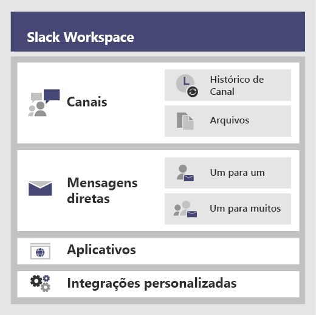
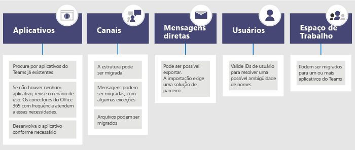

# <a name="migrate-from-slack-to-microsoft-teams"></a>Migrar do Slack para o Microsoft Teams

Este artigo guiará na jornada de migração para o Microsoft Teams a partir do Slack.

Ao planejar a mudança da sua organização para o Teams a partir do Slack, é importante decidir o que é necessário manter (caso haja algo). Para começar, descreveremos quais tipos de dados podem ser migrados, em seguida, orientaremos na avaliação das suas necessidades, no planejamento da mudança e como fazê-la.

O diagrama a seguir mostra a arquitetura do Slack em alto nível.



## <a name="plan-your-migration-from-slack"></a>Planeje sua migração do Slack
### <a name="what-you-can-and-cant-migrate"></a>O que pode e não pode migrar
Seu plano de serviço do Slack determinará o que você pode ou não migrar. Por exemplo, alguns planos de serviço do Slack só permitem exportar arquivos e histórico de canais públicos, outros exigem uma solicitação do DocuSign para incluir Canais Privados e Mensagens Diretas. 

Para determinar o nível de serviço do seu Slack Workspace, faça logon no Slack e observe o tipo de plano na página **Sobre este Workspace**.

Para saber mais sobre as opções de exportação do Slack, vá para o site do Slack: https://get.slack.help/hc/articles/204897248-Guide-to-Slack-import-and-export-tools 

O diagrama a seguir fornece uma visão de alto nível do panorama de migração do Slack que abordaremos neste artigo. 



Ao terminar esta seção, você será capaz de entender:
- O nível de serviço dos seus Slack Workspaces
- O que pode e não pode ser exportado
- Abordagens comuns à exportação

### <a name="assess-your-slack-workspaces"></a>Avaliar seus Slack workspaces
Antes de fazer o plano de migração da sua organização, você precisa reunir algumas informações sobre os seus Slack workspaces. Entender como os Slack workspaces estão sendo usados ajuda a determinar o escopo da migração. Por exemplo, quantos workspaces estão sendo movidos? Eles são usados por um departamento específico, por vários, ou por toda organização?

Se você for membro dos Slack Workspaces que deseja migrar, poderá analisar o uso por conta própria, indo para *\<your Slack workspace\>.slack.com/stats*. Examine as guias Canais e Membros para procurar por padrões de uso. Decida quais workspaces você deseja migrar (e quais você deseja deixar para trás). 

> [!NOTE]
> Se não tiver acesso à página de estatísticas, então você não é um administrador ou proprietário. 

### <a name="export-channels"></a>Exportar Canais

No Slack, os usuários ingressam em um canal que faz parte de um Slack Workspace, enquanto que no Teams, os usuários ingressam em uma equipe que é uma coleção de canais. Recomendamos que você use a análise do Slack para ver quanta atividade acontece em cada canal para ajudá-lo a decidir quais canais mover. Você usará a lista resultante para descobrir como agrupar seus canais do Slack em equipes no Teams, bem como quem deverá ser os membros de cada equipe.

Se você possui um plano de serviço pago do Slack (qualquer outro que não seja gratuito), poderá usar as análises do Slack (\<your Slack workspace\>.slack.com/admin/stats#channels) para ver a quantidade de atividades de um canal, quando foi usado pela última vez e quantas pessoas são membros. Isso poderá ajudá-lo a decidir se migrará o canal. Por padrão, o conteúdo de canais públicos (mensagens e arquivos) pode ser exportado. Dependendo do seu plano de serviço do Slack e caso tenha solicitado Canais Privados e Mensagens Diretas do Slack, eles poderão ser exportados.

Para saber mais sobre as opções de exportação do Slack, vá para o site do Slack: https://get.slack.help/hc/articles/204897248-Guide-to-Slack-import-and-export-tools 

> [!IMPORTANT]
> Verifique os requisitos de privacidade e conformidade da sua organização em relação aos dados do canal. Sua organização pode ter requisitos de conformidade em relação ao tratamento, armazenamento e processamento desses dados, além de estar em conformidade com o ciclo de vida do conteúdo de identificação do usuário final (EUII).

### <a name="export-direct-messages"></a>Exportar Mensagens Diretas
As Mensagens Diretas são iguais aos chats no Teams, que são de 1:1 ou 1 para várias conversas que não são de canal. A capacidade de exportação depende do plano de serviço do Slack e se você tiver solicitado a inclusão de Mensagens Diretas no seu Slack Export. O Teams não dá suporte a importação de Mensagens Diretas no momento. Consulte um parceiro da Microsoft para saber mais sobre as soluções de terceiros que você pode explorar e que trazem o conteúdo de Mensagens Diretas para o Teams.

Para exportar Mensagens Diretas, confira as ferramentas, como o Export, na Loja de Aplicativos do Slack.

### <a name="apps-and-custom-integrations"></a>Aplicativos e integrações personalizadas

Aplicativos no Slack são como aplicativos no Teams. Depois de ter uma lista de aplicativos e suas configurações no espaço de trabalho, você pode pesquisar na Loja de Aplicativos do Teams para ver se eles estão disponíveis para o Teams*. 

Vá para \<your Slack workspace\>.slack.com/apps/manage para obter uma lista de Aplicativos e Integrações Personalizadas. Essa página também mostra o número de configurações em que cada aplicativo está em uso. As Integrações Personalizadas variam em sua "capacidade de migração". Se for um Web Hook, você poderá enviá-lo a um Conector do Microsoft 365 ou Office 365 para mudar o fluxo de trabalho no Teams. Avalie bots e outros aplicativos caso a caso ao planejar movê-los para o Teams.

\*Se o seu administrador restringiu o uso de aplicativos, talvez você não tenha acesso a lista completa de aplicativos disponíveis.

### <a name="users"></a>Usuários
Os esquemas de identidade usados no Slack podem não ser mapeados diretamente para o Microsoft 365 ou Office 365. Por exemplo, os endereços de email dos usuários do Slack podem não ser mapeados para as contas corporativas ou de estudante do Microsoft 365 ou Office 365. Você deverá criar um mapa de ID do usuário antes de começar a planejar a distribuição do Teams.

Se você tiver um plano de serviço pago do Slack, vá para *\<your Slack workspace\>.slack.com/admin/stats#members* para obter detalhes dos membros, como endereço de email e tipo de conta para cada usuário (por exemplo, convidado único versus multicanal).

Este é um script que pode ser usado para comparar endereços de email de uma exportação do Slack com o Azure AD para ajudar a resolver ambiguidade de nome. Ele também reportará se o usuário está habilitado ao Teams. Se precisar de ajuda com o PowerShell, leia [Introdução ao Azure PowerShell](/powershell/azure/get-started-azureps).

```azurepowershell
Connect-AzureAD
Function Get-TimeStamp {
    return "[{0:MM/dd/yy} {0:HH:mm:ss}]" -f (Get-Date)
}

class User {
    [ValidateNotNullOrEmpty()] $ID
    [ValidateNotNullOrEmpty()] $FullName
    [string] $Email
    [string] $UPN
    [ValidateNotNullOrEmpty()][bool] $ExistsAzureAD
    [ValidateNotNullOrEmpty()][bool] $TeamsEnabled
}

$output = New-Object -type System.Collections.ObjectModel.Collection["User"]

$users = Get-Content -Raw -Path .\slackHistory\users.json | ConvertFrom-Json

Write-Host -ForegroundColor Green "$(Get-Timestamp) User Count: " $users.Count

$i=1
Write-Host "$(Get-Timestamp) Attempting direct email match.. `n"
foreach ($slackUser in $users) {
    $user = New-Object User
    $user.id = $slackUser.id
    $user.FullName = $slackUser.name
    try {
        if ($null -ne $slackUser.profile.email) {
            $user.email = $slackUser.profile.email
            $emailSplit = $slackUser.profile.email.Split('@')
            $mailNickName = $emailSplit[0]
            $result = Get-AzureADUser -Filter "MailNickName eq '$($mailNickName)' or UserPrincipalName eq '$($slackUser.profile.email)' or proxyAddresses/any(c:c eq 'smtp:$($slackUser.profile.email)')"
            if ($null -ne $result) {
                $user.ExistsAzureAD = $true
                $user.UPN = $result.UserPrincipalName
                $assignedPlans = $result.assignedPlans
                foreach ($plan in $assignedPlans) {
                    if ($plan.ServicePlanId -eq "57ff2da0-773e-42df-b2af-ffb7a2317929") {
                        if ($plan.CapabilityStatus -eq "Enabled") {
                            $user.TeamsEnabled = $true
                        }
                        else {
                            $user.TeamsEnabled = $false
                        }
                    }
                }
                Write-Host -ForegroundColor Green "$(Get-Timestamp) Current User $($i) - AzureAD object found:" $result.MailNickName
                Write-Host -ForegroundColor Green "$(Get-Timestamp) Current User $($i) - Teams Enabled:" $user.TeamsEnabled
            }
            else {
                $user.ExistsAzureAD = $false
                Write-Host -ForegroundColor Yellow "$(Get-Timestamp) Current User $($i) - AzureAD object not found: " $slackUser.profile.email
            }
        }
        $i++
    }   
    catch
    {
        $user.ExistsAzureAD = $false
        Write-Host -ForegroundColor Yellow "$(Get-Timestamp) Current User $($i) - AzureAD object not found: $($i)" $user.profile.email
        $i++
    }
    $output.Add($user)
}

$output | Export-Csv -Path .\SlackToAzureADIdentityMapping.csv -NoTypeInformation
Write-Host "`n $(Get-Timestamp) Generated SlackToAzureADIdentityMapping.csv. Exiting..."
```

Ao terminar esta seção, você deverá ter:
- Uma lista de Canais por Workspace com estatísticas de uso.
- Uma lista de Aplicativos do Slack com configurações por canal.
- Determinado o tipo de histórico de mensagens do Slack você deseja exportar (se houver).
- Uma lista de usuários cujas contas do Slack são mapeadas para contas corporativas ou de estudante da Microsoft e quais licenças do Teams eles têm.

## <a name="plan-your-teams-deployment"></a>Planejar sua implantação do Teams
Você exportou o que precisa do Slack (e deixou para trás tudo o que não precisa). Agora é hora de planejar como será feito a distribuição do Teams e de importar seus dados do Slack. Esta é uma ótima oportunidade para avaliar o que funcionou bem para a equipe com base no uso e incluir esses elementos no plano de implantação do Teams. No final desta seção, você terá um plano gráfico para usuários, canais e aplicativos do Teams. 

O diagrama a seguir fornece uma estrutura de tópicos de alto nível dos itens que você abordará na implantação do Teams.

:::image type="content" source="media/migrate-slack-to-teams-image3.png" alt-text="Estrutura de tópicos de alto nível sobre como planejar uma implantação do Teams a partir do Slack.":::

### <a name="team-and-channel-structure"></a>Estrutura de equipe e canal

Um Slack Workspace pode representar uma única equipe, várias equipes ou uma organização inteira. É importante entender o escopo dos Workspaces ao determinar a estrutura. A relação mais próxima a uma equipe do Teams no Slack é o Workspace, que contém uma coleção de canais. O diagrama a seguir demonstra três mapeamentos diferentes do Slack ao Teams, e orientações para escolher o caminho certo para cada Workspace.


|Mapeamento do Slack ao Teams | Descrição |
|---------|---------|
|1 Slack Workspace: seta_para_direita: 1 equipe   | Para Slack workspaces menores que precisam menos do que 200 canais<br>Incluir um buffer para o crescimento e planejamento do canal privado  |
|1 Slack Workspace: seta_para_direita: várias equipes     | Use os dados de análise do Slack Workspace para criar agrupamentos lógicos de canais, que se tornam a base das equipes        |
|2+ Slack Workspaces: seta_para_direita: várias equipes     | Use os dados de análise do Slack Workspace para criar agrupamentos lógicos de equipes e de canais, que se tornam a base das equipes        |

As soluções de terceiros têm estatísticas de uso para ajudá-lo a avaliar o quanto o canal está ativo e quantas postagens existem. Normalmente, os canais usados com frequência seriam incluídos no planejamento da equipe.

> [!TIP]
> Guarde apenas o que é necessário para determinar quais canais devem ser recriados no Teams. Para saber mais, leia [Visão geral de equipes e canais](teams-channels-overview.md). 

#### <a name="team-planning"></a>Planejamento de Equipe
Ao usar o inventário de Canais compilados na seção de Planejamento acima, trabalhe com os proprietários e administradores do Slack para descobrir quais canais devem se tornar equipes e quais devem se tornar canais em uma equipe. Use o Excel ou o Power BI para ajudar com essa análise - ambos podem fornecer percepções adicionais para ajudar a conduzir essas discussões sobre quais canais reter.

> [!TIP]
> Atualmente, o Teams tem um limite de 200 canais por equipe. Se sua lista de canais estiver se aproximando desse limite, você deverá descobrir uma maneira de dividi-los em duas equipes separadas.

### <a name="channel-history"></a>Histórico de Canal

Há soluções gratuitas no GitHub e soluções pagas que você pode usar, dependendo dos requisitos da sua organização para manter o Histórico de Canais de Canais Públicos e Privados. Além disso, isso pode ser gerado por script no Teams.

Depois de configurar a sua nova estrutura de equipe e de canal no Teams, você poderá copiar os arquivos exportados para as bibliotecas de documentos apropriadas nos canais do Teams.

Para automatizar a importação de seu conteúdo, há várias abordagens que você pode considerar. Há soluções gratuitas no GitHub ([ChannelSurf](https://github.com/tamhinsf/ChannelSurf) ou [Slack Export Viewer](https://github.com/hfaran/slack-export-viewer)) e soluções de parceiros. Escolha uma solução baseada nas necessidades da sua organização. 

### <a name="channel-files"></a>Arquivos de Canal

A maioria das soluções exportará arquivos. No entanto, eles normalmente são fornecidos como links no Histórico de Canais que exigem uma chave de API para recuperar programaticamente.

Para arquivos armazenados no Slack, uma vez configurado suas equipes e canais em Teams, será possível copiá-los de forma programática do Slack para o canal de destino do Teams.

O script a seguir recupera arquivos do Slack. Ele pesquisa a especificada exportação do Slack no seu computador, cria uma pasta em cada canal de destino e baixa todos os arquivos para esse local. Existem soluções de terceiros que podem extrair dados. Se precisar de ajuda com o PowerShell, leia [Introdução ao Azure PowerShell](/powershell/azure/get-started-azureps).


```azurepowershell
$ExportPath = ".\slackHistory"
$ExportContents = Get-ChildItem -path $ExportPath -Recurse
Function Get-TimeStamp {
    return "[{0:MM/dd/yy} {0:HH:mm:ss}]" -f (Get-Date)
}

class File {
    [string] $Name
    [string] $Title
    [string] $Channel
    [string] $DownloadURL
    [string] $MimeType
    [double] $Size
    [string] $ParentPath
    [string] $Time
}

$channelList = Get-Content -Raw -Path .\slackHistory\channels.json | ConvertFrom-Json
$Files = New-Object -TypeName System.Collections.ObjectModel.Collection["File"]

Write-Host -ForegroundColor Green "$(Get-TimeStamp) Starting Step 1 (processing channel export for files) of 2. Total Channel Count: $($channelList.Count)"
#Iterate through each Channel listed in the Archive
foreach ($channel in $channelList) {
    #Iterate through Channel folders from the Export
    foreach ($folder in $ExportContents)
    {
        #If Channel Name matches..
        if ($channel.name -eq $folder){
            $channelJsons = Get-ChildItem -Path $folder.FullName -File
            Write-Host -ForegroundColor White "$(Get-TimeStamp) Info: Starting to process $($channelJsons.Count) days of content for #$($channel.name)."
            #Start processing the daily JSON for files
            foreach ($json in $channelJsons){
                $currentJson = Get-Content -Raw -Path $json.FullName | ConvertFrom-Json
                #Write-Host -ForegroundColor Yellow "$(Get-TimeStamp) Info: Processing $($json.Name) in #$($channel.name).."
                #Iterate through every action
                foreach ($entry in $currentJson){
                    #If the action contained file(s)..
                    if($null -ne $entry.files){
                        #Iterate through each file and add it to the List of Files to download
                        foreach ($item in $entry.Files) {
                        $file = New-Object -TypeName File
                            if ($null -ne $item.url_private_download){
                                $file.Name = $item.name
                                $file.Title = $item.Title
                                $file.Channel = $channel.name
                                $file.DownloadURL = $item.url_private_download
                                $file.MimeType = $item.mimetype
                                $file.Size = $item.size
                                $file.ParentPath = $folder.FullName
                                $file.Time = $item.created
                                $files.Add($file)
                            }
                        }
                    }
                }
            }
        }
    }
}
Write-Host -ForegroundColor Green "$(Get-TimeStamp) Step 1 of 2 complete. `n"

Write-Host -ForegroundColor Green "$(Get-TimeStamp) Starting step 2 (creating folders and downloading files) of 2."
#Determine which Files folders need to be created
$FoldersToMake = New-Object System.Collections.ObjectModel.Collection["string"]
foreach ($file in $files){
    if ($FoldersToMake -notcontains $file.Channel){
        $FoldersToMake.Add($file.Channel)
    }
}

#Create Folders
foreach ($folder in $FoldersToMake){
    #$fullFolderPath = $file.ParentPath + "\Files"
    $fullFolderPath = $ExportPath +"\$($folder)"
    $fullFilesPath = $ExportPath +"\$($folder)\Files"
    if (-not (Test-Path $fullFilesPath)){
        New-Item -Path $fullFolderPath  -Name "Files" -ItemType "directory"
    }
}

#Downloading Files
foreach ($file in $files)
{
    Write-Host -ForegroundColor Yellow "$(Get-TimeStamp) Downloading $($file.Name)."
    $fullFilePath = $file.ParentPath + "\Files\" + $file.Name
        if (-not (Test-Path $fullFilePath)){
            try{
                $request = (New-Object System.Net.WebClient).DownloadFile($file.DownloadURL, $fullFilePath)
            }
            catch [System.Net.WebException]{
                Write-Host -ForegroundColor Red "$(Get-TimeStamp) Error: Unable to download $($file.Name) to $($fullFilePath)"
            }   
        }
        else {
            try{
                $extensionPosition = $file.name.LastIndexOf('.')
                $splitFileName = $file.name.Substring(0,$extensionPosition)
                $splitFileExtention = $file.name.Substring($extensionPosition)
                $newFileName = $splitFileName + $file.Time + $splitFileExtention
                $fullFilePath = $file.ParentPath + "\Files\" + $newFileName
                $request = (New-Object System.Net.WebClient).DownloadFile($file.DownloadURL, $fullFilePath)
            }
            catch [System.Net.WebException]{
                Write-Host -ForegroundColor Red "$(Get-TimeStamp) Error: Unable to download $($file.Name) to $($fullFilePath)"
            }   
        }
}
Write-Host -ForegroundColor Green "$(Get-TimeStamp) Step 2 of 2 complete. `n"
Write-Host -ForegroundColor Green "$(Get-TimeStamp) Exiting.."
```


### <a name="apps-and-custom-integrations"></a>Aplicativos e Integrações Personalizadas
Examine sua lista de aplicativos do Slack e integrações personalizadas (com configurações) e decida quais você deseja mover para o Teams. Confira o Teams Marketplace para ver se um aplicativo está disponível. Caso contrário, existem alternativas possíveis. 

Para descobrir quais aplicativos adicionar ao Teams, é importante entender como o aplicativo está sendo usado. Ao fazer a pergunta "que funcionalidade o aplicativo fornece para este canal?", você aprenderá sobre o resultado que o aplicativo está fornecendo. 

Em muitos casos, os aplicativos recebem basicamente dados direcionados a eventos de um serviço externo (por exemplo, sistema de monitoramento) e enviam uma mensagem para o Slack. Você pode obter o mesmo resultado usando um Conector do Microsoft 365, que pode enviar mensagens no Teams com base em eventos.

A seguir estão exemplos de soluções do Slack em que um Conector do Microsoft 365 foi usado no Teams para integração.
- Ansível
  - Os alertas podem ser enviados ao Teams por meio de [Webhook ansível](https://docs.ansible.com/ansible-tower/latest/html/userguide/notifications.html#webhook)
- New Relic
  - Confira a solução de usuário para [Enviar alertas New Relic ao Teams](https://discuss.newrelic.com/t/new-relic-alerts-not-working-with-microsoft-teams/48609/3)
- Nagios 
  - Hoje, os alertas podem ser integrados via conectores.https://github.com/isaac-galvan/nagios-teams-notify
- ZenDesk
  - O aplicativo existe no Teams Store
- Jenkins
  - Os alertas podem ser enviados ao Teams usando o [Conector do Office 365 do Jenkins](https://plugins.jenkins.io/Office-365-Connector)


### <a name="user-readiness-and-adoption-plan"></a>Plano de adoção e preparação do usuário 
A base de qualquer implantação bem-sucedida de software depende de como os usuários estão preparados para a mudança. Os usuários da organização que usam o Slack entenderão facilmente os conceitos do Teams, mas ainda assim, será necessário um treinamento para ajudá-los a fazer uma transição tranquila. Para obter um conjunto abrangente de recursos de adoção de equipes, vá para [Hub de adoção do Teams](adopt-microsoft-teams-landing-page.md).

Por exemplo, os dois produtos apresentam canais, mas são usados de forma diferente em cada produto. Por exemplo, geralmente um Canal no Slack é usado como um chat no Teams para conversas transacionais de curto prazo. Outras diferenças notáveis são as conversas encadeadas/não encadeadas e as configurações de notificação de ajuste.

Confira nossa rica biblioteca de [Treinamento para usuários finais do Teams](https://support.office.com/article/microsoft-teams-video-training-4f108e54-240b-4351-8084-b1089f0d21d7). 

## <a name="move-to-teams"></a>Mover para o Teams 
Agora que o seu plano de transição está definido, comece a criar suas equipes e canais no Teams. 

Depois de criar as equipes e canais, comece a copiar arquivos dos canais do Slack para o Teams e a configurar seus aplicativos. Se você estiver usando uma solução para manter o histórico, ele ainda pode ser configurado também. Em seguida, você estará pronto para começar a licenciar usuários (caso eles ainda não estejam licenciados) e adicioná-los às equipes apropriadas. Para reduzir a necessidade de exportações adicionais e cópias de arquivos, considere remover o acesso ao Slack em uma data acordada que coincida com a adição de cada usuário à equipe. Isso evita que você precise novamente exportar e importar alterações delta de arquivos e histórico.

Siga as etapas no diagrama a seguir para distribuir o Teams em sua organização. Para saber mais, confira [Como distribuir o Teams](./deploy-overview.md).


:::image type="content" source="media/migrate-slack-to-teams-image4.png" alt-text="Diagrama que lista as etapas de mudança para o Teams a partir do Slack.":::