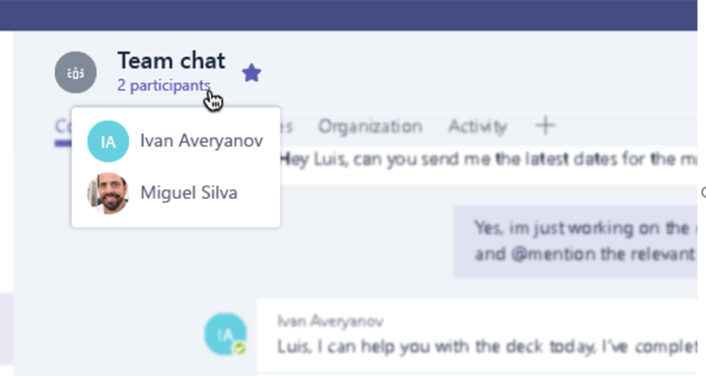
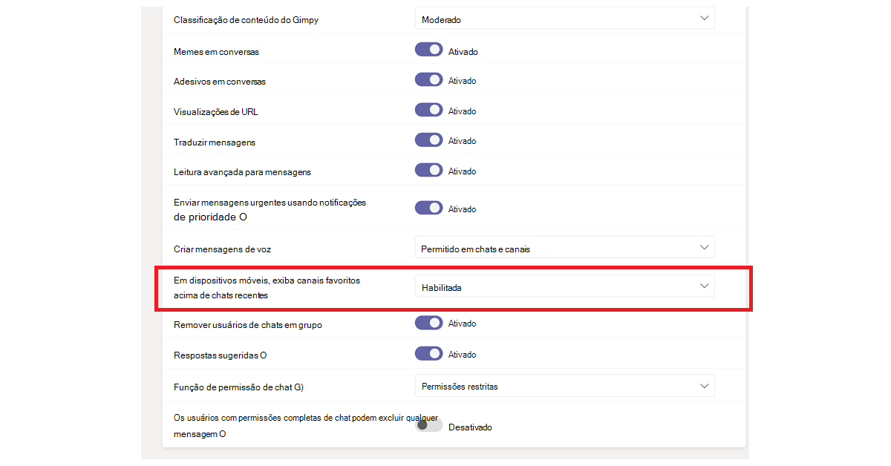
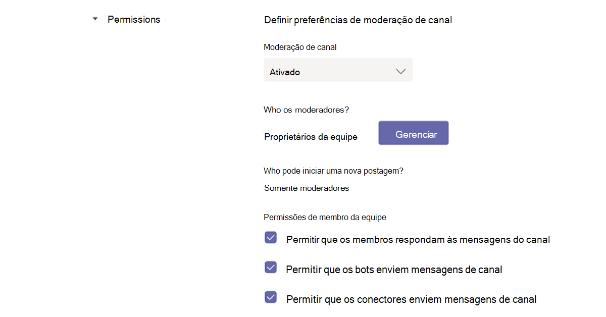
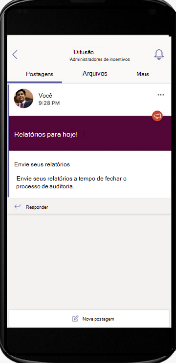
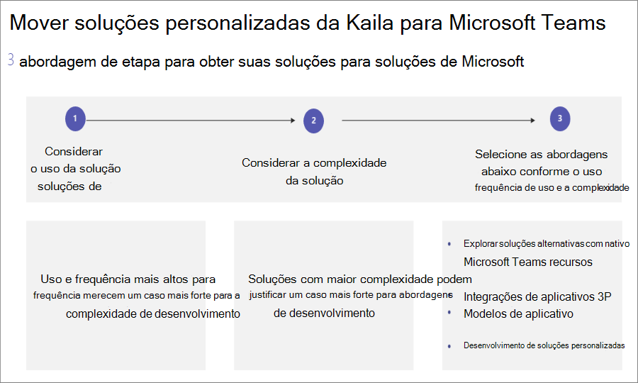
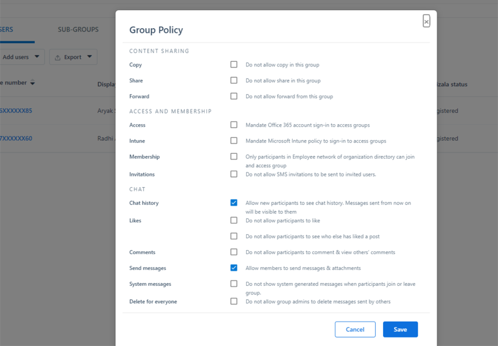
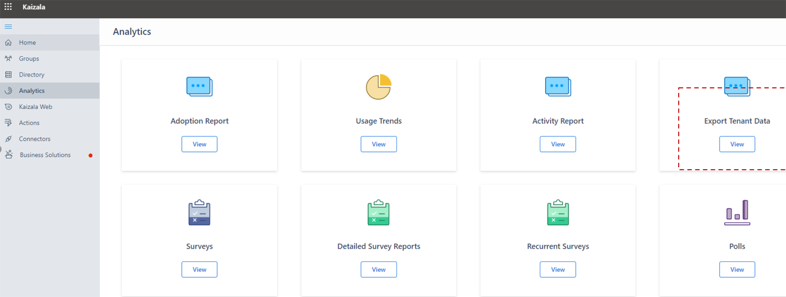

# Navegue Microsoft Teams

Agora que você tem uma compreensão clara dos caminhos e necessidades exclusivos da sua organização, é hora de começar sua jornada para uma colaboração poderosa com Microsoft Teams. Use a seção a seguir para saber como navegar pelos recursos de Kaziala elogiados Teams.

| Do Kaizala | Para Teams |
|---------|-----------------------|
| Iniciando – entrar e configurar perfil| [Introdução ao Teams](#getting-started) |
| Iniciando novos chats, chamadas de áudio e vídeo 1:1 | [Chats em Teams, áudio e chamadas de vídeo](#starting-new-chats-11-audio-and-video-calls) |
| Seus Kaizala grupos| [Mover seus grupos Kaizala para Teams](#moving-your-kaizala-groups-to-microsoft-teams) |
| Simular a experiência de mensagens de aplicativos de consumidor| [Simular a experiência de mensagens de aplicativos de consumidor](#mimic-the-consumer-app-messaging-experience) |
| Cartões de ação fora da caixa |  [Fazer o trabalho em Teams](#getting-work-done-in-teams) |
| Pesquisas, pesquisas, listas de verificação| [Executando pesquisas, pesquisas, listas de verificação em Teams](#polls-surveys-and-checklists-in-teams) |
| Reuniões - Cartão de Ação| [Vamos nos reunir – reuniões no Teams](#getting-work-done-in-teams) |
| Comunicados - Cartão de Ação| [Comunicados em Teams](#announcements-in-teams) |
| Cartão de ação de check-ins de fotos| [Check-ins de fotos no Teams](#photo-check-ins)
| Quiz - Action Card| [Quiz in Teams](#quiz-in-teams)
| Treinamento - Cartão de Ação| [Treinamento em Teams](#training-in-teams) |
| Seus cartões de ações personalizados | [Soluções personalizadas no Teams](#moving-kaizala-custom-solutions-to-microsoft-teams) |
| Kaizala Portal de Gerenciamento| [Para profissionais de IT](#it-professionals) |
| | [Para usuários finais](#end-user-guidance) |
| Kaizala de grupo| [Kaizala de grupo](#kaizala-group-dissolution) |
| Kaizala de dados de locatário| [Exportar Kaizala dados de locatários](#export-kaizala-tenant-data)  |
| Colaborar com usuários externos (fornecedores/fornecedores/parceiros)| [Usar Teams para trabalho e Teams para interoperabilidade de uso pessoal](#collaborating-with-external-usersvendorssupplierspartners) |

## Introdução

Começar a mover do Kaizala para o Teams está mais fácil do que nunca com nosso guia de início. Para saber mais sobre como iniciar sua Microsoft Teams, consulte [Como começar a Teams](https://support.microsoft.com/office/start-and-pin-chats-a864b052-5e4b-4ccf-b046-2e26f40e21b5?wt.mc_id=otc_microsoft_teams&ui=en-us&rs=en-us&ad=us).

## Iniciando novos chats, chamadas de áudio e vídeo 1:1

Crie chats de grupo ou 1:1 para colaborar com um grupo menor ou para conversar em particular Teams. Você pode fixar chats e salvar mensagens para acesso rápido. Para começar a conversar com nossa formatação rich text, emojis e gifs, consulte [Chats em Teams](https://support.microsoft.com/office/start-and-pin-chats-a864b052-5e4b-4ccf-b046-2e26f40e21b5?wt.mc_id=otc_microsoft_teams&ui=en-us&rs=en-us&ad=us).

Comunique-se com eficiência iniciando 1:1 ou chamadas de grupo com qualquer pessoa em sua organização. Com Teams, você tem a flexibilidade de fazer chamadas de áudio e vídeo.  Para começar, consulte [Fazer chamadas](https://www.microsoft.com/videoplayer/embed/RE4rxv0?pid=ocpVideo0-innerdiv-oneplayer&postJsllMsg=true&maskLevel=20&market=en-us).

Você pode mover de Kaizala grupos para Microsoft Teams através da criação de Teams, canais e chats de grupo em Teams.

Teams é uma coleção de pessoas, conteúdo e ferramentas envolvendo diferentes projetos e resultados dentro de uma organização.

Teams é feita de **canais**, que são as conversas específicas do tópico que você tem com seus colegas de equipe. Cada canal é dedicado a um tópico, departamento ou projeto específico. Os canais são mais valiosos quando estendidos com aplicativos. Para saber mais, confira [trabalhar em canais](https://support.microsoft.com/office/teams-and-channels-df38ae23-8f85-46d3-b071-cb11b9de5499?ui=en-us&rs=en-us&ad=us#ID0EAABAAA=Work_in_channels).

**Os chats em** grupo permitem reunir seus colegas de trabalho rapidamente sobre mensagens instantâneas.

### Conversas no Teams Chat vs Canal de Equipe

|Conversas no Chat | Conversas em Canais de Equipe |
|---------|---------|
|Para conversas leves, onde você está diretamente mensagens destinatários.   | Para interações em que vários tópicos são discutidos em um espaço aberto.  |
|Chats privados só ficam visíveis para aqueles no chat     | Visível para todos na equipe        |
|Uma conversa contínua e não lida     | Conversas estruturadas e com vários threads        |
|Até 250 pessoas     | Até 25.000 pessoas        |
|Escolha se deseja compartilhar o histórico de chat com novos participantes de chat     | Histórico é compartilhado com todos os novos membros da equipe        |
|Novos destinatários de chat devem ser adicionados por essas pessoas que já estão no chat     | Os usuários podem ingressar em uma equipe pesquisando por ela. Em um Teams privado, Teams administrador aprova novos membros. Os membros do canal podem gerar código para permitir que novos membros participem diretamente sem a aprovação do administrador.        |
|No compartilhamento de tela local, e chamada de áudio e vídeo. Agendamento fácil de reuniões Teams com todos os participantes do chat     | Chamada de áudio e vídeo no local e agendadas        |
|Alguns extensibilidade com aplicativos     | Extensibilidade completa e personalização com aplicativos        |

Para uma visão geral sobre Teams, canais e chats de grupo, consulte [teams and channels in Microsoft Teams](teams-channels-overview.md).

## Mover seus grupos Kaizala para Microsoft Teams

Em Kaizala, grupos são uma coleção de pessoas. Há três tipos de estruturas de grupo Kaizala grupos simples, grupos de hierarquia e grupos de transmissão. À medida que você faz Microsoft Teams, você pode usar Teams, canais e chats de grupo para criar estruturas de comunicação semelhantes para sua organização.

Use as diretrizes a seguir para obter instruções sobre como alternar de Grupos para Teams, canais e chats de grupo.

Há duas maneiras de mover suas Kaizala simples para Teams:

- Opção 1: Alternar de um grupo Kaizala plano para um chat de grupo em Teams

- Opção 2: alternar de um grupo Kaizala plano para uma Teams equipe

**Opção 1: alternar de um grupo Kaizala plano para um chat de grupo em Teams**

Você pode criar um Teams de grupo para manter conversas rápidas e transitórias com até 250 participantes. Os chats em grupo permitem que as pessoas em sua organização tenham um local central para a conversa aberta onde qualquer pessoa pode ser adicionada ao chat.

1. Inicie e nomee um chat de grupo.

    

    Todos os que têm acesso ao chat de grupo podem [enviar mensagens](https://support.microsoft.com/office/send-and-read-messages-in-teams-b29e60ec-76af-4d97-8c3c-a4e36f2b64aa?ui=en-us&rs=en-us&ad=us).

2. Adicione pessoas à conversa.

    
    
   Ao adicionar alguém a um chat de grupo (não um um-a-um), você pode incluir o histórico de  **chat** e a duração do histórico que deseja compartilhar com eles.

3. Gerenciar chat em grupo.
  
    
    
   Para ver quem está em um chat em grupo, passe o mouse sobre o número de participantes no header de chat para mostrar uma lista de nomes de todos.

**Opção 2: alternar de um grupo Kaizala plano para uma Teams equipe**
   
Para comunicação de grupo grande direcionada, você pode criar uma Equipe para um grupo simples. Você pode adicionar até 25.000 membros para se envolver em comunicação estruturada com conversas encadeadas. Esse tipo de comunicação permite funções de moderação e administração para garantir que as coisas estão funcionando sem problemas.

1. Criar uma equipe: para se levantar e executar no Teams, você deve criar uma equipe, adicionar pessoas e adicionar canais. Para saber mais, confira [suas primeiras equipes](get-started-with-teams-create-your-first-teams-and-channels.md).
2. Revise o guia para proprietários de equipe:

Como proprietário [de equipe](https://support.microsoft.com/office/go-to-guide-for-team-owners-92d238e6-0ae2-447e-af90-40b1052c4547?ui=en-us&rs=en-us&ad=us), você pode adicionar novos membros e convidados, alterar membros em proprietários, gerenciar canais e configurações e arquivar uma equipe que não está mais em uso.

3. Adicione membros em massa a uma equipe:

    Se você for um proprietário de equipe, vá para o nome da equipe na lista de equipes e  selecione o botão Mais opções > adicionar **membro**.

    

    Você pode começar a digitar uma lista de distribuição, um grupo de segurança ou Microsoft 365 para adicionar à sua equipe. Para saber mais, confira [Adicionar membros a uma equipe em Teams](https://support.microsoft.com/office/add-members-to-a-team-in-teams-aff2249d-b456-4bc3-81e7-52327b6b38e9?ui=en-us&rs=en-us&ad=us).

### Imitar a experiência de mensagens de aplicativo de consumidor

Se preferir uma experiência simplificada para seus usuários, você pode optar por configurar a experiência de Teams da sua organização para imitar as ferramentas de consumidor que seus usuários já estão usando.

Recomendamos iniciar a Teams para seus usuários Kaizala com Mostrar canais favoritos no **Chat** habilitados para comunicações simplificadas e turnos (opcional).

Veja um exemplo da interface da equipe com **turnos**:

Veja um exemplo da interface da equipe **sem Turnos**:

 

> [!NOTE]
> Você pode remover o acesso ao botão Teams para criar uma interface simplificada para os funcionários da Linha de Frente com apenas canais realçados aparecendo acima dos chats. Para saber mais, confira [Gerenciar políticas de mensagens em Teams](messaging-policies-in-teams.md).

### Use Teams canais e canais para criar uma estrutura de grupo hierárquica

Em Kaizala, grupos hierárquicos permitem que sua organização interaja em diferentes estruturas de grupo, dependendo do tipo de comunicação entre membros.  Em Teams, você pode criar canais e Teams para corresponder ao gráfico da organização e configurar a comunicação baseada em hierarquia. Você pode usar uma estrutura hierárquica dentro Teams para alertar os membros das ações necessárias, notícias importantes e atualizações.

Para saber mais, confira nossas [práticas recomendadas para organizar equipes em Microsoft Teams](best-practices-organizing.md).

### Use Teams canais e canais para transmitir notícias importantes

Em um Kaizala de transmissão, os administradores podem enviar mensagens e ações para um grupo direcionado. Da mesma forma, você pode postar em vários canais para transmitir uma mensagem em Teams. Para direcionar a atenção para uma mensagem importante, crie postagens de comunicados.

A moderação de canal permite controlar quem pode postar e responder mensagens. Os canais podem ser escolhidos entre as equipes para que a emissora alcance uma audiência maior. Você pode restringir interações em comunicados permitindo apenas administradores e moderadores selecionados com a capacidade de responder. Siga estas etapas para estabelecer a moderação do canal em um Teams canal.

**Etapa 1**: Moderação do Canal de Instalação.

- Selecione um canal para transmissões

- Selecione **Configurações de canal** para configurar a moderação

- Navegue até "Who os moderadores?" para selecionar manualmente moderadores para seu canal

**Etapa 2**: Formatar sua mensagem.
Crie um comunicado para notificar os membros da equipe de notícias ou ações importantes.

   

- No canal, selecione Formatar na caixa onde você digita sua mensagem.

- Na parte superior da caixa exibida, selecione a seta ao lado de Nova conversa > Comunicado.

- Digite um título, altere sua cor de plano de fundo ou adicione uma imagem de plano de fundo para a área de título.

- Digite o assunto do seu comunicado na área Adicionar uma subcapa e, em seguida, o corpo da mensagem e selecione Enviar botão Enviar.
    

**Etapa 3**: Selecionar canais para transmissão de mensagem.

Você pode postar entre vários Teams e canais quando tiver comunicados e informações importantes que precisam alcançar grandes grupos de pessoas.

  

Para saber mais, confira [Cross-post a channel conversation in Teams](https://support.microsoft.com/office/cross-post-a-channel-conversation-in-teams-9c1252a3-67ef-498e-a7c1-dd7147b3d295?ui=en-us&rs=en-us&ad=us).

## Fazer o trabalho em Teams

Quando se trata de trabalhar, as ferramentas certas podem habilitar a eficiência. Em Kaizala, você pode usar cartões de ação [OOB (Out-of-box)](/kaizala/partnerdocs/kaizalaactioncards) para tornar o gerenciamento de trabalho diário mais fácil e eficiente.
Microsoft Teams oferece vários recursos e solução para cartões de ação sem caixa no Kaizala.

A Teams permite que você use as ferramentas de organização existentes por meio da integração com o Microsoft Teams, juntamente com aplicativos Microsoft 365 aplicativos de terceiros. Há mais de 300 aplicativos externos disponíveis agora Microsoft Teams.

### Pesquisas, pesquisas e listas de verificação em Teams

[Pesquisas](https://github.com/OfficeDev/microsoft-teams-apps-poll/wiki), [pesquisas e](https://github.com/OfficeDev/microsoft-teams-apps-survey) [cartões de](https://github.com/OfficeDev/microsoft-teams-app-checklist) ação de lista de verificação agora estão disponíveis como modelos de aplicativos de  extensão de mensagem prontos para Teams de mensagem no GitHub.

**A** sondagem permite que os usuários criem e enviem votações rapidamente em um chat ou canal para saber a opinião de sua equipe. O aplicativo de sondagem tem suporte em todas as plataformas – Teams clientes desktop, navegador, iOS e Android. Ele está pronto para implantação como parte de sua assinatura Microsoft 365 existente

**A** pesquisa permite que os usuários criem uma pesquisa em um chat ou canal para fazer uma série de perguntas e obter informações ativas. Use Survey for – Registrations, Enrollments, Feedback, Testimonials, Lead Capture, Reporting, Complaints, and Evaluations. O aplicativo de pesquisa é suportado em todas as plataformas – Teams clientes desktop, navegador, iOS e Android. Ele está pronto para implantação como parte de sua assinatura Microsoft 365 existente.

**A lista de** verificação permite que você colabore com sua equipe criando uma lista de verificação compartilhada em um chat ou canal. O aplicativo checklist tem suporte em todas as plataformas – Teams desktop, navegador, iOS e clientes Android. Ele está pronto para implantação como parte de sua assinatura Microsoft 365 existente.

Você também pode enviar pesquisas rápidas, pesquisas e listas de verificação para sua equipe instantaneamente com aplicativos Microsoft 365 e de terceiros existentes.

[O Microsoft Forms](https://techcommunity.microsoft.com/t5/microsoft-forms-blog/microsoft-forms-works-great-with-microsoft-teams/ba-p/109915) permite coletar informações e tomar decisões rapidamente. Com o Forms integrado ao Teams, você pode facilmente configurar uma guia Formulários, criar notificações para seu formulário e realizar uma sondagem rápida. Para saber como, confira [Criar, editar e revisar formulários Microsoft Teams](https://support.microsoft.com/office/work-with-colleagues-to-create-edit-and-review-forms-in-microsoft-teams-333b97a3-41d9-48bc-a1cb-84a96bd44e14#:~:text=1%20In%20Teams%2C%20go%20to%20the%20channel%20you,name%20for%20your%20new%20form.%20More%20items...%20).

Aplicativos de terceiros, como a Polly e SurveyMonkey, permitem que você conduza mais pesquisas e pesquisas com seu Teams.

- **A Polly**  permite que você obtenha informações da sondagem em tempo real para tomar decisões comerciais melhores e medir o envolvimento da equipe em pesquisas por meio de exibições abrangentes do painel.

- **SurveyMonkey** traz pesquisas para onde você já está fazendo negócios no Microsoft Teams, facilitando a adoção de pesquisas ao fluxo de trabalho diário. Escreva e envie uma sondagem rápida de uma pergunta de dentro Microsoft Teams e, em seguida, assista à medida que os resultados chegam de seus colegas de equipe.

### Trabalhos em Teams

Use **[o Microsoft Planner](https://support.microsoft.com/office/organize-your-team-s-tasks-in-microsoft-planner-c931a8a8-0cbb-4410-b66e-ae13233135fb?ui=en-us&rs=en-us&ad=us)** para executar trabalhos em Teams. Você pode colaborar em um projeto com uma equipe, ver relatórios de progresso e acompanhar atribuições individuais.

Ao usar Microsoft Teams, você pode organizar suas tarefas adicionando uma ou mais guias do Planner a um canal de equipe. Em seguida, você pode trabalhar em seu plano de dentro do Teams ou no Planner para Web, remover ou excluir seu plano e ser notificado no Teams quando uma tarefa é atribuída a você no Planner.

### Comunicados em Teams

Crie e envie mensagens destinadas a várias equipes ou grande número de funcionários por chat com o [aplicativo de comunicador da](/microsoftteams/platform/samples/app-templates#company-communicator) empresa. Sua interface fácil permite que usuários designados criem, visualizem, colaborem e enviem mensagens de forma direcionada. Crie recursos de comunicação personalizados direcionados, como dados pessoais personalizados, sobre quantos usuários reconheceram ou interagiram com uma mensagem com ideias diretamente vinculadas a decisões de gerenciamento.

### Check-ins de fotos

Use o Teams Smart Camera para capturar e compartilhar uma imagem anotada com sua Equipe. Compartilhe facilmente sua localização com precisão para manter sua equipe no know. Precisa ter mais informações para comunicar como os recursos de Kaizala são mapeado para Teams. Definitivamente, temos o máximo de informações do deck de slides que podemos para o doc.

Use o modelo de aplicativo de [check-ins](/microsoftteams/platform/samples/app-templates#staff-check-ins) da Equipe para permitir que a Equipe de linha de frente forneça facilmente informações críticas e atualizações de status em uma base agendada ou ad hoc diretamente do Teams. O aplicativo dá suporte a locais, fotos, anotações, notificações de lembrete e fluxos de trabalho automatizados em tempo real.

### Quiz in Teams

Quiz é uma extensão [Teams de](/microsoftteams/platform/messaging-extensions/what-are-messaging-extensions) mensagens personalizada que permite que você crie um teste em um chat ou um canal para verificação de conhecimento e resultados instantâneos. Você pode usar Quiz para, exames em classe e offline, Verificação de conhecimento dentro da equipe e testes divertidos em uma equipe. O aplicativo quiz tem suporte em várias plataformas, como clientes Teams desktop, navegador, iOS e Android. Este aplicativo está pronto para implantação como parte de sua assinatura Microsoft 365 existente.

[Obter no GitHub](https://github.com/OfficeDev/microsoft-teams-apps-quiz)

  

### Treinamento em Teams

[Use o modelo de aplicativo checkins](/microsoftteams/platform/samples/app-templates#staff-check-ins) staff para permitir que a Equipe de linha de frente forneça facilmente informações críticas de tempo e atualizações de status em uma base agendada ou ad hoc diretamente do Teams. O aplicativo dá suporte a locais, fotos, anotações, notificações de lembrete e fluxos de trabalho automatizados em tempo real.

Use Teams para facilitar o treinamento para sua organização. O treinamento é [um aplicativo de](/microsoftteams/platform/what-are-messaging-extensions) extensão Teams mensagens personalizado que permite que os usuários publiquem um treinamento em um chat ou em um canal para compartilhamento de conhecimento offline e upskilling. O aplicativo tem suporte em vários clientes Teams plataforma, como desktop, navegador, iOS e Android. Este aplicativo está pronto para implantação como parte da sua assinatura Microsoft 365 de usuário.

[Obter no GitHub](https://github.com/OfficeDev/microsoft-teams-apps-training)

Você pode simplificar a integração oferecendo acesso a informações contextuais.  Tornar guias de funcionários, treinamento e mais facilmente disponíveis e atualizados para capacitar sua organização por meio da qualificação. Para saber mais sobre cenários de treinamento, consulte [Onboard new employees](https://support.microsoft.com/office/effectively-onboard-new-employees-691faccd-1d1a-4f47-99ac-b6c82973f5ee).

## Mover Kaizala soluções personalizadas para Microsoft Teams

Siga esta abordagem de três etapas para obter suas soluções para Microsoft Teams:

1. Considere o uso e a frequência da solução.

    Alto uso e frequência para soluções merece um caso mais forte para o desenvolvimento personalizado.

2. Considere a complexidade da solução.

    Soluções com maior complexidade podem justificar um caso mais forte para o desenvolvimento personalizado.

3. Explore as seguintes abordagens por frequência e complexidade de uso.

    - Explorar soluções alternativas com [recursos Microsoft Teams nativos](/microsoftteams/platform/concepts/capabilities-overview)

    - Usar [integrações de aplicativos 3P](deploy-apps-microsoft-teams-landing-page.md)

    - Descobrir [modelos de aplicativo](/microsoftteams/platform/samples/app-templates)

    - Criar [desenvolvimento de soluções personalizadas](/microsoftteams/platform/overview)

## Gerenciamento em Microsoft Teams

### Profissionais de TI

Faça a transição administrativa do portal Kaizala Gerenciamento para o Microsoft Teams Admin Center. O Teams de administração é principalmente para uso apenas de funções de administrador.

Os administradores podem gerenciar toda a carga de trabalho Teams, ou eles podem ter permissões delegadas para solucionar problemas de qualidade de chamada ou gerenciar as necessidades de telefonia da sua organização.

Para navegar no centro de administração, visite [Microsoft Teams Centro de Administração](https://admin.teams.microsoft.com/).

Você pode monitorar a segurança e a conformidade da sua organização Microsoft 365 com o Centro de Conformidade Microsoft 365 [e](/microsoft-365/compliance/microsoft-365-compliance-center) a [Central de Segurança.](/microsoft-365/security/defender/overview-security-center)

Proteja sua empresa e capacite seus usuários no  centro de administração Azure Active Directory onde você pode revisar grupos, identidade, licenças e acesso ao Microsoft 365.

## Portal de Gerenciamento do Kaizala para Teams Admin Center

### Diretrizes do usuário final

Use a tabela a seguir para navegar pelos recursos correspondentes em Microsoft Teams do portal Kaizala Gerenciamento.

| Portal de Gerenciamento do Kaizala | Microsoft Teams App|
|---------|-----------------------|
| Criar Grupos (Conectado à Organização) | **Criar equipes** por meio do aplicativo desktop ou móvel |
| Adicionando usuários em massa | Para adicionar usuários em massa à equipe – considere a criação de uma equipe por meio de grupos O365, DLs O365 ou grupo de segurança |
| Diretório | Pesquise qualquer pessoa em sua organização por meio da **Barra de Pesquisa** em equipes. Os resultados da Pesquisa também retornarão arquivos, mensagens e postagens |
| Analytics (Action Cards) | **Pesquisas**, **Pesquisas eCheckliststêm** relatórios **integrados com dados baixáveis. Os trabalhos também podem ser atribuídos com a ajuda do** planejadorTasksin **. Outros aplicativos de terceiros,** **comoTrello,Wrike**** também podem ser usados com facilidade Microsoft Teams |
| Extensões – Conectores | Use a **opção Conectores** no menu (...) para qualquer canal para o qual o conector é necessário. |
| Relatório de Adoção de Análise (Uso), Relatório de Uso, Relatório de Atividades | Os proprietários de equipe podem acessar relatórios para suas equipes navegando no menu (...) para **gerenciar equipes** >  de **análise.** |

> [!NOTE]
> Teams os usuários finais podem usar Teams desktop ou móvel para gerenciar suas equipes e canais individuais e não precisarão acessar o centro de administração Teams.

## Kaizala de grupo

À medida que você faz a transição para Teams canais e chats, você pode considerar Kaizala de grupo para garantir que sua organização tenha um local central para comunicação. Excluir um Kaizala grupo remove o grupo da lista Chats. Se você for o único administrador do grupo, precisará atribuir a função de administrador a pelo menos uma pessoa no grupo antes de excluir.

### Para mover um grupo Kaizala para Teams

 1. Compartilhar o Teams de Kaizala do grupo

 2. Configurar Teams sites

 3. Adicionar usuários a Teams

 4. Anunciar a alternção para todos os membros Kaizala grupo

 5. Nas configurações, [alternar Kaizala grupo](#to-switch-to-kaizala-group-to-read-only) para **Somente Leitura**

 6. Compartilhe os motivos pelos quais o Teams é uma opção melhor com Kaizala membros do grupo

 7. Compartilhar as diretrizes, por exemplo, de quando Teams estará disponível e como usar Teams

 8. Iniciar concursos de envolvimento

 9. Participação da Liderança de Instalação

 10. Buscar comentários dos membros

 11. Siga o calendário de conteúdo

 12. [Excluir Kaizala grupo](#to-delete-a-group)

### Para alternar para Kaizala para **Somente Leitura**

1. Entre no portal Kaizala gerenciamento.

2. Selecione **a** guia Grupos no painel de navegação esquerdo, selecione o grupo que você deseja definir como **Somente Leitura**.

    

3. Na lista lista listada, selecione **Editar Políticas**.
  
    

4. Na **janela Política de** Grupo, desmarque as seguintes opções:

     - Permitir que novos participantes vejam o histórico do chat. As mensagens enviadas a partir de agora estarão visíveis para elas.

     - Permitir que os membros enviem mensagens e anexos.

       

     > [!NOTE]
     > Os administradores ainda podem postar no grupo.

### Para excluir um grupo

1. Na lista Chats, pressione e segure a conversa de grupo.

2. Toque em Excluir grupo.

## Exportar Kaizala dados de locatários

Como administrador Kaizala de locatários/administrador global, você pode exportar Kaizala dados de locatários do portal Kaizala de gerenciamento. Ao usar Teams, você ainda pode manter o controle de seus dados corporativos Kaizala. Para obter mais informações, consulte [Exportar dados de locatários do portal de gerenciamento](/office365/kaizala/export-or-delete-your-data).

### Para exportar dados

 1. Selecione **Guia Análise** no painel de navegação esquerdo, escolha **Exportar Dados do Locatário**.
  
    

 2. Selecione **Exportar**.

    

 3. Use o arquivo Mensagens de Locatário – com filtros em Nome do grupo/data/hora para acessar dados de chat de nível de grupo.

    

## Excluir um Kaizala Grupo

Excluir um Kaizala grupo remove o grupo da lista Chats. Se você for o único administrador do grupo, precisará atribuir a função de administrador a pelo menos uma pessoa no grupo antes de excluir.

Para excluir um grupo:

- Na lista Chats, pressione e segure a conversa de grupo.

- Toque em Excluir grupo.

## Kaizala de dados de locatário

Ao usar Teams, você ainda pode manter o controle de seus dados corporativos Kaizala. Para obter mais informações, consulte [Exportar dados de locatários do portal de gerenciamento](/office365/kaizala/export-or-delete-your-data).

## Colaborar com usuários externos(fornecedores/fornecedores/parceiros)

Colaborar com fornecedores, fornecedores, parceiros e outros usuários externos é mais fácil do que nunca Microsoft Teams. Com Teams, os usuários têm a capacidade de adicionar usuários externos com números de telefone. Isso é suportado com Microsoft Teams Conexão. Os usuários dentro da organização podem se comunicar com usuários externos usando o Teams para trabalho e Teams para interoperabilidade de contas pessoais. A colaboração do usuário externo Teams também pode ser feita com o acesso de convidados usando um email pessoal ou oficial. A postagem cruzada de comunicados entre equipes e canais é suportada com Teams. Por exemplo: seus fornecedores e fornecedores seriam capazes de enviar comunicados uns para os outros Teams canais ou equipes separados. Visite [Enviar um comunicado para um canal](https://support.microsoft.com/office/send-an-announcement-to-a-channel-8f244ea6-235a-4dcc-9143-9c5b801b4992) para saber mais sobre o que suportamos em Teams.

## O que é o Acesso Externo Teams?

O acesso externo é uma maneira de os usuários do Teams de um domínio externo inteiro encontrarem, ligarem, baterem papo e marcarem reuniões com você no Teams. Para saber mais sobre como gerenciar o acesso externo, visite [Gerenciar acesso externo](/microsoftteams/manage-external-access).

## O que é o Acesso para Convidados Teams?

Com [o acesso de](/MicrosoftTeams/guest-access) convidados, você pode fornecer acesso a equipes, documentos em canais, recursos, chats e aplicativos para pessoas de fora da sua organização, mantendo o controle sobre seus dados corporativos. Nenhum licenciamento adicional é necessário para adicionar Convidados Teams.

## Who pode ser um Convidado no Teams?

Um convidado é alguém que não é um funcionário ou membro da sua organização. Eles não têm uma conta de trabalho com sua organização. Por exemplo, convidados podem incluir parceiros, revendedores, fornecedores ou consultores.
Qualquer pessoa que não faz parte da sua organização pode ser [adicionada como convidado no Teams](/MicrosoftTeams/guest-access#how-a-guest-becomes-a-member-of-a-team). Isso significa que qualquer pessoa com uma conta de negócios (ou seja, uma conta Azure Active Directory) ou conta de email do consumidor (por exemplo, outlook.com, gmail.com, assim por diante) pode participar como convidado no Teams com acesso a equipes e experiências de canal.

## Próximos passos

[Microsoft Teams para trabalhadores frontline](/MicrosoftTeams/drive-adoption-optimize-kaizala)
