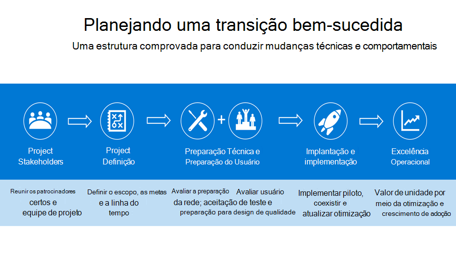
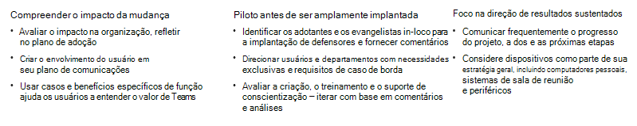

# Planejando uma transição bem-sucedida do Kaizala para o Microsoft Teams

À medida que você embarca em sua mudança do Kaizala para o Microsoft Teams, é importante aproveitar o tempo para  planejar uma transição bem-sucedida. Um plano de transição sólido fornece estrutura para sua movimentação e garante que todos os stakeholders estejam trabalhando em direção a uma meta comum. Usar uma estrutura comprovada para implementar a alteração pode ajudá-lo a começar sua transição hoje.

## Estrutura de transição

Descrevemos nossa abordagem recomendada para uma transição bem-sucedida abaixo e incentivamos você a seguir as fases em ordem, pois cada etapa na estrutura se baseia na etapa anterior.

- Vislumbrando o trabalho em equipe para sua organização

- Identificar campeões e stakeholders críticos

- Definindo o escopo do projeto

- Piloto do Microsoft Teams

Antes de começar, verifique se:

- [O Teams está instalado](/microsoftteams/get-clients) [e as licenças são atribuídas](/office365/servicedescriptions/teams-service-description) em seu ambiente. Pelo menos as licenças mínimas devem ser atribuídas à sua equipe principal e aos usuários pioneiros que participarão dessa fase inicial do projeto.

- Você baixou os aplicativos móveis e da área de trabalho.

### Prever o trabalho em equipe para sua organização

Um ambiente técnico íntegro, adoção sustentada do usuário e a realização de suas metas de negócios começam com o planejamento adequado. Um plano sólido fornece uma estrutura para seu projeto de atualização e garante que todos os stakeholders estejam trabalhando para atingir as mesmas metas. Reserve um tempo para listar os cenários atuais em que o Kaizala é usado. Em seguida, imagine os cenários de uso acima e além no local de trabalho moderno com o Microsoft Teams. Para começar a definir cenários de uso, consulte [Definir cenários de uso para o Microsoft Teams](/microsoftteams/teams-adoption-define-usage-scenarios).

### Identificar campeões e stakeholders críticos

Comece reunindo os stakeholders certos e defina seu plano de atualização. Um plano adequado deve incluir seu escopo, metas e uma linha do tempo clara para a transição. Com um plano acordado em vigor, confirme se seu ambiente técnico e seus usuários finais estão prontos para o Teams. Identifique as pessoas que estão interessadas em novas tecnologias e ajudando outras pessoas. Crie um [programa campeão para](/microsoftteams/teams-adoption-create-champions-program) impulsionar a excitação, a conscientização e a adoção em sua transição. Criamos um Guia do Programa de Campeões para iniciar este programa em sua organização. Para saber mais, confira [Criar um programa campeão](https://view.officeapps.live.com/op/view.aspx?src=https://fto365dev.blob.core.windows.net:443/media/Default/DocResources/Adoption/Build_Champions_Program_Guide.pptx).

### Definir o escopo de seu projeto

Ao planejar sua mudança para o Microsoft Teams, é essencial definir a aparência de sucesso para sua empresa.  O escopo do projeto define o foco do seu projeto no momento e serve para manter sua equipe de projeto focada em suas tarefas atuais, permitindo que você realize sua visão de longo prazo.

Para saber mais sobre nossa estratégia recomendada para definir resultados e sucesso, consulte Definir resultados e sucesso para [adotar o Microsoft Teams](/microsoftteams/teams-adoption-define-outcomes).

### Piloto do Microsoft Teams

Depois de definir o escopo e a visão do projeto, é hora de testar o Microsoft Teams. Identifique um grupo de usuários [de usuários pioneiros](/microsoftteams/teams-adoption-onboard-early-adopters) para participar de um experimento inicial com o Teams. Conduzir seu piloto inclui a comunicação com seus usuários, o monitoramento de sua rede e o uso para garantir que o desempenho da rede e a qualidade da chamada permaneçam íntegros, coletando comentários dos participantes e revisando tíquetes de suporte técnico para perguntas relacionadas ao Teams.

## Preparar sua organização

Depois de seguir a estrutura recomendada para planejar uma transição bem-sucedida do Kaizala, prepare sua organização para uma transição bem-sucedida do Microsoft Teams.

### Prepare-se

 1. Verifique se há licenças do Teams para todos. Confira os [planos do Teams](https://www.microsoft.com/microsoft-teams/compare-microsoft-teams-options?activetab=pivot%3aprimaryr1) e a [descrição do serviço do Microsoft Teams](/office365/servicedescriptions/teams-service-description).

 2. Use [as diretrizes de adoção do Microsoft Teams](https://adoption.microsoft.com/microsoft-teams/#get-started) para distribuir o Teams em toda a organização.

 3. Prepare administradores, campeões e sua maior organização para adotar a comunicação com o Teams por meio de recursos de qualificação e adoção.  

 4. Use estes recursos de treinamento para ajudar os usuários em sua organização a aprenderem e tirarem o máximo do Teams:

    - Para saber Administração de TI, confira [Administração de treinamento](/microsoftteams/itadmin-readiness).

    - Para treinamento ministrado por instrutor, confira [o treinamento ministrado por instrutor para o Microsoft Teams](/microsoftteams/instructor-led-training-teams-landing-page).
  
    - Para vídeos de treinamento, confira [o treinamento em vídeo do Microsoft Teams](https://support.microsoft.com/office/microsoft-teams-video-training-4f108e54-240b-4351-8084-b1089f0d21d7?ui=en-us&rs=en-us&ad=us).

## Adoção do Microsoft Teams campeão

Ao [impulsionar a adoção](/microsoftteams/teams-adoption-get-started) do Microsoft Teams, você pode oferecer uma excelente experiência do usuário e um valor comercial maior dentro de sua empresa.

Em toda a distribuição do Teams, certifique-se de aproveitar [esses recursos com](/microsoftteams/adopt-microsoft-teams-landing-page) orientações sobre como impulsionar a adoção do Teams.

Fortaleça seu conhecimento sobre o Teams e conduza o uso em sua organização por meio do treinamento para administradores e usuários. Para obter recursos de treinamento, consulte [o treinamento do Microsoft Teams](/microsoftteams/training-microsoft-teams-landing-page).

Se sua organização estiver interessada em uma experiência personalizável para se alinhar aos seus planos de uso e adoção, confira aqui para saber mais sobre a solução de treinamento sob demanda dos roteiros de aprendizagem do [Microsoft 365](https://adoption.microsoft.com/microsoft-365-learning-pathways/) .

Para ficar por dentro do que está por vir para o Teams e todos os outros produtos e serviços do Microsoft 365 ou Office 365 em sua organização, verifique o Centro de mensagens  e o roteiro [do Teams](https://www.microsoft.com/microsoft-365/roadmap?rtc=2&filters=Microsoft%20Teams). Você receberá comunicados sobre recursos novos e atualizados, alterações planejadas e problemas para se manter informado e preparado.

## Recursos adicionais

Reúna todos, obtenha conversas efetivamente, conecte-se com os funcionários e digitalize tarefas diárias com o Microsoft Teams. O Teams facilita a conexão e a coordenação com seus funcionários, membros, clientes e distribuidores da linha de frente.

Para recursos adicionais, compilaremos uma biblioteca  de documentação sobre o Microsoft Teams para administradores e profissões de TI. Use a documentação para garantir que sua organização esteja preparada ao longo de sua jornada do Kaizala para o Microsoft Teams.

## Próximos passos

[Navegando pelo Microsoft Teams do Kaizala](/MicrosoftTeams/navigate-teams)
