# Políticas do Teams e Pacotes de Políticas para Educação

> [!NOTE]
> Para obter um conhecimento amplo sobre políticas no Microsoft Teams, analise [Atribuir políticas a usuários no Microsoft Teams](assign-policies.md).

É importante observar que este artigo abordará várias maneiras de atribuir políticas a usuários no Teams.

- Atribuição manual para usuários individuais.
- Atribuição em massa via PowerShell para vários usuários.
- Atribuindo pacotes de políticas a usuários individuais ou a vários usuários.

As vantagens e desvantagens dessas abordagens se resumem às necessidades individuais da instituição.

## Administradores: Introdução ao gerenciamento de política do Microsoft Teams

O Microsoft Teams, em sua essência, é sobre os usuários serem capazes de fazer coisas como ir a reuniões ou eventos ao vivo, conversar, fazer chamadas e usar aplicativos. E definir as políticas de administração corretas do Microsoft Teams é uma etapa crítica na criação de um ambiente de aprendizado seguro para os alunos no Teams. Como administrador, você pode usar políticas para controlar os recursos do Teams que estão disponíveis para os usuários em sua instituição educacional.

Aqui está uma lista das áreas de políticas que você encontrará no Microsoft Teams:

- Reuniões
- Eventos ao vivo
- Chamadas
- Mensagens
- Teams
- Permissões de aplicativos

:::image type="content" source="media/edu-admin-center-users.png" alt-text="Captura de tela do usuário com políticas aplicadas.":::

Você pode gerenciar facilmente todas as políticas do Teams no [centro de administração do Microsoft Teams](https://admin.teams.microsoft.com) entrando com suas credenciais de administrador.

### Onde encontrar as políticas do Microsoft Teams

Depois de fazer logon no centro de administração do Teams, você poderá acessar as configurações de políticas de qualquer área do Teams que você precisa gerenciar, clicando na opção de política na navegação à esquerda do centro de administração do Teams. Incluímos uma captura de tela do local das políticas de mensagens.

:::image type="content" source="media/edu-messaging-policies.png" alt-text="Local da política de mensagens no centro de administração do Teams.":::

### Como criar e atualizar uma definição de política

Antes de atribuir políticas a usuários, você precisa primeiro adicionar e criar suas definições de políticas para cada área de recursos com o Teams.

> [!NOTE]
> Recomendamos que você configure diferentes definições de políticas para alunos e educadores.

Por padrão, cada novo usuário (aluno ou educador) receberá a definição de política Global (padrão em toda a organização) para cada área de recursos. Recomendamos executar estas etapas:

1. Crie uma definição de política personalizada para cada área de recursos do Teams que possa ser atribuída aos educadores (sem isso, quaisquer alterações feitas na política Global restringirão os educadores até que eles tenham sua própria política).
1. Atribua aos educadores essa nova definição de política.
1. Atualize a definição de política Global (padrão em toda a organização) e atribua-a aos alunos.

Para criar ou editar definições de política, vá para a área de recursos de política na qual deseja trabalhar (por exemplo, políticas de Mensagens). Selecione **Adicionar** se desejar criar uma nova definição de política personalizada (o que você fará para a definição de política personalizada criada para educadores). Caso contrário, para alterar uma definição de política existente, selecione **Editar** (que será o que você fará se optar por atualizar a política Global para os alunos).

:::image type="content" source="media/edu-messaging-policies-add-closeup.png" alt-text="Fechar a seção de políticas de mensagens com uma exibição do botão Adicionar.":::

Se você optar por adicionar ou editar uma definição de política, você será levado a uma exibição que lista todas as opções de política relacionadas a essa área de política. Use esta lista para selecionar quais valores você deseja definir em sua definição de política.

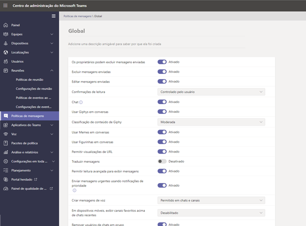

> [!IMPORTANT]
> Não se esqueça de selecionar **Salvar** antes de sair da página.

### Como atribuir uma definição de política a um usuário

> [!NOTE]
> A atribuição de uma definição de política pode demorar um pouco para se propagar para todos os usuários e clientes. Você pode fazer isso quando as contas de usuário forem criadas pela primeira vez no Azure/M365 e sempre que um novo aluno ingressa na instituição educacional.

Depois que sua definição de política for criada ou atualizada, você poderá atribuí-la a um usuário, selecionando **Gerenciar usuários** na página de políticas, pesquisando o usuário desejado e aplicando a política.

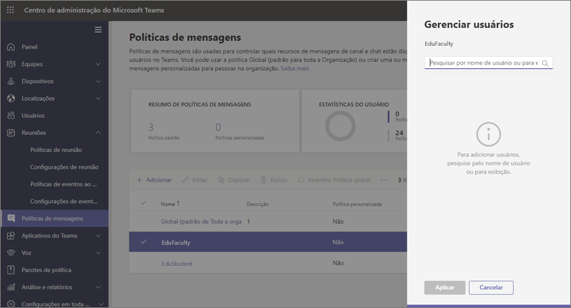

Você também pode atribuir uma política a um usuário, navegando até Usuários, selecionando o usuário para o qual deseja atualizar as políticas, selecionando Políticas e, em seguida, Editar. A partir daí, você pode selecionar a definição de política que deseja usar para atribuir ao usuário para cada área de recursos.

> [!IMPORTANT]
> Se você faz parte de uma grande instituição educacional, pode ser difícil usar a experiência do portal de administração do Microsoft Teams para definir políticas para cada usuário. Será melhor para você atribuir políticas em lotes por meio do PowerShell. Temos algumas informações específicas da EDU sobre como [Atribuir políticas a grandes conjuntos de usuários em sua instituição educacional](batch-policy-assignment-edu.md), se necessário, e você também pode verificar a seção abaixo sobre pacotes de políticas, que são outra ótima maneira de gerenciar políticas e configurações para grandes grupos de usuários.

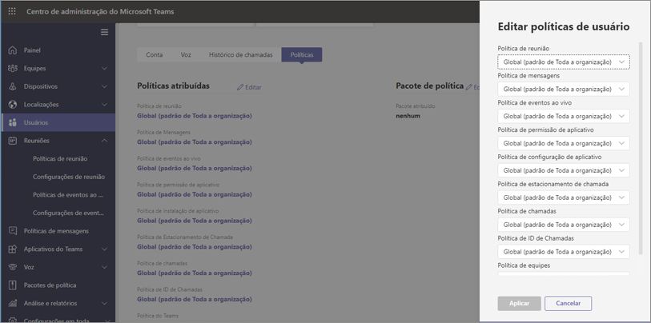

### Pacotes de política no Microsoft Teams

Um pacote de políticas no Teams coleta políticas predefinidas e configurações de políticas que você aprendeu e estão descritas acima e as atribui a usuários com funções semelhantes em sua instituição. Os pacotes de políticas simplificam, otimizam e ajudam a fornecer consistência ao gerenciar políticas. Em prática normal, você atribui a cada um de seus usuários um pacote de políticas e redefine as políticas em cada pacote conforme necessário para atender às necessidades desse grupo de usuários. Quando você atualiza as configurações em um pacote, todos os usuários atribuídos a esse pacote são alterados como uma atualização em massa.

As instituições educacionais em geral têm muitos usuários com necessidades únicas, dependendo em parte da idade e maturidade dos estudantes. Por exemplo, você pode conceder aos educadores e funcionários acesso total ao Microsoft Teams, mas deseja limitar os recursos do Microsoft Teams para que os alunos incentivem um ambiente de aprendizado seguro e focado. Você pode usar pacotes de políticas para personalizar as configurações com base nas necessidades de diferentes coortes na comunidade da sua instituição educacional.

> [!NOTE]
> Para obter mais informações, confira [Gerenciar pacotes de políticas no Microsoft Teams](manage-policy-packages.md) para obter instruções passo a passo sobre como atribuir um único usuário a um pacote, atribuir pacotes em massa para até 5000 usuários e gerenciar e atualizar as políticas vinculadas a cada pacote.

Assim como a lista de políticas anteriormente neste artigo, os pacotes de políticas predefinem as políticas para:

- Reuniões
- Eventos ao vivo
- Chamadas
- Mensagens
- Teams
- Permissões de aplicativos

No momento, o Microsoft Teams inclui os seguintes pacotes de políticas:

|Nome do pacote listado no centro de Administração do Microsoft Teams |Melhor usado para  |Descrição |
|:--- |:--- |:--- |
|**Education_Teacher**| Educadores e funcionários| Use esse conjunto de políticas e configurações de políticas para conceder aos educadores e funcionários de sua organização acesso total a chat, chamadas e reuniões por meio do Microsoft Teams. |
|**Education_PrimaryStudent**| Alunos do ensino fundamental  | Os alunos mais jovens do ensino fundamental da sua instituição podem precisar de mais limites no Microsoft Teams. Use esse conjunto de políticas e configurações de políticas para limitar recursos como criação e gerenciamento de reuniões, gerenciamento de chat e chamadas privadas. |
|**Education_SecondaryStudent**| Alunos do ensino médio | Os alunos do ensino médio da sua instituição podem precisar de mais limites no Microsoft Teams. Use esse conjunto de políticas e configurações de políticas para limitar recursos como criação e gerenciamento de reuniões, gerenciamento de chat e chamadas privadas. |
|**Education_HigherEducationStudent**| Alunos do ensino superior | Os alunos do ensino superior dentro da sua intuição podem precisar de menos limites do que os alunos mais jovens, mas algumas limitações podem ser recomendadas. Você pode usar esse conjunto de políticas e configurações de políticas para conceder acesso a chats, chamadas e reuniões em sua organização, mas limite como os alunos usam o Microsoft Teams com participantes externos. |
|**Education_PrimaryTeacher_RemoteLearning**| Educadores e funcionários | Cria um conjunto de políticas que se aplicam aos professores primários para maximizar a segurança e a colaboração dos alunos ao usar o aprendizado remoto. |
|**Education_PrimaryStudent_RemoteLearning**| Alunos do ensino fundamental| Cria um conjunto de políticas que se aplicam aos alunos do ensino fundamental para maximizar a segurança e a colaboração dos alunos ao usarem o aprendizado remoto.
|||

:::image type="content" source="media/edu-policy-packages-list.png" alt-text="Página de pacotes de políticas com a lista de pacotes de política à sua escolha.":::

Cada política individual recebe o nome do pacote de políticas, para que você possa identificar facilmente políticas vinculadas a um pacote de políticas. Por exemplo, quando você atribui o pacote de políticas Education_Teacher a educadores em sua instituição educacional, uma política chamada Education_Teacher é criada para cada política no pacote.

> [!NOTE]
> Se você decidir que os educadores e a equipe de suporte administrativo precisam de políticas diferentes, poderá redefinir um pacote existente: identifique um pacote que não esteja usando no momento e altere as configurações para que sejam apropriadas para esse grupo. Você pode ter que anotar qual grupo tem qual pacote, mas esse é o único impedimento para a redefinição de um pacote.

## Políticas que devem ser atribuídas à segurança do estudante

### Políticas de reunião

#### Desativar o recurso para criar e iniciar reuniões

> [!NOTE]
> Você pode não perceber essa funcionalidade em seu locatário no momento. Isso ocorre porque esse recurso está sendo implantado e estará disponível para todos os usuários depois que ele for implantado em todos os locatários. Consulte o [Roteiro do Teams](https://www.microsoft.com/microsoft-365/roadmap?filters=&searchterms=63355) para obter mais informações.

Para garantir que os alunos não possam agendar uma reunião para comunicar-se sem supervisão, em políticas de reunião, mantenha os recursos de criação de reunião **Desativadas** por meio dessas Configurações gerais:

- **Permitir Reunir agora em canais**: Desativado
- **Permitir o suplemento do Outlook**: Desativado
- **Permitir o agendamento de reunião do canal**: Desativado
- **Permitir o agendamento de reuniões privadas**: Desativado

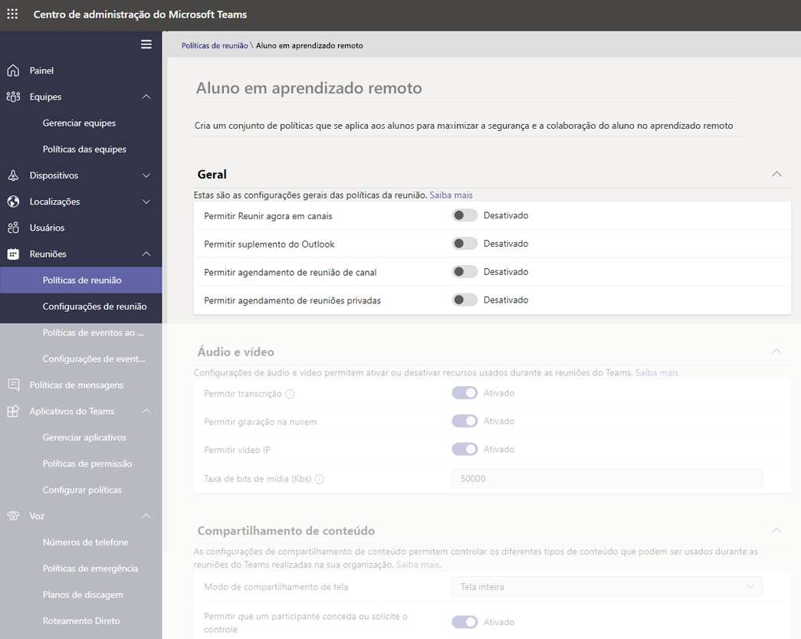

- E na mesma página, na seção Participantes e Convidados na reunião:
  - **Permitir Reunir agora em reuniões privadas**: Desativado
  - **Permitir chat em reuniões**: Desabilitado

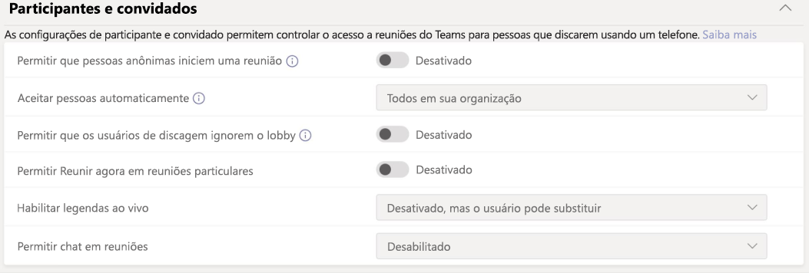

Desativar as opções **Permitir Reunir agora nos canais**, **Permitir agendamento de reunião de canal**, **Permitir agendamento de reuniões privadas** e **Reunir agora em reuniões privadas** para os estudantes, impede tanto a eles de agendarem uma reunião, como também ao organizador. Elas também fornecem as seguintes medidas de segurança para a educação:

- Se os alunos tentarem participar da reunião antes do educador, eles não poderão participar da reunião na versão mais recente do aplicativo do Teams.
- Embora a criação de reuniões se aplique a todos os usuários e licenças, as medidas de segurança de bloqueio de participação na reunião descritas acima, apenas se aplicam a clientes educacionais no Teams com base no tipo de licença do usuário.

Quando você altera a política **Permitir chat em reuniões** para desabilitar e impedir que os alunos agendem as reuniões acima, e mantém essa política ativada para educadores (para as reuniões que não estão agendadas em um canal ou se reunir agora em um canal), os alunos não poderão conversar antes do educador ingressar na reunião, nem após a reunião. Eles ainda poderão ver o histórico do chat antes, durante e após a reunião. Como exemplo, eles poderão ver as mensagens do professor ou o link de gravação da reunião, caso a reunião tenha sido gravada.

Se alunos e educadores estiverem com a política **Permitir chat em reuniões** desativada, ninguém poderá conversar na janela de chat da reunião. A medida de segurança de restrição nos chats de reunião descrita acima, apenas se aplica a clientes educacionais em equipes com base no tipo de licença dos usuários.

#### Controle se os alunos podem ou não compartilhar vídeos durante chamadas e reuniões

Na seção de políticas de reunião, verifique se os Valores visuais e de áudio que você definiu para seus alunos estão alinhados às diretrizes da instituição educacional, bem como aos interesses de alunos, educadores e pais e responsáveis ​​(com exceção de **Permitir gravação em nuvem**, que é recomendável estar **Desativado**).

Aqui estão as opções:

- **Permitir transcrição**: Desativada/Ativada
- **Permitir gravação em nuvem**: **Desativada**
- **Permitir Vídeo IP** Desativada/Ativada

:::image type="content" source="media/edu-policy-list-b.png" alt-text="Ensino do aluno na página de aprendizado remoto com as opções de vídeo exibidas.":::

### Políticas de eventos ao vivo

#### Desativar o recurso para criar e iniciar eventos ao vivo

Para garantir que os alunos não possam agendar um evento ao vivo para comunicar-se sem supervisão, desative a política **Permitir agendamento** para alunos, definindo-a como **Desativada**.

:::image type="content" source="media/edu-allow-scheduling-off.png" alt-text="Ensino do aluno na página de aprendizado remoto com a opção de agendamento Desativada.":::

### Políticas de chamadas

#### Desativar o recurso de fazer chamadas privadas

Para garantir que os alunos não possam fazer chamadas privadas com outros alunos ou educadores, desabilite a política **Fazer chamadas privadas** para alunos, definindo-a como **Desativada**.

:::image type="content" source="media/edu-private-calls-off.png" alt-text="Ensino do aluno na página de aprendizado remoto com a opção Fazer chamadas privadas.":::

### Políticas de mensagens

#### Desativar o recurso de excluir ou editar mensagens enviadas

- Para alunos: Para garantir que as mensagens enviadas pelos alunos não sejam excluídas ou alteradas, os alunos devem ter essas configurações **Desativadas**:
  - **Excluir mensagens enviadas**
  - **Editar mensagens enviadas**
- Para educadores: Para garantir que os educadores possam moderar ou excluir mensagens inadequadas enviadas pelos alunos, os educadores devem ter essas configurações **Ativadas**:
  - **Os proprietários podem excluir mensagens enviadas** (Essa configuração permite que os educadores excluam mensagens inapropriadas dos alunos)
  - **Excluir mensagens enviadas**
  - **Editar mensagens enviadas**

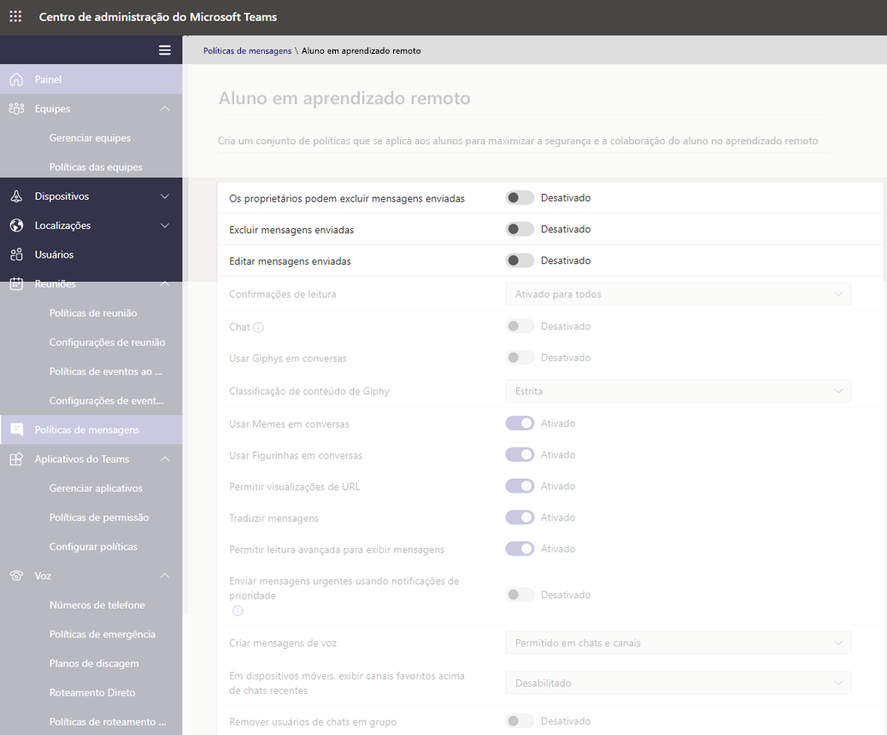

> [!NOTE]
> Para obter mais informações sobre esse tópico, confira [Silenciar comentários dos alunos em uma equipe de classe.](https://support.office.com/article/Mute-student-comments-in-a-class-team-a378de16-ffc0-420c-b08d-e17ec08e7c17).

#### Controlar se os alunos podem conversar em particular

Verifique se o valor **Chat Ativado/Desativado** que você definiu para os alunos está alinhado às diretrizes da sua instituição educacional, bem como aos interesses dos alunos e educadores. Esse controle ativa ou desativa a capacidade de um usuário se comunicar de forma privada em chats individuais ou em grupo no Teams.

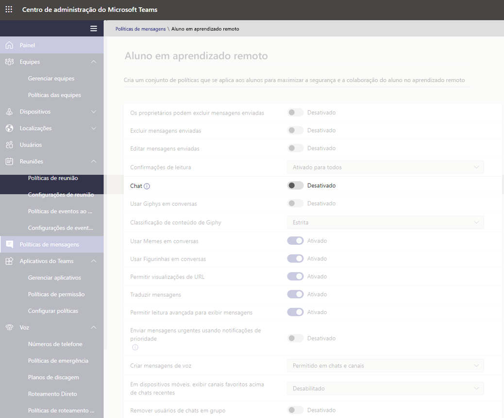

#### Controlar se os alunos podem personalizar suas mensagens

Verifique se o valor que você definiu para os alunos está alinhado às diretrizes da sua instituição educacional, bem como aos interesses dos alunos, educadores, pais e responsáveis. Nossa recomendação é definir o **Giphy para os alunos** **Desativado** e manter os **Memes e Figurinhas** **Ativado**.

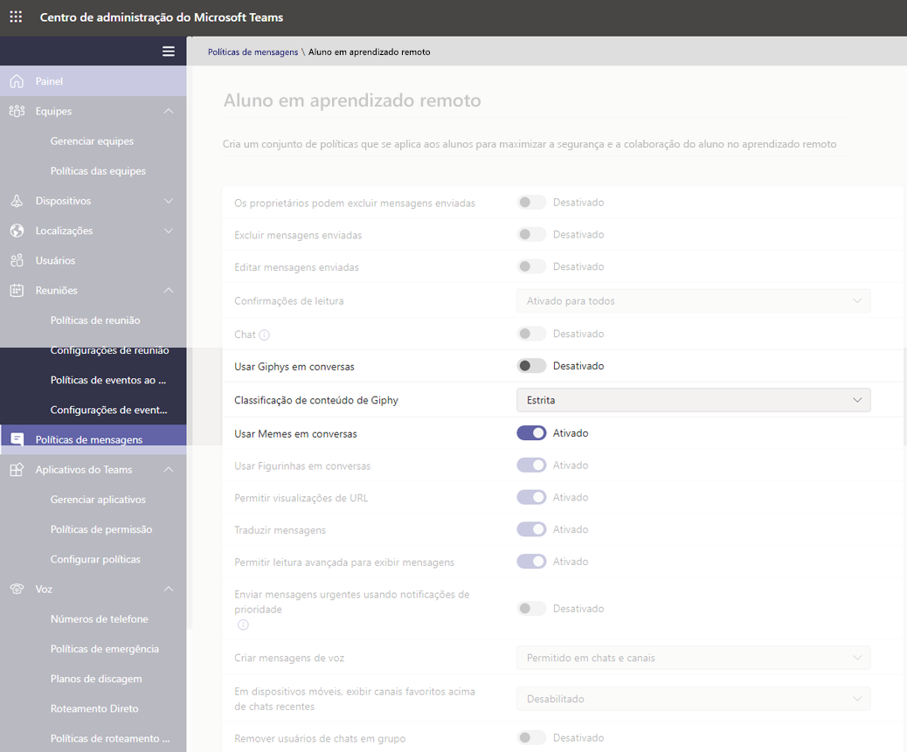

#### Controlar se os alunos podem enviar mensagens de voz

Verifique se o valor **Criar mensagens de voz** que você definiu para os alunos está alinhado às diretrizes da sua instituição educacional, bem como aos interesses dos alunos e educadores.

#### Desativar o recurso de remover usuários do chat para alunos

Os alunos não devem poder remover outros usuários de nenhum chat em que estejam incluídos. A configuração **Remover usuários de chats em grupo** deve estar **Desativada**.

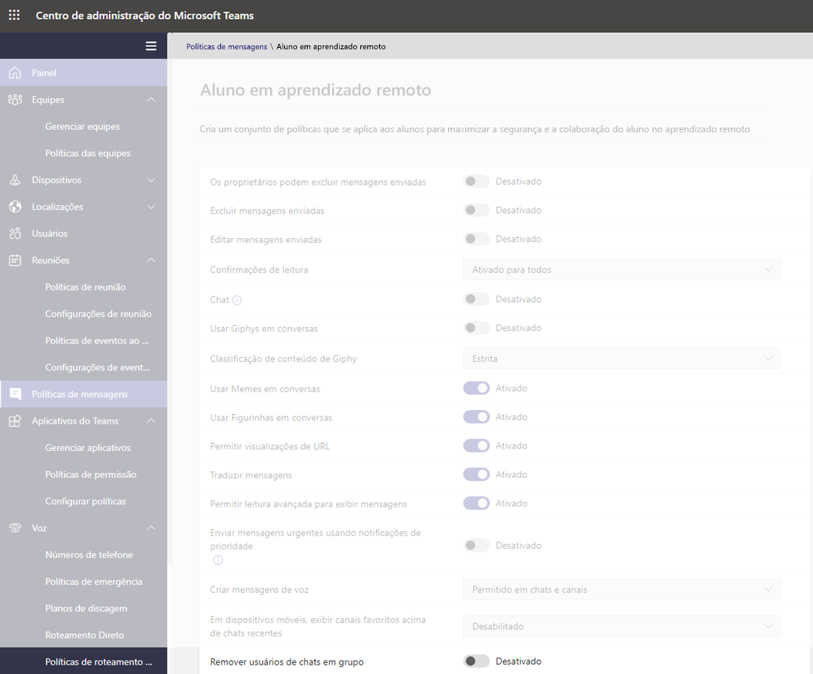

### Políticas do Teams

#### Desativar a capacidade de descobrir e criar canais privados

Para garantir que os alunos não possam criar um canal privado como espaço pessoal para se comunicar sem supervisão, defina a política **Criar canais privados** para **Desativada**.

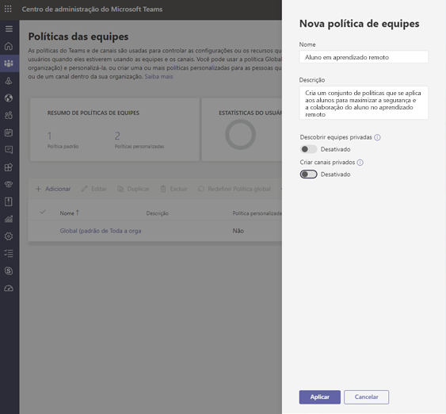

> [!IMPORTANT]
> É provável que você também deseje garantir que os alunos não possam criar novas equipes no Microsoft Teams. Essa é, na verdade, uma configuração de grupos do M365 e você pode ler mais sobre isso [aqui](https://docs.microsoft.com/microsoft-365/admin/create-groups/manage-creation-of-groups).

### Políticas de permissão do aplicativo

#### Controlar se os alunos podem adicionar aplicativos no Teams

Verifique se os valores que você definiu para os alunos estão alinhados com as diretrizes da sua instituição educacional. Por exemplo, se você deseja que os alunos sejam expostos aos aplicativos que você aprova, você pode selecionar:

- **Aplicativos da Microsoft**: **Permitir todos os aplicativos**
- **Para aplicativos de terceiros**: **Permitir aplicativos específicos e bloquear todos os outros**
- **Para aplicativos de locatário**: **Permitir aplicativos específicos e bloquear todos os outros**

:::image type="content" source="media/edu-policies-apps.png" alt-text="Ensino do aluno na página de aprendizado remoto com as opções de política de aplicativo definidas.":::

> [!NOTE]
> Este é um exemplo e, conforme indicado acima, você deve definir essas políticas de acordo com as diretrizes da sua instituição educacional.

## Políticas que devem ser atribuídas para educadores

Essas são configurações de política recomendadas para que os administradores apliquem aos educadores, para que eles possam ter uma experiência de classe segura com seus alunos.

> [!NOTE]
> As recomendações de política para alunos contêm mais informações do que as seções de educadores, que você verá abaixo. Embora você possa definir as configurações de política de acordo com as políticas e os procedimentos da sua instituição educacional, as recomendações fornecidas aqui são estritamente relevantes quando se trata de segurança e proteção dos alunos.

### Políticas de reunião

Essas configurações permitem aos educadores controlar o acesso às suas reuniões.

- **Permitir que pessoas anônimas iniciem uma reunião**: **Desativada**
- **Admitir pessoas automaticamente**: **Todos em sua organização**
- **Permitir que os usuários de discagem ignorem o lobby**: **Desativada**
- 1**DesignatedPresenterRoleMode**: **OrganizerOnlyUserOverride**

1 Esta configuração não está no centro de administração do Microsoft Teams, portanto, você precisará usar o PowerShell para definir o parâmetro **DesignatedPresenterRoleMode** usando o cmdlet [Set-CsTeamsMeetingPolicy](https://docs.microsoft.com/powershell/module/skype/set-csteamsmeetingpolicy) ou o cmdlet [New-CsTeamsMeetingPolicy](https://docs.microsoft.com/powershell/module/skype/new-csteamsmeetingpolicy) Define o valor padrão da configuração **Quem pode apresentar?** nas **Opções de reunião** no Teams para **Somente Eu**. Com essa configuração, somente o organizador da reunião pode ser um apresentador e todos os outros participantes da reunião são designados como participantes. Para saber mais, confira [Configurações de política de reunião- Modo função de apresentador designado](meeting-policies-in-teams.md#meeting-policy-settings---designated-presenter-role-mode).

> [!NOTE]
> Para funcionários que não são educadores, talvez você queira definir o parâmetro como **EveryoneUserOverride** (que corresponde à configuração **Todos** no Teams) ou **EveryoneInCompanyUserOverride** (que corresponde à configuração **Pessoas na minha organização** no Teams).

### Políticas de mensagens

Definir **Proprietários pode excluir as mensagens enviadas** para **Ativada** permitirá que os educadores monitorem as sessões de chat e removam mensagens inadequadas em reuniões do canal.

> [!NOTE]
> Isso permite que os educadores removam mensagens inapropriadas em chats da turma quando a reunião é criada no canal ou removam mensagens no próprio canal.

## O que os educadores podem fazer para proteger os alunos

É claro que, embora a definição de políticas seja uma ótima maneira de os Administradores protegerem proativamente os alunos na configuração do Teams, os educadores são as pessoas que interagem com os alunos regularmente e também têm um papel vital a desempenhar para manter os alunos seguros. Os administradores podem querer discutir as informações a seguir com os educadores com quem trabalham.

### Definir as funções da reunião por meio das opções de Reunião

As opções de reunião permitem controlar se os participantes da reunião participam de suas reuniões como participantes ou apresentadores. Suas opções são:

- Vá para o **Calendário** e navegue até a reunião que você deseja atualizar. Clique ou toque em **Opções de reunião** ao lado do link de ingresso na reunião para abrir suas **Opções de reunião**.

- Controle quem pode entrar na reunião diretamente com a seleção **Quem pode ignorar o lobby**. Escolha **Pessoas em minha organização** para impedir que usuários externos tenham a opção de entrar e defina a opção **Sempre permitir que os chamadores ignorem o lobby** para **Desativada** para que os participantes esperem para serem admitidos na reunião em vez de ingressar imediatamente. Você também tem a opção de **Anunciar quando os chamadores ingressam ou saem**, e isso deve ser definido como **Ativada** para que você esteja sempre ciente de quem está na reunião.
- Controlar quem ingressa na reunião como apresentador ou participante. Você pode selecionar **Apenas eu** para designar todos os outros participantes como participantes. Essa é a configuração mais segura para reuniões realizadas em sala de aula.
  - Se você espera ter mais de um apresentador em sua reunião, selecione **Pessoas específicas** e escolha os outros participantes que devem ingressar como apresentadores. Selecione **Todos** se desejar que todos os participantes ingressem na reunião como apresentadores.

:::image type="content" source="media/edu-meeting-options.png" alt-text="Quem pode ignorar o menu suspenso do lobby com Pessoas em minha organização selecionada e Quem pode apresentar o menu suspenso com Somente eu selecionado.":::

### Funções em uma reunião online

Todos os participantes de uma reunião recebem uma função como apresentador ou participante. A função de um participante controla o que eles podem fazer em uma reunião. Confira a tabela abaixo.

|Recursos  |Organizador/apresentador  |Participante  |
|---------|---------|---------|
|Falar e compartilhar vídeos     |     Y     |     Y     |
|Participar do chat da reunião     |     Y     |     Y     |
|Visualizar em particular um arquivo do PowerPoint compartilhado por outra pessoa     |     Y     |     Y     |
|Compartilhar conteúdo     |     Y     |     N     |
|Ativar mudo de outros participantes|     Y     |     N     |
|Remover participantes      |     Y     |     N     |
|Admitir outros participantes do lobby|     Y     |     N     |
|Alterar as funções de outros participantes     |     Y     |     N     |
|Iniciar ou parar gravação      |     Y     |     N     |

### Alterar as funções durante uma reunião

Cada participante de uma reunião recebe uma função de apresentador ou participante. A função de um participante controla o que eles podem fazer durante uma reunião.

- Para alterar a função de um participante, clique ou toque para **Mostrar participantes** nos controles de chamada. Clique com o botão direito do mouse no participante cuja função precisa ser alterada e selecione **Tornar um participante** ou **Tornar um apresentador**.

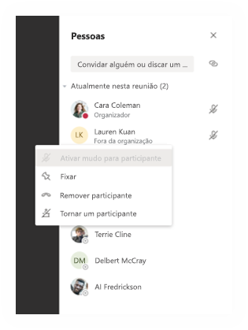

- Para acessar rapidamente as opções de reunião e alterar as configurações da função da reunião para os participantes atuais e para qualquer pessoa que ingressar em sua reunião no futuro, clique ou toque em **Mais ações** nos controles de chamada e, em seguida, **Mostrar detalhes da reunião**. Você pode encontrar o link para as **Opções de reunião** ao lado do link de ingresso da reunião.

:::image type="content" source="media/edu-meeting-details.png" alt-text="Janela da reunião com o painel Detalhes da reunião, no lado direito.":::

### Silenciar os comentários dos alunos

Após a reunião, você pode impedir que os alunos comentem ainda mais, caso tenha agendado uma reunião de canal.

#### Para uma reunião específica

Quando você agenda uma reunião em um canal, a reunião em si é uma postagem do canal e as conversas da reunião são réplicas da postagem. Como proprietário da equipe, você pode clicar ou tocar em **Mais ações** para essa postagem e clicar em **Editar**.

:::image type="content" source="media/edu-meeting-edit.png" alt-text="Escolher Mais opções em uma postagem do canal e ver a opção de menu Editar como a segunda opção no menu pop-up.":::

No painel de edição, você tem uma opção suspensa, onde é possível definir essa opção como **Você e os moderadores podem responder**.

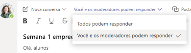

### Para todas as reuniões e postagens de uma equipe

Você pode controlar quando os alunos podem postar e responder à equipe de classe e a conversas da reunião. Clique ou toque em **Mais ações** da equipe, clique em **Gerenciar Equipe**, vá para **Membros**e selecione as pessoas que deseja silenciar ou selecione **Silenciar todos os alunos**.

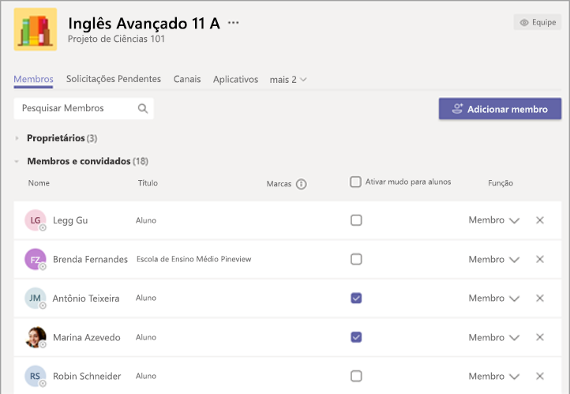

## Leituras adicionais

Confira a seção [Como manter os alunos em segurança durante reuniões no Teams para ensino à distância](https://support.office.com/article/keeping-students-safe-while-using-meetings-in-teams-for-distance-learning-f00fa399-0473-4d31-ab72-644c137e11c8) para obter mais informações sobre como proteger os alunos.
