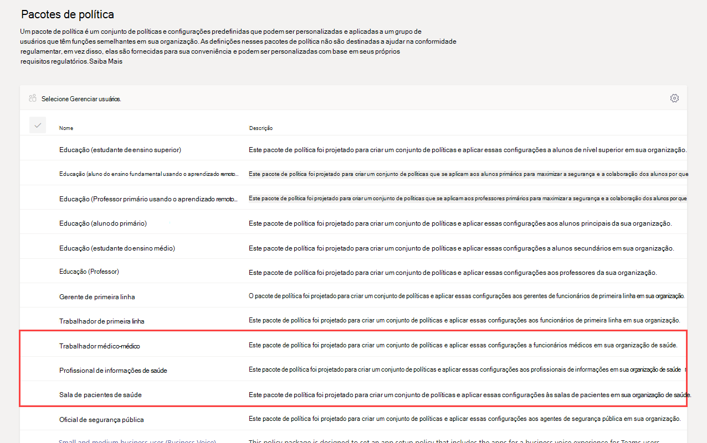
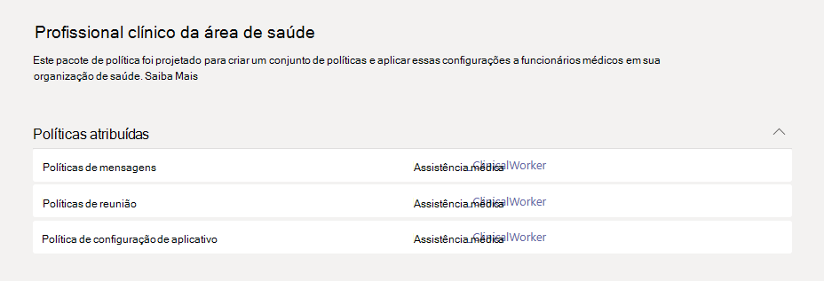
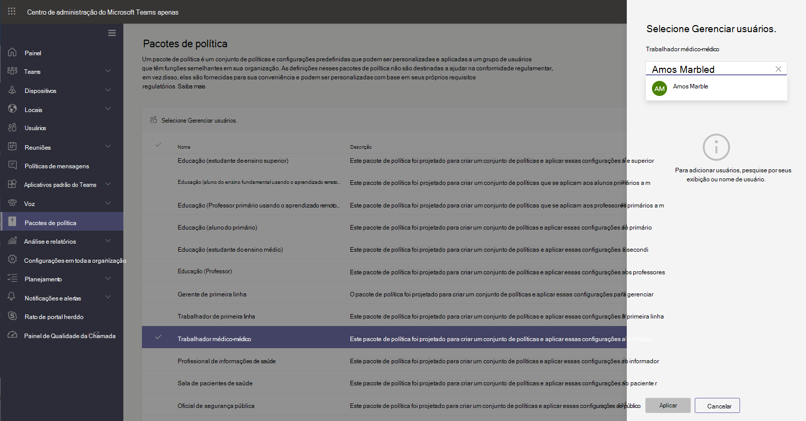

# Pacotes de políticas do Teams para a área de saúde

## Visão Geral

Um [pacote de política](manage-policy-packages.md) no Microsoft Teams é um conjunto de políticas e configurações de política predefinidas que você pode atribuir a usuários com funções semelhantes em sua organização. Os pacotes de políticas simplificam, otimizam e ajudam a fornecer consistência ao gerenciar políticas. Você pode personalizar as configurações das políticas no pacote para atender às necessidades dos usuários. Quando você altera as configurações de políticas em um pacote de política, todos os usuários atribuídos a esse pacote têm as configurações atualizadas. Você pode gerenciar pacotes de política usando o Centro de Administração do Microsoft Teams ou o Windows PowerShell.

> [!VIDEO https://www.microsoft.com/videoplayer/embed/RE4Ht2o]

Pacotes de política pré-definem políticas para o seguinte, dependendo do pacote:

- Mensagens
- Reuniões
- Chamadas
- Configuração do aplicativo
- Eventos ao vivo

No momento, o Microsoft Teams inclui os seguintes pacotes de políticas.

|Nome do pacote listado no Centro de Administração do Microsoft Teams|Melhor usado para|Descrição |
|---------|---------|---------|
|Profissional clínico da área de saúde  |Colaboradores clínicos em sua organização da área de saúde  |Cria um conjunto de políticas e configurações de política que dão a funcionários da área de saúde, como enfermeiros registrados, enfermeiros chefe, médicos e assistentes sociais acesso total ao chat, chamadas, gerenciamento de turnos e reuniões. |
|Profissional de informações da área de saúde  |Operadores de informações em sua organização da área de saúde |Cria um conjunto de políticas e configurações de política que dão aos operadores de informações na sua organização da área de saúde, como equipe de TI, de informática, equipe financeira e responsáveis pela conformidade acesso total ao chat, chamadas e reuniões.|
|Quartos dos pacientes de saúde  |Dispositivos de quarto dos pacientes|Cria um conjunto de políticas e configurações de política que se aplicam aos quartos dos pacientes em sua organização de saúde.|

Cada política individual recebe o nome do pacote de políticas, para que você possa identificar facilmente políticas vinculadas a um pacote de políticas. Por exemplo, quando você atribui o pacote de políticas para trabalhadores clínicos da área de saúde a clínicos de sua organização, uma política chamada Healthcare_ClinicalWorker é criada para cada política do pacote.

## Começar a trabalhar com pacotes de política

Para começar a trabalhar com pacotes de política da área de saúde, no hub de integração do Centro de Administração da Microsoft, selecione **Healthcare** e, então, selecione **Atribuir configurações de política por função**. Quando estiver pronto para começar, decida a quais pacotes de política você gostaria de atribuir a indivíduos em sua organização.

Selecione **Exibir detalhes da política** para saber mais sobre as políticas específicas em um pacote e suas respectivas configurações. Essas [podem ser personalizadas](manage-policy-packages.md#customize-policies-in-a-policy-package) após a atribuição no Centro de Administração do Teams.

Escolha um ou vários pacotes para atribuir e clique em **Avançar**. Você pode pesquisar e adicionar pessoas ao pacote de políticas mais adequado para sua função. Um indivíduo não pode ser atribuído a mais de um pacote de política ao mesmo tempo.

Depois de adicionar pessoas ao pacote de política correto, você **Concluir** finaliza suas seleções. Você pode continuar a personalizar e gerenciar pacotes de política no Centro de Administração do Microsoft Teams.

## Gerenciar pacotes de política

### Exibir

Exibir as configurações de cada política em um pacote de política antes de atribuir um pacote. Na navegação à esquerda do Centro de Administração do Microsoft Teams, selecione **Pacotes de Política**, selecione o nome do pacote e, em seguida, selecione o nome da política.

Decida se os valores predefinidos são apropriados para a sua organização ou se você precisa personalizá-los para serem mais restritivos ou leniente com base nas necessidades da sua organização.

### Personalizar

Personalize as configurações das políticas no pacote de política, conforme necessário, para atender às necessidades da sua organização. As alterações que você fizer nas configurações da política serão automaticamente aplicadas aos usuários que recebem o pacote. Para editar as configurações de uma política em um pacote de política, na navegação à esquerda do Centro de Administração do Microsoft Teams, vá para **Pacotes de política**, selecione o pacote de política, selecione o nome da política que você deseja editar e selecione **Editar**.

Lembre-se de que você também pode alterar as configurações das políticas em um pacote após atribuir o pacote de política. Para saber mais, confira [Personalizar políticas em um pacote de política](manage-policy-packages.md#customize-policies-in-a-policy-package).

### Atribuir

Atribua o pacote de política aos usuários. Se um usuário tiver uma política atribuída e, mais tarde, você atribuir uma política diferente, a atribuição mais recente terá prioridade.

> [!NOTE]
> Cada usuário exigirá o complemento de Comunicações Avançadas para receber uma atribuição de pacote de políticas personalizadas. Para obter mais informações, consulte [Complemento de Comunicações Avançadas para o Microsoft Teams ](/microsoftteams/teams-add-on-licensing/advanced-communications).

#### Atribuir um pacote de política a um ou vários usuários

Para atribuir um pacote de política a um ou vários usuários, na barra de navegação à esquerda do centro de administração do Microsoft Teams, vá para **Pacotes de política** e, em seguida, selecione **Gerenciar usuários**.  

Para saber mais, confira [Atribuir um pacote de política](assign-policy-packages.md).

Se um usuário tiver uma política atribuída e, em seguida, você atribuir uma política diferente, a atribuição mais recente terá prioridade.

#### Atribua o pacote de política a um grupo.

**Este recurso está na visualização particular**

As atribuições de pacote de política aos grupos permitem atribuir várias políticas a um grupo de usuários, como uma lista de distribuição ou grupo de segurança. As atribuições de política serão propagadas para os membros do grupo, de acordo com as regras de precedência. À medida que os membros forem adicionados ou removidos de um grupo, as atribuições de política herdadas serão atualizadas. Esse método é recomendado para grupos de até 50.000 usuários, mas também funcionará com grupos maiores.

Para saber mais, confira [Atribuir um pacote de política a um grupo](assign-policy-packages.md#assign-a-policy-package-to-a-group).

#### Atribuir um pacote de política a um conjunto grande (lote) de usuários

Use a tarefa de pacote de política de lote para atribuir um pacote de política a grandes conjuntos de usuários por vez. Use o cmdlet [New-CsBatchPolicyPackageAssignmentOperation](/powershell/module/teams/new-csbatchpolicypackageassignmentoperation) para enviar um lote de usuários e o pacote de política que você deseja atribuir. As atribuições são processadas como uma operação de plano de fundo e uma ID de operação é gerada para cada lote.

Um lote pode conter até 5.000 usuários. Você pode especificar os usuários por ID do objeto, UPN, endereço SIP ou endereço de email. Para saber mais, confira [Atribuir um pacote de política a um lote de usuários](assign-policy-packages.md#assign-a-policy-package-to-a-batch-of-users).

## Tópicos relacionados

[Gerenciar pacotes de política em equipes](manage-policy-packages.md)

[Atribuir pacotes de política a usuários e grupos](assign-policy-packages.md)
