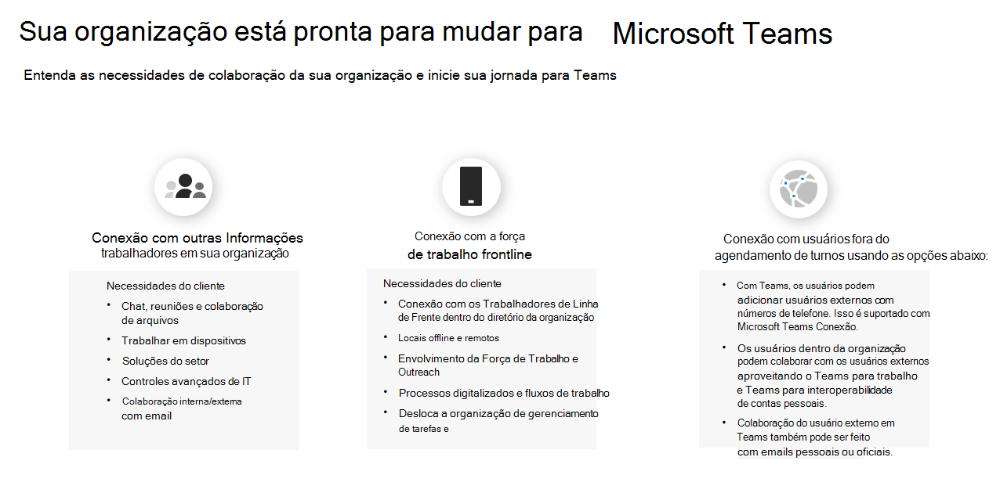
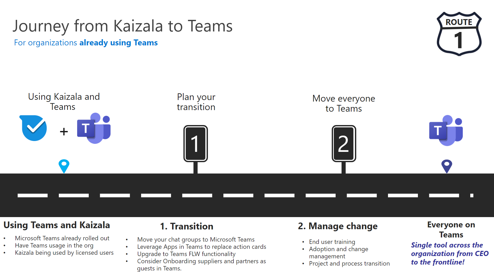

# Mapeando sua Kaizala para Teams jornada

Você decidiu mudar de Kaizala para Microsoft Teams.

Antes de começar, é importante responder a estas duas perguntas:

- Quais grupos de usuários mudarão para Teams?  

- Qual é o caminho para Teams?

## Identificar grupos de usuários

*Quais grupos existem em sua organização? Who usar o Teams e como? Quais são as necessidades desses grupos para um trabalho em equipe eficaz?* Para começar sua jornada para Teams, primeiro **identifique os grupos de usuários para sua transição.**  Grupos de usuários são um conjunto de funcionários em sua força de trabalho que conduzem trabalhos em áreas semelhantes da empresa. 

Identificamos três grupos de usuários comuns para dar suporte a você na identificação das necessidades de colaboração. Cada grupo de usuários tem suas próprias necessidades exclusivas em termos de comunicação. 

 1. **Os trabalhadores da** informação são funcionários que criam, usam, transformam, consomem ou gerenciam informações no decorrer de seu trabalho.

 2. **Os trabalhadores** de linha de frente são principalmente trabalhadores sem mesa cuja função principal é trabalhar diretamente com clientes ou o público em geral que fornece serviços, suporte e produtos de venda ou estão diretamente envolvidos na fabricação de produtos/serviços.

 3. **Usuários externos** são pessoas de fora da sua organização, como fornecedores, fornecedores, parceiros de negócios, clientes ou clientes.

Os usuários que se conectam com outros funcionários de informações em suas equipes de trabalho precisam:

- Chat, reunião, colaboração de arquivos

- Trabalhar em dispositivos

- Soluções do setor

- Controles avançados de IT
  
- Colaboração interna e externa com email

Os usuários que se conectam à força de trabalho frontline precisam:

- Conexão com Os Funcionários de Linha de Frente no diretório da organização

- Locais offline e remotos

- Envolvimento e divulgação da força de trabalho

- Processos digitalizados e fluxos de trabalho

- Agendamento de turnos e gerenciamento de tarefas

Os usuários que se conectam com usuários externos (fornecedores/fornecedores) podem usar:

- [Colaboração de acesso de](/MicrosoftTeams/guest-joins) convidados

- [Federação](/microsoftteams/manage-external-access)

## Determinar seu caminho

Depois de verificar as necessidades de colaboração de seus grupos de usuários, você poderá determinar como será seu caminho de Kaizala para Teams você. Todas as organizações são exclusivas e a jornada de nenhuma força de trabalho será exatamente a mesma. As organizações que não usam o Teams precisarão tomar decisões estratégicas adicionais para garantir uma jornada de transição bem-sucedida. Determinar seu caminho ajudará você a identificar quaisquer ações importantes que devem ser concluídas para uma transição bem-sucedida.

Descrevemos o que o caminho pode consistir, dependendo do uso da sua organização hoje:  

Para **organizações que não usam Teams**:

 1. Vislumbrar o trabalho em equipe para sua organização

 2. Piloto Teams
  
 3. Implantar Teams
  
 4. Use Kaizala e Teams
  
 5. Gerenciar alterações

 6. Planejar sua adoção de Teams

 7. Mover sua organização para Teams

Para **organizações que já usam Teams**:

 1. Planejar sua transição

 2. Gerenciar alterações

## Próximos passos

[Planejar uma transição bem-sucedida para Microsoft Teams](/MicrosoftTeams/plan-your-move-kaizala)
