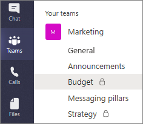
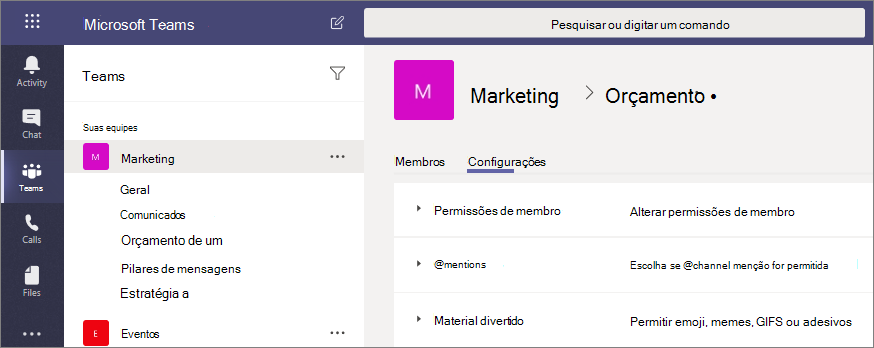

# Canais privados no Microsoft Teams

Os canais privados do Microsoft Teams criam espaços reservado para colaboração com suas equipes. O acesso é restrito aos usuários da equipe que forem proprietários ou membros do canal privado. É possível adicionar qualquer pessoa, inclusive convidados, como membro de um canal privado, desde que já sejam membros da equipe.

Você pode usar o canal privado para limitar a colaboração àqueles que precisam de conhecimento ou se quiser facilitar a comunicação entre um grupo de pessoas atribuídas para um projeto específico, sem ter que criar uma equipe adicional para gerenciar.

Por exemplo, um canal privado é útil nestes cenários:

- Um grupo de pessoas em uma equipe deseja um espaço reservado para colaborar sem precisar criar uma equipe separada.
- Um subconjunto de pessoas em uma equipe deseja um canal privado para discutir informações confidenciais, como orçamentos, recursos, posicionamento estratégico e assim por diante.

Um ícone de cadeado indica um canal particular. Apenas membros de canais particulares podem visualizar e participar de canais particulares aos quais são adicionados.

Quando um canal privado é criado, ele é vinculado à equipe pai e não pode ser movido para uma equipe diferente. Além disso, os canais privados não podem ser convertidos em canais padrão e vice-versa.

## Criação de canal privado

Por padrão, qualquer proprietário ou membro de equipe pode criar um canal privado. Os convidados não podem criá-los. A capacidade de criar canais privados pode ser gerenciada no nível da equipe e da organização. Use [políticas](teams-policies.md) para controlar quais usuários em sua organização podem criar canais privados. Depois de definir as políticas, os proprietários da equipe podem desativar ou ativar a capacidade dos membros de criar canais privados na guia **Configurações** de uma equipe.

A pessoa que cria um canal privado é o proprietário de canal privado e somente o proprietário de canal privado pode adicionar ou remover diretamente as pessoas dele. O proprietário de um canal privado pode adicionar qualquer membro da equipe a um canal privado criado, incluindo convidados. Os membros de um canal privado têm um espaço seguro para conversas e, quando novos membros são adicionados, eles podem ver todas as conversas (mesmo conversas antigas) nesse canal privado.

Os proprietários de equipe podem ver os nomes de todos os canais privados da equipe e também podem excluir qualquer canal privado da equipe. (Um canal privado excluído pode ser restaurado dentro de 30 dias após a exclusão). Os proprietários de equipe não podem ver os arquivos em um canal privado ou as conversas e a lista de membros de um canal privado, a menos que sejam membros desse canal privado.

Os membros da equipe só podem ver canais privados aos quais eles foram adicionados.

## Adicionando e removendo proprietários e membros

O proprietário de um canal privado não pode ser removido pelo cliente do Teams se ele for o último proprietário de um ou mais canais privados.

Se o proprietário de um canal privado sair de sua organização ou se forem removidos do grupo do Microsoft 365 associado à equipe, um membro do canal privado será automaticamente promovido para ser o proprietário do canal privado.

Se um membro da equipe sair ou for removido de uma equipe, esse usuário também deixará ou será removido de todos os canais privados da equipe. Se o usuário for adicionado novamente à equipe, eles devem ser adicionados novamente aos canais privados da equipe.

## Configurações de proprietário do canal

Cada canal privado tem suas próprias configurações que o proprietário do canal pode gerenciar, incluindo a capacidade de adicionar e remover membros, adicionar guias e @mencionar em todo o canal. Essas configurações são independentes das configurações da equipe pai. Quando um canal privado é criado, ele herda as configurações da equipe pai, cujas configurações podem ser alteradas depois independentemente das configurações da equipe pai.

O proprietário do canal privado pode clicar em **Gerenciar canal** e, em seguida, usar as guias **Membros** e **Configurações** para adicionar ou remover membros e editar configurações.

## Ações de proprietário e membro do canal privado

A tabela a seguir descreve quais ações os proprietários, membros e convidados podem fazer em canais privados.

|Ação  |Proprietário de equipe|Membro da equipe|Convidado da equipe|Proprietário do canal privado|Membro do canal privado|Convidado do canal privado|
|---------|---------|---------|---------|---------|---------|---------|
|Criar um canal privado|Controlado pelo administrador|Controlado pelo administrador e proprietário da equipe|Não|Não disponível|Não disponível|Não disponível|
|Excluir canal privado|Sim|Não|Não|Sim|Não|Não|
|Sair do canal privado|Não disponível|Não disponível|Não disponível|Sim, a menos que eles sejam o último proprietário|Sim|Sim|
|Editar canal privado|Não|Não disponível|Não disponível|Sim|Não|Não|
|Restaurar canal privado excluído|Sim|Não|Não|Sim|Não|Não|
|Adicionar membros|Não|Não disponível|Não disponível|Sim|Não|Não|
|Editar configurações|Não|Não disponível|Não disponível|Sim|Não|Não|
|Gerenciar guias e aplicativos|Não|Não disponível|Não disponível|Sim, os aplicativos devem ser instalados para a equipe|Controle de proprietário do canal|Não|

## Sites do SharePoint em canal privado

Cada canal privado tem seu próprio site do SharePoint. O site separado é para garantir que o acesso aos arquivos do canal privado seja restrito apenas aos membros do canal privado. Esses sites são criados com uma biblioteca de documentos por padrão e podem ser facilmente aprimorados para um site completo por meio da [interface de gerenciamento de site](https://support.office.com/article/A2F2A5C2-093D-4897-8B7F-37F86D83DF04). Cada site é criado na mesma região geográfica do site de equipe pai. Esses sites leves têm um ID de modelo personalizado, "TEAMCHANNEL#0" ou "TEAMCHANNEL#1", para facilitar o gerenciamento por meio do PowerShell e da API do Graph. 

> [!NOTE]
> Somente pessoas com permissões de proprietário ou membros do canal terão acesso ao conteúdo no site do canal compartilhado. Os administradores e as pessoas da equipe não terão acesso, a menos que também sejam membros do canal.

Um site de canal privado sincroniza a classificação de dados e herda permissões de acesso de convidado do conjunto do site da equipe pai. A associação do proprietário do site e dos grupos de membros é mantida em sincronia com a associação do canal privado no Teams. As permissões de site para um site de canal privado não podem ser gerenciadas independentemente por meio do Microsoft Office SharePoint Online. 

O Teams gerencia o ciclo de vida do site de canal privado. Se o site for excluído fora do Teams, um trabalho em segundo plano restaurará o site dentro de quatro horas, desde que o canal privado ainda esteja ativo.

Se um canal privado ou uma equipe que contenha um canal privado for restaurado, os sites serão restaurados com ele. Se um site de canal privado for restaurado e estiver passado da janela de exclusão temporária de 30 dias do canal privado, o site funcionará como um site autônomo.

> [!NOTE]
> Quando você cria uma nova equipe ou canal privado no Microsoft Teams, um site de equipe no SharePoint é criado automaticamente. Para editar a descrição ou classificação do site para este site de equipe, acesse as configurações do canal correspondente no [Microsoft Teams](https://support.microsoft.com/office/change-a-team-s-data-security-classification-in-teams-bf39798f-90d2-44fb-a750-55fa05a56f1d).
>
> Saiba mais sobre como gerenciar [Sites de equipes conectadas do Microsoft Teams](/SharePoint/teams-connected-sites).

## Cópias de conformidade de mensagens de canais privados

As cópias de conformidade das mensagens enviadas em um canal privado são entregues na caixa de correio de todos os membros do canal privado, em vez de para uma caixa de correio de grupo. Os títulos das cópias de conformidade são formatados para indicar de qual canal privado foram enviados.

Para obter mais informações sobre como executar uma pesquisa de Descoberta Eletrônica por mensagens de canal privado, consulte [Descoberta Eletrônica de Canal Privado](ediscovery-investigation.md#ediscovery-of-private-channels).

## Considerações sobre acesso ao arquivo em canais privados

Quando um novo bloco de anotações do OneNote é criado em um canal privado, usuários adicionais ainda podem obter acesso ao bloco de anotações porque o comportamento é o mesmo que compartilhar o acesso a qualquer outro item em um site do SharePoint de canal privado com um usuário.

Se um usuário tiver acesso concedido a um bloco de anotações em um canal privado pelo SharePoint, remover o usuário da equipe ou do canal privado não removerá o acesso do usuário ao bloco de anotações.

Se um bloco de anotações existente for adicionado como uma guia a um canal privado, o acesso ao canal privado não será alterado e o bloco de anotações manterá suas permissões existentes.

## Limitações do canal privado

Atualmente, os canais privados oferecem suporte a conectores e guias (exceto Stream, Planner e Forms). Estamos trabalhando no suporte total de aplicativos para canais privados, incluindo extensões de mensagens e bots.

Cada equipe pode ter no máximo 30 canais privados e cada canal privado pode ter no máximo 250 membros. O limite de 30 canais privados é um acréscimo ao limite de 200 canais padrão por equipe. 

Quando você criar uma equipe a partir de uma equipe existente, os canais privados dela não serão copiados.

No momento, as notificações dos canais privados não estão incluídas nos emails de atividades perdidas.

As reuniões do canal não podem ser agendadas.

## Tópicos relacionados

[Visão geral de equipes e canais no Teams](teams-channels-overview.md)

[Visão Geral do PowerShell do Teams](teams-powershell-overview.md)

[Usar a API do Microsoft Graph para trabalhar com o Teams](/graph/api/resources/teams-api-overview)

[Tipo de recurso de canal](/graph/api/resources/channel)
