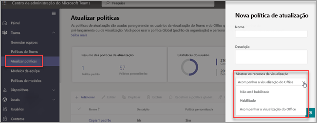

# Visualização Pública do Microsoft Teams

> [!NOTE] 
> Os recursos incluídos na versão prévia podem não estar completos e podem passar por alterações antes de se tornarem disponíveis na versão pública. Eles são fornecidos apenas para fins de avaliação e exploração. Não há suporte para os recursos de visualização na Nuvem da Comunidade do Office 365 Government (GCC).

A Visualização Pública para Microsoft Teams fornece acesso antecipado a recursos não lançados no Teams. As visualizações permitem que você explore e teste os próximos recursos. Também agradecemos comentários sobre qualquer recurso em visualizações públicas. A visualização pública é habilitada por usuário da equipe, então você não precisa se preocupar em afetar toda a sua organização.

Para obter uma lista do que está disponível na visualização pública do Teams, visite [Notas técnicas da Visualização Pública do Microsoft Teams](https://techcommunity.microsoft.com/t5/microsoft-teams-public-preview/bd-p/MicrosoftTeamsPublicPreview), [Notas de Versão do para Recursos de Administração do Teams](/OfficeUpdates/teams-admin)e [Novidades do Teams](https://support.microsoft.com/office/what-s-new-in-microsoft-teams-d7092a6d-c896-424c-b362-a472d5f105de).

## Definir a política de atualização

A visualização pública é habilitada por usuário e a opção de ativar a visualização pública é controlada em uma política de administrador. As políticas de atualização são usadas para gerenciar os usuários de visualização do Teams e do Office que verão os recursos de pré-lançamento ou visualização no aplicativo Teams. Você pode usar a política Global (padrão de toda a organização) e personalizá-la ou criar uma ou mais políticas personalizadas para seus usuários. A política precisa ser atribuída a usuários específicos porque ela não substitui a política global.

1. Entre no Centro de administração.

2. Selecione **Teams** > **Atualizar políticas** e, em seguida, selecione a opção **Atualizar políticas**.

1. Selecione **Adicionar** para criar uma nova política ou selecione uma política existente para abrir **Atualizar política**.

2. Nomeie a política de atualização, adicione uma descrição e selecione a configuração **Mostrar recursos de visualização**.

   -   **Seguir o Office Preview** (padrão): Essa nova opção padrão habilitará automaticamente os recursos de Visualização Pública do Teams para qualquer usuário registrado no Canal Atual do Office (Pré-visualização). Não há mais ações necessárias para o usuário final.
   -   **Habilitado**: Essa opção habilita a Visualização Pública do Teams, independentemente de um usuário estar registrado no Canal Atual do Office (Pré-visualização). O usuário final também deve optar pela visualização pública do Teams no aplicativo Teams.

   > [!NOTE]  
   > Para usuários existentes na Visualização Pública do Teams que NÃO estão no **Canal Atual (Pré-visualização)**, os administradores de TI precisam mudar do padrão **Seguir o Office Preview** para **Habilitado**.
 
   - **Não habilitado**: Os recursos da Visualização Pública do Teams não estarão disponíveis para os usuários finais.

      

Você também pode definir a política usando o cmdlet `Set-CsTeamsUpdateManagementPolicy` PowerShell com o parâmetro `-AllowPublicPreview`.

> [!NOTE]   
> O parâmetro AllowPreview será preterido em breve.

## Habilitar visualização pública

Para habilitar a visualização pública em uma área de trabalho ou cliente Web, você precisa concluir as seguintes tarefas:

1. Selecione os três pontos à esquerda do seu perfil para exibir o menu Teams.
2. Selecione **Sobre** > **Visualização pública**.
3. Selecione **Alternar para Visualização pública**.

> [!NOTE]  
> Essa opção só está disponível quando **Exibir recursos de pré-visualização** está definido como **Habilitado**.

## O Teams agora segue os usuários do Office Preview

O novo padrão de política global do **Seguir o Office Preview** permitirá que os usuários estejam automaticamente no canal de Visualização Pública do Teams se estiverem no Canal Atual (Pré-visualização) para o Cliente do Office 365 no Windows.

Microsoft Office continuará a receber atualizações do Canal Atual (Pré-visualização) e o cliente do Teams receberá atualizações por meio do canal de Visualização Pública. Esta política NÃO alternará os canais do Office com base nos canais do Teams. 

**Como manter seus usuários de visualização existentes do Teams que NÃO estão usando o Canal Atual do Office (Pré-visualização)?**

Para usuários existentes que você tem permissão para aceitar ou recusar a Visualização Pública do Teams e deseja manter essa configuração em seu formato atual, você precisará mudar do novo padrão **Seguir o Office Preview** para **Habilitado** (Consulte [Definir a política de atualização](#set-the-update-policy))

**Como recusar essa configuração?**

Você pode desabilitar a configuração do Centro de Administração do Teams de **Seguir o Office Preview** para **Não Habilitado** (Consulte [Definir a política de atualização](#set-the-update-policy))

## Problemas Conhecidos

Os usuários do Canal Atual do Office (Pré-visualização) podem sair da Visualização Pública do Teams por meio do menu Sobre do Teams enquanto sua política de atualização está definida como **Seguir o Office Preview**. Essa funcionalidade não é pretendida e será removida no futuro. O cliente do Teams pode se definir automaticamente como Visualização Pública quando o dispositivo estiver ocioso na próxima vez se o usuário estiver no Canal Atual (Pré-visualização) do Office.

## Tópicos relacionados

[Pré-visualização do desenvolvedor público](/microsoftteams/platform/resources/dev-preview/developer-preview-intro)
