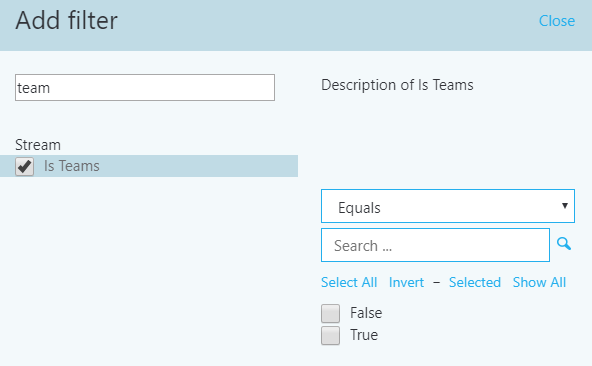

#  <a name="use-cqd-to-manage-call-and-meeting-quality-in-microsoft-teams"></a>Use o CQD para gerenciar a qualidade de chamada e reunião no Microsoft Teams 

Este artigo ajudará você - o administrador do Teams ou suporte e engenheiro técnico - a desenvolver um processo de monitoramento e manutenção da qualidade de chamada e reunião para sua organização usando o CQD (Painel de Qualidade de Chamada) de Microsoft Teams. Nossas diretrizes enfatizam cenários de qualidade de áudio porque quaisquer melhorias de rede feitas para melhorar a experiência de áudio serão traduzidas para melhorias em vídeo e compartilhamento.

A chave para essa orientação são os dois modelos [de CQD](https://aka.ms/QERtemplates) com cura - recomendamos baixá-los antes de passar pelas orientações neste artigo.

Este artigo supõe que você já [tenha configurar o CQD](turning-on-and-using-call-quality-dashboard.md).


## <a name="categories-to-monitor-and-maintain"></a>Categorias a ser monitoradas e mantidas

Depois de ter lançado reuniões e voz no Teams, você precisará de um plano para monitoramento e manutenção contínuos. Isso garantirá que o Teams está sempre em execução ideal. Este plano deve incluir as principais áreas listadas abaixo. Você também deve estabelecer metas para métricas de qualidade e um plano para solucionar problemas e isolar problemas quando eles acontecerem.

<table>
<thead>
<tr class="header">
<th>Categoria</th>
<th>Descrição</th>
</tr>
</thead>
<tbody>
<tr class="odd">
<td><strong>Qualidade da chamada</strong></td>
<td>
<p>Quebrar as métricas por chamadas internas (dentro da sua organização, como VPN, WiFi, com fio) ou chamadas externas</p>
<p>Quebrar as métricas criando ou rede</p>
<p>Chamadas VPN</p>
<p>Chamadas usando TCP, UDP ou proxy</p>
</td>
</tr>
<tr class="even">
<td><strong>Confiabilidade de chamada</strong></td>
<td><p>Identificar e resolver problemas de rede ou firewall</p>
<p>Obtenha informações sobre as porcentagens de falhas de configuração e de entrega de chamada</p>
<p>Saiba onde ocorrem a maioria das falhas de configuração e soltar de chamada</p>
</td>
</tr>
<tr class="odd">
<td><strong>Pesquisa de usuário</strong></td>
<td>
<p>Usar dados de Rate My Call para saber mais sobre a experiência real dos usuários</p>
<p>Onde estão ocorrendo as experiências ruins?</p>
<p>Correlacionar a experiência ruim com a qualidade, confiabilidade e dispositivos de chamada</p>
</td>
</tr>
<tr class="even">
<td><strong>Dispositivos</strong></td>
<td><p>Saiba quais microfones e alto-falantes são mais usados e seu impacto na qualidade da chamada</p>
<p>Os drivers de áudio, vídeo, USB e WiFi de suporte estão sendo regularmente remendados?</p>
</td>
</tr>
<tr class="odd">
<td><strong>Clientes</strong></td>
<td>
<p>Saiba quais tipos de cliente e versões estão sendo usados e seu impacto na qualidade e confiabilidade das chamada  </p>
</ol></td>
</tr>
</tbody>
</table>

Ao avaliar continuamente e remediar as áreas descritas neste artigo, você pode reduzir o potencial deles para afetar negativamente seus usuários. A maioria dos problemas do usuário pode ser agrupada nas seguintes categorias:

-   Configuração incompleta do firewall ou proxy
-   Cobertura insatisfatória da rede Wi-Fi
-   Largura de banda insuficiente
-   VPN
-   Versões e drivers de cliente inconsistentes ou desatualizados
-   Dispositivos de áudio não desenvolvidos ou integrados
-   Dispositivos de rede ou sub-redes com problemas

Por meio do planejamento e do design apropriados antes de implantar o Teams ou Skype for Business Online, você pode reduzir a quantidade de esforço que será necessária para manter experiências de alta qualidade.

Este artigo se concentra no uso do Painel de Qualidade de Chamada (CQD) Online como a principal ferramenta para relatar e investigar cada área, com ênfase especial no áudio para maximizar a adoção e o impacto. Quaisquer melhorias feitas na rede para melhorar a experiência de áudio também se traduzirão diretamente em melhorias no compartilhamento de vídeo e área de trabalho.

Para acelerar sua avaliação, dois modelos [de CQD](https://aka.ms/qertemplates) com cura são fornecidos: um é para gerenciar todas as redes e o outro é filtrado apenas para redes gerenciadas (internas). Embora os relatórios de modelo de Todas as Redes sejam configurados para exibir informações de construção e rede, eles ainda podem ser usados enquanto você trabalha para coletar e carregar informações de construção. Carregar informações de construção no CQD permite que o serviço aprimora o relatório adicionando informações personalizadas de construção, rede e local ao mesmo tempo que diferencia as sub-redes internas das sub-redes externas. Para obter mais informações, leia [Mapeamento de construção](CQD-building-mapping.md).

### <a name="intended-audience"></a>Público-alvo pretendido

Este artigo destina-se a ser usado por partes interessadas do parceiro e do cliente com funções como Líder de Colaboração/Arquiteto, Consultor, Especialista em Gerenciamento de Alterações/Adoção, Líder de Suporte/Help Desk, Líder de Rede, Líder de Área de Trabalho e Administrador de TI.

Este artigo também se destina a ser usado pelos defensores de qualidade designados. Para obter mais informações, consulte [a função Defensor da Qualidade](4-envision-plan-my-service-management.md#the-quality-champion-role).


## <a name="what-is-quality"></a>O que é qualidade?

Nesse contexto, a qualidade é uma combinação de métricas de serviço e experiência do usuário.


### <a name="service-metrics"></a>Métricas de serviço

As métricas de serviço consistem em métricas específicas baseadas no cliente. Durante cada chamada, o cliente coleta telemetria para a chamada e envia um relatório no final de cada chamada que pode ser acessada posteriormente no CQD ou na análise de chamada por [usuário.](set-up-call-analytics.md) Essas métricas incluem (mas não estão limitadas a):

-   Fluxo Ruim (entrada e saída)
-   Taxa de Falha de Instalação
-   Taxa de falha de soltar


#### <a name="poor-stream-rate"></a>Taxa de fluxo ruim

A taxa de fluxo ruim (PSR) representa a porcentagem geral de fluxos da organização com baixa qualidade. Essa métrica deve destacar áreas onde sua organização pode concentrar esforços para ter o impacto [](#managed-versus-unmanaged-networks) mais forte na redução desse valor e melhorar a experiência do usuário, por isso as redes gerenciadas são o foco principal ao se olhar para o PSR. Os usuários externos também são importantes, mas a investigação difere em uma base organizacional. Considere fornecer práticas recomendadas para usuários externos e investigar chamadas externas independentemente da organização geral.

A medida real no CQD varia de acordo com a carga de trabalho, mas, para os fins deste artigo, nos concentramos principalmente na medida _de Porcentagem_ Ruim de Áudio. A PSR é feita das cinco médias métricas de rede descritas na tabela a seguir. Para que um fluxo seja classificado como ruim, apenas uma métrica precisa exceder o limite definido. O CQD fornece o "Poor Due To..." para entender melhor qual condição fez com que o fluxo fosse classificado como ruim. Para saber mais, leia [Classificação de fluxo no CQD](stream-classification-in-call-quality-dashboard.md).

> [!Note]
> O CQD fornece o "Ruim devido a..." para entender melhor qual condição fez com que o fluxo fosse classificado como ruim.


##### <a name="audio-poor-quality-metrics"></a>Métricas de qualidade ruim de áudio

| Média métrica     | Descrição     | Experiência de usuário |
|-------------|-----------------|-----------------|
| Tremidos \> 30 ms        | Essa é a alteração média de atraso entre pacotes sucessivos. Teams e Skype for Business podem se adaptar a alguns níveis de tremedeira por meio do buffer. É somente quando a tremedeira excede o buffer que um participante nota os efeitos da tremedeira.      | Os pacotes que chegam em velocidades diferentes causam a voz de um alto-falante a parecer robótico.   |
| Taxa de perda \> de pacotes 10% ou 0,1        | Isso é geralmente definido como uma porcentagem de pacotes perdidos. A perda de pacotes afeta diretamente a qualidade do áudio— de pacotes perdidos pequenos e individuais que quase não têm impacto nas perdas de estouro back-to-back que causam o corte total do áudio.     | Os pacotes que estão sendo descartados e não chegam ao destino pretendido causam lacunas na mídia, resultando em sílabas e palavras perdidas e vídeos e compartilhamentos insossos. |
| Tempo de ida e volta \> 500 ms        | Este é o tempo necessário para obter um pacote IP do ponto A ao ponto B e de volta ao ponto A. Esse atraso de propagação de rede está vinculado à distância física entre os dois pontos e a velocidade da luz e inclui sobrecarga adicional tomada pelos vários dispositivos no caminho da rede.      | Os pacotes demorando muito para chegar ao destino causam um efeito walkie-talkie.   |
| Média de degradação de NMOS \> 1,0         | Degradação média de pontuação [de opinião de rede (NMOS)](/previous-versions/office/communications-server/bb894481(v=office.12)#network-mos) para o fluxo. Representa o quanto a perda de rede e o tremecimento afetaram a qualidade do áudio recebido que fez com que o NMOS baixava em mais de um ponto. | Essa é uma combinação de tremeamento, perda de pacotes e, em menor grau, maior tempo de ida e volta. O usuário pode estar experimentando uma combinação desses sintomas.   |
| Taxa média de amostras ocultas \> 7% ou 0,07 | Taxa média do número de quadros de áudio com amostras ocultas geradas pela recuperação de perda de pacotes para o número total de quadros de áudio. Um exemplo de áudio oculto é uma técnica usada para suavizar a transição abrupta que normalmente seria causada por pacotes de rede descartados.      | Valores altos indicam que níveis significativos de ocultação de perda foram aplicados e resultaram em distorção ou perda de áudio.     |

##### <a name="why-do-we-prefer-to-use-streams-instead-of-calls"></a>Por que preferimos usar fluxos em vez de chamadas?

Fluxos nos avise qual trecho específico da chamada foi ruim - saída ou entrada. Quando você estiver analisando a análise de chamada para uma chamada ruim, determine se a chamada ruim foi devido ao fluxo (de saída) ou ao fluxo do chamador (entrada). Determinar qual fluxo está afetando a qualidade da chamada é ainda mais importante para conferências. Se você estiver olhando apenas para dados de chamada, verá quantas conferências uma pessoa participa, mas não verá quais pessoas são falantes ativas, fazendo a maior parte do compartilhamento de tela.

Os dados de chamada proporcionam métricas de uso, mas isso não o levará necessariamente à causa raiz da qualidade de chamada ruim. Ao olhar para a direção do fluxo, você pode identificar fatores como uma chamada que não está em uma rede gerenciada, uma chamada de um não funcionário (por exemplo, um fornecedor ou alguém em uma rede diferente). Nesses casos, se a conexão de rede de outra pessoa for ruim, a chamada inteira será sinalizada como ruim. Você não pode fazer nada sobre fatores externos, portanto, esses dados não são úteis.

A direção do fluxo também pode ajudá-lo a identificar dispositivos ou clientes problemáticos.

 - Por exemplo, se você tiver um orçamento limitado para dispositivos e quiser fornecer dispositivos apenas para usuários de áudio pesado, use o relatório de uso de áudio (VoIP) e filtre para fluxos de saída e conferência. Procure usuários de áudio de alto volume que estão falando em microfones integrados - eles podem se correlacionar com a qualidade de chamada mais baixa (e talvez você queira fornecer dispositivos de áudio para essas pessoas). Para maior clareza, você pode filtrar a utilização de pacotes, o que permitirá direcionar especialmente usuários de áudio de alto volume. 

  - Outro exemplo envolve o compartilhamento de tela. Se um cliente estiver usando um cliente Teams, o desempenho do compartilhamento de tela poderá ser afetado. Você pode resolver esse problema priorizando as atualizações do cliente para pessoas que fazem muito compartilhamento de tela.

 - Ao identificar qual direção de um fluxo está causando uma qualidade de chamada ruim, você pode determinar se você tem um problema de QoS ou de largura de banda. Se você ainda não implementou totalmente a QoS ou se você marcar apenas pacotes no cliente e não no fluxo de entrada, poderá ver uma qualidade de chamada mais baixa. Ao olhar para a direção do fluxo, você pode obter uma exibição mais granular de perda de pacotes, latência ou tremida em uma direção específica. 

   - Por exemplo, digamos que um usuário reclama de áudio robótico enquanto está em uma conexão com fio (tremida). Ao ver o fluxo e a direção, você pode determinar que o problema acontece no fluxo de entrada, apenas para um conjunto específico de sub-redes. Depois de dar essas informações à sua equipe de rede, eles podem rastreá-los para um acelerador WAN mal configurado que não estava ignorando o tráfego de mídia. Depois que a equipe de rede reconfigura o acelerador WAN, a treme desaparece e a qualidade da chamada melhora. 


#### <a name="setup-failure-rate"></a>Taxa de Falha de Instalação

A taxa de falha de instalação, também conhecida como a medida Porcentagem de Falha de Instalação de Chamada _Total_ no CQD, é o número de fluxos em que o caminho de mídia não pôde ser estabelecido entre os pontos de extremidade no início da chamada.

Isso representa qualquer fluxo de mídia que não pôde ser estabelecido. Dada a gravidade do impacto desse problema na experiência do usuário, o objetivo é reduzir esse valor para o mais próximo de zero possível. Um alto valor para essa métrica é mais comum em novas implantações com regras de firewall incompletas do que uma implantação mais avançada, mas ainda é importante observar regularmente.

Essa métrica é calculada pela tomada do número total de fluxos que não foram definidos divididos pelo número total de fluxos que enviou um cdr (registro de detalhes de chamada) bem-sucedido:

-   **Taxa de Falha de Instalação** = Contagem total de fluxo de chamada com falha na instalação / Contagem total de fluxos de CDR disponíveis

#### <a name="drop-failure-rate"></a>Taxa de falha de soltar

A taxa de falha de drop, também conhecida como a medida _Porcentagem_ de Falha Total de Falha de Chamada no CQD, é a porcentagem de fluxos estabelecidos com êxito em que o caminho de mídia não terminou normalmente.

Isso representa qualquer fluxo de mídia encerrado inesperadamente. Embora o impacto disso não seja tão grave quanto um fluxo que falhou na configuração, ele ainda afeta negativamente a experiência do usuário. Gotas de mídia repentinas e frequentes não só podem ter um impacto grave na experiência do usuário, como resultam na necessidade dos usuários se reconectar, resultando em perda de produtividade (sem mencionar frustração).

A métrica é calculada pela tomada do número total de fluxos descartados divididos pela contagem total de fluxos que configuram com êxito:

-   **Taxa de Falha de Soltar** = Contagem total de fluxo de chamada /Total de Configuração de Chamada Com êxito

### <a name="define-your-target-metrics"></a>Definir suas métricas de destino

Esta seção discute algumas das principais métricas de serviço que usamos para avaliar a saúde dos serviços. Ao avaliar continuamente e impulsionar os esforços para manter essas métricas abaixo de suas metas definidas, você ajudará a garantir que seus usuários experimentem uma qualidade de chamada consistente e confiável. Como ponto de partida, use os destinos sugeridos na tabela abaixo. Ajuste as metas conforme necessário para atender aos seus objetivos de negócios.

<table>
<tr>
<th rowspan="2" colspan="2" valign="center">Tipo de rede</th><th rowspan="1">Destinos de qualidade</th><th colspan="2">Destinos de confiabilidade</th></tr>
<tr><th>Taxa de fluxo de áudio ruim</th><th>Taxa de Falha de Instalação</th><th>Taxa de falha de soltar</th></tr>
<tr><td rowspan="2"><strong>All</strong></td><td>Interno</td><td>2.0%</td><td>0.5%</td><td>2.0%</td></tr>
<tr><td>Geral</td><td>3.0%</td><td>1.0%</td><td>3.0%</td></tr>
<tr><td rowspan="5"><strong>Conferências</strong></td><td>Interno</td><td>2.0%</td><td>0.5%</td><td>2.0%</td></tr>
<tr><td>Interna com fio</td><td>1.0%</td><td>0.5%</td><td>1.0%</td></tr>
<tr><td>Wi-Fi 5 GHz interno</td><td>1.0%</td><td>0.5%</td><td>1.0%</td></tr>
<tr><td>Wi-Fi 2,4 GHz internos</td><td>2.0%</td><td>0.5%</td><td>2.0%</td></tr>
<tr><td>Geral</td><td>2.0%</td><td>0.5%</td><td>3.0%</td></tr>
<tr><td rowspan="4"><strong>P2P</strong></td><td>Interno</td><td>2.0%</td><td>0.5%</td><td>2.0%</td></tr>
<tr><td>Com fio/Wi-Fi 5 GHz interno</td><td>1.0%</td><td>0.5%</td><td>1.0%</td></tr>
<tr><td>Fio/Wi-Fi 5 GHz no geral</td><td>2.0%</td><td>1.0%</td><td>1.0%</td></tr>
<tr><td>Geral</td><td>2.0%</td><td>1.0%</td><td>3.0%</td></tr>
</table>

### <a name="user-experience"></a>Experiência de usuário

Analisar a experiência do usuário é mais arte do que ciência, pois as métricas coletadas aqui nem sempre significam que há um problema com a rede ou o serviço, mas, em vez disso, eles simplesmente indicam que o usuário percebe um problema. O CQD inclui um mecanismo de pesquisa interna — Rate My Call (RMC) — para ajudar a avaliar a experiência geral do usuário. O RMC dará uma visão das seguintes perguntas da perspectiva dos usuários:

-   Eu sei como usar a solução?
-   A solução é fácil de usar e intuitiva e dá suporte às minhas necessidades de comunicação diárias?
-   A solução me ajuda a fazer meu trabalho?
-   Qual é a minha percepção geral da solução?
-   Posso usar a solução a qualquer momento, independentemente de onde estou?
-   Posso configurar e manter uma chamada?

#### <a name="rate-my-call"></a>Rate My Call 

Rate My Call (RMC) é integrado Teams e Skype for Business. Ele aparece automaticamente após uma em cada 10 chamadas ou 10%. Esta breve pesquisa pede ao usuário para taxar a chamada e fornecer um pouco de contexto para o motivo pelo qual a qualidade da chamada pode ter sido ruim. Uma ou duas classificações é considerada ruim, três a quatro é boa e cinco é excelente. Embora seja um indicador de atraso, essa é uma métrica útil para descobrir problemas que as métricas de serviço podem perder.

> [!Note]
> O fator humano: os usuários geralmente ignoram a pesquisa quando a qualidade da chamada é boa e a preenchem quando a qualidade da chamada é ruim. Como resultado, seus relatórios RMC podem ser distorcedos para o lado ruim, mesmo enquanto as métricas de serviço são boas.

Você pode usar o CQD para relatar as respostas do usuário RMC e os relatórios de exemplo são incluídos no modelo CQD. No entanto, eles não são discutidos em detalhes neste artigo. 

#### <a name="client-and-device-readiness"></a>Preparação de cliente e dispositivo

Você precisa de uma estratégia sólida de cliente e dispositivo para ajudar a garantir que seus usuários tenham uma experiência de usuário consistente e positiva. Alguns princípios-chave impulsionam cada estratégia de preparação.

##### <a name="client-readiness"></a>Preparação do cliente

Manter o Teams cliente atualizado garante que os usuários sempre estão tendo a melhor experiência possível. A Microsoft libera atualizações frequentes para o cliente Teams [(a](teams-client-update.md) atualização se instala em segundo plano, a menos que você tenha desligado essa funcionalidade - o que não recomendamos). Também é importante lembrar de corrigir drivers de rede, vídeo, USB e áudio, pois eles geralmente são ignorados e podem afetar a qualidade de chamada e reunião. Considere adicionar drivers de rede, Wi-Fi, vídeo, USB e áudio ao processo de gerenciamento de patch atual.


##### <a name="device-readiness"></a>Preparação do dispositivo

Nenhuma estratégia única pode afetar a experiência do usuário mais do que a estratégia de preparação do dispositivo. Por exemplo, os usuários que dependem de seus alto-falantes de laptop e microfone experimentarão muito ruído em segundo plano em chamadas e reuniões. Teams é projetado para funcionar com praticamente qualquer dispositivo, mas se você estiver tendo problemas relacionados ao [dispositivo,](./devices/phones-for-teams.md)confira Telefone para Teams .


### <a name="categories-of-quality"></a>Categorias de qualidade

Operacionalize um conjunto de práticas de gerenciamento de qualidade - isso oferece a melhor chance de boa qualidade de chamada e reunião. Um plano de gerenciamento de boa qualidade aborda essas categorias:

-   **Rede:** Qualidade de áudio focada na métrica PSR (Taxa de Fluxo Ruim), uso de TCP, sub-redes com fio e sem fio e identificação do uso de proxies HTTP e VPN

-   **Pontos de extremidade:** Dispositivos de áudio e clientes atualizados

-   **Gerenciamento de serviço:** Esta categoria compreende duas seções:

    -   Primeiro, é responsabilidade da Microsoft gerenciar e manter os serviços Teams e Skype for Business Online.

    -   Em segundo lugar estão as tarefas que sua organização gerencia para garantir acesso confiável ao serviço, como atualizar informações de construção e manter firewalls para novos endereços IP Office 365 como a infraestrutura é adicionada ao serviço.


Revise a lista a seguir das tarefas recomendadas para manter a qualidade. Você deve executar essas tarefas regularmente - por exemplo, semanalmente.

#### <a name="service-management-tasks"></a>Tarefas de gerenciamento de serviço

Essas tarefas vão desde garantir que haja largura de banda suficiente para alcançar o serviço sem saturar links de internet, validar que a qualidade do serviço (QoS) está em todas as áreas de rede gerenciadas e ficar na parte superior de intervalos IP Office 365 em [firewalls.](/microsoft-365/enterprise/urls-and-ip-address-ranges)

#### <a name="network-tasks"></a>Tarefas de rede

Há duas categorias de tarefas de rede: confiabilidade e qualidade. A confiabilidade se concentra em medir a capacidade do usuário de fazer chamadas com êxito e permanecer conectado. A qualidade se concentra na telemetria agregada enviada ao Teams e Skype for Business Online pelo cliente do usuário durante a chamada e depois que ela terminar. 

Dado o impacto crítico que a confiabilidade tem na experiência do usuário, recomendamos que você avalie e investigue as métricas de confiabilidade antes de mergulhar na qualidade. 

#### <a name="endpoints-tasks"></a>Tarefas de pontos de extremidade

A tarefa principal nesta categoria removendo quaisquer obstáculos para as atualizações [Teams cliente](teams-client-update.md)regulares. Por padrão, Teams atualiza automaticamente regularmente (a menos que você desligue essa configuração, o que não recomendamos). 

Você também deve monitorar dispositivos e fornecer atualizações sempre que identificar problemas relacionados a um dispositivo.

## <a name="use-cqd-to-manage-call-quality"></a>Usar o CQD para gerenciar a qualidade da chamada

Depois de configurar [o CQD,](turning-on-and-using-call-quality-dashboard.md)você estará pronto para começar a usá-lo para gerenciar a qualidade de chamada e reunião da sua organização.

A maioria dos problemas Teams desempenho se enquadram nas seguintes categorias:

-   Configuração incompleta do firewall ou proxy
-   Cobertura insatisfatória da rede Wi-Fi
-   Largura de banda insuficiente
-   VPN
-   Versões e drivers de cliente inconsistentes ou desatualizados
-   Dispositivos de áudio não desenvolvidos ou integrados
-   Dispositivos de rede ou sub-redes com problemas

Se você aproveitar o tempo antes de Teams para avaliar essas áreas e remediar quaisquer deficiências, reduzirá a quantidade de esforço necessária para manter uma experiência de Teams de alta qualidade para todos os usuários. Para ajudar a avaliar sua rede em preparação para sua distribuição Teams, leia [Advisor for Teams](use-advisor-teams-roll-out.md) e Prepare your network for [Teams](prepare-network.md).

### <a name="expectations-using-cqd"></a>Expectativas usando o CQD

Use o Painel de Qualidade de Chamadas (CQD) para obter informações sobre a qualidade das chamadas feitas usando Teams e Skype for Business serviços. O CQD foi projetado para ajudar Teams e Skype for Business administradores e engenheiros de rede otimizar a rede e manter um olho atento à qualidade, confiabilidade e à experiência do usuário. O CQD analisa a telemetria agregada para uma organização inteira, onde os padrões gerais podem se tornar aparentes; isso permite que você faça avaliações informadas e planeje a correção. O CQD fornece relatórios de métricas que fornecem informações gerais sobre qualidade, confiabilidade e experiência do usuário.

O CQD, embora útil para analisar tendências e sub-redes, nem sempre fornece uma causa específica para um determinado cenário. É importante entender isso e definir a expectativa correta ao usar o CQD:

-   O CQD não fornecerá a causa raiz para cada cenário
-   O CQD não conterá Sistema de Telefonia ou fluxos de Audioconferência
-   O CQD chamará áreas para investigação posterior com base nas tendências

### <a name="cqd-reports-overview"></a>Visão geral dos relatórios do CQD

Use o menu suspenso na parte superior da tela para abrir um relatório. Para uma lista dos dados fornecidos em cada relatório, leia [Dados disponíveis em relatórios CQD.](CQD-data-and-reports.md#data-available-in-cqd-reports)

Novidade em janeiro de 2020: [Baixar Power BI de consulta para CQD](https://github.com/MicrosoftDocs/OfficeDocs-SkypeForBusiness/blob/live/Teams/downloads/CQD-Power-BI-query-templates.zip?raw=true). Modelos de Power BI personalizáveis que você pode usar para analisar e relatar seus dados CQD.


### <a name="teams-vs-skype-for-business"></a>Teams vs. Skype for Business

O CQD pode relatar Teams e Skype for Business. No entanto, pode haver momentos em que você deseja desenvolver um relatório para ver Teams telemetria separada de Skype for Business.

#### <a name="summary-reports"></a>Relatórios de resumo

Para modificar a página de relatórios de resumo Teams ou Skype for Business, selecione o menu suspenso Filtro de Produto na parte superior da tela e selecione o produto que deseja. 


#### <a name="detailed-reports"></a>Relatórios detalhados

Para filtrar todos os relatórios detalhados, na barra de navegador, anexar o seguinte ao final da URL:

```PowerShell
/filter/[AllStreams].[Is Teams]|[FALSE]
```

**Exemplo:**

```https://cqd.teams.microsoft.com/cqd/#/1234567/2018-5/filter/[AllStreams].[Is Teams]|[FALSE]```

Para obter mais informações sobre filtros de URL, leia [Relatórios de filtragem posteriormente](CQD-data-and-reports.md#report-filters) nesta seção.

Para filtrar um relatório detalhado individual, adicione o filtro ao ``Is Teams`` relatório e de defini-lo como True ou False.



### <a name="managed-versus-unmanaged-networks"></a>Redes gerenciadas versus não gerenciadas

Por padrão, todos os pontos de extremidade no CQD são classificados como externos. Assim que um arquivo de construção for introduzido, podemos começar a procurar dados de ponto de extremidade gerenciados. Conforme discutido anteriormente, as redes no CQD são definidas como:

-   Uma _rede gerenciada_, geralmente conhecida como interna ou interna, pode ser influenciada e controlada pela organização. Isso inclui a LAN interna, a WAN remota e a VPN.
-   Uma _rede não controlada_, geralmente conhecida como externa ou externa, não pode ser influenciada ou controlada pela organização. Um exemplo de uma rede sem gestão é uma rede de hotel ou aeroporto.

### <a name="dimensions-measures-and-filters"></a>Dimensões, medidas e filtros

Uma consulta CQD bem formada contém todos os três dos seguintes parâmetros:

-   **Dimensão:** Como quero girar os dados.

-   **Medida:** Sobre o que quero relatar.

-   **Filtro:** Como quero reduzir o conjuntos de dados que a consulta retorna.

Outra maneira de ver isso é que uma dimensão  é _a_ função de agrupação,  uma medida é os dados em que estou interessado e um filtro é como eu quero restringir os resultados àqueles que são relevantes para minha consulta.

Um exemplo de uma consulta bem formada é **Show me Poor Fluxos [Measure] by Subnet [Dimension] for Building 6 [Filter]**. Para obter mais informações, [consulte Dimensões e medidas disponíveis no CQD](./dimensions-and-measures-available-in-call-quality-dashboard.md).

### <a name="first-vs-second"></a>Primeiro vs. segundo 

Muitas das dimensões e medidas no CQD são classificadas como primeira ou segunda. O CQD não usa campos chamador/chamador—  eles  foram renomeados primeiro e segundo porque há etapas intervenindo entre o chamador e o chamador. A lógica a seguir determina qual ponto de extremidade envolvido é rotulado como primeiro:

-   **Primeiro** sempre será um ponto de extremidade de servidor (Servidor de Conferência, Servidor de Mediação e assim por diante) se um servidor estiver envolvido no fluxo ou chamada.

-   **O** segundo sempre será um ponto de extremidade do cliente, a menos que o fluxo esteja entre dois pontos de extremidade do servidor.

-   Se ambos os pontos de extremidade são do mesmo tipo, a escolha dos quais é primeiro se baseia na ordenação interna da categoria do agente do usuário. Isso garante que a ordenação seja consistente.

Para obter mais informações sobre como determinar o primeiro ou segundo ponto de extremidade quando ambos são iguais, consulte Dimensões e medidas disponíveis [no CQD](./dimensions-and-measures-available-in-call-quality-dashboard.md).

### <a name="stream-vs-call"></a>Stream vs. call

Você precisa entender a diferença entre uma chamada e um fluxo para escolher corretamente quais dimensões ou medidas você verá no CQD. Embora o foco principal do CQD seja em fluxos, as medidas baseadas em chamada também estão disponíveis.

-   **Stream:** Existe _um fluxo_ entre apenas dois pontos de extremidade. Há apenas um fluxo para cada direção, e dois fluxos são necessários para comunicação. Fluxos são úteis para investigar edifícios, redes ou sub-redes. Em alguns casos, tanto a chamada quanto o fluxo são usados no nome da medida (por exemplo, Fluxo de Instalação de Chamada ou Fluxo de Chamada Descartado). Eles ainda são classificados como fluxos.

-   **Chamada:** Uma _chamada_ é um grupo de todos os fluxos de todos os participantes. Uma chamada consiste em, no mínimo, dois fluxos. Uma única chamada terá pelo menos dois pontos de extremidade, cada um com um fluxo mínimo.

Para obter orientações adicionais sobre se a dimensão ou medida está se referindo a uma chamada ou a um fluxo, consulte Dimensões e [medidas disponíveis no CQD](./dimensions-and-measures-available-in-call-quality-dashboard.md)

### <a name="good-poor-and-unclassified-calls"></a>Chamadas boas, ruins e não classificadas

Uma chamada é categorizada como boa, ruim ou não classificada. Vamos aproveitar um momento para falar sobre cada uma delas com mais detalhes.

-   **Bom ou ruim:** Uma chamada boa ou ruim consiste em uma chamada que contém um conjunto completo de métricas de serviço, para a qual um relatório de QoE completo foi gerado e recebido pelo serviço. Determinar se um fluxo é bom ou ruim é descrito [anteriormente neste artigo](#poor-stream-rate).

-   **Não classificado:** Um fluxo não classificado não contém um conjunto completo de métricas de serviço. Essas chamadas podem ser curtas, geralmente com menos de 60 segundos, onde as médias não puderam ser calculadas e um relatório de QoE não foi gerado. O motivo mais comum para chamadas não classificadas é que houve pouco ou nenhum uso de pacote. Um exemplo disso seria um participante que participa de uma reunião em mudo e nunca fala. O participante está recebendo, mas não transmitindo, mídia. Sem a transmissão de mídia, não haverá nenhuma métrica disponível para o CQD usar para classificar o fluxo de mídia de saída do ponto de extremidade.

Para saber mais, leia [Classificação de fluxo no CQD](stream-classification-in-call-quality-dashboard.md).

### <a name="common-subnets"></a>Sub-redes comuns

Sub-redes comuns são sub-redes privadas específicas que são usadas por hoteis, redes internas, hotspots e áreas semelhantes. Essas sub-redes são difíceis de triagem devido ao uso generalizado. Se sua organização usa uma dessas sub-redes comuns, recomendamos que você mova essa rede para outra sub-rede. Isso facilitará o relatório no CQD. Quando notados, os relatórios no modelo Todas as Redes foram configurados para excluir essas sub-redes para eliminá-las como uma fonte de baixa qualidade. Sub-redes comuns são definidas abaixo; seu impacto variará de acordo com a organização.

-   10.0.0.0/24
-   192.168.0.0/24
-   192.168.1.0/24
-   192.168.2.0/24
-   172.20.10.0/24
-   192.168.43.0/24

Ao investigar uma rede gerenciada que usa uma sub-rede comum, você precisará usar a segunda dimensão ip local reflexiva para agrupar sub-redes. Essa dimensão contém o endereço IP público do ponto de extremidade.


## <a name="reliability-investigations"></a>Investigações de confiabilidade

A primeira etapa para melhorar a qualidade é avaliar o estado de confiabilidade em toda a organização. Como a confiabilidade é essencial para uma experiência de usuário positiva, começamos com os dois componentes que medem a confiabilidade:

1.  **Falhas de instalação:** A chamada não pôde ser estabelecida.

2.  **Falhas de soltar:** A chamada foi estabelecida e encerrada inesperadamente.

Ao longo desta seção, vamos abranger métodos para investigar ambas as áreas.

> [!NOTE]
> Nem todos os relatórios incluídos nos modelos são abordados neste artigo. No entanto, os métodos de investigação explicados a seguir ainda se aplicam. Consulte a descrição do relatório individual para obter mais informações.


### <a name="setup-failures"></a>Falhas de instalação

Priorize a correção de falhas de configuração nessa área primeiro, pois essas falhas têm um impacto negativo significativo na experiência do usuário.

Comece sua investigação avaliando a porcentagem de falhas gerais de instalação para a organização e, em seguida, priorize áreas de investigação com base na maior porcentagem por construção ou rede. 

#### <a name="setup-failure-trend-analysis"></a>Análise de tendência de falha na instalação

Este relatório exibe a quantidade total de fluxos, falhas de configuração de fluxo e a taxa de falha de configuração de fluxo. Aponte para qualquer uma das colunas para exibir seus valores individuais. 

##### <a name="analysis"></a>Análise

Usando este relatório, você pode responder às seguintes perguntas e determinar seu próximo curso de ação:

-   Qual é o percentual de falha total da instalação de chamada para o mês atual?

-   O percentual de falha total da instalação de chamada está abaixo ou acima da métrica de destino definida?

-   A tendência de falha é pior ou melhor do que o mês anterior?

-   A tendência de falha está aumentando, estável ou diminuindo?

Independentemente de suas respostas a essas perguntas, aproveite o tempo para investigar mais, usando os sub-relatórios de parceiro para procurar quaisquer edifícios ou sub-redes individuais que possam precisar de correção. Embora a taxa de falha geral possa estar abaixo da métrica de destino, as taxas de falha para um ou mais edifícios ou redes podem estar acima da métrica de destino e precisam de investigação.

#### <a name="setup-failure-investigations"></a>Investigações de falha de instalação 

Este relatório de resumo é usado para descobrir e isolar quaisquer edifícios ou redes que possam precisar de correção.

> [!NOTE]
> Certifique-se de ajustar o filtro de relatório de Ano Mensal ao mês atual. Selecione **Editar** e ajuste o filtro de relatório **Ano** Mensal para salvar o novo mês padrão.

##### <a name="remediation"></a>Correção 

Concentre seus primeiros esforços de correção em edifícios ou sub-redes que tenham o maior volume de falhas. Isso maximizará o impacto na experiência do usuário e ajudará a reduzir rapidamente a taxa de falhas de configuração de chamada organizacional. A tabela a seguir lista os dois motivos para falhas de instalação conforme relatado pelo CQD.

| Motivo de Falhas de Instalação de Chamada       | Causa típica                    |
|----------------------------------|----------------------------------|
| Regra de isenção de inspeção profunda de pacotes FW ausente | Indica que os equipamentos de rede ao longo do caminho impediram que o caminho de mídia fosse estabelecido devido a regras profundas de inspeção de pacotes. Isso provavelmente ocorre devido a regras de firewall não estarem sendo configuradas corretamente. Nesse cenário, o handshake TCP foi bem-sucedido, mas o handshake SSL não.      |
| Regra de exceção de bloqueio IP FW ausente      | Indica que os equipamentos de rede ao longo do caminho impediram que o caminho de mídia fosse estabelecido para a Microsoft 365 ou Office 365 rede. Isso pode ser devido a regras de proxy ou firewall não estarem sendo configuradas corretamente para permitir o acesso a endereços IP e portas usadas para Teams e Skype for Business tráfego. |

Ao iniciar a correção, você pode concentrar seus esforços em um edifício ou sub-rede específico. Como mostra a tabela anterior, esses problemas são devido a configurações de firewall ou proxy. Revise as opções na tabela a seguir para ver se há ações de correção.

|      Correção      |Orientação  |
|-----------------------|----------|
| Configurar firewalls | Trabalhe com sua equipe de rede e verifique sua configuração de firewalls na [Office 365 de endereços IP.](/microsoft-365/enterprise/urls-and-ip-address-ranges)<br><br>Verifique se as [sub-redes de mídia](https://support.office.com/article/Office-365-URLs-and-IP-address-ranges-8548a211-3fe7-47cb-abb1-355ea5aa88a2#bkmk_teams) e as portas estão incluídas nas regras de firewall. <br><br>Verifique se as [portas necessárias](prepare-network.md) estão abertas no firewall. O UDP deve ter prioridade porque o TCP é considerado um protocolo de failback para compartilhamento de tela baseada em áudio, vídeo e vídeo, e seu uso afetará a qualidade da chamada. O compartilhamento de aplicativo RDP herddo usa somente TCP.|

### <a name="drop-failures"></a>Falhas de soltar

Ao contrário dos códigos de falha de instalação, o CQD não tem código de falha de soltar para indicar por que ocorrem falhas de soltar, o que dificulta a isolação de uma causa raiz específica. Para melhorar as falhas de queda de triagem, use uma abordagem inferida. Ao corrigir todas as áreas de interesse para mídia, corrigir clientes e drivers e impulsionar o uso de dispositivos certificados para Teams e Skype for Business, você pode esperar que as falhas de queda declinem.

#### <a name="drop-failure-trend-analysis"></a>Análise de tendência de falha de soltar

Este relatório exibe a quantidade total de fluxos de áudio, falhas totais de queda e a taxa de falha de queda. Aponte para qualquer uma das colunas para exibir seus valores. 


##### <a name="analysis"></a>Análise

Usando esse tipo de relatório, você pode responder às seguintes perguntas:

-   Qual é a taxa de falha de queda atual?
-   A taxa de falha de drop está abaixo da métrica de destino definida?
-   A tendência de falha é pior ou melhor do que o mês anterior?
-   A tendência de falha está aumentando, estável ou diminuindo?

Independentemente das respostas às perguntas acima, aproveite o tempo para investigar usando os sub-relatórios para procurar quaisquer edifícios ou redes que possam precisar de correção. Embora a taxa geral de falha de queda possa estar abaixo da métrica de destino, a taxa de falha de queda para um ou mais edifícios ou redes pode estar acima da métrica de destino e precisar de investigação.

#### <a name="drop-failure-investigations"></a>Soltar investigações de falha

Falhas relatadas aqui indicam que a chamada foi retirada inesperadamente e resultou em uma experiência de usuário negativa. Ao contrário dos relatórios de tendência, esses relatórios fornecem informações adicionais sobre sub-redes específicas que precisam de investigação adicional.


##### <a name="remediation"></a>Correção

Usando os relatórios de tabela incluídos, você pode isolar áreas de problemas na rede em que a taxa de drop está acima da métrica de destino que você definiu. Concentre seus primeiros esforços de correção em edifícios ou sub-redes que tenham a maior contagem total de fluxos, para fazer o maior impacto.

Causas comuns de gotas de chamada:

-   Saída de rede ou internet sub provisionada
-   Sem QoS configurado em redes restritas
-   Versões mais antigas do cliente
-   Comportamento do usuário

Depois de descobrir suas áreas de problema, você pode [usar](use-call-analytics-to-troubleshoot-poor-call-quality.md) a análise de chamada por usuário para revisar ainda mais os usuários nesse edifício para problemas específicos. A análise de chamada contém dados EUII adicionais e podem ser úteis para isolar os possíveis motivos para as falhas de entrega.

Independentemente da próxima etapa, é uma boa prática notificar seu helpdesk de que um problema foi descoberto com edifícios ou sub-redes específicos. Isso permite que o helpdesk responda rapidamente às chamadas de entrada e aos usuários de triagem com mais eficiência. Em seguida, os usuários sinalizados podem ser relatados de volta à equipe de engenharia para investigação posterior.

A tabela a seguir lista alguns métodos comuns para gerenciar e correção de falhas de soltar.

| Correção                              | Orientação                      |
|------------------------------------------|-------------------------------|
| **Rede/internet**                         | **Congestionamento**: trabalhe com sua equipe de rede para monitorar a largura de banda em edifícios/sub-redes específicos para confirmar se há problemas com a utilização em excesso. Se você confirmar se há congestionamento de rede, considere aumentar a largura de banda para esse edifício ou aplicar QoS. Use os relatórios de resumo quality [poor stream](#quality-investigations) incluídos para revisar as sub-redes de problemas para problemas com tremulação, latência e perda de pacotes, porque eles geralmente precederão um fluxo descartado.<br><br>**PoS**: Se o aumento da largura de banda for impraticável ou proibitivo de custos, considere implementar a QoS. Essa ferramenta é muito eficaz no gerenciamento de tráfego congestionado e pode garantir que os pacotes de mídia na rede gerenciada sejam priorizados acima do tráfego não de mídia. Como alternativa, se não houver nenhuma evidência clara de que a largura de banda é o responsável, considere estas soluções:<ul><li>[Microsoft Teams Diretrizes de QoS](qos-in-teams.md)</li></ul><br>**Executar uma avaliação de** preparação de rede : uma avaliação de rede fornece detalhes sobre o uso esperado da largura de banda, como lidar com alterações de largura de banda e rede e práticas de rede recomendadas para Teams e Skype for Business. Usando a tabela anterior como sua fonte, você tem uma lista de edifícios ou sub-redes que são excelentes candidatos para uma avaliação.<ul><li>[Preparo da rede da sua organização para o Teams](prepare-network.md)</li></ul> |
| **Clientes (somente Skype for Business Online)** | Alguns clientes Skype for Business conhecidos e documentados com confiabilidade de mídia. Revise os relatórios de Análise de Chamada de vários usuários afetados ou crie um relatório de tabela de Versão do Cliente personalizado no CQD filtrado para edifícios ou sub-redes específicos com a medida % de Falha Total de Falha de Chamada. Essas informações ajudarão você a entender se existe uma relação entre as gotas de chamada nesse edifício específico e uma versão específica do cliente.     |
| **Dispositivos**                                  |Se os dispositivos são os responsáveis por problemas de qualidade de chamada, considere atualizar dispositivos ofensivos. Leia [Telefones para Teams](./devices/phones-for-teams.md) para saber mais. |
| **Comportamento do usuário**                            | Se você determinar que nem rede, dispositivos ou clientes são o problema, considere desenvolver uma estratégia de adoção do usuário para instruir os usuários a ingressar e sair melhor das reuniões. Um usuário Teams e Skype for Business mais inteligente produzirá uma melhor experiência de usuário para todos os participantes da reunião. Por exemplo, um usuário que coloca seu laptop para dormir (fechando a tampa) sem sair da reunião será classificado como uma chamada inesperada.   |

## <a name="quality-investigations"></a>Investigações de qualidade

A próxima etapa para avaliar o estado da qualidade do áudio em toda a organização é investigar a taxa de fluxo ruim (PSR), TCP e uso de proxy. É importante lembrar que os dados do CQD não fornecem uma causa raiz específica, mas, em vez disso, fornecem áreas prováveis para iniciar uma conversa colaborativa com as equipes apropriadas para atividades de correção. 

> [!NOTE]
> Nem todos os relatórios incluídos nos modelos são abordados neste artigo; no entanto, os métodos de investigação explicados abaixo ainda se aplicarão a esses relatórios. Consulte a descrição do relatório individual para obter mais informações. 

### <a name="quality"></a>Qualidade

As porcentagens de PSR são usadas para indicar se a organização está a atender a metas métricas definidas para uma determinada área de foco. É importante observar que, mesmo que as porcentagens de alto nível estão dentro do destino definido, sub-redes individuais ou edifícios podem não atender às metas definidas e, portanto, precisam de investigação adicional. Por exemplo, se a porcentagem de PSR de áudio geral for de 2% em abril, o que atende ao destino de exemplo, os edifícios individuais e sub-redes ainda poderão ter experiências ruins, dependendo da distribuição geral desses 2%. 

Para avaliar a porcentagem de fluxos ruins, use os relatórios de qualidade. Vários relatórios de qualidade são fornecidos para analisar métricas gerais, conferência, duas partes, chamada PSTN, VPN e salas de reunião. Relatórios mensais, semanais e diários são fornecidos para ajudar nesse processo. Relatórios semanais e diários são limitados ao modelo redes gerenciadas para aumentar sua eficácia e reduzir o ruído. 

#### <a name="quality-trend-analysis"></a>Análise de tendência de qualidade

Relatórios de tendência exibem informações de qualidade ao longo do tempo e são usados para ajudar a identificar e entender as tendências de qualidade em cada área de interesse. Conforme mencionado acima, há árvores de relatório incluídas nos modelos para investigar a qualidade; conferência, duas partes, chamada PSTN, VPN e salas de reunião. Para fins de análise de qualidade, o processo de investigação é o mesmo. No entanto, recomendamos que você comece com a conferência primeiro, pois quaisquer melhorias na qualidade da conferência também afetarão positivamente todas as outras áreas. 

> [!Note]
> A investigação de duas partes, a chamada PSTN e as salas de reunião são semelhantes à investigação de conferências. O foco é isolar edifícios ou sub-redes que têm a pior qualidade e identificar o motivo da má qualidade.

> [!Important]
> Os relatórios baseados em VPN são filtrados usando a segunda dimensão VPN. Essa dimensão exige que o adaptador de rede VPN seja registrado corretamente como um Adaptador de Acesso Remoto. Os fornecedores de VPN não usam esse sinalizador de forma confiável, e sua quilometragem variará dependendo do fornecedor vpn implantado em sua organização. Modifique os [relatórios VPN,](CQD-upload-tenant-building-data.md#vpn) se necessário, usando o nome da rede ou do edifício.

##### <a name="investigation"></a>Investigação

Usando esses relatórios, você pode responder às seguintes perguntas:

-   Qual é o total de PSR para o mês atual?
-   O PSR está abaixo da métrica de destino definida?
-   A PSR é pior ou melhor do que o mês anterior?
-   A tendência PSR está aumentando, estável ou diminuindo?

Independentemente das respostas às perguntas acima, aproveite o tempo para investigar usando os sub-relatórios para procurar quaisquer edifícios ou sub-redes que possam precisar de investigação. Embora a PSR geral possa estar abaixo da métrica de destino, muitas vezes o PSR para um ou mais edifícios ou redes está acima da métrica e precisa de correção.

#### <a name="quality-investigations"></a>Investigações de qualidade

Os relatórios de resumo de qualidade dão uma visão mais profunda do que contribuiu para que os fluxos fosse classificados como ruins e ajuda a isolar áreas de problemas na rede gerenciada.

Embora as dimensões usadas possam diferir ligeiramente entre o relatório, cada relatório incluirá medidas para fluxos totais, fluxos totais ruins, PSR e má qualidade devido. Relatórios foram criados para cada área de interesse: conferência, duas partes, chamada PSTN, VPN e salas de reunião. O modelo rede gerenciada inclui relatórios adicionais para tirar proveito das informações de local carregadas por meio do arquivo de construção.


> [!Note]
> Sub-redes comuns são difíceis de triagem devido ao seu uso generalizado. Um relatório separado que exibe o IP público do cliente (SEGUNDO IP local reflexivo) foi adicionado ao modelo Todas as Redes para ajudar na correção de escritórios que usam redes comuns.


##### <a name="remediation"></a>Correção

Concentre seus esforços de correção em edifícios ou sub-redes que tenham o maior volume de fluxos, pois isso maximizará o impacto e ajudará a melhorar a experiência do usuário rapidamente. Use as medidas tremeamento, perda de pacotes e tempo de ida e volta (RTT) para entender o que está contribuindo para a má qualidade (é possível que haja mais de um problema):

-   **Tremidos**: Os pacotes de mídia estão chegando em velocidades diferentes, o que faz com que um alto-falante pareça robótico.
-   **Perda de pacotes**: Pacotes de mídia estão sendo descartados, o que cria o efeito de palavras ou sílabas ausentes.
-   **RTT**: Os pacotes de mídia estão demorando muito para chegar ao seu destino, o que cria um efeito walkie-talkie.

Para ajudar sua investigação a problemas de qualidade, use a análise de chamada [por usuário.](use-call-analytics-to-troubleshoot-poor-call-quality.md) Com o Call Analytics, você pode ver uma conferência específica ou o relatório de chamada do usuário. Este relatório conterá dados EUII/PII e será útil quando você estiver procurando a causa de uma falha. Depois de saber qual edifício é afetado, deve ser simples rastrear usuários nesse edifício. 

Não se esqueça de deixar seu helpdesk saber que essas redes estão enfrentando problemas de qualidade, para que possam triagem rápida e responder a chamadas de entrada.

| Correção                              | Orientação                         |
|------------------------------------------|----------------------------------|
| **Redes**                                 | **Congestionamento**: uma rede subutilizada ou sub provisionada pode causar problemas com a qualidade da mídia. Trabalhe com a equipe de rede para determinar se as conexões de rede do usuário para o ponto de saída da Internet têm largura de banda suficiente para dar suporte à mídia. <br><br>**Executar uma avaliação de** preparação de rede : uma avaliação de rede fornece detalhes sobre o uso esperado da largura de banda, como lidar com alterações de largura de banda e rede e práticas de rede recomendadas para Teams e Skype for Business. Usando a tabela anterior como sua fonte, você tem uma lista de edifícios ou sub-redes que são excelentes candidatos para uma avaliação.<ul><li>[Preparo da rede da sua organização para o Teams](prepare-network.md)</li></ul>|
| **Qualidade de serviço (QoS)**  | O QoS é uma ferramenta comprovada para ajudar a priorizar pacotes em uma rede congestionada para garantir que eles cheguem ao seu destino intactos e a tempo. Considere implementar a QoS em toda a sua organização para maximizar a qualidade da experiência do usuário em que a largura de banda está restrita. A QoS ajudará a resolver problemas normalmente associados a altos níveis de perda de pacotes e, em menor grau, treme e tempos de ida e volta.<ul><li>[Teams Diretrizes de QoS](qos-in-teams.md)</li></ul> |
| **Wi-Fi**               | Wi-Fi pode ter um impacto significativo na qualidade da chamada. Wi-Fi implantações normalmente não levam em consideração os requisitos de rede para serviços VoIP e geralmente são uma fonte de baixa qualidade. Para obter mais informações sobre como otimizar sua infraestrutura Wi-Fi, consulte [este artigo sobre Wi-Fi planejamento.](/skypeforbusiness/certification/plan-wifi)<br><br>**Driver sem** fio : verifique se os drivers sem fio estão atualizados. Isso ajudará a reduzir qualquer experiência de usuário ruim relacionada a um driver desatualizado. Muitas organizações não incluem drivers sem fio em seus ciclos de patch, e esses drivers podem ficar sem sinal por anos. Muitos problemas sem fio são resolvidos garantindo que os drivers sem fio estão atualizados.<br><br>**WMM**: Extensões de Multimídia Sem Fio (WMM), também conhecidas como Wi-Fi Multimídia, fornece recursos básicos de QoS para redes sem fio. Redes sem fio modernas devem dar suporte a muitos dispositivos. Esses dispositivos competem pela largura de banda e podem levar a problemas de qualidade para os serviços VoIP, onde velocidade e latência são vitais. Consulte seu fornecedor sem fio para saber detalhes e considere implementar o WMM em sua rede sem fio para priorizar Skype for Business e Teams mídia.<br><br>**Densidade do ponto de acesso:** os pontos de acesso podem estar muito distantes ou não em um local ideal. Para minimizar possíveis interferências, coloque pontos de acesso extra em salas de conferência e em locais que não são obstruídos por paredes ou outros objetos onde o sinal Wi-Fi está fraco.<br><br>**2,4 GHz versus 5 GHz : 5 GHz** fornece menos interferência em segundo plano e velocidades mais altas, e deve ser priorizado ao implantar VoIP por Wi-Fi. No entanto, 5 GHz não é tão forte quanto 2,4 GHz e não penetra paredes tão facilmente. Revise seu layout de construção para determinar em qual frequência você pode confiar para a melhor conexão. |
|**Dispositivo de rede** | Organizações maiores podem ter centenas de dispositivos espalhados pela rede. Trabalhe com sua equipe de rede para garantir que os dispositivos de rede do usuário para a Internet sejam mantidos e atualizados. |
| **VPN**  | Os dispositivos VPN não são tradicionalmente projetados para lidar com cargas de trabalho de mídia em tempo real. Algumas configurações vpn proíbem o uso de UDP (que é o protocolo preferencial para mídia) e dependem apenas do TCP. Considere implementar uma solução de túnel dividido vpn para ajudar a reduzir a VPN como uma fonte de baixa qualidade. |
| **Clientes** <br>(Skype for Business online somente) | Verifique se todos os clientes estão sendo atualizados regularmente. |
| **Dispositivos** | Se os dispositivos são os responsáveis por problemas de qualidade de chamada, considere atualizar dispositivos ofensivos. Leia [Telefones para Teams](./devices/phones-for-teams.md) para saber mais. |
| **Drivers** | A rede de patch (Ethernet e Wi-Fi), drivers de áudio, vídeo e USB deve fazer parte da sua estratégia geral de gerenciamento de patch. Muitos problemas de qualidade são resolvidos atualizando drivers. |
| **Salas de reunião no Wi-Fi** | É altamente recomendável que os dispositivos de sala de reunião sejam conectados à rede usando pelo menos uma conexão Ethernet de 1 Gbps. Os dispositivos de sala de reunião geralmente incluem vários fluxos de áudio e vídeo, juntamente com conteúdo de reunião, como compartilhamento de tela, e têm requisitos de rede mais altos do que outros pontos de extremidade Teams ou Skype for Business de reunião. As salas de reunião são, por definição, dispositivos estacionários Wi-Fi que têm um benefício somente durante a instalação.<br><br>As salas de reunião precisam ser tratadas com muito cuidado e atenção para garantir que a experiência usando esses dispositivos seja atendida ou exceda expectativas. Os problemas de qualidade com salas de reunião geralmente serão escalonados rapidamente, pois são frequentemente usados pela equipe de nível sênior.<br><br>Com todas as coisas sendo iguais (exceto conveniência), Wi-Fi desempenho geralmente é menor do que uma conexão com fio. Com a ascensão de políticas de "traga seu próprio dispositivo" e a proliferação de laptops, Wi-Fi pontos de acesso geralmente são muito utilizados. A mídia em tempo real pode não ser priorizada em redes Wi-Fi, o que pode levar a problemas de qualidade durante os horários de pico de uso. Esse uso intenso pode coincidir com uma reunião em que pode haver uma dúzia de pessoas presentes, cada uma com seu próprio laptop e smartphone, todas conectadas ao mesmo ponto de acesso Wi-Fi que o dispositivo de sala de reunião.<br><br>Wi-Fi deve ser considerada apenas como uma solução temporária, para uma instalação móvel ou quando o Wi-Fi tiver sido provisionado corretamente para dar suporte a mídia baseada em classe comercial e em tempo real. |


### <a name="tcp"></a>TCP 

O Protocolo de Controle de Transmissão (TCP) é considerado um transporte de failback e não o transporte principal que você deseja para mídia em tempo real. O motivo pelo qual é um transporte de failback é devido à natureza de estado do TCP. Por exemplo, se uma chamada é feita em uma rede latente e pacotes de mídia são atrasados, os pacotes de alguns segundos atrás, que não são mais úteis, competem pela largura de banda para chegar ao receptor, o que pode tornar uma situação ruim pior. Isso faz com que o sarador de áudio costure e estique o áudio, resultando em artefatos audíveis, geralmente na forma de tremida.

Os relatórios nesta seção não fazem uma distinção entre fluxos bons e ruins. Como o UDP é preferencial, os relatórios procurarão o uso de TCP para compartilhamento de tela baseada em áudio, vídeo e vídeo (VBSS). Taxas de fluxo ruins são fornecidas para ajudar a comparar a qualidade UDP versus a qualidade TCP para que você possa concentrar seus esforços onde o impacto é maior. O uso de TCP é causado principalmente por regras de firewall incompletas. Para obter mais informações sobre regras de firewall para Teams e Skype for Business Online, consulte [Microsoft 365 e Office 365 URLs e intervalos de endereços IP.](/microsoft-365/enterprise/urls-and-ip-address-ranges)

> [!Note]
> Áudio, vídeo e VBSS preferem UDP como seu transporte principal. A carga de trabalho de Compartilhamento de Aplicativo RDP herdda usa apenas TCP.

#### <a name="tcp-usage"></a>Uso TCP

Os relatórios TCP indicam o uso geral de TCP nos últimos sete meses. Todos os relatórios nesta seção se concentrarão em restringir edifícios e sub-redes específicos onde o TCP é mais usado. Relatórios separados estão disponíveis para fluxos de conferência e de duas partes.


##### <a name="investigation"></a>Investigação

Usando este relatório, você pode responder às seguintes perguntas:

-   Qual é o volume total de fluxos TCP para o mês atual?
-   É pior ou melhor do que o mês anterior?
-   A tendência de uso TCP está aumentando, estável ou diminuindo?
-   O PSR TCP é igual ao meu PSR geral?

Se você observar que a tendência de uso TCP está aumentando ou acima do uso mensal normal, aproveite o tempo para investigar usando os sub-relatórios para procurar quaisquer edifícios ou redes que possam precisar de correção. O ideal é que você queira o máximo possível de sessões de áudio baseadas em TCP na rede gerenciada.

#### <a name="tcp-vs-udp"></a>TCP vs. UDP

Este relatório identifica o volume de relatórios de uso TCP versus UDP no mês mais recente para VBSS (compartilhamento de tela baseado em áudio, vídeo e vídeo). 


##### <a name="analysis"></a>Análise

Embora você queira que o uso de TCP seja o mais baixo possível, você pode ver um pouco de uso TCP em uma implantação saudável de outra forma. O TCP por si só não contribuirá para uma chamada ruim, portanto, as taxas de fluxo são fornecidas para ajudar a identificar se o uso de TCP é um colaborador para a má qualidade. 

#### <a name="tcp-investigations"></a>Investigações TCP

Nos modelos CQD fornecidos, navegue até o Fluxos TCP criando e sub-rede usando o modelo Redes Gerenciadas ou Todas as Redes. Para investigar o uso de TCP, o processo é o mesmo, portanto, vamos focalizar a discussão aqui na conferência.


##### <a name="remediation"></a>Correção

Este relatório identifica edifícios e sub-redes específicos que estão contribuindo para o volume de uso TCP. Um relatório adicional também é incluído para identificar o IP do Microsoft Relay que foi usado na chamada para ajudar a isolar regras de firewall ausentes. Concentre seus esforços de correção nesses edifícios que têm o maior volume de fluxos TCP para maximizar o impacto.

A causa mais comum de uso de TCP é a falta de regras de exceção em firewalls ou proxies. Vamos falar sobre proxies na próxima seção, portanto, por enquanto, concentre seus esforços nos firewalls. Usando a construção ou a sub-rede fornecida, você pode determinar qual firewall precisa ser atualizado.

| Correção        | Orientação     |
|--------------------|--------------------------------------|
| Configurar firewall | Verifique se [Microsoft 365 ou Office 365 endereços IP](/microsoft-365/enterprise/urls-and-ip-address-ranges) estão excluídos do firewall. Para problemas TCP relacionados à mídia, concentre seus esforços iniciais no seguinte:<ul><li>Verifique se as sub-redes de mídia do cliente 13.107.64.0/18 e 52.112.0.0/14 estão em suas regras de firewall.</li><li>As portas UDP 3478–3481 são as portas de mídia necessárias e devem ser abertas, caso contrário, o cliente retornará à porta TCP 443.</li></ul> |
| Verificar             | Use a [Ferramenta de Avaliação](https://www.microsoft.com/download/details.aspx?id=53885) de Rede da Microsoft para verificar se há problemas de conectividade com Microsoft 365 ou Office 365 endereços IP específicos e portas do edifício ou sub-rede afetado.    |

### <a name="http-proxy"></a>Proxy HTTP

Os proxies HTTP não são o caminho preferencial para estabelecer sessões de mídia, por vários motivos. Muitos contêm recursos de inspeção de pacotes profundos que podem impedir a conclusão das conexões com o serviço e introduzir interrupções. Além disso, quase todos os proxies forçam o TCP em vez de permitir o UDP, o que é recomendado para uma qualidade de áudio ideal.

Sempre recomendamos que você configure o cliente para se conectar diretamente aos serviços Teams e Skype for Business. Isso é especialmente importante para tráfego baseado em mídia.


> [!IMPORTANT]
> Recomendamos carregar um arquivo de construção [válido](CQD-upload-tenant-building-data.md) para que você possa distinguir dentro de fluxos de áudio externos ao analisar o uso de proxy. 


#### <a name="http-proxy-usage"></a>Uso de proxy HTTP

O relatório de fluxo de proxy HTTP nesta seção do modelo é muito parecido com os relatórios TCP. Ele não vê se as chamadas são ruins ou boas, mas se a chamada está conectada por HTTP.


##### <a name="analysis"></a>Análise

Você deseja ver o máximo possível de fluxos de mídia HTTP. Se você tiver fluxos que atravessam seu proxy, consulte sua equipe de rede para garantir que as exclusões adequadas sejam realizadas para que os clientes sejam roteamento direto para sub-redes de mídia Teams ou Skype for Business Online.

Se você tiver apenas um proxy de Internet em sua organização, verifique as Microsoft 365 ou [Office 365 URLs](/microsoft-365/enterprise/urls-and-ip-address-ranges)e exclusões de intervalo de endereços IP . Se mais de um proxy da Internet estiver configurado em sua organização, use o sub-relatório HTTP para isolar qual construção ou sub-rede será afetada.

Para organizações que não podem ignorar o proxy, verifique se o cliente Skype for Business está configurado para entrar corretamente quando ele está localizado atrás de um proxy, conforme descrito no artigo Skype for Business deve usar o [servidor proxy](https://support.microsoft.com/help/3207112/skype-for-business-should-use-proxy-server-to-sign-in-instead-of-tryin)para entrar em vez de tentar conexão direta . 


#### <a name="http-proxy-investigations"></a>Investigações de proxy HTTP

Este relatório identifica edifícios e sub-redes específicos que estão contribuindo para o uso HTTP.


##### <a name="remediation"></a>Correção

Recomendamos [que](proxy-servers-for-skype-for-business-online.md) você sempre ignore proxies para Skype for Business e Teams, especialmente o tráfego de mídia. Proxies não fazem com que Skype for Business mais seguro, pois seu tráfego já está criptografado. Problemas relacionados ao desempenho podem ocorrer no ambiente devido à latência e à perda de pacote. Problemas como esses resultarão em uma experiência negativa com compartilhamento de áudio, vídeo e tela, onde os fluxos em tempo real são essenciais.

A causa mais comum de uso HTTP é a falta de regras de exceção em proxies. Usando a construção ou a sub-rede fornecida, você pode determinar rapidamente qual proxy precisa ser configurado para bypass de mídia.

Verifique se os Microsoft 365 [ou Office 365 FQDNs](/microsoft-365/enterprise/urls-and-ip-address-ranges) necessários são adicionar a uma lista de autorizações em seu proxy.

## <a name="endpoint-investigations"></a>Investigações de ponto de extremidade

Esta seção se concentra nas tarefas de relatórios em versões do cliente e no uso de dispositivos certificados. Os relatórios estão disponíveis para delinear o uso para versões do cliente, tipo de cliente, dispositivos de captura e drivers (microfone), dispositivos de captura de vídeo e Wi-Fi fornecedor e versões de driver.

> [!NOTE]
> Nem todos os relatórios incluídos nos modelos são abordados neste artigo; no entanto, os métodos de investigação explicados abaixo ainda se aplicam. Consulte a descrição do relatório individual para obter mais informações.

### <a name="client-versions"></a>Versões do cliente

Esses relatórios se concentram na identificação Skype for Business versões do cliente em uso e seu volume relativo no ambiente.

> [!IMPORTANT]
> Atualmente, Teams clientes são distribuídos e atualizados automaticamente por meio do Rede de Distribuição de Conteúdo do Azure e serão mantidos atualizados pelo serviço. Como resultado, você não precisa monitorar Teams versões do cliente (a menos que você desligue a atualização automática, o que não recomendamos).

A menos que você exclua dados de participantes federados, esses relatórios incluirão a telemetria do cliente de pontos de extremidade federados. Para excluir pontos de extremidade federados, você deve adicionar um filtro de consulta para a segunda ID de locatário definida à ID de locatário da sua [organização.](CQD-data-and-reports.md#how-to-find-your-tenant-id) Como alternativa, você pode usar um filtro [de URL para](CQD-data-and-reports.md#url-filters) excluir a telemetria de participantes federados.


#### <a name="remediation"></a>Correção

Uma parte essencial da condução de experiências de usuário de alta qualidade é garantir que os clientes gerenciados estão executando versões atualizadas do Skype for Business, além de garantir que os drivers de áudio, vídeo, rede e USB de suporte estão atualizados. Isso oferece vários benefícios, entre eles: 

-   É mais fácil gerenciar algumas versões em comparação com muitas versões.
-   Ele fornece um nível de consistência de experiência.
-   Isso facilita a solução de problemas com a qualidade e a usabilidade de chamada.
-   A Microsoft continuamente faz melhorias e otimizações gerais em todo o produto. Garantir que os usuários recebam essas atualizações reduz o risco de correção de um problema que já foi resolvido.

Limitar sua implantação a versões do cliente com menos de seis meses melhorará a experiência geral do usuário e melhorará a capacidade de gerenciamento, reduzindo o número de versões que precisam ser suportadas.

Se você estiver usando apenas Office clique para executar, estará automaticamente dentro da janela de seis meses. Nenhuma outra ação é necessária.

Se você tiver uma combinação de pacotes Clique para Executar e Instalador (MSI), poderá usar o relatório para verificar se os clientes MSI estão sendo atualizados regularmente. Se você observar que os clientes estão ficando para trás, trabalhe com a equipe responsável por gerenciar as atualizações Office e certifique-se de que eles estão aprovando e implantando patches de cliente regularmente.

Também é importante considerar e garantir que os drivers de rede, vídeo, USB e áudio também estão sendo remendados. Pode ser fácil ignorar esses drivers e não incluí-los em sua estratégia de gerenciamento de patch.

Os números de versão Skype for Business podem ser encontrados por meio dos links abaixo:

-   [Informações de versão para atualizações Microsoft 365 Apps](/officeupdates/release-notes-office365-proplus)
-   [Histórico de atualizações para Microsoft 365 Apps para Grandes Empresas](/officeupdates/update-history-office365-proplus-by-date)
-   [Downloads e atualizações do Skype for Business](/SkypeForBusiness/software-updates)

### <a name="devices"></a>Dispositivos

Para usar o relatório do dispositivo de microfone, precisamos entender o conceito da pontuação média de opinião (MOS). MOS é a medida padrão-ouro para medir a qualidade de áudio percebida. Ela é representada como uma classificação de inteiro de 0 a 5.

A base de todas as medidas de qualidade de voz é como uma pessoa percebe a qualidade da fala. Como ela é afetada pela percepção humana, é inerentemente subjetivo. Há várias metodologias diferentes para testes subjetivos. A maioria das medidas de qualidade de voz se baseia em uma escala de classificação de categorização absoluta (ACR).

Em um teste subjetivo do ACR, um número significativo de pessoas taxa sua qualidade de experiência em uma escala de 1 (ruim) a 5 (excelente). A média das pontuações é o MOS. O MOS resultante depende do intervalo de experiências que foram expostas ao grupo e do tipo de experiência que está sendo classificado.

Como é impraticável realizar testes subjetivos de qualidade de voz para um sistema de comunicação ao vivo, Microsoft Teams e Skype for Business geram valores de MOS usando algoritmos avançados para prever objetivamente os resultados de um teste subjetivo.

O conjunto disponível de MOS e métricas associadas fornece uma visão sobre a qualidade da experiência que está sendo entregue aos usuários por um dispositivo de áudio. 

Ao fornecer aos usuários dispositivos certificados para Teams e Skype for Business, você reduz a probabilidade de encontrar experiências negativas devido ao próprio dispositivo (o que é mais provável, por exemplo, com alto-falantes e microfones de laptop integrados). Para obter mais informações, consulte estes artigos sobre o programa [de certificação](/SkypeForBusiness/certification/overview) e o catálogo [de soluções de parceiros.](https://partnersolutions.skypeforbusiness.com/solutionscatalog/personal-peripherals-pcs)

Os relatórios de dispositivos são usados para avaliar o uso do dispositivo por volume e pontuação de MOS (somente áudio) e podem ser encontrados nos modelos de acompanhamento em Clientes & Dispositivos. 

> [!IMPORTANT]
> A menos que você exclua dados de participantes federados, esses relatórios incluirão a telemetria do cliente de pontos de extremidade federados. Para excluir pontos de extremidade federados, você deve adicionar um filtro de consulta para a **segunda ID** de locatário definida à ID de locatário da sua [organização.](CQD-data-and-reports.md#how-to-find-your-tenant-id) ALternatively, you can use a [URL filter](CQD-data-and-reports.md#url-filters) to exclude federated participant telemetry.


> [!Note]
> Você pode observar ao exibir este relatório que você vê o mesmo dispositivo relatado várias vezes. Isso ocorre devido à maneira como o dispositivo é relatado ao CQD. Diferenças no hardware e na localidade do sistema operacional causam diferenças na forma como os dados do dispositivo são relatados.

##### <a name="remediation"></a>Correção

Normalmente, você precisará descobrir e colocar em fases dispositivos não certificados e substituí-los por dispositivos certificados. Algumas considerações ao analisar os relatórios de dispositivo incluem:

-   Os dispositivos em uso são certificados para Teams e Skype for Business? 
-   Você pode identificar usuários de um dispositivo específico usando a análise de chamada [por usuário.](use-call-analytics-to-troubleshoot-poor-call-quality.md) Verifique se eles têm os drivers de dispositivo mais recentes e se o dispositivo não está conectado por meio de um hub USB ou de uma estação de encaixe. 
-   Quantas versões diferentes de vários drivers estão em uso? Eles estão sendo remendados regularmente? Garantir que os drivers de áudio, vídeo e Wi-Fi estão sendo remendados regularmente ajudarão a eliminá-los como fonte de problemas de qualidade e tornar a experiência do usuário mais previsível e consistente.

##### <a name="audio"></a>Áudio

A próxima tarefa é determinar o uso geral de dispositivos [de áudio certificados.](https://partnersolutions.skypeforbusiness.com/solutionscatalog/personal-peripherals-pcs) Recomendamos que pelo menos 80% de todos os fluxos de áudio usem um dispositivo de áudio certificado. Isso é melhor feito exportando o relatório de dispositivos de microfone para Excel calcular o uso de dispositivos certificados ou aprovados. As organizações geralmente mantêm uma lista de todos os dispositivos aprovados, portanto, a filtragem e a classificação dos dados devem ser simples.

##### <a name="video"></a>Vídeo

Os drivers de vídeo também são importantes para se manter atualizados. Garantir que as placas de vídeo estão sendo regularmente corrigidas ajudará a excluir drivers de vídeo como uma fonte de baixa qualidade para fluxos de vídeo. O [uso de dispositivos de vídeo](https://partnersolutions.skypeforbusiness.com/solutionscatalog/personal-peripherals-pcs) certificados ajudará a garantir uma experiência de usuário suave e de alta qualidade. Os dispositivos de vídeo que suportam a codificação nativa H.264 são preferenciais, para reduzir o uso da CPU durante a videoconferência.

##### <a name="wi-fi"></a>Wi-Fi

Wi-Fi drivers também precisam ser remendados em uma cadência regular também e devem ser incluídos em sua estratégia de gerenciamento de patch. Muitos problemas de qualidade podem ser corrigidos mantendo-se atualizados Wi-Fi drivers. Para obter mais informações sobre como otimizar sua infraestrutura Wi-Fi, consulte [este artigo sobre Wi-Fi planejamento.](/skypeforbusiness/certification/networking-wifi)


## <a name="related-topics"></a>Tópicos relacionados

[Usar o Advisor para Teams](use-advisor-teams-roll-out.md)

[Preparar sua rede para o Teams](prepare-network.md)

[Office 365 Princípios de Conectividade de Rede](/microsoft-365/enterprise/microsoft-365-network-connectivity-principles)

[Análises e relatórios do Teams](teams-analytics-and-reports/teams-reporting-reference.md)

[Gerenciar seus dispositivos no Teams](./devices/device-management.md)

[Melhorar e monitorar a qualidade de chamada para Teams](monitor-call-quality-qos.md)

[O que é CQD?](CQD-what-is-call-quality-dashboard.md)

[Configurar o Painel de Qualidade de Chamada (CQD)](turning-on-and-using-call-quality-dashboard.md)

[Upload locatário e a criação de dados](CQD-upload-tenant-building-data.md)

[Dados e relatórios do CQD](CQD-data-and-reports.md)

[Dimensões e medidas disponíveis no CQD](dimensions-and-measures-available-in-call-quality-dashboard.md)

[Classificação de fluxo no CQD](stream-classification-in-call-quality-dashboard.md)

[Usar Power BI para analisar dados CQD](CQD-Power-BI-query-templates.md)