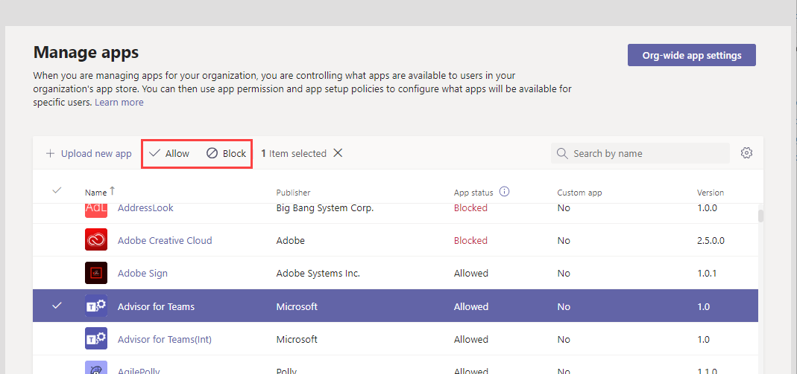

# Consentimento específico do recurso no Microsoft Teams

[!INCLUDE [preview-feature](includes/preview-feature.md)]

O consentimento específico do recurso no Microsoft Teams permite que os proprietários da equipe deem consentimento aos aplicativos para acessar os dados da equipe. Exemplos desse acesso incluem a capacidade de ler mensagens de canal, criar e excluir canais e criar e remover guias de canal.

Como administrador, você controla se os proprietários da equipe em sua organização podem dar consentimento por meio das configurações definidas usando o módulo do PowerShell do Azure Active Directory (Azure AD) ou o portal do Azure e o centro de administração do Microsoft Teams.  

## Definir se os proprietários da equipe podem dar consentimento a aplicativos

Aqui estão as configurações que você deve definir para controlar se os proprietários da equipe podem dar consentimento aos aplicativos. Examine todas as configurações a seguir.

### Configurações em Azure AD

As duas configurações a seguir determinam se os proprietários da equipe podem dar consentimento aos aplicativos.

> [!IMPORTANT]
> Alterar qualquer uma dessas configurações não afeta o acesso a dados para aplicativos que já foram autorizados. Por exemplo, se você definir essas configurações para impedir que os proprietários da equipe deem consentimento, essas alterações não removerão o acesso a dados que já foram concedidos.

#### A configuração "Os usuários podem consentir com aplicativos que acessam dados da empresa em seu nome"

Essa configuração controla se os usuários em sua organização podem consentir com aplicativos em seu nome. Para permitir que os proprietários da equipe deem consentimento, essa configuração deve ser definida como **Sim**. Para gerenciar essa configuração, faça o seguinte:

1. No portal do Azure, acesse as configurações **Enterprise** > **usuário dos aplicativos**.
2. Em **Enterprise aplicativos**, defina **Os usuários podem consentir** que os aplicativos acessem os dados da empresa em seu nome **como Não** ou **Sim**.

Você também pode gerenciar essa configuração usando o PowerShell. Para saber mais, confira [Configurar o conteúdo do usuário para aplicativos](/azure/active-directory/manage-apps/configure-user-consent#configure-user-consent-to-applications).

#### A configuração "EnableGroupSpecificConsent"

Essa configuração controla se os usuários em sua organização podem consentir que os aplicativos acessem os dados da empresa para os grupos que eles têm. Essa configuração deve ser habilitada para que os proprietários da equipe deem consentimento. Para obter etapas sobre como gerenciar essa configuração usando o PowerShell, consulte Configurar o consentimento do proprietário do grupo para aplicativos [que acessam dados do grupo](/azure/active-directory/manage-apps/configure-user-consent#configure-group-owner-consent-to-apps-accessing-group-data).

### Configurações no centro de Microsoft Teams administrador

Além das configurações no Azure AD, as configurações de aplicativo em toda a organização na página Gerenciar  [aplicativos](manage-apps.md#manage-org-wide-app-settings), se um aplicativo está bloqueado ou permitido na página Gerenciar  aplicativos e a política de  permissão do aplicativo atribuída ao proprietário da equipe determina se um proprietário da equipe pode dar consentimento.

> [!IMPORTANT]
> Alterar qualquer uma dessas configurações não afeta o acesso a dados para aplicativos que já foram autorizados. Por exemplo, se você desabilitar aplicativos de terceiros em toda a organização ou se bloquear aplicativos específicos para impedir que os proprietários da equipe deem consentimento, essas alterações não removerão o acesso a dados que já foi concedido.  

#### A configuração "Permitir aplicativos de terceiros" nas configurações do aplicativo em toda a organização

Essa configuração de aplicativo em toda a organização controla se os usuários em sua organização podem usar aplicativos de terceiros. Essa configuração deve estar ativada para permitir que os proprietários da equipe deem consentimento. Para gerenciar essa configuração, faça o seguinte:

1. No painel de navegação esquerdo do centro de administração Microsoft Teams, acesse Teams **aplicativos** >  Gerenciar aplicativos **e clique em** Configurações de aplicativos **em toda a organização**.
2. Em **aplicativos de terceiros**, desative ou ative **Permitir aplicativos de terceiros**.

    

Talvez você precise aguardar até 24 horas para que as configurações entrem em vigor.

#### Permitir ou bloquear o aplicativo no nível da organização

Quando você bloqueia ou permite um aplicativo na página  Gerenciar aplicativos, esse aplicativo é bloqueado ou permitido para todos os usuários em sua organização. Os proprietários da equipe só poderão dar consentimento a um aplicativo se o aplicativo for permitido. Para permitir ou bloquear um aplicativo no nível da organização, faça o seguinte:

1. Na navegação à esquerda do Centro de Administração do Microsoft Teams, vá para **Aplicativos do Teams** > **Gerenciar aplicativos**.
2. Na página Gerenciar aplicativos, selecione o aplicativo e clique em **Bloquear** para bloqueiá-lo ou clique **em Permitir** para permitir.

    

#### Política de permissão de aplicativo atribuída ao proprietário da equipe

Os proprietários da equipe só podem dar consentimento a aplicativos que sua política de permissão de aplicativo permite que eles executem. Para exibir e gerenciar a política de permissão do aplicativo atribuída a um proprietário de equipe, faça o seguinte:

1. No painel de navegação à esquerda do Microsoft Teams de administração, vá para **Usuários**.
2. Clique duas vezes no nome de exibição do proprietário da equipe e clique em **Políticas**.
3. A política atribuída ao proprietário da equipe é listada na **política de permissão do aplicativo**.
    - Para atribuir uma política diferente, clique **em Editar** e selecione a política que você deseja atribuir.
    - Para editar as configurações da política atribuída ao proprietário da equipe, clique no nome da política e faça as alterações desejadas.  

## Carregando aplicativos personalizados

Ao carregar um aplicativo personalizado (também conhecido sideload) que usa o consentimento específico do recurso, o aplicativo deve vir do locatário para o qual ele está sendo instalado. Em outras palavras, o Azure AD de aplicativo deve ser desse locatário. Os administradores globais são isentos dessa restrição e podem carregar aplicativos personalizados de qualquer locatário, diretamente para uma equipe (sideload) ou para o catálogo de aplicativos de locatário.

## Tópicos relacionados

- [Permissões RSC disponíveis](/microsoftteams/platform/graph-api/rsc/resource-specific-consent)
- [Microsoft Graph](https://developer.microsoft.com/graph)
- [Gerenciar seus aplicativos no Microsoft Teams de administração](manage-apps.md)
- [Gerenciar políticas de permissões de aplicativo no Teams](teams-app-permission-policies.md)
