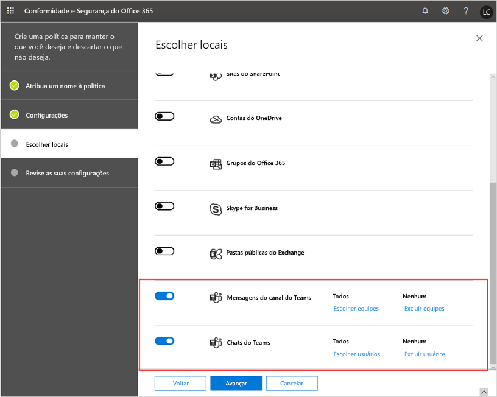
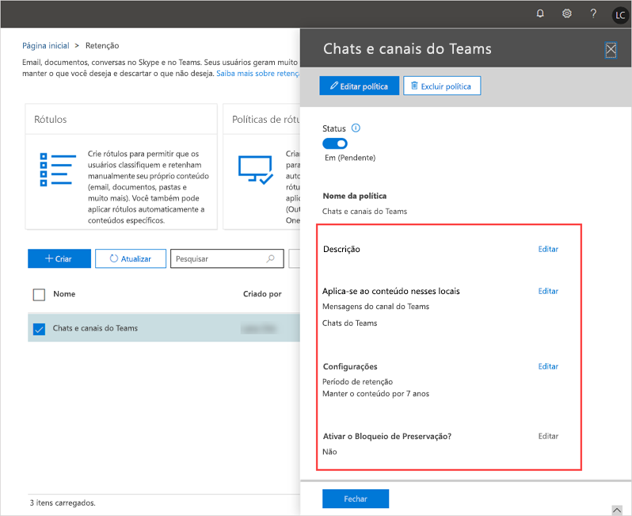

# Políticas de retenção no Microsoft Teams

As políticas de retenção ajudam a gerenciar com mais eficiência as informações da sua organização. Use políticas de retenção para manter os dados necessários para cumprir as políticas internas da sua organização, regulamentações do setor ou necessidades jurídicas, além de excluir os dados considerados um passivo, que não são mais necessários, ou que não têm nenhum valor legal ou comercial.

Por padrão, os dados de chat, canal e arquivos de equipe são mantidos indefinidamente, a menos que haja uma tentativa de excluir o conteúdo por meio de políticas de retenção, exclusões do usuário, exclusões de administradores, etc. Como administrador, você pode configurar as políticas de retenção de equipes para mensagens de chat e de canal e decidir proativamente se deseja manter os dados, excluí-los ou mantê-los por um período específico de tempo e, em seguida, excluí-los.

Você cria e gerencia políticas de retenção para equipes e outras cargas de trabalho no [centro de conformidade do Microsoft 365](https://protection.office.com/) ou usando os cmdlets do PowerShell do centro de conformidade do & central de segurança. Você pode aplicar uma política de retenção do Teams para toda a organização ou para usuários e equipes específicas.

> [!NOTE]
> Ainda não damos suporte à configuração para a retenção de mensagens de canal privado. A retenção de arquivos compartilhados em canais privados tem suporte.

Para saber mais sobre as políticas de retenção do Microsoft 365 ou do Office 365, consulte [visão geral de políticas de retenção](https://support.office.com/article/overview-of-retention-policies-5e377752-700d-4870-9b6d-12bfc12d2423).

## O que são políticas de retenção para o Teams?

Ao configurar uma política de retenção para o Teams ou qualquer outra carga de trabalho, você pode configurá-las para:

- **Manter dados**: Use uma política de retenção para garantir que seus dados sejam mantidos por um período de tempo especificado, independentemente do que acontece no aplicativo usuário. Os dados são mantidos por motivos de conformidade e estão disponíveis para Descoberta eletrônica até que o período de retenção expire, após o qual sua política indica se deseja ou não excluir os dados. Por exemplo, se você criar uma política de retenção do Teams para reter mensagens de canal por 7 anos, as mensagens serão mantidas para Descoberta eletrônica por 7 anos, mesmo que os usuários excluam as mensagens deles no Teams.
- **Excluir dados**: Use uma política de retenção para excluir dados e garantir que não seja um passivo para a sua organização. Com uma política de retenção do Teams, ao excluir dados, eles serão excluídos permanentemente de todos os locais de armazenamento do serviço Teams.

Com as políticas de retenção para o Teams, você pode:

- Manter chats e/ou mensagens de canal do Teams por uma duração específica e, em seguida, e não fazer nada.
- Manter chats e/ou mensagens de canal do Teams por uma duração específica e, em seguida, e deletar os dados.
- Excluir chats e/ou mensagens de canal do Teams após uma duração especificada.

> [!NOTE]
> Lembre-se de que no Teams, os arquivos que os usuários compartilham em chats privados são armazenados na conta do OneDrive for Business do usuário que compartilhou o arquivo. Os arquivos que os membros da equipe carregam em uma conversa de canal são armazenados no site do SharePoint da equipe. Portanto, para reter ou excluir arquivos no Teams, crie políticas de retenção que se aplicam ao OneDrive for Business e ao SharePoint Online.

Quando os dados estão sujeitos a uma política de retenção, os usuários podem continuar a trabalhar com eles, pois eles são mantidos no local, em seu local original. Se um usuário editar ou excluir dados sujeitos à política, uma cópia será salva em um local seguro, onde será mantida enquanto a política estiver em vigor.

O requisito mínimo de licenciamento para políticas de retenção é o Office 365 E3. Para saber mais sobre licenciamento, consulte [Descrição do serviço Microsoft Teams](https://docs.microsoft.com/office365/servicedescriptions/teams-service-description).

## Como funcionam as políticas de retenção do Teams

Os chats de equipe são armazenados em uma pasta oculta (Teamschat) na caixa de correio de cada usuário no chat, e as mensagens de canal de equipe são armazenadas em uma pasta oculta (Teamschat) na caixa de correio de grupo de uma equipe. O Teams usa um serviço de chat fornecido pelo Azure que também armazena esses dados e, por padrão, o serviço armazena os dados para sempre. Com uma política de retenção do Teams, quando você exclui dados, os dados serão excluídos permanentemente das caixas de correio do Exchange e do serviço de chat subjacente.

Ao aplicar uma política de **retenção de retenção** a chats de equipe ou mensagens de canal, veja o que acontece:

- Se uma mensagem de chat ou de canal for editada ou excluída por um usuário durante o período de retenção, a mensagem será copiada (se tiver sido editada) ou movida (se tiver sido excluída) para a pasta SubstrateHolds e armazenada até o período de retenção expirar. Se a política estiver configurada para excluir dados quando o período de retenção expirar, as mensagens serão permanentemente excluídas no dia em que o período de retenção expira.
- Se uma mensagem de chat ou de canal não for excluída por um usuário durante o período de **retenção** , a mensagem será movida para a pasta SubstrateHolds dentro de um dia após o vencimento do período de retenção. Se a política estiver configurada para excluir dados quando o período de retenção expirar, a mensagem será permanentemente excluída um dia após a mudança para a pasta.

Ao aplicar uma política de **exclusão de retenção** a chats de equipe e mensagens de canal, veja o que acontece:

- Quando uma mensagem de chat ou canal expira, ou seja, a idade da mensagem é mais do que a permitida pela política de **exclusão de retenção** , um serviço back-end, identifica mensagens expiradas e começa a excluí-las no armazenamento de back-end (usuário ou caixa de correio de grupo). 
- Depois que uma mensagem é excluída no armazenamento back-end, um processo é disparado para excluir a mesma mensagem no aplicativo Teams do usuário e no serviço de chat com alimentação do Azure. Para que as mensagens sejam excluídas no aplicativo Teams, o aplicativo precisa estar conectado à Internet e estar em estado ocioso (sem atividade do usuário), para que o processo de exclusão não interfira na experiência do usuário. Como um usuário pode ter vários dispositivos, que podem estar em Estados diferentes, as exclusões de retenção não sincronizariam com esses dispositivos em exatamente alguns instantes.
- Depois que a exclusão de mensagens no armazenamento de back-end estiver completa, essas mensagens deixarão de ser exibidas nos relatórios de pesquisa de conformidade, como descoberta eletrônica.

> [!NOTE]
> O mesmo fluxo funciona para bate-papos de interoperabilidade do Skype for Business Online e do Teams. Quando um chat do Skype for Business online entra no Teams, ele se torna uma mensagem em um thread de chat do Teams e recebe uma caixa de correio adequada. As políticas de retenção do Teams vão excluir essas mensagens do thread do Teams. No entanto, se o histórico de chats estiver ativado para o Skype for Business Online e, do lado do cliente do Skype for Business Online, estiverem sendo salvos em uma caixa de correio, esses dados de bate-papo não serão tratados por uma política de retenção do Teams.

> [!NOTE]
> A exclusão de mensagens é permanente e irreversível.

As políticas de retenção no Teams se baseiam na data em que as mensagens de bate-papo ou canal foram criadas e são retroativas. Em outras palavras, se você criar uma política de retenção para excluir dados com mais de 90 dias, os dados do Teams criados há mais de 90 dias serão excluídos.

É possível que uma política de retenção que aplica o SharePoint Online ou o OneDrive for Business exclua um arquivo referenciado em uma mensagem de bate-papo ou de um canal para que as mensagens sejam excluídas. Neste cenário, o arquivo ainda será mostrado na mensagem do Teams, mas quando os usuários clicarem no arquivo, eles receberão o erro "arquivo não encontrado". Isso também pode acontecer na ausência de uma política, caso alguém exclua manualmente um arquivo do SharePoint Online ou do OneDrive for Business.

### Considerações e limitações

Aqui estão algumas considerações e limitações que você deve conhecer ao trabalhar com políticas de retenção do Teams:

- O Teams exige uma política de retenção separada de outras cargas de trabalho. Em outras palavras, você precisa criar políticas de retenção específicas para chats e/ou mensagens de canal do Teams. Por esse motivo, você não pode incluir o Teams em políticas de retenção de toda a organização.

- Não há suporte para mensagens de canal privado. Neste momento, políticas de retenção para o Teams só se aplicam a mensagens de canal padrão.

- O Teams não têm suporte para as configurações de retenção avançadas, como a capacidade de aplicar uma política ao conteúdo que contém palavras-chave ou informações confidenciais. No momento, as políticas de retenção do Teams se aplicam a todo o conteúdo de mensagens de chat e/ou de canal.

- Uma política de retenção de equipes acionará um processo para excluir mensagens de chat e de canal quando essas mensagens expirarem (com base na data de criação da mensagem). No entanto, dependendo da carga do serviço, pode levar até sete dias para excluir permanentemente essas mensagens do armazenamento back-end e do aplicativo Teams. Além disso, essas mensagens serão pesquisadas com as ferramentas de conformidade (descoberta eletrônica, pesquisa de usuário final) até que sejam excluídas permanentemente do armazenamento de back-end.

### Várias políticas de retenção e princípios de retenção

Se você configurar várias políticas de retenção com durações variáveis, os [princípios das políticas de retenção](https://docs.microsoft.com/microsoft-365/compliance/retention-policies#the-principles-of-retention-or-what-takes-precedence) se aplicarão. Veja uma visão geral do que tem precedência:

- Preservação sempre vence a exclusão
- O período de preservação mais longo sempre vence
- A inclusão explícita vence sobre a inclusão implícita em termos de locais
- O menor período de exclusão prevalecerá

## Quando usar as políticas de retenção para o Teams.

Em muitos casos, as organizações consideram os dados de chat privados como um número mais passivo do que as mensagens de canal, que geralmente são conversas mais relacionadas ao projeto.

Você pode configurar uma política de retenção separada para chats privados (1:1 ou 1: muitos chats) e mensagens de canal. Você também pode configurar políticas exclusivas que se aplicam a usuários ou equipes específicas em sua organização. Nos chats do Teams, você pode selecionar a quais usuários a política será aplicada. Para mensagens de canal do Teams, você pode selecionar a quais equipes a política será aplicada.

Por exemplo, para mensagens de canal, você pode aplicar uma política de exclusão de um ano a equipes específicas em sua organização e aplicar uma política de exclusão de três anos a todas as outras equipes.

## Gerenciar políticas de retenção para o Teams.

### Usando o Centro de Conformidade e Segurança

#### Criar uma diretiva de retenção

Para criar uma política de retenção para chats e mensagens de canal do Teams, siga este procedimento:

1. Na barra de navegação à esquerda do Centro de Conformidade & Segurança, acesse **Governança de informações** > **Retenção**.
2. Selecione **Criar**.
3. Na página **Nomear sua política**, digite um nome e uma descrição para a política e, em seguida, clique em **Avançar**.
4. Na página **Configurações**, especifique se deseja manter os dados, excluir ou ambos, o período de retenção e, em seguida, clique em **Próximo**.
5. Na página **Escolher locais**, realize o seguinte procedimento e clique em **Próximo**:

    - Para aplicar a política a mensagens de canal, ative **Mensagens do canal do Teams**.  Se você quiser aplicar a política a equipes específicas em sua organização, selecione **Escolher equipes**e selecione as equipes desejadas.
    - Para aplicar a política a chats, habilite os **Chats do Teams**. Se você quiser aplicar a política a usuários específicos em sua organização, selecione **Escolher usuários**e, em seguida, selecione os usuários desejados.
      > [!NOTE]
      > Quando você ativa as **Mensagens de canal do Teams** e/ou **chats do Teams**, todos os outros locais são desativados automaticamente. Uma política de retenção do Teams só pode incluir locais do Teams.

        

      > [!IMPORTANT]
      > As mensagens de chat e de canal não são afetadas pelas políticas de retenção aplicadas a caixas de correio de usuário ou grupo nos locais **email do Exchange** ou **grupos do Microsoft 365** . Mesmo que as mensagens do canal e do chat do Teams estejam armazenadas no Exchange, elas são afetadas apenas por uma política de retenção aplicada ao local do Teams.

6. Examine suas configurações e, quando estiver pronto, selecione **Criar essa política**.

#### Editar uma política de retenção

Para editar uma política de retenção do Teams, siga este procedimento:

1. Na barra de navegação à esquerda do Centro de Conformidade & Segurança, acesse **Governança de informações** > **Retenção**.
2. Na lista de políticas de retenção, marque a caixa de seleção ao lado da política de retenção que você deseja editar.
3. Selecione **Editar** ao lado do que você deseja editar, faça suas alterações, clique em **Salvar**e, em seguida, clique em **Fechar**.

    

#### Excluir uma política de retenção.

Para excluir uma política de retenção do Teams, siga este procedimento:

1. Na barra de navegação à esquerda do Centro de Conformidade & Segurança, acesse **Governança de informações** > **Retenção**.
2. Na lista de políticas de retenção, marque a caixa de seleção ao lado da política de retenção que você deseja excluir.
3. Marque **excluir política**.

### Usando o PowerShell

Para criar e gerenciar as políticas de retenção de equipes usando o [PowerShell do centro de conformidade do &](https://docs.microsoft.com/powershell/exchange/office-365-scc/connect-to-scc-powershell/connect-to-scc-powershell), use os seguintes cmdlets:

|Política|Rule|
|---|---|
|[New-RetentionCompliancePolicy](https://docs.microsoft.com/powershell/module/exchange/policy-and-compliance-retention/new-retentioncompliancepolicy?view=exchange-ps)| [New-RetentionComplianceRule](https://docs.microsoft.com/powershell/module/exchange/policy-and-compliance-retention/new-retentioncompliancerule?view=exchange-ps)|
|[Get-RetentionCompliancePolicy](https://docs.microsoft.com/powershell/module/exchange/policy-and-compliance-retention/get-retentioncompliancepolicy?view=exchange-ps)| [Get-RetentionComplianceRule](https://docs.microsoft.com/powershell/module/exchange/policy-and-compliance-retention/get-retentioncompliancerule?view=exchange-ps)|
|[Set-RetentionCompliancePolicy](https://docs.microsoft.com/powershell/module/exchange/policy-and-compliance-retention/set-retentioncompliancepolicy?view=exchange-ps)| [Set-RetentionComplianceRule](https://docs.microsoft.com/powershell/module/exchange/policy-and-compliance-retention/set-retentioncompliancerule?view=exchange-ps)|
|[Remove-RetentionCompliancePolicy](https://docs.microsoft.com/powershell/module/exchange/policy-and-compliance-retention/remove-retentioncompliancepolicy?view=exchange-ps)| [Remove-RetentionComplianceRule](https://docs.microsoft.com/powershell/module/exchange/policy-and-compliance-retention/remove-retentioncompliancerule?view=exchange-ps)|

## Problemas conhecidos

A seguir estão alguns problemas conhecidos em políticas de retenção do Teams que estão sendo controlados e investigados.

- Em **escolher equipes** na linha de localização de **mensagens de canal do teams** , você pode ver os grupos do Microsoft 365 que não são equipes também. Isso será solucionado no futuro.

- Em **Escolher usuários** na linha **Chats do Teams**, você poderá ver convidados e usuários que não são de caixa de correio. As políticas de retenção não devem ser definidas para convidados, e estamos trabalhando para removê-los da lista.

- O Exchange Life Cycle Assistant (ELC) é executado diariamente, mas tem um SLA de 7 dias. Como resultado, é possível que, se você tiver uma política de retenção do Teams para excluir itens com mais de 60 dias, esses itens possam persistir por até 67 dias. Essa não é uma nova situação. Certamente, na maioria dos casos, não existem atrasos.

## Tópicos relacionados

- [Visão geral de políticas de retenção](https://support.office.com/article/overview-of-retention-policies-5e377752-700d-4870-9b6d-12bfc12d2423)
