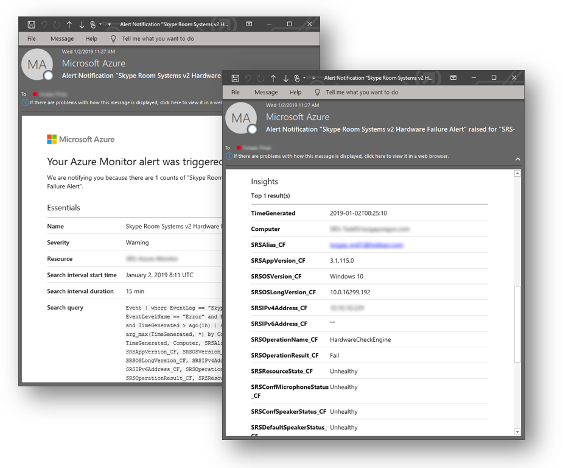

# <a name="deploy-microsoft-teams-rooms-management-with-azure-monitor"></a><span data-ttu-id="be7d0-103">Implantar o gerenciamento de salas do Microsoft Teams com o Azure monitor</span><span class="sxs-lookup"><span data-stu-id="be7d0-103">Deploy Microsoft Teams Rooms management with Azure Monitor</span></span>

<span data-ttu-id="be7d0-104">Este artigo descreve como configurar e implantar o gerenciamento completo e integrado dos dispositivos de salas do Microsoft Teams usando o Azure monitor.</span><span class="sxs-lookup"><span data-stu-id="be7d0-104">This article discusses how to set up and deploy integrated, end-to-end management of Microsoft Teams Rooms devices by using Azure Monitor.</span></span>

<span data-ttu-id="be7d0-105">Você pode configurar a análise de logs no Azure monitor para fornecer telemetria básica e alertas que o ajudarão a gerenciar salas de reunião de sala de reuniões do Microsoft Teams.</span><span class="sxs-lookup"><span data-stu-id="be7d0-105">You can configure Log Analytics within Azure Monitor to provide basic telemetry and alerts that will help you manage Microsoft Teams Rooms meeting room devices.</span></span> <span data-ttu-id="be7d0-106">À medida que sua solução de gerenciamento amadurece, você pode decidir implantar recursos adicionais de gerenciamento e dados para criar uma visão mais detalhada da disponibilidade e do desempenho do dispositivo.</span><span class="sxs-lookup"><span data-stu-id="be7d0-106">As your management solution matures, you might decide to deploy additional data and management capabilities to create a more detailed view of device availability and performance.</span></span>

<span data-ttu-id="be7d0-107">Seguindo este guia, você pode usar um painel como o exemplo a seguir para obter relatórios de status detalhados de disponibilidade do dispositivo, integridade do aplicativo e do hardware e distribuição de versão do sistema operacional e do aplicativo de salas do Microsoft Teams.</span><span class="sxs-lookup"><span data-stu-id="be7d0-107">By following this guide, you can use a dashboard like the following example to get detailed status reporting for device availability, application and hardware health, and Microsoft Teams Rooms application and operating system version distribution.</span></span>

<span data-ttu-id="be7d0-108">![Captura de tela do modo de exibição análise de log de amostra para salas do Microsoft Teams] (../media/Deploy-Azure-Monitor-1.png "Exemplo de exibição de análise de log para salas do Microsoft Teams")</span><span class="sxs-lookup"><span data-stu-id="be7d0-108"></span></span>

<span data-ttu-id="be7d0-109">Em um nível superior, é necessário executar as seguintes tarefas:</span><span class="sxs-lookup"><span data-stu-id="be7d0-109">At a high level, you need to perform the following tasks:</span></span>


1.  [<span data-ttu-id="be7d0-110">Validar configuração da análise de logs</span><span class="sxs-lookup"><span data-stu-id="be7d0-110">Validate Log Analytics configuration</span></span>](azure-monitor-deploy.md#validate_LogAnalytics)
2.  [<span data-ttu-id="be7d0-111">Configurar dispositivos de teste para configuração de gerenciamento de análise de log</span><span class="sxs-lookup"><span data-stu-id="be7d0-111">Configure test devices for Log Analytics management setup</span></span>](azure-monitor-deploy.md#configure_test_devices)
3.  [<span data-ttu-id="be7d0-112">Mapear os campos personalizados</span><span class="sxs-lookup"><span data-stu-id="be7d0-112">Map custom fields</span></span>](azure-monitor-deploy.md#Custom_fields)
4.  [<span data-ttu-id="be7d0-113">Definir os modos de exibição de salas do Microsoft Teams em análises de logs</span><span class="sxs-lookup"><span data-stu-id="be7d0-113">Define the Microsoft Teams Rooms views in Log Analytics</span></span>](azure-monitor-deploy.md#Define_Views)
5.  [<span data-ttu-id="be7d0-114">Definir alertas</span><span class="sxs-lookup"><span data-stu-id="be7d0-114">Define alerts</span></span>](azure-monitor-deploy.md#Alerts)
6.  [<span data-ttu-id="be7d0-115">Configurar todos os dispositivos para monitoramento</span><span class="sxs-lookup"><span data-stu-id="be7d0-115">Configure all devices for Monitoring</span></span>](azure-monitor-deploy.md#configure_all_devices)
7.  [<span data-ttu-id="be7d0-116">Configurar soluções adicionais do Azure monitor</span><span class="sxs-lookup"><span data-stu-id="be7d0-116">Configure additional Azure Monitor solutions</span></span>](azure-monitor-deploy.md#Solutions)

> [!IMPORTANT]
> <span data-ttu-id="be7d0-117">Embora com a configuração mínima, a análise de log do Azure monitor pode monitorar um computador que executa um sistema operacional Windows, ainda há algumas salas do Microsoft Teams que você precisa tomar antes de começar a implantar agentes em todas as Microsoft Teams Dispositivos de salas.</span><span class="sxs-lookup"><span data-stu-id="be7d0-117">Although with minimal configuration, Azure Monitor Log Analytics can monitor a computer running a Windows operating system, there are still some Microsoft Teams Rooms–specific steps that you need to take before you start deploying agents to all Microsoft Teams Rooms devices.</span></span>
> <span data-ttu-id="be7d0-118">Portanto, é altamente recomendável executar todas as etapas de configuração na ordem certa para uma configuração e configuração controlada.</span><span class="sxs-lookup"><span data-stu-id="be7d0-118">Therefore, we highly recommend you perform all configuration steps in the right order for a controlled setup and configuration.</span></span> <span data-ttu-id="be7d0-119">A qualidade do resultado final depende muito da qualidade da configuração inicial.</span><span class="sxs-lookup"><span data-stu-id="be7d0-119">The quality of the end result very much depends on the quality of the initial configuration.</span></span>

## <a name="validate-log-analytics-configuration"></a><span data-ttu-id="be7d0-120">Validar configuração da análise de logs</span><span class="sxs-lookup"><span data-stu-id="be7d0-120">Validate Log Analytics configuration</span></span>
<span data-ttu-id="be7d0-121"><a name="validate_LogAnalytics"> </a></span><span class="sxs-lookup"><span data-stu-id="be7d0-121"></span></span>

<span data-ttu-id="be7d0-122">Você precisa ter um espaço de trabalho de análise de log para começar a coletar logs de dispositivos de salas do Microsoft Teams.</span><span class="sxs-lookup"><span data-stu-id="be7d0-122">You need to have a Log Analytics workspace to start collecting logs from Microsoft Teams Rooms devices.</span></span> <span data-ttu-id="be7d0-123">Um espaço de trabalho é um ambiente de análise de logs exclusivo com seu próprio repositório de dados, fontes de dados e soluções.</span><span class="sxs-lookup"><span data-stu-id="be7d0-123">A workspace is a unique Log Analytics environment with its own data repository, data sources, and solutions.</span></span> <span data-ttu-id="be7d0-124">Se já tiver um espaço de trabalho de análise de logs existente, você pode usá-lo para monitorar a implantação de salas do Microsoft Teams ou também pode criar um espaço de trabalho de análise de log exclusivo específico para as suas salas do Microsoft Teams monitorar suas necessidades.</span><span class="sxs-lookup"><span data-stu-id="be7d0-124">If you already have an existing Log Analytics workspace, you might use it to monitor your Microsoft Teams Rooms deployment or alternatively, you can create a dedicated Log Analytics workspace specific to your Microsoft Teams Rooms monitoring needs.</span></span>

<span data-ttu-id="be7d0-125">Se você precisar criar um novo espaço de trabalho de análise de logs, siga as instruções no artigo [criar um espaço de trabalho de análise de logs no portal do Azure](https://docs.microsoft.com/azure/azure-monitor/learn/quick-create-workspace)</span><span class="sxs-lookup"><span data-stu-id="be7d0-125">If you need to create a new Log Analytics workspace, follow the instructions in the article [Create a Log Analytics workspace in the Azure portal](https://docs.microsoft.com/azure/azure-monitor/learn/quick-create-workspace)</span></span>

> [!NOTE]
> <span data-ttu-id="be7d0-126">Para usar a análise de logs com o Azure monitor, você precisa ter uma assinatura ativa do Azure.</span><span class="sxs-lookup"><span data-stu-id="be7d0-126">To use Log Analytics with Azure Monitor, you need to have an active Azure subscription.</span></span> <span data-ttu-id="be7d0-127">Se você não tiver uma assinatura do Azure, poderá criar [uma assinatura de avaliação gratuita](https://azure.microsoft.com/free) como ponto de partida.</span><span class="sxs-lookup"><span data-stu-id="be7d0-127">If you don’t have an Azure subscription, you can create [a free trial subscription](https://azure.microsoft.com/free) as a starting point.</span></span>

### <a name="configure-log-analytics-to-collect-microsoft-teams-rooms-event-logs"></a><span data-ttu-id="be7d0-128">Configurar a análise de logs para coletar logs de eventos de salas do Microsoft Teams</span><span class="sxs-lookup"><span data-stu-id="be7d0-128">Configure Log Analytics to collect Microsoft Teams Rooms event logs</span></span>

<span data-ttu-id="be7d0-129">A análise de logs coleta apenas eventos dos logs de eventos do Windows que são especificados nas configurações.</span><span class="sxs-lookup"><span data-stu-id="be7d0-129">Log Analytics only collects events from the Windows event logs that are specified in the settings.</span></span> <span data-ttu-id="be7d0-130">Para cada log, somente os eventos com as severidades selecionadas são coletados.</span><span class="sxs-lookup"><span data-stu-id="be7d0-130">For each log, only the events with the selected severities are collected.</span></span>

<span data-ttu-id="be7d0-131">Você precisa configurar a análise de logs para coletar os logs necessários para monitorar o dispositivo e o status do aplicativo salas do Microsoft Teams.</span><span class="sxs-lookup"><span data-stu-id="be7d0-131">You need to configure Log Analytics to collect the logs required to monitor Microsoft Teams Rooms device and application status.</span></span> <span data-ttu-id="be7d0-132">Dispositivos de salas do Microsoft Teams usam o log de eventos do **sistema de sala do Skype** .</span><span class="sxs-lookup"><span data-stu-id="be7d0-132">Microsoft Teams Rooms devices use the **Skype Room System** event log.</span></span>

<span data-ttu-id="be7d0-133">Para configurar a análise de logs para coletar os eventos de salas do Microsoft Teams, consulte [fontes de dados de log de eventos do Windows no Azure monitor](https://docs.microsoft.com/azure/azure-monitor/platform/data-sources-windows-events)</span><span class="sxs-lookup"><span data-stu-id="be7d0-133">To configure Log Analytics to collect the Microsoft Teams Rooms events, see [Windows event log data sources in Azure Monitor](https://docs.microsoft.com/azure/azure-monitor/platform/data-sources-windows-events)</span></span>

<span data-ttu-id="be7d0-134">![Captura de tela das configurações do log de eventos] (../media/Deploy-Azure-Monitor-2.png "Configurações do log de eventos")</span><span class="sxs-lookup"><span data-stu-id="be7d0-134"></span></span>

> [!IMPORTANT]
> <span data-ttu-id="be7d0-135">Defina as configurações do log de eventos **do** Windows e insira o sistema de salas da Skype como nome do log de eventos e marque as caixas de seleção **erro**, **aviso**e **informações** .</span><span class="sxs-lookup"><span data-stu-id="be7d0-135">Configure Windows Event Log settings and enter **Skype Room System** as event log name, and then select the **Error**, **Warning**, and **Information** check boxes.</span></span>

## <a name="configure-test-devices-for-azure-monitoring"></a><span data-ttu-id="be7d0-136">Configurar dispositivos de teste para o Azure Monitoring</span><span class="sxs-lookup"><span data-stu-id="be7d0-136">Configure test devices for Azure Monitoring</span></span>
<span data-ttu-id="be7d0-137"><a name="configure_test_devices"> </a></span><span class="sxs-lookup"><span data-stu-id="be7d0-137"></span></span>

<span data-ttu-id="be7d0-138">Você precisa preparar a análise de logs para poder monitorar os eventos relacionados a salas do Microsoft Teams.</span><span class="sxs-lookup"><span data-stu-id="be7d0-138">You need to prepare Log Analytics to be able to monitor Microsoft Teams Rooms–related events.</span></span> <span data-ttu-id="be7d0-139">Para começar, você precisa implantar os agentes de monitoramento da Microsoft para apenas um ou dois dispositivos de salas do Microsoft Teams com acesso físico e obter esses dispositivos de teste geram alguns dados e empurre-os para o espaço de trabalho de análise de logs.</span><span class="sxs-lookup"><span data-stu-id="be7d0-139">To start with, you need to deploy Microsoft Monitoring agents to just one or two Microsoft Teams Rooms devices that you have physical access to, and get those test devices generate some data and push it to the Log Analytics workspace.</span></span>

### <a name="install-microsoft-monitoring-agents-to-test-devices"></a><span data-ttu-id="be7d0-140">Instalar os agentes de monitoramento da Microsoft para dispositivos de teste</span><span class="sxs-lookup"><span data-stu-id="be7d0-140">Install Microsoft Monitoring agents to test devices</span></span>

<span data-ttu-id="be7d0-141">Implante o Microsoft Monitoring Agent nos dispositivos de teste usando as instruções fornecidas em [conectar computadores Windows ao serviço analítico de logs no Azure](https://docs.microsoft.com/azure/azure-monitor/platform/agent-windows).</span><span class="sxs-lookup"><span data-stu-id="be7d0-141">Deploy the Microsoft Monitoring agent to the test devices by using the instructions provided in [Connect Windows computers to the Log Analytics service in Azure](https://docs.microsoft.com/azure/azure-monitor/platform/agent-windows).</span></span> <span data-ttu-id="be7d0-142">Este artigo fornece informações detalhadas sobre as etapas para implantar o Microsoft Monitoring Agent para Windows, instruções para obter a ***ID do espaço de trabalho*** da análise de logs e a ***chave primária*** para obter dispositivos de salas do Microsoft Teams conectados a sua implantação do Azure monitor e etapas para verificar a conectividade do agente para a instância de análise de log.</span><span class="sxs-lookup"><span data-stu-id="be7d0-142">This article provides detailed information about the steps for deploying Microsoft Monitoring Agent for Windows, instructions for obtaining the Log Analytics ***Workspace ID*** and the ***primary key*** to get Microsoft Teams Rooms devices connected to your Azure Monitor deployment, and steps to verify agent connectivity to Log Analytics instance.</span></span>

### <a name="generate-sample-microsoft-teams-rooms-events"></a><span data-ttu-id="be7d0-143">Gerar exemplos de eventos de salas do Microsoft Teams</span><span class="sxs-lookup"><span data-stu-id="be7d0-143">Generate sample Microsoft Teams Rooms events</span></span>

<span data-ttu-id="be7d0-144">Depois que o Microsoft Monitoring Agent é implantado nos dispositivos de teste, verifique se os dados necessários do log de eventos são coletados pelo Azure monitor.</span><span class="sxs-lookup"><span data-stu-id="be7d0-144">After the Microsoft Monitoring agent is deployed onto the test devices, verify that the required event log data is collected by Azure Monitor.</span></span>

> [!NOTE]
> <span data-ttu-id="be7d0-145">Reinicie o dispositivo após a instalação do Microsoft Monitoring Agent e verifique se o aplicativo de reunião de salas do Microsoft Teams foi iniciado, para que ele possa gerar novos eventos para o log de eventos.</span><span class="sxs-lookup"><span data-stu-id="be7d0-145">Reboot the device after the installation of the Microsoft Monitoring agent, and make sure that Microsoft Teams Rooms Meeting app is started, so that it can generate new events into the Event Log.</span></span>

1.  <span data-ttu-id="be7d0-146">Entre no portal do [Microsoft Azure](https://portal.azure.com) e vá para análise de logs e selecione seu espaço de trabalho.</span><span class="sxs-lookup"><span data-stu-id="be7d0-146">Sign in to the [Microsoft Azure portal](https://portal.azure.com) and go to Log Analytics and select your workspace.</span></span>

2.  <span data-ttu-id="be7d0-147">Listar os eventos de pulsação gerados por um dispositivo de salas do Microsoft Teams:</span><span class="sxs-lookup"><span data-stu-id="be7d0-147">List the heartbeat events generated by a Microsoft Teams Rooms device:</span></span>
    1.  <span data-ttu-id="be7d0-148">Selecione seu espaço de trabalho e vá para **logs** e use uma consulta para recuperar os registros de pulsação que terão os campos personalizados para as salas do Microsoft Teams.</span><span class="sxs-lookup"><span data-stu-id="be7d0-148">Select your workspace and go to **Logs** and use a query to retrieve the heartbeat records that will have the custom fields for Microsoft Teams Rooms.</span></span>
    2.  <span data-ttu-id="be7d0-149">Consulta de exemplo:`Event | where Source == "SRS-App" and EventID == 2000`</span><span class="sxs-lookup"><span data-stu-id="be7d0-149">Sample query: `Event | where Source == "SRS-App" and EventID == 2000`</span></span>

3.  <span data-ttu-id="be7d0-150">Certifique-se de que a consulta retorne registros de log que incluam eventos gerados pelo aplicativo reuniões de salas do Microsoft Teams.</span><span class="sxs-lookup"><span data-stu-id="be7d0-150">Make sure that the query returns log records that include events generated by the Microsoft Teams Rooms meetings app.</span></span>

4.  <span data-ttu-id="be7d0-151">Gere um problema de hardware e valide se os eventos necessários estão registrados na análise de logs do Azure.</span><span class="sxs-lookup"><span data-stu-id="be7d0-151">Generate a hardware issue, and validate that the required events are logged in Azure Log Analytics.</span></span>
    1.  <span data-ttu-id="be7d0-152">Desconecte um dos dispositivos periféricos do sistema de teste de salas do Microsoft Teams.</span><span class="sxs-lookup"><span data-stu-id="be7d0-152">Unplug one of the peripheral devices on the test Microsoft Teams Rooms system.</span></span> <span data-ttu-id="be7d0-153">Pode ser a tela câmera, viva-voz, microfone ou sala frontal</span><span class="sxs-lookup"><span data-stu-id="be7d0-153">This could be the camera, speakerphone, microphone, or Front Room Display</span></span>
    2.  <span data-ttu-id="be7d0-154">Aguarde 10 minutos para que o log de eventos seja preenchido na análise de logs do Azure.</span><span class="sxs-lookup"><span data-stu-id="be7d0-154">Wait 10 minutes for the event log to be populated in Azure Log Analytics.</span></span>
    3.  <span data-ttu-id="be7d0-155">Use uma consulta para listar eventos de erro de hardware:`Event | where Source == "SRS-App" and EventID == 3001`</span><span class="sxs-lookup"><span data-stu-id="be7d0-155">Use a query to list hardware error events: `Event | where Source == "SRS-App" and EventID == 3001`</span></span>

5.  <span data-ttu-id="be7d0-156">Gere um problema de aplicativo e valide se os eventos necessários estão registrados.</span><span class="sxs-lookup"><span data-stu-id="be7d0-156">Generate an application issue, and validate that the required events are logged.</span></span>
    1.  <span data-ttu-id="be7d0-157">Modifique a configuração do aplicativo salas do Microsoft Teams e digite um par de endereço/senha SIP (protocolo de iniciação de sessão) incorreto.</span><span class="sxs-lookup"><span data-stu-id="be7d0-157">Modify Microsoft Teams Rooms application configuration, and type an incorrect Session Initiation Protocol (SIP) address/password pair.</span></span>
    2.  <span data-ttu-id="be7d0-158">Aguarde 10 minutos para que o log de eventos seja preenchido na análise de logs do Azure.</span><span class="sxs-lookup"><span data-stu-id="be7d0-158">Wait 10 minutes for the event log to be populated in Azure Log Analytics.</span></span>
    3.  <span data-ttu-id="be7d0-159">Use uma consulta para listar eventos de erro do aplicativo:`Event | where Source == "SRS-App" and EventID == 2001 and EventLevel == 1`</span><span class="sxs-lookup"><span data-stu-id="be7d0-159">Use a query to list application error events: `Event | where Source == "SRS-App" and EventID == 2001 and EventLevel == 1`</span></span>

> [!IMPORTANT]
> <span data-ttu-id="be7d0-160">Estes registros de eventos de exemplo são necessários para que os campos personalizados possam ser configurados.</span><span class="sxs-lookup"><span data-stu-id="be7d0-160">These sample event logs are required before custom fields can be configured.</span></span> <span data-ttu-id="be7d0-161">Não vá para a próxima etapa até que você tenha coletado os logs de eventos necessários.</span><span class="sxs-lookup"><span data-stu-id="be7d0-161">Don’t proceed to the next step until you have collected the required event logs.</span></span>

## <a name="map-custom-fields"></a><span data-ttu-id="be7d0-162">Mapear os campos personalizados</span><span class="sxs-lookup"><span data-stu-id="be7d0-162">Map custom fields</span></span>
<span data-ttu-id="be7d0-163"><a name="Custom_fields"> </a></span><span class="sxs-lookup"><span data-stu-id="be7d0-163"></span></span>

<span data-ttu-id="be7d0-164">Use campos personalizados para extrair dados específicos dos logs de eventos.</span><span class="sxs-lookup"><span data-stu-id="be7d0-164">You use custom fields to extract specific data from the event logs.</span></span> <span data-ttu-id="be7d0-165">Você precisa definir campos personalizados que serão usados posteriormente com seus blocos, exibições de painel e alertas.</span><span class="sxs-lookup"><span data-stu-id="be7d0-165">You need to define custom fields that will be used later with your tiles, dashboard views, and alerts.</span></span> <span data-ttu-id="be7d0-166">Veja [campos personalizados na análise de logs](https://docs.microsoft.com/azure/azure-monitor/platform/custom-fields) e familiarize-se com os conceitos antes de começar a criar seus campos personalizados.</span><span class="sxs-lookup"><span data-stu-id="be7d0-166">See [Custom fields in Log Analytics](https://docs.microsoft.com/azure/azure-monitor/platform/custom-fields) and become familiar with the concepts before you start creating your custom fields.</span></span>

<span data-ttu-id="be7d0-167">Para extrair seus campos personalizados dos logs de eventos capturados, siga estas etapas:</span><span class="sxs-lookup"><span data-stu-id="be7d0-167">To extract your custom fields out of the captured event logs, follow these steps:</span></span>

1.  <span data-ttu-id="be7d0-168">Entre no portal do [Microsoft Azure](https://portal.azure.com) e vá para análise de logs e selecione seu espaço de trabalho.</span><span class="sxs-lookup"><span data-stu-id="be7d0-168">Sign in to the [Microsoft Azure portal](https://portal.azure.com) and go to Log Analytics and select your workspace.</span></span>

2. <span data-ttu-id="be7d0-169">Listar os eventos gerados por um dispositivo de salas do Microsoft Teams:</span><span class="sxs-lookup"><span data-stu-id="be7d0-169">List the events generated by a Microsoft Teams Rooms device:</span></span>
   1.  <span data-ttu-id="be7d0-170">Vá para **logs** e use uma consulta para recuperar os registros que terão o campo personalizado.</span><span class="sxs-lookup"><span data-stu-id="be7d0-170">Go to **Logs** and use a query to retrieve the records that will have the custom field.</span></span>
   2.  <span data-ttu-id="be7d0-171">Consulta de exemplo:`Event | where Source == "SRS-App" and EventID == 2000`</span><span class="sxs-lookup"><span data-stu-id="be7d0-171">Sample query: `Event | where Source == "SRS-App" and EventID == 2000`</span></span>

3. <span data-ttu-id="be7d0-172">Selecione um dos registros, selecione o botão à esquerda e inicie o assistente de extração de campos.</span><span class="sxs-lookup"><span data-stu-id="be7d0-172">Select one of the records, select the button to the left, and start the field extraction wizard.</span></span>
4. <span data-ttu-id="be7d0-173">Realce os dados que você deseja extrair do RenderedDescription e forneça um título de campo.</span><span class="sxs-lookup"><span data-stu-id="be7d0-173">Highlight the data you’d like to extract from the RenderedDescription and provide a Field Title.</span></span> <span data-ttu-id="be7d0-174">Os nomes de campo que você deve usar são fornecidos na tabela 1.</span><span class="sxs-lookup"><span data-stu-id="be7d0-174">The field names that you should use are provided in Table 1.</span></span>

   <span data-ttu-id="be7d0-175">![Definição de campo personalizado] (../media/Deploy-Azure-Monitor-4.png "Definição de campo personalizado")</span><span class="sxs-lookup"><span data-stu-id="be7d0-175"></span></span>

5. <span data-ttu-id="be7d0-176">Use os mapeamentos mostrados na *tabela 1*.</span><span class="sxs-lookup"><span data-stu-id="be7d0-176">Use the mappings shown in *Table 1*.</span></span> <span data-ttu-id="be7d0-177">A análise de log acrescentará automaticamente a cadeia de caracteres do \*\* \_CF\*\* quando você definir o novo campo.</span><span class="sxs-lookup"><span data-stu-id="be7d0-177">Log Analytics will automatically append the **\_CF** string when you define the new field.</span></span>

> [!IMPORTANT]
> <span data-ttu-id="be7d0-178">Lembre-se de que todos os campos JSON e analítico de log diferenciam maiúsculas de minúsculas.</span><span class="sxs-lookup"><span data-stu-id="be7d0-178">Remember that all JSON and Log Analytics fields are case-sensitive.</span></span>
> 
> <span data-ttu-id="be7d0-179">Preste atenção às consultas necessárias para cada campo personalizado na tabela abaixo.</span><span class="sxs-lookup"><span data-stu-id="be7d0-179">Pay attention to the queries required for each custom field in the table below.</span></span> <span data-ttu-id="be7d0-180">Você precisa usar as consultas corretas para análise de log para extrair com êxito valores de campos personalizados.</span><span class="sxs-lookup"><span data-stu-id="be7d0-180">You need to use the correct queries for Log Analytics to successfully extract custom field values.</span></span>
> 
 <span data-ttu-id="be7d0-181">![Definição de campo personalizado] (../media/Deploy-Azure-Monitor-5.png "Definição de campo personalizado")</span><span class="sxs-lookup"><span data-stu-id="be7d0-181"></span></span>

<span data-ttu-id="be7d0-182">**Tabela 1**</span><span class="sxs-lookup"><span data-stu-id="be7d0-182">**Table 1**</span></span>

| <span data-ttu-id="be7d0-183">**Campo JSON**</span><span class="sxs-lookup"><span data-stu-id="be7d0-183">**JSON field**</span></span>                   | <span data-ttu-id="be7d0-184">**Campo personalizado de análise de logs**</span><span class="sxs-lookup"><span data-stu-id="be7d0-184">**Log Analytics custom field**</span></span> | <span data-ttu-id="be7d0-185">**ID do evento**</span><span class="sxs-lookup"><span data-stu-id="be7d0-185">**Event ID**</span></span> | <span data-ttu-id="be7d0-186">**Consulta a ser usada com a extração**</span><span class="sxs-lookup"><span data-stu-id="be7d0-186">**Query to use with the extraction**</span></span>                   |
|:---------------------------------|:-------------------------------|:-------------|:-------------------------------------------------------|
| <span data-ttu-id="be7d0-187">Descrição</span><span class="sxs-lookup"><span data-stu-id="be7d0-187">Description</span></span>                      | <span data-ttu-id="be7d0-188">SRSEventDescription</span><span class="sxs-lookup"><span data-stu-id="be7d0-188">SRSEventDescription</span></span>         | <span data-ttu-id="be7d0-189">**2000**</span><span class="sxs-lookup"><span data-stu-id="be7d0-189">**2000**</span></span>     | <span data-ttu-id="be7d0-190">Evento \| em que Source = = "SRS-app" e EventID = = 2000</span><span class="sxs-lookup"><span data-stu-id="be7d0-190">Event \| where Source == "SRS-App" and EventID == 2000</span></span> |
| <span data-ttu-id="be7d0-191">ResourceState</span><span class="sxs-lookup"><span data-stu-id="be7d0-191">ResourceState</span></span>                    | <span data-ttu-id="be7d0-192">SRSResourceState</span><span class="sxs-lookup"><span data-stu-id="be7d0-192">SRSResourceState</span></span>            | <span data-ttu-id="be7d0-193">**2000**</span><span class="sxs-lookup"><span data-stu-id="be7d0-193">**2000**</span></span>     | <span data-ttu-id="be7d0-194">Evento \| em que Source = = "SRS-app" e EventID = = 2000</span><span class="sxs-lookup"><span data-stu-id="be7d0-194">Event \| where Source == "SRS-App" and EventID == 2000</span></span> |
| <span data-ttu-id="be7d0-195">OperationName</span><span class="sxs-lookup"><span data-stu-id="be7d0-195">OperationName</span></span>                    | <span data-ttu-id="be7d0-196">SRSOperationName</span><span class="sxs-lookup"><span data-stu-id="be7d0-196">SRSOperationName</span></span>            | <span data-ttu-id="be7d0-197">**2000**</span><span class="sxs-lookup"><span data-stu-id="be7d0-197">**2000**</span></span>     | <span data-ttu-id="be7d0-198">Evento \| em que Source = = "SRS-app" e EventID = = 2000</span><span class="sxs-lookup"><span data-stu-id="be7d0-198">Event \| where Source == "SRS-App" and EventID == 2000</span></span> |
| <span data-ttu-id="be7d0-199">OperationResult</span><span class="sxs-lookup"><span data-stu-id="be7d0-199">OperationResult</span></span>                  | <span data-ttu-id="be7d0-200">SRSOperationResult</span><span class="sxs-lookup"><span data-stu-id="be7d0-200">SRSOperationResult</span></span>          | <span data-ttu-id="be7d0-201">**2000**</span><span class="sxs-lookup"><span data-stu-id="be7d0-201">**2000**</span></span>     | <span data-ttu-id="be7d0-202">Evento \| em que Source = = "SRS-app" e EventID = = 2000</span><span class="sxs-lookup"><span data-stu-id="be7d0-202">Event \| where Source == "SRS-App" and EventID == 2000</span></span> |
| <span data-ttu-id="be7d0-203">Sistema operacional</span><span class="sxs-lookup"><span data-stu-id="be7d0-203">OS</span></span>                               | <span data-ttu-id="be7d0-204">SRSOSVersion</span><span class="sxs-lookup"><span data-stu-id="be7d0-204">SRSOSVersion</span></span>                | <span data-ttu-id="be7d0-205">**2000**</span><span class="sxs-lookup"><span data-stu-id="be7d0-205">**2000**</span></span>     | <span data-ttu-id="be7d0-206">Evento \| em que Source = = "SRS-app" e EventID = = 2000</span><span class="sxs-lookup"><span data-stu-id="be7d0-206">Event \| where Source == "SRS-App" and EventID == 2000</span></span> |
| <span data-ttu-id="be7d0-207">Versão do sistema operacional</span><span class="sxs-lookup"><span data-stu-id="be7d0-207">OSVersion</span></span>                        | <span data-ttu-id="be7d0-208">SRSOSLongVersion</span><span class="sxs-lookup"><span data-stu-id="be7d0-208">SRSOSLongVersion</span></span>            | <span data-ttu-id="be7d0-209">**2000**</span><span class="sxs-lookup"><span data-stu-id="be7d0-209">**2000**</span></span>     | <span data-ttu-id="be7d0-210">Evento \| em que Source = = "SRS-app" e EventID = = 2000</span><span class="sxs-lookup"><span data-stu-id="be7d0-210">Event \| where Source == "SRS-App" and EventID == 2000</span></span> |
| <span data-ttu-id="be7d0-211">Alias</span><span class="sxs-lookup"><span data-stu-id="be7d0-211">Alias</span></span>                            | <span data-ttu-id="be7d0-212">SRSAlias</span><span class="sxs-lookup"><span data-stu-id="be7d0-212">SRSAlias</span></span>                    | <span data-ttu-id="be7d0-213">**2000**</span><span class="sxs-lookup"><span data-stu-id="be7d0-213">**2000**</span></span>     | <span data-ttu-id="be7d0-214">Evento \| em que Source = = "SRS-app" e EventID = = 2000</span><span class="sxs-lookup"><span data-stu-id="be7d0-214">Event \| where Source == "SRS-App" and EventID == 2000</span></span> |
| <span data-ttu-id="be7d0-215">DisplayName</span><span class="sxs-lookup"><span data-stu-id="be7d0-215">DisplayName</span></span>                      | <span data-ttu-id="be7d0-216">SRSDisplayName</span><span class="sxs-lookup"><span data-stu-id="be7d0-216">SRSDisplayName</span></span>              | <span data-ttu-id="be7d0-217">**2000**</span><span class="sxs-lookup"><span data-stu-id="be7d0-217">**2000**</span></span>     | <span data-ttu-id="be7d0-218">Evento \| em que Source = = "SRS-app" e EventID = = 2000</span><span class="sxs-lookup"><span data-stu-id="be7d0-218">Event \| where Source == "SRS-App" and EventID == 2000</span></span> |
| <span data-ttu-id="be7d0-219">AppVersion</span><span class="sxs-lookup"><span data-stu-id="be7d0-219">AppVersion</span></span>                       | <span data-ttu-id="be7d0-220">SRSAppVersion</span><span class="sxs-lookup"><span data-stu-id="be7d0-220">SRSAppVersion</span></span>               | <span data-ttu-id="be7d0-221">**2000**</span><span class="sxs-lookup"><span data-stu-id="be7d0-221">**2000**</span></span>     | <span data-ttu-id="be7d0-222">Evento \| em que Source = = "SRS-app" e EventID = = 2000</span><span class="sxs-lookup"><span data-stu-id="be7d0-222">Event \| where Source == "SRS-App" and EventID == 2000</span></span> |
| <span data-ttu-id="be7d0-223">IPv4Address</span><span class="sxs-lookup"><span data-stu-id="be7d0-223">IPv4Address</span></span>                      | <span data-ttu-id="be7d0-224">SRSIPv4Address</span><span class="sxs-lookup"><span data-stu-id="be7d0-224">SRSIPv4Address</span></span>              | <span data-ttu-id="be7d0-225">**2000**</span><span class="sxs-lookup"><span data-stu-id="be7d0-225">**2000**</span></span>     | <span data-ttu-id="be7d0-226">Evento \| em que Source = = "SRS-app" e EventID = = 2000</span><span class="sxs-lookup"><span data-stu-id="be7d0-226">Event \| where Source == "SRS-App" and EventID == 2000</span></span> |
| <span data-ttu-id="be7d0-227">IPv6Address</span><span class="sxs-lookup"><span data-stu-id="be7d0-227">IPv6Address</span></span>                      | <span data-ttu-id="be7d0-228">SRSIPv6Address</span><span class="sxs-lookup"><span data-stu-id="be7d0-228">SRSIPv6Address</span></span>              | <span data-ttu-id="be7d0-229">**2000**</span><span class="sxs-lookup"><span data-stu-id="be7d0-229">**2000**</span></span>     | <span data-ttu-id="be7d0-230">Evento \| em que Source = = "SRS-app" e EventID = = 2000</span><span class="sxs-lookup"><span data-stu-id="be7d0-230">Event \| where Source == "SRS-App" and EventID == 2000</span></span> |
| <span data-ttu-id="be7d0-231">Status do microfone da conferência</span><span class="sxs-lookup"><span data-stu-id="be7d0-231">Conference Microphone status</span></span>     | <span data-ttu-id="be7d0-232">SRSConfMicrophoneStatus</span><span class="sxs-lookup"><span data-stu-id="be7d0-232">SRSConfMicrophoneStatus</span></span>     | <span data-ttu-id="be7d0-233">**3001**</span><span class="sxs-lookup"><span data-stu-id="be7d0-233">**3001**</span></span>     | <span data-ttu-id="be7d0-234">Evento \| em que Source = = "SRS-app" e EventID = = 3001</span><span class="sxs-lookup"><span data-stu-id="be7d0-234">Event \| where Source == "SRS-App" and EventID == 3001</span></span> |
| <span data-ttu-id="be7d0-235">Status do palestrante da conferência</span><span class="sxs-lookup"><span data-stu-id="be7d0-235">Conference Speaker status</span></span>        | <span data-ttu-id="be7d0-236">SRSConfSpeakerStatus</span><span class="sxs-lookup"><span data-stu-id="be7d0-236">SRSConfSpeakerStatus</span></span>        | <span data-ttu-id="be7d0-237">**3001**</span><span class="sxs-lookup"><span data-stu-id="be7d0-237">**3001**</span></span>     | <span data-ttu-id="be7d0-238">Evento \| em que Source = = "SRS-app" e EventID = = 3001</span><span class="sxs-lookup"><span data-stu-id="be7d0-238">Event \| where Source == "SRS-App" and EventID == 3001</span></span> |
| <span data-ttu-id="be7d0-239">Status padrão do alto-falante</span><span class="sxs-lookup"><span data-stu-id="be7d0-239">Default Speaker status</span></span>           | <span data-ttu-id="be7d0-240">SRSDefaultSpeakerStatus</span><span class="sxs-lookup"><span data-stu-id="be7d0-240">SRSDefaultSpeakerStatus</span></span>     | <span data-ttu-id="be7d0-241">**3001**</span><span class="sxs-lookup"><span data-stu-id="be7d0-241">**3001**</span></span>     | <span data-ttu-id="be7d0-242">Evento \| em que Source = = "SRS-app" e EventID = = 3001</span><span class="sxs-lookup"><span data-stu-id="be7d0-242">Event \| where Source == "SRS-App" and EventID == 3001</span></span> |
| <span data-ttu-id="be7d0-243">Status da câmera</span><span class="sxs-lookup"><span data-stu-id="be7d0-243">Camera status</span></span>                    | <span data-ttu-id="be7d0-244">SRSCameraStatus</span><span class="sxs-lookup"><span data-stu-id="be7d0-244">SRSCameraStatus</span></span>             | <span data-ttu-id="be7d0-245">**3001**</span><span class="sxs-lookup"><span data-stu-id="be7d0-245">**3001**</span></span>     | <span data-ttu-id="be7d0-246">Evento \| em que Source = = "SRS-app" e EventID = = 3001</span><span class="sxs-lookup"><span data-stu-id="be7d0-246">Event \| where Source == "SRS-App" and EventID == 3001</span></span> |
| <span data-ttu-id="be7d0-247">Status de exibição da frente do espaço</span><span class="sxs-lookup"><span data-stu-id="be7d0-247">Front of Room Display status</span></span>     | <span data-ttu-id="be7d0-248">SRSFORDStatus</span><span class="sxs-lookup"><span data-stu-id="be7d0-248">SRSFORDStatus</span></span>               | <span data-ttu-id="be7d0-249">**3001**</span><span class="sxs-lookup"><span data-stu-id="be7d0-249">**3001**</span></span>     | <span data-ttu-id="be7d0-250">Evento \| em que Source = = "SRS-app" e EventID = = 3001</span><span class="sxs-lookup"><span data-stu-id="be7d0-250">Event \| where Source == "SRS-App" and EventID == 3001</span></span> |
| <span data-ttu-id="be7d0-251">Status do sensor de movimento</span><span class="sxs-lookup"><span data-stu-id="be7d0-251">Motion Sensor status</span></span>             | <span data-ttu-id="be7d0-252">SRSMotionSensorStatus</span><span class="sxs-lookup"><span data-stu-id="be7d0-252">SRSMotionSensorStatus</span></span>       | <span data-ttu-id="be7d0-253">**3001**</span><span class="sxs-lookup"><span data-stu-id="be7d0-253">**3001**</span></span>     | <span data-ttu-id="be7d0-254">Evento \| em que Source = = "SRS-app" e EventID = = 3001</span><span class="sxs-lookup"><span data-stu-id="be7d0-254">Event \| where Source == "SRS-App" and EventID == 3001</span></span> |
| <span data-ttu-id="be7d0-255">Status de inclusão de HDMI</span><span class="sxs-lookup"><span data-stu-id="be7d0-255">HDMI Ingest status</span></span>               | <span data-ttu-id="be7d0-256">SRSHDMIIngestStatus</span><span class="sxs-lookup"><span data-stu-id="be7d0-256">SRSHDMIIngestStatus</span></span>         | <span data-ttu-id="be7d0-257">**3001**</span><span class="sxs-lookup"><span data-stu-id="be7d0-257">**3001**</span></span>     | <span data-ttu-id="be7d0-258">Evento \| em que Source = = "SRS-app" e EventID = = 3001</span><span class="sxs-lookup"><span data-stu-id="be7d0-258">Event \| where Source == "SRS-App" and EventID == 3001</span></span> |


## <a name="define-the-microsoft-teams-rooms-views-in-log-analytics"></a><span data-ttu-id="be7d0-259">Definir os modos de exibição de salas do Microsoft Teams em análises de logs</span><span class="sxs-lookup"><span data-stu-id="be7d0-259">Define the Microsoft Teams Rooms views in Log Analytics</span></span>
<span data-ttu-id="be7d0-260"><a name="Define_Views"> </a></span><span class="sxs-lookup"><span data-stu-id="be7d0-260"></span></span>

<span data-ttu-id="be7d0-261">Depois que os dados são coletados e os campos personalizados são mapeados, você pode usar o View Designer para desenvolver um painel contendo vários blocos para monitorar os eventos de salas do Microsoft Teams.</span><span class="sxs-lookup"><span data-stu-id="be7d0-261">After data is collected and custom fields are mapped, you can use View Designer to develop a dashboard containing various tiles to monitor Microsoft Teams Rooms events.</span></span> <span data-ttu-id="be7d0-262">Use o designer de exibição para criar os blocos a seguir.</span><span class="sxs-lookup"><span data-stu-id="be7d0-262">Use View Designer to create the following tiles.</span></span> <span data-ttu-id="be7d0-263">Para obter mais informações, consulte [criar modos de exibição personalizados usando o designer de exibição na análise de logs](https://docs.microsoft.com/azure/azure-monitor/platform/view-designer)</span><span class="sxs-lookup"><span data-stu-id="be7d0-263">For more information, see [Create custom views by using View Designer in Log Analytics](https://docs.microsoft.com/azure/azure-monitor/platform/view-designer)</span></span>

> [!NOTE]
> <span data-ttu-id="be7d0-264">As etapas anteriores deste guia devem ter sido concluídas para que os blocos do painel funcionem corretamente.</span><span class="sxs-lookup"><span data-stu-id="be7d0-264">Previous steps in this guide should have been completed for the dashboard tiles to work properly.</span></span>

### <a name="create-a-microsoft-teams-rooms-dashboard-by-using-the-import-method"></a><span data-ttu-id="be7d0-265">Criar um painel de salas do Microsoft Teams usando o método de importação</span><span class="sxs-lookup"><span data-stu-id="be7d0-265">Create a Microsoft Teams Rooms dashboard by using the import method</span></span>

<span data-ttu-id="be7d0-266">Você pode importar um painel de salas do Microsoft Teams e começar a monitorar seus dispositivos rapidamente.</span><span class="sxs-lookup"><span data-stu-id="be7d0-266">You can import an Microsoft Teams Rooms dashboard and start monitoring your devices quickly.</span></span> <span data-ttu-id="be7d0-267">Siga as etapas a seguir para importar o painel:</span><span class="sxs-lookup"><span data-stu-id="be7d0-267">Take the following steps to import the dashboard:</span></span>

1.  <span data-ttu-id="be7d0-268">Obtenha o arquivo de painel [SkypeRoomSystems_v2. omsview](https://go.microsoft.com/fwlink/?linkid=835675) .</span><span class="sxs-lookup"><span data-stu-id="be7d0-268">Get the [SkypeRoomSystems_v2.omsview](https://go.microsoft.com/fwlink/?linkid=835675) dashboard file.</span></span>
2.  <span data-ttu-id="be7d0-269">Entre no portal do [Microsoft Azure](https://portal.azure.com) e vá para análise de logs e selecione seu espaço de trabalho.</span><span class="sxs-lookup"><span data-stu-id="be7d0-269">Sign in to the [Microsoft Azure portal](https://portal.azure.com) and go to Log Analytics and select your workspace.</span></span>
3.  <span data-ttu-id="be7d0-270">Abrir o **Designer de exibição**.</span><span class="sxs-lookup"><span data-stu-id="be7d0-270">Open **View Designer**.</span></span>
4.  <span data-ttu-id="be7d0-271">Selecione **importar**e, em seguida, selecione o arquivo **SkypeRoomSystems_v2. omsview** .</span><span class="sxs-lookup"><span data-stu-id="be7d0-271">Select **Import**, and then select the **SkypeRoomSystems_v2.omsview** file.</span></span>
5.  <span data-ttu-id="be7d0-272">Selecione **salvar**.</span><span class="sxs-lookup"><span data-stu-id="be7d0-272">Select **Save**.</span></span>

### <a name="create-a-microsoft-teams-rooms-dashboard-manually"></a><span data-ttu-id="be7d0-273">Criar um painel de salas do Microsoft Teams manualmente</span><span class="sxs-lookup"><span data-stu-id="be7d0-273">Create a Microsoft Teams Rooms dashboard manually</span></span>

<span data-ttu-id="be7d0-274">Você também pode criar seu próprio painel e adicionar apenas os blocos que deseja monitorar.</span><span class="sxs-lookup"><span data-stu-id="be7d0-274">Alternatively, you can create your own dashboard and add only the tiles that you wish to monitor.</span></span>

#### <a name="configure-the-overview-tile"></a><span data-ttu-id="be7d0-275">Configurar o bloco de visão geral</span><span class="sxs-lookup"><span data-stu-id="be7d0-275">Configure the Overview Tile</span></span>

1.  <span data-ttu-id="be7d0-276">Abrir o **Designer de exibição**.</span><span class="sxs-lookup"><span data-stu-id="be7d0-276">Open **View Designer**.</span></span>
2.  <span data-ttu-id="be7d0-277">Selecione **bloco visão geral**e, em seguida, selecione **dois números** na galeria.</span><span class="sxs-lookup"><span data-stu-id="be7d0-277">Select **Overview Tile**, and then select **Two numbers** from the gallery.</span></span>
3.  <span data-ttu-id="be7d0-278">Nomeie as **salas do Microsoft Teams**em blocos.</span><span class="sxs-lookup"><span data-stu-id="be7d0-278">Name the tile **Microsoft Teams Rooms**.</span></span>
4.  <span data-ttu-id="be7d0-279">Defina o **primeiro bloco**:</span><span class="sxs-lookup"><span data-stu-id="be7d0-279">Define the **First Tile**:</span></span><br>
    <span data-ttu-id="be7d0-280">**Legenda:** Dispositivos que enviaram uma pulsação pelo menos uma vez no mês passado</span><span class="sxs-lookup"><span data-stu-id="be7d0-280">**Legend:** Devices that sent a heartbeat at least once within the last month</span></span><br>
    <span data-ttu-id="be7d0-281">**Consulta:**```Event | where EventLog == "Skype Room System" and TimeGenerated > ago(30d) | summarize TotalSRSDevices = dcount(Computer)```</span><span class="sxs-lookup"><span data-stu-id="be7d0-281">**Query:** ```Event | where EventLog == "Skype Room System" and TimeGenerated > ago(30d) | summarize TotalSRSDevices = dcount(Computer)```</span></span>
5.  <span data-ttu-id="be7d0-282">Defina o **segundo bloco**:</span><span class="sxs-lookup"><span data-stu-id="be7d0-282">Define the **Second Tile**:</span></span><br>
    <span data-ttu-id="be7d0-283">**Legenda:** Dispositivos ativos que enviaram uma pulsação na última hora</span><span class="sxs-lookup"><span data-stu-id="be7d0-283">**Legend:** Active devices that sent a heartbeat within the last hour</span></span><br>
    <span data-ttu-id="be7d0-284">**Consulta:**```Event | where EventLog == "Skype Room System" and SRSOperationName_CF == "Heartbeat" and TimeGenerated > ago(1h) | summarize TotalSRSDevices = dcount(Computer)```</span><span class="sxs-lookup"><span data-stu-id="be7d0-284">**Query:** ```Event | where EventLog == "Skype Room System" and SRSOperationName_CF == "Heartbeat" and TimeGenerated > ago(1h) | summarize TotalSRSDevices = dcount(Computer)```</span></span>
6.  <span data-ttu-id="be7d0-285">Selecione **aplicar**.</span><span class="sxs-lookup"><span data-stu-id="be7d0-285">Select **Apply**.</span></span>

### <a name="create-a-tile-that-displays-active-devices"></a><span data-ttu-id="be7d0-286">Criar um bloco que exiba dispositivos ativos</span><span class="sxs-lookup"><span data-stu-id="be7d0-286">Create a tile that displays active devices</span></span>

1.  <span data-ttu-id="be7d0-287">Selecione **exibir painel** para começar a adicionar blocos.</span><span class="sxs-lookup"><span data-stu-id="be7d0-287">Select **View Dashboard** to start adding your tiles.</span></span>
2.  <span data-ttu-id="be7d0-288">Selecionar **número & lista** da Galeria</span><span class="sxs-lookup"><span data-stu-id="be7d0-288">Select **Number & list** from the gallery</span></span>
3.  <span data-ttu-id="be7d0-289">Defina as propriedades **gerais** :</span><span class="sxs-lookup"><span data-stu-id="be7d0-289">Define the **General** properties:</span></span><br>
    <span data-ttu-id="be7d0-290">**Título do Grupo:** Status do Heartbeat</span><span class="sxs-lookup"><span data-stu-id="be7d0-290">**Group Title:** Heartbeat Status</span></span><br>
    <span data-ttu-id="be7d0-291">**Novo grupo:** Selecionado</span><span class="sxs-lookup"><span data-stu-id="be7d0-291">**New Group:** Selected</span></span>
4.  <span data-ttu-id="be7d0-292">Defina as propriedades do **bloco** :</span><span class="sxs-lookup"><span data-stu-id="be7d0-292">Define the **Tile** properties:</span></span><br>
    <span data-ttu-id="be7d0-293">**Legenda:** Dispositivos ativos (pulsação enviada nos últimos 20 minutos)</span><span class="sxs-lookup"><span data-stu-id="be7d0-293">**Legend:** Active devices (heartbeat sent in the last 20 minutes)</span></span><br>
    <span data-ttu-id="be7d0-294">\*\*Consulta de bloco: \*\* ```Event | where EventLog == "Skype Room System" and SRSOperationName_CF == "Heartbeat" and TimeGenerated > ago(20m) | summarize AggregatedValue = count() by Computer | count```</span><span class="sxs-lookup"><span data-stu-id="be7d0-294">**Tile Query:** ```Event | where EventLog == "Skype Room System" and SRSOperationName_CF == "Heartbeat" and TimeGenerated > ago(20m) | summarize AggregatedValue = count() by Computer | count```</span></span>
5.  <span data-ttu-id="be7d0-295">Defina as propriedades da **lista** :</span><span class="sxs-lookup"><span data-stu-id="be7d0-295">Define the **List** properties:</span></span><br>
    <span data-ttu-id="be7d0-296">**Consulta de lista:**```Event | where EventLog == "Skype Room System" and SRSOperationName_CF == "Heartbeat" and TimeGenerated > ago(20m) | summarize TimeGenerated = max(TimeGenerated) by Computer | order by TimeGenerated```</span><span class="sxs-lookup"><span data-stu-id="be7d0-296">**List Query:** ```Event | where EventLog == "Skype Room System" and SRSOperationName_CF == "Heartbeat" and TimeGenerated > ago(20m) | summarize TimeGenerated = max(TimeGenerated) by Computer | order by TimeGenerated```</span></span>
6.  <span data-ttu-id="be7d0-297">Definir **títulos de coluna**:</span><span class="sxs-lookup"><span data-stu-id="be7d0-297">Define **Column Titles**:</span></span><br>
    <span data-ttu-id="be7d0-298">**Nome:** Nome do computador</span><span class="sxs-lookup"><span data-stu-id="be7d0-298">**Name:** Computer Name</span></span><br>
    <span data-ttu-id="be7d0-299">**Valor:** Última pulsação</span><span class="sxs-lookup"><span data-stu-id="be7d0-299">**Value:** Last Heartbeat</span></span>
7.  <span data-ttu-id="be7d0-300">Definir uma **consulta de navegação**.</span><span class="sxs-lookup"><span data-stu-id="be7d0-300">Define **Navigation Query**.</span></span><br>
    ```search {selected item} | where EventLog == "Skype Room System" and SRSOperationName_CF == "Heartbeat" | summarize arg_max(TimeGenerated, *) by Computer | project TimeGenerated, Computer, SRSAlias_CF, SRSAppVersion_CF, SRSOSVersion_CF, SRSOSLongVersion_CF, SRSIPv4Address_CF, SRSIPv6Address_CF, SRSOperationName_CF, SRSOperationResult_CF, SRSResourceState_CF, SRSEventDescription_CF```
8.  <span data-ttu-id="be7d0-301">Selecione **aplicar**e **fechar**.</span><span class="sxs-lookup"><span data-stu-id="be7d0-301">Select **Apply**, and then **Close**.</span></span>

### <a name="create-a-tile-that-displays-devices-that-have-connectivity-issues"></a><span data-ttu-id="be7d0-302">Criar um bloco que exiba dispositivos com problemas de conectividade</span><span class="sxs-lookup"><span data-stu-id="be7d0-302">Create a tile that displays devices that have connectivity issues</span></span>

1.  <span data-ttu-id="be7d0-303">Selecione **número & lista** da galeria e, em seguida, adicione um novo bloco.</span><span class="sxs-lookup"><span data-stu-id="be7d0-303">Select **Number & list** from the gallery, and then add a new tile.</span></span>
2.  <span data-ttu-id="be7d0-304">Defina as propriedades **gerais** :</span><span class="sxs-lookup"><span data-stu-id="be7d0-304">Define the **General** properties:</span></span><br>
    <span data-ttu-id="be7d0-305">**Título do Grupo:** Deixar vazio</span><span class="sxs-lookup"><span data-stu-id="be7d0-305">**Group Title:** Leave empty</span></span><br>
    <span data-ttu-id="be7d0-306">**Novo grupo:** Não selecionada</span><span class="sxs-lookup"><span data-stu-id="be7d0-306">**New Group:** Not Selected</span></span>
3.  <span data-ttu-id="be7d0-307">Defina as propriedades do **bloco** :</span><span class="sxs-lookup"><span data-stu-id="be7d0-307">Define the **Tile** properties:</span></span><br>
    <span data-ttu-id="be7d0-308">**Legenda:** Dispositivos inativos (nenhuma mensagem de pulsação enviada nos últimos 20 minutos)</span><span class="sxs-lookup"><span data-stu-id="be7d0-308">**Legend:** Inactive Devices (no heartbeat message sent in the last 20 minutes)</span></span><br>
    <span data-ttu-id="be7d0-309">\*\*Consulta de bloco: \*\* ```Event | where EventLog == "Skype Room System" and SRSOperationName_CF == "Heartbeat" | summarize LastHB = max(TimeGenerated) by Computer | where LastHB < ago(20m) | count```</span><span class="sxs-lookup"><span data-stu-id="be7d0-309">**Tile Query:** ```Event | where EventLog == "Skype Room System" and SRSOperationName_CF == "Heartbeat" | summarize LastHB = max(TimeGenerated) by Computer | where LastHB < ago(20m) | count```</span></span>
4.  <span data-ttu-id="be7d0-310">Defina as propriedades da **lista** :</span><span class="sxs-lookup"><span data-stu-id="be7d0-310">Define the **List** properties:</span></span><br>
    <span data-ttu-id="be7d0-311">**Consulta de lista:**```Event | where EventLog == "Skype Room System" and SRSOperationName_CF == "Heartbeat" | summarize TimeGenerated = max(TimeGenerated) by Computer | where TimeGenerated < ago(20m) | order by TimeGenerated```</span><span class="sxs-lookup"><span data-stu-id="be7d0-311">**List Query:** ```Event | where EventLog == "Skype Room System" and SRSOperationName_CF == "Heartbeat" | summarize TimeGenerated = max(TimeGenerated) by Computer | where TimeGenerated < ago(20m) | order by TimeGenerated```</span></span>
5.  <span data-ttu-id="be7d0-312">Definir **títulos de coluna**:</span><span class="sxs-lookup"><span data-stu-id="be7d0-312">Define **Column Titles**:</span></span><br>
    <span data-ttu-id="be7d0-313">**Nome:** Nome do computador</span><span class="sxs-lookup"><span data-stu-id="be7d0-313">**Name:** Computer Name</span></span><br>
    <span data-ttu-id="be7d0-314">**Valor:** Última pulsação</span><span class="sxs-lookup"><span data-stu-id="be7d0-314">**Value:** Last Heartbeat</span></span>
6.  <span data-ttu-id="be7d0-315">Definir **consulta de navegação**:</span><span class="sxs-lookup"><span data-stu-id="be7d0-315">Define **Navigation Query**:</span></span><br>
    ```search {selected item} | where EventLog == "Skype Room System" and SRSOperationName_CF == "Heartbeat" | summarize arg_max(TimeGenerated, *) by Computer | project TimeGenerated, Computer, SRSAlias_CF, SRSAppVersion_CF, SRSOSVersion_CF, SRSOSLongVersion_CF, SRSIPv4Address_CF, SRSIPv6Address_CF, SRSOperationName_CF, SRSOperationResult_CF, SRSResourceState_CF, SRSEventDescription_CF```
7.  <span data-ttu-id="be7d0-316">Selecione **aplicar**e **fechar**.</span><span class="sxs-lookup"><span data-stu-id="be7d0-316">Select **Apply**, and then **Close**.</span></span>

### <a name="create-a-tile-that-displays-devices-that-have-a-hardware-error"></a><span data-ttu-id="be7d0-317">Criar um bloco que exiba dispositivos com um erro de hardware</span><span class="sxs-lookup"><span data-stu-id="be7d0-317">Create a tile that displays devices that have a hardware error</span></span>

1.  <span data-ttu-id="be7d0-318">Selecione **número & lista** da galeria e, em seguida, adicione um novo bloco.</span><span class="sxs-lookup"><span data-stu-id="be7d0-318">Select **Number & list** from the gallery, and then add a new tile.</span></span>
2.  <span data-ttu-id="be7d0-319">Defina as propriedades **gerais** :</span><span class="sxs-lookup"><span data-stu-id="be7d0-319">Define the **General** properties:</span></span><br>
    <span data-ttu-id="be7d0-320">**Título do Grupo:** Status do hardware</span><span class="sxs-lookup"><span data-stu-id="be7d0-320">**Group Title:** Hardware Status</span></span><br>
    <span data-ttu-id="be7d0-321">**Novo grupo:** Selecionado</span><span class="sxs-lookup"><span data-stu-id="be7d0-321">**New Group:** Selected</span></span>
3.  <span data-ttu-id="be7d0-322">Defina as propriedades do **bloco** :</span><span class="sxs-lookup"><span data-stu-id="be7d0-322">Define the **Tile** properties:</span></span><br>
    <span data-ttu-id="be7d0-323">**Legenda:** Dispositivos que tiveram um erro de hardware na última hora</span><span class="sxs-lookup"><span data-stu-id="be7d0-323">**Legend:** Devices that experienced a hardware error in the last hour</span></span><br>
    <span data-ttu-id="be7d0-324">\*\*Consulta de bloco: \*\* ```Event | where EventLog == "Skype Room System" and EventLevelName == "Error" and EventID == "3001" and TimeGenerated > ago(1h) | summarize AggregatedValue = count() by Computer | count```</span><span class="sxs-lookup"><span data-stu-id="be7d0-324">**Tile Query:** ```Event | where EventLog == "Skype Room System" and EventLevelName == "Error" and EventID == "3001" and TimeGenerated > ago(1h) | summarize AggregatedValue = count() by Computer | count```</span></span>
4.  <span data-ttu-id="be7d0-325">Defina as propriedades da **lista** :</span><span class="sxs-lookup"><span data-stu-id="be7d0-325">Define the **List** properties:</span></span><br>
    <span data-ttu-id="be7d0-326">**Consulta de lista:**```Event | where EventLog == "Skype Room System" and EventLevelName == "Error" and EventID == "3001" and TimeGenerated > ago(1h) | summarize TimeGenerated = max(TimeGenerated) by Computer | order by TimeGenerated```</span><span class="sxs-lookup"><span data-stu-id="be7d0-326">**List Query:** ```Event | where EventLog == "Skype Room System" and EventLevelName == "Error" and EventID == "3001" and TimeGenerated > ago(1h) | summarize TimeGenerated = max(TimeGenerated) by Computer | order by TimeGenerated```</span></span>
5.  <span data-ttu-id="be7d0-327">Definir **títulos de coluna**:</span><span class="sxs-lookup"><span data-stu-id="be7d0-327">Define **Column Titles**:</span></span><br>
    <span data-ttu-id="be7d0-328">**Nome:** Nome do computador</span><span class="sxs-lookup"><span data-stu-id="be7d0-328">**Name:** Computer Name</span></span><br>
    <span data-ttu-id="be7d0-329">**Valor:** Último erro</span><span class="sxs-lookup"><span data-stu-id="be7d0-329">**Value:** Last Error</span></span>
6.  <span data-ttu-id="be7d0-330">Definir **consulta de navegação**:</span><span class="sxs-lookup"><span data-stu-id="be7d0-330">Define **Navigation Query**:</span></span><br>
    ```search {selected item} | where EventLog == "Skype Room System" and EventID == 3001 and EventLevelName == "Error" | summarize arg_max(TimeGenerated, *) by Computer | project TimeGenerated, Computer, SRSAlias_CF, SRSAppVersion_CF, SRSOSVersion_CF, SRSOSLongVersion_CF, SRSIPv4Address_CF, SRSIPv6Address_CF, SRSOperationName_CF, SRSOperationResult_CF, SRSResourceState_CF, SRSConfMicrophoneStatus_CF, SRSConfSpeakerStatus_CF, SRSDefaultSpeakerStatus_CF, SRSCameraStatus_CF, SRSFORDStatus_CF, SRSMotionSensorStatus_CF, SRSHDMIIngestStatus_CF, SRSEventDescription_CF | sort by TimeGenerated desc```
7.  <span data-ttu-id="be7d0-331">Selecione **aplicar**e **fechar**.</span><span class="sxs-lookup"><span data-stu-id="be7d0-331">Select **Apply**, and then **Close**.</span></span>

### <a name="create-a-tile-that-displays-microsoft-teams-rooms-operating-system-versions"></a><span data-ttu-id="be7d0-332">Criar um bloco que exiba as versões do sistema operacional das salas do Microsoft Teams</span><span class="sxs-lookup"><span data-stu-id="be7d0-332">Create a tile that displays Microsoft Teams Rooms Operating System versions</span></span>

1.  <span data-ttu-id="be7d0-333">Selecione **rosca & lista** da galeria e, em seguida, adicione um novo bloco.</span><span class="sxs-lookup"><span data-stu-id="be7d0-333">Select **Donut & list** from the gallery, and then add a new tile.</span></span>
2.  <span data-ttu-id="be7d0-334">Defina as propriedades **gerais** :</span><span class="sxs-lookup"><span data-stu-id="be7d0-334">Define the **General** properties:</span></span><br>
    <span data-ttu-id="be7d0-335">**Título do Grupo:** Detalhes do sistema operacional</span><span class="sxs-lookup"><span data-stu-id="be7d0-335">**Group Title:** Operating System details</span></span><br>
    <span data-ttu-id="be7d0-336">**Novo grupo:** Selecionado</span><span class="sxs-lookup"><span data-stu-id="be7d0-336">**New Group:** Selected</span></span>
3.  <span data-ttu-id="be7d0-337">Defina as propriedades do **cabeçalho** :</span><span class="sxs-lookup"><span data-stu-id="be7d0-337">Define the **Header** properties:</span></span><br>
    <span data-ttu-id="be7d0-338">**Título:** Versões do sistema operacional</span><span class="sxs-lookup"><span data-stu-id="be7d0-338">**Title:** Operating System versions</span></span><br>
    <span data-ttu-id="be7d0-339">**Subtítulo:** Dispositivos executando versões específicas do sistema operacional</span><span class="sxs-lookup"><span data-stu-id="be7d0-339">**Subtitle:** Devices running specific OS versions</span></span>
4.  <span data-ttu-id="be7d0-340">Defina as propriedades da **rosca** :</span><span class="sxs-lookup"><span data-stu-id="be7d0-340">Define the **Donut** properties:</span></span><br>
    <span data-ttu-id="be7d0-341">**Consulta:**```Event | where EventLog == "Skype Room System" and SRSOperationName_CF == "Heartbeat" | summarize OS_Version = max(SRSOSLongVersion_CF) by Computer | summarize AggregatedValue = count() by OS_Version | sort by OS_Version asc```</span><span class="sxs-lookup"><span data-stu-id="be7d0-341">**Query:** ```Event | where EventLog == "Skype Room System" and SRSOperationName_CF == "Heartbeat" | summarize OS_Version = max(SRSOSLongVersion_CF) by Computer | summarize AggregatedValue = count() by OS_Version | sort by OS_Version asc```</span></span><br>
    <span data-ttu-id="be7d0-342">**Centralizar texto:** Vice</span><span class="sxs-lookup"><span data-stu-id="be7d0-342">**Center Text:** Devices</span></span><br>
    <span data-ttu-id="be7d0-343">**Operação:** Soma</span><span class="sxs-lookup"><span data-stu-id="be7d0-343">**Operation:** Sum</span></span>
5.  <span data-ttu-id="be7d0-344">Defina as propriedades da **lista** .</span><span class="sxs-lookup"><span data-stu-id="be7d0-344">Define the **List** properties.</span></span><br>
    <span data-ttu-id="be7d0-345">**Consulta de lista:**```Event | where EventLog == "Skype Room System" and SRSOperationName_CF == "Heartbeat" | summarize SRSOSLongVersion_CF = max(SRSOSLongVersion_CF) by Computer | sort by Computer asc```</span><span class="sxs-lookup"><span data-stu-id="be7d0-345">**List Query:** ```Event | where EventLog == "Skype Room System" and SRSOperationName_CF == "Heartbeat" | summarize SRSOSLongVersion_CF = max(SRSOSLongVersion_CF) by Computer | sort by Computer asc```</span></span><br>
    <span data-ttu-id="be7d0-346">**Ocultar gráfico:** Selecionado</span><span class="sxs-lookup"><span data-stu-id="be7d0-346">**Hide Graph:** Selected</span></span><br>
    <span data-ttu-id="be7d0-347">**Habilitar minigráficos:** Não selecionada</span><span class="sxs-lookup"><span data-stu-id="be7d0-347">**Enable Sparklines:** Not selected</span></span>
6.  <span data-ttu-id="be7d0-348">Definir **títulos de coluna**.</span><span class="sxs-lookup"><span data-stu-id="be7d0-348">Define **Column Titles**.</span></span><br>
    <span data-ttu-id="be7d0-349">**Nome:** Nome do computador</span><span class="sxs-lookup"><span data-stu-id="be7d0-349">**Name:** Computer Name</span></span><br>
    <span data-ttu-id="be7d0-350">**Valor:** Deixar vazio</span><span class="sxs-lookup"><span data-stu-id="be7d0-350">**Value:** Leave Empty</span></span>
7.  <span data-ttu-id="be7d0-351">Definir uma **consulta de navegação**.</span><span class="sxs-lookup"><span data-stu-id="be7d0-351">Define **Navigation Query**.</span></span><br>
    ```search {selected item} | where EventLog == "Skype Room System" and SRSOperationName_CF == "Heartbeat" | summarize arg_max(TimeGenerated, *) by Computer | project TimeGenerated, Computer, SRSDisplayName_CF, SRSAlias_CF, SRSAppVersion_CF, SRSOSVersion_CF, SRSOSLongVersion_CF, SRSIPv4Address_CF, SRSIPv6Address_CF, SRSOperationName_CF, SRSOperationResult_CF, SRSResourceState_CF, SRSEventDescription_CF```
8.  <span data-ttu-id="be7d0-352">Selecione **aplicar** e **fechar**.</span><span class="sxs-lookup"><span data-stu-id="be7d0-352">Select **Apply** and then **Close**.</span></span>

### <a name="create-a-tile-that-displays-microsoft-teams-rooms-application-versions"></a><span data-ttu-id="be7d0-353">Criar um bloco que exibe as versões do aplicativo de salas do Microsoft Teams</span><span class="sxs-lookup"><span data-stu-id="be7d0-353">Create a tile that displays Microsoft Teams Rooms application versions</span></span>

1.  <span data-ttu-id="be7d0-354">Selecione **rosca & lista** da galeria e, em seguida, adicione um novo bloco.</span><span class="sxs-lookup"><span data-stu-id="be7d0-354">Select **Donut & list** from the gallery, and then add a new tile.</span></span>
2.  <span data-ttu-id="be7d0-355">Defina as propriedades **gerais** :</span><span class="sxs-lookup"><span data-stu-id="be7d0-355">Define the **General** properties:</span></span><br>
    <span data-ttu-id="be7d0-356">**Título do Grupo:** Detalhes do aplicativo salas do Microsoft Teams</span><span class="sxs-lookup"><span data-stu-id="be7d0-356">**Group Title:** Microsoft Teams Rooms application details</span></span><br>
    <span data-ttu-id="be7d0-357">**Novo grupo:** Selecionado</span><span class="sxs-lookup"><span data-stu-id="be7d0-357">**New Group:** Selected</span></span>
3.  <span data-ttu-id="be7d0-358">Defina as propriedades do **cabeçalho** :</span><span class="sxs-lookup"><span data-stu-id="be7d0-358">Define the **Header** properties:</span></span><br>
    <span data-ttu-id="be7d0-359">**Título:** Versões do aplicativo</span><span class="sxs-lookup"><span data-stu-id="be7d0-359">**Title:** Application versions</span></span><br>
    <span data-ttu-id="be7d0-360">**Subtítulo:** Dispositivos executando versões específicas do aplicativo</span><span class="sxs-lookup"><span data-stu-id="be7d0-360">**Subtitle:** Devices running specific application versions</span></span>
4.  <span data-ttu-id="be7d0-361">Defina as propriedades da **rosca** :</span><span class="sxs-lookup"><span data-stu-id="be7d0-361">Define the **Donut** properties:</span></span><br>
    <span data-ttu-id="be7d0-362">**Consulta:**```Event | where EventLog == "Skype Room System" and SRSOperationName_CF == "Heartbeat" | summarize App_Version = max(SRSAppVersion_CF) by Computer | summarize AggregatedValue = count() by App_Version | sort by App_Version asc```</span><span class="sxs-lookup"><span data-stu-id="be7d0-362">**Query:** ```Event | where EventLog == "Skype Room System" and SRSOperationName_CF == "Heartbeat" | summarize App_Version = max(SRSAppVersion_CF) by Computer | summarize AggregatedValue = count() by App_Version | sort by App_Version asc```</span></span><br>
    <span data-ttu-id="be7d0-363">**Centralizar texto:** Vice</span><span class="sxs-lookup"><span data-stu-id="be7d0-363">**Center Text:** Devices</span></span><br>
    <span data-ttu-id="be7d0-364">**Operação:** Soma</span><span class="sxs-lookup"><span data-stu-id="be7d0-364">**Operation:** Sum</span></span>
5.  <span data-ttu-id="be7d0-365">Defina as propriedades da **lista** .</span><span class="sxs-lookup"><span data-stu-id="be7d0-365">Define the **List** properties.</span></span><br>
    <span data-ttu-id="be7d0-366">**Consulta de lista:**```Event | where EventLog == "Skype Room System" and SRSOperationName_CF == "Heartbeat" | summarize SRSAppVersion_CF = max(SRSAppVersion_CF) by Computer | sort by Computer asc```</span><span class="sxs-lookup"><span data-stu-id="be7d0-366">**List Query:** ```Event | where EventLog == "Skype Room System" and SRSOperationName_CF == "Heartbeat" | summarize SRSAppVersion_CF = max(SRSAppVersion_CF) by Computer | sort by Computer asc```</span></span><br>
    <span data-ttu-id="be7d0-367">**Ocultar gráfico:** Selecionado</span><span class="sxs-lookup"><span data-stu-id="be7d0-367">**Hide Graph:** Selected</span></span><br>
    <span data-ttu-id="be7d0-368">**Habilitar minigráficos:** Não selecionada</span><span class="sxs-lookup"><span data-stu-id="be7d0-368">**Enable Sparklines:** Not selected</span></span>
6.  <span data-ttu-id="be7d0-369">Definir **títulos de coluna**.</span><span class="sxs-lookup"><span data-stu-id="be7d0-369">Define **Column Titles**.</span></span><br>
    <span data-ttu-id="be7d0-370">**Nome:** Nome do computador</span><span class="sxs-lookup"><span data-stu-id="be7d0-370">**Name:** Computer Name</span></span><br>
    <span data-ttu-id="be7d0-371">**Valor:** Deixar vazio</span><span class="sxs-lookup"><span data-stu-id="be7d0-371">**Value:** Leave Empty</span></span>
7.  <span data-ttu-id="be7d0-372">Definir uma **consulta de navegação**.</span><span class="sxs-lookup"><span data-stu-id="be7d0-372">Define **Navigation Query**.</span></span><br>
    ```search {selected item} | where EventLog == "Skype Room System" and SRSOperationName_CF == "Heartbeat" | summarize arg_max(TimeGenerated, *) by Computer | project TimeGenerated, Computer, SRSAlias_CF, SRSAppVersion_CF, SRSOSVersion_CF, SRSOSLongVersion_CF, SRSIPv4Address_CF, SRSIPv6Address_CF, SRSOperationName_CF, SRSOperationResult_CF, SRSResourceState_CF, SRSEventDescription_CF```
8.  <span data-ttu-id="be7d0-373">Selecione **aplicar** e **fechar**.</span><span class="sxs-lookup"><span data-stu-id="be7d0-373">Select **Apply** and then **Close**.</span></span>

### <a name="create-a-tile-that-displays-devices-that-have-an-application-error"></a><span data-ttu-id="be7d0-374">Criar um bloco que exiba dispositivos com um erro de aplicativo</span><span class="sxs-lookup"><span data-stu-id="be7d0-374">Create a tile that displays devices that have an application error</span></span>

1.  <span data-ttu-id="be7d0-375">Selecione **número & lista** da galeria e, em seguida, adicione um novo bloco.</span><span class="sxs-lookup"><span data-stu-id="be7d0-375">Select **Number & list** from the gallery, and then add a new tile.</span></span>
2.  <span data-ttu-id="be7d0-376">Defina as propriedades **gerais** .</span><span class="sxs-lookup"><span data-stu-id="be7d0-376">Define the **General** properties.</span></span><br>
    <span data-ttu-id="be7d0-377">**Título do Grupo:** Deixar vazio</span><span class="sxs-lookup"><span data-stu-id="be7d0-377">**Group Title:** Leave empty</span></span><br>
    <span data-ttu-id="be7d0-378">**Novo grupo:** Não selecionada</span><span class="sxs-lookup"><span data-stu-id="be7d0-378">**New Group:** Not Selected</span></span>
3.  <span data-ttu-id="be7d0-379">Defina as propriedades do **bloco** .</span><span class="sxs-lookup"><span data-stu-id="be7d0-379">Define the **Tile** properties.</span></span><br>
    <span data-ttu-id="be7d0-380">**Legenda:** Dispositivos que tiveram um erro de aplicativo na última hora</span><span class="sxs-lookup"><span data-stu-id="be7d0-380">**Legend:** Devices that experienced an application error in the last hour</span></span><br>
    <span data-ttu-id="be7d0-381">\*\*Consulta de bloco: \*\* ```Event | where EventLog == "Skype Room System" and EventLevelName == "Error" and EventID == "2001" and TimeGenerated > ago(1h) | summarize AggregatedValue = count() by Computer | count```</span><span class="sxs-lookup"><span data-stu-id="be7d0-381">**Tile Query:** ```Event | where EventLog == "Skype Room System" and EventLevelName == "Error" and EventID == "2001" and TimeGenerated > ago(1h) | summarize AggregatedValue = count() by Computer | count```</span></span>
4.  <span data-ttu-id="be7d0-382">Defina as propriedades da **lista** .</span><span class="sxs-lookup"><span data-stu-id="be7d0-382">Define the **List** properties.</span></span><br>
    <span data-ttu-id="be7d0-383">**Consulta de lista:**```Event | where EventLog == "Skype Room System" and EventLevelName == "Error" and EventID == "2001" and TimeGenerated > ago(1h) | summarize TimeGenerated = max(TimeGenerated) by Computer | order by TimeGenerated```</span><span class="sxs-lookup"><span data-stu-id="be7d0-383">**List Query:** ```Event | where EventLog == "Skype Room System" and EventLevelName == "Error" and EventID == "2001" and TimeGenerated > ago(1h) | summarize TimeGenerated = max(TimeGenerated) by Computer | order by TimeGenerated```</span></span>
5.  <span data-ttu-id="be7d0-384">Definir **títulos de coluna**.</span><span class="sxs-lookup"><span data-stu-id="be7d0-384">Define **Column Titles**.</span></span><br>
    <span data-ttu-id="be7d0-385">**Nome:** Nome do computador</span><span class="sxs-lookup"><span data-stu-id="be7d0-385">**Name:** Computer Name</span></span><br>
    <span data-ttu-id="be7d0-386">**Valor:** Último erro</span><span class="sxs-lookup"><span data-stu-id="be7d0-386">**Value:** Last Error</span></span>
6.  <span data-ttu-id="be7d0-387">Definir uma **consulta de navegação**.</span><span class="sxs-lookup"><span data-stu-id="be7d0-387">Define **Navigation Query**.</span></span><br>
    ```search {selected item} | where EventLog == "Skype Room System" and EventID == 2001 and EventLevelName == "Error" | summarize arg_max(TimeGenerated, *) by Computer | project TimeGenerated, Computer, SRSAlias_CF, SRSAppVersion_CF, SRSOSVersion_CF, SRSOSLongVersion_CF, SRSIPv4Address_CF, SRSIPv6Address_CF, SRSOperationName_CF, SRSOperationResult_CF, SRSResourceState_CF, SRSEventDescription_CF | sort by TimeGenerated desc```
7.  <span data-ttu-id="be7d0-388">Selecione **aplicar** e **fechar**.</span><span class="sxs-lookup"><span data-stu-id="be7d0-388">Select **Apply** and then **Close**.</span></span>

### <a name="create-a-tile-that-displays-devices-that-have-been-restarted"></a><span data-ttu-id="be7d0-389">Criar um bloco que exiba os dispositivos que foram reiniciados</span><span class="sxs-lookup"><span data-stu-id="be7d0-389">Create a tile that displays devices that have been restarted</span></span>

1.  <span data-ttu-id="be7d0-390">Selecione **número & lista** da galeria e, em seguida, adicione um novo bloco.</span><span class="sxs-lookup"><span data-stu-id="be7d0-390">Select **Number & list** from the gallery, and then add a new tile.</span></span>
2.  <span data-ttu-id="be7d0-391">Defina as propriedades **gerais** .</span><span class="sxs-lookup"><span data-stu-id="be7d0-391">Define the **General** properties.</span></span><br>
    <span data-ttu-id="be7d0-392">**Título do Grupo:** Deixar vazio</span><span class="sxs-lookup"><span data-stu-id="be7d0-392">**Group Title:** Leave empty</span></span><br>
    <span data-ttu-id="be7d0-393">**Novo grupo:** Não selecionada</span><span class="sxs-lookup"><span data-stu-id="be7d0-393">**New Group:** Not Selected</span></span>
3.  <span data-ttu-id="be7d0-394">Defina as propriedades do **bloco** .</span><span class="sxs-lookup"><span data-stu-id="be7d0-394">Define the **Tile** properties.</span></span><br>
    <span data-ttu-id="be7d0-395">**Legenda:** Dispositivos em que o aplicativo foi reiniciado nas últimas 24 horas e número de reinicializações</span><span class="sxs-lookup"><span data-stu-id="be7d0-395">**Legend:** Devices where the application was restarted in the last 24 hours, and number of restarts</span></span><br>
    <span data-ttu-id="be7d0-396">\*\*Consulta de bloco: \*\* ```Event | where EventLog == "Skype Room System" and EventID == "4000" and TimeGenerated > ago(24h) | summarize AggregatedValue = count() by Computer | count```</span><span class="sxs-lookup"><span data-stu-id="be7d0-396">**Tile Query:** ```Event | where EventLog == "Skype Room System" and EventID == "4000" and TimeGenerated > ago(24h) | summarize AggregatedValue = count() by Computer | count```</span></span>
4.  <span data-ttu-id="be7d0-397">Defina as propriedades da **lista** .</span><span class="sxs-lookup"><span data-stu-id="be7d0-397">Define the **List** properties.</span></span><br>
    <span data-ttu-id="be7d0-398">**Consulta de lista:**```Event | where EventLog == "Skype Room System" and EventID == "4000" and TimeGenerated > ago(24h) | order by TimeGenerated | summarize AggregatedValue = count(EventID) by Computer```</span><span class="sxs-lookup"><span data-stu-id="be7d0-398">**List Query:** ```Event | where EventLog == "Skype Room System" and EventID == "4000" and TimeGenerated > ago(24h) | order by TimeGenerated | summarize AggregatedValue = count(EventID) by Computer```</span></span>
5.  <span data-ttu-id="be7d0-399">Definir **títulos de coluna**.</span><span class="sxs-lookup"><span data-stu-id="be7d0-399">Define **Column Titles**.</span></span><br>
    <span data-ttu-id="be7d0-400">**Nome:** Nome do computador</span><span class="sxs-lookup"><span data-stu-id="be7d0-400">**Name:** Computer Name</span></span><br>
    <span data-ttu-id="be7d0-401">**Valor:** Número de reinicializações</span><span class="sxs-lookup"><span data-stu-id="be7d0-401">**Value:** Number of Restarts</span></span>
6.  <span data-ttu-id="be7d0-402">Definir uma **consulta de navegação**.</span><span class="sxs-lookup"><span data-stu-id="be7d0-402">Define **Navigation Query**.</span></span><br>
    ```search {selected item} | where EventLog == "Skype Room System" and EventID == "4000" and TimeGenerated > ago(24h) | project TimeGenerated, Computer, SRSAlias_CF, SRSAppVersion_CF, SRSOSVersion_CF, SRSOSLongVersion_CF, SRSIPv4Address_CF, SRSIPv6Address_CF, SRSOperationName_CF, SRSOperationResult_CF, SRSResourceState_CF, SRSEventDescription_CF```
7.  <span data-ttu-id="be7d0-403">Selecione **aplicar** e **fechar**.</span><span class="sxs-lookup"><span data-stu-id="be7d0-403">Select **Apply** and then **Close**.</span></span>
8.  <span data-ttu-id="be7d0-404">Selecione **salvar** para salvar seu painel.</span><span class="sxs-lookup"><span data-stu-id="be7d0-404">Select **Save** to save your dashboard.</span></span>

<span data-ttu-id="be7d0-405">Agora que você concluiu a criação de suas exibições.</span><span class="sxs-lookup"><span data-stu-id="be7d0-405">Now you’ve completed creating your views.</span></span>

## <a name="configure-alerts-in-azure-monitor"></a><span data-ttu-id="be7d0-406">Configurar alertas no Azure monitor</span><span class="sxs-lookup"><span data-stu-id="be7d0-406">Configure Alerts in Azure Monitor</span></span>
<span data-ttu-id="be7d0-407"><a name="Alerts"> </a></span><span class="sxs-lookup"><span data-stu-id="be7d0-407"></span></span>

<span data-ttu-id="be7d0-408">O Azure monitor pode disparar alertas para notificar os administradores quando um console de salas do Microsoft Teams encontra um problema.</span><span class="sxs-lookup"><span data-stu-id="be7d0-408">Azure Monitor can raise alerts to notify the administrators, when a Microsoft Teams Rooms console encounters an issue.</span></span>

<span data-ttu-id="be7d0-409">O Azure monitor inclui um mecanismo de alerta interno que é executado por meio de pesquisas de log agendadas em intervalos regulares.</span><span class="sxs-lookup"><span data-stu-id="be7d0-409">Azure Monitor includes a built-in alerting mechanism that runs through scheduled log searches at regular intervals.</span></span> <span data-ttu-id="be7d0-410">Se os resultados da pesquisa de log corresponderem a alguns critérios específicos, um registro de alerta será criado.</span><span class="sxs-lookup"><span data-stu-id="be7d0-410">If the results of the log search match some particular criteria, an alert record is created.</span></span>

<span data-ttu-id="be7d0-411">A regra pode executar automaticamente uma ou mais ações para notificá-lo proativamente sobre o alerta ou invocar outro processo.</span><span class="sxs-lookup"><span data-stu-id="be7d0-411">The rule can then automatically run one or more actions to proactively notify you of the alert or invoke another process.</span></span> <span data-ttu-id="be7d0-412">As opções possíveis com alertas são:</span><span class="sxs-lookup"><span data-stu-id="be7d0-412">The possible options with alerts are:</span></span>
-   <span data-ttu-id="be7d0-413">Enviar um email</span><span class="sxs-lookup"><span data-stu-id="be7d0-413">Sending an email</span></span>
-   <span data-ttu-id="be7d0-414">Invocar um processo externo por meio de uma solicitação HTTP POST</span><span class="sxs-lookup"><span data-stu-id="be7d0-414">Invoking an external process through an HTTP POST request</span></span>
-   <span data-ttu-id="be7d0-415">Iniciando um runbook no serviço de automação do Azure</span><span class="sxs-lookup"><span data-stu-id="be7d0-415">Starting a runbook in Azure Automation service</span></span>

<span data-ttu-id="be7d0-416">Consulte [registrar alertas no Azure monitor](https://docs.microsoft.com/azure/azure-monitor/platform/alerts-unified-log) para saber mais sobre os alertas no Azure monitor.</span><span class="sxs-lookup"><span data-stu-id="be7d0-416">See [Log alerts in Azure Monitor](https://docs.microsoft.com/azure/azure-monitor/platform/alerts-unified-log) to learn more about the alerts in Azure Monitor.</span></span>

> [!NOTE]
> <span data-ttu-id="be7d0-417">Os exemplos a seguir enviam alertas por email quando um dispositivo de salas do Microsoft Teams gera um erro de hardware ou de aplicativo.</span><span class="sxs-lookup"><span data-stu-id="be7d0-417">The following examples send email alerts when a Microsoft Teams Rooms device generates a hardware or an application error.</span></span>

### <a name="configure-an-email-alert-for-microsoft-teams-rooms-hardware-issues"></a><span data-ttu-id="be7d0-418">Configurar um alerta de email para as salas do Microsoft Teams problemas de hardware</span><span class="sxs-lookup"><span data-stu-id="be7d0-418">Configure an email alert for Microsoft Teams Rooms hardware issues</span></span>

<span data-ttu-id="be7d0-419">Configure uma regra de alerta que verifique os dispositivos de salas do Microsoft Teams que encontraram problemas de hardware na última hora.</span><span class="sxs-lookup"><span data-stu-id="be7d0-419">Configure an alert rule that checks for Microsoft Teams Rooms devices that have encountered hardware issues within the last hour.</span></span>
1.  <span data-ttu-id="be7d0-420">Entre no portal do [Microsoft Azure](https://portal.azure.com) e vá para análise de logs e selecione seu espaço de trabalho.</span><span class="sxs-lookup"><span data-stu-id="be7d0-420">Sign in to the [Microsoft Azure portal](https://portal.azure.com) and go to Log Analytics and select your workspace.</span></span>

2. <span data-ttu-id="be7d0-421">Navegue até o espaço de trabalho da análise de logs e selecione **alertas** e selecione **nova regra de alerta**</span><span class="sxs-lookup"><span data-stu-id="be7d0-421">Navigate to your Log Analytics workspace and select **Alerts** and then select **New alert rule**</span></span>

3. <span data-ttu-id="be7d0-422">Selecione **Adicionar condição** e **Pesquisar log personalizado**</span><span class="sxs-lookup"><span data-stu-id="be7d0-422">Select **Add condition** and then **Custom log search**</span></span>

4.  <span data-ttu-id="be7d0-423">Digite a seguinte consulta à caixa de texto consulta de pesquisa.</span><span class="sxs-lookup"><span data-stu-id="be7d0-423">Enter the following query to the Search query text box.</span></span><br>
    ```
    Event
    | where EventLog == "Skype Room System" and EventLevelName == "Error" and EventID == "3001" and TimeGenerated > ago(1h)
    | summarize arg_max(TimeGenerated, *) by Computer
    | project TimeGenerated, Computer, SRSAlias_CF, SRSAppVersion_CF, SRSOSVersion_CF, SRSOSLongVersion_CF, SRSIPv4Address_CF, SRSIPv6Address_CF, SRSOperationName_CF, SRSOperationResult_CF, SRSResourceState_CF, SRSConfMicrophoneStatus_CF, SRSConfSpeakerStatus_CF, SRSDefaultSpeakerStatus_CF, SRSCameraStatus_CF, SRSFORDStatus_CF, SRSMotionSensorStatus_CF, SRSHDMIIngestStatus_CF, SRSEventDescription_CF
    |sort by TimeGenerated desc
    ```

5.  <span data-ttu-id="be7d0-424">Defina as configurações de lógica de alerta:</span><span class="sxs-lookup"><span data-stu-id="be7d0-424">Configure the Alert logic settings:</span></span><br>
    <span data-ttu-id="be7d0-425">**Com base em:** Número de resultados</span><span class="sxs-lookup"><span data-stu-id="be7d0-425">**Based on:** Number of results</span></span><br>
    <span data-ttu-id="be7d0-426">**Condição:** Maior em seguida</span><span class="sxs-lookup"><span data-stu-id="be7d0-426">**Condition:** Greater then</span></span><br>
    <span data-ttu-id="be7d0-427">**Treshold:** 0</span><span class="sxs-lookup"><span data-stu-id="be7d0-427">**Treshold:** 0</span></span><br>

6. <span data-ttu-id="be7d0-428">Defina as configurações de avaliação e selecione **concluído**:</span><span class="sxs-lookup"><span data-stu-id="be7d0-428">Configure Evaluation settings and select **Done**:</span></span> <br>
    <span data-ttu-id="be7d0-429">**Período (em minutos):** 60</span><span class="sxs-lookup"><span data-stu-id="be7d0-429">**Period (in minutes):** 60</span></span><br>
    <span data-ttu-id="be7d0-430">**Frequência (em minutos):** 60</span><span class="sxs-lookup"><span data-stu-id="be7d0-430">**Frequency (in minutes):** 60</span></span><br>

7. <span data-ttu-id="be7d0-431">Configurar grupos de ações:</span><span class="sxs-lookup"><span data-stu-id="be7d0-431">Configure action groups:</span></span>
    1.  <span data-ttu-id="be7d0-432">Selecione **criar novo**</span><span class="sxs-lookup"><span data-stu-id="be7d0-432">Select **Create New**</span></span>
    2.  <span data-ttu-id="be7d0-433">Forneça nomes adequados para os campos *nome do grupo de ação* e *nome curto* .</span><span class="sxs-lookup"><span data-stu-id="be7d0-433">Provide suitable names for the *Action group name* and *Short Name* fields.</span></span>
    3.  <span data-ttu-id="be7d0-434">Especifique um *nome de ação* exclusivo e selecione **email/SMS/Push/voz**e, em seguida, selecione **Editar detalhes**.</span><span class="sxs-lookup"><span data-stu-id="be7d0-434">Specify a unique *Action Name* and select **Email/SMS/Push/Voice**, and then select **Edit details**.</span></span>
    4.  <span data-ttu-id="be7d0-435">Marque a caixa de seleção email e forneça o endereço de email da pessoa ou do grupo que receberá os alertas.</span><span class="sxs-lookup"><span data-stu-id="be7d0-435">Select the Email checkbox and provide the email address of the person or group that will recieve the alerts.</span></span>
    5.  <span data-ttu-id="be7d0-436">Você também pode fornecer seu número de telefone para ser notificado com SMS, uma chamada de voz ou ambos.</span><span class="sxs-lookup"><span data-stu-id="be7d0-436">You may also provide your phone number to get notified with SMS, a voice call or both.</span></span>
    6. <span data-ttu-id="be7d0-437">Selecione **OK**.</span><span class="sxs-lookup"><span data-stu-id="be7d0-437">Select **OK**.</span></span>

8. <span data-ttu-id="be7d0-438">**Personalize ações** se desejar substituir a linha de assunto dos emails de alerta.</span><span class="sxs-lookup"><span data-stu-id="be7d0-438">**Customize Actions** if you like to override the subject line of the alert emails.</span></span>

9. <span data-ttu-id="be7d0-439">Especifique o nome e a descrição de uma regra.</span><span class="sxs-lookup"><span data-stu-id="be7d0-439">Specify a rule name and description.</span></span><br>
    <span data-ttu-id="be7d0-440">**Nome da regra:** Microsoft Teams Alert falha de hardware de salas</span><span class="sxs-lookup"><span data-stu-id="be7d0-440">**Rule Name:** Microsoft Teams Rooms Hardware Failure Alert</span></span><br>
    <span data-ttu-id="be7d0-441">**Descrição:** Lista de dispositivos que encontraram um problema de hardware na última hora</span><span class="sxs-lookup"><span data-stu-id="be7d0-441">**Description:** List of devices that encountered a hardware issue within the last hour</span></span><br>

10. <span data-ttu-id="be7d0-442">Selecione a gravidade pretendida e verifique se a regra está habilitada.</span><span class="sxs-lookup"><span data-stu-id="be7d0-442">Select the intended severity and make sure the rule is enabled.</span></span>

11. <span data-ttu-id="be7d0-443">Selecione **criar regra de alerta**.</span><span class="sxs-lookup"><span data-stu-id="be7d0-443">Select **Create alert rule**.</span></span>

### <a name="configure-an-email-alert-for-microsoft-teams-rooms-application-issues"></a><span data-ttu-id="be7d0-444">Configurar um alerta de email para os problemas do aplicativo salas do Microsoft Teams</span><span class="sxs-lookup"><span data-stu-id="be7d0-444">Configure an email alert for Microsoft Teams Rooms application issues</span></span>

<span data-ttu-id="be7d0-445">Repita o mesmo procedimento, mas use a consulta a seguir para listar os dispositivos que encontraram problemas de aplicativo na última hora.</span><span class="sxs-lookup"><span data-stu-id="be7d0-445">Repeat the same procedure but use the following query to list devices that have encountered application issues within the last hour.</span></span>

    ```
    Event
    | where EventLog == "Skype Room System" and EventLevelName == "Error" and EventID == "2001" and TimeGenerated > ago(1h)
    | summarize arg_max(TimeGenerated, *) by Computer
    | project TimeGenerated, Computer, SRSAlias_CF, SRSAppVersion_CF, SRSOSVersion_CF, SRSOSLongVersion_CF, SRSIPv4Address_CF, SRSIPv6Address_CF, SRSOperationName_CF, SRSOperationResult_CF, SRSResourceState_CF, SRSEventDescription_CF
    | sort by TimeGenerated desc
    ```

<span data-ttu-id="be7d0-446">Agora, você concluiu a definição de alertas.</span><span class="sxs-lookup"><span data-stu-id="be7d0-446">Now you’ve completed defining alerts.</span></span> <span data-ttu-id="be7d0-447">Você pode definir alertas adicionais usando os exemplos acima.</span><span class="sxs-lookup"><span data-stu-id="be7d0-447">You can define additional alerts by using the examples above.</span></span>

<span data-ttu-id="be7d0-448">Quando um alerta é gerado, você receberá um email que lista os dispositivos que encontraram um problema na última hora.</span><span class="sxs-lookup"><span data-stu-id="be7d0-448">When an alert is generated, you’ll get an email that lists the devices that encountered an issue within the last hour.</span></span>

<span data-ttu-id="be7d0-449">![Exemplo de email de alerta do Azure monitor] (../media/Deploy-Azure-Monitor-6.png "Exemplo de email de alerta do Azure monitor")</span><span class="sxs-lookup"><span data-stu-id="be7d0-449"></span></span>

## <a name="configure-all-devices-for-azure-monitoring"></a><span data-ttu-id="be7d0-450">Configurar todos os dispositivos do Azure Monitoring</span><span class="sxs-lookup"><span data-stu-id="be7d0-450">Configure all devices for Azure Monitoring</span></span>
<span data-ttu-id="be7d0-451"><a name="configure_all_devices"></a> Depois que os painéis e alertas estiverem configurados, você poderá configurar e configurar o Microsoft Monitoring Agent em todos os dispositivos de salas do Microsoft Teams para concluir a implantação do monitoramento.</span><span class="sxs-lookup"><span data-stu-id="be7d0-451"><a name="configure_all_devices"> </a> After the dashboards and alerts are configured, you can set up and configure Microsoft Monitoring agent on all Microsoft Teams Rooms devices to complete your monitoring deployment.</span></span>

<span data-ttu-id="be7d0-452">Embora você possa instalar e configurar o Microsoft Monitoring Agent manualmente em cada dispositivo, é altamente recomendável aproveitar ferramentas e métodos de implantação de software existentes.</span><span class="sxs-lookup"><span data-stu-id="be7d0-452">Although you can install and configure the Microsoft Monitoring agent manually on each device, we highly recommend you leverage existing software deployment tools and methods.</span></span>

<span data-ttu-id="be7d0-453">Se você estiver criando seus dispositivos de salas do Microsoft Teams pela primeira vez, talvez queira incluir as etapas de configuração e configuração do Microsoft Monitoring Agent como parte do processo de compilação.</span><span class="sxs-lookup"><span data-stu-id="be7d0-453">If you’re building your Microsoft Teams Rooms devices for the first time, you might want to include the Microsoft Monitoring agent setup and configuration steps as part of your build process.</span></span> <span data-ttu-id="be7d0-454">Para obter mais informações, consulte [instalar o agente usando a linha de comando](https://docs.microsoft.com/azure/azure-monitor/platform/agent-windows#install-the-agent-using-the-command-line).</span><span class="sxs-lookup"><span data-stu-id="be7d0-454">For more information, see [Install the agent using the command line](https://docs.microsoft.com/azure/azure-monitor/platform/agent-windows#install-the-agent-using-the-command-line).</span></span>

### <a name="deploying-microsoft-monitoring-agent-by-using-a-group-policy-object-gpo"></a><span data-ttu-id="be7d0-455">Implantando o Microsoft Monitoring Agent usando um objeto de política de grupo (GPO)</span><span class="sxs-lookup"><span data-stu-id="be7d0-455">Deploying Microsoft Monitoring agent by using a Group Policy Object (GPO)</span></span>

<span data-ttu-id="be7d0-456">Se você já implantou seus dispositivos de salas do Microsoft Teams antes de implementar o Azure Monitoring, você pode usar o script fornecido para configurar e configurar os agentes usando objetos de política de grupo do Active Directory.</span><span class="sxs-lookup"><span data-stu-id="be7d0-456">If you already deployed your Microsoft Teams Rooms devices before you implement Azure Monitoring, you can use the provided script to set up and configure the agents by using Active Directory group policy objects.</span></span>

1.  <span data-ttu-id="be7d0-457">Crie um caminho de rede compartilhado e conceda acesso de leitura ao grupo **computadores do domínio** .</span><span class="sxs-lookup"><span data-stu-id="be7d0-457">Create a shared network path and grant read access to **Domain Computers** group.</span></span>

2.  <span data-ttu-id="be7d0-458">Baixe a versão de 64 bits do Microsoft Monitoring Agent para Windows de<https://go.microsoft.com/fwlink/?LinkID=517476></span><span class="sxs-lookup"><span data-stu-id="be7d0-458">Download the 64-bit version of the Microsoft Monitoring Agent for Windows from <https://go.microsoft.com/fwlink/?LinkID=517476></span></span>

3.  <span data-ttu-id="be7d0-459">Extraia o conteúdo do pacote de instalação para o compartilhamento de rede.</span><span class="sxs-lookup"><span data-stu-id="be7d0-459">Extract the contents of the setup package into the network share.</span></span>
    1.  <span data-ttu-id="be7d0-460">Abra uma janela do prompt de comando e execute **MMASetup-AMD64. exe/c**</span><span class="sxs-lookup"><span data-stu-id="be7d0-460">Open a Command Prompt window, and then execute **MMASetup-AMD64.exe /c**</span></span>
    2.  <span data-ttu-id="be7d0-461">Especifique o compartilhamento que você acabou de criar e extraia o conteúdo.</span><span class="sxs-lookup"><span data-stu-id="be7d0-461">Specify the share you just created, and extract the content.</span></span>

4.  <span data-ttu-id="be7d0-462">Crie um novo objeto de política de grupo e atribua-o à unidade organizacional onde as contas do Microsoft Teams salas do computador estão localizadas.</span><span class="sxs-lookup"><span data-stu-id="be7d0-462">Create a new Group Policy Object and assign it to the organizational unit where Microsoft Teams Rooms machine accounts are located.</span></span>

5.  <span data-ttu-id="be7d0-463">Configurar a política de execução do PowerShell:</span><span class="sxs-lookup"><span data-stu-id="be7d0-463">Configure PowerShell execution policy:</span></span>
    1.  <span data-ttu-id="be7d0-464">Editar o objeto de política de grupo recém criado e navegar para \\ políticas \\ de configuração \\ do computador \\ modelos administrativos do Windows PowerShell</span><span class="sxs-lookup"><span data-stu-id="be7d0-464">Edit the newly created Group Policy Object and navigate to Computer Configuration \\ Policies \\ Administrative Templates \\ Windows Components \\ Windows PowerShell</span></span>
    2.  <span data-ttu-id="be7d0-465">Habilite a política **ativar a execução de scripts** e definir a **execução** para **Permitir scripts locais**.</span><span class="sxs-lookup"><span data-stu-id="be7d0-465">Enable the **Turn on Script Execution** and set **Execution Policy** to **Allow Local Scripts**.</span></span>

6.  <span data-ttu-id="be7d0-466">Configurar o script de inicialização:</span><span class="sxs-lookup"><span data-stu-id="be7d0-466">Configure the startup script:</span></span>
    1.  <span data-ttu-id="be7d0-467">Copie o script a seguir e salve-o como Install-MMAgent. ps1.</span><span class="sxs-lookup"><span data-stu-id="be7d0-467">Copy the following script and save it as Install-MMAgent.ps1.</span></span>
    2.  <span data-ttu-id="be7d0-468">Modifique os parâmetros Workspaceid, WorkspaceKey e SetupPath para corresponderem à sua configuração.</span><span class="sxs-lookup"><span data-stu-id="be7d0-468">Modify WorkspaceId, WorkspaceKey, and SetupPath parameters to match your configuration.</span></span>
    3.  <span data-ttu-id="be7d0-469">Editar o mesmo objeto de política de grupo e navegar para \\ políticas \\ de configuração \\ do computador scripts de configurações do Windows (inicialização/desligamento)</span><span class="sxs-lookup"><span data-stu-id="be7d0-469">Edit the same Group Policy Object and navigate to Computer Configuration \\ Policies \\ Windows Settings \\ Scripts (Startup/Shutdown)</span></span>
    4.  <span data-ttu-id="be7d0-470">Clique duas vezes para selecionar **inicialização**e, em seguida, selecione **scripts do PowerShell**.</span><span class="sxs-lookup"><span data-stu-id="be7d0-470">Double-click to select **Startup**, and then select **PowerShell Scripts**.</span></span>
    5.  <span data-ttu-id="be7d0-471">Selecione **Mostrar arquivos**e copie o arquivo **install-MMAgent. ps1** para essa pasta.</span><span class="sxs-lookup"><span data-stu-id="be7d0-471">Select **Show Files**, and then copy the **Install-MMAgent.ps1** file to that folder.</span></span>
    6.  <span data-ttu-id="be7d0-472">Selecione **Adicionar**e, em seguida, **procurar**.</span><span class="sxs-lookup"><span data-stu-id="be7d0-472">Select **Add**, and then **Browse**.</span></span>
    7.  <span data-ttu-id="be7d0-473">Selecione o script ps1 que você acabou de copiar.</span><span class="sxs-lookup"><span data-stu-id="be7d0-473">Select the ps1 script you just copied.</span></span>

7.  <span data-ttu-id="be7d0-474">Os dispositivos de salas do Microsoft Teams devem instalar e configurar o Microsoft Monitoring Agent com a segunda reinicialização.</span><span class="sxs-lookup"><span data-stu-id="be7d0-474">Microsoft Teams Rooms devices should install and configure the Microsoft Monitoring agent with the second reboot.</span></span>

```
# Install-MMAgent.ps1
<#
Date:        04/20/2018
Script:      Install-MMAgent.ps1
Version:     1.0
#>

# Set the parameters
$WorkspaceId = "<your workspace id>"
$WorkspaceKey = "<your workspace key>"
$SetupPath = "\\Server\Share"

$SetupParameters = "/qn NOAPM=1 ADD_OPINSIGHTS_WORKSPACE=1 OPINSIGHTS_WORKSPACE_AZURE_CLOUD_TYPE=0 OPINSIGHTS_WORKSPACE_ID=$WorkspaceId OPINSIGHTS_WORKSPACE_KEY=$WorkspaceKey AcceptEndUserLicenseAgreement=1"

# $SetupParameters = $SetupParameters + " OPINSIGHTS_PROXY_URL=<Proxy server URL> OPINSIGHTS_PROXY_USERNAME=<Proxy server username> OPINSIGHTS_PROXY_PASSWORD=<Proxy server password>"

# Start PowerShell logging
Start-Transcript -Path C:\Temp\MMA-Install.Log

# Check if the Microsoft Monitoring Agent is installed
$mma = New-Object -ComObject 'AgentConfigManager.MgmtSvcCfg'

# Check if the Microsoft Monitoring agent is installed
if (!$mma)
{
    #Install agent
    Start-Process -FilePath "$SetupPath\Setup.exe" -ArgumentList $SetupParameters -ErrorAction Stop -Wait
}

# Check if the agent has a valid configuration
$CheckMMA = $mma.GetCloudWorkspace($WorkspaceId).AgentId
if (!$CheckMMA)
{
    # Apply new configuration
    $mma.AddCloudWorkspace($WorkspaceId, $WorkspaceKey)
    $mma.ReloadConfiguration()
}

Stop-Transcript
```

> [!NOTE]
> <span data-ttu-id="be7d0-475">Você pode consultar o artigo sobre como [gerenciar e manter o agente analítico de logs](https://docs.microsoft.com/azure/azure-monitor/platform/agent-manage) quando precisa reconfigurar um agente, movê-lo para um espaço de trabalho diferente ou modificar as configurações de proxy após a instalação inicial.</span><span class="sxs-lookup"><span data-stu-id="be7d0-475">You can refer to the article [Managing and maintaining the Log Analytics agent](https://docs.microsoft.com/azure/azure-monitor/platform/agent-manage) when you need to reconfigure an agent, move it to a different workspace, or modify proxy settings after the initial installation.</span></span>

## <a name="additional-solutions"></a><span data-ttu-id="be7d0-476">Soluções adicionais</span><span class="sxs-lookup"><span data-stu-id="be7d0-476">Additional Solutions</span></span>
<span data-ttu-id="be7d0-477"><a name="Solutions"> </a></span><span class="sxs-lookup"><span data-stu-id="be7d0-477"></span></span>

<span data-ttu-id="be7d0-478">O Azure monitor fornece soluções de gerenciamento internas por meio da [Galeria de soluções](https://docs.microsoft.com/azure/azure-monitor/insights/solutions) para ajudar você a monitorar seu ambiente.</span><span class="sxs-lookup"><span data-stu-id="be7d0-478">Azure Monitor provides built-in management solutions through its [solution gallery](https://docs.microsoft.com/azure/azure-monitor/insights/solutions) to further help you monitor your environment.</span></span> <span data-ttu-id="be7d0-479">É altamente recomendável que você também adicione soluções de [Gerenciamento de alertas](https://docs.microsoft.com/azure/azure-monitor/platform/alert-management-solution) e de [integridade do agente do Azure log Analytics](https://docs.microsoft.com/azure/azure-monitor/insights/solution-agenthealth) ao seu espaço de trabalho.</span><span class="sxs-lookup"><span data-stu-id="be7d0-479">We highly recommend that you add [Alert Management](https://docs.microsoft.com/azure/azure-monitor/platform/alert-management-solution) and [Azure Log Analytics Agent Health](https://docs.microsoft.com/azure/azure-monitor/insights/solution-agenthealth) solutions to your workspace as well.</span></span>

> [!NOTE]
> <span data-ttu-id="be7d0-480">A solução de integridade do agente pode ajudá-lo a identificar agentes de monitoramento da Microsoft desatualizados ou desfeitos em seu ambiente, e a solução de gerenciamento de alertas fornece detalhes sobre os alertas que foram lançados dentro de um determinado período.</span><span class="sxs-lookup"><span data-stu-id="be7d0-480">The Agent Health solution can help you identify outdated or broken Microsoft Monitoring agents within your environment, and the Alert Management solution provides details about the alerts that have been raised within a given period.</span></span>

## <a name="see-also"></a><span data-ttu-id="be7d0-481">Confira também</span><span class="sxs-lookup"><span data-stu-id="be7d0-481">See also</span></span>

[<span data-ttu-id="be7d0-482">Planejar o gerenciamento de salas do Microsoft Teams com o Azure monitor</span><span class="sxs-lookup"><span data-stu-id="be7d0-482">Plan Microsoft Teams Rooms management with Azure Monitor</span></span>](azure-monitor-plan.md)

[<span data-ttu-id="be7d0-483">Gerenciar dispositivos de salas do Microsoft Teams com o Azure monitor</span><span class="sxs-lookup"><span data-stu-id="be7d0-483">Manage Microsoft Teams Rooms devices with Azure Monitor</span></span>](azure-monitor-manage.md)
