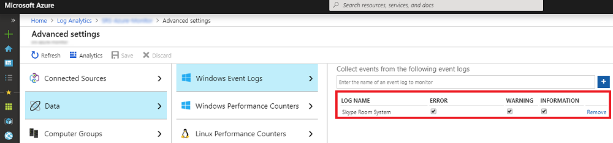

# <a name="deploy-no-loc-textmicrosoft-teams-rooms-management-with-no-loc-textazure-monitor"></a><span data-ttu-id="8b6b4-103">Implantar :::no-loc text="Microsoft Teams Rooms"::: gerenciamento com :::no-loc text="Azure Monitor":::</span><span class="sxs-lookup"><span data-stu-id="8b6b4-103">Deploy :::no-loc text="Microsoft Teams Rooms"::: management with :::no-loc text="Azure Monitor":::</span></span>

<span data-ttu-id="8b6b4-104">Este artigo aborda como configurar e implantar o gerenciamento integrado de ponta a ponta de dispositivos :::no-loc text="Microsoft Teams Rooms"::: :::no-loc text="Azure Monitor"::: usando.</span><span class="sxs-lookup"><span data-stu-id="8b6b4-104">This article discusses how to set up and deploy integrated, end-to-end management of :::no-loc text="Microsoft Teams Rooms"::: devices by using :::no-loc text="Azure Monitor":::.</span></span>

<span data-ttu-id="8b6b4-105">Você pode configurar para fornecer telemetria básica e :::no-loc text="Log Analytics"::: :::no-loc text="Azure Monitor"::: alertas que ajudarão você a gerenciar dispositivos :::no-loc text="Microsoft Teams Rooms"::: de sala de reunião.</span><span class="sxs-lookup"><span data-stu-id="8b6b4-105">You can configure :::no-loc text="Log Analytics"::: within :::no-loc text="Azure Monitor"::: to provide basic telemetry and alerts that will help you manage :::no-loc text="Microsoft Teams Rooms"::: meeting room devices.</span></span> <span data-ttu-id="8b6b4-106">À medida que sua solução de gerenciamento é madura, você pode decidir implantar recursos adicionais de gerenciamento e dados para criar uma visão mais detalhada da disponibilidade e do desempenho do dispositivo.</span><span class="sxs-lookup"><span data-stu-id="8b6b4-106">As your management solution matures, you might decide to deploy additional data and management capabilities to create a more detailed view of device availability and performance.</span></span>

<span data-ttu-id="8b6b4-107">Seguindo este guia, você pode usar um painel como o exemplo a seguir para obter relatórios de status detalhados sobre a disponibilidade do dispositivo, a saúde do aplicativo e do hardware e a distribuição de versão de aplicativos e sistema :::no-loc text="Microsoft Teams Rooms"::: operacional.</span><span class="sxs-lookup"><span data-stu-id="8b6b4-107">By following this guide, you can use a dashboard like the following example to get detailed status reporting for device availability, application and hardware health, and :::no-loc text="Microsoft Teams Rooms"::: application and operating system version distribution.</span></span>

<span data-ttu-id="8b6b4-108"></span><span class="sxs-lookup"><span data-stu-id="8b6b4-108"></span></span>

<span data-ttu-id="8b6b4-109">Em um nível superior, é necessário executar as seguintes tarefas:</span><span class="sxs-lookup"><span data-stu-id="8b6b4-109">At a high level, you need to perform the following tasks:</span></span>


1. [<span data-ttu-id="8b6b4-110">Validar :::no-loc text="Log Analytics"::: configuração</span><span class="sxs-lookup"><span data-stu-id="8b6b4-110">Validate :::no-loc text="Log Analytics"::: configuration</span></span>](azure-monitor-deploy.md#validate_LogAnalytics)
2. [<span data-ttu-id="8b6b4-111">Configurar dispositivos de teste para :::no-loc text="Log Analytics"::: configuração de gerenciamento</span><span class="sxs-lookup"><span data-stu-id="8b6b4-111">Configure test devices for :::no-loc text="Log Analytics"::: management setup</span></span>](azure-monitor-deploy.md#configure_test_devices)
3. [<span data-ttu-id="8b6b4-112">Mapear os campos personalizados</span><span class="sxs-lookup"><span data-stu-id="8b6b4-112">Map custom fields</span></span>](azure-monitor-deploy.md#Custom_fields)
4. [<span data-ttu-id="8b6b4-113">Definir os :::no-loc text="Microsoft Teams Rooms"::: exibições em :::no-loc text="Log Analytics":::</span><span class="sxs-lookup"><span data-stu-id="8b6b4-113">Define the :::no-loc text="Microsoft Teams Rooms"::: views in :::no-loc text="Log Analytics":::</span></span>](azure-monitor-deploy.md#Define_Views)
5. [<span data-ttu-id="8b6b4-114">Definir alertas</span><span class="sxs-lookup"><span data-stu-id="8b6b4-114">Define alerts</span></span>](azure-monitor-deploy.md#Alerts)
6. [<span data-ttu-id="8b6b4-115">Configurar todos os dispositivos para Monitoramento</span><span class="sxs-lookup"><span data-stu-id="8b6b4-115">Configure all devices for Monitoring</span></span>](azure-monitor-deploy.md#configure_all_devices)
7. [<span data-ttu-id="8b6b4-116">Configurar soluções :::no-loc text="Azure Monitor"::: adicionais</span><span class="sxs-lookup"><span data-stu-id="8b6b4-116">Configure additional :::no-loc text="Azure Monitor"::: solutions</span></span>](azure-monitor-deploy.md#Solutions)

> [!IMPORTANT]
> <span data-ttu-id="8b6b4-117">Embora com configuração mínima, possa monitorar um computador executando um sistema operacional, ainda existem algumas etapas específicas que você precisa executar antes de começar a implantar agentes em todos os :::no-loc text="Azure Monitor"::: :::no-loc text="Log Analytics"::: :::no-loc text="Windows"::: :::no-loc text="Microsoft Teams Rooms"::: :::no-loc text="Microsoft Teams Rooms"::: dispositivos.</span><span class="sxs-lookup"><span data-stu-id="8b6b4-117">Although with minimal configuration, :::no-loc text="Azure Monitor"::: :::no-loc text="Log Analytics"::: can monitor a computer running a :::no-loc text="Windows"::: operating system, there are still some :::no-loc text="Microsoft Teams Rooms":::–specific steps that you need to take before you start deploying agents to all :::no-loc text="Microsoft Teams Rooms"::: devices.</span></span>
> <span data-ttu-id="8b6b4-118">Portanto, é altamente recomendável executar todas as etapas de configuração na ordem certa para uma configuração e configuração controladas.</span><span class="sxs-lookup"><span data-stu-id="8b6b4-118">Therefore, we highly recommend you perform all configuration steps in the right order for a controlled setup and configuration.</span></span> <span data-ttu-id="8b6b4-119">A qualidade do resultado final depende muito da qualidade da configuração inicial.</span><span class="sxs-lookup"><span data-stu-id="8b6b4-119">The quality of the end result very much depends on the quality of the initial configuration.</span></span>

## <a name="validate-no-loc-textlog-analytics-configuration"></a><span data-ttu-id="8b6b4-120">Validar :::no-loc text="Log Analytics"::: configuração</span><span class="sxs-lookup"><span data-stu-id="8b6b4-120">Validate :::no-loc text="Log Analytics"::: configuration</span></span>
<span data-ttu-id="8b6b4-121"><a name="validate_LogAnalytics"> </a></span><span class="sxs-lookup"><span data-stu-id="8b6b4-121"><a name="validate_LogAnalytics"> </a></span></span>

<span data-ttu-id="8b6b4-122">Você precisa ter um espaço de trabalho para começar a :::no-loc text="Log Analytics"::: coletar logs de :::no-loc text="Microsoft Teams Rooms"::: dispositivos.</span><span class="sxs-lookup"><span data-stu-id="8b6b4-122">You need to have a :::no-loc text="Log Analytics"::: workspace to start collecting logs from :::no-loc text="Microsoft Teams Rooms"::: devices.</span></span> <span data-ttu-id="8b6b4-123">Um espaço de trabalho é um :::no-loc text="Log Analytics"::: ambiente exclusivo com seu próprio repositório de dados, fontes de dados e soluções.</span><span class="sxs-lookup"><span data-stu-id="8b6b4-123">A workspace is a unique :::no-loc text="Log Analytics"::: environment with its own data repository, data sources, and solutions.</span></span> <span data-ttu-id="8b6b4-124">Se você já tiver um espaço de trabalho existente, poderá usá-lo para monitorar sua implantação ou, como alternativa, criar um espaço de trabalho dedicado específico para suas necessidades :::no-loc text="Log Analytics"::: :::no-loc text="Microsoft Teams Rooms"::: de :::no-loc text="Log Analytics"::: :::no-loc text="Microsoft Teams Rooms"::: monitoramento.</span><span class="sxs-lookup"><span data-stu-id="8b6b4-124">If you already have an existing :::no-loc text="Log Analytics"::: workspace, you might use it to monitor your :::no-loc text="Microsoft Teams Rooms"::: deployment or alternatively, you can create a dedicated :::no-loc text="Log Analytics"::: workspace specific to your :::no-loc text="Microsoft Teams Rooms"::: monitoring needs.</span></span>

<span data-ttu-id="8b6b4-125">Se você precisar criar um novo espaço de trabalho, siga as instruções no artigo Criar um espaço :::no-loc text="Log Analytics"::: [de trabalho no :::no-loc text="Log Analytics"::: :::no-loc text="Azure"::: portal](https://docs.microsoft.com/azure/azure-monitor/learn/quick-create-workspace)</span><span class="sxs-lookup"><span data-stu-id="8b6b4-125">If you need to create a new :::no-loc text="Log Analytics"::: workspace, follow the instructions in the article [Create a :::no-loc text="Log Analytics"::: workspace in the :::no-loc text="Azure"::: portal](https://docs.microsoft.com/azure/azure-monitor/learn/quick-create-workspace)</span></span>

> [!NOTE]
> <span data-ttu-id="8b6b4-126">Para usar :::no-loc text="Log Analytics"::: :::no-loc text="Azure Monitor"::: com, você precisa ter uma assinatura :::no-loc text="Azure"::: ativa.</span><span class="sxs-lookup"><span data-stu-id="8b6b4-126">To use :::no-loc text="Log Analytics"::: with :::no-loc text="Azure Monitor":::, you need to have an active :::no-loc text="Azure"::: subscription.</span></span> <span data-ttu-id="8b6b4-127">Se você não tiver uma assinatura, poderá criar uma assinatura de avaliação :::no-loc text="Azure"::: [gratuita](https://azure.microsoft.com/free) como ponto de partida.</span><span class="sxs-lookup"><span data-stu-id="8b6b4-127">If you don't have an :::no-loc text="Azure"::: subscription, you can create [a free trial subscription](https://azure.microsoft.com/free) as a starting point.</span></span>

### <a name="configure-no-loc-textlog-analytics-to-collect-no-loc-textmicrosoft-teams-rooms-event-logs"></a><span data-ttu-id="8b6b4-128">Configurar :::no-loc text="Log Analytics"::: para coletar logs de :::no-loc text="Microsoft Teams Rooms"::: eventos</span><span class="sxs-lookup"><span data-stu-id="8b6b4-128">Configure :::no-loc text="Log Analytics"::: to collect :::no-loc text="Microsoft Teams Rooms"::: event logs</span></span>

<span data-ttu-id="8b6b4-129">:::no-loc text="Log Analytics"::: coleta apenas eventos dos :::no-loc text="Windows"::: logs de eventos especificados nas configurações.</span><span class="sxs-lookup"><span data-stu-id="8b6b4-129">:::no-loc text="Log Analytics"::: only collects events from the :::no-loc text="Windows"::: event logs that are specified in the settings.</span></span> <span data-ttu-id="8b6b4-130">Para cada log, somente os eventos com as gravidades selecionadas são coletados.</span><span class="sxs-lookup"><span data-stu-id="8b6b4-130">For each log, only the events with the selected severities are collected.</span></span>

<span data-ttu-id="8b6b4-131">Você precisa configurar para coletar os logs necessários para monitorar o status do :::no-loc text="Log Analytics"::: dispositivo e do :::no-loc text="Microsoft Teams Rooms"::: aplicativo.</span><span class="sxs-lookup"><span data-stu-id="8b6b4-131">You need to configure :::no-loc text="Log Analytics"::: to collect the logs required to monitor :::no-loc text="Microsoft Teams Rooms"::: device and application status.</span></span> <span data-ttu-id="8b6b4-132">:::no-loc text="Microsoft Teams Rooms"::: dispositivos usam o **:::no-loc text="Skype Room System":::** log de eventos.</span><span class="sxs-lookup"><span data-stu-id="8b6b4-132">:::no-loc text="Microsoft Teams Rooms"::: devices use the **:::no-loc text="Skype Room System":::** event log.</span></span>

<span data-ttu-id="8b6b4-133">Para configurar :::no-loc text="Log Analytics"::: para coletar os eventos, consulte fontes de dados :::no-loc text="Microsoft Teams Rooms"::: do log de eventos [ :::no-loc text="Windows"::: em :::no-loc text="Azure Monitor"::: ](https://docs.microsoft.com/azure/azure-monitor/platform/data-sources-windows-events)</span><span class="sxs-lookup"><span data-stu-id="8b6b4-133">To configure :::no-loc text="Log Analytics"::: to collect the :::no-loc text="Microsoft Teams Rooms"::: events, see [:::no-loc text="Windows"::: event log data sources in :::no-loc text="Azure Monitor":::](https://docs.microsoft.com/azure/azure-monitor/platform/data-sources-windows-events)</span></span>

<span data-ttu-id="8b6b4-134"></span><span class="sxs-lookup"><span data-stu-id="8b6b4-134"></span></span>

> [!IMPORTANT]
> <span data-ttu-id="8b6b4-135">Configure as configurações do Log de Eventos e insira como nome do log de eventos e marque as caixas de seleção Erro, Aviso :::no-loc text="Windows"::: **:::no-loc text="Skype Room System":::** e Informações.   </span><span class="sxs-lookup"><span data-stu-id="8b6b4-135">Configure :::no-loc text="Windows"::: Event Log settings and enter **:::no-loc text="Skype Room System":::** as event log name, and then select the **Error**, **Warning**, and **Information** check boxes.</span></span>

## <a name="configure-test-devices-for-azure-monitoring"></a><span data-ttu-id="8b6b4-136">Configurar dispositivos de teste para Monitoramento do Azure</span><span class="sxs-lookup"><span data-stu-id="8b6b4-136">Configure test devices for Azure Monitoring</span></span>
<span data-ttu-id="8b6b4-137"><a name="configure_test_devices"> </a></span><span class="sxs-lookup"><span data-stu-id="8b6b4-137"><a name="configure_test_devices"> </a></span></span>

<span data-ttu-id="8b6b4-138">Você precisa se :::no-loc text="Log Analytics"::: preparar para poder monitorar eventos :::no-loc text="Microsoft Teams Rooms"::: relacionados.</span><span class="sxs-lookup"><span data-stu-id="8b6b4-138">You need to prepare :::no-loc text="Log Analytics"::: to be able to monitor :::no-loc text="Microsoft Teams Rooms":::–related events.</span></span> <span data-ttu-id="8b6b4-139">Para começar, você precisa implantar agentes em apenas um ou dois dispositivos aos qual tem acesso físico, fazer com que esses dispositivos de teste gerem alguns dados e os pressionem para o espaço :::no-loc text="Microsoft Monitoring"::: :::no-loc text="Microsoft Teams Rooms"::: de :::no-loc text="Log Analytics"::: trabalho.</span><span class="sxs-lookup"><span data-stu-id="8b6b4-139">To start with, you need to deploy :::no-loc text="Microsoft Monitoring"::: agents to just one or two :::no-loc text="Microsoft Teams Rooms"::: devices that you have physical access to, and get those test devices generate some data and push it to the :::no-loc text="Log Analytics"::: workspace.</span></span>

### <a name="install-no-loc-textmicrosoft-monitoring-agents-to-test-devices"></a><span data-ttu-id="8b6b4-140">Instalar :::no-loc text="Microsoft Monitoring"::: agentes para testar dispositivos</span><span class="sxs-lookup"><span data-stu-id="8b6b4-140">Install :::no-loc text="Microsoft Monitoring"::: agents to test devices</span></span>

<span data-ttu-id="8b6b4-141">Implante o agente nos dispositivos de teste usando as instruções fornecidas :::no-loc text="Microsoft Monitoring"::: em Conectar [ :::no-loc text="Windows"::: computadores ao serviço :::no-loc text="Log Analytics"::: em :::no-loc text="Azure"::: ](https://docs.microsoft.com/azure/azure-monitor/platform/agent-windows).</span><span class="sxs-lookup"><span data-stu-id="8b6b4-141">Deploy the :::no-loc text="Microsoft Monitoring"::: agent to the test devices by using the instructions provided in [Connect :::no-loc text="Windows"::: computers to the :::no-loc text="Log Analytics"::: service in :::no-loc text="Azure":::](https://docs.microsoft.com/azure/azure-monitor/platform/agent-windows).</span></span> <span data-ttu-id="8b6b4-142">Este artigo fornece informações detalhadas sobre as etapas de implantação do Agente para, instruções para obter a ID do Espaço de Trabalho _ e a chave primária para conectar dispositivos à sua implantação e as etapas para verificar a conectividade do agente com a :::no-loc text="Microsoft Monitoring"::: :::no-loc text="Windows"::: :::no-loc text="Log Analytics":::  \* \*\* _\*\*_ :::no-loc text="Microsoft Teams Rooms"::: :::no-loc text="Azure Monitor"::: :::no-loc text="Log Analytics"::: instância.</span><span class="sxs-lookup"><span data-stu-id="8b6b4-142">This article provides detailed information about the steps for deploying :::no-loc text="Microsoft Monitoring"::: Agent for :::no-loc text="Windows":::, instructions for obtaining the :::no-loc text="Log Analytics"::: **_Workspace ID_* _ and the _*_primary key_\*_ to get :::no-loc text="Microsoft Teams Rooms"::: devices connected to your :::no-loc text="Azure Monitor"::: deployment, and steps to verify agent connectivity to :::no-loc text="Log Analytics"::: instance.</span></span>

### <a name="generate-sample-no-loc-textmicrosoft-teams-rooms-events"></a><span data-ttu-id="8b6b4-143">Gerar eventos de :::no-loc text="Microsoft Teams Rooms"::: exemplo</span><span class="sxs-lookup"><span data-stu-id="8b6b4-143">Generate sample :::no-loc text="Microsoft Teams Rooms"::: events</span></span>

<span data-ttu-id="8b6b4-144">Depois que :::no-loc text="Microsoft Monitoring"::: o agente for implantado nos dispositivos de teste, verifique se os dados de log de eventos necessários são coletados por :::no-loc text="Azure Monitor"::: .</span><span class="sxs-lookup"><span data-stu-id="8b6b4-144">After the :::no-loc text="Microsoft Monitoring"::: agent is deployed onto the test devices, verify that the required event log data is collected by :::no-loc text="Azure Monitor":::.</span></span>

> [!NOTE]
> <span data-ttu-id="8b6b4-145">Reinicie o dispositivo após a instalação do agente e certifique-se de que o aplicativo Reunião tenha começado, para que ele possa gerar novos eventos no Log :::no-loc text="Microsoft Monitoring"::: :::no-loc text="Microsoft Teams Rooms"::: de Eventos.</span><span class="sxs-lookup"><span data-stu-id="8b6b4-145">Reboot the device after the installation of the :::no-loc text="Microsoft Monitoring"::: agent, and make sure that :::no-loc text="Microsoft Teams Rooms"::: Meeting app is started, so that it can generate new events into the Event Log.</span></span>

1.  <span data-ttu-id="8b6b4-146">Entre no [ :::no-loc text="Microsoft Azure"::: portal e](https://portal.azure.com) acesse e :::no-loc text="Log Analytics"::: selecione seu espaço de trabalho.</span><span class="sxs-lookup"><span data-stu-id="8b6b4-146">Sign in to the [:::no-loc text="Microsoft Azure"::: portal](https://portal.azure.com) and go to :::no-loc text="Log Analytics"::: and select your workspace.</span></span>

2.  <span data-ttu-id="8b6b4-147">Listar os eventos de heartbeat gerados por um :::no-loc text="Microsoft Teams Rooms"::: dispositivo:</span><span class="sxs-lookup"><span data-stu-id="8b6b4-147">List the heartbeat events generated by a :::no-loc text="Microsoft Teams Rooms"::: device:</span></span>
    1.  <span data-ttu-id="8b6b4-148">Selecione seu espaço de trabalho e vá para _ *Logs*\* e use uma consulta para recuperar os registros de heartbeat que terão os campos personalizados para :::no-loc text="Microsoft Teams Rooms"::: .</span><span class="sxs-lookup"><span data-stu-id="8b6b4-148">Select your workspace and go to _ *Logs*\* and use a query to retrieve the heartbeat records that will have the custom fields for :::no-loc text="Microsoft Teams Rooms":::.</span></span>
    2.  <span data-ttu-id="8b6b4-149">Consulta de exemplo: `Event | where Source == "SRS-App" and EventID == 2000`</span><span class="sxs-lookup"><span data-stu-id="8b6b4-149">Sample query: `Event | where Source == "SRS-App" and EventID == 2000`</span></span>

3.  <span data-ttu-id="8b6b4-150">Certifique-se de que a consulta retorne registros de log que incluem eventos gerados pelo aplicativo :::no-loc text="Microsoft Teams Rooms"::: reuniões.</span><span class="sxs-lookup"><span data-stu-id="8b6b4-150">Make sure that the query returns log records that include events generated by the :::no-loc text="Microsoft Teams Rooms"::: meetings app.</span></span>

4.  <span data-ttu-id="8b6b4-151">Gere um problema de hardware e valide que os eventos necessários estão :::no-loc text="Azure Log Analytics"::: conectados.</span><span class="sxs-lookup"><span data-stu-id="8b6b4-151">Generate a hardware issue, and validate that the required events are logged in :::no-loc text="Azure Log Analytics":::.</span></span>
    1.  <span data-ttu-id="8b6b4-152">Desconectar um dos dispositivos periféricos no sistema de :::no-loc text="Microsoft Teams Rooms"::: teste.</span><span class="sxs-lookup"><span data-stu-id="8b6b4-152">Unplug one of the peripheral devices on the test :::no-loc text="Microsoft Teams Rooms"::: system.</span></span> <span data-ttu-id="8b6b4-153">Pode ser a câmera, o viva-voz, o microfone ou a tela da frente da sala</span><span class="sxs-lookup"><span data-stu-id="8b6b4-153">This could be the camera, speakerphone, microphone, or Front Room Display</span></span>
    2.  <span data-ttu-id="8b6b4-154">Aguarde 10 minutos para que o log de eventos seja :::no-loc text="Azure Log Analytics"::: preenchido.</span><span class="sxs-lookup"><span data-stu-id="8b6b4-154">Wait 10 minutes for the event log to be populated in :::no-loc text="Azure Log Analytics":::.</span></span>
    3.  <span data-ttu-id="8b6b4-155">Use uma consulta para listar eventos de erro de hardware: `Event | where Source == "SRS-App" and EventID == 3001`</span><span class="sxs-lookup"><span data-stu-id="8b6b4-155">Use a query to list hardware error events: `Event | where Source == "SRS-App" and EventID == 3001`</span></span>

5.  <span data-ttu-id="8b6b4-156">Gere um problema de aplicativo e valide que os eventos necessários estão registrados.</span><span class="sxs-lookup"><span data-stu-id="8b6b4-156">Generate an application issue, and validate that the required events are logged.</span></span>
    1.  <span data-ttu-id="8b6b4-157">Modifique :::no-loc text="Microsoft Teams Rooms"::: a configuração do aplicativo e digite um par de endereço/senha SIP (Session Initiation Protocol) incorreto.</span><span class="sxs-lookup"><span data-stu-id="8b6b4-157">Modify :::no-loc text="Microsoft Teams Rooms"::: application configuration, and type an incorrect Session Initiation Protocol (SIP) address/password pair.</span></span>
    2.  <span data-ttu-id="8b6b4-158">Aguarde 10 minutos para que o log de eventos seja :::no-loc text="Azure Log Analytics"::: preenchido.</span><span class="sxs-lookup"><span data-stu-id="8b6b4-158">Wait 10 minutes for the event log to be populated in :::no-loc text="Azure Log Analytics":::.</span></span>
    3.  <span data-ttu-id="8b6b4-159">Use uma consulta para listar eventos de erro do aplicativo: `Event | where Source == "SRS-App" and EventID == 2001 and EventLevel == 1`</span><span class="sxs-lookup"><span data-stu-id="8b6b4-159">Use a query to list application error events: `Event | where Source == "SRS-App" and EventID == 2001 and EventLevel == 1`</span></span>

> [!IMPORTANT]
> <span data-ttu-id="8b6b4-160">Esses logs de eventos de exemplo são necessários para que os campos personalizados possam ser configurados.</span><span class="sxs-lookup"><span data-stu-id="8b6b4-160">These sample event logs are required before custom fields can be configured.</span></span> <span data-ttu-id="8b6b4-161">Não prossiga para a próxima etapa até coletar os logs de eventos necessários.</span><span class="sxs-lookup"><span data-stu-id="8b6b4-161">Don't proceed to the next step until you have collected the required event logs.</span></span>

## <a name="map-custom-fields"></a><span data-ttu-id="8b6b4-162">Mapear os campos personalizados</span><span class="sxs-lookup"><span data-stu-id="8b6b4-162">Map custom fields</span></span>
<span data-ttu-id="8b6b4-163"><a name="Custom_fields"> </a></span><span class="sxs-lookup"><span data-stu-id="8b6b4-163"><a name="Custom_fields"> </a></span></span>

<span data-ttu-id="8b6b4-164">Use campos personalizados para extrair dados específicos dos logs de eventos.</span><span class="sxs-lookup"><span data-stu-id="8b6b4-164">You use custom fields to extract specific data from the event logs.</span></span> <span data-ttu-id="8b6b4-165">Você precisa definir campos personalizados que serão usados mais tarde com seus blocos, exibições de painel e alertas.</span><span class="sxs-lookup"><span data-stu-id="8b6b4-165">You need to define custom fields that will be used later with your tiles, dashboard views, and alerts.</span></span> <span data-ttu-id="8b6b4-166">Veja [os :::no-loc text="Log Analytics"::: campos Personalizados e](https://docs.microsoft.com/azure/azure-monitor/platform/custom-fields) familiarizar-se com os conceitos antes de começar a criar seus campos personalizados.</span><span class="sxs-lookup"><span data-stu-id="8b6b4-166">See [Custom fields in :::no-loc text="Log Analytics":::](https://docs.microsoft.com/azure/azure-monitor/platform/custom-fields) and become familiar with the concepts before you start creating your custom fields.</span></span>

<span data-ttu-id="8b6b4-167">Para extrair seus campos personalizados dos logs de eventos capturados, siga estas etapas:</span><span class="sxs-lookup"><span data-stu-id="8b6b4-167">To extract your custom fields out of the captured event logs, follow these steps:</span></span>

1.  <span data-ttu-id="8b6b4-168">Entre no [ :::no-loc text="Microsoft Azure"::: portal e](https://portal.azure.com) acesse e :::no-loc text="Log Analytics"::: selecione seu espaço de trabalho.</span><span class="sxs-lookup"><span data-stu-id="8b6b4-168">Sign in to the [:::no-loc text="Microsoft Azure"::: portal](https://portal.azure.com) and go to :::no-loc text="Log Analytics"::: and select your workspace.</span></span>

2. <span data-ttu-id="8b6b4-169">Listar os eventos gerados por um :::no-loc text="Microsoft Teams Rooms"::: dispositivo:</span><span class="sxs-lookup"><span data-stu-id="8b6b4-169">List the events generated by a :::no-loc text="Microsoft Teams Rooms"::: device:</span></span>
   1.  <span data-ttu-id="8b6b4-170">Vá para **Logs** e use uma consulta para recuperar os registros que terão o campo personalizado.</span><span class="sxs-lookup"><span data-stu-id="8b6b4-170">Go to **Logs** and use a query to retrieve the records that will have the custom field.</span></span>
   2.  <span data-ttu-id="8b6b4-171">Consulta de exemplo: `Event | where Source == "SRS-App" and EventID == 2000`</span><span class="sxs-lookup"><span data-stu-id="8b6b4-171">Sample query: `Event | where Source == "SRS-App" and EventID == 2000`</span></span>

3. <span data-ttu-id="8b6b4-172">Selecione um dos registros, selecione o botão à esquerda e inicie o assistente de extração de campo.</span><span class="sxs-lookup"><span data-stu-id="8b6b4-172">Select one of the records, select the button to the left, and start the field extraction wizard.</span></span>
4. <span data-ttu-id="8b6b4-173">Realça os dados que você gostaria de extrair da RenderizadaDescription e forneça um Título de Campo.</span><span class="sxs-lookup"><span data-stu-id="8b6b4-173">Highlight the data you'd like to extract from the RenderedDescription and provide a Field Title.</span></span> <span data-ttu-id="8b6b4-174">Os nomes dos campos que você deve usar são fornecidos na Tabela 1.</span><span class="sxs-lookup"><span data-stu-id="8b6b4-174">The field names that you should use are provided in Table 1.</span></span>
5. <span data-ttu-id="8b6b4-175">Use os mapeamentos mostrados *na Tabela 1.*</span><span class="sxs-lookup"><span data-stu-id="8b6b4-175">Use the mappings shown in *Table 1*.</span></span> <span data-ttu-id="8b6b4-176">:::no-loc text="Log Analytics":::anexarão automaticamente a **\_ cadeia de caracteres CF** quando você definir o novo campo.</span><span class="sxs-lookup"><span data-stu-id="8b6b4-176">:::no-loc text="Log Analytics"::: will automatically append the **\_CF** string when you define the new field.</span></span>

> [!IMPORTANT]
> <span data-ttu-id="8b6b4-177">Lembre-se de que todos os campos e JSON :::no-loc text="Log Analytics"::: são sensíveis a minúsculas.</span><span class="sxs-lookup"><span data-stu-id="8b6b4-177">Remember that all JSON and :::no-loc text="Log Analytics"::: fields are case-sensitive.</span></span>
> 
> <span data-ttu-id="8b6b4-178">Preste atenção às consultas necessárias para cada campo personalizado na tabela abaixo.</span><span class="sxs-lookup"><span data-stu-id="8b6b4-178">Pay attention to the queries required for each custom field in the table below.</span></span> <span data-ttu-id="8b6b4-179">Você precisa usar as consultas corretas para extrair com êxito valores :::no-loc text="Log Analytics"::: de campo personalizados.</span><span class="sxs-lookup"><span data-stu-id="8b6b4-179">You need to use the correct queries for :::no-loc text="Log Analytics"::: to successfully extract custom field values.</span></span>
> 
<span data-ttu-id="8b6b4-180">**Tabela 1**</span><span class="sxs-lookup"><span data-stu-id="8b6b4-180">**Table 1**</span></span>

| <span data-ttu-id="8b6b4-181">**Campo JSON**</span><span class="sxs-lookup"><span data-stu-id="8b6b4-181">**JSON field**</span></span>                   | <span data-ttu-id="8b6b4-182">**:::no-loc text="Log Analytics"::: campo personalizado**</span><span class="sxs-lookup"><span data-stu-id="8b6b4-182">**:::no-loc text="Log Analytics"::: custom field**</span></span> | <span data-ttu-id="8b6b4-183">**ID do evento**</span><span class="sxs-lookup"><span data-stu-id="8b6b4-183">**Event ID**</span></span> | <span data-ttu-id="8b6b4-184">**Consulta a ser usada com a extração**</span><span class="sxs-lookup"><span data-stu-id="8b6b4-184">**Query to use with the extraction**</span></span>                   |
|:---------------------------------|:-------------------------------|:-------------|:-------------------------------------------------------|
| <span data-ttu-id="8b6b4-185">Descrição</span><span class="sxs-lookup"><span data-stu-id="8b6b4-185">Description</span></span>                      | <span data-ttu-id="8b6b4-186">SRSEventDescription</span><span class="sxs-lookup"><span data-stu-id="8b6b4-186">SRSEventDescription</span></span>         | <span data-ttu-id="8b6b4-187">**2000**</span><span class="sxs-lookup"><span data-stu-id="8b6b4-187">**2000**</span></span>     | <span data-ttu-id="8b6b4-188">Evento \| em que Source == "SRS-App" e EventID == 2000</span><span class="sxs-lookup"><span data-stu-id="8b6b4-188">Event \| where Source == "SRS-App" and EventID == 2000</span></span> |
| <span data-ttu-id="8b6b4-189">ResourceState</span><span class="sxs-lookup"><span data-stu-id="8b6b4-189">ResourceState</span></span>                    | <span data-ttu-id="8b6b4-190">SRSResourceState</span><span class="sxs-lookup"><span data-stu-id="8b6b4-190">SRSResourceState</span></span>            | <span data-ttu-id="8b6b4-191">**2000**</span><span class="sxs-lookup"><span data-stu-id="8b6b4-191">**2000**</span></span>     | <span data-ttu-id="8b6b4-192">Evento \| em que Source == "SRS-App" e EventID == 2000</span><span class="sxs-lookup"><span data-stu-id="8b6b4-192">Event \| where Source == "SRS-App" and EventID == 2000</span></span> |
| <span data-ttu-id="8b6b4-193">OperationName</span><span class="sxs-lookup"><span data-stu-id="8b6b4-193">OperationName</span></span>                    | <span data-ttu-id="8b6b4-194">SRSOperationName</span><span class="sxs-lookup"><span data-stu-id="8b6b4-194">SRSOperationName</span></span>            | <span data-ttu-id="8b6b4-195">**2000**</span><span class="sxs-lookup"><span data-stu-id="8b6b4-195">**2000**</span></span>     | <span data-ttu-id="8b6b4-196">Evento \| em que Source == "SRS-App" e EventID == 2000</span><span class="sxs-lookup"><span data-stu-id="8b6b4-196">Event \| where Source == "SRS-App" and EventID == 2000</span></span> |
| <span data-ttu-id="8b6b4-197">OperationResult</span><span class="sxs-lookup"><span data-stu-id="8b6b4-197">OperationResult</span></span>                  | <span data-ttu-id="8b6b4-198">SRSOperationResult</span><span class="sxs-lookup"><span data-stu-id="8b6b4-198">SRSOperationResult</span></span>          | <span data-ttu-id="8b6b4-199">**2000**</span><span class="sxs-lookup"><span data-stu-id="8b6b4-199">**2000**</span></span>     | <span data-ttu-id="8b6b4-200">Evento \| em que Source == "SRS-App" e EventID == 2000</span><span class="sxs-lookup"><span data-stu-id="8b6b4-200">Event \| where Source == "SRS-App" and EventID == 2000</span></span> |
| <span data-ttu-id="8b6b4-201">Sistema operacional</span><span class="sxs-lookup"><span data-stu-id="8b6b4-201">OS</span></span>                               | <span data-ttu-id="8b6b4-202">SRSOSVersion</span><span class="sxs-lookup"><span data-stu-id="8b6b4-202">SRSOSVersion</span></span>                | <span data-ttu-id="8b6b4-203">**2000**</span><span class="sxs-lookup"><span data-stu-id="8b6b4-203">**2000**</span></span>     | <span data-ttu-id="8b6b4-204">Evento \| em que Source == "SRS-App" e EventID == 2000</span><span class="sxs-lookup"><span data-stu-id="8b6b4-204">Event \| where Source == "SRS-App" and EventID == 2000</span></span> |
| <span data-ttu-id="8b6b4-205">OSVersion</span><span class="sxs-lookup"><span data-stu-id="8b6b4-205">OSVersion</span></span>                        | <span data-ttu-id="8b6b4-206">SRSOSLongVersion</span><span class="sxs-lookup"><span data-stu-id="8b6b4-206">SRSOSLongVersion</span></span>            | <span data-ttu-id="8b6b4-207">**2000**</span><span class="sxs-lookup"><span data-stu-id="8b6b4-207">**2000**</span></span>     | <span data-ttu-id="8b6b4-208">Evento \| em que Source == "SRS-App" e EventID == 2000</span><span class="sxs-lookup"><span data-stu-id="8b6b4-208">Event \| where Source == "SRS-App" and EventID == 2000</span></span> |
| <span data-ttu-id="8b6b4-209">Alias</span><span class="sxs-lookup"><span data-stu-id="8b6b4-209">Alias</span></span>                            | <span data-ttu-id="8b6b4-210">SRSAlias</span><span class="sxs-lookup"><span data-stu-id="8b6b4-210">SRSAlias</span></span>                    | <span data-ttu-id="8b6b4-211">**2000**</span><span class="sxs-lookup"><span data-stu-id="8b6b4-211">**2000**</span></span>     | <span data-ttu-id="8b6b4-212">Evento \| em que Source == "SRS-App" e EventID == 2000</span><span class="sxs-lookup"><span data-stu-id="8b6b4-212">Event \| where Source == "SRS-App" and EventID == 2000</span></span> |
| <span data-ttu-id="8b6b4-213">DisplayName</span><span class="sxs-lookup"><span data-stu-id="8b6b4-213">DisplayName</span></span>                      | <span data-ttu-id="8b6b4-214">SRSDisplayName</span><span class="sxs-lookup"><span data-stu-id="8b6b4-214">SRSDisplayName</span></span>              | <span data-ttu-id="8b6b4-215">**2000**</span><span class="sxs-lookup"><span data-stu-id="8b6b4-215">**2000**</span></span>     | <span data-ttu-id="8b6b4-216">Evento \| em que Source == "SRS-App" e EventID == 2000</span><span class="sxs-lookup"><span data-stu-id="8b6b4-216">Event \| where Source == "SRS-App" and EventID == 2000</span></span> |
| <span data-ttu-id="8b6b4-217">AppVersion</span><span class="sxs-lookup"><span data-stu-id="8b6b4-217">AppVersion</span></span>                       | <span data-ttu-id="8b6b4-218">SRSAppVersion</span><span class="sxs-lookup"><span data-stu-id="8b6b4-218">SRSAppVersion</span></span>               | <span data-ttu-id="8b6b4-219">**2000**</span><span class="sxs-lookup"><span data-stu-id="8b6b4-219">**2000**</span></span>     | <span data-ttu-id="8b6b4-220">Evento \| em que Source == "SRS-App" e EventID == 2000</span><span class="sxs-lookup"><span data-stu-id="8b6b4-220">Event \| where Source == "SRS-App" and EventID == 2000</span></span> |
| <span data-ttu-id="8b6b4-221">IPv4Address</span><span class="sxs-lookup"><span data-stu-id="8b6b4-221">IPv4Address</span></span>                      | <span data-ttu-id="8b6b4-222">SRSIPv4Address</span><span class="sxs-lookup"><span data-stu-id="8b6b4-222">SRSIPv4Address</span></span>              | <span data-ttu-id="8b6b4-223">**2000**</span><span class="sxs-lookup"><span data-stu-id="8b6b4-223">**2000**</span></span>     | <span data-ttu-id="8b6b4-224">Evento \| em que Source == "SRS-App" e EventID == 2000</span><span class="sxs-lookup"><span data-stu-id="8b6b4-224">Event \| where Source == "SRS-App" and EventID == 2000</span></span> |
| <span data-ttu-id="8b6b4-225">IPv6Address</span><span class="sxs-lookup"><span data-stu-id="8b6b4-225">IPv6Address</span></span>                      | <span data-ttu-id="8b6b4-226">SRSIPv6Address</span><span class="sxs-lookup"><span data-stu-id="8b6b4-226">SRSIPv6Address</span></span>              | <span data-ttu-id="8b6b4-227">**2000**</span><span class="sxs-lookup"><span data-stu-id="8b6b4-227">**2000**</span></span>     | <span data-ttu-id="8b6b4-228">Evento \| em que Source == "SRS-App" e EventID == 2000</span><span class="sxs-lookup"><span data-stu-id="8b6b4-228">Event \| where Source == "SRS-App" and EventID == 2000</span></span> |
| <span data-ttu-id="8b6b4-229">Status do microfone de conferência</span><span class="sxs-lookup"><span data-stu-id="8b6b4-229">Conference Microphone status</span></span>     | <span data-ttu-id="8b6b4-230">SRSConfMicrophoneStatus</span><span class="sxs-lookup"><span data-stu-id="8b6b4-230">SRSConfMicrophoneStatus</span></span>     | <span data-ttu-id="8b6b4-231">**3001**</span><span class="sxs-lookup"><span data-stu-id="8b6b4-231">**3001**</span></span>     | <span data-ttu-id="8b6b4-232">Evento \| em que Source == "SRS-App" e EventID == 3001</span><span class="sxs-lookup"><span data-stu-id="8b6b4-232">Event \| where Source == "SRS-App" and EventID == 3001</span></span> |
| <span data-ttu-id="8b6b4-233">Status do orador de conferência</span><span class="sxs-lookup"><span data-stu-id="8b6b4-233">Conference Speaker status</span></span>        | <span data-ttu-id="8b6b4-234">SRSConfSpeakerStatus</span><span class="sxs-lookup"><span data-stu-id="8b6b4-234">SRSConfSpeakerStatus</span></span>        | <span data-ttu-id="8b6b4-235">**3001**</span><span class="sxs-lookup"><span data-stu-id="8b6b4-235">**3001**</span></span>     | <span data-ttu-id="8b6b4-236">Evento \| em que Source == "SRS-App" e EventID == 3001</span><span class="sxs-lookup"><span data-stu-id="8b6b4-236">Event \| where Source == "SRS-App" and EventID == 3001</span></span> |
| <span data-ttu-id="8b6b4-237">Status padrão do alto-falante</span><span class="sxs-lookup"><span data-stu-id="8b6b4-237">Default Speaker status</span></span>           | <span data-ttu-id="8b6b4-238">SRSDefaultSpeakerStatus</span><span class="sxs-lookup"><span data-stu-id="8b6b4-238">SRSDefaultSpeakerStatus</span></span>     | <span data-ttu-id="8b6b4-239">**3001**</span><span class="sxs-lookup"><span data-stu-id="8b6b4-239">**3001**</span></span>     | <span data-ttu-id="8b6b4-240">Evento \| em que Source == "SRS-App" e EventID == 3001</span><span class="sxs-lookup"><span data-stu-id="8b6b4-240">Event \| where Source == "SRS-App" and EventID == 3001</span></span> |
| <span data-ttu-id="8b6b4-241">Status da câmera</span><span class="sxs-lookup"><span data-stu-id="8b6b4-241">Camera status</span></span>                    | <span data-ttu-id="8b6b4-242">SRSCameraStatus</span><span class="sxs-lookup"><span data-stu-id="8b6b4-242">SRSCameraStatus</span></span>             | <span data-ttu-id="8b6b4-243">**3001**</span><span class="sxs-lookup"><span data-stu-id="8b6b4-243">**3001**</span></span>     | <span data-ttu-id="8b6b4-244">Evento \| em que Source == "SRS-App" e EventID == 3001</span><span class="sxs-lookup"><span data-stu-id="8b6b4-244">Event \| where Source == "SRS-App" and EventID == 3001</span></span> |
| <span data-ttu-id="8b6b4-245">Status de Exibição da Frente da Sala</span><span class="sxs-lookup"><span data-stu-id="8b6b4-245">Front of Room Display status</span></span>     | <span data-ttu-id="8b6b4-246">SRSFORDStatus</span><span class="sxs-lookup"><span data-stu-id="8b6b4-246">SRSFORDStatus</span></span>               | <span data-ttu-id="8b6b4-247">**3001**</span><span class="sxs-lookup"><span data-stu-id="8b6b4-247">**3001**</span></span>     | <span data-ttu-id="8b6b4-248">Evento \| em que Source == "SRS-App" e EventID == 3001</span><span class="sxs-lookup"><span data-stu-id="8b6b4-248">Event \| where Source == "SRS-App" and EventID == 3001</span></span> |
| <span data-ttu-id="8b6b4-249">Status do sensor de movimento</span><span class="sxs-lookup"><span data-stu-id="8b6b4-249">Motion Sensor status</span></span>             | <span data-ttu-id="8b6b4-250">SRS ElesensorStatus</span><span class="sxs-lookup"><span data-stu-id="8b6b4-250">SRSMotionSensorStatus</span></span>       | <span data-ttu-id="8b6b4-251">**3001**</span><span class="sxs-lookup"><span data-stu-id="8b6b4-251">**3001**</span></span>     | <span data-ttu-id="8b6b4-252">Evento \| em que Source == "SRS-App" e EventID == 3001</span><span class="sxs-lookup"><span data-stu-id="8b6b4-252">Event \| where Source == "SRS-App" and EventID == 3001</span></span> |
| <span data-ttu-id="8b6b4-253">Status hdmi ingest</span><span class="sxs-lookup"><span data-stu-id="8b6b4-253">HDMI Ingest status</span></span>               | <span data-ttu-id="8b6b4-254">SRSHDMIIngestStatus</span><span class="sxs-lookup"><span data-stu-id="8b6b4-254">SRSHDMIIngestStatus</span></span>         | <span data-ttu-id="8b6b4-255">**3001**</span><span class="sxs-lookup"><span data-stu-id="8b6b4-255">**3001**</span></span>     | <span data-ttu-id="8b6b4-256">Evento \| em que Source == "SRS-App" e EventID == 3001</span><span class="sxs-lookup"><span data-stu-id="8b6b4-256">Event \| where Source == "SRS-App" and EventID == 3001</span></span> |


## <a name="define-the-no-loc-textmicrosoft-teams-rooms-views-in-no-loc-textlog-analytics"></a><span data-ttu-id="8b6b4-257">Definir os :::no-loc text="Microsoft Teams Rooms"::: exibições em :::no-loc text="Log Analytics":::</span><span class="sxs-lookup"><span data-stu-id="8b6b4-257">Define the :::no-loc text="Microsoft Teams Rooms"::: views in :::no-loc text="Log Analytics":::</span></span>
<span data-ttu-id="8b6b4-258"><a name="Define_Views"> </a></span><span class="sxs-lookup"><span data-stu-id="8b6b4-258"><a name="Define_Views"> </a></span></span>

<span data-ttu-id="8b6b4-259">Depois que os dados são coletados e os campos personalizados são mapeados, você pode usar o Designer de Exibição para desenvolver um painel que contém vários blocos para monitorar :::no-loc text="Microsoft Teams Rooms"::: eventos.</span><span class="sxs-lookup"><span data-stu-id="8b6b4-259">After data is collected and custom fields are mapped, you can use View Designer to develop a dashboard containing various tiles to monitor :::no-loc text="Microsoft Teams Rooms"::: events.</span></span> <span data-ttu-id="8b6b4-260">Use o Designer de Exibição para criar os blocos a seguir.</span><span class="sxs-lookup"><span data-stu-id="8b6b4-260">Use View Designer to create the following tiles.</span></span> <span data-ttu-id="8b6b4-261">Para obter mais informações, consulte [Criar :::no-loc text="Log Analytics"::: exibições personalizadas usando o Designer de Exibição em](https://docs.microsoft.com/azure/azure-monitor/platform/view-designer)</span><span class="sxs-lookup"><span data-stu-id="8b6b4-261">For more information, see [Create custom views by using View Designer in :::no-loc text="Log Analytics":::](https://docs.microsoft.com/azure/azure-monitor/platform/view-designer)</span></span>

> [!NOTE]
> <span data-ttu-id="8b6b4-262">As etapas anteriores neste guia devem ter sido concluídas para que os blocos de painel funcionem corretamente.</span><span class="sxs-lookup"><span data-stu-id="8b6b4-262">Previous steps in this guide should have been completed for the dashboard tiles to work properly.</span></span>

### <a name="create-a-microsoft-teams-rooms-dashboard-by-using-the-import-method"></a><span data-ttu-id="8b6b4-263">Criar um painel de Salas do Microsoft Teams usando o método de importação</span><span class="sxs-lookup"><span data-stu-id="8b6b4-263">Create a Microsoft Teams Rooms dashboard by using the import method</span></span>

<span data-ttu-id="8b6b4-264">Você pode importar um :::no-loc text="Microsoft Teams Rooms"::: painel e começar a monitorar seus dispositivos rapidamente.</span><span class="sxs-lookup"><span data-stu-id="8b6b4-264">You can import an :::no-loc text="Microsoft Teams Rooms"::: dashboard and start monitoring your devices quickly.</span></span> <span data-ttu-id="8b6b4-265">Tome as seguintes etapas para importar o painel:</span><span class="sxs-lookup"><span data-stu-id="8b6b4-265">Take the following steps to import the dashboard:</span></span>

1.  <span data-ttu-id="8b6b4-266">Obter o [arquivo SkypeRoomSystems_v2.omsview](https://go.microsoft.com/fwlink/?linkid=835675) dashboard.</span><span class="sxs-lookup"><span data-stu-id="8b6b4-266">Get the [SkypeRoomSystems_v2.omsview](https://go.microsoft.com/fwlink/?linkid=835675) dashboard file.</span></span>
2.  <span data-ttu-id="8b6b4-267">Entre no [ :::no-loc text="Microsoft Azure"::: portal e](https://portal.azure.com) acesse e :::no-loc text="Log Analytics"::: selecione seu espaço de trabalho.</span><span class="sxs-lookup"><span data-stu-id="8b6b4-267">Sign in to the [:::no-loc text="Microsoft Azure"::: portal](https://portal.azure.com) and go to :::no-loc text="Log Analytics"::: and select your workspace.</span></span>
3.  <span data-ttu-id="8b6b4-268">Abra **o Designer de Exibição.**</span><span class="sxs-lookup"><span data-stu-id="8b6b4-268">Open **View Designer**.</span></span>
4.  <span data-ttu-id="8b6b4-269">Selecione **Importar** e, em seguida, selecione o **arquivo SkypeRoomSystems_v2.omsview.**</span><span class="sxs-lookup"><span data-stu-id="8b6b4-269">Select **Import**, and then select the **SkypeRoomSystems_v2.omsview** file.</span></span>
5.  <span data-ttu-id="8b6b4-270">Selecione **Salvar**.</span><span class="sxs-lookup"><span data-stu-id="8b6b4-270">Select **Save**.</span></span>

### <a name="create-a-microsoft-teams-rooms-dashboard-manually"></a><span data-ttu-id="8b6b4-271">Criar um painel de Salas do Microsoft Teams manualmente</span><span class="sxs-lookup"><span data-stu-id="8b6b4-271">Create a Microsoft Teams Rooms dashboard manually</span></span>

<span data-ttu-id="8b6b4-272">Como alternativa, você pode criar seu próprio painel e adicionar apenas os blocos que deseja monitorar.</span><span class="sxs-lookup"><span data-stu-id="8b6b4-272">Alternatively, you can create your own dashboard and add only the tiles that you wish to monitor.</span></span>

#### <a name="configure-the-overview-tile"></a><span data-ttu-id="8b6b4-273">Configurar o Conjunto de Visão Geral</span><span class="sxs-lookup"><span data-stu-id="8b6b4-273">Configure the Overview Tile</span></span>

1.  <span data-ttu-id="8b6b4-274">Abra **o Designer de Exibição.**</span><span class="sxs-lookup"><span data-stu-id="8b6b4-274">Open **View Designer**.</span></span>
2.  <span data-ttu-id="8b6b4-275">Selecione **o Grupo Visão Geral** e, em **seguida, selecione Dois números** na galeria.</span><span class="sxs-lookup"><span data-stu-id="8b6b4-275">Select **Overview Tile**, and then select **Two numbers** from the gallery.</span></span>
3.  <span data-ttu-id="8b6b4-276">Nomeia o **:::no-loc text="Microsoft Teams Rooms":::** telha.</span><span class="sxs-lookup"><span data-stu-id="8b6b4-276">Name the tile **:::no-loc text="Microsoft Teams Rooms":::**.</span></span>
4.  <span data-ttu-id="8b6b4-277">Definir o **Primeiro Tile:**</span><span class="sxs-lookup"><span data-stu-id="8b6b4-277">Define the **First Tile**:</span></span><br>
    <span data-ttu-id="8b6b4-278">**Legenda:** Dispositivos que enviaram um coração pelo menos uma vez no último mês</span><span class="sxs-lookup"><span data-stu-id="8b6b4-278">**Legend:** Devices that sent a heartbeat at least once within the last month</span></span><br>
    <span data-ttu-id="8b6b4-279">**Consulta:**```Event | where EventLog == "Skype Room System" and TimeGenerated > ago(30d) | summarize TotalSRSDevices = dcount(Computer)```</span><span class="sxs-lookup"><span data-stu-id="8b6b4-279">**Query:** ```Event | where EventLog == "Skype Room System" and TimeGenerated > ago(30d) | summarize TotalSRSDevices = dcount(Computer)```</span></span>
5.  <span data-ttu-id="8b6b4-280">Definir o **Segundo Peças:**</span><span class="sxs-lookup"><span data-stu-id="8b6b4-280">Define the **Second Tile**:</span></span><br>
    <span data-ttu-id="8b6b4-281">**Legenda:** Dispositivos ativos que enviaram um coração na última hora</span><span class="sxs-lookup"><span data-stu-id="8b6b4-281">**Legend:** Active devices that sent a heartbeat within the last hour</span></span><br>
    <span data-ttu-id="8b6b4-282">**Consulta:**```Event | where EventLog == "Skype Room System" and SRSOperationName_CF == "Heartbeat" and TimeGenerated > ago(1h) | summarize TotalSRSDevices = dcount(Computer)```</span><span class="sxs-lookup"><span data-stu-id="8b6b4-282">**Query:** ```Event | where EventLog == "Skype Room System" and SRSOperationName_CF == "Heartbeat" and TimeGenerated > ago(1h) | summarize TotalSRSDevices = dcount(Computer)```</span></span>
6.  <span data-ttu-id="8b6b4-283">Selecione **Aplicar.**</span><span class="sxs-lookup"><span data-stu-id="8b6b4-283">Select **Apply**.</span></span>

### <a name="create-a-tile-that-displays-active-devices"></a><span data-ttu-id="8b6b4-284">Criar um papel que exibe dispositivos ativos</span><span class="sxs-lookup"><span data-stu-id="8b6b4-284">Create a tile that displays active devices</span></span>

1.  <span data-ttu-id="8b6b4-285">Selecione **Exibir Painel** para começar a adicionar seus blocos.</span><span class="sxs-lookup"><span data-stu-id="8b6b4-285">Select **View Dashboard** to start adding your tiles.</span></span>
2.  <span data-ttu-id="8b6b4-286">Selecione **Número & lista** na galeria</span><span class="sxs-lookup"><span data-stu-id="8b6b4-286">Select **Number & list** from the gallery</span></span>
3.  <span data-ttu-id="8b6b4-287">Defina as **propriedades** Gerais:</span><span class="sxs-lookup"><span data-stu-id="8b6b4-287">Define the **General** properties:</span></span><br>
    <span data-ttu-id="8b6b4-288">**Título do Grupo:** Heartbeat Status</span><span class="sxs-lookup"><span data-stu-id="8b6b4-288">**Group Title:** Heartbeat Status</span></span><br>
    <span data-ttu-id="8b6b4-289">**Novo Grupo:** Selecionado</span><span class="sxs-lookup"><span data-stu-id="8b6b4-289">**New Group:** Selected</span></span>
4.  <span data-ttu-id="8b6b4-290">Defina **as propriedades do Tile:**</span><span class="sxs-lookup"><span data-stu-id="8b6b4-290">Define the **Tile** properties:</span></span><br>
    <span data-ttu-id="8b6b4-291">**Legenda:** Dispositivos ativos (heartbeat enviado nos últimos 20 minutos)</span><span class="sxs-lookup"><span data-stu-id="8b6b4-291">**Legend:** Active devices (heartbeat sent in the last 20 minutes)</span></span><br>
    <span data-ttu-id="8b6b4-292">**Consulta de bloco:** ```Event | where EventLog == "Skype Room System" and SRSOperationName_CF == "Heartbeat" and TimeGenerated > ago(20m) | summarize AggregatedValue = count() by Computer | count```</span><span class="sxs-lookup"><span data-stu-id="8b6b4-292">**Tile Query:** ```Event | where EventLog == "Skype Room System" and SRSOperationName_CF == "Heartbeat" and TimeGenerated > ago(20m) | summarize AggregatedValue = count() by Computer | count```</span></span>
5.  <span data-ttu-id="8b6b4-293">Defina as **propriedades da** lista:</span><span class="sxs-lookup"><span data-stu-id="8b6b4-293">Define the **List** properties:</span></span><br>
    <span data-ttu-id="8b6b4-294">**Consulta de Lista:**```Event | where EventLog == "Skype Room System" and SRSOperationName_CF == "Heartbeat" and TimeGenerated > ago(20m) | summarize TimeGenerated = max(TimeGenerated) by Computer | order by TimeGenerated```</span><span class="sxs-lookup"><span data-stu-id="8b6b4-294">**List Query:** ```Event | where EventLog == "Skype Room System" and SRSOperationName_CF == "Heartbeat" and TimeGenerated > ago(20m) | summarize TimeGenerated = max(TimeGenerated) by Computer | order by TimeGenerated```</span></span>
6.  <span data-ttu-id="8b6b4-295">Definir **Títulos de Coluna:**</span><span class="sxs-lookup"><span data-stu-id="8b6b4-295">Define **Column Titles**:</span></span><br>
    <span data-ttu-id="8b6b4-296">**Nome:** Nome do Computador</span><span class="sxs-lookup"><span data-stu-id="8b6b4-296">**Name:** Computer Name</span></span><br>
    <span data-ttu-id="8b6b4-297">**Valor:** Last Heartbeat</span><span class="sxs-lookup"><span data-stu-id="8b6b4-297">**Value:** Last Heartbeat</span></span>
7.  <span data-ttu-id="8b6b4-298">Definir **Consulta de Navegação.**</span><span class="sxs-lookup"><span data-stu-id="8b6b4-298">Define **Navigation Query**.</span></span><br>
    ```search {selected item} | where EventLog == "Skype Room System" and SRSOperationName_CF == "Heartbeat" | summarize arg_max(TimeGenerated, *) by Computer | project TimeGenerated, Computer, SRSAlias_CF, SRSAppVersion_CF, SRSOSVersion_CF, SRSOSLongVersion_CF, SRSIPv4Address_CF, SRSIPv6Address_CF, SRSOperationName_CF, SRSOperationResult_CF, SRSResourceState_CF, SRSEventDescription_CF```
8.  <span data-ttu-id="8b6b4-299">Selecione **Aplicar** e, em seguida, **Fechar.**</span><span class="sxs-lookup"><span data-stu-id="8b6b4-299">Select **Apply**, and then **Close**.</span></span>

### <a name="create-a-tile-that-displays-devices-that-have-connectivity-issues"></a><span data-ttu-id="8b6b4-300">Criar um telha que exibe dispositivos com problemas de conectividade</span><span class="sxs-lookup"><span data-stu-id="8b6b4-300">Create a tile that displays devices that have connectivity issues</span></span>

1.  <span data-ttu-id="8b6b4-301">Selecione **Número & lista** da galeria e, em seguida, adicione um novo grupo.</span><span class="sxs-lookup"><span data-stu-id="8b6b4-301">Select **Number & list** from the gallery, and then add a new tile.</span></span>
2.  <span data-ttu-id="8b6b4-302">Defina as **propriedades** Gerais:</span><span class="sxs-lookup"><span data-stu-id="8b6b4-302">Define the **General** properties:</span></span><br>
    <span data-ttu-id="8b6b4-303">**Título do Grupo:** Sair vazio</span><span class="sxs-lookup"><span data-stu-id="8b6b4-303">**Group Title:** Leave empty</span></span><br>
    <span data-ttu-id="8b6b4-304">**Novo Grupo:** Não Selecionado</span><span class="sxs-lookup"><span data-stu-id="8b6b4-304">**New Group:** Not Selected</span></span>
3.  <span data-ttu-id="8b6b4-305">Defina **as propriedades do Tile:**</span><span class="sxs-lookup"><span data-stu-id="8b6b4-305">Define the **Tile** properties:</span></span><br>
    <span data-ttu-id="8b6b4-306">**Legenda:** Dispositivos inativos (nenhuma mensagem de coração enviada nos últimos 20 minutos)</span><span class="sxs-lookup"><span data-stu-id="8b6b4-306">**Legend:** Inactive Devices (no heartbeat message sent in the last 20 minutes)</span></span><br>
    <span data-ttu-id="8b6b4-307">**Consulta de bloco:** ```Event | where EventLog == "Skype Room System" and SRSOperationName_CF == "Heartbeat" | summarize LastHB = max(TimeGenerated) by Computer | where LastHB < ago(20m) | count```</span><span class="sxs-lookup"><span data-stu-id="8b6b4-307">**Tile Query:** ```Event | where EventLog == "Skype Room System" and SRSOperationName_CF == "Heartbeat" | summarize LastHB = max(TimeGenerated) by Computer | where LastHB < ago(20m) | count```</span></span>
4.  <span data-ttu-id="8b6b4-308">Defina as **propriedades da** lista:</span><span class="sxs-lookup"><span data-stu-id="8b6b4-308">Define the **List** properties:</span></span><br>
    <span data-ttu-id="8b6b4-309">**Consulta de Lista:**```Event | where EventLog == "Skype Room System" and SRSOperationName_CF == "Heartbeat" | summarize TimeGenerated = max(TimeGenerated) by Computer | where TimeGenerated < ago(20m) | order by TimeGenerated```</span><span class="sxs-lookup"><span data-stu-id="8b6b4-309">**List Query:** ```Event | where EventLog == "Skype Room System" and SRSOperationName_CF == "Heartbeat" | summarize TimeGenerated = max(TimeGenerated) by Computer | where TimeGenerated < ago(20m) | order by TimeGenerated```</span></span>
5.  <span data-ttu-id="8b6b4-310">Definir **Títulos de Coluna:**</span><span class="sxs-lookup"><span data-stu-id="8b6b4-310">Define **Column Titles**:</span></span><br>
    <span data-ttu-id="8b6b4-311">**Nome:** Nome do Computador</span><span class="sxs-lookup"><span data-stu-id="8b6b4-311">**Name:** Computer Name</span></span><br>
    <span data-ttu-id="8b6b4-312">**Valor:** Last Heartbeat</span><span class="sxs-lookup"><span data-stu-id="8b6b4-312">**Value:** Last Heartbeat</span></span>
6.  <span data-ttu-id="8b6b4-313">Definir **Consulta de Navegação:**</span><span class="sxs-lookup"><span data-stu-id="8b6b4-313">Define **Navigation Query**:</span></span><br>
    ```search {selected item} | where EventLog == "Skype Room System" and SRSOperationName_CF == "Heartbeat" | summarize arg_max(TimeGenerated, *) by Computer | project TimeGenerated, Computer, SRSAlias_CF, SRSAppVersion_CF, SRSOSVersion_CF, SRSOSLongVersion_CF, SRSIPv4Address_CF, SRSIPv6Address_CF, SRSOperationName_CF, SRSOperationResult_CF, SRSResourceState_CF, SRSEventDescription_CF```
7.  <span data-ttu-id="8b6b4-314">Selecione **Aplicar** e, em seguida, **Fechar.**</span><span class="sxs-lookup"><span data-stu-id="8b6b4-314">Select **Apply**, and then **Close**.</span></span>

### <a name="create-a-tile-that-displays-devices-that-have-a-hardware-error"></a><span data-ttu-id="8b6b4-315">Criar um telha que exibe dispositivos que têm um erro de hardware</span><span class="sxs-lookup"><span data-stu-id="8b6b4-315">Create a tile that displays devices that have a hardware error</span></span>

1.  <span data-ttu-id="8b6b4-316">Selecione **Número & lista** da galeria e, em seguida, adicione um novo grupo.</span><span class="sxs-lookup"><span data-stu-id="8b6b4-316">Select **Number & list** from the gallery, and then add a new tile.</span></span>
2.  <span data-ttu-id="8b6b4-317">Defina as **propriedades** Gerais:</span><span class="sxs-lookup"><span data-stu-id="8b6b4-317">Define the **General** properties:</span></span><br>
    <span data-ttu-id="8b6b4-318">**Título do Grupo:** Hardware Status</span><span class="sxs-lookup"><span data-stu-id="8b6b4-318">**Group Title:** Hardware Status</span></span><br>
    <span data-ttu-id="8b6b4-319">**Novo Grupo:** Selecionado</span><span class="sxs-lookup"><span data-stu-id="8b6b4-319">**New Group:** Selected</span></span>
3.  <span data-ttu-id="8b6b4-320">Defina **as propriedades do Tile:**</span><span class="sxs-lookup"><span data-stu-id="8b6b4-320">Define the **Tile** properties:</span></span><br>
    <span data-ttu-id="8b6b4-321">**Legenda:** Dispositivos que tiveram um erro de hardware na última hora</span><span class="sxs-lookup"><span data-stu-id="8b6b4-321">**Legend:** Devices that experienced a hardware error in the last hour</span></span><br>
    <span data-ttu-id="8b6b4-322">**Consulta de bloco:** ```Event | where EventLog == "Skype Room System" and EventLevelName == "Error" and EventID == "3001" and TimeGenerated > ago(1h) | summarize AggregatedValue = count() by Computer | count```</span><span class="sxs-lookup"><span data-stu-id="8b6b4-322">**Tile Query:** ```Event | where EventLog == "Skype Room System" and EventLevelName == "Error" and EventID == "3001" and TimeGenerated > ago(1h) | summarize AggregatedValue = count() by Computer | count```</span></span>
4.  <span data-ttu-id="8b6b4-323">Defina as **propriedades da** lista:</span><span class="sxs-lookup"><span data-stu-id="8b6b4-323">Define the **List** properties:</span></span><br>
    <span data-ttu-id="8b6b4-324">**Consulta de Lista:**```Event | where EventLog == "Skype Room System" and EventLevelName == "Error" and EventID == "3001" and TimeGenerated > ago(1h) | summarize TimeGenerated = max(TimeGenerated) by Computer | order by TimeGenerated```</span><span class="sxs-lookup"><span data-stu-id="8b6b4-324">**List Query:** ```Event | where EventLog == "Skype Room System" and EventLevelName == "Error" and EventID == "3001" and TimeGenerated > ago(1h) | summarize TimeGenerated = max(TimeGenerated) by Computer | order by TimeGenerated```</span></span>
5.  <span data-ttu-id="8b6b4-325">Definir **Títulos de Coluna:**</span><span class="sxs-lookup"><span data-stu-id="8b6b4-325">Define **Column Titles**:</span></span><br>
    <span data-ttu-id="8b6b4-326">**Nome:** Nome do Computador</span><span class="sxs-lookup"><span data-stu-id="8b6b4-326">**Name:** Computer Name</span></span><br>
    <span data-ttu-id="8b6b4-327">**Valor:** Último Erro</span><span class="sxs-lookup"><span data-stu-id="8b6b4-327">**Value:** Last Error</span></span>
6.  <span data-ttu-id="8b6b4-328">Definir **Consulta de Navegação:**</span><span class="sxs-lookup"><span data-stu-id="8b6b4-328">Define **Navigation Query**:</span></span><br>
    ```search {selected item} | where EventLog == "Skype Room System" and EventID == 3001 and EventLevelName == "Error" | summarize arg_max(TimeGenerated, *) by Computer | project TimeGenerated, Computer, SRSAlias_CF, SRSAppVersion_CF, SRSOSVersion_CF, SRSOSLongVersion_CF, SRSIPv4Address_CF, SRSIPv6Address_CF, SRSOperationName_CF, SRSOperationResult_CF, SRSResourceState_CF, SRSConfMicrophoneStatus_CF, SRSConfSpeakerStatus_CF, SRSDefaultSpeakerStatus_CF, SRSCameraStatus_CF, SRSFORDStatus_CF, SRSMotionSensorStatus_CF, SRSHDMIIngestStatus_CF, SRSEventDescription_CF | sort by TimeGenerated desc```
7.  <span data-ttu-id="8b6b4-329">Selecione **Aplicar** e, em seguida, **Fechar.**</span><span class="sxs-lookup"><span data-stu-id="8b6b4-329">Select **Apply**, and then **Close**.</span></span>

### <a name="create-a-tile-that-displays-no-loc-textmicrosoft-teams-rooms-operating-system-versions"></a><span data-ttu-id="8b6b4-330">Criar um telha que exibe versões :::no-loc text="Microsoft Teams Rooms"::: do Sistema Operacional</span><span class="sxs-lookup"><span data-stu-id="8b6b4-330">Create a tile that displays :::no-loc text="Microsoft Teams Rooms"::: Operating System versions</span></span>

1.  <span data-ttu-id="8b6b4-331">Selecione **Rosca & lista** da galeria e, em seguida, adicione um novo telha.</span><span class="sxs-lookup"><span data-stu-id="8b6b4-331">Select **Donut & list** from the gallery, and then add a new tile.</span></span>
2.  <span data-ttu-id="8b6b4-332">Defina as **propriedades** Gerais:</span><span class="sxs-lookup"><span data-stu-id="8b6b4-332">Define the **General** properties:</span></span><br>
    <span data-ttu-id="8b6b4-333">**Título do Grupo:** Detalhes do sistema operacional</span><span class="sxs-lookup"><span data-stu-id="8b6b4-333">**Group Title:** Operating System details</span></span><br>
    <span data-ttu-id="8b6b4-334">**Novo Grupo:** Selecionado</span><span class="sxs-lookup"><span data-stu-id="8b6b4-334">**New Group:** Selected</span></span>
3.  <span data-ttu-id="8b6b4-335">Defina as **propriedades do Header:**</span><span class="sxs-lookup"><span data-stu-id="8b6b4-335">Define the **Header** properties:</span></span><br>
    <span data-ttu-id="8b6b4-336">**Título:** Versões do sistema operacional</span><span class="sxs-lookup"><span data-stu-id="8b6b4-336">**Title:** Operating System versions</span></span><br>
    <span data-ttu-id="8b6b4-337">**Subtítulo:** Dispositivos executando versões específicas do sistema operacional</span><span class="sxs-lookup"><span data-stu-id="8b6b4-337">**Subtitle:** Devices running specific OS versions</span></span>
4.  <span data-ttu-id="8b6b4-338">Defina as **propriedades do rosca:**</span><span class="sxs-lookup"><span data-stu-id="8b6b4-338">Define the **Donut** properties:</span></span><br>
    <span data-ttu-id="8b6b4-339">**Consulta:**```Event | where EventLog == "Skype Room System" and SRSOperationName_CF == "Heartbeat" | summarize OS_Version = max(SRSOSLongVersion_CF) by Computer | summarize AggregatedValue = count() by OS_Version | sort by OS_Version asc```</span><span class="sxs-lookup"><span data-stu-id="8b6b4-339">**Query:** ```Event | where EventLog == "Skype Room System" and SRSOperationName_CF == "Heartbeat" | summarize OS_Version = max(SRSOSLongVersion_CF) by Computer | summarize AggregatedValue = count() by OS_Version | sort by OS_Version asc```</span></span><br>
    <span data-ttu-id="8b6b4-340">**Central de texto:** Dispositivos</span><span class="sxs-lookup"><span data-stu-id="8b6b4-340">**Center Text:** Devices</span></span><br>
    <span data-ttu-id="8b6b4-341">**Operação:** Soma</span><span class="sxs-lookup"><span data-stu-id="8b6b4-341">**Operation:** Sum</span></span>
5.  <span data-ttu-id="8b6b4-342">Defina as **propriedades da** lista.</span><span class="sxs-lookup"><span data-stu-id="8b6b4-342">Define the **List** properties.</span></span><br>
    <span data-ttu-id="8b6b4-343">**Consulta de Lista:**```Event | where EventLog == "Skype Room System" and SRSOperationName_CF == "Heartbeat" | summarize SRSOSLongVersion_CF = max(SRSOSLongVersion_CF) by Computer | sort by Computer asc```</span><span class="sxs-lookup"><span data-stu-id="8b6b4-343">**List Query:** ```Event | where EventLog == "Skype Room System" and SRSOperationName_CF == "Heartbeat" | summarize SRSOSLongVersion_CF = max(SRSOSLongVersion_CF) by Computer | sort by Computer asc```</span></span><br>
    <span data-ttu-id="8b6b4-344">**Ocultar o Graph:** Selecionado</span><span class="sxs-lookup"><span data-stu-id="8b6b4-344">**Hide Graph:** Selected</span></span><br>
    <span data-ttu-id="8b6b4-345">**Habilitar Os Sparklines:** Não selecionado</span><span class="sxs-lookup"><span data-stu-id="8b6b4-345">**Enable Sparklines:** Not selected</span></span>
6.  <span data-ttu-id="8b6b4-346">Definir **Títulos de Coluna.**</span><span class="sxs-lookup"><span data-stu-id="8b6b4-346">Define **Column Titles**.</span></span><br>
    <span data-ttu-id="8b6b4-347">**Nome:** Nome do Computador</span><span class="sxs-lookup"><span data-stu-id="8b6b4-347">**Name:** Computer Name</span></span><br>
    <span data-ttu-id="8b6b4-348">**Valor:** Sair vazio</span><span class="sxs-lookup"><span data-stu-id="8b6b4-348">**Value:** Leave Empty</span></span>
7.  <span data-ttu-id="8b6b4-349">Definir **Consulta de Navegação.**</span><span class="sxs-lookup"><span data-stu-id="8b6b4-349">Define **Navigation Query**.</span></span><br>
    ```search {selected item} | where EventLog == "Skype Room System" and SRSOperationName_CF == "Heartbeat" | summarize arg_max(TimeGenerated, *) by Computer | project TimeGenerated, Computer, SRSDisplayName_CF, SRSAlias_CF, SRSAppVersion_CF, SRSOSVersion_CF, SRSOSLongVersion_CF, SRSIPv4Address_CF, SRSIPv6Address_CF, SRSOperationName_CF, SRSOperationResult_CF, SRSResourceState_CF, SRSEventDescription_CF```
8.  <span data-ttu-id="8b6b4-350">Selecione **Aplicar** **e, em seguida, Fechar.**</span><span class="sxs-lookup"><span data-stu-id="8b6b4-350">Select **Apply** and then **Close**.</span></span>

### <a name="create-a-tile-that-displays-no-loc-textmicrosoft-teams-rooms-application-versions"></a><span data-ttu-id="8b6b4-351">Criar um telha que exibe as :::no-loc text="Microsoft Teams Rooms"::: versões do aplicativo</span><span class="sxs-lookup"><span data-stu-id="8b6b4-351">Create a tile that displays :::no-loc text="Microsoft Teams Rooms"::: application versions</span></span>

1.  <span data-ttu-id="8b6b4-352">Selecione **Rosca & lista** da galeria e, em seguida, adicione um novo telha.</span><span class="sxs-lookup"><span data-stu-id="8b6b4-352">Select **Donut & list** from the gallery, and then add a new tile.</span></span>
2.  <span data-ttu-id="8b6b4-353">Defina as **propriedades** Gerais:</span><span class="sxs-lookup"><span data-stu-id="8b6b4-353">Define the **General** properties:</span></span><br>
    <span data-ttu-id="8b6b4-354">**Título do Grupo:** :::no-loc text="Microsoft Teams Rooms"::: detalhes do aplicativo</span><span class="sxs-lookup"><span data-stu-id="8b6b4-354">**Group Title:** :::no-loc text="Microsoft Teams Rooms"::: application details</span></span><br>
    <span data-ttu-id="8b6b4-355">**Novo Grupo:** Selecionado</span><span class="sxs-lookup"><span data-stu-id="8b6b4-355">**New Group:** Selected</span></span>
3.  <span data-ttu-id="8b6b4-356">Defina as **propriedades do Header:**</span><span class="sxs-lookup"><span data-stu-id="8b6b4-356">Define the **Header** properties:</span></span><br>
    <span data-ttu-id="8b6b4-357">**Título:** Versões do aplicativo</span><span class="sxs-lookup"><span data-stu-id="8b6b4-357">**Title:** Application versions</span></span><br>
    <span data-ttu-id="8b6b4-358">**Subtítulo:** Dispositivos executando versões de aplicativos específicas</span><span class="sxs-lookup"><span data-stu-id="8b6b4-358">**Subtitle:** Devices running specific application versions</span></span>
4.  <span data-ttu-id="8b6b4-359">Defina as **propriedades do rosca:**</span><span class="sxs-lookup"><span data-stu-id="8b6b4-359">Define the **Donut** properties:</span></span><br>
    <span data-ttu-id="8b6b4-360">**Consulta:**```Event | where EventLog == "Skype Room System" and SRSOperationName_CF == "Heartbeat" | summarize App_Version = max(SRSAppVersion_CF) by Computer | summarize AggregatedValue = count() by App_Version | sort by App_Version asc```</span><span class="sxs-lookup"><span data-stu-id="8b6b4-360">**Query:** ```Event | where EventLog == "Skype Room System" and SRSOperationName_CF == "Heartbeat" | summarize App_Version = max(SRSAppVersion_CF) by Computer | summarize AggregatedValue = count() by App_Version | sort by App_Version asc```</span></span><br>
    <span data-ttu-id="8b6b4-361">**Central de texto:** Dispositivos</span><span class="sxs-lookup"><span data-stu-id="8b6b4-361">**Center Text:** Devices</span></span><br>
    <span data-ttu-id="8b6b4-362">**Operação:** Soma</span><span class="sxs-lookup"><span data-stu-id="8b6b4-362">**Operation:** Sum</span></span>
5.  <span data-ttu-id="8b6b4-363">Defina as **propriedades da** lista.</span><span class="sxs-lookup"><span data-stu-id="8b6b4-363">Define the **List** properties.</span></span><br>
    <span data-ttu-id="8b6b4-364">**Consulta de Lista:**```Event | where EventLog == "Skype Room System" and SRSOperationName_CF == "Heartbeat" | summarize SRSAppVersion_CF = max(SRSAppVersion_CF) by Computer | sort by Computer asc```</span><span class="sxs-lookup"><span data-stu-id="8b6b4-364">**List Query:** ```Event | where EventLog == "Skype Room System" and SRSOperationName_CF == "Heartbeat" | summarize SRSAppVersion_CF = max(SRSAppVersion_CF) by Computer | sort by Computer asc```</span></span><br>
    <span data-ttu-id="8b6b4-365">**Ocultar o Graph:** Selecionado</span><span class="sxs-lookup"><span data-stu-id="8b6b4-365">**Hide Graph:** Selected</span></span><br>
    <span data-ttu-id="8b6b4-366">**Habilitar Os Sparklines:** Não selecionado</span><span class="sxs-lookup"><span data-stu-id="8b6b4-366">**Enable Sparklines:** Not selected</span></span>
6.  <span data-ttu-id="8b6b4-367">Definir **Títulos de Coluna.**</span><span class="sxs-lookup"><span data-stu-id="8b6b4-367">Define **Column Titles**.</span></span><br>
    <span data-ttu-id="8b6b4-368">**Nome:** Nome do Computador</span><span class="sxs-lookup"><span data-stu-id="8b6b4-368">**Name:** Computer Name</span></span><br>
    <span data-ttu-id="8b6b4-369">**Valor:** Sair vazio</span><span class="sxs-lookup"><span data-stu-id="8b6b4-369">**Value:** Leave Empty</span></span>
7.  <span data-ttu-id="8b6b4-370">Definir **Consulta de Navegação.**</span><span class="sxs-lookup"><span data-stu-id="8b6b4-370">Define **Navigation Query**.</span></span><br>
    ```search {selected item} | where EventLog == "Skype Room System" and SRSOperationName_CF == "Heartbeat" | summarize arg_max(TimeGenerated, *) by Computer | project TimeGenerated, Computer, SRSAlias_CF, SRSAppVersion_CF, SRSOSVersion_CF, SRSOSLongVersion_CF, SRSIPv4Address_CF, SRSIPv6Address_CF, SRSOperationName_CF, SRSOperationResult_CF, SRSResourceState_CF, SRSEventDescription_CF```
8.  <span data-ttu-id="8b6b4-371">Selecione **Aplicar** **e, em seguida, Fechar.**</span><span class="sxs-lookup"><span data-stu-id="8b6b4-371">Select **Apply** and then **Close**.</span></span>

### <a name="create-a-tile-that-displays-devices-that-have-an-application-error"></a><span data-ttu-id="8b6b4-372">Criar um telha que exibe dispositivos que têm um erro de aplicativo</span><span class="sxs-lookup"><span data-stu-id="8b6b4-372">Create a tile that displays devices that have an application error</span></span>

1.  <span data-ttu-id="8b6b4-373">Selecione **Número & lista** da galeria e, em seguida, adicione um novo grupo.</span><span class="sxs-lookup"><span data-stu-id="8b6b4-373">Select **Number & list** from the gallery, and then add a new tile.</span></span>
2.  <span data-ttu-id="8b6b4-374">Defina as **propriedades** Gerais.</span><span class="sxs-lookup"><span data-stu-id="8b6b4-374">Define the **General** properties.</span></span><br>
    <span data-ttu-id="8b6b4-375">**Título do Grupo:** Sair vazio</span><span class="sxs-lookup"><span data-stu-id="8b6b4-375">**Group Title:** Leave empty</span></span><br>
    <span data-ttu-id="8b6b4-376">**Novo Grupo:** Não Selecionado</span><span class="sxs-lookup"><span data-stu-id="8b6b4-376">**New Group:** Not Selected</span></span>
3.  <span data-ttu-id="8b6b4-377">Defina **as propriedades do Tile.**</span><span class="sxs-lookup"><span data-stu-id="8b6b4-377">Define the **Tile** properties.</span></span><br>
    <span data-ttu-id="8b6b4-378">**Legenda:** Dispositivos que tiveram um erro de aplicativo na última hora</span><span class="sxs-lookup"><span data-stu-id="8b6b4-378">**Legend:** Devices that experienced an application error in the last hour</span></span><br>
    <span data-ttu-id="8b6b4-379">**Consulta de bloco:** ```Event | where EventLog == "Skype Room System" and EventLevelName == "Error" and EventID == "2001" and TimeGenerated > ago(1h) | summarize AggregatedValue = count() by Computer | count```</span><span class="sxs-lookup"><span data-stu-id="8b6b4-379">**Tile Query:** ```Event | where EventLog == "Skype Room System" and EventLevelName == "Error" and EventID == "2001" and TimeGenerated > ago(1h) | summarize AggregatedValue = count() by Computer | count```</span></span>
4.  <span data-ttu-id="8b6b4-380">Defina as **propriedades da** lista.</span><span class="sxs-lookup"><span data-stu-id="8b6b4-380">Define the **List** properties.</span></span><br>
    <span data-ttu-id="8b6b4-381">**Consulta de Lista:**```Event | where EventLog == "Skype Room System" and EventLevelName == "Error" and EventID == "2001" and TimeGenerated > ago(1h) | summarize TimeGenerated = max(TimeGenerated) by Computer | order by TimeGenerated```</span><span class="sxs-lookup"><span data-stu-id="8b6b4-381">**List Query:** ```Event | where EventLog == "Skype Room System" and EventLevelName == "Error" and EventID == "2001" and TimeGenerated > ago(1h) | summarize TimeGenerated = max(TimeGenerated) by Computer | order by TimeGenerated```</span></span>
5.  <span data-ttu-id="8b6b4-382">Definir **Títulos de Coluna.**</span><span class="sxs-lookup"><span data-stu-id="8b6b4-382">Define **Column Titles**.</span></span><br>
    <span data-ttu-id="8b6b4-383">**Nome:** Nome do Computador</span><span class="sxs-lookup"><span data-stu-id="8b6b4-383">**Name:** Computer Name</span></span><br>
    <span data-ttu-id="8b6b4-384">**Valor:** Último Erro</span><span class="sxs-lookup"><span data-stu-id="8b6b4-384">**Value:** Last Error</span></span>
6.  <span data-ttu-id="8b6b4-385">Definir **Consulta de Navegação.**</span><span class="sxs-lookup"><span data-stu-id="8b6b4-385">Define **Navigation Query**.</span></span><br>
    ```search {selected item} | where EventLog == "Skype Room System" and EventID == 2001 and EventLevelName == "Error" | summarize arg_max(TimeGenerated, *) by Computer | project TimeGenerated, Computer, SRSAlias_CF, SRSAppVersion_CF, SRSOSVersion_CF, SRSOSLongVersion_CF, SRSIPv4Address_CF, SRSIPv6Address_CF, SRSOperationName_CF, SRSOperationResult_CF, SRSResourceState_CF, SRSEventDescription_CF | sort by TimeGenerated desc```
7.  <span data-ttu-id="8b6b4-386">Selecione **Aplicar** **e, em seguida, Fechar.**</span><span class="sxs-lookup"><span data-stu-id="8b6b4-386">Select **Apply** and then **Close**.</span></span>

### <a name="create-a-tile-that-displays-devices-that-have-been-restarted"></a><span data-ttu-id="8b6b4-387">Criar um telha que exibe os dispositivos que foram reiniciados</span><span class="sxs-lookup"><span data-stu-id="8b6b4-387">Create a tile that displays devices that have been restarted</span></span>

1.  <span data-ttu-id="8b6b4-388">Selecione **Número & lista** da galeria e, em seguida, adicione um novo grupo.</span><span class="sxs-lookup"><span data-stu-id="8b6b4-388">Select **Number & list** from the gallery, and then add a new tile.</span></span>
2.  <span data-ttu-id="8b6b4-389">Defina as **propriedades** Gerais.</span><span class="sxs-lookup"><span data-stu-id="8b6b4-389">Define the **General** properties.</span></span><br>
    <span data-ttu-id="8b6b4-390">**Título do Grupo:** Sair vazio</span><span class="sxs-lookup"><span data-stu-id="8b6b4-390">**Group Title:** Leave empty</span></span><br>
    <span data-ttu-id="8b6b4-391">**Novo Grupo:** Não Selecionado</span><span class="sxs-lookup"><span data-stu-id="8b6b4-391">**New Group:** Not Selected</span></span>
3.  <span data-ttu-id="8b6b4-392">Defina **as propriedades do Tile.**</span><span class="sxs-lookup"><span data-stu-id="8b6b4-392">Define the **Tile** properties.</span></span><br>
    <span data-ttu-id="8b6b4-393">**Legenda:** Dispositivos em que o aplicativo foi reiniciado nas últimas 24 horas e o número de reinicializações</span><span class="sxs-lookup"><span data-stu-id="8b6b4-393">**Legend:** Devices where the application was restarted in the last 24 hours, and number of restarts</span></span><br>
    <span data-ttu-id="8b6b4-394">**Consulta de bloco:** ```Event | where EventLog == "Skype Room System" and EventID == "4000" and TimeGenerated > ago(24h) | summarize AggregatedValue = count() by Computer | count```</span><span class="sxs-lookup"><span data-stu-id="8b6b4-394">**Tile Query:** ```Event | where EventLog == "Skype Room System" and EventID == "4000" and TimeGenerated > ago(24h) | summarize AggregatedValue = count() by Computer | count```</span></span>
4.  <span data-ttu-id="8b6b4-395">Defina as **propriedades da** lista.</span><span class="sxs-lookup"><span data-stu-id="8b6b4-395">Define the **List** properties.</span></span><br>
    <span data-ttu-id="8b6b4-396">**Consulta de Lista:**```Event | where EventLog == "Skype Room System" and EventID == "4000" and TimeGenerated > ago(24h) | order by TimeGenerated | summarize AggregatedValue = count(EventID) by Computer```</span><span class="sxs-lookup"><span data-stu-id="8b6b4-396">**List Query:** ```Event | where EventLog == "Skype Room System" and EventID == "4000" and TimeGenerated > ago(24h) | order by TimeGenerated | summarize AggregatedValue = count(EventID) by Computer```</span></span>
5.  <span data-ttu-id="8b6b4-397">Definir **Títulos de Coluna.**</span><span class="sxs-lookup"><span data-stu-id="8b6b4-397">Define **Column Titles**.</span></span><br>
    <span data-ttu-id="8b6b4-398">**Nome:** Nome do Computador</span><span class="sxs-lookup"><span data-stu-id="8b6b4-398">**Name:** Computer Name</span></span><br>
    <span data-ttu-id="8b6b4-399">**Valor:** Número de Reinicializações</span><span class="sxs-lookup"><span data-stu-id="8b6b4-399">**Value:** Number of Restarts</span></span>
6.  <span data-ttu-id="8b6b4-400">Definir **Consulta de Navegação.**</span><span class="sxs-lookup"><span data-stu-id="8b6b4-400">Define **Navigation Query**.</span></span><br>
    ```search {selected item} | where EventLog == "Skype Room System" and EventID == "4000" and TimeGenerated > ago(24h) | project TimeGenerated, Computer, SRSAlias_CF, SRSAppVersion_CF, SRSOSVersion_CF, SRSOSLongVersion_CF, SRSIPv4Address_CF, SRSIPv6Address_CF, SRSOperationName_CF, SRSOperationResult_CF, SRSResourceState_CF, SRSEventDescription_CF```
7.  <span data-ttu-id="8b6b4-401">Selecione **Aplicar** **e, em seguida, Fechar.**</span><span class="sxs-lookup"><span data-stu-id="8b6b4-401">Select **Apply** and then **Close**.</span></span>
8.  <span data-ttu-id="8b6b4-402">Selecione **Salvar** para salvar seu painel.</span><span class="sxs-lookup"><span data-stu-id="8b6b4-402">Select **Save** to save your dashboard.</span></span>

<span data-ttu-id="8b6b4-403">Agora você concluiu a criação de seus exibições.</span><span class="sxs-lookup"><span data-stu-id="8b6b4-403">Now you've completed creating your views.</span></span>

## <a name="configure-alerts-in-no-loc-textazure-monitor"></a><span data-ttu-id="8b6b4-404">Configurar Alertas em :::no-loc text="Azure Monitor":::</span><span class="sxs-lookup"><span data-stu-id="8b6b4-404">Configure Alerts in :::no-loc text="Azure Monitor":::</span></span>
<span data-ttu-id="8b6b4-405"><a name="Alerts"> </a></span><span class="sxs-lookup"><span data-stu-id="8b6b4-405"><a name="Alerts"> </a></span></span>

<span data-ttu-id="8b6b4-406">:::no-loc text="Azure Monitor"::: pode levantar alertas para notificar os administradores, quando um :::no-loc text="Microsoft Teams Rooms"::: console encontrar um problema.</span><span class="sxs-lookup"><span data-stu-id="8b6b4-406">:::no-loc text="Azure Monitor"::: can raise alerts to notify the administrators, when a :::no-loc text="Microsoft Teams Rooms"::: console encounters an issue.</span></span>

<span data-ttu-id="8b6b4-407">:::no-loc text="Azure Monitor"::: inclui um mecanismo de alerta integrado que é executado por meio de pesquisas de log agendadas em intervalos regulares.</span><span class="sxs-lookup"><span data-stu-id="8b6b4-407">:::no-loc text="Azure Monitor"::: includes a built-in alerting mechanism that runs through scheduled log searches at regular intervals.</span></span> <span data-ttu-id="8b6b4-408">Se os resultados da pesquisa de log corresponderem a alguns critérios específicos, um registro de alerta será criado.</span><span class="sxs-lookup"><span data-stu-id="8b6b4-408">If the results of the log search match some particular criteria, an alert record is created.</span></span>

<span data-ttu-id="8b6b4-409">A regra pode executar automaticamente uma ou mais ações para notificá-lo proativamente sobre o alerta ou invocar outro processo.</span><span class="sxs-lookup"><span data-stu-id="8b6b4-409">The rule can then automatically run one or more actions to proactively notify you of the alert or invoke another process.</span></span> <span data-ttu-id="8b6b4-410">As opções possíveis com alertas são:</span><span class="sxs-lookup"><span data-stu-id="8b6b4-410">The possible options with alerts are:</span></span>
-   <span data-ttu-id="8b6b4-411">Enviando um email</span><span class="sxs-lookup"><span data-stu-id="8b6b4-411">Sending an email</span></span>
-   <span data-ttu-id="8b6b4-412">Revogar um processo externo por meio de uma solicitação DE POSTAGEM HTTP</span><span class="sxs-lookup"><span data-stu-id="8b6b4-412">Invoking an external process through an HTTP POST request</span></span>
-   <span data-ttu-id="8b6b4-413">Iniciando um runbook no :::no-loc text="Azure Automation"::: serviço</span><span class="sxs-lookup"><span data-stu-id="8b6b4-413">Starting a runbook in :::no-loc text="Azure Automation"::: service</span></span>

<span data-ttu-id="8b6b4-414">Veja [os alertas de log :::no-loc text="Azure Monitor"::: ](https://docs.microsoft.com/azure/azure-monitor/platform/alerts-unified-log) para saber mais sobre os alertas em :::no-loc text="Azure Monitor"::: .</span><span class="sxs-lookup"><span data-stu-id="8b6b4-414">See [Log alerts in :::no-loc text="Azure Monitor":::](https://docs.microsoft.com/azure/azure-monitor/platform/alerts-unified-log) to learn more about the alerts in :::no-loc text="Azure Monitor":::.</span></span>

> [!NOTE]
> <span data-ttu-id="8b6b4-415">Os exemplos a seguir enviam alertas por email quando :::no-loc text="Microsoft Teams Rooms"::: um dispositivo gera um hardware ou um erro de aplicativo.</span><span class="sxs-lookup"><span data-stu-id="8b6b4-415">The following examples send email alerts when a :::no-loc text="Microsoft Teams Rooms"::: device generates a hardware or an application error.</span></span>

### <a name="configure-an-email-alert-for-no-loc-textmicrosoft-teams-rooms-hardware-issues"></a><span data-ttu-id="8b6b4-416">Configurar um alerta por email para problemas :::no-loc text="Microsoft Teams Rooms"::: de hardware</span><span class="sxs-lookup"><span data-stu-id="8b6b4-416">Configure an email alert for :::no-loc text="Microsoft Teams Rooms"::: hardware issues</span></span>

<span data-ttu-id="8b6b4-417">Configure uma regra de alerta que verifica :::no-loc text="Microsoft Teams Rooms"::: dispositivos que tenham encontrado problemas de hardware na última hora.</span><span class="sxs-lookup"><span data-stu-id="8b6b4-417">Configure an alert rule that checks for :::no-loc text="Microsoft Teams Rooms"::: devices that have encountered hardware issues within the last hour.</span></span>
1.  <span data-ttu-id="8b6b4-418">Entre no [ :::no-loc text="Microsoft Azure"::: portal e](https://portal.azure.com) acesse e :::no-loc text="Log Analytics"::: selecione seu espaço de trabalho.</span><span class="sxs-lookup"><span data-stu-id="8b6b4-418">Sign in to the [:::no-loc text="Microsoft Azure"::: portal](https://portal.azure.com) and go to :::no-loc text="Log Analytics"::: and select your workspace.</span></span>

2. <span data-ttu-id="8b6b4-419">Navegue até o :::no-loc text="Log Analytics"::: espaço de trabalho, selecione **Alertas** e, em seguida, **selecione Nova regra de alerta**</span><span class="sxs-lookup"><span data-stu-id="8b6b4-419">Navigate to your :::no-loc text="Log Analytics"::: workspace and select **Alerts** and then select **New alert rule**</span></span>

3. <span data-ttu-id="8b6b4-420">Selecione **Adicionar condição e,** em seguida, **Pesquisa de log personalizada**</span><span class="sxs-lookup"><span data-stu-id="8b6b4-420">Select **Add condition** and then **Custom log search**</span></span>

4.  <span data-ttu-id="8b6b4-421">Insira a seguinte consulta na caixa de texto pesquisar consulta.</span><span class="sxs-lookup"><span data-stu-id="8b6b4-421">Enter the following query to the Search query text box.</span></span><br>
    ```
    Event
    | where EventLog == "Skype Room System" and EventLevelName == "Error" and EventID == "3001" and TimeGenerated > ago(1h)
    | summarize arg_max(TimeGenerated, *) by Computer
    | project TimeGenerated, Computer, SRSAlias_CF, SRSAppVersion_CF, SRSOSVersion_CF, SRSOSLongVersion_CF, SRSIPv4Address_CF, SRSIPv6Address_CF, SRSOperationName_CF, SRSOperationResult_CF, SRSResourceState_CF, SRSConfMicrophoneStatus_CF, SRSConfSpeakerStatus_CF, SRSDefaultSpeakerStatus_CF, SRSCameraStatus_CF, SRSFORDStatus_CF, SRSMotionSensorStatus_CF, SRSHDMIIngestStatus_CF, SRSEventDescription_CF
    |sort by TimeGenerated desc
    ```

5.  <span data-ttu-id="8b6b4-422">Configure as configurações da lógica de alerta:</span><span class="sxs-lookup"><span data-stu-id="8b6b4-422">Configure the Alert logic settings:</span></span><br>
    <span data-ttu-id="8b6b4-423">**Com base em:** Número de resultados</span><span class="sxs-lookup"><span data-stu-id="8b6b4-423">**Based on:** Number of results</span></span><br>
    <span data-ttu-id="8b6b4-424">**Condição:** Maior, então</span><span class="sxs-lookup"><span data-stu-id="8b6b4-424">**Condition:** Greater then</span></span><br>
    <span data-ttu-id="8b6b4-425">**Limite:** 0</span><span class="sxs-lookup"><span data-stu-id="8b6b4-425">**Threshold:** 0</span></span><br>

6. <span data-ttu-id="8b6b4-426">Configure as configurações de Avaliação e selecione **Terminar:**</span><span class="sxs-lookup"><span data-stu-id="8b6b4-426">Configure Evaluation settings and select **Done**:</span></span> <br>
    <span data-ttu-id="8b6b4-427">**Ponto final (em minutos):** 60</span><span class="sxs-lookup"><span data-stu-id="8b6b4-427">**Period (in minutes):** 60</span></span><br>
    <span data-ttu-id="8b6b4-428">**Frequência (em minutos):** 60</span><span class="sxs-lookup"><span data-stu-id="8b6b4-428">**Frequency (in minutes):** 60</span></span><br>

7. <span data-ttu-id="8b6b4-429">Configurar grupos de ações:</span><span class="sxs-lookup"><span data-stu-id="8b6b4-429">Configure action groups:</span></span>
    1.  <span data-ttu-id="8b6b4-430">Selecione **Criar Novo**</span><span class="sxs-lookup"><span data-stu-id="8b6b4-430">Select **Create New**</span></span>
    2.  <span data-ttu-id="8b6b4-431">Forneça nomes adequados para os campos *Nome do grupo Ação* e Nome *Curto.*</span><span class="sxs-lookup"><span data-stu-id="8b6b4-431">Provide suitable names for the *Action group name* and *Short Name* fields.</span></span>
    3.  <span data-ttu-id="8b6b4-432">Especifique um *Nome de Ação exclusivo,* **selecione Email/SMS/Push/Voice** e, em seguida, **selecione Editar detalhes.**</span><span class="sxs-lookup"><span data-stu-id="8b6b4-432">Specify a unique *Action Name* and select **Email/SMS/Push/Voice**, and then select **Edit details**.</span></span>
    4.  <span data-ttu-id="8b6b4-433">Marque a **caixa** de seleção Email e forneça o endereço de email da pessoa ou grupo que receberá os alertas.</span><span class="sxs-lookup"><span data-stu-id="8b6b4-433">Select the **Email** checkbox and provide the email address of the person or group that will receive the alerts.</span></span>
    5.  <span data-ttu-id="8b6b4-434">Você também pode fornecer seu número de telefone para ser notificado com SMS, uma chamada de voz ou ambos.</span><span class="sxs-lookup"><span data-stu-id="8b6b4-434">You may also provide your phone number to get notified with SMS, a voice call or both.</span></span>
    6. <span data-ttu-id="8b6b4-435">Selecione **OK.**</span><span class="sxs-lookup"><span data-stu-id="8b6b4-435">Select **OK**.</span></span>

8. <span data-ttu-id="8b6b4-436">**Personalize ações** se quiser substituir a linha de assunto dos emails de alerta.</span><span class="sxs-lookup"><span data-stu-id="8b6b4-436">**Customize Actions** if you like to override the subject line of the alert emails.</span></span>

9. <span data-ttu-id="8b6b4-437">Especifique um nome de regra e uma descrição.</span><span class="sxs-lookup"><span data-stu-id="8b6b4-437">Specify a rule name and description.</span></span><br>
    <span data-ttu-id="8b6b4-438">**Nome da regra:** :::no-loc text="Microsoft Teams Rooms"::: Alerta de Falha de Hardware</span><span class="sxs-lookup"><span data-stu-id="8b6b4-438">**Rule Name:** :::no-loc text="Microsoft Teams Rooms"::: Hardware Failure Alert</span></span><br>
    <span data-ttu-id="8b6b4-439">**Descrição:** Lista de dispositivos que encontrou um problema de hardware na última hora</span><span class="sxs-lookup"><span data-stu-id="8b6b4-439">**Description:** List of devices that encountered a hardware issue within the last hour</span></span><br>

10. <span data-ttu-id="8b6b4-440">Selecione a gravidade pretendido e certifique-se de que a regra está habilitada.</span><span class="sxs-lookup"><span data-stu-id="8b6b4-440">Select the intended severity and make sure the rule is enabled.</span></span>

11. <span data-ttu-id="8b6b4-441">Selecione **Criar regra de alerta.**</span><span class="sxs-lookup"><span data-stu-id="8b6b4-441">Select **Create alert rule**.</span></span>

### <a name="configure-an-email-alert-for-no-loc-textmicrosoft-teams-rooms-application-issues"></a><span data-ttu-id="8b6b4-442">Configurar um alerta por email para problemas :::no-loc text="Microsoft Teams Rooms"::: do aplicativo</span><span class="sxs-lookup"><span data-stu-id="8b6b4-442">Configure an email alert for :::no-loc text="Microsoft Teams Rooms"::: application issues</span></span>

<span data-ttu-id="8b6b4-443">Repita o mesmo procedimento, mas use a seguinte consulta para listar dispositivos que tenham encontrado problemas de aplicativo na última hora.</span><span class="sxs-lookup"><span data-stu-id="8b6b4-443">Repeat the same procedure but use the following query to list devices that have encountered application issues within the last hour.</span></span>

    ```
    Event
    | where EventLog == "Skype Room System" and EventLevelName == "Error" and EventID == "2001" and TimeGenerated > ago(1h)
    | summarize arg_max(TimeGenerated, *) by Computer
    | project TimeGenerated, Computer, SRSAlias_CF, SRSAppVersion_CF, SRSOSVersion_CF, SRSOSLongVersion_CF, SRSIPv4Address_CF, SRSIPv6Address_CF, SRSOperationName_CF, SRSOperationResult_CF, SRSResourceState_CF, SRSEventDescription_CF
    | sort by TimeGenerated desc
    ```

<span data-ttu-id="8b6b4-444">Agora você concluiu a definição de alertas.</span><span class="sxs-lookup"><span data-stu-id="8b6b4-444">Now you've completed defining alerts.</span></span> <span data-ttu-id="8b6b4-445">Você pode definir alertas adicionais usando os exemplos acima.</span><span class="sxs-lookup"><span data-stu-id="8b6b4-445">You can define additional alerts by using the examples above.</span></span>

<span data-ttu-id="8b6b4-446">Quando um alerta for gerado, você verá um email listando os dispositivos que se depararam com um problema na última hora.</span><span class="sxs-lookup"><span data-stu-id="8b6b4-446">When an alert is generated, you'll get an email that lists the devices that encountered an issue within the last hour.</span></span>

<span data-ttu-id="8b6b4-447">! [Exemplo :::no-loc text="Azure Monitor"::: de email de alerta](.. /media/Deploy-Azure-Monitor-6.png "Exemplo de :::no-loc text="Azure Monitor"::: email de alerta")</span><span class="sxs-lookup"><span data-stu-id="8b6b4-447"></span></span>

## <a name="configure-all-devices-for-no-loc-textazure-monitoring"></a><span data-ttu-id="8b6b4-448">Configurar todos os dispositivos para :::no-loc text="Azure Monitoring":::</span><span class="sxs-lookup"><span data-stu-id="8b6b4-448">Configure all devices for :::no-loc text="Azure Monitoring":::</span></span>
<span data-ttu-id="8b6b4-449"><a name="configure_all_devices"></a> Depois que os painéis e alertas são configurados, você pode configurar e configurar o agente em todos os dispositivos para concluir sua :::no-loc text="Microsoft Monitoring"::: :::no-loc text="Microsoft Teams Rooms"::: implantação de monitoramento.</span><span class="sxs-lookup"><span data-stu-id="8b6b4-449"><a name="configure_all_devices"> </a> After the dashboards and alerts are configured, you can set up and configure :::no-loc text="Microsoft Monitoring"::: agent on all :::no-loc text="Microsoft Teams Rooms"::: devices to complete your monitoring deployment.</span></span>

<span data-ttu-id="8b6b4-450">Embora você possa instalar e configurar o agente manualmente em cada dispositivo, é altamente recomendável utilizar métodos e ferramentas de implantação de :::no-loc text="Microsoft Monitoring"::: software existentes.</span><span class="sxs-lookup"><span data-stu-id="8b6b4-450">Although you can install and configure the :::no-loc text="Microsoft Monitoring"::: agent manually on each device, we highly recommend you leverage existing software deployment tools and methods.</span></span>

<span data-ttu-id="8b6b4-451">Se você estiver criando seus dispositivos pela primeira vez, talvez queira incluir as etapas de configuração e configuração do agente como parte :::no-loc text="Microsoft Teams Rooms"::: :::no-loc text="Microsoft Monitoring"::: do processo de comontagem.</span><span class="sxs-lookup"><span data-stu-id="8b6b4-451">If you're building your :::no-loc text="Microsoft Teams Rooms"::: devices for the first time, you might want to include the :::no-loc text="Microsoft Monitoring"::: agent setup and configuration steps as part of your build process.</span></span> <span data-ttu-id="8b6b4-452">Para obter mais informações, [consulte Instalar o agente usando a linha de comando.](https://docs.microsoft.com/azure/azure-monitor/platform/agent-windows#install-the-agent-using-the-command-line)</span><span class="sxs-lookup"><span data-stu-id="8b6b4-452">For more information, see [Install the agent using the command line](https://docs.microsoft.com/azure/azure-monitor/platform/agent-windows#install-the-agent-using-the-command-line).</span></span>

### <a name="deploying-no-loc-textmicrosoft-monitoring-agent-by-using-a-group-policy-object-gpo"></a><span data-ttu-id="8b6b4-453">Agente de :::no-loc text="Microsoft Monitoring"::: implantação usando um OBJETO de Política de Grupo (GPO)</span><span class="sxs-lookup"><span data-stu-id="8b6b4-453">Deploying :::no-loc text="Microsoft Monitoring"::: agent by using a Group Policy Object (GPO)</span></span>

<span data-ttu-id="8b6b4-454">Se você já implantou seus dispositivos antes de implementar, poderá usar o script fornecido para configurar e configurar os agentes usando :::no-loc text="Microsoft Teams Rooms"::: objetos de política de :::no-loc text="Azure Monitoring"::: :::no-loc text="Active Directory"::: grupo.</span><span class="sxs-lookup"><span data-stu-id="8b6b4-454">If you already deployed your :::no-loc text="Microsoft Teams Rooms"::: devices before you implement :::no-loc text="Azure Monitoring":::, you can use the provided script to set up and configure the agents by using :::no-loc text="Active Directory"::: group policy objects.</span></span>

1.  <span data-ttu-id="8b6b4-455">Crie um caminho de rede compartilhada e conceda acesso de leitura ao **grupo Computadores Domínios.**</span><span class="sxs-lookup"><span data-stu-id="8b6b4-455">Create a shared network path and grant read access to **Domain Computers** group.</span></span>

2.  <span data-ttu-id="8b6b4-456">Baixar a versão de 64 bits do :::no-loc text="Microsoft Monitoring"::: Agente de :::no-loc text="Windows":::<https://go.microsoft.com/fwlink/?LinkID=517476></span><span class="sxs-lookup"><span data-stu-id="8b6b4-456">Download the 64-bit version of the :::no-loc text="Microsoft Monitoring"::: Agent for :::no-loc text="Windows"::: from <https://go.microsoft.com/fwlink/?LinkID=517476></span></span>

3.  <span data-ttu-id="8b6b4-457">Extraia o conteúdo do pacote de configuração para o compartilhamento de rede.</span><span class="sxs-lookup"><span data-stu-id="8b6b4-457">Extract the contents of the setup package into the network share.</span></span>
    1.  <span data-ttu-id="8b6b4-458">Abrir uma janela do Prompt de Comando e executar **MMASetup-AMD64.exe /c**</span><span class="sxs-lookup"><span data-stu-id="8b6b4-458">Open a Command Prompt window, and then execute **MMASetup-AMD64.exe /c**</span></span>
    2.  <span data-ttu-id="8b6b4-459">Especifique o compartilhamento que você acabou de criar e extraia o conteúdo.</span><span class="sxs-lookup"><span data-stu-id="8b6b4-459">Specify the share you just created, and extract the content.</span></span>

4.  <span data-ttu-id="8b6b4-460">Crie um novo Objeto de Política de Grupo e atribua-o à unidade organizacional onde as contas :::no-loc text="Microsoft Teams Rooms"::: de máquina estão localizadas.</span><span class="sxs-lookup"><span data-stu-id="8b6b4-460">Create a new Group Policy Object and assign it to the organizational unit where :::no-loc text="Microsoft Teams Rooms"::: machine accounts are located.</span></span>

5.  <span data-ttu-id="8b6b4-461">Configurar a política de execução do PowerShell:</span><span class="sxs-lookup"><span data-stu-id="8b6b4-461">Configure PowerShell execution policy:</span></span>
    1.  <span data-ttu-id="8b6b4-462">Editar o Objeto de Política de Grupo recém-criado e navegar até Componentes Administrativos de Políticas \\ \\ de Configuração do \\ :::no-loc text="Windows"::: Computador \\:::no-loc text="Windows PowerShell":::</span><span class="sxs-lookup"><span data-stu-id="8b6b4-462">Edit the newly created Group Policy Object and navigate to Computer Configuration \\ Policies \\ Administrative Templates \\ :::no-loc text="Windows"::: Components \\ :::no-loc text="Windows PowerShell":::</span></span>
    2.  <span data-ttu-id="8b6b4-463">**Habilitar a Execução de Script e** definir a Política de **Execução** para **Permitir Scripts Locais.**</span><span class="sxs-lookup"><span data-stu-id="8b6b4-463">Enable the **Turn on Script Execution** and set **Execution Policy** to **Allow Local Scripts**.</span></span>

6.  <span data-ttu-id="8b6b4-464">Configurar o script de inicialização:</span><span class="sxs-lookup"><span data-stu-id="8b6b4-464">Configure the startup script:</span></span>
    1.  <span data-ttu-id="8b6b4-465">Copie o seguinte script e salve-o como Install-MMAgent.ps1.</span><span class="sxs-lookup"><span data-stu-id="8b6b4-465">Copy the following script and save it as Install-MMAgent.ps1.</span></span>
    2.  <span data-ttu-id="8b6b4-466">Modifique parâmetros WorkspaceId, WorkspaceKey e SetupPath para corresponder à sua configuração.</span><span class="sxs-lookup"><span data-stu-id="8b6b4-466">Modify WorkspaceId, WorkspaceKey, and SetupPath parameters to match your configuration.</span></span>
    3.  <span data-ttu-id="8b6b4-467">Editar o mesmo Objeto de Política de Grupo e navegar até Scripts de Configurações de Políticas de Configuração do \\ \\ :::no-loc text="Windows"::: \\ Computador (Inicialização/Parada Total)</span><span class="sxs-lookup"><span data-stu-id="8b6b4-467">Edit the same Group Policy Object and navigate to Computer Configuration \\ Policies \\ :::no-loc text="Windows"::: Settings \\ Scripts (Startup/Shutdown)</span></span>
    4.  <span data-ttu-id="8b6b4-468">Clique duas vezes para selecionar **Inicialização** e selecione **Scripts do PowerShell.**</span><span class="sxs-lookup"><span data-stu-id="8b6b4-468">Double-click to select **Startup**, and then select **PowerShell Scripts**.</span></span>
    5.  <span data-ttu-id="8b6b4-469">Selecione **Mostrar Arquivos** e copie o arquivo **Install-MMAgent.ps1** para essa pasta.</span><span class="sxs-lookup"><span data-stu-id="8b6b4-469">Select **Show Files**, and then copy the **Install-MMAgent.ps1** file to that folder.</span></span>
    6.  <span data-ttu-id="8b6b4-470">Selecione **Adicionar** e, em seguida, **Procurar.**</span><span class="sxs-lookup"><span data-stu-id="8b6b4-470">Select **Add**, and then **Browse**.</span></span>
    7.  <span data-ttu-id="8b6b4-471">Selecione o script ps1 que você acabou de copiar.</span><span class="sxs-lookup"><span data-stu-id="8b6b4-471">Select the ps1 script you just copied.</span></span>

7.  <span data-ttu-id="8b6b4-472">:::no-loc text="Microsoft Teams Rooms"::: os dispositivos devem instalar e configurar :::no-loc text="Microsoft Monitoring"::: o agente com a segunda reinicialização.</span><span class="sxs-lookup"><span data-stu-id="8b6b4-472">:::no-loc text="Microsoft Teams Rooms"::: devices should install and configure the :::no-loc text="Microsoft Monitoring"::: agent with the second reboot.</span></span>

```PowerShell
# Install-MMAgent.ps1
<#
Date:        04/20/2018
Script:      Install-MMAgent.ps1
Version:     1.0
#>

# Set the parameters
$WorkspaceId = "<your workspace id>"
$WorkspaceKey = "<your workspace key>"
$SetupPath = "\\Server\Share"

$SetupParameters = "/qn NOAPM=1 ADD_OPINSIGHTS_WORKSPACE=1 OPINSIGHTS_WORKSPACE_AZURE_CLOUD_TYPE=0 OPINSIGHTS_WORKSPACE_ID=$WorkspaceId OPINSIGHTS_WORKSPACE_KEY=$WorkspaceKey AcceptEndUserLicenseAgreement=1"

# $SetupParameters = $SetupParameters + " OPINSIGHTS_PROXY_URL=<Proxy server URL> OPINSIGHTS_PROXY_USERNAME=<Proxy server username> OPINSIGHTS_PROXY_PASSWORD=<Proxy server password>"

# Start PowerShell logging
Start-Transcript -Path C:\Temp\MMA-Install.Log

# Check if the Microsoft Monitoring Agent is installed
$mma = New-Object -ComObject 'AgentConfigManager.MgmtSvcCfg'

# Check if the Microsoft Monitoring agent is installed
if (!$mma)
{
    #Install agent
    Start-Process -FilePath "$SetupPath\Setup.exe" -ArgumentList $SetupParameters -ErrorAction Stop -Wait
}

# Check if the agent has a valid configuration
$CheckMMA = $mma.GetCloudWorkspace($WorkspaceId).AgentId
if (!$CheckMMA)
{
    # Apply new configuration
    $mma.AddCloudWorkspace($WorkspaceId, $WorkspaceKey)
    $mma.ReloadConfiguration()
}

Stop-Transcript
```

> [!NOTE]
> <span data-ttu-id="8b6b4-473">Você pode consultar [ :::no-loc text="Log Analytics"::: ](https://docs.microsoft.com/azure/azure-monitor/platform/agent-manage) o artigo Gerenciando e mantendo o agente quando precisar reconfigurar um agente, movê-lo para um espaço de trabalho diferente ou modificar as configurações de proxy após a instalação inicial.</span><span class="sxs-lookup"><span data-stu-id="8b6b4-473">You can refer to the article [Managing and maintaining the :::no-loc text="Log Analytics"::: agent](https://docs.microsoft.com/azure/azure-monitor/platform/agent-manage) when you need to reconfigure an agent, move it to a different workspace, or modify proxy settings after the initial installation.</span></span>

## <a name="additional-solutions"></a><span data-ttu-id="8b6b4-474">Soluções adicionais</span><span class="sxs-lookup"><span data-stu-id="8b6b4-474">Additional Solutions</span></span>
<span data-ttu-id="8b6b4-475"><a name="Solutions"> </a></span><span class="sxs-lookup"><span data-stu-id="8b6b4-475"><a name="Solutions"> </a></span></span>

<span data-ttu-id="8b6b4-476">:::no-loc text="Azure Monitor"::: fornece soluções de gerenciamento integradas por meio de sua galeria [de soluções](https://docs.microsoft.com/azure/azure-monitor/insights/solutions) para ajudá-lo a monitorar ainda mais seu ambiente.</span><span class="sxs-lookup"><span data-stu-id="8b6b4-476">:::no-loc text="Azure Monitor"::: provides built-in management solutions through its [solution gallery](https://docs.microsoft.com/azure/azure-monitor/insights/solutions) to further help you monitor your environment.</span></span> <span data-ttu-id="8b6b4-477">É altamente recomendável adicionar [ :::no-loc text="Azure Log Analytics"::: ](https://docs.microsoft.com/azure/azure-monitor/insights/solution-agenthealth) soluções [de Gerenciamento de Alertas](https://docs.microsoft.com/azure/azure-monitor/platform/alert-management-solution) e Saúde do Agente ao seu espaço de trabalho também.</span><span class="sxs-lookup"><span data-stu-id="8b6b4-477">We highly recommend that you add [Alert Management](https://docs.microsoft.com/azure/azure-monitor/platform/alert-management-solution) and [:::no-loc text="Azure Log Analytics"::: Agent Health](https://docs.microsoft.com/azure/azure-monitor/insights/solution-agenthealth) solutions to your workspace as well.</span></span>

> [!NOTE]
> <span data-ttu-id="8b6b4-478">A solução De Saúde do Agente pode ajudá-lo a identificar agentes desatualizados ou desfeitos em seu ambiente, e a solução de Gerenciamento de Alertas fornece detalhes sobre os alertas que foram criados em :::no-loc text="Microsoft Monitoring"::: um determinado período.</span><span class="sxs-lookup"><span data-stu-id="8b6b4-478">The Agent Health solution can help you identify outdated or broken :::no-loc text="Microsoft Monitoring"::: agents within your environment, and the Alert Management solution provides details about the alerts that have been raised within a given period.</span></span>

## <a name="see-also"></a><span data-ttu-id="8b6b4-479">Confira também</span><span class="sxs-lookup"><span data-stu-id="8b6b4-479">See also</span></span>

[<span data-ttu-id="8b6b4-480">Gerenciamento :::no-loc text="Microsoft Teams Rooms"::: de planos com :::no-loc text="Azure Monitor":::</span><span class="sxs-lookup"><span data-stu-id="8b6b4-480">Plan :::no-loc text="Microsoft Teams Rooms"::: management with :::no-loc text="Azure Monitor":::</span></span>](azure-monitor-plan.md)

[<span data-ttu-id="8b6b4-481">Gerenciar :::no-loc text="Microsoft Teams Rooms"::: dispositivos com :::no-loc text="Azure Monitor":::</span><span class="sxs-lookup"><span data-stu-id="8b6b4-481">Manage :::no-loc text="Microsoft Teams Rooms"::: devices with :::no-loc text="Azure Monitor":::</span></span>](azure-monitor-manage.md)
