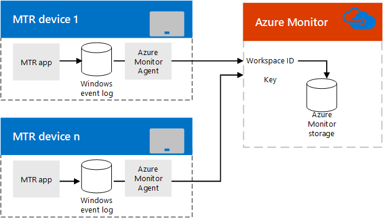

# Planejar Salas do Microsoft Teams gerenciamento com o Azure Monitor
 
 Este artigo discute considerações de planejamento para usar o Azure Monitor para administrar Salas do Microsoft Teams dispositivos em sua implementação Microsoft Teams ou Skype for Business.
  
[O Monitor do Azure](/azure/azure-monitor/overview) é uma coleção de serviços de gerenciamento que foram projetados na nuvem desde o início. Em vez de implantar e gerenciar recursos locais, os componentes do Azure Monitor são totalmente hospedados no Azure. A configuração é mínima e você pode estar funcionando literalmente em questão de minutos. Com algum trabalho de personalização, ele pode ajudar no gerenciamento de sistemas de conferência Salas do Microsoft Teams fornecendo notificações em tempo real sobre a saúde ou falhas do sistema para sistemas de salas individuais, e pode potencialmente dimensionar para gerenciar milhares de salas de conferência Salas do Microsoft Teams.
  
Este artigo fornece uma discussão sobre os requisitos, o design/arquitetura e as práticas recomendadas de implementação necessárias para implementar o gerenciamento baseado no Azure Monitor de dispositivos de conferência Salas do Microsoft Teams e fornece links para artigos detalhados sobre a implementação do Azure Monitor para Salas do Microsoft Teams e informações de referência críticas para monitoramento contínuo de salas Salas do Microsoft Teams. 
  
## Visão geral funcional

  
O Salas do Microsoft Teams no dispositivo de console grava eventos em seu Windows Log de Eventos. Um agente de Monitoramento da Microsoft, uma vez instalado, passa as informações para o serviço do Monitor do Azure. 
  
Depois de configurado corretamente, o Log Analytics analisará a carga JSON inserida nas descrições do evento para descrever como cada sistema Salas do Microsoft Teams está funcionando e quais falhas são detectadas. 
  
Um administrador que usa o Azure Monitor pode receber notificações de sistemas Salas do Microsoft Teams que estão offline ou estão enfrentando falhas de aplicativo, conectividade ou hardware, além de saber se um sistema precisa ser reiniciado. Cada status do sistema é atualizado com frequência, portanto, essas notificações estão próximas de atualizações em tempo real.
  
## Requisitos do Monitor do Azure

Você deve ter uma assinatura válida do Azure para o Azure Monitor para usar o recurso Análise de Log. Consulte [Começar com um espaço de trabalho do Log Analytics](/azure/azure-monitor/learn/quick-create-workspace) para criar uma assinatura para sua organização.
  
Você deve se familiarizar conforme necessário sobre como usar o Designer de Exibição de Análise de Log. Consulte [Views in Log Analytics](/azure/azure-monitor/platform/view-designer) para obter esses detalhes.
  
### Tarefas relacionadas

1. Depois de inscrito no Azure Monitor Log Analytics, crie campos personalizados (conforme descrito em [Mapear](azure-monitor-deploy.md#Custom_fields)campos personalizados ) necessários para analisar as informações que serão enviadas de consoles Salas do Microsoft Teams mapa. Isso inclui o entendimento do esquema JSON documentado em [Compreender as entradas de log](azure-monitor-manage.md#understand-the-log-entries).
    
2. Desenvolva um Salas do Microsoft Teams de gerenciamento no Log Analytics. Você pode [criar um painel Salas do Microsoft Teams manualmente](azure-monitor-deploy.md#create-a-microsoft-teams-rooms-dashboard-manually).
    
## Requisitos Salas do Microsoft Teams console individuais

Cada Salas do Microsoft Teams console é um aplicativo em execução em um dispositivo Surface Pro no modo quiosque (normalmente, ele é configurado para ser o único aplicativo que pode ser executado no dispositivo). Como acontece com qualquer Windows, o aplicativo Salas do Microsoft Teams grava eventos como falhas de inicialização e hardware no log de eventos Windows de eventos. Adicionar um agente do Microsoft Monitor em seu Salas do Microsoft Teams permite que esses eventos sejam coletados. (Consulte Conexão Windows para o serviço de Análise de Log no [Azure](/azure/azure-monitor/platform/agent-windows) para obter detalhes.)
  
## Gerenciamento contínuo

Ao usar o Monitor do Azure para gerenciar seus dispositivos Salas do Microsoft Teams, você precisará entender as informações contidas nos logs de eventos usados pelo Azure Monitor. Consulte [Compreender as entradas de log para](azure-monitor-manage.md#understand-the-log-entries) obter detalhes sobre essas mensagens de saúde.
  
### Tarefas relacionadas

- Entenda os Alertas gerados por Salas do Microsoft Teams e como resolvê-los (consulte a seção intitulada [Compreender as entradas de log](azure-monitor-manage.md#understand-the-log-entries))
    
## Confira também

[Implantar Salas do Microsoft Teams gerenciamento com o Azure Monitor](azure-monitor-deploy.md)
  
[Gerenciar Salas do Microsoft Teams com o Azure Monitor](azure-monitor-manage.md)
