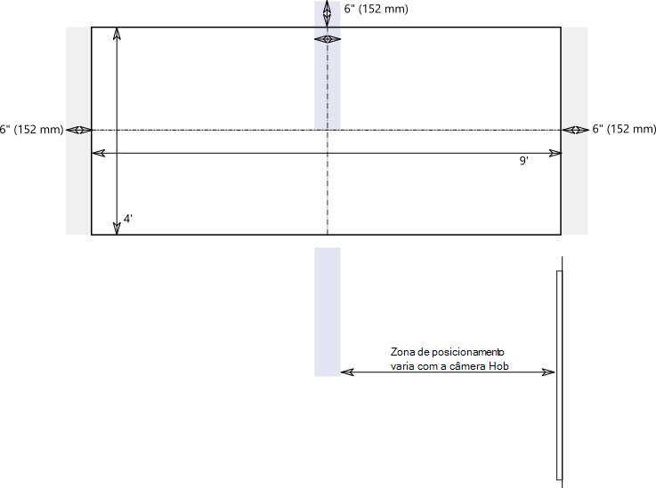

# Câmeras de conteúdo

Agora você pode usar uma câmera de conteúdo com um sistema de Sala do Microsoft Teams. Uma câmera de conteúdo interage com um software especial de processamento de imagem e um quadro de comunicações para permitir que o apresentador desenhe em um quadro de comunicações analógico e compartilhe o conteúdo com participantes remotos.

Confira o vídeo a seguir para ver exemplos de funcionalidade da câmera de conteúdo.

> [!VIDEO https://www.microsoft.com/videoplayer/embed/RE3E7fy]

## Configurar uma câmera de conteúdo

> [!NOTE]
> Sempre siga o código de construção de seu país ou região, que pode definir uma distância mínima do piso ou um requisito de que o equipamento montado no teto seja preso a uma viga ou outra estrutura. Siga as instruções de montagem para o hardware fornecido com a câmera que você selecionou. Os kits de montagem da câmera OEM incluem câmera, ampliadores USB 2.0 e cabeamento obrigatório.

O tamanho do quadro de comunicações usado para compartilhamento afeta o posicionamento da câmera. As recomendações de tamanho do quadro são:

- 3–6 pés (0,9–1,8 m) de largura — Compatível
- 6–9 pés (1,8–2,7 m) de largura — Recomendado
- 9–12 pés (2,7–3,6 m) de largura — Compatível
- Acima de 12 pés (3,6 m) de largura — a câmera abrange 9–12 pés (2,7–3,6 m) e corta o resto.

## Localização da câmera

O posicionamento ideal de uma câmera de conteúdo é centralizado verticalmente e horizontalmente no quadro de comunicações. Os códigos de construção locais podem ter restrições de altura que exijam que a câmera seja elevada acima do topo do quadro de comunicações.

Você poderá instalar a câmera até 6 polegadas (152 mm) acima da parte superior do quadro de comunicações e centralizada no quadro branco, conforme mostrado. Certifique-se de que a imagem da câmera inclua uma borda de pelo menos 6 polegadas (152 mm) em ambos os lados horizontalmente. Você pode usar a visualização da câmera no aplicativo Salas do Microsoft Teams para determinar o posicionamento final da câmera.

### Distâncias da câmera

Usando marcadores típicos de quadro de comunicações, o ideal para a experiência de usuário remoto é compartilhar traços de tinta na faixa de 1–2 mm por pixel na imagem da câmera de conteúdo, e os melhores resultados usam 1,5 mm por pixel. Todas as câmeras compatíveis oferecem resolução de 1920 x 1080 e algumas podem exceder essa resolução.

A distância da câmera do quadro de trabalho combina com a resolução da câmera e o Campo de Exibição Horizontal (HFoV) para determinar a distância do quadro de trabalho. A tabela a seguir mostra exemplos de distâncias para vários tamanhos de quadro de comunicações. Você pode usar esses valores como pontos de partida para determinar o posicionamento final da câmera de conteúdo.

**Distância da câmera do quadro de comunicações**

| Camera HFoV |3 pés (0,91 m)     | 6 pés (1,8 m)    | 9 pés (2,74 m)        |12 pés (3,65 m)         | Distância máxima do quadro de comunicações  |
|:---         |:---               |:---                |:---                 |:---             | :--- |
| 80°         | 1,79 pés (0,54 m) | 3,58 pés (1,09 m)  | 5,36 pés (1,6 m)    |7,15 pés (2,17 m) |7,51 pés (2,28 m) |
| 90°         | 1,5 pés (0,45 m) | 3,00 pés (0,91 m)   | 4,5 pés (1,37 m)    |6,0 pés (1,82 m)    |6,3 pés (1,92 m) |
| 100°        | 1,26 pés (0,38 m)| 2,52 pés (0,77 m)   | 3,78 pés (1,15 m)   |5,03 pés (1,53 m)   |5,29 pés (1,61 m) |
| 110°        | 1,05 pés (0,32 m)| 2,10 pés (0,64 m)   | 3,15 pés (0,96 m)   |4,2 pés (1,28 m)    |4,41 pés (1,31 m) |
| 120°        | 0,87 pés (0,26 m)| 1,73 pés (0,52 m)   | 2,60 pés (0,79 m)   |3,46 pés (1,05 m)   |3,64 pés (1,10 m) |
             

A distância entre a câmera de conteúdo e a parede na qual o quadro de comunicações está montado varia dependendo do HFoV para esse modelo de câmera. Instale câmeras com HFoV maior (120 graus, por exemplo) mais perto da parede, e câmeras com HFoV menor mais longe da parede. Verifique o HFoV antes de iniciar a instalação da câmera escolhida.

Se tiver quadros de comunicações maiores que 12 pés (3,65 m) ou sem cantos (como quadros de comunicações inteiros de parede completa), poderá colocar a câmera em qualquer lugar no centro. O software de aprimoramento seleciona uma área no meio se não conseguir localizar os cantos do quadro de comunicações.

> [!NOTE]
> Você poderá usar fita de cor escura ou outra coisa para criar uma área definida da câmera de conteúdo em um quadro de comunicações de parede completa. Isso ajuda os participantes na sala a saber quando estão desenhando em uma área sendo capturada pela câmera de conteúdo.
>
> Você poderá optar por ter a câmera montada em um tripé móvel em vez de uma montagem permanente. Coloque o tripé centralizado no quadro de comunicações. Esta configuração pode ser temporária ou usada onde houver pouca chance de derrubar o equipamento. Se usar uma montagem temporária, lembre-se de que o aprimoramento do conteúdo será afetado se você mover a câmera após o compartilhamento inicial e precisará compartilhar novamente para corrigir o movimento.
>
> Não há suporte para quadro de texto que não seja branco.

## Câmeras compatíveis

Para determinar se você poderá usar uma câmera como uma câmera de conteúdo, confira [Versões de firmware certificadas para periféricos de áudio e vídeo USB](requirements.md#certified-firmware-versions-for-usb-audio-and-video-peripherals).

Ou consulte o marketplace de dispositivos do Microsoft Teams para obter os Kits de câmera de conteúdo compatíveis em [aka.ms/teamsdevices](https://aka.ms/teamsdevices).

## Configurações da câmera

Quando a câmera estiver instalada na sala, configurar-a no console de Salas do Microsoft Teams dessa sala:

1. Selecione **Configurações**  , faça logoff como Administrador e selecione **Periféricos**.
2. Na seção **Câmera de Conteúdo,** selecione a câmera de conteúdo e certifique-se de que a **opção Aprimoramentos de** conteúdo está selecionada.
3. (Opcional) Se a câmera foi instalada de cabeça para baixo porque a câmera foi montada no teto, marque a opção **Girar câmera de conteúdo 180°**.
4. Selecione **Salvar e sair**.

Você também poderá ajustar essas configurações remotamente usando um [arquivo de configuração XML](xml-config-file.md).

## Confira também

[Gerenciar as configurações do console de Salas do Microsoft Teams remotamente com um arquivo de configuração XML](xml-config-file.md)

[Requisitos das Salas do Microsoft Teams](requirements.md)

