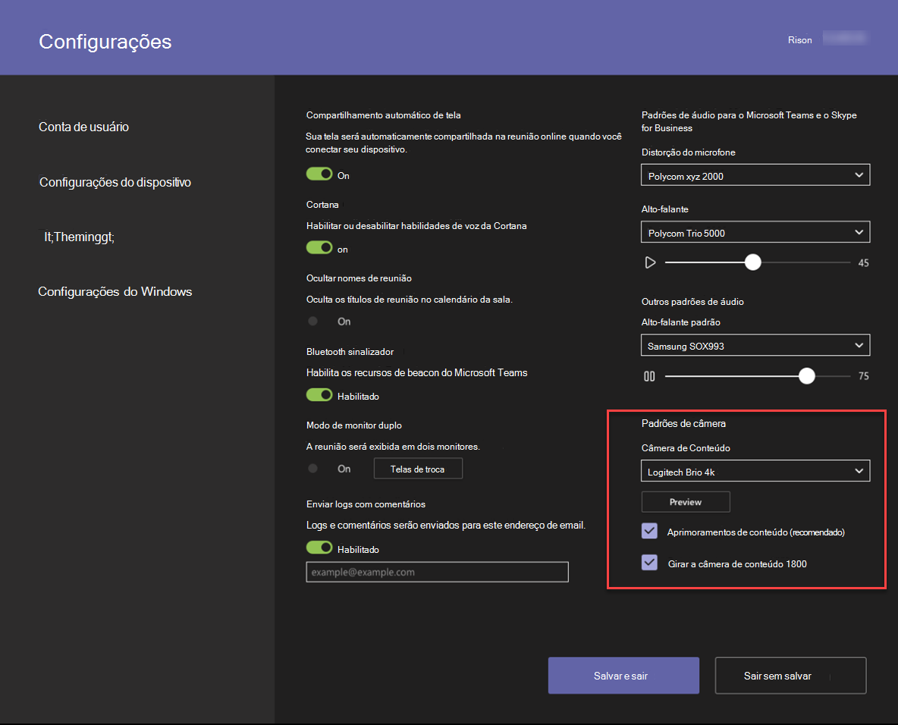

# Câmeras de conteúdoContent cameras

Agora você pode usar uma câmera de conteúdo com um sistema de sala do Microsoft Teams.You can now use a content camera with a Microsoft Teams Room system. Uma câmera de conteúdo interage com um software de processamento de imagens especial e um quadro de comunicações para permitir que um apresentador desenhe em um quadro de comunicações analógico e compartilhe o conteúdo com participantes remotos.A content camera interacts with special image-processing software and a whiteboard to allow a presenter to draw on an analog whiteboard and share the content with remote participants.

Consulte o vídeo a seguir para obter exemplos de funcionalidade de câmera de conteúdo.See the following video for examples of content camera functionality.

> [!VIDEO https://www.microsoft.com/videoplayer/embed/RE3E7fy]

## Configurar uma câmera de conteúdoSet up a content camera

> [!NOTE]
> Sempre respeite o código de construção do seu país ou da área, o que pode definir uma distância mínima do andar ou um requisito de que o equipamento montado pelo teto seja protegido a um Rafter ou a outra estrutura.Always adhere to your country or area's building code, which may define a minimum distance from the floor or a requirement that ceiling-mounted equipment be secured to a rafter or other structure. Siga a instrução de montagem para o hardware fornecido com a câmera que você selecionou.Follow the mounting instruction for the hardware provided with the camera you've selected. Os kits de montagem de câmera OEM incluem uma câmera, extensores USB 2,0 e cabeamento obrigatório.OEM camera mounting kits include a camera, USB 2.0 extenders and required cabling.

O tamanho do quadro de comunicações usado para compartilhamento afeta o posicionamento da câmera.The size of the whiteboard used for sharing affects the placement of the camera. As recomendações de tamanho de quadro são:Board size recommendations are:

- de 3 a 6 pés (0,9 a 1,8 m) de largura — compatível3–6 ft. (0.9–1.8 m) wide — Supported
- de 6 a 9 pés (1,8 a 2.7 m) de largura — recomendado6–9 ft. (1.8–2.7 m) wide — Recommended
- de 9 a 12 pés (2,7 a 3,6 m), com suporte9–12 ft. (2.7–3.6 m) wide — Supported
- Acima de 12 pés (3,6 m) de largura, a câmera cobre de 9 a 12 pés (2.7 – 3,6 m) e corta o restante.Above 12 ft. (3.6 m) wide — camera covers 9–12 ft. (2.7–3.6 m) and crops the rest.

## Local da câmeraCamera location

O posicionamento ideal de uma câmera de conteúdo é centralizado verticalmente e horizontalmente no quadro de comunicações.Ideal placement of a content camera is centered vertically and horizontally on the whiteboard. Os códigos de construção locais podem ter restrições de altura que exigem que a câmera seja elevada e elevada do que o topo do quadro branco.Local building codes may have height restrictions that require the camera be elevated higher than the top of the white board.

Você pode instalar a câmera até 6.You can install the camera up to 6 in. (152 mm) maior do que o topo do quadro de comunicações e centralizado no quadro branco, conforme mostrado.(152 mm) higher than the top of the whiteboard, and centered on the white board as shown. Verifique se a imagem da câmera inclui pelo menos um 6 in.Make sure that the camera image includes at least a 6 in. (152 mm) borda em ambos os lados horizontalmente.(152 mm) border on both sides horizontally. Você pode usar a visualização da câmera no aplicativo salas do Microsoft Teams para determinar o posicionamento final da câmera.You can use the camera preview in the Microsoft Teams Rooms app to determine final placement of the camera.

### Distâncias da câmeraCamera distances

Usando marcadores típicos do quadro de comunicações, a experiência do usuário remoto ideal é compartilhar traços de tinta no intervalo de 1 a 2 mm por pixel na imagem da câmera de conteúdo, e os melhores resultados usam 1,5 mm por pixel.Using typical whiteboard markers, the optimal remote user experience is to share ink strokes in the 1–2 mm per pixel range in the content camera image, and the best results use 1.5 mm per pixel. Todas as câmeras compatíveis fornecem a resolução de 1920 x 1080 e alguns podem exceder essa resolução.All supported cameras provide 1920 x 1080 resolution, and some can exceed that resolution.

A distância da câmera do whiteboard combina-se com a resolução da câmera e HFoV para determinar a distância do quadro de comunicações.The distance of the camera from the whiteboard combines with the camera resolution and HFoV to determine the distance from the whiteboard. A tabela a seguir mostra exemplos de distâncias para vários tamanhos de quadro de comunicações.The following table shows examples of distances for various whiteboard sizes. Você pode usar esses valores como ponto de partida para determinar o posicionamento final da câmera de conteúdo.You can use these values as starting points to determine final placement of the content camera.

**Distância da câmera do quadro de comunicações****Camera distance from whiteboard**

| Câmera HFoVCamera HFoV |3 pés (0,91 m)3 ft. (0.91 m)     | 6 pés (1,8 m)6 ft. (1.8 m)    | 9 pés (2,74 m)9 ft. (2.74 m)        |12 pés.  (3,65 m)12 ft.  (3.65 m)         | Distância máxima do quadro de comunicaçõesMax distance from Whiteboard  |
|:---         |:---               |:---                |:---                 |:---             | :--- |
| 80 °80°         | 1,79 pés (0,54 m)1.79 ft. (0.54 m) | 3,58 pés (1, 9 m)3.58 ft. (1.09 m)  | 5,36 pés (1,6 m)5.36 ft. (1.6 m)    |7,15 pés (2,17 m)7.15 ft. (2.17 m) |7,51 pés (2,28 m)7.51 ft. (2.28 m) |
| 90 °90°         | 1,5 pés (0,45 m)1.5 ft. (0.45 m) | 3, 0 pés (0,91 m)3.00 ft. (0.91 m)   | 4,5 pés (1,37 m)4.5 ft. (1.37 m)    |6,0 pés (1,82 m)6.0 ft. (1.82 m)    |6,3 pés (1,92 m)6.3 ft. (1.92 m) |
| 100 °100°        | 1,26 pés (0,38 m)1.26 ft. (0.38 m)| 2,52 pés (0,77 m)2.52 ft. (0.77 m)   | 3,78 pés (1,15 m)3.78 ft. (1.15 m)   |5, 3 pés (1,53 m)5.03 ft. (1.53 m)   |5,29 pés (1,61 m)5.29 ft. (1.61 m) |
| 110 °110°        | 1, 5 pés (0,32 m)1.05 ft. (0.32 m)| 2,10 pés (0,64 m)2.10 ft. (0.64 m)   | 3,15 pés (0,96 m)3.15 ft. (0.96 m)   |4,2 pés (1,28 m)4.2 ft. (1.28 m)    |4,41 pés (1,31 m)4.41 ft. (1.31 m) |
| 120 °120°        | 0,87 pés (0,26 m)0.87 ft. (0.26 m)| 1,73 pés (0,52 m)1.73 ft. (0.52 m)   | 2,60 pés (0,79 m)2.60 ft. (0.79 m)   |3,46 pés (1, 5 m)3.46 ft. (1.05 m)   |3,64 pés (1,10 m)3.64 ft. (1.10 m) |
|             |               |                  |                  |        |                    |                  |

A distância entre a câmera de conteúdo e a parede em que o whiteboard é montado depende da HFoV para esse modelo de câmera, o que varia.The distance between the content camera and the wall the whiteboard is mounted on depends on the HFoV for that model of camera, which varies. Instale câmeras com uma HFoV maior (120 graus), por exemplo, mais perto da parede, e câmeras com HFoV mais estreita e longe da parede.Install cameras with a larger HFoV (120 degrees for example) closer to the wall, and cameras with a narrower HFoV farther away from the wall. Verifique o HFoV antes de começar a instalar a câmera escolhida.Check the HFoV before you start to install the chosen camera.

Se você tiver quadros de comunicações maiores do que 12 pés (3,65 m) ou sem cantos (como quadros de comunicações em parede cheia), poderá colocar a câmera em qualquer lugar do meio.If you have whiteboards larger than 12 ft. (3.65 m) or with no corners (like full wall whiteboards), you can place the camera anywhere in the middle. O software de aprimoramento seleciona uma área no meio se não conseguir encontrar os cantos do quadro de comunicações.The enhancement software selects an area in the middle if it fails to find whiteboard corners.

> [!NOTE]
> Você pode usar uma fita colorida escura ou outros itens para criar uma área de câmera de conteúdo definida em um quadro branco de parede cheia.You can use dark-colored tape or other items to create a defined content camera area on a full-wall white board.
>
> Você pode optar por fazer com que a câmera seja montada em um tripé móvel, em vez de uma montagem permanente.You can choose to have the camera mounted on a moveable tripod instead of a permanent mount. Coloque o tripé centralizado no quadro de comunicações.Place the tripod centered on the whiteboard. Esta configuração pode ser temporária ou usada onde há pouca chance de vazar sobre o equipamento.This setup may be temporary or used where there is little chance of knocking over the equipment. Se você usar uma montagem temporária, lembre-se de que a melhoria do conteúdo será afetada se você mover a câmera após o compartilhamento inicial e será necessário compartilhar novamente para corrigir o movimento.If you use a temporary mount, remember that content enhancement will be impacted if you move the camera after the initial share and you will need to re-share to correct for movement.
>
> Não há suporte para um quadro de escrita que não está em branco.A writing board that isn't white is not supported.

## Câmeras com suporteSupported cameras

Para determinar se você pode usar uma câmera como uma câmera de conteúdo, consulte [versões de firmware certificado para periféricos de áudio e vídeo USB](requirements.md#certified-firmware-versions-for-usb-audio-and-video-peripherals).To determine whether you can use a camera as a content camera, refer to [Certified firmware versions for USB audio and video peripherals](requirements.md#certified-firmware-versions-for-usb-audio-and-video-peripherals).

Ou, consulte o Marketplace de dispositivos do Microsoft Teams para kits de câmera de conteúdo suportados em [aka.ms/teamsdevices](https://aka.ms/teamsdevices).Or, refer to the Microsoft Teams devices marketplace for supported Content Camera Kits at [aka.ms/teamsdevices](https://aka.ms/teamsdevices).

## Configurações da câmeraCamera settings

Depois que a câmera estiver instalada na sala, configure-a no console de salas do Microsoft Teams da sala:Once the camera is installed in the room, set it up on that room's Microsoft Teams Rooms console:

1. Selecione **Settings** configurações de configurações, faça logon como administrador e selecione **configurações de dispositivo**.Select **Settings** ,  log in as Admin, and select **Device Settings**.
2. Na seção **padrões da câmera** , selecione a câmera de conteúdo e certifique-se de que a opção **aprimoramentos de conteúdo** esteja selecionada.In the **Camera Defaults** section, select the content camera and make sure that the **Content enhancements** option is selected.
3. Adicionais Se a câmera foi instalada de cabeça para baixo porque a câmera foi montada a partir do teto, marque a opção **girar conteúdo câmera 180 °** .(Optional) If the camera was installed upside down because the camera was mounted from the ceiling, check the **Rotate content camera 180°** option.
4. Selecione **salvar e sair**.Select **Save and exit**.

Você também pode ajustar essas configurações remotamente usando um [arquivo de configuração XML](xml-config-file.md).You can also adjust these settings remotely using an [XML configuration file](xml-config-file.md).

## Confira tambémSee also

[Gerenciar as configurações de um console de salas do Microsoft Teams remotamente com um arquivo de configuração XMLManage a Microsoft Teams Rooms console settings remotely with an XML configuration file](xml-config-file.md)

[Requisitos de salas do Microsoft TeamsMicrosoft Teams Rooms requirements](requirements.md)

