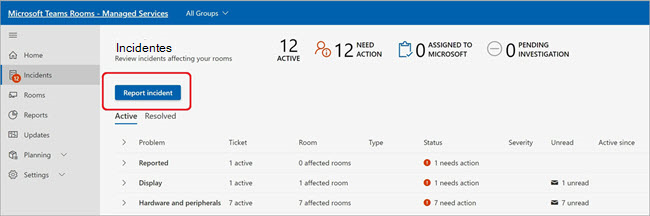
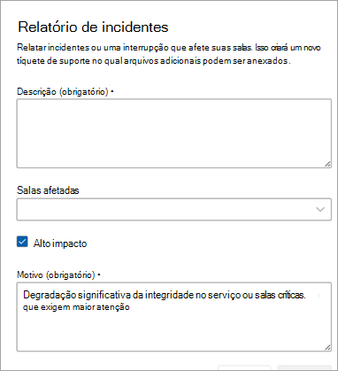
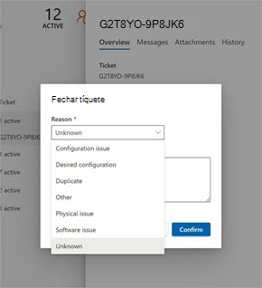

# Tíquetes de incidente relatados pelo cliente

Para qualquer tipo de incidente que a Microsoft não sinalize ou para perguntas sobre o serviço/recursos, os clientes ou parceiros em nome dos clientes podem usar o recurso Incidente de Relatório para alertar a Microsoft para investigar o problema ou responder à pergunta.

No campo Descrição, descreva o melhor possível o problema com o qual você precisa de ajuda da Microsoft. Você pode adicionar uma ou mais salas.

Os CRIs (incidentes relatados pelo cliente) são considerados tíquetes críticos, o que significa que a Salas do Teams do Centro de Operações de Serviço faz a triagem desses tíquetes primeiro. Consulte o SLA de Descrição do Serviço para incidentes relatados pelo [cliente aqui](microsoft-teams-rooms-premium.md). Quando uma sala for (ou salas) selecionada como parte do CRI, cada sala será marcada como Não Íntegra até  que a CRI seja fechada.

## Fechando tíquetes de incidente relatados pelo cliente

Incidentes relatados pelo cliente podem ser fechados pelo cliente, parceiros que gerenciam salas em nome dos clientes ou pelos engenheiros do Centro de Operações de Serviço da Microsoft.

**Para fechar um incidente**

1. Selecione **Fechar tíquete**.

   

1. Escolha um motivo para o fechamento selecionando uma categoria na lista.

   Depois de confirmar o motivo do fechamento, o tíquete será fechado e movido para **Resolvido**.

   

A seção Visão geral de detalhes do tíquete exibe que o tíquete foi fechado pelo Serviço de Salas Gerenciadas (Microsoft) ou pelo nome do cliente/parceiro.  

 

## Perguntas frequentes

**Alguém pode fechar ingressos?**

Somente incidentes relatados pelo cliente podem ser fechados por um usuário ou pelo Centro de Operações de Serviço de Salas Gerenciadas da Microsoft. Os clientes que atribuiram um parceiro para gerenciar suas salas com permissões de Gerenciamento de Tíquetes terão a capacidade de fechar incidentes relatados pelo cliente.

**Posso restringir quem pode fechar ingressos?**

Não neste momento. Todos os usuários que têm permissões de Gerenciamento de Tíquetes podem fechar um CRI.

**Sou notificado quando um tíquete de incidente relatado pelo cliente é fechado?**

Não neste momento.