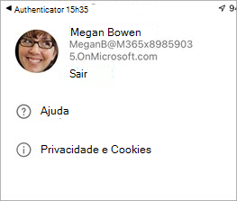

# Salas do Teams aplicativo cliente móvel

Pode haver ocasiões em que você precisa gerenciar Salas do Teams Serviços Gerenciados (MTMS) de seu dispositivo móvel. O aplicativo móvel tem muitos recursos que você pode gerenciar em seu dispositivo móvel ou tablet.
## Antes de você começar

Você deve ser um administrador em uma organização do Microsoft 365 para usar o Salas do Teams aplicativo móvel.
Baixe o Salas do Teams aplicativo móvel da [Apple App Store](https://apps.apple.com/app/apple-store/id761397963?pt=80423&ct=docsaboutadminapp&mt=8) ou [da Google Play Store](https://play.google.com/store/search?q=Microsoft%20Teams%20Rooms&c=apps).

O cliente móvel oferece a criação de tíquetes e o gerenciamento de recursos de incidentes em sua organização.

## Próximas etapas

**Para obter o aplicativo móvel MTMS**

1. Pesquise Salas do Teams Serviços Gerenciados na loja de aplicativos para seu dispositivo e instale-o.
2. Entre com seu endereço de email de administrador global e exiba o painel para ver a integridade do serviço, monitorar licenças de usuário e ver mensagens e solicitações de serviço.

**Para usar o Salas do Teams aplicativo móvel**

1. Baixe o aplicativo no apple [App Store]() ou [na Google Play Store]().
1. Verifique se você tem uma assinatura válida do Microsoft 365.
1. Use suas credenciais de trabalho que você usa para acessar o Salas do Teams da área de trabalho.

## Gerenciando incidentes

Aqui estão alguns dos recursos que você tem no aplicativo móvel para gerenciar incidentes.

- Receba notificações por push para novos incidentes.
- Toque na notificação para abrir e exibir os detalhes do incidente imediatamente.
- Liste todos os incidentes ativos e resolvidos, incluindo status de leitura e não lido em mensagens.
- Exiba os detalhes básicos do incidente com informações de tíquete, incluindo mensagens.
- Exibir anexos e arquivos de tíquete.
- Saia de um painel do usuário (as notificações/mensagens serão desabilitadas se estiverem desativadas).

A página Incidentes mostra os tipos de incidentes abertos.

### Relatar um incidente

### Exibir um incidente por categoria

### Gerenciando tíquetes
Aqui estão alguns dos recursos que você tem no aplicativo móvel para gerenciar tíquetes.

- Confirmar incidente (marcar como lido).
- Ler, postar e responder a mensagens em um tíquete.
- Alterne para o Modo Escuro.
- Adicionar um anexo (tirar e carregar imagens).
- Crie um tíquete para relatar um incidente.
- Segurança gerenciada e comunicação com especialistas usando o Microsoft Defender

O aplicativo exibe detalhes do tíquete, mensagens e arquivos em guias separadas.

<!--

### Sign out

-->

## Solução de problemas

Você pode experimentar algumas etapas comuns de solução de problemas de aplicativo móvel:
- Feche e reabra o aplicativo.
- Desinstale e reinstale o aplicativo. Verifique se você está na versão mais recente do aplicativo.
- Se você tiver o Microsoft Authenticator ou o aplicativo portal da empresa instalado em seu dispositivo, tente reinstalá-lo ou atualizá-lo para a versão mais recente. Se isso não funcionar, envie um email para feedback365@microsoft.com para nos informar.
