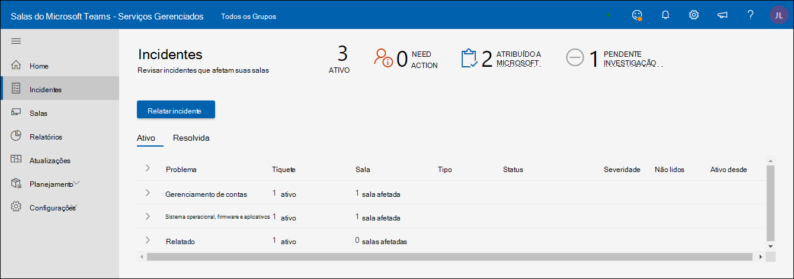
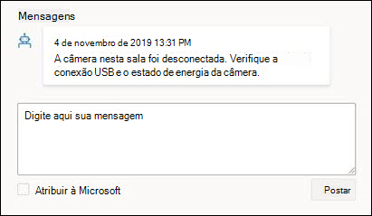
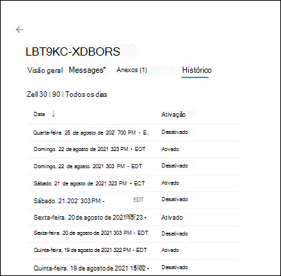

# Portal de Salas de Reunião Gerenciadas da Microsoft

## Visão geral

O Portal de Salas de Reunião Gerenciadas ("Portal de Salas") fornece uma visão da integridade das salas de reunião. Uma visão do cliente deste portal é para sua visibilidade e comentários e para facilitar suas ferramentas/práticas de monitoramento existentes.

O escopo do monitoramento é

- Exibição de incidentes
  - Principais problemas que afetam suas salas
  - Ações necessárias para restaurar salas para o status íntegro
  - Problemas que estão sendo investigados pela Microsoft
- Exibição de dispositivos da Sala do Microsoft Teams
  - Instantâneo do status no nível Salas do Microsoft Teams (MTR) do dispositivo
  - Histórico básico e detalhes para cada dispositivo

**Exibição de dispositivos da Sala do Microsoft Teams**

- Instantâneo do status no nível Salas do Microsoft Teams (MTR) do dispositivo
- Histórico básico e detalhes para cada dispositivo

> [!Important]
> Examine [**Atribuir usuários à função administrador**](enrolling-mtrp-managed-service.md#assign-users-to-the-managed-service-administrator-role) de serviços gerenciados e verifique se o acesso ao portal é limitado com base nas suas necessidades de negócios.

## Terminologia

Aqui estão os termos usados com frequência no portal.

|Termo |Significado |
| :- | :- |
|**Software de monitoramento** |Agente de monitoramento implantado em cada um dos dispositivos da Sala do Microsoft Teams. |
|**App** |Aplicativo do sistema sala do Microsoft Teams (independentemente de ele usar Skype for Business ou o Microsoft Teams como o serviço de colaboração. |
|**Sala/Dispositivo** |O dispositivo certificado do sistema sala do Microsoft Teams. |
|**Não monitorado** | O software de monitoramento da Microsoft implantado como parte dos serviços gerenciados não é capaz de se conectar aos serviços de nuvem. Não estamos recebendo telemetria sobre o dispositivo. |
|
**Íntegro /** 

**Insalubre** 
|Anormalidades no dispositivo/periférico. |
|**Suprimida** |Se um dispositivo é conhecido por estar em manutenção e seus alertas devem ser ignorados, o dispositivo pode ser suprimido deliberadamente. |
|**Integração** |O estado de um dispositivo de sala enquanto ele está sendo adicionado, mas não está pronto como uma sala com suporte regular. |
|**Incidente** |Um problema que afeta as experiências de reunião de usuários finais que precisam de ação. |
|**Errada** |A configuração detectada não está correta/comumente usada. |
|**Tíquete de Suporte** |Identificador de acompanhamento interno da Microsoft que rastreia todas as comunicações/ações relacionadas a um incidente. |

## Exibição de incidentes

Essa exibição é uma visão geral da guia Incidentes no Portal de Salas Gerenciadas. Esta página é a home page padrão do portal.

### Resumo de nível superior 
O resumo de nível superior mostra rapidamente os problemas que afetam suas salas, o que você precisa fazer e o que a Microsoft está fazendo sobre eles:

|# |Explicação |
| :- | :- |
|1 |Tipos de incidentes que afetam suas salas |
|2 |**PRECISA DE AÇÃO**: itens que exigem sua intervenção para resolver. |
|3 |**ATRIBUÍDO À MICROSOFT**: itens investigados atualmente pela equipe da Microsoft. |
|4 |**INVESTIGAÇÃO PENDENTE**: itens na fila a serem investigados pela equipe da Microsoft. |

Espera-se que os incidentes estejam em um dos três estados:

- **Ação de necessidade**: atribuída a você para ação
- **Atribuído à Microsoft**: Atribuído à Microsoft para a próxima ação
- **Investigação Pendente**: em investigação para as próximas etapas

### Revisando incidentes

A imagem a seguir lista todos os incidentes que estão ativos atualmente em suas salas. Os que são atribuídos a você estão *na* parte superior– são eles que você precisa examinar para as próximas etapas. Além disso, aqueles atribuídos à Microsoft ou a investigação pendente têm detalhes que você pode usar para intervir.

Clicar em qualquer um dos itens que têm o status "**Ação de necessidades**" mostra detalhes adicionais sobre o incidente.

## Tipos de incidentes

Os incidentes são classificados em dois tipos de severidade ampla:

- **Importante**: incidentes que provavelmente estão causando problemas em reuniões e devem ser priorizados.
- **Aviso** – incidentes que são notificações para planejar ações de manutenção. Se isso não for feito, ao longo do tempo, as salas terão maior probabilidade de ocorrer um problema. Os avisos destinam-se a dar tempo para planejar e orquestrar o suporte.

Um aviso pode fazer a transição para "**Importante**" se não for atendido por um tempo.

## Status de integridade do dispositivo e incidentes

Incidentes classificados como **"Importantes" na** gravidade afetarão o status de integridade de um dispositivo. Se houver pelo menos um incidente de **Severidade = "Importante"** associado a um dispositivo, ele será classificado como **_um dispositivo não íntegro_** .

Incidentes classificados como **severidade de "Aviso"** não afetam o status de integridade relatado em um dispositivo. No entanto, se um dispositivo tiver incidentes de nível de aviso associados a ele, ele será mostrado com o status de integridade do dispositivo da seguinte maneira.

A seguir estão alguns dos tipos de incidentes que você pode ver e as explicações para cada tipo. Para cada tipo, a ação associada ao incidente será mais específica, dependendo do problema.

**Tabela 1: Incidentes com severidade "Importante"**

|Tipo |Explicação |
| :- | :- |
|**Display** |A exibição conectada ao dispositivo não parece estar íntegra.|
|**Microfone de conferência, palestrante de conferência** |Os dispositivos de áudio (microfone/alto-falante) parecem estar configurados incorretamente. |
|**Câmera** |A câmera conectada ao dispositivo não parece estar íntegra. |
|**Ingestão de HDMI** |A ingestão de HDMI não está íntegra. |
|**Entrar (** Exchange) |O aplicativo sala do Microsoft Teams acessa informações de calendário do Exchange e qualquer problema com êxito de entrada será relatado com um incidente de entrada. |
|**Entrar (** Teams) |O aplicativo Sala do Microsoft Teams entra no dispositivo e a falha ao entrar será relatada com esse incidente (se o cliente estiver usando o Teams). |
|**Entrada (** Skype for Business) |O aplicativo Sala do Microsoft Teams entra no dispositivo e a falha ao entrar será relatada com esse incidente (se o cliente estiver usando Skype for Business) |
|**Sensor de proximidade** |O aplicativo sala do Microsoft Teams convida participantes para ingressar em uma reunião se eles estiverem próximos. Falhas nesse recurso serão relatadas sob esse incidente. |

**Tabela 2: Incidentes com severidade de "Aviso"**

|Tipo |Explicação |
| :- | :- |
|**Versão do aplicativo** |A versão do Aplicativo de Sala do Microsoft Teams em execução no dispositivo não é atual. Versões obsoletas são causas conhecidas para problemas enfrentados pelos usuários. |
|**Versão do sistema operacional.** |A versão do sistema operacional Windows em execução na sala de reunião não é mais recomendada. |
|**Rede** |Isso será removido como um tipo de aviso a curto prazo devido ao trabalho adicional necessário após a avaliação. |

## Respondendo a incidentes

Os incidentes se enquadram em três categorias: Precisa de Ação, Investigação Pendente ou Atribuído à Microsoft.

### Incidentes "Precisa de ação"

Incidentes que têm o status definido como **"Ação de Necessidades"** são atribuídos a você para executar uma ação corretiva.

Cada incidente desse tipo terá um campo de ação com uma ação recomendada da Microsoft da seguinte maneira:

- Se você tiver tomado a ação, poderá responder ao incidente com suas anotações na caixa Responder e, em seguida, escolher "Atribuir à Microsoft" antes de postar.
- Também é possível que a notificação esteja incorreta com base em sua análise. Nesse caso, forneça esses comentários e atribua de volta à Microsoft.
- Por fim, se você quiser adicionar um comentário para fornecer contexto adicional para sua própria equipe ou para a equipe da Microsoft, poste a mensagem sem ativar "Atribuir à Microsoft".

>[!NOTE]
>Sua ação corretiva pode resolver o problema e o monitoramento de Salas Gerenciadas limpa esse incidente da sua lista. Na situação acima, talvez você não tenha a chance de resolver o problema e atribuí-lo de volta à Microsoft. Esse problema será resolvido em uma versão futura.

### Incidentes de "Investigação Pendente"

Para os incidentes em investigação, o campo de descrição contém informações sobre o incidente, causas típicas e resoluções que podem ser úteis para resolver determinados problemas para que você possa agir sem atraso.

### Incidentes "Atribuídos à Microsoft"

Para os incidentes atribuídos à Microsoft, o campo "Ação" conterá breves detalhes sobre as etapas corretivas planejadas ou progredidas. Essas etapas podem precisar de colaboração com sua equipe e a colaboração estendida será feita por email/chamadas, conforme necessário. Depois que esses problemas forem resolvidos, eles desaparecerão do portal e, no futuro, haverá histórico para acompanhar esses incidentes e sua resolução.

## Modo de Exibição de Salas

Cada dispositivo é um proxy para uma sala e seus periféricos conectados. Um dispositivo íntegro representa uma sala íntegra e um dispositivo não íntegro representa uma sala que provavelmente está causando problemas durante as reuniões. Além do modo de exibição Incidentes, o Portal de Salas Gerenciadas também fornece uma visão geral da integridade da sala e ajuda você a solucionar problemas de detalhes do dispositivo e a entender falhas repetidas com o histórico de incidentes.

**Íntegro, não íntegro, desconectado** O painel superior no modo de exibição Salas fornece um instantâneo rápido de quantos de seus dispositivos estão em um bom estado("Íntegro"), quantos são afetados por problemas ("Não íntegros"), quantos não estão fornecendo telemetria ("Desconectado") e quantos dispositivos são suprimidos do alerta (como uma substituição). As salas são monitoradas para a integridade usando critérios em evolução e heurística. O objetivo é refletir a realidade da experiência do usuário na sala da maneira mais precisa possível e torná-la acionável.

**Salas íntegras/não íntegras**:

Dispositivos/periféricos que não têm nenhum incidente de severidade "Importante" estão a atender aos critérios atuais de integridade são marcados como íntegros. No entanto, isso não significa que há uma interrupção de sala para cada dispositivo não íntegro no portal. A parte de descrição e ação do incidente contém detalhes mais específicos sobre o problema e o impacto potencial na experiência do usuário.

**Dispositivo desconectado:**

O agente de monitoramento da Microsoft implantado como parte do piloto de Salas Gerenciadas está desconectado dos serviços de nuvem da Sala Gerenciada. Não estamos recebendo telemetria sobre a sala e não temos o status de integridade mais recente. Isso pode acontecer devido a problemas de rede, alterações de política de firewall ou se houver alterações feitas na imagem do dispositivo.

## Detalhes da Sala: Status e Alterações

**Detalhes da Sala: Status** A guia *Status* do dispositivo fornece uma exibição consolidada do status de um dispositivo, todos os problemas ativos para o dispositivo, as ações necessárias para resolvê-los ou que estão em andamento. A guia Status também contém o detalhamento de diferentes componentes de integridade para o dispositivo na *guia Incidentes*. Se um dispositivo estiver desconectado, os detalhes do status não estarão disponíveis.

**Mostrar todos os sinais:** Para exibir todos os sinais contidos em uma categoria de sinal, habilite o botão de alternância Mostrar todos os sinais. As setas de expansão aparecerão ao lado dos títulos de categoria que podem ser clicados para expandir o modo de exibição accordion.

**Suprimir/Desupactar tíquete** Quando uma sala é registrada, você está indicando que deseja receber notificações de alterações na telemetria da sala. Há ocasiões em que um determinado dispositivo ou periférico está em um estado conhecido em que você não deseja que tíquetes ou notificações sejam gerados. O uso da funcionalidade Suprimir tíquete silencia qualquer notificação sobre esse sinal específico. Quando você estiver pronto para o serviço monitorar e notificá-lo sobre esse sinal, basta descompactar o sinal individual.

**Expansão da categoria de tíquete ativo** Em cada categoria de tíquete, qualquer tíquete resolvido ativo ou mais recente será exibido junto com a gravidade e quando o tíquete foi atualizado pela última vez. Ao clicar na seta de expansão, todos os tíquetes aparecerão com um link ativo para as informações do tíquete.

Expansão da Categoria de Tíquete Ativo: em cada categoria de tíquete, qualquer tíquete ativo ou resolvido mais recente será exibido junto com a gravidade e quando o tíquete foi atualizado pela última vez. Ao clicar na seta de expansão, todos os tíquetes aparecerão com um link ativo para as informações do tíquete.

## Tíquete Ativo: Visão geral

Cada incidente criado identifica o problema que foi detectado e a ação corretiva que precisa ser executada para restaurar a sala para um estado íntegro. O tíquete gerado transmitirá a visão geral do incidente com todas as mensagens geradas pela IA dos serviços gerenciados, bem como a equipe de engenharia de serviço da Microsoft que está investigando o problema. Todos os anexos coletados para solução de problemas de incidentes serão listados. A guia histórico fornece as datas em que os problemas foram identificados.

Tíquete Ativo: Mensagens A interface do usuário de mensagens é a principal ferramenta de comunicação para interagir com os engenheiros de serviço da Microsoft que trabalham para corrigir o problema identificado. É importante reconhecer as comunicações da Microsoft para garantir que estamos fornecendo o melhor serviço possível. Se você tiver tomado as ações recomendadas, responda a esse incidente com suas anotações na caixa Responder e atribua de volta à Microsoft clicando em "Atribuir à Microsoft" antes de postar.
Também é possível que a notificação esteja incorreta com base em sua análise. Nesse caso, forneça esses comentários e atribua de volta à Microsoft.
Por fim, se você quiser adicionar um comentário para fornecer contexto adicional para sua própria equipe ou para a equipe da Microsoft, basta postar a mensagem sem ativar "Atribuir à Microsoft

Tíquete Ativo: Anexos Há ocasiões em que os engenheiros de serviço da Microsoft precisam de informações adicionais para aumentar a investigação do problema. A guia anexo fornece a capacidade de carregar imagens, vídeos ou logs solicitados.

Tíquete Ativo: Histórico Cada sinal de sala tem apenas um número de tíquete atribuído a ele de propósito. Um dispositivo de sala ou periférico persiste em uma sala e pode ter problemas ao longo do tempo. Ao manter essas informações em uma ID de tíquete exclusiva específica, todas as informações históricas são mantidas e podem ser analisadas para padrões de comportamento. A interface do usuário do Histórico fornece uma exibição de todas as ações de tíquetes criadas e resolvidas para esse sinal.

Perguntas frequentes Como os tíquetes dinâmicos me afetam e as operações das minhas salas?  
Os clientes verão a criação de tíquetes e correções mais inteligentes que se expandem além de apenas um tíquete de sinal binário. Por exemplo, pode haver até três exibições em uma Sala de Reunião (Exibição 1, Exibição 2 & exibição do painel de toque MTR). No entanto, há apenas um (um) sinal de exibição que é íntegro ou não íntegro. Com os novos tíquetes dinâmicos, agora podemos gerar tíquetes exclusivos para cada sinal de exibição.
