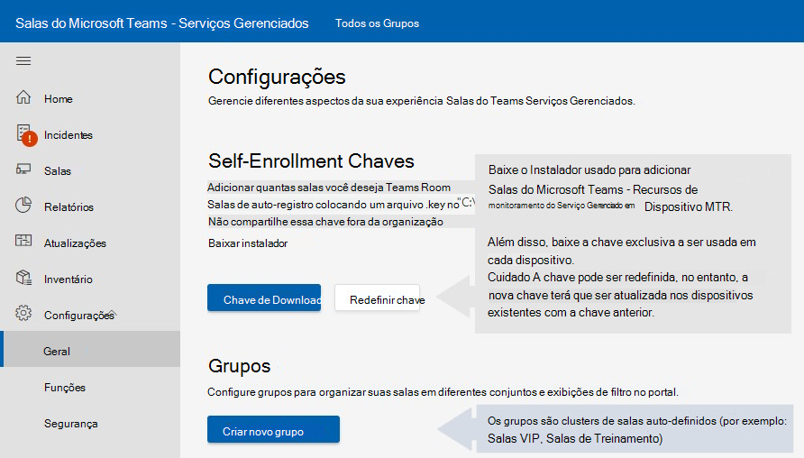

# Monitorar a instalação de software de dispositivo

A implantação requer a integração Salas do Microsoft Teams dispositivos para os Salas do Microsoft Teams gerenciados. O agente de serviço de monitoramento deve ser usado com sistemas Microsoft Teams MTR (Room) certificados e periféricos.

## Executando operações como o usuário administrador do dispositivo MTR

Alguns procedimentos de configuração/instalação exigem que você faça logoff no dispositivo como Administrador.

Para fazer logoff no dispositivo como Administrador (administrador local):

1. Certifique-se de desligar todas as chamadas em andamento e retornar à tela inicial.
1. Na interface de usuário da sala de Microsoft Teams, selecione Mais **,** em seguida, selecione Configurações , onde você é solicitado a obter **a** senha de Administrador local no dispositivo (a senha padrão é **_sfb_**).
1. Selecione **Configurações**, selecione **Windows Configurações** para acessar Windows como administrador local.  

1. Na lista de usuários exibidos na tela de logon Windows, selecione **Administrador** (ou o respectivo administrador local do seu dispositivo).

> [!NOTE]
> Se o computador *estiver* ingressado no domínio, escolha Outro Usuário **,** use **.\admin** ou o nome de usuário do administrador local configurado no dispositivo como o nome de usuário.  

Para retornar ao aplicativo Microsoft Teams Room depois de executar as tarefas administrativas necessárias:

1. No Windows ***menu Iniciar***, saia da conta Administrador.
1. Volte para Microsoft Teams Sala selecionando o ícone da conta de usuário no lado esquerdo da tela e selecionando **Skype**.

> [!NOTE]
> Se o Skype usuário não estiver listado, selecione Outro Usuário e insira ***.\skype*** como o nome de usuário e entre.

## Pré-requisitos

Siga estes procedimentos para configurar o hardware antes de tentar o processo de registro:

### Adicionando configurações de proxy (opcional)

1. Faça logon como administrador seguindo [a execução de operações como o usuário administrador do dispositivo MTR.](#performing-operations-as-the-admin-user-of-the-mtr-device)
1. No campo Windows ***Pesquisa** _ (seção inferior esquerda da tela), digite _ *cmd** (pressione a tela ou selecione à direita e escolha **_Executar como administrador_**).  
1. Execute o seguinte comando (aspas duplas no final do comando são importantes):
   - Se estiver usando um ***único servidor proxy***: bitsadmin /Util /SetIEProxy LOCALSYSTEM MANUAL PROXY : \_ <proxyserver> <port> ""

      *Exemplo:* bitsadmin /Util /SetIEProxy LOCALSYSTEM MANUAL \_ PROXY contosoproxy.corp.net:8080 ""
      

   - Se estiver usando um ***arquivo pac:*** bitsadmin /Util /SetIEProxy LOCALSYSTEM AUTOSCRIPT <pac file url> ""

      
      *Exemplo:* bitsadmin /Util /SetIEProxy LOCALSYSTEM AUTOSCRIPT `http://contosoproxy.corp.net/proxy.pac` ""
      

### Habilitando configurações do TPM

Se o TPM em um dispositivo Intel NUC estiver desabilitado, habilita o TPM nesses dispositivos da seguinte forma:  

1. Conecte o teclado a um dispositivo NUC.  
1. Reiniciar dispositivo.  
1. Para exibir a tela do BIOS, pressione rapidamente **F2**.  
1. Selecione **Avançado**.  
1. Selecione **Segurança**.  
1. No lado direito abaixo dos Recursos de Segurança, habilita a Tecnologia de Confiança **da Plataforma Intel.**  
1. Para salvar suas configurações, pressione **F10**.  
1. Na caixa de confirmação, selecione **Sim**.  

## URLs necessárias para comunicação

 > [!NOTE]
 > Todo o tráfego de rede entre o agente de dispositivos MTR e o portal de serviço Salas do Microsoft Teams – Serviços Gerenciados é SSL sobre a porta 443 *.*  Consulte [Office 365 URLs e intervalos de endereços IP - Microsoft 365 Enterprise | Microsoft Docs](/microsoft-365/enterprise/urls-and-ip-address-ranges?view=o365-worldwide&preserve-view=true).

Os hosts a seguir devem ser permitidos se você tiver a lista de permissão de **tráfego** habilitada em seu ambiente empresarial:

agent.rooms.microsoft.com 
global.azure-devices-provisioning.net 
gj3ftstorage.blob.core.windows.net 
iothubsgagwt5wgvwg6.azure-devices.net 
blobssgagwt5wgvwg6.blob.core.windows.net 
mmrstgnoamiot.azure-devices.net 
mmrstgnoamstor.blob.core.windows.net 
mmrprodapaciot.azure-devices.net 
mmrprodapacstor.blob.core.windows.net 
mmrprodemeaiot.azure-devices.net 
mmrprodemeastor.blob.core.windows.net 
mmrprodnoamiot.azure-devices.net 
mmrprodnoamstor.blob.core.windows.net

## Processo

O processo de inscrição envolve algumas etapas:  

1. Na barra de navegação à esquerda do portal Salas do Microsoft Teams – Serviços Gerenciados, expanda Configurações [http://portal.rooms.microsoft.com](https://portal.rooms.microsoft.com/) e selecione **Geral**.   
1. Em *Chaves de Registro Próprio,* selecione Baixar **hiperlink do instalador** para baixar o software do agente https://aka.ms/serviceportalagentmsi de monitoramento.
1. Selecione **Baixar Chave**. Coloque o arquivo de chave na **pasta C:\Rigel** em cada dispositivo que você está registrando.  
1. **Opcional:** Configurar configurações de proxy para o agente; consulte [Adicionando configurações de proxy (opcional)](#adding-proxy-settings-optional).
1. Instale o instalador do agente (baixado na etapa 2) em unidades MTR, executando o MSI localmente em um dispositivo MTR ou por meio de seus meios normais de publicação de aplicativos MSI em massa para dispositivos em seu ambiente (Política de Grupo etc.)  
1. A sala aparece no portal dentro de 5 a 10 minutos. Se isso não acontecer, entre em contato managedroomsupport@microsoft.com.  

## Instalação

Depois de baixar o instalador da Microsoft (a partir do portal ou usando a URL AKA.ms fornecida acima), descompra seu conteúdo para acessar o arquivoManagedRoomsInstaller.msi **.**

Há dois modos de instalação: instalação de máquina local individual e modo de implantação em massa (geralmente por meio de política de grupo de método semelhante). Recomendamos a instalação individual para máquinas que não ingressam no domínio ou para máquinas que você não tem como executar os instaladores MSI remotamente.  

Devido às várias maneiras variadas em que os clientes podem executar aplicativos MSI no modo de implantação em massa, este documento só passará pela instalação no modo individual.  

 > [!NOTE]
 > O fluxo de programa do instalador é o mesmo, independentemente do modo que está sendo executado. A única pequena diferença é que a instalação não solicita que um usuário pressione os botões next e close no modo de implantação em massa.  

## Passo a passo &mdash; ingressado no Domínio de Dispositivo Individual

1. Faça logoff no dispositivo como administrador – certifique-se de que as operações de execução como *o usuário administrador das etapas do* dispositivo sejam seguidas.

1. Copie os seguintes arquivos para o dispositivo MTR:

   - Coloque a "Chave de Auto-registro" (baixada anteriormente do portal) no diretório **C:\Rigel** do dispositivo.
   - Copie o **ManagedRoomsInstaller.msi** (baixado anteriormente do portal ou do AKA.MS) para o dispositivo.

1. Ao executar a tela ***ManagedRoomsInstaller.msi** _, você verá uma tela contrato de licença. Depois de ler o contrato, verifique _*_se aceito os termos_*_ no Contrato de Licença e pressione o botão _ *Install**.  

    Isso inicia a instalação do Salas do Microsoft Teams – Software de monitoramento de Serviços Gerenciados. Um prompt de elevação (executado como administrador) é exibido.
 1. Selecione ***Sim***.

    A instalação continuará. Durante o procedimento de instalação, uma janela de console é aberta e inicia o estágio final da instalação de software de monitoramento Salas do Microsoft Teams – Serviços Gerenciados.  

    > [!NOTE]
    > Não feche a janela. Depois que a instalação for concluída, o assistente exibirá um botão "Concluir".

## Concluindo o registro

Depois que a instalação for concluída, aguarde de 5 a 10 minutos e atualize o portal e o dispositivo será listado, relatado como *estado de* integração.

No *estado de Integração,* o status da sala é exibido e atualizado, mas não gerará alertas ou criará tíquetes de investigação.

Escolha a sala e selecione **Registrar para**  começar a receber alertas de incidentes, tíquetes de investigação ou para relatar um incidente.

Para dúvidas ou problemas, abra um incidente relatado pelo cliente no portal ou entre em contato managedroomsupport@microsoft.com.

### Desinstalar e desinstalar software de monitoramento

Para desemrollar o dispositivo, remova o agente de monitoramento do dispositivo MTR da seguinte forma:

1. No dispositivo que está sendo monitorado, faça logoff no dispositivo como administrador. Siga as etapas em *Executar operações como o usuário administrador do dispositivo*.
1. Baixe o script de redefinição [do aka.ms/MTRPDeviceOffBoarding](https://aka.ms/MTRPDeviceOffBoarding).
1. Extraia o script em algum lugar no dispositivo e copie o caminho.
1. Abra o PowerShell como administrador: no campo Windows ***Pesquisa** _ (seção inferior esquerda da tela), digite 'Powershell' e clique com o botão direito do mouse em _*_Windows PowerShell_**.
1. Selecione *"Executar como Administrador"* e aceite o prompt UAC.
1. Insira *Set-ExecutionPolicy –ExecutionPolicy RemoteSigned* e pressione **Y** no próximo prompt.  
1. Colar ou digitar o caminho completo para o script de offboard desacortado na janela do PowerShell e pressione **Enter**.

   Por exemplo:

   *C:\Users\admin\Downloads\MTRP \_ Device \_ Offboarding\MTRP \_ Device \_Offboarding.ps1*  

   Isso redefine o dispositivo para atualizações MTR padrão do usuário e remove o agente de monitoramento MTRP e os arquivos.

1. No menu à esquerda no portal Salas do Microsoft Teams – Serviços Gerenciados, selecione **Salas**.  
1. Na lista de salas fornecidas, escolha a sala que você deseja desem andamento e selecione **Desem** andamento para parar de receber alertas de incidentes ou tíquetes de investigação ou para relatar um incidente para a sala.

## Tabela de solução de problemas

> [!NOTE]
> Todos Salas do Microsoft Teams – Erros de monitoramento de Serviços Gerenciados são registrados em um arquivo de Log de Eventos específico chamado **Salas Gerenciadas da Microsoft.** 

### ***Local do arquivo de log do tempo de execução do aplicativo*** =  

C:\Windows\ServiceProfiles\LocalService\AppData\Local\ServicePortalAgent\ app-x.x.x\ServicePortalAgent\ServicePortal \_ Verbose \_ LogFile.log, onde **x.x.x** é o número da versão do aplicativo.

|**Sintoma**  |**Procedimento recomendado**  |
| :- | :- |
|
Você recebe uma mensagem de erro informando   

***ERRO: Execute este aplicativo com** _ 

_ *_privilégios elevados_**  
|Execute o aplicativo com privilégios escalonados e tente novamente  |
|  |  |
|
Você recebe uma mensagem de erro informando   

***Dados do TPM não podem ser encontrados***  
|Verifique se seu dispositivo tem o TPM (Trusted Platform Module) ligado em seu BIOS. Isso geralmente é encontrado nas configurações de segurança do BIOS do dispositivo  |
|  |  |
|
Você recebe uma mensagem de erro  

` `***ERRO: conta de usuário local denominada 'Admin' ou 'Skype' não encontrada***  
|Verifique se as contas de usuário existem no dispositivo Microsoft Teams de sala certificado.  |
|  |  |
|Você recebe qualquer mensagem de estado de erro que não seja abordada acima  |Forneça uma cópia do log de instalação ao seu Microsoft Teams de suporte do sistema. |
