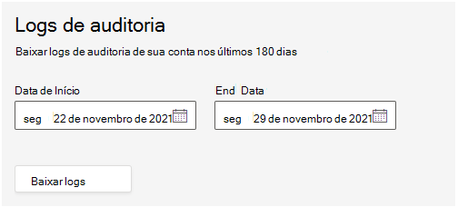

# Log de auditoria no serviço Salas do Teams Gerenciado

A auditoria Salas do Teams serviço Gerenciado (TRM) permite que você pesquise registros de auditoria para atividades realizadas no portal por usuários e administradores. Esse recurso é habilitado por padrão. Somente o Administrador de Serviços Gerenciados tem permissão para exportar e exibir os logs.

> [!NOTE]
> As ações executadas no serviço TRM não estão registradas Microsoft 365 ou Office 365 auditoria 

## Exportando logs

Quando você exporta todos os resultados para uma pesquisa de log de auditoria, os dados brutos do log de auditoria unificado são copiados para um arquivo CSV (valor separado por vírgula) que é baixado para o computador local. 

**Para baixar logs** 

1. Vá para **o Configurações > Geral > Logs de Auditoria.**
1. Para definir o intervalo de datas para logs de interesse, insira a **data de início** e a data de **término.**

   > [!NOTE]
   > Os logs só estão disponíveis por até 180 dias.

1. Selecione **Baixar logs.**

   

   Uma mensagem exibida na parte inferior da janela solicita que você abra ou salve o arquivo CSV. 

1. Selecione **Salvar**  >  **Salvar como** e salve o arquivo CSV no computador local. 

1. Demora um pouco para baixar muitos resultados de pesquisa ao pesquisar todas as atividades ou em um amplo intervalo de datas. Quando o arquivo CSV terminar de baixar, uma mensagem na parte inferior da janela será exibida.

## Propriedades detalhadas no log de auditoria

A tabela a seguir descreve as propriedades incluídas no CSV.

|Propriedade|Descrição|
| - | - |
|activity.category|
A categoria do objeto no qual a ação foi executada. Valores possíveis:

**Usuário, Atribuição, PartnerInvitation, Função**
|
|activity.objectName|O nome do objeto que foi modificado.|
|activity.operation|O tipo de operação executada. Os valores possíveis são: **Criar, Atualizar, Excluir** |
|activity.resultStatus|
Indica se a ação (especificada na propriedade **activity.operation)** foi bem-sucedida ou não.

O valor é **Bem-sucedido** ou **Falhou.**
|
|activity.tenantId|O GUID do locatário no qual a ação foi executada|
|creationTime|A data e a hora em UTC (Tempo Universal Coordenado) no formato ISO quando o usuário realizou a atividade.|
|user.userId|O usuário que realizou a ação que resultou no registro registrado.|
|user.userTenantId|O GUID do locatário para o usuário que realizou a ação|

