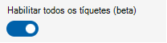

# Gerenciamento de clientes de vários locatários para parceiros

O MTM (gerenciamento de vários locatários) no serviço de Gerenciamento de Salas Teams Pro ajuda as organizações parceiras a gerenciar vários clientes em um só lugar, com suas próprias credenciais de domínio. Os usuários parceiros só verão salas de clientes que são atribuídas para gerenciar. É possível aplicar funções personalizadas para cada cliente no portal do MTM, fornecendo às organizações parceiras controle granular de permissões aos recursos do cliente. 

O portal do MTM pode ser acessado por meio deste [link](https://partner.rooms.microsoft.com/).

> [!Note] 
> As organizações parceiras não podem gerenciar suas próprias salas por meio do portal do MTM. Essas salas podem ser gerenciadas no [portal do Pro Management](https://portal.rooms.microsoft.com/). 

## Pré-requisitos para gerenciar seus clientes por meio da experiência MTM

Para obter acesso ao portal mtm, sua organização deve ser integrada como um Parceiro elite para o MTR Pro Management. Para se tornar um askelite@microsoft.com de contato do parceiro Elite.

## Clientes in-boarding

Para gerenciar clientes por meio do portal Pro Management-MTM, é necessário estabelecer uma relação entre o locatário da organização parceira e o cliente por meio de um convite enviado pelo cliente. 

## Gerentes de locatários

Essa função interna só é configurável no portal Pro Management-MTM. Essa função permite atribuir um grupo de usuários que aceitam convites, mas não estão envolvidos com o gerenciamento de salas de clientes. É recomendável configurar a função. Caso contrário, somente usuários com a função administrador de serviço gerenciado em seu locatário poderão aceitar convites.

**Para configurar gerentes de locatários**
 
1.  Faça logon no portal do Pro Management-MTM como administrador global ou administrador do Serviço Gerenciado.
2.  Vá para gerentes de locatários.
3.  Selecione **Adicionar gerentes de locatário.**
4.  No painel de detalhes, pesquise os usuários ou grupos de segurança.
5.  Selecione o usuário ou o grupo.
6.  Selecione **Adicionar**.

### Convite do cliente

O parceiro deve fornecer o nome de domínio aos clientes. Somente as funções administrador global, administrador de serviço gerenciado e gerenciador de locatários podem ver e aceitar o convite quando fizerem logon no portal do Pro Management-MTM. 

> [!Note]
> Embora essas funções possam ver convites e metadados de locatário de alto nível, você não verá os dados do cliente até receber uma função com esse cliente.

Os detalhes sobre o convite ao cliente são descritos no [gerenciamento multilocatário para clientes](multi-tenant-management-customer.md).

**Para aceitar um convite pendente**

1. Faça logon no portal do Pro Management-MTM como administrador global, administrador do Serviço Gerenciado ou Gerenciador de Locatários.
1. Vá para **Locatários**.
1. Selecione o convite exibido com um status de "Pendente".
1. Examine os detalhes do convite.
1. Atribua usuários que serão os principais administradores desse cliente.
1. Selecione **Aceitar** para estabelecer a relação parceiro-cliente.

   Selecionar **Negar** exclui o convite.

   > [!Note]
   > Não há associação permanente com o usuário que aceita o convite.

   > [!Note]
   > *Se o convite for negado acidentalmente, o cliente deverá criar um novo convite.* 

**Para examinar a configuração ou adicionar mais administradores primários para um locatário**

1. Selecione o cliente na lista **Locatários** .
1. No painel de detalhes, selecione **Administradores primários**.
1. Pesquise o usuário ou o grupo.
1. Selecione **Adicionar** para confirmar a seleção.

## Clientes desacolhenciados

Para desabilitar um cliente, você deve removê-los da lista **Locatários** .

**Para remover um cliente** 

1. Faça logon no portal do Pro Management-MTM como um administrador primário para o cliente que você deseja remover.
1. Vá para **Locatários**.
1. Selecione o cliente que você deseja remover.
1. No painel de detalhes do cliente, selecione **Remover cliente**.
1. Selecione **Excluir** no prompt de confirmação para encerrar a associação entre você e o locatário do cliente.

## Gerenciando funções de parceiro

As funções de parceiro permitem delegação de responsabilidades para pessoal adicional. O conceito dessas funções é o mesmo descrito no [controle de acesso baseado em função](rooms-pro-rbac.md), mas no contexto de cada cliente. Além disso, é importante observar que as funções de parceiro são distintas das funções do cliente. As funções de parceiro podem ser excluídas pelo cliente. 

A função **administrador primário** é a única função interna para cada cliente embarcado e tem quase todas as permissões, no contexto do cliente, para o serviço Pro Management (consulte tabela 1). As permissões de função partner** só se estendem até as salas designadas pelo cliente. Por exemplo, se o cliente for uma organização global e atribuir o Parceiro para gerenciar todas as salas dos EUA, o administrador primário só poderá gerenciar e delegar permissões para essas salas. O Parceiro não tem visibilidade para outras salas que o Cliente pode ter em outros países. 

**Para gerenciar usuários na função **Partner** para um cliente**

1. Acesse **Configurações > Funções**. 
1. Selecione o cliente na lista suspensa para a qual você deseja editar a função de parceiro.
1. Selecione a função interna de **administradores primários** na lista.
1. Selecione **Atribuições.**
1. Na lista, selecione **Administradores Atribuídos.**
1. Selecione **Membros.**
1. Selecione **Editar.** 
1. Pesquise o usuário ou o grupo de segurança que você deseja adicionar na barra de pesquisa.
1. Selecione o usuário ou o grupo.
1. Selecione **Salvar** para confirmar as alterações.

### Gerenciando funções de parceiro personalizadas para um cliente

Como parceiro, você pode criar funções personalizadas para atender aos seus requisitos operacionais. Por exemplo, você pode criar uma função de help desk que só deve ter permissões de gerenciamento de incidentes. 

**Para gerenciar funções**

1. Acesse **Configurações > Funções**. 
1. Selecione o cliente no menu suspenso para o qual você deseja editar a função de parceiro.
1. Crie uma [função personalizada](rooms-pro-rbac.md#built-in-roles).

|Recurso|Permissão|**mmr Administração**|**Site Lead**|**Site Tech**|**Administradores primários**|
| :- | :- | :- | :- | :- | :- |
|Quartos|Exibir| &#10004;|&#10004;|&#10004;|&#10004;|
||Modificar|&#10004;|&#10004;|&#10004;|&#10004;|
||Redefinir chave|&#10004;||||
||Baixar chave|&#10004;|&#10004;|&#10004;||
||Unenroll|&#10004;|&#10004;|&#10004;||
||Criar |&#10004;|&#10004;|||
|Gerenciamento de grupo|Exibir|&#10004;|&#10004;||&#10004;|
||Modificar|&#10004;|&#10004;|||
||Criar |&#10004;|&#10004;|||
|Atualizar o gerenciamento de anel|Exibir|&#10004;|&#10004;||&#10004;|
||Modificar|&#10004;|&#10004;||&#10004;|
|Relatórios|Exibir|&#10004;|&#10004;||&#10004;|
||Criar incidente do cliente|&#10004;|&#10004;|&#10004;|&#10004;|
|Gerenciamento de Tíquetes|Exibir|&#10004;|&#10004;|&#10004;|&#10004;|
||Atualizar|&#10004;|&#10004;|&#10004;|&#10004;|
|Configurações de MMR|Exibir|&#10004;||||
||Modificar|&#10004;||||
|Gerenciamento de funções|Exibir |&#10004;|||&#10004;|
||Modificar|&#10004;|||&#10004;|

> [!Note]
> Um usuário atribuído como administrador primário do Cliente A tem permissões completas no serviço de Gerenciamento de Profissionais somente para esse cliente. As permissões do usuário no Cliente A não têm influência sobre outros clientes.

## Segurança

Os clientes finais mantêm o controle sobre o acesso aos seus dados e podem remover completamente um parceiro ou funções específicas a qualquer momento.

Com o recurso de acesso delegado, um parceiro não obtém outros privilégios fora do portal do Pro Management. Por exemplo, usando esse recurso para convidar um parceiro para gerenciar salas no portal do Pro Management, nenhuma permissão é concedida ao AAD ou ao Teams Administração Center ou a qualquer outro produto microsoft. Além disso, os parceiros não têm acesso para exibir ou modificar salas não definidas no escopo do convite.

Depois que o parceiro — relacionamento com o cliente é estabelecido — conforme descrito no "Integrando clientes" deste documento, o parceiro poderá exibir dados de sala no portal do Pro Management. Isso inclui todos os dados presentes no portal do Pro Management, mas derivados de outros produtos da Microsoft. Por exemplo, os relatórios de qualidade de chamada no portal do Pro Management são derivados de dados de qualidade de chamada do Teams.

Os dados residem no locatário do cliente e não são copiados para o locatário do parceiro. 

O portal MTM usa a autenticação AAD para validar as credenciais de logon do parceiro. É importante observar que, neste momento, as políticas de autenticação do cliente não se aplicarão ao parceiro. Por exemplo, se o cliente tiver uma política de autenticação multifator, ele não se traduzirá para o parceiro.

O cliente pode fazer pull de logs de auditoria para o portal do Pro Management, que inclui atividades de parceiro. Consulte [Fazer logon de auditoria no serviço gerenciado Salas do Teams](multi-tenant-auditing.md).

> [!Note]
> A auditoria do AAD e a auditoria do O365 não capturam logs do portal de Gerenciamento Profissional.

## Navegando pelo portal do MTM

O portal do MTM tem dois modelos interativos para navegar entre os dados do cliente:

- Agregar exibições em que os dados de todos os seus clientes são consolidados em uma única lista e podem ser filtrados.

  > [!Note]
  > Essa exibição só tem suporte na página **Incidentes** quando **a exibição Habilitar todos os tíquetes** é alternada.
  >
  > 

 - Alternação de locatário em que somente dados do **Cliente** selecionados na lista suspensa são exibidos.
