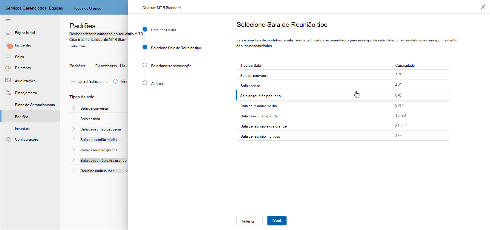
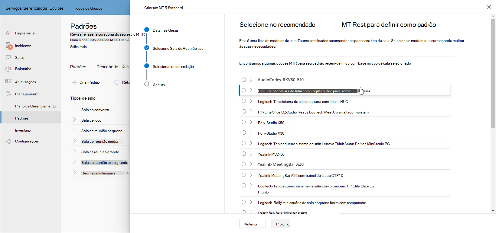
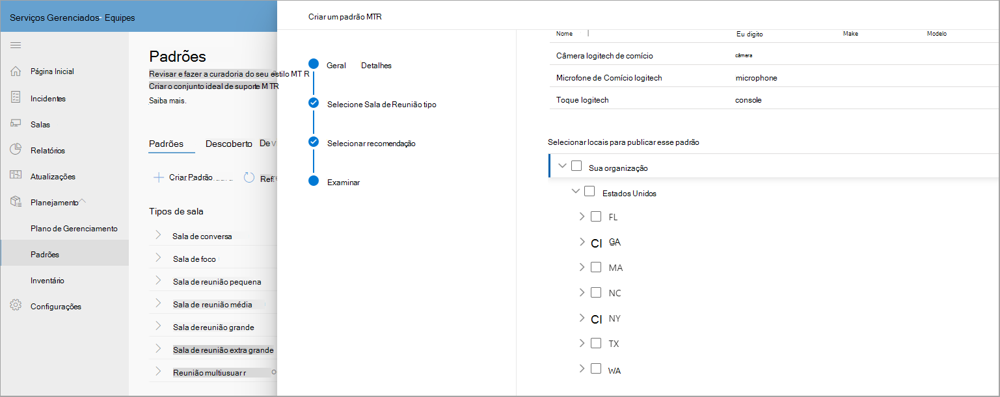
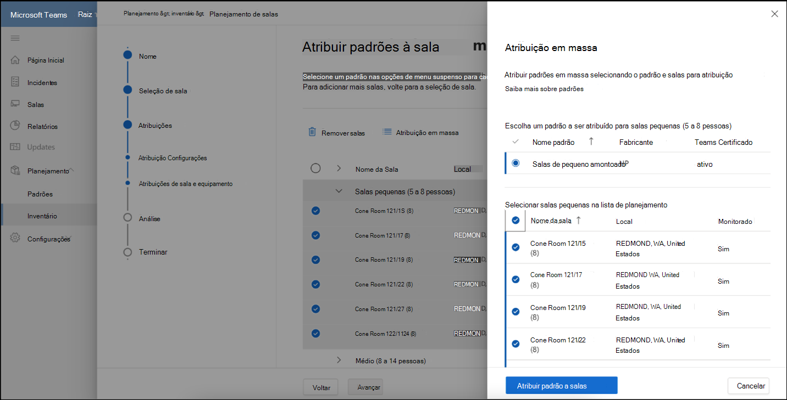
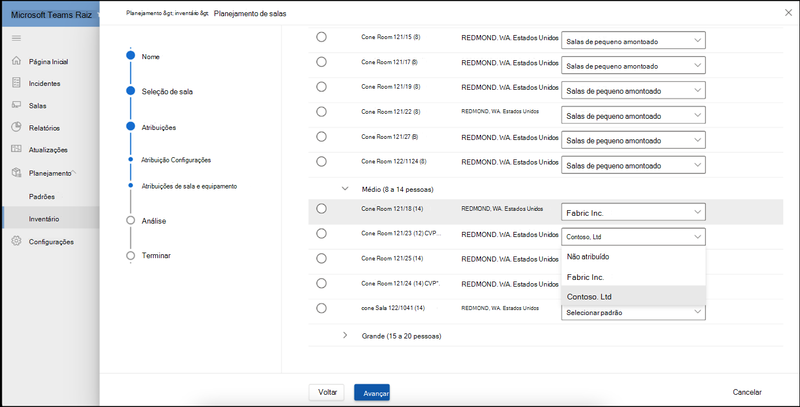

# Standards e Planejador de Sala

Usando recomendações inteligentes do seu ambiente, você pode criar e coletar padrões. Em seguida, você pode publicar seus padrões em uma região, site, prédio ou uma sala de reunião específica para compartilhar salas planejadas com parceiros para acompanhar implantações de sala.

## Exibir tipos de sala de reunião

Nesta página, você pode exibir os tipos de espaço de reunião ou sala em sua organização. Uma rápida análise de quantos padrões você tem para salas de reunião, quantos novos dispositivos foram descobertos e o número de dispositivos que exigem que uma ação seja tomada.

Esta página também tem uma barra de comandos na qual você pode iniciar  o fluxo de trabalho Criar um fluxo de trabalho padrão ou navegar até Dispositivos Descobertos, Logs de Alteração e Arquivo Morto.

### Criar padrões

Use o **fluxo de trabalho Criar Padrão** para criar um padrão.

**Para iniciar o fluxo de trabalho**

1. Selecione **Criar um MTR Standard** e forneça detalhes gerais, como nome e descrição para o padrão.

   

1. Selecione o tipo de sala de reunião para este padrão.

   

1. Selecione entre os modelos de sala certificados do Teams recomendados em seu inventário de hardware. A lista varia dependendo do tipo de sala selecionado na etapa anterior.

   

1. Examine as informações padrão do MTR.

   

1. Publique seus padrões em uma região, site, prédio ou uma sala de reunião específica.

   

Depois de publicados, os padrões são usados para fins de planejamento.

### Dispositivos descobertos

Em Padrões, selecione Dispositivos **Descobertos** para exibir todos os dispositivos descobertos não padrão em sua organização.

Você pode tomar medidas para examinar e criar padrões desses dispositivos descobertos em seu inventário.

## Planejamento de sala

Planeje salas com padrões para expansão de reuniões usando o **assistente planejador de** salas.

Para iniciar o planejador de sala com experiência guiada:

1. Na navegação à esquerda, selecione Inventário e, em seguida, escolha **Planejar Salas**.

   

1. Adicione salas ao planejador do diretório de localização.

   

1. Defina suas preferências de atribuição de padrões da seguinte maneira:

   - Se você tiver um parceiro de planejamento registrado, poderá selecionar Fazer com que meu parceiro atribua a **melhor solução para todas essas salas**. Essa opção faz com que o parceiro selecione a melhor solução localmente encontrada para seu cliente.

   - Se você planejar a expansão de reuniões internamente, selecionar Administrador da organização atribuirá a melhor solução para todas as **salas usando os padrões da organização**. Os padrões são atribuídos automaticamente do que foi aprovado e publicado pela organização na exibição Padrões.

1. Selecionar **Administrador da organização atribuirá a melhor solução...**

   

Você pode atribuir padrões em massa a várias salas.

1. Verifique várias salas abaixo do **Nome da Sala**.

   

   

Se você tiver mais de um padrão disponível para um local, região ou site, selecione um padrão na lista Atribuição Padrão para atribuir a uma sala de reunião exibida abaixo do nome **da sala**.

Examine as atribuições padrão e conclua o plano. Você pode imprimir o plano em PDF para compartilhar com parceiros.

## Controle de acesso

O assistente do planejador de sala está habilitado por padrão para a função de Administrador de Serviços Gerenciados. Para o Cliente e todas as outras funções internas, defina as permissões para o gerenciamento de inventário na **guia** Permissões.

