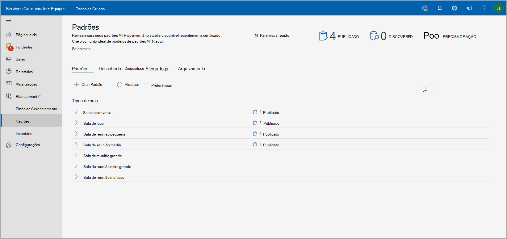

# Standards and Room planner

Usando recomendações inteligentes do seu ambiente, você pode criar e criar padrões de cura. Em seguida, você pode publicar seus padrões em uma região, site, construção ou uma sala de reunião específica para compartilhar salas planejadas com parceiros para acompanhar implantações de sala.

## Exibir tipos de sala de reunião

Nesta página, você pode exibir tipos de espaço de reunião ou sala na sua organização. Uma quebra rápida de quantos padrões você tem para salas de reunião, quantos novos dispositivos foram descobertos e o número de dispositivos que exigem uma ação a ser tomada.

Esta página também tem uma barra de comandos de onde você pode iniciar o  **fluxo** de trabalho padrão ou navegar até Dispositivos Descobertos, Alterar logs e Arquivo Morto.

### Criar padrões

Use o **fluxo de trabalho Criar Padrão** para criar um padrão.

**Para iniciar o fluxo de trabalho**

1. Selecione **Criar um Padrão MTR** e forneça detalhes gerais, como nome e descrição para o padrão.

   

1. Selecione o tipo de sala de reunião para esse padrão.

   

1. Selecione entre os modelos de sala Teams certificados recomendados em seu inventário de hardware. A lista varia dependendo do tipo de sala selecionado na etapa anterior.

   

1. Revise as informações do MTR Standard.

   

1. Publique seus padrões em uma região, site, construção ou uma sala de reunião específica.

   

Depois de publicado, os padrões são usados para fins de planejamento.

### Dispositivos Descobertos

Em Padrões, selecione **Dispositivos Descobertos** para exibir todos os dispositivos não padrão descobertos em sua organização.

Você pode tomar medidas para revisar e criar padrões a partir desses dispositivos descobertos em seu inventário.

## Planejamento de sala

Planeje salas com padrões para expansão de reuniões usando o **assistente do planejador de** salas.

Para iniciar o planejador de sala com experiência guiada:

1. Na navegação à esquerda, Selecione Inventário e escolha **Planejar Salas**.

   

1. Adicione salas ao planejador do diretório de localização.

   

1. De definir suas preferências de atribuição de padrões da seguinte forma:

   - Se você tiver um parceiro de planejamento registrado, selecione Fazer com que meu parceiro atribua a melhor solução **para todas essas salas**. Essa opção faz com que o parceiro selecione a melhor solução localmente encontrada para seu cliente.

   - Se você planejar a expansão de reuniões no local, selecione Administrador da organização atribuirá a melhor solução para todas as salas **usando os padrões da organização**. Os padrões são atribuídos automaticamente a partir do que foi aprovado e publicado pela organização no exibição Padrões.

1. Select **Organization admin will assign the best solution...**

   

Você pode atribuir padrões em massa a várias salas.

1. Verifique várias salas abaixo **do Nome da Sala**.

   

   

Se você tiver mais de um padrão disponível para um local, região ou site, selecione um padrão na lista Atribuição Padrão para atribuir a uma sala de reunião exibida abaixo do **nome da sala**.

Revise as atribuições padrão e termine o plano. Você pode imprimir o plano em PDF para compartilhar com parceiros.

## Controle de acesso

O assistente do planejador de sala está habilitado por padrão para a função Administrador de Serviço Gerenciado. Para Cliente e todas as outras funções criadas, de definir as permissões para gerenciamento de inventário na **guia** Permissões.

