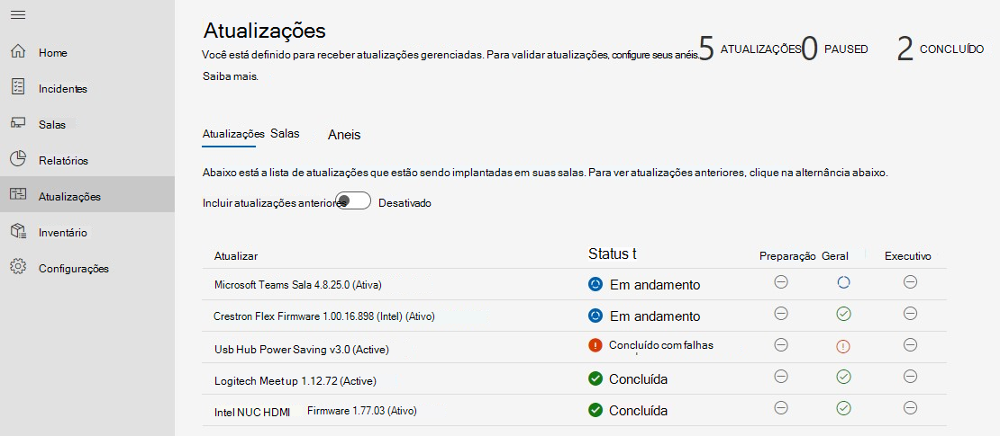
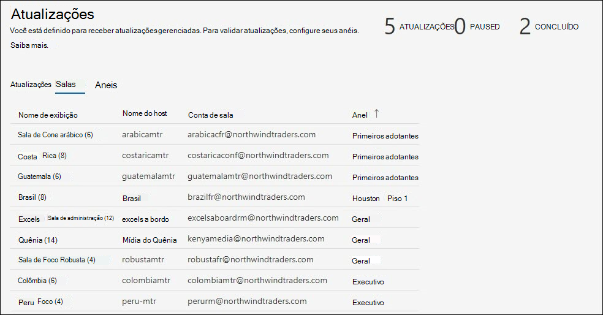
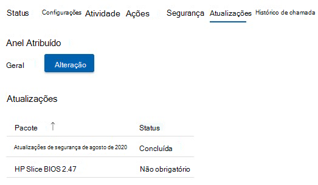

# Gerenciamento de atualizações 
Uma sala de reunião moderna é equipada com um dispositivo Salas do Microsoft Teams e outros periféricos, como uma câmera, microfone ou alto-falante e, potencialmente, mais dispositivos para criar uma experiência de reunião inclusiva e eficaz. Equipamentos de diferentes tipos de OEMs fornece a experiência organizacional exata desejada; no entanto, eles devem ser mantidos com software e firmware em uma base contínua.  

Os Serviços Gerenciados para Salas do Microsoft Teams fornece a garantia de que cada sala em sua organização será mantida nos níveis recomendados para fornecer uma sala que esteja sempre pronta e funcione corretamente. O objetivo da Microsoft é reduzir a complexidade e o trabalho da equipe operacional com inteligência e automação. A solução de problemas ou diagnósticos é executada o mais rápido possível. 

## Fazer a transição de um dispositivo para serviços gerenciados 
Os dispositivos de sala que integram os Serviços Gerenciados geralmente têm um histórico e uma prática de gerenciamento de alterações diferentes de nossas diretrizes.  

- Para se beneficiar dos Serviços Gerenciados, você deve fazer a transição do gerenciamento de alterações para todas as atualizações no portfólio de Serviços Gerenciados.
- Várias fontes de SLAs incidentes de impacto de gerenciamento de alterações, pois há uma descoberta e correção que será reiniciada novamente se um incidente acontecer na sala.
- A Microsoft implementou controles e verificações para implementar políticas que podem diferir de uma organização para outra e a capacidade de intervir em situações excepcionais.
- Eventualmente, os dispositivos de sala serão atualizados para padrões comuns, exceto por exceções devido a problemas com uma instalação de hardware específica.  

## Dispositivos de transição: Verificações básicas de preparação 
A maioria das falhas inesperadas surgem de alterações na imagem base com histórico incerto de gerenciamento de alterações. 

As seguintes verificações simples de preparação são recomendadas:  

- **Imagem Base**: A imagem base deve ser do OEM específico. Se o dispositivo tiver sido reconstruído no passado e mostrar falhas inesperadas ou comportamentos em tarefas comuns, a imagem base deve ser restaurada. Podemos fornecer assistência, mas não é possível reconstruir remotamente o dispositivo de sala, portanto, você precisará de um técnico de site local.  
- **Sistema operacional base, Edição:** O sistema operacional base e a edição devem corresponder aos requisitos de Salas do Microsoft Teams dispositivos. Se isso não for verdade, ele deve ser corrigido como parte da integração. Salas do Microsoft Teams requer o Windows 10 IoT Enterprise ou Windows 10 Enterprise SKUs em Semi-Annual de manutenção do Canal. Consulte as [diretrizes de MTR oficiais](rooms-lifecycle-support.md#windows-10-release-support) para obter mais informações.

## Verificações de preparação

Há alguns pré-requisitos para receber atualizações de serviços gerenciados: 

|Software |Orientação |
| :- | :- |
|Serviços de Sincronização logitech  |Deve ser instalado e executado nos dispositivos da sala de reunião logitech. Os serviços de sincronização necessários serão instalados automaticamente Windows atualizações, a menos que bloqueados. O pacote sync completo também pode ser instalado. |
|Windows do sistema operacional |Deve ser mantido habilitado e não redirecionado para o WSUS, nem bloqueado de uma perspectiva de rede. Nem as políticas de GPO nem MDM devem ser usadas para gerenciar atualizações do sistema operacional. |
|Microsoft Store atualizações   |Deve ser desligado. Os Serviços Gerenciados desativarão as atualizações da Loja se encontrados. |
|Software antivírus |Se você estiver executando software AV nesses dispositivos, certifique-se de que a AV tenha exclusões no local para Teams e Skype dlls. Consulte aqui para obter mais detalhes. |
|Software adicional |Softwares adicionais, como exibição de área de trabalho remota de terceiros, etc. devem ser revisados com Serviços Gerenciados para excluir efeitos colaterais. |
|Gerenciamento adicional de alterações|Pode interferir nas atualizações cobertas e não deve ser introduzido. |

## Atualizações gerenciadas – Como funciona 
Há duas maneiras principais de como as atualizações são gerenciadas:  

- **Gerenciado automaticamente:** as atualizações são instaladas em seu dispositivo de sala com base na avaliação dos Serviços Gerenciados. Nenhuma intervenção é necessária para as atualizações gerenciadas em nosso portfólio.
- **Anel validado**: Configurar um sistema de anel para visualizar atualizações em dispositivos específicos para que você possa monitorá-las sem o trabalho de etapa associado. A configuração de anel fornece uma camada adicional de due diligence antes de grandes lançamentos.  

### Gerenciado automaticamente

Se você optar por ser gerenciado automaticamente, nenhuma ação será necessária para as atualizações de sua parte. No entanto, você deve revisar o portfólio atual de atualizações com suporte dos Serviços Gerenciados. O portfólio está constantemente recebendo novas adições, e é nossa prioridade abranger as atualizações mais frequentes e impactadas para garantir a estabilidade da sala. Verifique a lista atual (na seção "Gerenciamento de Atualizações" deste documento) para planejar qualquer gerenciamento de alterações adicional necessário para sua organização.  

**Recomendação:** Não instale atualizações cobertas pelos Serviços Gerenciados em qualquer dispositivo gerenciado por conta própria. Se você encontrar algum problema, informe um incidente no portal.

### Validação de anel

Ao escolher a validação de anel, revise as seções a seguir sobre como os anéis funcionam nos Serviços Gerenciados e as opções disponíveis para personalizá-la para sua organização. Mesmo com a validação de anel, os Serviços Gerenciados tenta garantir que as salas não sejam anteriores às atualizações recomendadas. Dependendo da situação, uma sala pode receber atualizações de "atualizar" para garantir que ela está em conformidade com as recomendações de serviço gerenciado.  

 Verifique se há anúncios na home page do portal e na documentação dos Serviços Gerenciados à medida que novos tipos de software e firmware se tornam disponíveis no portfólio. Como os especialistas em Serviços Gerenciados estão revisando versões de atualização diariamente em nosso portfólio de dispositivos, eles abordam problemas específicos e atualizações de destino com base na necessidade.  

### Agendar 
As atualizações gerenciadas são agendadas para salas com base no equipamento na sala e se não estão a atender aos padrões de Serviços Gerenciados para software e firmware aplicáveis.  

- Para ajudar nossos clientes a atender aos requisitos de gerenciamento de alterações, atualize o início da implantação às **quartas-feiras** no anel de preparação. Se uma atualização crítica for necessária, ignoraremos esse cronograma e liberaremos a atualização assim que ela estiver disponível. 

- As atualizações são sequenciadas com base na necessidade em uma sala específica. 
- Se você tiver anéis de configuração para validar as atualizações, a atualização avançará por meio da ordem de toque. 
- Uma nova atualização pode sobressuprir uma atualização que está na fila se determinarmos que a estabilidade da sala é aprimorada com base em sua situação.  
- As atualizações geralmente são aplicadas durante nossa janela de manutenção noturna – que é o horário local da sala **12:00 – 5:00 para** evitar qualquer tipo de interrupção. 

## Microsoft Teams de ciclo de vida de atualização de aplicativos de sala 
A política de suporte da equipe de engenharia MTR afirma que todo o suporte termina após o ciclo de vida de doze (12) meses de uma versão ter expirado ou se mais de duas atualizações foram lançadas desde então. Em seguida, os clientes devem atualizar para uma versão com suporte. Faça referência [Salas do Microsoft Teams suporte a versão do aplicativo - Microsoft Teams | Microsoft Docs ](rooms-lifecycle-support.md)para descrição detalhada do serviço.

Para manter um padrão uniforme em todas as nossas salas gerenciadas e nos permitir identificar com eficiência problemas de tendência, vamos dar suporte e implantar as duas versões principais ou secundárias mais recentes (N, N-1) do software do Aplicativo MTR de acordo com os Termos e Condições dos Serviços de Assinatura e Suporte. Atualizaremos automaticamente as salas não compatíveis, ignorando os anéis de atualização, conforme necessário. 

A política N-1 também se aplica a softwares de terceiros.  

## Passo a passo da experiência de gerenciamento de atualizações  
Para exibir atualizações, faça logoff no portal de serviços gerenciados e navegue até a página Atualizações.

O painel Atualizações exibe uma visão geral de alto nível do gerenciamento de atualizações para suas salas com as seguintes guias:

- **Atualizações**: Atualizações de software ou firmware que os Serviços Gerenciados estão orquestrando por meio da sua organização.  
- **Salas**: A guia Salas fornece uma exibição de salas e anéis aos quais cada um pertence.
- **Anéis**: a guia Anéis mostra os anéis de salas da sua organização.

### Atualizações  

Esta exibição mostra as atualizações relevantes para seu locatário e seu respectivo status. Para exibir atualizações anteriores que não estão mais ativas, selecione **a** opção Incluir atualizações anteriores para ATIVADO.  

Qualquer atualização pode estar em um dos seguintes estados:

| Status | Descrição |
| :- | :- |
| Agendado | Uma atualização é agendada para as salas em um determinado anel. Lembre-se de que uma atualização só mostrará Scheduled depois que a progressão atingir o anel em que a sala está. Por exemplo, se uma nova atualização estiver no anel de Preparação, ela mostrará Somente Agendado para salas no anel de Preparação. 
 Outros anéis terão um status "Não obrigatório" até que a atualização progrida para esse anel.
 |
| Em andamento | Uma atualização está em andamento e os anéis individuais mostram o status. Este estado mostra o status geral do anel e, portanto, se uma atualização se aplicar a uma única sala no anel de Preparação em seu locatário, a atualização terá um estado "Em Andamento" até que o anel Executivo seja atingido. |
| Concluído com falhas | Uma atualização concluiu a progressão por todos os anéis configurados e falhou em pelo menos uma sala. |
| Concluído | Uma atualização concluiu a progressão por todos os anéis configurados e foi instalada com êxito em todas as salas aplicáveis.|
| Preterido | Uma atualização foi desativada. A implantação posterior é interrompida. Isso é comum porque a atualização foi superada por uma nova versão. |
| Pausado | Uma atualização está em estado pausado. |
| Não obrigatório | A atualização ainda não é avaliada para a sala ou não se aplica à sala. |

### Salas  

A guia Salas mostra todas as salas em seu locatário e a qual anel eles pertencem.  

Para configurar a qual anel uma sala deve pertencer:  

1. Clique na sala para trazer a exibição detalhada.  
1. Em **Anel,** clique em **Alterar**.  
1. Selecione o Anel ao qual a sala deve pertencer.  
1. Clique **em Atribuir**.  

O visor detalhado da sala exibe as atualizações relevantes e seu status no **nó Atualizações.**  

### Rings  

Os anéis são usados para reduzir o risco de problemas derivados da implantação das atualizações de recursos. Isso é feito implantando gradualmente a atualização em todo o site. Cada anel deve ter uma lista de salas Microsoft Teams Sala e um cronograma de lançamento correspondente. A definição de anéis geralmente é um evento único (ou pelo menos pouco frequente), mas a IT deve revisitar esses grupos de vez em quando para garantir que a sequenciamento ainda esteja correta.  

A **guia Anéis** lista todos os anéis em seu locatário. Há três anéis pré-configurados:  

**Preparação**

Atribua salas ao anel de preparação, que é o seu testbed. Todas as novas atualizações serão roladas aqui primeiro. Geralmente, você deseja garantir que o anel de preparação represente salas com a diversidade de tipos de dispositivos em seu ambiente. Se houver certos tipos de salas com uma configuração incomum ou um histórico de problemas de visão, considere representá-las em Preparação.

**Geral**

Por padrão, todas as salas são colocadas nesse anel. A maioria dos dispositivos de sala que estão sendo usados em toda a empresa se enquadra nessa categoria. 

**Executivos**

Esse grupo deve incluir suas salas mais de alto perfil onde você deseja minimizar a interrupção proativamente. Um bom exemplo é uma sala de conferência grande usada para reuniões executivas ou grandes reuniões de equipe. 

### Especificando linha do tempo de lançamento

As atualizações não podem exceder 60 dias para ser concluídas em todos os anéis.  

|**Parâmetro** |**Explicação** |
| :- | :- |
|
 

Período de adiamento 
|
Depois que uma atualização começa com o primeiro toque, o período de adiamento é o atraso em dias antes da atualização ser iniciada nesse anel.  

 
|
|
 

Duração de lançamento  

 
|
Quando a atualização é iniciada nesse anel, este é o momento de implantar nesse anel. Por exemplo, se a duração for de 5 dias, ela implantará mais de 5 dias nas salas nesse anel assim que a atualização for iniciada nesse anel. 

 
|
|
 

Período de Teste 
|

O número de dias para testar/validar a atualização em um anel aplicado uma vez ao anel. O período de teste começa depois que a adoção é concluída e, uma vez concluída, a atualização é deslocada para o próximo anel. 

 
|
|
 

Tempo de conclusão 
|
 

A coluna "Tempo de Conclusão" indica o número total de dias (duração de lançamento + período de teste) para esse anel ser concluído.  

 
|
|
 

Tempo Total 
|
 

Na parte inferior está a linha "Total", que indica quanto tempo uma atualização levará para ser concluída do primeiro ao último anel. 

 

 
|

### Criando anéis personalizados

1. Navegue até a **guia Anéis.**  
1. Clique **em Adicionar anel**.  
1. Especifique a ordem na qual esse anel receberá a atualização, onde 1 é o primeiro e 9 é o último.  
1. Dê um nome a esse anel.  
1. Forneça uma descrição, se desejado.  
1. Especifique o número de dias em que a atualização será rolada neste anel.  
1. Especifique o período de teste.  
1. Clique **em Enviar**.  

> [!NOTE]
> O "Dias definidos por outros anéis" é o número total de dias que uma atualização levará para ser concluída em todos os anéis. O "Dias Restantes" indica os dias máximos para *que esse* anel seja concluído. A soma de "Duração de lançamento em dias" e "Período de teste em dias" não pode exceder esse valor.  

**Editar um anel**

1. Navegue até a **guia Anéis.**
1. Clique no anel para excluir.  
1. Clique **em Editar anel**.  
1. Edite o número de dias de lançamento e teste, conforme necessário.

**Excluir um anel**

1. Navegue até a **guia Anéis.**  
1. Clique no anel para excluir.  
1. Clique **em Excluir anel**.  

> [!NOTE]
> Os anéis padrão não podem ser excluídos.  

**Mover salas**

Mover salas de um anel para outro é possível de duas maneiras:

1. Navegue até a **guia Anéis.**  
1. Clique no anel de onde você deseja mover salas  
1. Clique **em Mover salas**.  
1. Selecione as salas que você deseja mover na **Lista de Salas**.  
1. Escolha o anel De destino, para o qual as salas selecionadas serão movimentadas no menu suspenso.  
1. Clique **em Mover salas**.  

**Ou**

1. Abra os detalhes da sala que você deseja mover (por meio de Incidentes, Salas ou Atualizações -> Salas).
1. Clique na **guia Atualizações.**  
1. Em **Anel Atribuído,** clique em **Alterar**.
1. Na lista suspenso, selecione o novo anel.  
1. Clique **em Atribuir**.

## Atualizações gerenciadas: visibilidade e controle

Os serviços gerenciados orquestram atualizações em toda a sua organização. No entanto, você tem a visibilidade e o controle para intervir, se necessário. Aqui estão as maneiras: 

- Em caso de falha na atualização, um tíquete é gerado automaticamente com a equipe de Operações de Serviço Gerenciado da Microsoft. A equipe de Operações tomará medidas para correção da falha e o envolverá, se necessário.  
- Se você vir uma atualização causando problemas, poderá pausar a atualização com o **botão Pausar.** O botão Pausar criará um tíquete para o centro de operações investigar. Certifique-se de fornecer detalhes enquanto pausa uma atualização para ajudar a acelerar a resposta a incidentes.  
- Se você vir que uma atualização falhou em uma sala e corrigiu um motivo insuflável, como a desconexão de rede, você pode repetir a atualização com o botão **Repetir** todas as falhas.  
- Pode haver situações urgentes quando você pode decidir disponibilizar uma atualização anteriormente. Nesse caso, você pode usar o botão **Forçar atualizações.** Ao usar a opção Force Update, você tem a opção de forçar a atualização imediatamente ou quando próxima a sala estiver disponível.  

> [!NOTE]
> **Não recomendamos "Force Updates"** como uma estratégia geral de gerenciamento de atualizações. Se você pressionar uma atualização que ainda está em nosso passe de validação, poderá encontrar problemas que já sabemos. Nesses casos, a resolução de incidentes para essas salas será de melhor esforço.  

- Além disso, para garantir boas práticas de gerenciamento de alterações, registraremos todas as atualizações de força internamente no serviço. No futuro, esperamos tornar isso visível para você também.