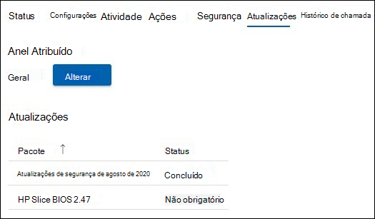

# Gerenciamento de atualizações 
Uma sala de reunião moderna é equipado com um dispositivo Salas do Microsoft Teams e outros periféricos, como uma câmera, microfone ou alto-falante, e potencialmente mais dispositivos para criar uma experiência de reunião inclusiva e eficaz. Equipamentos de diferentes tipos de OEMs fornecem a experiência organizacional exata desejada; no entanto, eles devem ser mantidos com software e firmware continuamente.  

Salas do Microsoft Teams Pro Management fornece a garantia de que cada sala em sua organização será mantida nos níveis recomendados para fornecer uma sala que esteja sempre pronta e funcione corretamente. A meta da Microsoft é reduzir a complexidade e o trabalho da equipe operacional com inteligência e automação. A solução de problemas ou diagnóstico é executada o mais rápido possível. 

## Fazendo a transição de um dispositivo para o Gerenciamento Pro 
A integração de dispositivos de sala ao Gerenciamento Pro geralmente tem um histórico de gerenciamento de alterações e uma prática diferente das nossas diretrizes.  

- Para se beneficiar do Gerenciamento Pro, você deve fazer a transição do gerenciamento de alterações para todas as atualizações no portfólio do Gerenciamento Pro.
- Várias fontes de SLAs de incidentes de gerenciamento de alterações afetam, pois há uma descoberta e correção que reiniciarão novamente se ocorrer um incidente na sala.
- A Microsoft implementou controles e verificações para implementar políticas que podem diferir de uma organização para outra e a capacidade de intervir em situações excepcionais.
- Eventualmente, os dispositivos de sala serão atualizados para padrões comuns, exceto para exceções devido a problemas com uma instalação de hardware específica.  

## Dispositivos de transição: verificações básicas de preparação 
A maioria das falhas inesperadas surge de alterações na imagem base com histórico incerto de gerenciamento de alterações. 

As seguintes verificações de preparação simples são recomendadas:  

- **Imagem base**: a imagem base deve ser do OEM específico. Se o dispositivo tiver sido recriado no passado e mostrar falhas ou comportamentos inesperados em tarefas comuns, a imagem base deverá ser restaurada. Podemos fornecer assistência, mas não é possível recompilar remotamente o dispositivo de sala, portanto, você precisará de um técnico de site local.  
- **Sistema operacional base, Edição:** O sistema operacional base e a edição devem corresponder aos requisitos de Salas do Microsoft Teams dispositivos. Se isso não for assim, ele deverá ser corrigido como parte da integração. Salas do Microsoft Teams requer o Windows 10 IoT Enterprise ou Windows 10 Enterprise SKUs em Semi-Annual de manutenção de canal. Consulte as [diretrizes oficiais do MTR](rooms-lifecycle-support.md#windows-10-release-support) para obter mais informações.

## Verificações de preparação

Há alguns pré-requisitos para receber atualizações por meio do serviço de Gerenciamento Pro: 

|Software |Orientação |
|:- |:- |
|Logitech Sync Services  |Deve ser instalado e executado nos dispositivos da sala de reunião da Logitech. Os serviços de sincronização necessários serão instalados automaticamente do Windows Atualizações a menos que sejam bloqueados. O pacote de sincronização completo também pode ser instalado. |
|Atualizações do sistema operacional Windows |Deve ser mantido habilitado e não redirecionado para o WSUS, nem bloqueado de uma perspectiva de rede. Nem as políticas de GPO nem de MDM devem ser usadas para gerenciar atualizações do sistema operacional. |
|Atualizações da Microsoft Store   |Deve ser desativado. Os Serviços Gerenciados desativarão as atualizações da Store, se encontrados. |
|Software antivírus |Se você estiver executando o software AV nesses dispositivos, verifique se a AV tem exclusões em vigor para dlls do Teams e do Skype. Consulte aqui para obter mais detalhes. |
|Software adicional |Softwares adicionais, como exibição de área de trabalho remota de terceiros, etc. devem ser revisados com os Serviços Gerenciados para não haver efeitos colaterais. |
|Gerenciamento de Alterações Adicionais|Pode interferir nas atualizações cobertas e não deve ser introduzida. |

## Atualizações gerenciadas – como ela funciona 
Há duas maneiras principais de como as atualizações são gerenciadas:  

- **Gerenciado automaticamente**: Atualizações são instalados em seu dispositivo de sala com base na avaliação do Gerenciamento Pro. Nenhuma intervenção é necessária para as atualizações gerenciadas em nosso portfólio.
- **Anel validado**: configure um sistema de anéis para visualizar atualizações em dispositivos específicos para que você possa monitorá-las sem o trabalho de perna associado. A configuração de anel fornece uma camada adicional de auditoria devida antes de amplas implantações.  

### Gerenciado automaticamente

Se você optar por ser gerenciado automaticamente, nenhuma ação será necessária para as atualizações da sua parte. No entanto, você deve examinar o portfólio atual de atualizações compatíveis com o serviço de Gerenciamento Pro. O portfólio está constantemente recebendo novas adições e é nossa prioridade cobrir as atualizações mais frequentes e impactante para garantir a estabilidade da sala. Verifique a lista atual (na seção "Gerenciamento de Atualizações" deste documento) para planejar qualquer gerenciamento de alterações adicional necessário para sua organização.  

**Recomendação:** Não instale atualizações cobertas pelo serviço de Gerenciamento Pro em nenhum dispositivo gerenciado por conta própria. 

### Validação de anel

Ao escolher a validação de anel, examine as seções a seguir sobre como os anéis funcionam no portal de Gerenciamento Pro e as opções disponíveis para personalizá-lo para sua organização. Mesmo com a validação de anel, são feitas tentativas para garantir que as salas não sejam vencidas nas atualizações recomendadas. Dependendo da situação, uma sala pode receber atualizações de "atualização" para garantir que ela seja compatível com as recomendações da Microsoft.  

 Verifique se há comunicados na home page do portal e na documentação do Gerenciamento Pro à medida que novos tipos de software e firmware ficam disponíveis no portfólio. 

### Agendar 
Atualizações são agendadas para salas com base no equipamento na sala e se elas não estão a atender aos padrões recomendados para software e firmware aplicáveis. 

- Para ajudar nossos clientes a atender aos requisitos de gerenciamento de alterações, atualize o início da implantação às **quartas-feiras** no anel de preparo. Se uma atualização crítica for necessária, esse agendamento será ignorado e a atualização será liberada assim que estiver disponível. 
- Atualizações são sequenciados com base na necessidade em uma sala específica. 
- Se você tiver anéis de configuração para validar as atualizações, a atualização avançará por meio da ordem de anel. 
- Uma nova atualização pode substituir uma atualização que é enfileirada se for determinado que a estabilidade da sala melhorará, com base em sua situação.  
- Atualizações normalmente são aplicadas durante nossa janela de manutenção noturna – que é a hora local da sala **12:00 – 5:00** para evitar qualquer tipo de interrupção. 

## Salas do Microsoft Teams ciclo de vida de atualização do aplicativo 
A política de suporte da equipe de engenharia do MTR afirma que todo o suporte termina após o ciclo de vida de doze (12) meses de uma versão tiver expirado ou se mais de duas atualizações tiverem sido lançadas desde então. Em seguida, os clientes devem atualizar para uma versão com suporte. Consulte o [suporte Salas do Microsoft Teams versão do aplicativo – Microsoft Teams | Microsoft Docs](rooms-lifecycle-support.md) para uma descrição detalhada do serviço. 

## Passo a passo da experiência de Gerenciamento de Atualizações  
Para exibir as atualizações, faça logon no portal de Gerenciamento Pro e navegue até a Atualizações página.

O Atualizações exibe uma visão geral de alto nível do gerenciamento de atualizações para suas salas com as seguintes guias:

- **Atualizações**: atualizações de software ou firmware aplicáveis à sua organização.  
- **Salas**: a guia Salas fornece uma exibição de salas e anéis aos quais cada sala pertence.
- **Anéis**: a guia Anéis mostra os anéis de salas para sua organização.

### Atualizações  

Essa exibição mostra as atualizações relevantes para seu locatário e seu respectivo status. Para exibir as atualizações anteriores que não estão mais ativas, selecione a alternância Incluir **atualizações** anteriores para ON.  

Qualquer atualização pode estar em um dos seguintes estados:

| Status | Descrição |
|:- |:- |
| Agendada | Uma atualização está agendada para as salas em um determinado anel. Lembre-se de que uma atualização só mostrará Agendado depois que a progressão atingir o anel em que a sala está. Por exemplo, se uma nova atualização estiver no anel de preparo, ela mostrará Somente as salas agendadas no anel de preparo.  
 Outros anéis terão o status "Não obrigatório" até que a atualização progrida para esse anel.
 |
| Em andamento | Uma atualização está em andamento e anéis individuais mostram o status. Esse estado mostra o status geral do anel e, portanto, se uma atualização se aplicar a uma única sala no anel de preparo em seu locatário, a atualização terá um estado "Em andamento" até que o anel Executivo seja atingido. |
| Concluído com falhas | Uma atualização concluiu a progressão por todos os anéis configurados e falhou em pelo menos uma sala. |
| Concluído | Uma atualização concluiu a progressão por todos os anéis configurados e foi instalada com êxito em todas as salas aplicáveis.|
| Preterido | Uma atualização foi desativada. A implantação adicional é interrompida. Isso é comum porque a atualização foi substituída por uma nova versão. |
| Pausado | Uma atualização está em um estado de pausa. |
| Não obrigatório | A atualização ainda não foi avaliada para a sala ou não se aplica à sala. |

### Quartos  

A guia Salas mostra todas as salas em seu locatário e a qual anel elas pertencem.  

Para configurar a qual anel uma sala deve pertencer:  

1. Clique na sala para exibir a exibição detalhada.  
1. Em **Anel**, clique em **Alterar**.  
1. Selecione o anel ao qual a sala deve pertencer.  
1. Clique **em Atribuir**.  

O modo de exibição de sala detalhado exibe as atualizações relevantes e seu **status no Atualizações** nó.  

### Anéis  

Anéis são usados para reduzir o risco de problemas derivados da implantação das atualizações de recursos. Isso é feito implantando gradualmente a atualização em todo o site. Cada anel deve ter uma lista de salas da Sala do Microsoft Teams e um agendamento de distribuição correspondente. A definição de anéis geralmente é um evento único (ou pelo menos pouco frequente), mas a TI deve revisitar esses grupos de tempos em tempos para garantir que o sequenciamento ainda esteja correto.  

A **guia Anéis** lista todos os anéis em seu locatário. Há três anéis pré-configurados:  

- **Preparo**: atribua salas ao anel de preparo, que é o seu testbed. Todas as novas atualizações serão implantadas aqui primeiro. Em geral, você desejará garantir que seu anel de preparo represente salas com a diversidade de tipos de dispositivo em seu ambiente. Se houver determinados tipos de salas com uma configuração incomum ou um histórico de problemas de visão, considere representá-las no Preparo.

- **Geral**: por padrão, todas as salas são colocadas nesse anel. A maioria dos dispositivos de sala que estão sendo usados em toda a empresa se enquadra nessa categoria. 

- **Executivo**: esse grupo deve incluir suas salas de alto perfil em que você deseja minimizar a interrupção proativamente. Um bom exemplo é uma sala de conferência grande usada para reuniões executivas ou grandes reuniões em equipe. 

### Especificando a linha do tempo de distribuição

Atualizações pode exceder 60 dias para ser concluído em todos os anéis.  

|Parâmetro |Explicação |
|:- |:- |
|Período de adiamento|Depois que uma atualização começa com o primeiro anel, o período de adiamento é o atraso em dias antes de a atualização ser iniciada nesse anel.|
|Duração da distribuição|
Depois que a atualização começar nesse anel, este é o momento de implantar nesse anel. Por exemplo, se a duração for de 5 dias, ela será implantada durante 5 dias nas salas nesse anel depois que a atualização for iniciada nesse anel.|
|Período de teste|O número de dias para testar/validar a atualização em um anel uma vez aplicado ao anel. O período de teste começa depois que a distribuição é concluída e, depois de concluída, a atualização passa para o próximo anel.|
|Tempo de Conclusão|A coluna "Tempo de conclusão" indica o número total de dias (duração da distribuição + período de teste) para que esse anel seja concluído.|
|Tempo Total|Na parte inferior está a linha "Total" que indica quanto tempo uma atualização levará para ser concluída do primeiro ao último anel.|

### Criando anéis personalizados

1. Navegue até a **guia Anéis** .  
1. Clique **em Adicionar anel**.  
1. Especifique a ordem na qual esse anel receberá a atualização, em que 1 é o primeiro e 9 é o último.  
1. Dê um nome a este anel.  
1. Forneça uma descrição, se desejado.  
1. Especifique o número de dias que a atualização será implantada nesse anel.  
1. Especifique o período de teste.  
1. Clique **em Enviar**.  

> [!NOTE]
> O "Dias definidos por outros anéis" é o número total de dias que uma atualização levará para ser concluída em todos os anéis. Os "Dias Restantes" indicam os dias máximos para *que esse* anel seja concluído. A soma de "Duração da distribuição em dias" e "Período de teste em dias" não pode exceder esse valor.  

**Editar um anel**

1. Navegue até a **guia Anéis** .
1. Clique no anel a ser excluído.  
1. Clique **em Editar anel**.  
1. Edite o número de dias de distribuição e teste, conforme necessário.

**Excluir um anel**

1. Navegue até a **guia Anéis** .  
1. Clique no anel a ser excluído.  
1. Clique **em Excluir anel**.  

> [!NOTE]
> Os anéis padrão não podem ser excluídos.  

**Mover salas**

Mover salas de um anel para outro é possível de duas maneiras:

1. Navegue até a **guia Anéis** .  
1. Clique no anel do qual você deseja mover salas  
1. Clique **em Mover salas**.  
1. Selecione as salas que você deseja mover na **Lista de Salas**.  
1. Escolha o anel de destino, para o qual as salas selecionadas serão movidas na lista suspensa.  
1. Clique **em Mover salas**.  

**Ou**

1. Abra os detalhes da sala que você deseja mover (seja por Incidentes, Salas ou Atualizações -> Salas).
1. Clique na **Atualizações** guia.  
1. Em **Anel Atribuído**, clique em **Alterar**.
1. Na lista suspensa, selecione o novo anel.  
1. Clique **em Atribuir**.

## Atualizações automatizadas: visibilidade e controle

As atualizações automatizadas no Gerenciamento Pro orquestram atualizações em toda a sua organização. No entanto, você tem visibilidade e controle para intervir, se necessário. Estas são as maneiras: 

- No caso de uma falha de atualização, um tíquete é gerado automaticamente para acompanhamento. 
- Se você vir uma atualização causando problemas, poderá pausar a atualização com o **botão Pausar** . Pressionar o botão Pausar solicitará a criação de um registro de um tíquete de problema para sua equipe investigar.
- Se você vir que uma atualização falhou em uma sala e corrigiu um motivo convincente, como a desconexão de rede, você pode repetir a atualização com o botão Repetir todas as **falhas** .  
- Pode haver situações urgentes quando você pode decidir disponibilizar uma atualização anteriormente. Nesse caso, você pode usar o **botão Forçar atualizações** . Ao usar a opção Forçar Atualização, você tem a opção de forçar a atualização imediatamente ou quando, em seguida, a sala estiver disponível.  

> [!NOTE]
> **Não recomendamos "Forçar Atualizações"** como uma estratégia geral de gerenciamento de atualizações, pois você pode encontrar problemas conhecidos com essas atualizações.

- Além disso, para garantir boas práticas de gerenciamento de alterações, registraremos todas as atualizações forçadas internamente no serviço. No futuro, esperamos tornar isso visível para você também.
