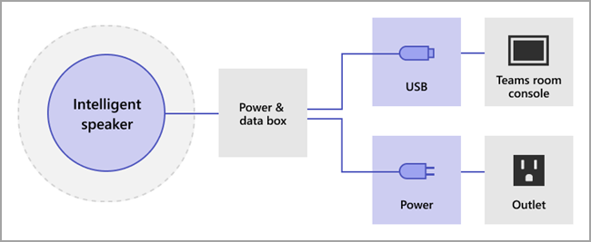

# Gerenciar controles de tecnologia de reconhecimento de voz para um Alto-falante Inteligente

Um Alto-falante Inteligente usa informações de perfil de voz para reconhecer quem disse o que na transcrição ao vivo. Quando uma Salas do Microsoft Teams para Windows de reunião é equipada com um Alto-falante Inteligente, a transcrição ao vivo pode ser usada durante a reunião. Este artigo explica como você, um administrador de locatários, controla a criação de perfil de voz usada para o reconhecimento de voz para gerar transcrição ao vivo. Você pode controlar até que ponto a organização está usando o reconhecimento de voz e os seguintes recursos:

- Edite o nome do orador em transcrições.
- Altere o alto-falante de uma única fala na transcrição ou altere o alto-falante em todas as expressões na transcrição (mas não em transcrições futuras).
- Altere a identificação do alto-falante para as pessoas listadas na reunião.
- Remova a identificação de uma ou mais expressões identificadas como orador em cada transcrição.

## Analisar os requisitos do Alto-Falante Inteligente

Um Alto-falante Inteligente inclui uma matriz especial de sete microfones. O sistema usa informações de perfil de voz para identificar vozes de até 10 pessoas em salas de reunião.

Os itens a seguir são requisitos de Alto-falante Inteligente:

- O locatário do cliente deve estar localizado nos EUA (América do Norte). 1
- A sala de reunião deve ter no máximo 10 pessoas presentes pessoalmente.
- A sala de reunião tem um link de upload de no mínimo 7 Mbps.

 1 Um Alto-falante Inteligente e o perfil de voz e o uso associados estarão disponíveis apenas no idioma EN-US e para locatários dos EUA (região NA-US). Ambas as condições devem ser verdadeiras para que um usuário de locatário se inscreva e use um Alto-falante Inteligente para transcrição atribuída.

## Configurar um alto-falante inteligente

Um Alto-falante Inteligente conecta-se diretamente usando USB ao Salas do Teams console. Para melhores resultados, um Alto-falante Inteligente da marca Yealink deve ser usado com um console da marca Yealink.

> [!NOTE]
> Um Alto-falante Inteligente Yealink **deve** ser usado com um console Yealink.

> [!NOTE]
> Não há suporte para um Alto-falante Inteligente conectado ao logitech Surface Pro Salas do Microsoft Teams. Há um problema conhecido que Salas do Teams não pode reconhecer o Alto-falante Inteligente por meio do dock.

Um Alto-falante Inteligente deve ser colocado a pelo menos 20 cm de distância de paredes e objetos grandes, como laptops. Se o cabo USB do Alto-Falante Inteligente não for longo o suficiente para sua instalação, use os extendadores de cabo.

1. Entre no console como administrador.
2. De definir as Teams do dispositivo para corresponder ao microfone e ao alto-falante do Alto-falante Inteligente.
   Você também pode fazer isso por meio do portal DEA, em vez de no console da sala.

   O diagrama mostra como o Alto-falante Inteligente está conectado ao dispositivo se o dispositivo incluir uma caixa de dados.

   

   O diagrama mostra como o Alto-falante Inteligente está conectado ao dispositivo se o dispositivo não incluir uma caixa de dados.

   

> [!Note]
> Os dispositivos EPOS e Yealink devem ter prefixo "EPOS" ou "Yealink" e conter "UAC2_RENDER" no nome do alto-falante e "UAC2_TEAMS" no nome do microfone. Se você não encontrar esses nomes de microfone e alto-falante no menu suspenso, reinicie o dispositivo De alto-falante inteligente.

## Habilitar um reconhecimento de usuário de Alto-Falante Inteligente

Os dados do perfil de voz podem ser usados em qualquer reunião com um Alto-falante Inteligente. Consulte [Teams políticas de reuniões](../meetings-policies-recording-and-transcription.md#allow-transcription) e os [cmdlets](/powershell/module/skype/set-csteamsmeetingpolicy) de reunião do PowerShell para obter informações sobre as configurações da reunião.

Os dados de perfil de voz do usuário são criados quando a política é definida para distinguir ou um convidado que não faz parte da reunião entra durante a reunião. Os dados do perfil de voz são ignorados no final da reunião.

A seguir estão as políticas necessárias para definir um Alto-falante Inteligente e o reconhecimento de usuário.

|Política|Descrição|Valores e comportamento|
|-|-|-|
|enrollUserOverride|Use para definir a captura de perfil de voz ou o registro em Teams configurações para um locatário. |**Desabilitado** <ul><li> Os usuários que nunca se registraram não podem exibir, registrar ou registrar-se.<li>O ponto de entrada para o fluxo de inscrição será oculto.<li>Se os usuários selecionarem um link para a página de registro, eles verão uma mensagem informando que esse recurso não está habilitado para sua organização.  <li>Os usuários que se registraram podem exibir e remover seu perfil de voz nas Teams configurações. Depois de remover o perfil de voz, eles não poderão exibir, acessar ou concluir o fluxo de registro.</li></ul> **Habilitado** <ul><li> Os usuários podem exibir, acessar e concluir o fluxo de registro.<li>O ponto de entrada será Teams página de configurações sob a guia **Reconhecimento.**</li></ul>|
|roomAttributeUserOverride|Controlar a identificação de usuário baseada em voz nas salas de reunião. Essa configuração é necessária para Salas do Teams contas.| **Desativado** <ul><li>O Salas do Teams dispositivo não enviará largura de banda de economia de fluxo de áudio da sala. <li>Os usuários da sala de reunião não serão atribuídos ou diferenciados, e suas assinaturas de voz não serão recuperadas ou usadas.<li>Os usuários da sala de reunião são desconhecidos.</li></ul>  **Atributo** <ul><li>Os usuários de salas serão atribuídos com base no status do registro.<li>Os usuários que estão inscritos são mostrados com seu nome na transcrição.  <li>Os usuários que não estão inscritos mostram como Orador \<n> .<li>O Salas do Teams dispositivo enviará sete fluxos de áudio da sala.</ul>  **Distinguir**  <ul><li>Os usuários de salas serão diferenciados e separados como alto-falante 1, alto-falante 2, .... \<n> alto-falante na transcrição.</li><li>Independentemente do status de registro do usuário, seu nome não será show na transcrição.</li><li>O Salas do Teams dispositivo enviará sete fluxos de áudio da sala.</li></ul>
|AllowTranscription|Obrigatório para contas de usuário e Teams salas.|**True** e **False**|
||||

No centro Teams de administração, de definir a **política Permitir transcrição.** Configurações estão **Desligados** por padrão.

## Perguntas frequentes (FAQ)

**Onde os dados do perfil de voz são armazenados?**

Os dados do perfil de voz são armazenados Office 365 nuvem com conteúdo do usuário.

**Qual é a linha do tempo de retenção e a política?**

A política de retenção geral é afirmada na visão geral [de retenção de dados.](/compliance/assurance/assurance-data-retention-deletion-and-destruction-overview) Além disso, os dados de perfil de voz de um usuário serão excluídos após três anos se o usuário não for convidado para nenhuma reunião com um Alto-falante Inteligente nesse período de 3 anos. Os dados não são usados em reuniões para funcionários existentes. Se um funcionário tiver deixado a empresa, os dados do perfil de voz serão considerados conteúdo do usuário e serão tratados como tal por uma política de retenção de dados Office 365 descrita na visão geral de retenção [de dados.](/compliance/assurance/assurance-data-retention-deletion-and-destruction-overview)

**Os dados de perfil de voz são usados em serviços Microsoft?**

Não, os dados de perfil de voz só são usados para a finalidade para a qual o usuário forneceu consentimento. A Microsoft não usará os dados de perfil de voz, exceto em Teams cenários de reconhecimento de voz.

Por exemplo, a Microsoft não usará os dados nas seguintes situações:

**Meus dados de perfil de voz são usados quando insinuo em uma reunião em outra organização?**

Não somente em reuniões organizadas por um usuário em sua organização.

**Como posso exportar meu perfil de voz?**

O administrador de IT pode exportar seus dados de áudio a qualquer momento.

## Tópicos relacionados

[Artigo de suporte: Usar alto-falantes inteligentes para identificar participantes na sala ](https://support.microsoft.com/office/use-teams-intelligent-speakers-to-identify-in-room-participants-in-meeting-transcription-a075d6c0-30b3-44b9-b218-556a87fadc00)
