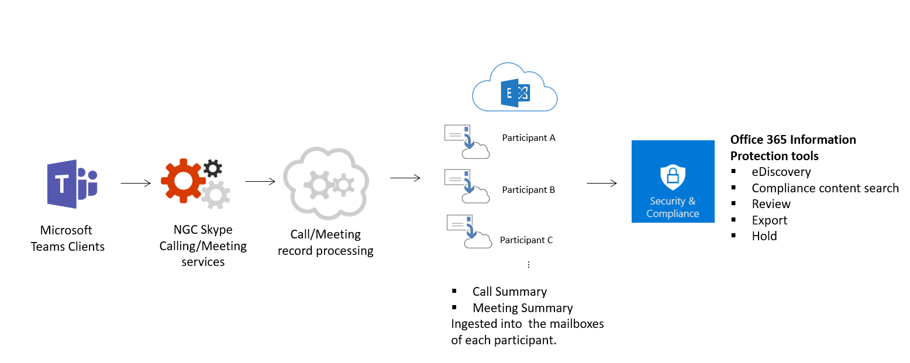
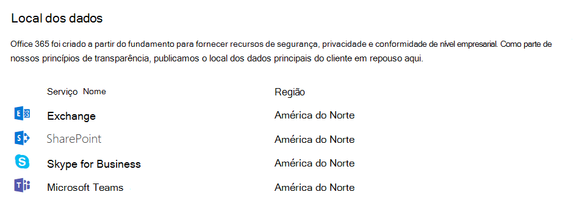

# Segurança e conformidade no Microsoft Teams

> [!IMPORTANT]
> Para saber como garantir melhor a segurança enquanto todos trabalham em casa durante o surto **da COVID-19**, leia estes artigos:
>  - [As 12 principais tarefas para as equipes de segurança dar suporte ao trabalho em casa](/microsoft-365/security/top-security-tasks-for-remote-work)
>  - [Otimize a conectividade do Microsoft 365 ou do Office 365 para usuários remotos usando o tunelamento dividido da VPN](/Office365/Enterprise/office-365-vpn-split-tunnel)
>  - Atualizado em 2 de abril de 2020: [guia Teams segurança](teams-security-guide.md)

Microsoft Teams baseia-se no Microsoft 365 e Office 365 nuvem de nível empresarial e de hiperescala, fornecendo os recursos avançados de segurança e conformidade que nossos clientes esperam. Para obter mais informações sobre como planejar a segurança no Microsoft 365 ou [Office 365, o](/microsoft-365/security/office-365-security/security-roadmap) roteiro de segurança é um bom lugar para começar. Para obter mais informações sobre como planejar a conformidade no Microsoft 365 ou Office 365, você pode começar com [Plan for security & compliance](/microsoft-365/compliance/plan-for-security-and-compliance).

Este artigo fornecerá mais informações sobre Teams segurança e conformidade específicas. Não perca estes vídeos do Microsoft Mechanics sobre segurança e conformidade:

- [Microsoft Teams Essentials para TI: Segurança e Conformidade](https://youtu.be/91lHNKVVvQ4) (12:42 min)
- [Microsoft Teams controles de segurança e conformidade](https://www.youtube.com/watch?v=Km4T4hMM__k) (10:54 min)

> [!IMPORTANT]
> Como cliente de Microsoft 365 ou Office 365, você possui e controla seus dados. A Microsoft não usa seus dados para nenhum outro fim, além de lhe fornecer o serviço ao qual você se inscreveu. Como um provedor de serviços, não examinamos seu e-mail, seus documentos nem suas equipes para publicidade ou propósitos que não estejam relacionados ao serviço. A Microsoft não tem acesso ao conteúdo carregado. Como OneDrive e SharePoint no Microsoft 365, os dados do cliente permanecem dentro do locatário. Você pode conferir mais informações sobre nossa relação de confiança e segurança na Central [de Confiabilidade da Microsoft](https://microsoft.com/trustcenter). Teams segue as mesmas diretrizes e princípios que a Central de Confiabilidade da Microsoft.

## Segurança

Teams impõe autenticação de dois fatores em toda a equipe e organização, logon único por meio do Active Directory e criptografia de dados em trânsito e em repouso. Os arquivos ficam armazenados no SharePoint e são respaldados pela criptografia do SharePoint. As notas ficam armazenadas no OneNote e são respaldadas pela criptografia do OneNote. Os OneNote dados são armazenados no site de SharePoint equipe. A guia Wiki também pode ser usada para anotações e seu conteúdo também é armazenado dentro da equipe SharePoint site.

Leia [modelos de identidade e autenticação](identify-models-authentication.md) para obter mais informações sobre autenticação e Teams  e como funciona a autenticação moderna ajudará com a autenticação moderna em particular.

Como Teams trabalha em parceria com SharePoint, OneNote, Exchange e muito mais, você deve estar familiarizado com o gerenciamento de segurança no Microsoft 365 ou Office 365 tudo. Para saber mais, leia sobre [como configurar sua organização Microsoft 365 ou Office 365 para aumentar a segurança](/office365/securitycompliance/tenant-wide-setup-for-increased-security).

> [!NOTE]
> Atualmente, os canais [privados dão suporte](private-channels.md) a recursos limitados de segurança e conformidade. O suporte para o conjunto completo de recursos de segurança e conformidade em canais privados estará disponível em breve.

### Microsoft Defender para Office 365

Microsoft Defender para Office 365 está disponível para Microsoft Teams, juntamente com SharePoint e OneDrive, aplicativos que se integram ao Teams para gerenciamento de conteúdo. Defender para Office 365 permite determinar se o conteúdo nesses aplicativos é mal-intencionado por natureza e bloquear esse conteúdo do acesso do usuário.

Como o conteúdo afetado é gerenciado após a detecção fica de acordo com as configurações selecionadas Microsoft 365 ou Office 365. É altamente recomendável que você considere todos os aplicativos quando se trata de configurar o Defender para Office 365 e, para leitura adicional, uma visão geral de como os [links](/microsoft-365/security/office-365-security/safe-links?view=o365-worldwide) seguros funcionam e as etapas para configurá-los estão aqui para obter informações detalhadas para começar.

### Cofre links no Microsoft Teams

Defender para Office 365 links seguros estão disponíveis no Microsoft Teams. Para obter mais informações sobre o que são links seguros e o que fazer com esse recurso, leia as configurações de [Links seguros para](/microsoft-365/security/office-365-security/safe-links?view=o365-worldwide) Teams. Cofre links está disponível nos [Defender para Office 365 Plano 1 e Plano 2](/microsoft-365/security/office-365-security/overview?view=o365-worldwide).

### Cofre anexos

Cofre anexos é um recurso projetado para aprimorar a segurança do usuário verificando e detectando anexos mal-intencionados. Administradores globais ou de  segurança ativam o recurso  e criam políticas para lidar com esses anexos suspeitos mal-intencionados para impedir que eles sejam enviados aos usuários, clicados e tratados.

Cofre proteção de anexo está disponível para SharePoint, OneDrive e Microsoft Teams e Microsoft 365 ou Office 365 em [ Microsoft Defender para Office 365 Plano 1 e Plano 2](/microsoft-365/security/office-365-security/overview?view=o365-worldwide). Leia mais sobre Cofre anexos e como eles podem ajudar a proteger sua organização [neste artigo](/microsoft-365/security/office-365-security/set-up-safe-attachments-policies?view=o365-worldwide).

### Classificação de Segurança

O Microsoft Secure Score é uma medida da postura de segurança de uma organização, com um número maior indicando mais ações de melhoria executadas. Ele pode ser encontrado no [Centro de segurança do Microsoft 365](https://security.microsoft.com/securescore). Seguir as recomendações de Classificação de Segurança pode proteger sua organização contra ameaças. Em um painel centralizado no Centro de segurança do Microsoft 365, as organizações podem monitorar e trabalhar na segurança de suas identidades, aplicativos e dispositivos Microsoft 365 segurança. Microsoft Teams agora tem recomendações sobre a Classificação de Segurança e os administradores são incentivados a monitorar sua postura de segurança na plataforma.

O Secure Score ajuda as organizações a:
- Relate o estado atual da postura de segurança da organização.
- Melhore sua postura de segurança fornecendo capacidade de descoberta, visibilidade, diretrizes e controle.
- Compare com os parâmetros de comparação e estabeleça KPIs (indicadores chave de desempenho).

### Como as políticas de Acesso Condicional funcionam para Teams

Microsoft Teams depende muito do Exchange Online, SharePoint e Skype for Business Online para cenários de produtividade principais, como reuniões, calendários, chats de interoperabilidade e compartilhamento de arquivos. As políticas de acesso condicional definidas para esses aplicativos de nuvem se aplicam Microsoft Teams quando um usuário entra diretamente no Microsoft Teams – em qualquer cliente.

Microsoft Teams é compatível separadamente como um aplicativo de nuvem Azure Active Directory políticas de acesso condicional. As políticas de acesso condicional definidas para o aplicativo Microsoft Teams nuvem se aplicam Microsoft Teams quando um usuário entra. No entanto, sem as políticas corretas em outros aplicativos, como Exchange Online e SharePoint, os usuários ainda poderão acessar esses recursos diretamente. Para obter mais informações sobre como configurar uma política de acesso condicional no portal do Azure, consulte [Azure Active Directory Início Rápido](/azure/active-directory/active-directory-conditional-access-azure-portal-get-started).

Microsoft Teams clientes da área de trabalho para Windows e Mac dão suporte à autenticação moderna. A autenticação moderna traz a entrada com base na ADAL (biblioteca Azure Active Directory autenticação) para Microsoft Office aplicativos cliente entre plataformas.

Microsoft Teams aplicativo da área de trabalho dá suporte ao AppLocker.  Para obter mais informações sobre os pré-requisitos do AppLocker, confira: Requisitos para usar o [AppLocker](/windows/security/threat-protection/windows-defender-application-control/applocker/requirements-to-use-applocker).

## Conformidade

Teams tem uma ampla variedade de informações para ajudá-lo com áreas de conformidade, incluindo conformidade de comunicação para canais, chats e anexos, políticas de retenção, prevenção contra perda de dados (DLP), Descoberta Eletrônica e retenção legal para canais, chats e arquivos, pesquisa de log de auditoria, bem como gerenciamento de aplicativo móvel com Microsoft Intune. Fornecemos algumas informações sobre todos esses tópicos abaixo e você pode acessar o [Centro de conformidade do Microsoft 365 para gerenciar](https://compliance.microsoft.com) essas configurações.

### Barreiras de informações

As Barreiras de Informações do Microsoft Purview são políticas colocadas em vigor pelos administradores do Teams para fazer coisas como impedir que pessoas ou grupos se comuniquem entre si (quando não há necessidade comercial para eles fazerem isso ou um motivo regulatório para impedi-los de fazer isso) e também permite que você defina políticas relacionadas a coisas como pesquisas e Descoberta Eletrônica (abordadas abaixo). Essas políticas podem afetar os usuários em chats, chats em grupo ou em um nível de equipe. O recurso Barreira de Informações está disponível na nuvem pública e, a partir de janeiro de 2021, ele foi distribuído para a GCC nuvem.

Para obter mais leituras sobre este tópico, acesse [Barreiras de informações Microsoft Teams](information-barriers-in-teams.md).

### Conformidade de comunicações

A Conformidade de Comunicação do Microsoft Purview permite que você adicione usuários a políticas no escopo que podem ser configuradas para examinar comunicações do Microsoft Teams em busca de linguagem ofensiva, informações confidenciais e informações relacionadas a padrões internos e regulatórios. As comunicações de chat e anexos associados em canais Teams públicos e privados, chats individuais e anexos podem ser verificados para ajudar a minimizar os riscos de comunicação em sua organização. Para obter mais informações sobre como você pode configurar políticas para ajudá-lo a detectar, capturar e tomar medidas para comunicações Teams inadequadas, consulte Saiba mais sobre a conformidade [de comunicação](/microsoft-365/compliance/communication-compliance).

### Rótulos de confidencialidade

Aplique [rótulos de confidencialidade](/microsoft-365/compliance/sensitivity-labels) para proteger e regular o acesso a conteúdo organizacional confidencial criado durante a colaboração nas equipes. Por exemplo, aplique rótulos que configurem a privacidade (pública ou privada) das equipes, controlem o acesso de convidados e o compartilhamento externo e gerenciem o acesso de dispositivos não gerenciados. Para obter mais informações, examine [os rótulos de confidencialidade Microsoft Teams](sensitivity-labels.md).

### Prevenção contra Perda de Dados do Microsoft Purview (DLP)

A DLP (prevenção contra perda de dados) no Microsoft Teams, bem como a história de DLP maior para o Microsoft Purview, gira em torno da preparação dos negócios quando se trata de proteger documentos e dados confidenciais. Se você tiver preocupações com informações confidenciais em mensagens ou documentos, as políticas DLP poderão ajudar a garantir que os usuários não compartilhem esses dados confidenciais com as pessoas erradas.

Para obter informações sobre a Prevenção contra Perda Teams, examine [a DLP para Microsoft Teams](/microsoft-365/compliance/dlp-microsoft-teams). Um bom artigo para preocupações com DLP é [Saiba mais sobre a prevenção contra perda de dados](/microsoft-365/compliance/dlp-learn-about-dlp).

### Chave do Cliente

Microsoft 365 oferece uma camada adicional de criptografia sobre a criptografia de serviço para seu conteúdo. Usando chaves fornecidas, a Chave do Cliente criptografa vários tipos diferentes de dados Microsoft Teams. Usando a Chave do Cliente no nível do aplicativo, a Chave do Cliente criptografa Teams arquivos armazenados no SharePoint Online. Para obter informações, consulte [Criptografia de serviço com a Chave do Cliente do Microsoft Purview](/microsoft-365/compliance/customer-key-overview).

Usando a Chave do Cliente no nível do locatário, a Chave do Cliente criptografa:
- Teams de chat (chats 1:1, chats em grupo, chats de reunião e conversas de canal)
- Teams de mídia (imagens, snippets de código, vídeos e imagens wiki)
- Teams chamadas e gravações de reunião armazenadas no Teams armazenamento
- Teams de chat
- Teams sugestões de chat por Cortana
- Teams de status

Para obter mais informações,  consulte Visão geral da chave do cliente no nível do locatário e leia o blog do Microsoft Teams que aborda o suporte à Chave do Cliente para Microsoft Teams agora em Visualização [Pública](https://techcommunity.microsoft.com/t5/microsoft-teams-blog/customer-key-support-for-microsoft-teams-now-in-public-preview/ba-p/1999893). Para obter informações sobre a Proteção de Informações da Microsoft que incluía a Chave do Cliente no nível do locatário, leia Anunciando novos recursos Proteção de Informações da Microsoft para conhecer e proteger [seus dados confidenciais](https://techcommunity.microsoft.com/t5/microsoft-security-and/announcing-new-microsoft-information-protection-capabilities-to/ba-p/1999692).

### Políticas de retenção

As políticas de retenção no Microsoft Teams permitem que você mantenha os dados que são importantes para sua organização manter, por motivos regulatórios, legais, empresariais ou outros, e também para remover conteúdo e comunicações que não são relevantes para serem retidos. Você também pode usar políticas de retenção para manter os dados por um período de tempo e, em seguida, excluí-los. Para obter mais informações, examine [as políticas de retenção Microsoft Teams](retention-policies.md).

### Descoberta Eletrônica

A descoberta eletrônica, ou Descoberta Eletrônica, é o aspecto eletrônico de identificar, coletar e produzir informações armazenadas eletronicamente (ESI) em resposta a uma solicitação de produção em um processo legal ou investigação. Os recursos incluem gerenciamento de casos, preservação, pesquisa, análise e exportação de Teams dados. Isso inclui chat, mensagens e arquivos, resumos de reuniões e chamadas. Para Teams reuniões e chamadas, um resumo dos eventos que ocorreram na reunião e na chamada são criados e disponibilizados na Descoberta Eletrônica.

Para obter mais detalhes sobre como usar as ferramentas de Descoberta Eletrônica no portal de conformidade do Microsoft Purview para pesquisar conteúdo Teams, acesse os links abaixo:

- [eDiscovery](/microsoft-365/compliance/manage-legal-investigations)

- [Pesquisa de conteúdo](/microsoft-365/compliance/search-for-content)

Temos um Teams específico para obter mais informações sobre como conduzir uma investigação de Descoberta Eletrônica [do conteúdo Microsoft Teams](eDiscovery-investigation.md).

Os clientes podem aproveitar a Descoberta [Eletrônica ou Advanced eDiscovery](/microsoft-365/compliance/office-365-advanced-ediscovery) de acordo com seus requisitos. As diferenças entre os dois estão destacadas na tabela a seguir:

|&nbsp; |Descoberta Eletrônica  |Advanced eDiscovery  |
|---------|---------|---------|
|Gestão de casos     |X        |X         |
|Controle de acesso  |X         |X         |
|Pesquisa de conteúdo     |X         | X        |
|Retenções   |X         | X        |
|Exportar     |X         |X         |
|Detecção de duplicidade     |-         |X         |
|Pesquisa de relevância com aprendizagem de máquina    |-         |X         |
|Análise de dados não estruturados      |-         |X         |

### Retenção legal

Durante o litígio, você pode precisar que todos os dados associados a um usuário (custodiante) ou a uma equipe sejam preservados como imutáveis, para que possam ser usados como evidência para o caso. Você pode fazer isso colocando um usuário (caixa de correio de usuário) ou uma equipe em retenção legal. Para uma retenção legal da equipe, a caixa de correio da equipe pode ser colocada nas seguintes retenções:

- In-Place retenção (um subconjunto da caixa de correio ou do conjunto de sites por meio de consultas direcionadas ou conteúdo filtrado é colocado em espera) ou
- Retenção de litígio (toda a caixa de correio ou conjunto de sites é colocado em espera).

Em ambos os casos, depois que a retenção é definida, ela garante que, mesmo que os usuários finais excluam ou editem mensagens de canal que estão na caixa de correio do grupo, cópias imutáveis desse conteúdo são mantidas e disponíveis por meio da pesquisa de Descoberta Eletrônica. As retenções legais geralmente são aplicadas no contexto de um caso de Descoberta Eletrônica.

Confira a [Visão geral das políticas de retenção](/microsoft-365/compliance/retention-policies) para entender mais sobre preservação e retenções no portal de conformidade do Microsoft Purview. Para obter Teams informações específicas sobre retenção legal, também temos colocar um usuário Microsoft Teams equipe em retenção [legal](legal-hold.md) para que você saiba mais.

### Pesquisa de conteúdo

A pesquisa de conteúdo pode ser usada para pesquisar todos os Teams dados por meio de recursos avançados de filtragem. Os dados resultantes podem ser exportados para um contêiner específico para suporte a conformidade e litígio. Isso pode ser feito com ou sem um caso do eDiscovery. Isso permite que os administradores de conformidade coletem Teams dados em todos os usuários, revise-os e exporte-os para processamento adicional. Consulte a Pesquisa  de Conteúdo para saber mais sobre como realizar uma pesquisa de conteúdo de conformidade para Microsoft Teams e outros Microsoft 365 ou Office 365 conteúdo no portal de conformidade do Microsoft Purview.

> [!TIP]
> Usando a pesquisa de conteúdo, você pode filtrar para Microsoft Teams somente conteúdo, como mensagens de chat e canal, reuniões e chamadas, se necessário.

Se você quiser obter mais informações Teams específicas sobre como configurar a pesquisa de conteúdo, examine a pesquisa de [conteúdo Microsoft Teams](content-search.md).

### Auditoria

A pesquisa de log de auditoria se conecta diretamente ao portal de conformidade do Microsoft Purview e oferece a capacidade de definir alertas, bem como o relatório sobre eventos de auditoria, permitindo a exportação de conjuntos de eventos genéricos ou específicos da carga de trabalho para uso e investigação do administrador em uma linha do tempo de auditoria ilimitada. Você pode configurar alertas para todos os dados de log de auditoria no portal de conformidade do Microsoft Purview e filtrar e exportar esses dados para análise posterior. Para saber mais sobre como pesquisar Microsoft Teams eventos no portal de conformidade do Microsoft Purview, consulte Pesquisar no [log de auditoria](audit-log-events.md) eventos no Microsoft Teams.

## Privacidade

Na Microsoft, proteger seus dados é nossa prioridade mais alta. Para saber mais sobre nossas práticas de privacidade, leia:  

- [Privacidade na Microsoft](https://www.microsoft.com/trust-center/privacy)
- [Nosso compromisso com a privacidade e a segurança Microsoft Teams](https://www.microsoft.com/en-us/microsoft-365/blog/2020/04/06/microsofts-commitment-privacy-security-microsoft-teams/)
- [Para profissionais de TI: privacidade e segurança no Microsoft Teams](https://www.microsoft.com/en-us/microsoft-365/blog/2020/04/06/it-professionals-privacy-security-microsoft-teams/#:~:text=We%20safeguard%20your%20privacy%20by,and%20distribution%20of%20your%20data.)

## Proteção de Informações arquitetura

A figura a seguir indica o fluxo de ingestão Teams dados para Exchange e SharePoint para Teams arquivos e mensagens.

> [!div class="mx-imgBorder"]
> 

A figura a seguir indica o fluxo de ingestão de Teams Reuniões e dados de chamada para Exchange.

> [!div class="mx-imgBorder"]
> 

> [!IMPORTANT]
> Pode haver um atraso de até 24 horas para descobrir Teams conteúdo.

## Licenciamento

Quando se trata de recursos de proteção de informações, Microsoft 365 assinaturas, Office 365 assinaturas e as licenças autônomas associadas determinarão o conjunto de recursos disponível.

Para obter informações sobre como determinar as necessidades de licenciamento para implementar recursos de segurança e conformidade, examine  os requisitos de licenciamento para recursos de segurança e conformidade.

> [!NOTE]
> A pesquisa de conteúdo, a Descoberta Eletrônica Principal e Advanced eDiscovery não precisam ser habilitadas no portal de conformidade do Microsoft Purview para funcionar. Para obter mais informações, [consulte Microsoft 365 soluções de Descoberta Eletrônica](/microsoft-365/compliance/ediscovery).

## Localização dos dados no Microsoft Teams

No Teams, os dados são armazenados na região geográfica associada à sua organização do Microsoft 365 ou do Office 365. Para ver quais regiões têm suporte no momento, examine [a localização dos dados Microsoft Teams](location-of-data-in-teams.md).

Se você precisar ver qual região hospeda dados para seu locatário, vá para o perfil [Centro de administração do Microsoft 365](https://portal.office.com/adminportal/home) >  **Configurações** >  **Organização**. Role para baixo até **Localização de dados**.

> [!div class="mx-imgBorder"]
> 

## Padrões de conformidade

Teams usa os seguintes padrões: [ISO 27001](/microsoft-365/compliance/offering-iso-27001), [ISO 27018](/microsoft-365/compliance/offering-iso-27018), [SSAE18 SOC 1 e SOC 2](/microsoft-365/compliance/offering-soc), [HIPAA](/microsoft-365/compliance/offering-hipaa-hitech) e [EUMC (Cláusulas](/microsoft-365/compliance/offering-eu-model-clauses) de Modelo da UE). Dentro da estrutura de conformidade da Microsoft, a Microsoft classifica Microsoft 365 e Office 365 aplicativos e serviços em quatro categorias. Cada categoria é definida por compromissos de conformidade específicos que devem ser atendidos para que um serviço Microsoft 365 ou Office 365, ou um serviço da Microsoft relacionado, seja listado nessa categoria.

Os detalhes podem ser encontrados nos Recursos [de Proteção de Dados](https://servicetrust.microsoft.com/ViewPage/TrustDocumentsV3?command=Download&downloadType=Document&downloadId=b7d05b86-c69b-41ba-8245-21161b9febf9&tab=7f51cb60-3d6c-11e9-b2af-7bb9f5d2d913&docTab=7f51cb60-3d6c-11e9-b2af-7bb9f5d2d913_Compliance_Guides). O Microsoft Teams também dá suporte à conformidade com o Cloud Security Alliance.

## Tópicos relacionados

[Microsoft 365 segurança](/microsoft-365/security/)

[Microsoft 365 conformidade](/microsoft-365/compliance/)

[Ofertas de conformidade da Microsoft](/microsoft-365/compliance/offering-home)
