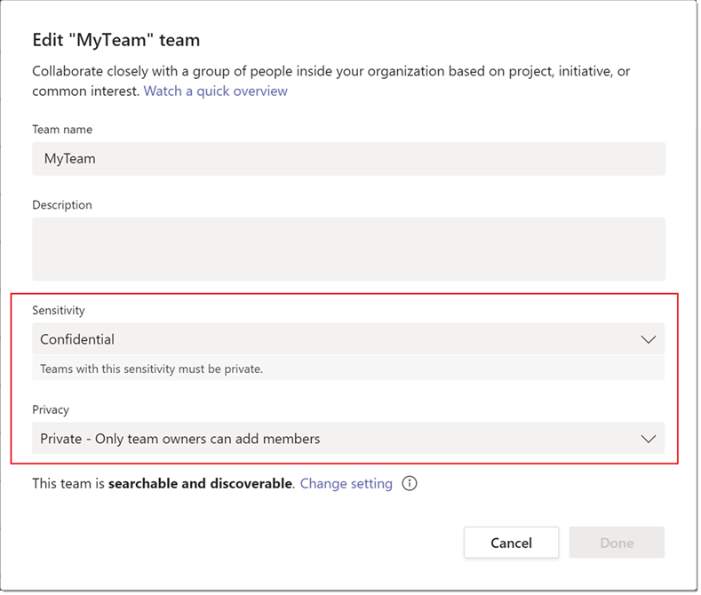

# <a name="sensitivity-labels-for-microsoft-teams"></a><span data-ttu-id="40543-103">Rótulos de sensibilidade do Microsoft Teams</span><span class="sxs-lookup"><span data-stu-id="40543-103">Sensitivity labels for Microsoft Teams</span></span>

[!INCLUDE [preview-feature](includes/preview-feature.md)]

<span data-ttu-id="40543-104">Os [Rótulos de sensibilidade](https://docs.microsoft.com/microsoft-365/compliance/sensitivity-labels) permitem que os administradores de equipe regulam o acesso a conteúdo organizacional confidencial criado durante a colaboração dentro do teams.</span><span class="sxs-lookup"><span data-stu-id="40543-104">[Sensitivity labels](https://docs.microsoft.com/microsoft-365/compliance/sensitivity-labels) allow Teams admins to regulate access to sensitive organizational content created during collaboration within teams.</span></span> <span data-ttu-id="40543-105">Você pode definir rótulos de sensibilidade e suas políticas associadas no [centro de conformidade de & de segurança](https://docs.microsoft.com/microsoft-365/compliance/go-to-the-securitycompliance-center).</span><span class="sxs-lookup"><span data-stu-id="40543-105">You can define sensitivity labels and their associated policies in the [Security & Compliance Center](https://docs.microsoft.com/microsoft-365/compliance/go-to-the-securitycompliance-center).</span></span> <span data-ttu-id="40543-106">Esses rótulos e políticas são automaticamente aplicados ao Teams em sua organização.</span><span class="sxs-lookup"><span data-stu-id="40543-106">These labels and policies are automatically applied to teams in your organization.</span></span>  

## <a name="whats-the-difference-between-sensitivity-labels-and-teams-classification-labels"></a><span data-ttu-id="40543-107">Qual é a diferença entre rótulos de sensibilidade e rótulos de classificação de equipes?</span><span class="sxs-lookup"><span data-stu-id="40543-107">What's the difference between sensitivity labels and Teams classification labels?</span></span>

<span data-ttu-id="40543-108">Rótulos de sensibilidade são diferentes dos rótulos de classificação que exigem que você os crie usando o PowerShell.</span><span class="sxs-lookup"><span data-stu-id="40543-108">Sensitivity labels are different from classification labels that require you to create them using PowerShell.</span></span> <span data-ttu-id="40543-109">Os rótulos de classificação são cadeias de caracteres de texto que podem ser associadas a um grupo, mas não têm políticas reais associadas a eles.</span><span class="sxs-lookup"><span data-stu-id="40543-109">Classification labels are text strings that can be associated with a group but don't have any actual policies associated with them.</span></span> <span data-ttu-id="40543-110">Você usa rótulos de classificação como metadados para impor políticas manualmente por meio de ferramentas e scripts internos.</span><span class="sxs-lookup"><span data-stu-id="40543-110">You use classification labels as metadata to manually enforce policies through internal tools and scripts.</span></span>

<span data-ttu-id="40543-111">Por outro lado, as etiquetas de sensibilidade e suas políticas são automaticamente impostas de ponta a ponta por meio de uma combinação da plataforma de grupos, do centro de conformidade & do centro de conformidade e dos serviços do teams.</span><span class="sxs-lookup"><span data-stu-id="40543-111">On the other hand, sensitivity labels and their policies are automatically enforced end-to-end through a combination of the Groups platform, Security & Compliance Center, and Teams services.</span></span> <span data-ttu-id="40543-112">Os rótulos de sensibilidade fornecem suporte avançado à infraestrutura para proteger os dados confidenciais da sua organização.</span><span class="sxs-lookup"><span data-stu-id="40543-112">Sensitivity labels provide powerful infrastructure support for securing your organization's sensitive data.</span></span>  

## <a name="create-manage-and-publish-sensitivity-labels-for-teams"></a><span data-ttu-id="40543-113">Criar, gerenciar e publicar rótulos de sensibilidade para equipes</span><span class="sxs-lookup"><span data-stu-id="40543-113">Create, manage, and publish sensitivity labels for Teams</span></span>

<span data-ttu-id="40543-114">Para saber como habilitar, criar e publicar rótulos de sensibilidade para equipes, consulte [usar rótulos de sensibilidade com o Microsoft Teams, grupos do Office 365 e sites do SharePoint](https://docs.microsoft.com/microsoft-365/compliance/sensitivity-labels-teams-groups-sites).</span><span class="sxs-lookup"><span data-stu-id="40543-114">For how to enable, create, and publish sensitivity labels for Teams, see [Use sensitivity labels with Microsoft Teams, Office 365 groups, and SharePoint sites](https://docs.microsoft.com/microsoft-365/compliance/sensitivity-labels-teams-groups-sites).</span></span>

>[!IMPORTANT]
><span data-ttu-id="40543-115">Criar, atualizar e excluir rótulos de sensibilidade exigem sequenciamento cuidadoso com rótulos de publicação para usuários.</span><span class="sxs-lookup"><span data-stu-id="40543-115">Creating, updating and deleting sensitivity labels require careful sequencing with publishing labels to users.</span></span> <span data-ttu-id="40543-116">Qualquer desvio na sequência pode resultar em erros persistentes de criação de equipe para todos os usuários.</span><span class="sxs-lookup"><span data-stu-id="40543-116">Any deviation in the sequence can result in persistent team creation errors for all users.</span></span> <span data-ttu-id="40543-117">Portanto, é essencial fazer o seguinte quando você <a href="#createpublishlabels">cria e publica rótulos</a>, <a href="#modifydeletelabels">modifica e exclui rótulos publicados</a>e <a href="#manageerrors">gerencia erros de criação de equipe</a>.</span><span class="sxs-lookup"><span data-stu-id="40543-117">Therefore, it's critical to do the following when you <a href="#createpublishlabels">create and publish labels</a>, <a href="#modifydeletelabels">modify and delete published labels</a>, and <a href="#manageerrors">manage team creation errors</a>.</span></span>

<span data-ttu-id="40543-118">**Criar e publicar rótulos** <a name="createpublishlabels"></a></span><span class="sxs-lookup"><span data-stu-id="40543-118">**Create and publish labels** <a name="createpublishlabels"> </a></span></span>

<span data-ttu-id="40543-119">Quando um rótulo é criado e publicado no centro de conformidade do & de segurança, pode levar até 24 horas para o rótulo ficar visível na interface de criação do Microsoft Teams.</span><span class="sxs-lookup"><span data-stu-id="40543-119">When a label is created and published in the Security & Compliance Center, it can take up to 24 hours for the label to become visible in the teams creation interface.</span></span> <span data-ttu-id="40543-120">Use as etapas a seguir para publicar o rótulo para todos os usuários no locatário:</span><span class="sxs-lookup"><span data-stu-id="40543-120">Use the following steps to publish the label for all users in the tenant:</span></span>
1. <span data-ttu-id="40543-121">Crie o rótulo e publique-o para algumas contas de usuário selecionadas no locatário.</span><span class="sxs-lookup"><span data-stu-id="40543-121">Create the label and publish it for a few select user accounts in the tenant.</span></span>
2. <span data-ttu-id="40543-122">Quando o rótulo for publicado, Aguarde 24 horas.</span><span class="sxs-lookup"><span data-stu-id="40543-122">When the label is published, wait 24 hours.</span></span>
3. <span data-ttu-id="40543-123">Depois de 24 horas, tente criar uma equipe com o rótulo usando uma das contas de usuário que têm acesso ao rótulo.</span><span class="sxs-lookup"><span data-stu-id="40543-123">After 24 hours, try to create a team with the label using one of the user accounts that have access to the label.</span></span>
4. <span data-ttu-id="40543-124">Se a equipe criou com êxito a etapa 3, siga em frente e publique o rótulo dos usuários remanescentes no locatário.</span><span class="sxs-lookup"><span data-stu-id="40543-124">If the team successfully created in step 3, then go ahead and publish the label for the remaining users in the tenant.</span></span>

<span data-ttu-id="40543-125">**Modificar e excluir rótulos publicados** <a name="modifydeletelabels"></a></span><span class="sxs-lookup"><span data-stu-id="40543-125">**Modify and delete published labels** <a name="modifydeletelabels"> </a></span></span>

<span data-ttu-id="40543-126">Excluir ou modificar o rótulo enquanto ele está associado a políticas de sensibilidade pode resultar em falhas de criação de equipe em todo o locatário.</span><span class="sxs-lookup"><span data-stu-id="40543-126">Deleting or modifying the label while it's associated with sensitivity policies can result in team creation failures across the tenant.</span></span> <span data-ttu-id="40543-127">Portanto, antes de excluir ou modificar um rótulo, primeiro você deve desassociar o rótulo de suas políticas associadas.</span><span class="sxs-lookup"><span data-stu-id="40543-127">Therefore, before you delete or modify a label, you must first disassociate the label from its associated policies.</span></span> <span data-ttu-id="40543-128">Use as etapas a seguir</span><span class="sxs-lookup"><span data-stu-id="40543-128">Use the following steps</span></span>  
<span data-ttu-id="40543-129">para excluir ou modificar um rótulo:</span><span class="sxs-lookup"><span data-stu-id="40543-129">to delete or modify a label:</span></span>
1. <span data-ttu-id="40543-130">Remova o rótulo de todas as políticas que usam o rótulo.</span><span class="sxs-lookup"><span data-stu-id="40543-130">Remove the label from all policies that use the label.</span></span> <span data-ttu-id="40543-131">Ou, se preferir, você também pode excluir as próprias políticas.</span><span class="sxs-lookup"><span data-stu-id="40543-131">Alternatively, you can also delete the policies themselves.</span></span>
2. <span data-ttu-id="40543-132">Quando o rótulo é removido das políticas ou as próprias diretivas são excluídas, aguarde 48 horas antes de prosseguir.</span><span class="sxs-lookup"><span data-stu-id="40543-132">When the label is removed from the policies or the policies themselves are deleted, wait 48 hours before proceeding further.</span></span>
3. <span data-ttu-id="40543-133">Após 48 horas, inicie a interface de criação de equipe e certifique-se de que o rótulo não fique mais visível para qualquer usuário no locatário.</span><span class="sxs-lookup"><span data-stu-id="40543-133">After 48 hours, launch the team creation interface and ensure that the label is no longer visible for any user in the tenant.</span></span>
4. <span data-ttu-id="40543-134">Agora você pode excluir ou modificar o rótulo com segurança.</span><span class="sxs-lookup"><span data-stu-id="40543-134">Now you can safely delete or modify the label.</span></span>

<span data-ttu-id="40543-135">**Gerenciar erros** <a name="manageerrors"></a> de criação de equipe</span><span class="sxs-lookup"><span data-stu-id="40543-135">**Manage team creation errors** <a name="manageerrors"> </a></span></span>

<span data-ttu-id="40543-136">Se a criação de equipe começar a falhar em qualquer ponto durante a visualização pública, você terá duas opções:</span><span class="sxs-lookup"><span data-stu-id="40543-136">If team creation begins to fail at any point during the public preview, you have two options:</span></span>
 - <span data-ttu-id="40543-137">Certifique-se de que os rótulos de sensibilidade não sejam obrigatórios para qualquer usuário durante a criação da equipe.</span><span class="sxs-lookup"><span data-stu-id="40543-137">Ensure that sensitivity labels are not mandatory for any user during team creation.</span></span>
 - <span data-ttu-id="40543-138">Desative os rótulos de sensibilidade usando os scripts em [habilitar esta visualização](https://docs.microsoft.com/microsoft-365/compliance/sensitivity-labels-teams-groups-sites#enable-this-preview).</span><span class="sxs-lookup"><span data-stu-id="40543-138">Turn off sensitivity labels using the scripts in [Enable this preview](https://docs.microsoft.com/microsoft-365/compliance/sensitivity-labels-teams-groups-sites#enable-this-preview).</span></span>

<span data-ttu-id="40543-139">Observe que a configuração EnableMIPLabels deve ser definida como false da seguinte maneira:</span><span class="sxs-lookup"><span data-stu-id="40543-139">Note that the EnableMIPLabels setting must be set to false as follows:</span></span>

```
$setting["EnableMIPLabels"] = "False"
 ```

## <a name="using-sensitivity-labels-with-teams"></a><span data-ttu-id="40543-140">Usar rótulos de sensibilidade com o Teams</span><span class="sxs-lookup"><span data-stu-id="40543-140">Using sensitivity labels with Teams</span></span>

<span data-ttu-id="40543-141">Aqui estão alguns exemplos de cenários de como você pode usar rótulos de sensibilidade com o Teams em sua organização.</span><span class="sxs-lookup"><span data-stu-id="40543-141">Here are some example scenarios of how you can use sensitivity labels with Teams in your organization.</span></span>

### <a name="privacy-setting-of-teams"></a><span data-ttu-id="40543-142">Configuração de privacidade do teams</span><span class="sxs-lookup"><span data-stu-id="40543-142">Privacy setting of teams</span></span>

<span data-ttu-id="40543-143">Você pode criar um rótulo de sensibilidade que, quando aplicado durante a criação da equipe, permite que os usuários criem equipes com uma configuração específica de privacidade (pública ou particular).</span><span class="sxs-lookup"><span data-stu-id="40543-143">You can create a sensitivity label that, when applied during team creation, allows users to create teams with a specific privacy (public or private) setting.</span></span>

<span data-ttu-id="40543-144">Por exemplo, você pode criar um rótulo chamado "confidencial" no centro de conformidade do & de segurança e configurar o Microsoft Teams para que qualquer equipe criada com esse rótulo deve ser uma equipe privada.</span><span class="sxs-lookup"><span data-stu-id="40543-144">For example, you create a label named “Confidential” in the Security & Compliance Center and you configure Teams so that any team that's created with this label must be a private team.</span></span> <span data-ttu-id="40543-145">Quando um usuário cria uma nova equipe e seleciona o rótulo **confidencial** , a única opção de privacidade que está disponível para o usuário é **particular**.</span><span class="sxs-lookup"><span data-stu-id="40543-145">When a user creates a new team and selects the **Confidential** label, the only privacy option that's available to the user is **Private**.</span></span> <span data-ttu-id="40543-146">Outras opções de privacidade, como público e toda a organização, são desabilitadas para o usuário.</span><span class="sxs-lookup"><span data-stu-id="40543-146">Other privacy options such as Public and Org-wide are disabled for the user.</span></span>


<span data-ttu-id="40543-148">Da mesma forma, se o usuário selecionar **geral** quando criar uma nova equipe, ele só poderá criar equipes públicas ou de toda a organização.</span><span class="sxs-lookup"><span data-stu-id="40543-148">Similarly, if the user selects **General** when they create a new team, they can only create public or org-wide teams.</span></span>


<span data-ttu-id="40543-150">Quando a equipe é criada, o rótulo de sensibilidade fica visível no canto superior direito dos canais da equipe.</span><span class="sxs-lookup"><span data-stu-id="40543-150">When the team is created, the sensitivity label is visible in the upper-right corner of channels in the team.</span></span>


<span data-ttu-id="40543-152">Um proprietário de equipe pode alterar o rótulo de sensibilidade e a configuração de privacidade da equipe a qualquer momento, acessando a equipe e, em seguida, clicando em **Editar equipe**.</span><span class="sxs-lookup"><span data-stu-id="40543-152">A team owner can change the sensitivity label and the privacy setting of the team at any time by going to the team, and then clicking **Edit team**.</span></span>



### <a name="guest-access-to-teams"></a><span data-ttu-id="40543-154">Acesso de convidado a equipes</span><span class="sxs-lookup"><span data-stu-id="40543-154">Guest access to teams</span></span>

<span data-ttu-id="40543-155">Você pode especificar se uma equipe criada com um rótulo específico permite acesso de convidado.</span><span class="sxs-lookup"><span data-stu-id="40543-155">You can specify whether a team created with a specific label allows guest access.</span></span> <span data-ttu-id="40543-156">As equipes criadas com um rótulo que não permite acesso de convidado só estão disponíveis para os usuários da sua organização.</span><span class="sxs-lookup"><span data-stu-id="40543-156">Teams created with a label that doesn't allow guest access are only available to users in your organization.</span></span> <span data-ttu-id="40543-157">Pessoas de fora da sua organização não podem ser adicionadas à equipe.</span><span class="sxs-lookup"><span data-stu-id="40543-157">People outside your organization can't be added to the team.</span></span>

## <a name="known-issues"></a><span data-ttu-id="40543-158">Problemas conhecidos</span><span class="sxs-lookup"><span data-stu-id="40543-158">Known issues</span></span>

<span data-ttu-id="40543-159">**Suporte para rótulos de sensibilidade no centro de administração do Microsoft Teams**</span><span class="sxs-lookup"><span data-stu-id="40543-159">**Support for sensitivity labels in the Microsoft Teams admin center**</span></span>

<span data-ttu-id="40543-160">No momento, não há suporte para rótulos de sensibilidade no centro de administração do Microsoft Teams.</span><span class="sxs-lookup"><span data-stu-id="40543-160">Currently, sensitivity labels are not supported in the Microsoft Teams admin center.</span></span> <span data-ttu-id="40543-161">Se você usar rótulos de sensibilidade, não poderá definir rótulos de sensibilidade ao criar ou editar uma equipe.</span><span class="sxs-lookup"><span data-stu-id="40543-161">If you use sensitivity labels, you won't be able to set sensitivity labels when you create or edit a team.</span></span> <span data-ttu-id="40543-162">Os rótulos de sensibilidade também não ficam visíveis nas propriedades da equipe e não ficarão visíveis na coluna **classificação** no centro de administração do Microsoft Teams.</span><span class="sxs-lookup"><span data-stu-id="40543-162">Sensitivity labels are also not visible in team properties and won't be visible in the **Classification** column in the Microsoft Teams admin center.</span></span>

<span data-ttu-id="40543-163">**Suporte para rótulos de sensibilidade em APIs de gráficos do Teams, cmdlets e modelos do PowerShell**</span><span class="sxs-lookup"><span data-stu-id="40543-163">**Support for sensitivity labels in Teams Graph APIs, Powershell cmdlets and templates**</span></span>

<span data-ttu-id="40543-164">Atualmente, os usuários não poderão aplicar rótulos de sensibilidade em equipes criadas diretamente por meio de APIs de gráfico, cmdlets e modelos do PowerShell.</span><span class="sxs-lookup"><span data-stu-id="40543-164">Currently, users won't be able to apply sensitivity labels on teams that are created directly through Graph APIs, Powershell cmdlets, and templates.</span></span>

<span data-ttu-id="40543-165">**Edição de rótulos de sensibilidade diretamente em um conjunto de sites do SharePoint para canais privados**</span><span class="sxs-lookup"><span data-stu-id="40543-165">**Editing sensitivity labels directly on a SharePoint site collection for private channels**</span></span>

<span data-ttu-id="40543-166">Os canais privados criados em uma equipe herdam o rótulo de sensibilidade que foi aplicado a uma equipe.</span><span class="sxs-lookup"><span data-stu-id="40543-166">Private channels that are created in a team inherit the sensitivity label which was applied on a team.</span></span> <span data-ttu-id="40543-167">Além disso, o mesmo rótulo é aplicado automaticamente no conjunto de sites do SharePoint para o canal privado.</span><span class="sxs-lookup"><span data-stu-id="40543-167">Furthermore, the same label is automatically applied on the SharePoint site collection for the private channel.</span></span>

<span data-ttu-id="40543-168">Se um usuário atualizar diretamente o rótulo de sensibilidade em um conjunto de sites do SharePoint para um canal privado, esse rótulo não será atualizado no cliente do teams.</span><span class="sxs-lookup"><span data-stu-id="40543-168">If a user directly updates the sensitivity label on a SharePoint site collection for a private channel, that label isn't updated in the Teams client.</span></span> <span data-ttu-id="40543-169">Nesse cenário, os usuários continuarão a ver o rótulo de sensibilidade aplicado a uma equipe no cabeçalho do canal privado.</span><span class="sxs-lookup"><span data-stu-id="40543-169">In this scenario, users will continue to see the sensitivity label applied on a team in the private channel header.</span></span>

<span data-ttu-id="40543-170">**Tempo de propagação de alterações aplicadas a rótulos de sensibilidade fora do aplicativo Teams**</span><span class="sxs-lookup"><span data-stu-id="40543-170">**Propagation times for changes applied to sensitivity labels outside the Teams app**</span></span>

<span data-ttu-id="40543-171">As alterações feitas em rótulos de sensibilidade fora do aplicativo Teams podem levar até 24 horas para refletir no aplicativo Teams.</span><span class="sxs-lookup"><span data-stu-id="40543-171">Changes made to sensitivity labels outside the Teams app can take up to 24 hours to reflect in the Teams app.</span></span> <span data-ttu-id="40543-172">Isso se aplica a qualquer alteração feita para habilitar ou desabilitar rótulos de um locatário, alterações em nomes de rótulo, configurações e políticas.</span><span class="sxs-lookup"><span data-stu-id="40543-172">This applies to any changes made to enable or disable labels for a tenant, changes to label names, settings, and policies.</span></span>

<span data-ttu-id="40543-173">Além disso, qualquer alteração em um rótulo feito diretamente em um grupo ou conjunto de sites do SharePoint que faz backup da equipe pode levar até 24 horas para se propagar para o aplicativo Teams.</span><span class="sxs-lookup"><span data-stu-id="40543-173">Additionally, any changes to a label made directly to a group or SharePoint site collection that backs the team can take up to 24 hours to propagate to the Teams app.</span></span>
