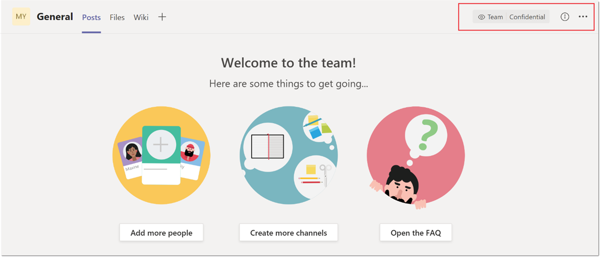

# Rótulos de sensibilidade do Microsoft TeamsSensitivity labels for Microsoft Teams

[Os rótulos de sensibilidade](https://docs.microsoft.com/microsoft-365/compliance/sensitivity-labels) permitem que os administradores do Teams protejam e regulam o acesso a conteúdo organizacional sensível criado durante a colaboração dentro das equipes.[Sensitivity labels](https://docs.microsoft.com/microsoft-365/compliance/sensitivity-labels) allow Teams admins to protect and regulate access to sensitive organizational content created during collaboration within teams. Depois de configurar rótulos de sensibilidade com suas políticas associadas no centro de conformidade da [Microsoft,](https://docs.microsoft.com/microsoft-365/compliance/go-to-the-securitycompliance-center)esses rótulos podem ser aplicados às equipes em sua organização.After you configure sensitivity labels with their associated policies in the [Microsoft compliance center](https://docs.microsoft.com/microsoft-365/compliance/go-to-the-securitycompliance-center), these labels can be applied to teams in your organization.

No momento, os rótulos de sensibilidade não têm suporte para clientes que usam SKUs do Teams Education.Sensitivity labels are currently unsupported for customers using Teams Education SKUs. Para saber mais sobre licenciamento, consulte a descrição [do serviço microsoft teams.](https://docs.microsoft.com/office365/servicedescriptions/teams-service-description)To learn more about licensing, see [Microsoft Teams service description](https://docs.microsoft.com/office365/servicedescriptions/teams-service-description).

## Qual é a diferença entre rótulos de sensibilidade e rótulos de classificação do Teams?What's the difference between sensitivity labels and Teams classification labels?

Os rótulos de sensibilidade são diferentes dos rótulos de classificação, também conhecidos como classificação de grupo do Azure AD.Sensitivity labels are different from classification labels, also known as Azure AD group classification. Os rótulos de classificação são cadeias de texto que podem ser associadas a um grupo do Microsoft 365, mas que não têm políticas reais associadas a eles.Classification labels are text strings that can be associated with a Microsoft 365 group but don't have any actual policies associated with them. Você usa rótulos de classificação como metadados e deve usar outros métodos, como ferramentas internas e scripts, para impor políticas.You use classification labels as metadata and then must use other methods such as internal tools and scripts, to enforce policies.

A vantagem de usar rótulos de sensibilidade é que suas políticas são impostas automaticamente de ponta a ponta por meio de uma combinação da plataforma Grupos do Microsoft 365, do centro de conformidade e dos serviços do Teams.The benefit of using sensitivity labels is that their policies are automatically enforced end-to-end through a combination of the Microsoft 365 Groups platform, the compliance center, and Teams services. Os rótulos de sensibilidade oferecem suporte poderoso à infraestrutura para proteger os dados confidenciais da sua organização e garantir a conformidade com suas políticas ou regulamentos internos.Sensitivity labels provide powerful infrastructure support for securing your organization's sensitive data and ensuring compliance with your internal policies or regulations.

Se você usa rótulos de classificação no momento, confira a documentação a seguir para obter mais informações e instruções sobre como migrá-los para rótulos de sensibilidade: classificação de grupo clássico [do Azure AD.](https://docs.microsoft.com/microsoft-365/compliance/sensitivity-labels-teams-groups-sites#classic-azure-ad-group-classification)If you currently use classification labels, see the following documentation for more information and instructions how to migrate them to sensitivity labels: [Classic Azure AD group classification](https://docs.microsoft.com/microsoft-365/compliance/sensitivity-labels-teams-groups-sites#classic-azure-ad-group-classification).

## Cenários de exemplo para rótulos de sensibilidadeExample scenarios for sensitivity labels

Cenários de exemplo de como você pode usar rótulos de sensibilidade com o Teams em sua organização:Example scenarios for how you can use sensitivity labels with Teams in your organization:

- [Definir o nível de privacidade (público ou privado) das equipesSet the privacy level (public or private) for teams](#set-the-privacy-level-for-teams)
- [Controlar o acesso de convidados às equipesControl guest access to teams](#control-guest-access-to-teams)

### Definir o nível de privacidade das equipesSet the privacy level for teams

Você pode criar e configurar um rótulo de sensibilidade que, quando aplicado durante a criação da equipe, permite que os usuários criem equipes com uma configuração específica de privacidade (pública ou privada).You can create and configure a sensitivity label that, when applied during team creation, allows users to create teams with a specific privacy (public or private) setting.

Por exemplo, você cria e publica um rótulo de confidencialidade chamado "Confidencial" que tem a opção de privacidade do rótulo configurada como **Particular.**For example, you create and publish a sensitivity label named "Confidential" that has the label privacy option configured as **Private**. Como resultado, qualquer equipe criada com esse rótulo deve ser uma equipe particular.As a result, any team that's created with this label must be a private team. 

Quando um usuário cria uma nova  equipe e seleciona o rótulo Confidencial, a única opção de privacidade disponível para o usuário é **Particular.**When a user creates a new team and selects the **Confidential** label, the only privacy option that's available to the user is **Private**. Outras opções de privacidade, como Público e toda a organização, não estão disponíveis para o usuário selecionar:Other privacy options such as Public and Org-wide aren't available for the user to select:

Da mesma forma, você cria e publica um rótulo de sensibilidade chamado "Geral" que tem a opção de privacidade do rótulo configurada como **Público.**Similarly, you create and publish a sensitivity label named "General" that has the label privacy option configured as **Public**. Quando um usuário cria uma nova equipe, ele só pode criar equipes públicas ou de toda a organização quando seleciona esse rótulo:When a user creates a new team, they can only create public or org-wide teams when they select this label:

Quando uma equipe é criada, o rótulo de sensibilidade fica visível no canto superior direito dos canais da equipe.When a team is created, the sensitivity label is visible in the upper-right corner of channels in the team.

Um proprietário de equipe pode alterar o rótulo de sensibilidade e a configuração de privacidade da equipe a qualquer momento, indo até a equipe e, em seguida, clique em **Editar equipe.**A team owner can change the sensitivity label and the privacy setting of the team at any time by going to the team, and then click **Edit team**.

### Controlar o acesso de convidados às equipesControl guest access to teams

Você pode usar rótulos de sensibilidade para controlar o acesso de convidados às suas equipes.You can use sensitivity labels to control guest access to your teams. As equipes criadas com um rótulo que não permite o acesso de convidados só estão disponíveis para os usuários em sua organização.Teams created with a label that doesn't allow guest access are only available to users in your organization. Pessoas de fora da sua organização não podem ser adicionadas à equipe.People outside your organization can't be added to the team.

## Centro de administração do Microsoft TeamsMicrosoft Teams admin center

Você pode aplicar rótulos de sensibilidade ao criar ou editar uma equipe no Centro de administração do Microsoft Teams.You can apply sensitivity labels when you create or edit a team in the Microsoft Teams admin center. 

Os rótulos de sensibilidade também são  visíveis  nas propriedades da equipe e na coluna Classificação na página Gerenciar equipes do Centro de administração do Microsoft Teams.Sensitivity labels are also visible in team properties and in the **Classification** column on the **Manage teams** page of the Microsoft Teams admin center.

## LimitaçõesLimitations

Antes de usar rótulos de sensibilidade para o Teams, esteja ciente das seguintes limitações:Before you use sensitivity labels for Teams, be aware of the following limitations:

- **Os nomes dos rótulos pai não são exibidos para sublabeles****Parent label names aren't displayed for sublabels**
    
    O Teams dá suporte a sublabeles, mas não exibe o nome do rótulo pai.Teams supports sublabels but doesn't display the name of the parent label. Por exemplo, **Confidencial** \\ **Todos os Funcionários** é exibido como **Todos os Funcionários.**For example, **Confidential** \\ **All Employees** displays as **All Employees**.

- **Os rótulos de sensibilidade não são suportados por APIs do Teams Graph, cmdlets do PowerShell e modelos****Sensitivity labels aren't supported by Teams Graph APIs, PowerShell cmdlets, and templates**
    
    Os usuários não poderão aplicar rótulos de sensibilidade em equipes criadas diretamente por meio de APIs do Teams Graph, cmdlets do PowerShell e modelos do Teams.Users won't be able to apply sensitivity labels on teams that are created directly through Teams Graph APIs, Teams PowerShell cmdlets, and Teams templates.

- **Suporte para canais privados****Support for private channels**
    
    Canais privados criados em uma equipe herdam o rótulo de sensibilidade aplicado em uma equipe.Private channels that are created in a team inherit the sensitivity label that was applied on a team. O mesmo rótulo é aplicado automaticamente no conjunto de sites do SharePoint para o canal privado.The same label is automatically applied on the SharePoint site collection for the private channel.
    
    No entanto, se um usuário alterar diretamente o rótulo de sensibilidade em um site do SharePoint para um canal privado, essa alteração de rótulo não será refletida no cliente do Teams.However, if a user directly changes the sensitivity label on a SharePoint site for a private channel, that label change isn't reflected in the Teams client. Nesse cenário, os usuários continuam a ver o rótulo de sensibilidade original aplicado na equipe no título do canal privado.In this scenario, users continue to see the original sensitivity label applied on the team in the private channel header.

## Como criar e configurar rótulos de sensibilidade para o TeamsHow to create and configure sensitivity labels for Teams

Use as instruções da documentação do Microsoft 365 para criar e configurar rótulos de sensibilidade para o Teams:Use the instructions from the Microsoft 365 documentation to create and configure sensitivity labels for Teams: 

- [Use rótulos de sensibilidade para proteger conteúdo no Microsoft Teams, grupos do Microsoft 365 e sites do SharePoint.](https://docs.microsoft.com/microsoft-365/compliance/sensitivity-labels-teams-groups-sites)[Use sensitivity labels to protect content in Microsoft Teams, Microsoft 365 groups, and SharePoint sites](https://docs.microsoft.com/microsoft-365/compliance/sensitivity-labels-teams-groups-sites).
