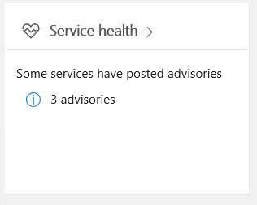

Verificar a integridade do serviço para o Microsoft TeamsVerify service health for Microsoft Teams
===========================================

A saúde do serviço do Microsoft Teams é exibida no centro de administração do Microsoft 365.Service health for Microsoft Teams is displayed on the Microsoft 365 admin center. Antes de solucionar problemas, é uma boa prática verificar se o serviço do Teams está íntegro.Before troubleshooting issues, it's a good practice to verify that the Teams service is healthy. Vá para o console <a href=" https://admin.microsoft.com/adminportal/home?ref=servicehealth" target="_blank">de Saúde do Serviço do Teams</a> para revisar a saúde do serviço.Go to the <a href=" https://admin.microsoft.com/adminportal/home?ref=servicehealth" target="_blank">Teams Service Health</a> console to review the service health.

Além disso, lembre-se de que o Microsoft Teams é criado com base em serviços adicionais do Microsoft 365 ou do Office 365, portanto, ao olhar para a Saúde do Serviço, lembre-se de também verificar o status do Exchange, do SharePoint e do OneDrive for Business.Also, keep in mind that, Microsoft Teams is built on top of additional Microsoft 365 or Office 365 services, so when looking at Service Health, remember to also check the status of Exchange, SharePoint, and OneDrive for Business. Os problemas de integridade de serviço para esses outros serviços não significam automaticamente que o Teams será afetado (ex.: o download do Catálogo de Endereços no Exchange não está disponível), mas que você precisa analisar os avisos dos serviços afetados para verificar se há algum impacto no Microsoft Teams.Service Health issues for these other services does not automatically mean that Teams is impacted (e.g. Address Book downloads in Exchange are unavailable), but that you should review the advisories for those affected services to determine if there is an impact to Microsoft Teams.

## Tópicos relacionadosRelated topics

[Solução de problemas do TeamsTeams Troubleshooting](/MicrosoftTeams/troubleshoot/teams)