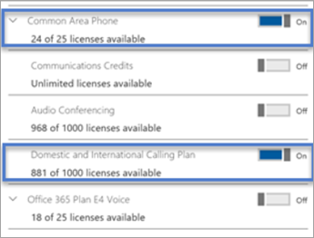

# Configurar a licença de Telefone de Área Comum para o Microsoft TeamsSet up the Common Area Phone license for Microsoft Teams

Um telefone de área comum geralmente é colocado em uma área de como um lobby ou outro que está disponível para muitas pessoas para fazer uma chamada; Por exemplo, uma recepção área, lobby ou conferência telefônica.A common area phone is typically placed in an area like a lobby or another area which is available to many people to make a call; for example, a reception area, lobby, or conference phone. Telefones de área comum são configurados como dispositivos em vez de usuários e podem entrar automaticamente em uma rede.Common area phones are set up as devices rather than users, and can automatically sign into a network.

Nas etapas abaixo, podemos ajudá-lo a configurar uma conta para o sistema telefônico implantar telefones de área comum para sua organização.In the steps below, we’ll help you set up an account for Phone System to deploy common area phones for your organization. Para uma sala de reunião mais completa experiência, incluindo serviços de audioconferência, considere adquirir a licença de sala de reunião dedicada com uma reunião do dispositivo de sala.For a more complete meeting room experience, including audio conferencing, consider purchasing the dedicated Meeting Room license with a meeting room device. 

As primeiras coisas que você precisa fazer são compra uma licença de telefone de área comum (COBRIR) e certifique-se de que você tiver um telefone de certificados.The first things you need to do are purchase a Common Area Phone (CAP) license and make sure that you have a certified phone. Para procurar e saber mais sobre certificados telefones, vá para [dispositivos de equipes da Microsoft](https://products.office.com/microsoft-teams/across-devices?ms.url=officecomteamsdevices&rtc=1).To search for and learn more about certified phones, go to [Microsoft Teams devices](https://products.office.com/microsoft-teams/across-devices?ms.url=officecomteamsdevices&rtc=1). 

## Etapa 1 - Compre as licençasStep 1 - Buy the licenses

1. No Centro de administração do Office 365, vá para **faturamento** > **Serviços de compra** e, em seguida, expanda **outros planos**.In the Office 365 admin center, go to **Billing** > **Purchase services** and then expand **Other plans**.

    

2. Selecione o **telefone de área comum** > **Compre agora**.Select **Common Area Phone** > **Buy now**.

3. Na página de **check-out** , clique em **Comprar agora**.On the **Checkout** page click **Buy now**.

4. Expanda **inscrições de complemento** e clique em para adquirir um plano de chamada.Expand **Add-on subscriptions** and then click to buy a Calling Plan. Escolha a **domésticas chamar plano** ou **plano de chamada nacionais e internacional**.Choose either the **Domestic Calling Plan** or **Domestic and International Calling Plan**.

> [!NOTE]
> Você não precisa de uma licença do Sistema de Telefonia.You don't need a Phone System license. Ela está incluída na licença do Telefone da Área Comum.It's included with the Common Area Phone license.

Para obter mais informações sobre licenças, consulte [Licenciamento de complemento de equipes da Microsoft](teams-add-on-licensing/microsoft-teams-add-on-licensing.md).For more information on licenses, see [Microsoft Teams add-on licensing](teams-add-on-licensing/microsoft-teams-add-on-licensing.md).

## Etapa 2 - Criar uma nova conta de usuário para o telefone e atribuir as licençasStep 2 - Create a new user account for the phone and assign the licenses

1. No Centro de administração do Office 365, vá para **usuários** > **usuários ativos** > **Adicionar um usuário**.In the Office 365 admin center, go to **users** > **active users** > **add a user**.

2. Insira um nome de usuário como "Main" para o primeiro nome e "Recepção" para o segundo nome.Enter a user name like “Main" for the first name and "Reception” for the second name.

3. Insira um nome de exibição se ele não gerar automaticamente um como "Main recepção".Enter a display name if it doesn't autogenerate one like "Main Reception."

4. Insira um nome de usuário, como "MainReception" ou "Mainlobby".Enter a user name like "MainReception" or "Mainlobby."

5. Para telefones de área comum, talvez você queira definir uma senha manualmente ou ter a mesma senha para todos os telefones de área comum.For common area phones, you might want to set a password manually or have the same password for all your common area phones. Além disso, você pode achar sobre desmarcar a caixa de seleção **tornar este usuário alterar suas senhas quando eles entrarem pela primeira vez** .Also, you might think about clearing the **Make this user change their password when they first sign in** check box.

6. Atribua as licenças para o usuário.Assign the licenses to the user. Na mesma página, clique para expandir as **Licenças de produto**.On the same page, click to expand **Product licenses**. Ligue o telefone de área comum e escolha um **Domésticas chamar planejar** ou um **nacionais e internacionais chamar planejar**.Turn on the Common Area Phone and pick either a **Domestic Calling Plan** or a **Domestic and International Calling Plan**. 

    

Para obter mais informações, consulte [Adicionar um usuário](https://docs.microsoft.com/office365/admin/add-users/add-users?redirectSourcePath=%252farticle%252f1970f7d6-03b5-442f-b385-5880b9c256ec&view=o365-worldwide).For more information, see [Add a user](https://docs.microsoft.com/office365/admin/add-users/add-users?redirectSourcePath=%252farticle%252f1970f7d6-03b5-442f-b385-5880b9c256ec&view=o365-worldwide).

## Etapa 3 - Atribuir um número de telefone à conta de usuário do Telefone de Área ComumStep 3 - Assign a phone number to the Common Area Phone user account

Use o Skype para centro de administração de negócios para atribuir um número ao usuário.Use the Skype for Business admin center to assign a number to the user.

1. No Centro de administração do Microsoft 365, selecione **Admin centrais** > **& equipes Skype** > **portal herdada**.In the Microsoft 365 admin center, select **Admin centers** > **Teams & Skype** > **Legacy portal**.

2. No Skype para centro de administração de negócios, selecione **voz** > **números de telefone**.In the Skype for Business admin center, select **Voice** > **Phone numbers**.

3.  Selecione um número na lista de números de telefone e clique em **Atribuir**.Select a number from the list of phone numbers and click **Assign**.

4. Na página **atribuir** , na caixa de usuário de voz, digite o nome do usuário que estarão usando o telefone e selecione o usuário na lista suspensa **Selecione um usuário de voz** .On the **Assign** page, in the Voice user box, type the name of the user who will be using the phone, and then select the user in the **Select a voice user** drop-down list.

5. Na página, você precisa adicionar um endereço de emergência.While you're there you will need to add an emergency address. Escolha **pesquisa por cidade**, **pesquisa por descrição**ou **pesquisa por local** na lista suspensa e, em seguida, insira a cidade, descrição ou local na caixa de texto.Choose **Search by city**, **Search by description**, or **Search by location** from the drop-down list, and then enter the city, description, or location in the text box. Depois que você pode pesquisar, procure em **Selecione endereço de emergência** para escolher o certo para você.Once you search, look under **Select emergency address** to pick the right one for you.

6. Clique em **Salvar** e seu usuário ficará assim:Click **Save** and your user should look like this:

   

> [!NOTE]
> Os usuários serão exibidas apenas se eles têm uma licença de sistema telefônico aplicada.Users will only show up if they have a Phone System license applied. Quando fizer isso, pode levar um tempo para que o usuário apareça na lista.If you just did this, then sometimes it takes a bit for the user to show up in the list.

Para obter mais informações, consulte [Getting números de telefone para seus usuários](https://docs.microsoft.com/skypeforbusiness/what-are-calling-plans-in-office-365/getting-phone-numbers-for-your-users).For more information, see [Getting phone numbers for your users](https://docs.microsoft.com/skypeforbusiness/what-are-calling-plans-in-office-365/getting-phone-numbers-for-your-users).

Você também pode aproveitar o seu número de telefone que você tenha com outra operadora e "porta" ou transferi-la para o Office 365.You can also take your phone number that you have with another carrier and "port" or transfer it over to Office 365. Consulte [transferir os números de telefone para o Office 365](transfer-phone-numbers-to-office-365.md).See [Transfer phone numbers to Office 365](transfer-phone-numbers-to-office-365.md).

