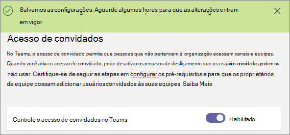

<a name="turn-on-or-off-guest-access-to-microsoft-teams"></a>Habilitar ou desabilitar o acesso de convidados no Microsoft Teams
======================================

Como administrador do Office 365, você precisa habilitar o recurso de convidados para que você ou os usuários da sua organização (especificamente os proprietários de equipe) possam adicionar convidados. 

As configurações do convidado são definidas no Azure Active Directory. Leva entre 2 e 24 horas para que as alterações entrem em vigor na sua organização do Office 365. Se um usuário vê a mensagem "Contate o administrador" ao tentar adicionar um convidado para sua equipe, é provável que o recurso de convidado ainda não foi ativado ou as configurações ainda não estejam efetivas.

> [!IMPORTANT]
> Para habilitar a experiência completa do recurso de acesso de convidados, é importante compreender a dependência de autorização básica entre o Microsoft Teams, o Azure Active Directory e o Office 365. Para obter mais informações, consulte [Autorizar acesso de convidados no Microsoft Teams](Teams-dependencies.md).

## <a name="guest-access-vs-external-access-federation"></a>Acesso de convidado versus acesso externo (federação)

[!INCLUDE [guest-vs-external-access](includes/guest-vs-external-access.md)]

## <a name="configure-guest-access-in-the-microsoft-teams-admin-center"></a>Configurar o acesso de convidado no Centro de administração do Microsoft Teams

1.  Entrar no Centro de administração do Microsoft Teams.

2.  Selecione **configurações de toda a organização** > **acesso de convidado**.

3. Defina a opção de alternância de **Permitir o acesso de convidado em equipes da Microsoft** para **ativado**.

    

4.  Defina a comuta em **chamar**, **reuniões**e **mensagens** como **ou **desativado**,** dependendo dos recursos que você deseja permitir para usuários convidados.

    - **Fazer chamadas privadas** – ativar esta configuração **em** permitir convidados fazer chamadas ponto a ponto.
    - **Permitir que o vídeo IP** - ativar esta configuração **em** permitir convidados usar o vídeo em suas chamadas e reuniões.
    - **Modo de compartilhamento de tela** – essa configuração controla a disponibilidade da tela de compartilhamento para usuários convidados. 
       - Ative esta configuração como **desabilitada** para remover a capacidade de convidados compartilhar suas telas em equipes. 
       - Ative essa configuração para um **único aplicativo** para permitir o compartilhamento de aplicativos individuais. 
       - Ative essa configuração para **tela inteira** para permitir o compartilhamento de tela concluída.
    - **Permitir reunir agora** – ativar esta configuração **em** permitir convidados usar o recurso reunir agora no Microsoft Teams.
    - **Mensagens enviadas de editar** - ativar esta configuração **em** permitir convidados editar as mensagens que eles enviados anteriormente.
    - **Convidados podem excluir as mensagens enviadas** – ativar esta configuração **em** permitir convidados excluir mensagens que eles enviados anteriormente.
    - **Bate-papo** – ativar esta configuração **em** dar clientes pela capacidade de usar o bate-papo em equipes.
    - **Use Giphys em conversas** – ativar esta configuração **em** permitir convidados usar Giphys em conversas. Giphy é um banco de dados online e o mecanismo de pesquisa que permite aos usuários pesquisar e compartilhar arquivos GIF animados. Cada Giphy é atribuída uma classificação de conteúdo.
    - **Classificação de conteúdo Giphy** – selecione uma classificação na lista suspensa:
       - **Permitir todo o conteúdo** - convidados serão capazes de inserir Giphys todos no bate-papo, independentemente da classificação de conteúdo.
       - **Moderado** - convidados serão capazes de inserir Giphys em bate-papos, mas serão restritos relativamente de conteúdo para adultos.
       - **Restrita** – convidados serão capazes de inserir Giphys em bate-papos, mas serão restritos estritamente de inserção de conteúdo para adultos.
    - **Use Memes em conversas** - ativar esta configuração **em** permitir convidados usar Memes em conversas.
    - **Use adesivos em conversas** – ativar esta configuração **em** permitir convidados usar adesivos em conversas. 


5.  Clique em **Salvar**.

## <a name="use-powershell-to-turn-guest-access-on-or-off"></a>Usar o PowerShell para ativar ou desativar o acesso de convidado

1.  Baixe o Skype para o módulo de PowerShell Online de negócios dahttps://www.microsoft.com/en-us/download/details.aspx?id=39366
 
2.  Conecte-se uma sessão do PowerShell para o Skype para ponto de extremidade Business Online.

    ```
    Import-Module SkypeOnlineConnector
    $Cred = Get-Credential
    $CSSession = New-CsOnlineSession -Credential $Cred
    Import-PSSession -Session $CSSession
    ```
3.  Verificar sua configuração e se `AllowGuestUser` é `$False`, use o cmdlet [Set-CsTeamsClientConfiguration](https://docs.microsoft.com/powershell/module/skype/set-csteamsclientconfiguration?view=skype-ps) para defini-la como `$True`.

    ```
    Get-CsTeamsClientConfiguration

    Identity                         : Global
    AllowEmailIntoChannel            : True
    RestrictedSenderList             :
    AllowDropBox                     : True
    AllowBox                         : True
    AllowGoogleDrive                 : True
    AllowShareFile                   : True
    AllowOrganizationTab             : True
    AllowSkypeBusinessInterop        : True
    ContentPin                       : RequiredOutsideScheduleMeeting
    AllowResourceAccountSendMessage  : True
    ResourceAccountContentAccess     : NoAccess
    AllowGuestUser                   : True
    AllowScopedPeopleSearchandAccess : False
    
    Set-CsTeamsClientConfiguration -AllowGuestUser $True -Identity Global
    ```
Agora você pode ter usuários convidados em equipes para sua organização.

## <a name="more-information"></a>Mais informações

Assista o vídeo a seguir para obter mais detalhes sobre o acesso de convidado.

|  |  |
|---------|---------|
| Adição de convidados no Microsoft Teams   | <iframe width="350" height="200" src="https://www.youtube.com/embed/1daMBDyBLZc" frameborder="0" allowfullscreen></iframe>   | 
