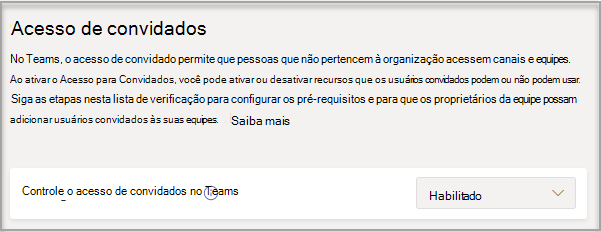
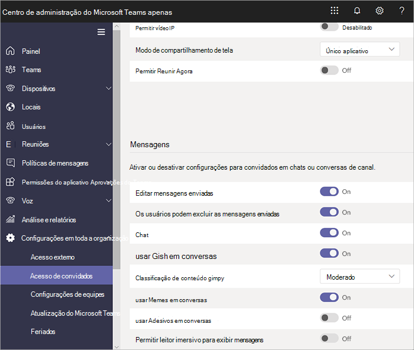

# Ativar ou desativar o acesso de convidados ao Microsoft Teams

> [!Note]

> Até **fevereiro de 2021**, o acesso de convidados é desligado por padrão. Você deve ativar o acesso de convidado para o Teams antes que os administradores ou proprietários de equipe possam adicionar convidados. Depois de ativar o acesso de convidados, pode levar algumas horas para que as alterações tenham efeito. Se os usuários  verem a mensagem Contate seu administrador quando tentarem adicionar um convidado à sua equipe, é provável que o acesso de convidados ainda não tenha sido ligado ou as configurações ainda não tenham sido efetivas.

> Após **fevereiro de 2021,** o acesso de convidados no Microsoft Teams será ligado por padrão para novos clientes & clientes existentes que não tenham configurado essa configuração. Quando essa alteração for implementada, se você ainda não tiver configurado o recurso de acesso de convidado no Microsoft Teams, esse recurso será habilitado em seu locatário. Se você quiser que o acesso de convidado permaneça desabilitado para sua organização, você precisará confirmar se a configuração de acesso de convidado está definida como **Desativado** em vez do **Padrão de Serviço**.

> [!IMPORTANT]
> Ativar o acesso de convidado depende das configurações no Azure Active Directory, Microsoft 365, Microsoft Office SharePoint Online e Teams. Para saber mais, confira [Colabore com os convidados em uma equipe](/microsoft-365/solutions/collaborate-as-team).

## Configure o acesso de convidados no centro de administração do Microsoft Teams

1. Entre no [Centro de administração do Microsoft Teams](https://admin.teams.microsoft.com/).

2. Selecione **Configurações em toda a organização** > **Acesso de convidados**.

3. Defina **Permitir acesso de convidado no Microsoft Teams** como **Ativado**.

    

4. Em **Chamadas**, **Reunião** e **Mensagens**, selecione **Ativado** ou **Desativado** para cada recurso, dependendo do que você deseja permitir para usuários convidados.

      - **Fazer chamadas privadas** – **Ativar** essa função para permitir que os usuários façam chamadas ponto a ponto.
      - **Permitir vídeo IP** - **Ativar** essa configuração para permitir que os convidados usem vídeos em suas chamadas e reuniões.
      - **Modo de compartilhamento de tela** – Essa configuração controla a disponibilidade do compartilhamento de tela para usuários convidados.
          - **Desativar** essa configuração para remover a capacidade de os convidados compartilharem suas telas no Teams.
          - Defina essa configuração como **Aplicativo único** para permitir o compartilhamento de aplicativos individuais.
          - Defina essa configuração como **Tela inteira** para permitir o compartilhamento completo da tela.
      - **Permitir Reunir Agora** - **Ativar** essa configuração para permitir que os convidados usem o recurso Reunir Agora no Microsoft Teams.
      - **Editar mensagens enviadas** - **Ativar** essa configuração para permitir que os convidados editem as mensagens enviadas anteriormente.
      - **Os convidados podem excluir mensagens enviadas** - **Ativar** essa configuração para permitir que os convidados excluam mensagens enviadas anteriormente.
      - **Chat** - **Ativar** essa configuração para oferecer aos convidados a capacidade de usar o chat no Teams.
      - **Usar Giphys em conversas** - **Ativar** essa configuração para permitir que os convidados usem Giphys nas conversas. O Giphy é um mecanismo de pesquisa e banco de dados online que permite aos usuários pesquisar e compartilhar arquivos GIF animados. Cada Giphy recebe uma classificação de conteúdo.
      - **Classificação de conteúdo para Giphy** – Selecione uma classificação na lista suspensa:
          - **Permitir todo o conteúdo** - Os convidados poderão inserir todos os Giphys nos chats, independentemente da classificação do conteúdo.
          - **Moderado** - Os convidados poderão inserir Giphys nos chats, mas o conteúdo adulto será moderadamente restringido.
          - **Estrito** – Os convidados podem inserir Giphys em chats, mas serão impedidos de inserir conteúdo adulto.
      - **Usar memes em conversas** - **Ativar** essa configuração para permitir que os convidados usem memes nas conversas.
      - **Usar Figurinhas em conversas** - **Ativar** essa configuração para permitir que os convidados usem figurinhas nas conversas.

    

5. Selecione **Salvar**.

## Acesso externo (federação) e o acesso de convidado

[!INCLUDE [guest-vs-external-access](includes/guest-vs-external-access.md)]

## Confira também

[Configurar a colaboração segura com o Microsoft 365](/microsoft-365/solutions/setup-secure-collaboration-with-teams)

[Bloquear usuários convidados de um grupo específico](/microsoft-365/solutions/per-group-guest-access)

[Set-CsTeamsClientConfiguration](/powershell/module/skype/set-csteamsclientconfiguration)