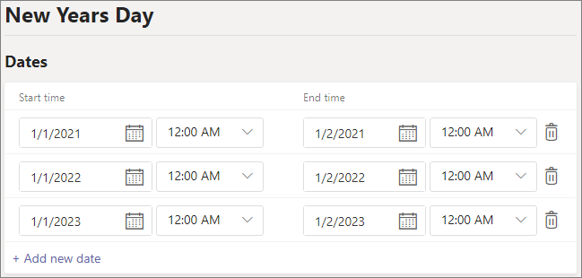

# Configurar feriados no Microsoft Teams

Você pode usar o recurso Teams Feriados do Teams para fornecer mensagens alternativas e roteamento para chamadores para datas e horários específicos quando departamentos, filas de chamadas ou pessoas em sua organização estarão seguindo horários de trabalho diferentes ou não estarão disponíveis. Por exemplo, você pode criar um feriado para o dia de Ano Novo quando sua organização pode estar fechada.

Os feriados que você criar aqui estão disponíveis quando você [configura](create-a-phone-system-auto-attendant.md)um atendimento automático , cada um com suas próprias configurações de roteamento de chamadas e saudações.

## Criar um feriado

Para criar um feriado

1. No centro Microsoft Teams de administração, acesse **Feriados** de configurações em toda a  >  **organização.**

2. Selecione **Novo feriado**.

3. Insira um nome para o feriado.

4. Selecione **Adicionar nova data**.

5. Em **Hora de Início,** selecione o ícone de calendário e escolha a data em que você gostaria que o feriado começasse.

6. Use a lista lista listada para selecionar uma hora de início para o feriado.

7. Em **Hora de Término,** selecione o ícone de calendário e escolha a data em que você gostaria que o feriado terminasse.

8. Use a lista lista listada para selecionar uma hora de término para o feriado. A **hora de término** deve ser após a hora de **início.**  

   > [!NOTE]
   > Se o feriado for para um dia completo (ou seja,  um período de 24 horas), a hora de término deve ser definida para o dia seguinte e a hora como 12:00 AM. Por exemplo, se sua organização for fechada em 1º de  janeiro para o dia de Ano Novo, de  definir a hora de início como 1º de janeiro às 12:00 e definir a hora de término como 2 de janeiro às 12:00 am.

9. Opcionalmente, adicione mais datas para feriados recorrentes.

10. Selecione **Salvar**.

    

## Alterar um feriado

Para alterar um feriado

1. No centro Microsoft Teams de administração, acesse **Feriados** de configurações em toda a  >  **organização.**

2. Selecione o feriado na lista.

3. Em **Hora de Início,** selecione o ícone de calendário e escolha a data em que você gostaria que o feriado começasse.

4. Use a lista lista listada para selecionar uma hora de início para o feriado.

5. Em **Hora de Término,** selecione o ícone de calendário e escolha a data em que você gostaria que o feriado terminasse. 

6. Use a lista lista listada para selecionar uma hora de término para o feriado. A **hora de término** deve ser após a hora de **início.**  

7. Selecione **Salvar**.

## Tópicos relacionados

[Planejar os Teams automáticos e filas de chamada?](plan-auto-attendant-call-queue.md)
