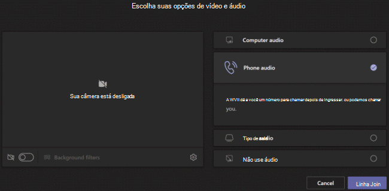

# Configurar o recurso Telefonar para Mim para os usuários

Em Microsoft Teams, o **recurso Chamar-me** oferece aos usuários uma maneira de ingressar na parte de áudio de uma reunião por telefone. Isso pode ser útil em cenários ao usar um computador para áudio. Os usuários obterão a parte de áudio da reunião por meio de seu telefone celular ou linha fixa e a parte de conteúdo da reunião, como quando outro participante da reunião compartilha sua tela ou reproduz um vídeo por meio de seu &mdash; &mdash; computador.

> [!IMPORTANT]
> 
> Em períodos com quantidade elevada de reuniões (que estamos passando durante a epidemia de COVID-19), recomendamos que os usuários ingressem em reuniões clicando no botão <strong>Participar de reunião do Teams</strong> em vez de discarem usando os números de conferência PSTN ou usando o <strong>Ligar para mim em</strong>. Isso ajuda a garantir a qualidade do áudio durante os períodos em que grandes quantidades de reunião estão congestionando a rede PSTN.

> [!NOTE]
> [!INCLUDE [updating-admin-interfaces](includes/updating-admin-interfaces.md)]

## A experiência do usuário

### Participar de uma reunião usando telefone para áudio

Clique **em Participar** para participar de uma reunião, Telefone **áudio** na tela **Escolher** suas opções de vídeo e áudio e clique em **Ingressar agora**. A partir daqui, os usuários podem fazer a chamada de reunião e juná-los ou discar manualmente para a reunião.

**Permitir a chamada Teams reunião**

Na tela **Usar telefone para áudio,** o usuário entra no número de telefone e clica em **Chamar-me**. A reunião chama o usuário e os une à reunião.

**Discar manualmente**

Outra maneira de ingressar é discar diretamente para a reunião. Na tela **Usar telefone para áudio,** clique em **Discar manualmente** para obter uma lista de números de telefone a usar para discar para a reunião.

### Receber uma chamada de volta quando algo der errado com o áudio durante uma reunião

Se um usuário tiver problemas de áudio ao usar o computador durante uma reunião, o usuário poderá facilmente alternar para usar seu telefone para áudio. Teams detecta quando ocorre um problema de áudio ou dispositivo e redireciona o usuário para usar seu telefone exibindo uma opção **Retornar** chamada.

Aqui está um exemplo da mensagem e da opção **Chamar-me** de volta que é exibida quando Teams não detecta um microfone.

O usuário clica em **Chamar-me de volta**, que traz a **tela Usar telefone para** áudio. A partir daqui, eles podem inserir seu número de telefone e fazer a chamada Teams reunião e ingressá-los na reunião ou discar manualmente para a reunião.

## Configurar o recurso Chamar-me

Para habilitar o recurso Chamar-me para usuários em sua organização, o seguinte deve ser configurado:

- A Audioconferência está habilitada para usuários em sua organização que agendam reuniões (organizadores de reuniões). Para saber mais, confira [Configurar Audioconferência](set-up-audio-conferencing-in-teams.md) para Teams e Gerenciar as configurações de [Audioconferência](manage-the-audio-conferencing-settings-for-a-user-in-teams.md)para um usuário em Teams .

- O organizador da reunião pode discar de reuniões. Para saber mais, confira Gerenciar as configurações de [Audioconferência para um usuário em Teams](manage-the-audio-conferencing-settings-for-a-user-in-teams.md).

Se o organizador da reunião não tiver o discagem de reuniões habilitada, **a** opção de áudio Telefone na tela Escolher suas opções de vídeo e áudio não estará disponível para ninguém, e outros usuários não poderão receber uma chamada para participar da reunião.  Para usuários com discagem habilitada, depois de ingressar na reunião, eles podem ingressar em outras pessoas discando seu número no ícone **Mostrar participantes.**
