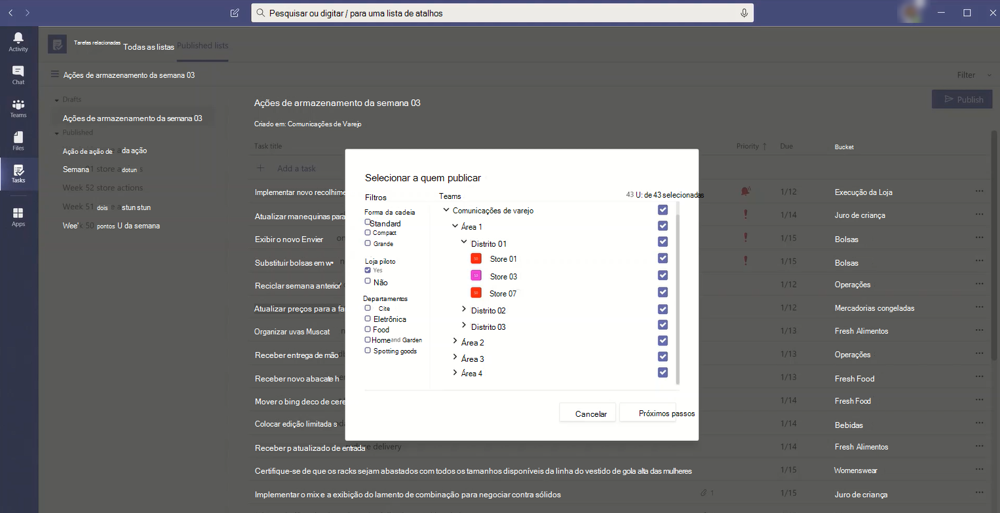

# <a name="set-up-your-team-targeting-hierarchy"></a>Configure a hierarquia de segmentação de sua equipe

Configurar uma hierarquia de direcionamento de equipe permitirá que sua organização publique conteúdo em um grande conjunto de equipes. A hierarquia de direcionamento de equipe define como todas as equipes em sua hierarquia estão relacionadas umas às outras, quais usuários podem publicar tarefas e quais usuários de equipes têm permissões para publicar. Os recursos de publicação estão desabilitados para todos os usuários, a menos que uma hierarquia de direcionamento de equipe esteja configurada para sua organização. Para configurar uma hierarquia de direcionamento de equipe, você precisará criar um arquivo que defina a hierarquia e, em seguida, carregue-a no Teams para aplicá-lo à sua organização. Depois que o esquema é carregado, os aplicativos dentro Teams podem usá-lo.

> [!IMPORTANT]
> Para a versão inicial, apenas o aplicativo Tasks dá suporte a equipes hierárquicas.  Aplicar uma hierarquia de direcionamento de equipe à sua organização [permitirá](https://support.microsoft.com/office/publish-task-lists-to-create-and-track-work-in-your-organization-095409b3-f5af-40aa-9f9e-339b54e705df) a publicação de tarefas no aplicativo Tarefas. Você não verá uma hierarquia de equipes em outras áreas Microsoft Teams.

Veja um exemplo de como a hierarquia é representada no aplicativo Tarefas no Teams. Depois que uma lista de tarefas é criada, os membros da equipe de publicação podem selecionar as equipes de destinatários para enviar (publicar) a lista de tarefas para. Ao selecionar equipes, a equipe de publicação pode filtrar por hierarquia, por atributos ou uma combinação de ambos.<br>



## <a name="terminology"></a>Terminologia

Os termos a seguir serão importantes à medida que você navegar em hierarquias. Teams serão chamados de **nós**.

* **Nós raiz** são os nós mais top da hierarquia. No exemplo, As Comunicações de Varejo é um nó raiz.
* **Nós pai e** **nós filhos são** termos que representam uma relação entre dois nós conectados. No exemplo, o Distrito 01 é um nó filho da Área 1.
* Vários níveis de filhos são chamados de **descendentes.** Os distritos 01, Store 01, Store 03, Store 07, Distrito 02 e Distrito 03 são todos descendentes da Área 1.
* Um nó sem filhos é chamado de nó **folha**. Eles estão na parte inferior de uma hierarquia.
* **As equipes de** destinatários são equipes que foram selecionadas para receber um conjunto específico de conteúdo a ser publicado. Eles devem ser nós folha.

## <a name="plan-your-hierarchy"></a>Planejar sua hierarquia

Antes de criar o esquema que define sua hierarquia, você precisa fazer algum planejamento e decidir como deseja moldar sua organização.  Uma das primeiras prioridades é decidir quais grupos organizacionais precisam publicar tarefas em outros grupos. Cada nó na hierarquia representa um grupo de trabalho ou grupo de grupos.

### <a name="permissions-to-publish"></a>Permissões para publicar

A permissão para publicar depende se um usuário é membro de qualquer equipe na hierarquia mais a relação dessa equipe ou conjunto de equipes com outras equipes na hierarquia.

> [!NOTE]
> O proprietário de uma equipe também recebe permissões de publicação.

* Se um usuário for membro de pelo menos uma equipe que tenha descendentes na hierarquia, esse usuário poderá publicar para esses descendentes sem ser membro de todas as equipes que deseja publicar.
* Se um usuário for membro de pelo menos uma equipe na hierarquia, mas não for membro de qualquer equipe com descendentes na hierarquia, esse usuário poderá ver e receber conteúdo publicado de sua organização.
* Se um usuário não for membro de qualquer equipe na hierarquia, esse usuário não verá nenhuma funcionalidade relacionada à publicação.

### <a name="guidelines"></a>Diretrizes

* Só pode haver um arquivo de hierarquia aplicado por organização. No entanto, você pode incluir diferentes partes da sua organização juntas como hierarquias distintas de nós em um arquivo. Por exemplo, a Contoso Pharmaceuticals tem um nó raiz de Farmácia e um nó raiz retail. Ambos os nós raiz têm várias linhas de descendentes e não há sobreposição entre eles.
* Somente nós folha podem ser destinatários de uma publicação. Outros nós na hierarquia são úteis para selecionar destinatários de uma publicação.
* Uma equipe só pode ser representada uma vez em uma hierarquia.
* Uma hierarquia pode conter até 15.000 nós. Planejamos trabalhar com clientes para elevar esse limite para organizações maiores.

### <a name="example-hierarchy"></a>Hierarquia de exemplos

Por exemplo, na hierarquia a seguir, Recall, Communications e HR podem publicar tarefas em cada nó inferior (equipe) na hierarquia, mas Zona Noroeste só pode publicar tarefas nas equipes da Loja de Nova York e da Loja de Boston. A hierarquia de exemplo permite que os grupos Recall, Communications e RH publiquem tarefas que se aplicam a toda a empresa, como informações de benefícios ou mensagens do CEO. A Zona Noroeste pode publicar tarefas como agendamento de funcionários, informações sobre o clima e assim por diante, somente para as equipes da Loja de Nova York e da Loja de Boston.


## <a name="create-your-hierarchy"></a>Criar sua hierarquia

> [!NOTE]
> O restante deste artigo aborda a configuração de uma hierarquia de equipe no contexto de tarefas de publicação para equipes de destinatários. Consulte [Manage the Tasks app for your](./manage-tasks-app.md) organization in Teams for an overview of the Tasks app, where task publishing appears when enabled.

O esquema que define sua hierarquia é baseado em um arquivo CSV (valores separados por vírgula). O arquivo deve estar no formato UTF-8. Cada linha no arquivo CSV corresponde a um nó dentro da hierarquia de equipes. Cada linha contém informações que nomeia o nó dentro da hierarquia, opcionalmente o vincula a uma equipe e inclui atributos que podem ser usados para filtrar equipes em aplicativos que o suportam.

Você também pode definir buckets , que são categorias que a equipe de publicação pode usar para organizar o conteúdo enviado às **equipes** de destinatários para facilitar a exibição, classificação e foco em conteúdo relevante.

### <a name="add-required-columns"></a>Adicionar colunas necessárias

O arquivo CSV deve conter as três colunas a seguir, na ordem a seguir, começando na primeira coluna. Um nó deve ser vinculado a uma equipe para que ele receba tarefas.

| Nome da coluna   | Obrigatório | Descrição   |
----------------|----------|---------------|
| DisplayName    | Sim      | Este campo é o nome do nó. O nome pode ter até 100 caracteres e conter apenas os caracteres A-Z, a-z e 0-9. Os nomes de nós devem ser exclusivos. |
| ParentName    | Sim       | Esse é o nome do nó pai. O valor especificado aqui deve corresponder exatamente ao valor no **campo DisplayName** do nó pai. Se você quiser adicionar mais de um nó pai, separe cada nome de nó pai com um ponto e vírgula (;). Você pode adicionar até 25 nós pai e cada nome de nó pai pode ter até 2500 caracteres. Um nó só poderá ter vários nós pai se os nós pai são nós raiz.   <br><br>**IMPORTANTE** Tenha cuidado para não criar um loop em que um pai mais alto na hierarquia faz referência a um nó filho inferior na hierarquia. Isso não é suportado. |
| TeamId        | Sim, se a equipe publicar tarefas ou receber tarefas de um nó pai       | Isso contém a ID da equipe à que você deseja vincular um nó. Cada nó deve se referir a uma equipe exclusiva, portanto, cada valor TeamId pode aparecer apenas uma vez no arquivo de hierarquia. Para obter a ID de uma equipe à que você deseja vincular um nó, execute o seguinte comando do PowerShell: `Get-Team | Export-Csv TeamList.csv` . Este comando lista as equipes em sua organização e inclui o nome e a ID de cada equipe. Encontre o nome da equipe que você deseja vincular e copie a ID para este campo.|

> [!NOTE]
> Se um nó não for um nó raiz ou um nó folha e você não precisar da associação de equipe para conceder as permissões correspondentes para publicação e relatório, você poderá deixar o TeamId em branco. Esse método pode ser usado para adicionar mais granularidade ao escolher equipes de destinatários ou para exibir relatórios de conclusão sem ter uma equipe correspondente.

### <a name="add-attribute-columns"></a>Adicionar colunas de atributo

Depois de adicionar as três colunas necessárias, você pode adicionar colunas de atributo opcionais. Esses atributos podem ser usados para filtrar nós para que você possa selecionar mais facilmente os que deseja publicar tarefas. Há duas maneiras de definir seus atributos, dependendo se os valores desse atributo são mutuamente exclusivos.

|Maneiras de adicionar atributos|Descrição |Exemplo  |
|---|---------|---------|
|Se os valores de um atributo são mutuamente exclusivos, o nome da coluna que você especificar se tornará o nome do atributo.|Cada linha pode conter um valor para esse atributo, e cada coluna de atributo pode ter até 50 valores exclusivos. Cada valor pode ter até 100 caracteres. O conjunto de valores de atributo que você especificar na coluna de atributos será exibido como valores de filtro para esse atributo ao selecionar equipes de destinatário usando a hierarquia de direcionamento de equipe.|Você deseja que os usuários sejam capazes de filtrar os armazenamentos por layout. Os valores para esse atributo são mutuamente exclusivos porque um armazenamento pode ter apenas um layout. <br><br>Para adicionar um atributo aos armazenamentos de filtro por layout, adicione uma coluna chamada Layout da Loja. Neste exemplo, os valores para o atributo de layout da Loja são Compact, Standard e Large.
|Se você precisar indicar vários valores para um atributo e os valores não são mutuamente exclusivos, use o **formato AttributeName:UniqueValue** para os nomes de coluna. <br><br>**IMPORTANTE** Certifique-se de usar os dois-pontos somente em inglês (:) como unicode não é suportado como um delimiter de coluna de atributo. |A cadeia de caracteres de texto antes dos dois pontos (:) se torna o nome do atributo. Todas as colunas que contêm a mesma cadeia de caracteres de texto antes dos dois pontos (:) são agrupados em uma seção no menu de filtragem. Cada uma das cadeias de caracteres após os dois pontos se tornam os valores dessa seção.<br><br>Cada linha pode ter um valor 0 (zero) ou 1 para esse atributo. Um valor 0 significa que o atributo não se aplica ao nó e um valor de 1 significa que o atributo se aplica a esse nó.|Você deseja que os usuários sejam capazes de filtrar os armazenamentos por departamento. Um armazenamento pode ter vários departamentos e, portanto, os valores para esse atributo não são mutuamente exclusivos.<br><br>Neste exemplo, adicionamos Departamentos:Roupa, Departamentos:Eletrônicos, Departamentos:Alimentos, Departamentos:Home e Jardim, Departamentos:Artigos de esporte como colunas de atributo. Os departamentos se tornam o nome do atributo e os usuários podem filtrar pelos departamentos de Artigos de Moda, Eletrônicos, Alimentos, Home e Jardim e Artigos Desportivos.|

Ao adicionar uma coluna de atributo, lembre-se do seguinte:

* O nome da coluna que você especificar ou o nome da coluna que você especificar antes dos dois pontos (:) se torna o nome do atributo. Esse valor será exibido nos aplicativos Teams que usam a hierarquia.
* Você pode ter até 50 colunas de atributo em sua hierarquia.
* O nome da coluna pode ter até 100 caracteres e conter apenas os caracteres A-Z, a-z e 0-9 e espaços. Os nomes de coluna devem ser exclusivos.

### <a name="add-bucket-columns"></a>Adicionar colunas de bucket

Você pode adicionar colunas de bucket para criar buckets, que são agrupações em quais tarefas podem ser organizadas. Cada bucket obtém sua própria coluna no arquivo CSV. Os buckets que você cria são disponibilizados para a equipe de publicação. Em seguida, a equipe de publicação pode usar esses buckets para categorizar tarefas para as equipes de destinatários. Se um bucket ainda não existir em uma equipe, os buckets serão criados sob demanda quando as tarefas são publicadas.

Categorizando os itens de trabalho uma vez centralmente, a equipe de publicação pode organizar previamente a lista de tarefas para todas as dezenas, centenas ou milhares de equipes de destinatários que recebem a lista de tarefas. Em seguida, as equipes de destinatários podem classificar e filtrar suas tarefas por bucket para se concentrar na área mais relevante para seu trabalho.

Ao adicionar uma coluna de bucket, observe o seguinte:

* O nome da coluna se torna o nome do bucket. Cada bucket especificado aparecerá na lista Buckets no Teams aplicativos que usam a hierarquia.
* Recomendamos que você não inclua informações confidenciais em nomes de bucket. No momento, as equipes de publicação não podem remover um bucket por meio da publicação após a criação.
* O nome da coluna deve ser precedido por uma hashtag (#). Pode ter até 100 caracteres e conter apenas os caracteres A-Z, a-z e 0-9. Por exemplo, #Operations e #Frozen Goods.
* Uma hierarquia pode conter até 25 colunas de bucket. Planejamos trabalhar com clientes para aumentar esse limite para organizações maiores.

### <a name="example"></a>Exemplo

Aqui está um exemplo de um arquivo CSV de esquema que seria criado para dar suporte à hierarquia mostrada na imagem anterior. Este esquema contém o seguinte:

* Três colunas necessárias chamadas `TargetName` , `ParentName` e `TeamId`
* Três colunas de atributo chamadas `Store layout` `Departments:Clothing` , e `Departments:Foods`
* Três colunas de bucket chamadas `Fresh Foods` `Frozen Foods` , e `Women's Wear`

O `Store layout` atributo tem valores que `Compact` incluem , e `Standard` `Large` . As `Departments` colunas de atributo podem ser definidas como um valor `0` de (zero) ou `1` . O `Store` layout e os atributos não são `Departments` mostrados na imagem acima. Eles são adicionados aqui para ajudar a mostrar como atributos podem ser adicionados às entradas do nó. O mesmo é verdadeiro para as três colunas de bucket.

```CSV
TargetName,ParentName,TeamId,Store layout,Departments:Clothing,Departments:Foods,#Fresh Foods,#Frozen Foods,#Women's Wear
Recall,,db23e6ba-04a6-412a-95e8-49e5b01943ba,,,,,,
Communications,,145399ce-a761-4843-a110-3077249037fc,,,,,,
HR,,125399ce-a761-4983-a125-3abc249037fc,,,,,,
East Regional Office,HR;Communications;Recall,,,,,,,
West Regional Office,HR;Communications;Recall,,,,,,,
Northeast Zone,East Regional Office,,,,,,,
Southeast Zone,East Regional Office,,,,,,,
New York Store,Northeast Zone,e2ba65f6-25e7-488b-b8f0-b8562d5de60a,Large,1,1,,,
Boston Store,Northeast Zone,0454f08a-0507-437c-969a-682eb2fae7fc,Standard,1,1,,,
Miami Store,Southeast Zone,619d6e4e-5f68-4b36-8e1f-16c98d7396c1,Compact,0,1,,,
New Orleans Store,Southeast Zone,6be960b8-72af-4561-a343-9ac4711874eb,Compact,0,1,,,
Seattle Store,West Regional Zone,487c0d20-4e55-4dc2-8187-a24c826e0fee,Standard,1,1,,,
Los Angeles Store,West Regional Zone,204a1287-2efb-4a8a-88e0-56fbaf5a2389,Large,1,1,,,
```

## <a name="apply-your-hierarchy"></a>Aplicar sua hierarquia

> [!NOTE] 
> Para executar esta etapa, você deve instalar e usar o módulo de visualização pública Teams PowerShell da Galeria do PowerShell. Para ver as etapas sobre como instalar o módulo, consulte Install Teams PowerShell.

> [!NOTE]
> Nuvem da Comunidade Governamental (GCC) os clientes devem usar [o cmdlet preview versão 2.4.0-preview](https://www.powershellgallery.com/packages/MicrosoftTeams/2.4.0-preview) ou posterior para garantir que os dados são roteados para o ambiente GCC, em vez do ambiente de nuvem pública.

Depois de definir sua hierarquia no arquivo CSV do esquema, você estará pronto para carregar no Teams. Para fazer isso, execute o seguinte comando. Você deve ser um administrador global ou Teams de serviço para fazer esta etapa.

```powershell
Set-TeamTargetingHierarchy -FilePath "C:\ContosoTeamSchema.csv"
```

### <a name="update-your-hierarchy"></a>Atualizar sua hierarquia

Você pode carregar uma nova hierarquia para substituir a antiga usando o mesmo comando do PowerShell acima. Sempre que você carrega uma nova hierarquia, ela substitui a hierarquia anterior.

### <a name="check-the-status-of-your-hierarchy"></a>Verifique o status de sua hierarquia

Você pode executar o seguinte comando para verificar o status do carregamento da hierarquia.

```powershell
Get-TeamTargetingHierarchyStatus
```

O comando retornará os seguintes campos:

Campo|Descrição
-----|------------
Id | A ID exclusiva para o carregamento.
Status | Upload status. Os valores **incluem Iniciar,** **Validar,** **Bem-sucedido** e **Falha**
ErrorDetails | Detalhes se houver um erro de carregamento. Para obter mais informações sobre os detalhes do erro, consulte a seção Solução de problemas. Se não houver nenhum erro, este campo será em branco.
LastUpdatedAt | Data e hora de quando o arquivo foi atualizado pela última vez.
LastModifiedBy | A ID do último usuário que modificou o arquivo.
FileName | O nome do arquivo do CSV.

## <a name="remove-your-hierarchy"></a>Remover sua hierarquia

Se você quiser desabilitar imediatamente a **guia Listas publicadas** para todos os usuários em sua organização, remova sua hierarquia. Os usuários não terão acesso à guia **Listas publicadas** ou a qualquer uma das funcionalidades na guia.  Isso inclui a capacidade de criar novas listas de tarefas para publicar, acessar listas de rascunhos, publicar, publicar e duplicar listas e exibir relatórios. Remover a hierarquia não publica tarefas publicadas anteriormente. Essas tarefas permanecerão disponíveis para que as equipes de destinatários sejam concluídas.

Para remover sua hierarquia, execute o seguinte comando. Você deve ser um administrador para executar esta etapa.

```powershell
Remove-TeamTargetingHierarchy
```

Ao confirmar a exclusão, a mensagem de status ainda exibirá o esquema anterior, embora a tentativa de excluir novamente retorne um erro de que o objeto é nulo.

## <a name="create-a-sample-hierarchy"></a>Criar uma hierarquia de exemplo

### <a name="install-the-teams-powershell-module"></a>Instalar o módulo Teams PowerShell

> [!IMPORTANT]
> Para executar esta etapa, você deve instalar e usar o módulo de visualização pública Teams PowerShell da [Galeria do PowerShell.](https://www.powershellgallery.com/packages/MicrosoftTeams/) Para ver as etapas sobre como instalar o módulo, consulte [Install Teams PowerShell](teams-powershell-install.md).

### <a name="sample-script"></a>Script de exemplo

O script a seguir pode ser usado para criar as equipes e carregar um arquivo .csv para seu Microsoft Teams locatário. Se você tiver uma hierarquia existente, esse script a substituirá.

#### <a name="create-teams-for-a-simple-hierarchy"></a>Criar equipes para uma hierarquia simples

```powershell
$tm1 = New-Team -DisplayName "HQ"
$tm2 = New-Team -DisplayName "North"
$tm3 = New-Team -DisplayName "Store 1"
$tm4 = New-Team -DisplayName "Store 2"
$tm5 = New-Team -DisplayName "South"
$tm6 = New-Team -DisplayName "Store 3"
$tm7 = New-Team -DisplayName "Store 4"
```

#### <a name="use-team-data-to-create-comma-separated-output-displayname-parentname-teamid"></a>Usar dados de equipe para criar saída separada por vírgulas (DisplayName, ParentName, TeamId)

```powershell
$csvOutput = "DisplayName" + "," + "ParentName" + "," + "TeamId" + "`n"
$csvOutput = $csvOutput + $tm1.DisplayName + "," + "," + $tm1.GroupID + "`n"
$csvOutput = $csvOutput + $tm2.DisplayName + "," + $tm1.DisplayName + "," + $tm2.GroupID + "`n"
$csvOutput = $csvOutput + $tm3.DisplayName + "," + $tm2.DisplayName + "," + $tm3.GroupID + "`n"
$csvOutput = $csvOutput + $tm4.DisplayName + "," + $tm2.DisplayName + "," + $tm4.GroupID + "`n"
$csvOutput = $csvOutput + $tm5.DisplayName + "," + $tm1.DisplayName + "," + $tm5.GroupID + "`n"
$csvOutput = $csvOutput + $tm6.DisplayName + "," + $tm5.DisplayName + "," + $tm6.GroupID + "`n"
$csvOutput = $csvOutput + $tm7.DisplayName + "," + $tm5.DisplayName + "," + $tm7.GroupID 
```

#### <a name="save-output-to-a-csv-file-in-the-downloads-folder"></a>Salvar saída em um arquivo .csv na **pasta Downloads**

```powershell
$csvOutputPath = $env:USERPROFILE + "\downloads\testhierarchy-" + (Get-Date -Format "yyyy-MM-dd-hhmmss") + ".csv" 
$csvOutput | Out-File $csvOutputPath
```

#### <a name="upload-the-hierarchy"></a>Upload hierarquia

```powershell
Set-TeamTargetingHierarchy -FilePath $csvOutputPath
Get-TeamTargetingHierarchyStatus
```

## <a name="troubleshooting"></a>Solução de problemas

### <a name="how-to-view-error-details"></a>Como exibir detalhes de erro

Você pode executar o seguinte comando para entender o que está causando um erro e retornar os detalhes do erro.

```powershell
(Get-TeamTargetingHierarchyStatus).ErrorDetails.ErrorMessage
```

### <a name="you-receive-an-error-message-when-you-upload-your-schema-csv-file"></a>Você recebe uma mensagem de erro ao carregar seu arquivo CSV de esquema

Anote a mensagem de erro, pois ela deve incluir informações de solução de problemas para indicar por que o esquema não pôde ser carregado. Revise e edite seu arquivo CSV de esquema com base nas informações na mensagem de erro e tente novamente.

### <a name="you-receive-an-error-invalidteamid-error-message-when-you-upload-your-schema-csv-file"></a>Você recebe uma mensagem de erro "Erro: InvalidTeamId" ao carregar seu arquivo CSV de esquema

Ao tentar carregar seu arquivo CSV de esquema, você recebe a seguinte mensagem de erro:

```console
Error: InvalidTeamId
Description: TeamID in row # doesn't match a valid Group ID. Please view our documentation to learn how to get the proper GroupID for each team.
```

Verifique se você está usando o TeamId correto para a equipe em seu arquivo CSV de esquema. A TeamId deve ser a mesma que a ID de Grupo do grupo Microsoft 365 que resvala a equipe. Você pode procurar a ID de Grupo da equipe no Microsoft Teams de administração.

1. Na navegação à esquerda do centro de administração [Microsoft Teams,](https://admin.teams.microsoft.com/)vá **para Teams**  >  **Gerenciar equipes**.
2. Se a **coluna ID do** Grupo não for exibida na tabela, selecione **Editar colunas** no canto superior direito da tabela e, em seguida, acione a **ID do Grupo**.
3. Localize a equipe na lista e localize a ID do Grupo.

Certifique-se de que o TeamId no arquivo CSV do esquema corresponde à ID do Grupo exibida no centro de administração Microsoft Teams de grupo.

## <a name="related-topics"></a>Tópicos relacionados

* [Gerenciar o aplicativo Tarefas para sua organização em Teams](manage-tasks-app.md)
* [Visão Geral do PowerShell do Teams](teams-powershell-overview.md)
