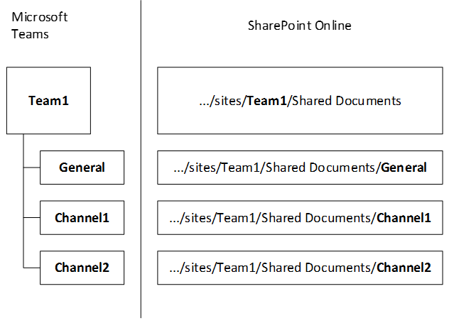

# Como SharePoint e OneDrive interagir com Microsoft Teams

> [!Tip]
> Assista à sessão a seguir para saber como o Teams interage com Azure Active Directory (AAD), grupos Microsoft 365, Exchange, SharePoint e OneDrive: [fundamentos do Microsoft Teams](https://aka.ms/teams-foundations)

Cada equipe no Microsoft Teams tem um site de equipe no SharePoint, e cada canal padrão em uma equipe obtém uma pasta dentro da biblioteca de documentos de site de equipe padrão. Cada [canal privado](private-channels.md) obtém seu próprio site SharePoint site. Para saber mais sobre esses sites de equipe e sites de canal, consulte Gerenciar Teams [sites conectados e sites de canal.](/sharepoint/teams-connected-sites)

Os arquivos compartilhados em uma conversa são adicionados automaticamente à biblioteca de documentos e as permissões e as opções de segurança do arquivo definidas no SharePoint são refletidas automaticamente dentro do Teams. Para ver o impacto da alteração de um endereço de site em SharePoint, leia [Alterar um endereço de site](/sharepoint/change-site-address).

Os arquivos de chat privados são armazenados na pasta de OneDrive do remetente e as permissões são concedidas automaticamente a todos os participantes como parte do processo de compartilhamento de arquivos.

Se os usuários não são atribuídos SharePoint licenças, eles não têm OneDrive armazenamento no Microsoft 365. O compartilhamento de arquivos funciona em canais padrão, mas os usuários não poderão compartilhar arquivos em chats sem OneDrive armazenamento no Microsoft 365.

Ao armazenar os arquivos na biblioteca SharePoint de documentos e OneDrive, todas as regras de conformidade configuradas no nível da organização serão seguidas. 

> [!NOTE]
> A integração com SharePoint Server não tem suporte para Teams.

A seguir está o exemplo de relações entre equipe, canal padrão e biblioteca de documentos.

É criado um site SharePoint para cada equipe e a pasta **Documentos compartilhados** é a pasta padrão criada para cada uma das equipes. Cada canal padrão, incluindo **o canal Geral** (o canal padrão para cada equipe) tem uma pasta em Documentos **Compartilhados**.

O padrão SharePoint site e biblioteca de documentos não podem ser substituídos por outro.

Para cada usuário, a pasta **Arquivos de bate-papo do Microsoft Teams** do OneDrive é utilizada para armazenar todos os arquivos compartilhados em bate-papos privados com outros usuários (1:1 ou 1:muitos), com as permissões configuradas automaticamente para restringir o acesso somente para o usuário pretendido.

Observe que, para equipes públicas, o site SharePoint equipe é provisionado com acesso "Todos, exceto usuários externos". A equipe pública não é exibida no Teams para pessoas que não são membros dessa equipe. No entanto, eles podem acessar o conteúdo no site SharePoint equipe usando a URL do site SharePoint equipe. 

## Guia Arquivos de Canal

A **guia Arquivos** no Teams se parece muito com o SharePoint de documentos. Na guia **Arquivos,** os usuários podem:

- Consulte opções adicionais no menu **Novo** arquivo.
- Sincronizar arquivos com a unidade local.
- No menu **Todos os Documentos,** alternar do **exibição Lista** para a lista **Compacta** para **o exibição Blocos.**
- Identifique arquivos que precisam de atenção ou que tenham malware.
- Consulte imediatamente se um arquivo é somente leitura ou check-out.
- Fazer check-out e fazer check-in de arquivos.
- Fixar, desempinar e alterar a ordem de classificação de arquivos.
- Identificar quais arquivos precisam de metadados
- Escolha entre muitas outras opções de filtro.
- Arquivos de grupo com base em títulos de coluna.
- Modificar configurações de coluna (mover para a esquerda ou para a direita, ocultar) e largura da coluna.

## Configuração de tipo de link padrão

O tipo de link de compartilhamento mostrado por padrão quando um usuário compartilhou um arquivo é definido no SharePoint de administração. Consulte [Alterar o tipo de link padrão quando os usuários receberem links para compartilhamento](/sharepoint/change-default-sharing-link) para obter informações.

## Tópicos relacionados

[Gerenciar Teams sites conectados e sites de canal](/SharePoint/teams-connected-sites)

[SharePoint e Teams: melhor juntos.](https://techcommunity.microsoft.com/t5/Microsoft-SharePoint-Blog/SharePoint-and-Teams-Better-Together/ba-p/189593)

[Como é a experiência do convidado](guest-experience.md)
