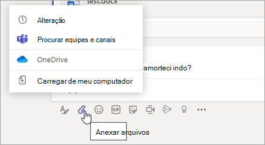
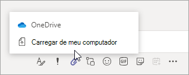
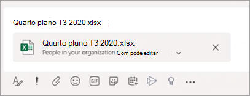
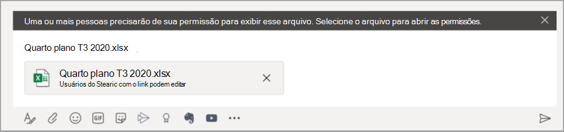

# Compartilhando arquivos no Microsoft Teams

No Microsoft Teams os usuários podem compartilhar conteúdo com outros usuários do Microsoft Teams dentro e fora de sua organização. O compartilhamento no Microsoft Teams é baseado nas definições configuradas no Microsoft Office SharePoint Online e no OneDrive e o que você configurar para o Microsoft Office SharePoint Online e o OneDrive também controlará o compartilhamento no Microsoft Teams.

## Visão Geral

Os usuários podem compartilhar arquivos do OneDrive, de equipes e de sites que tenham acesso para e a partir do computador.  Para compartilhar um arquivo, os usuários podem fazer o seguinte:

- Em um canal, clicar em **Anexar** (o ícone de clipe de papel), selecione **Recente**, **Navegar Microsoft Teams e Canais**, **OneDrive** ou **Carregar do meu computador** e, em seguida, escolher o arquivo que desejam compartilhar.   
    
- Em um chat, clicar em **Anexar** (o ícone de clipe de papel), selecionar **OneDrive** ou **Carregar do meu computador** e, em seguida, escolher o arquivo que desejam compartilhar.  
    
- Copiar e colar o link de compartilhamento na caixa de composição. 
    

### O que você precisa saber sobre a experiência de compartilhamento de arquivo

### Permissões de arquivos compartilhados e links de compartilhamento

Quando os usuários compartilham um arquivo navegando até ele no OneDrive ou equipes e canais, todos os recipientes recebem acesso com a [permissão padrão definida no nível da organização](https://docs.microsoft.com/sharepoint/change-default-sharing-link).

Quando um usuário copia e cola um link de compartilhamento, as permissões definidas naquele link de compartilhamento são honradas e a URL do Microsoft Office SharePoint Online é abreviada para o nome do arquivo. Em outras palavras, o Microsoft Teams sua apenas o nome do arquivo para fazer um link para um arquivo.

Quando os usuários compartilham um arquivo dentro do Microsoft Teams, eles podem definir quem pode acessar o arquivo, da mesma forma como fazem em todo o Microsoft 365. Eles podem dar acesso a qualquer um, pessoas em sua organização, pessoas com acesso existente ou pessoas específicas (que podem incluir as pessoas em um chat 1:1, chat em grupo ou canal).  Quando um arquivo é compartilhado, a visualização do arquivo está disponível na mensagem, junto com todas as ações do arquivo como **Abrir online**, **Baixar** e **Copiar link**. Por padrão, o arquivo abre no Microsoft Teams. Às vezes, o link de compartilhamento pode não ter sido convertido em uma visualização de arquivo até o momento de um usuário enviar a mensagem. A visualização do arquivo será gerada pelo sistema, mas nesse cenário o link de compartilhamento não será abreviado para o único nome do arquivo.

Quando os usuários compartilham um arquivo em um chat ou canal, eles são notificados se alguns ou todos os recipientes não têm permissão para visualizar o arquivo. Eles podem alterar as permissões no arquivo antes de compartilhar clicando na seta ao lado da visualização do arquivo que agora aparece na mensagem.

### Copiar um link de compartilhamento no Microsoft Teams

Os usuários podem copiar um link de compartilhamento do Microsoft Office SharePoint Online e alterar as permissões de compartilhamento da mesma forma como fazem em todo o Microsoft 365. Eles podem dar acesso a qualquer um, pessoas em sua organização, pessoas com acesso existente ou pessoas específicas. A permissão padrão dos links é a mesma permissão padrão definida no nível da organização, a menos que as permissões no nível do site do Microsoft Office SharePoint Online a substituam.

## Configurar o compartilhamento no OneDrive e no Microsoft Office SharePoint Online

Para mais informações sobre compartilhamento de arquivos no OneDrive e no Microsoft Office SharePoint Online, incluindo como configurar compartilhamento e como ativar e desativar o compartilhamento, confira:

- [Visão geral de compartilhamento externo](https://docs.microsoft.com/sharepoint/external-sharing-overview) - descreve o que acontece quando os usuários compartilham, dependendo do que estão compartilhando e com quem.

- [Gerenciar configurações de compartilhamento](https://docs.microsoft.com/sharepoint/turn-external-sharing-on-or-off) - descreve como administradores globais e do Microsoft Office SharePoint Online podem alterar as configurações de compartilhamento do nível de organização para o Microsoft Office SharePoint Online e o OneDrive.

- [Ativar ou desativar o compartilhamento externo para um site](https://docs.microsoft.com/sharepoint/change-external-sharing-site) - descreve como administradores globais e do Microsoft Office SharePoint Online podem ativar ou desativar o compartilhamento externo para um site.

- [Alterar o tipo de vínculo padrão para um site](https://docs.microsoft.com/sharepoint/change-default-sharing-link) - descreve como definir um tipo de vínculo padrão para que seja mais restritivo.

## Mais informações

- [Como o Microsoft Office SharePoint Online e o OneDrive for Business interagem com o Microsoft Teams](sharepoint-onedrive-interact.md)

- [Microsoft Office SharePoint Online e Microsoft Teams: melhores juntos](https://techcommunity.microsoft.com/t5/Microsoft-SharePoint-Blog/SharePoint-and-Teams-Better-Together/ba-p/189593)

- [Compartilhar pastas e arquivos do OneDrive](https://support.office.com/article/Share-OneDrive-files-and-folders-9fcc2f7d-de0c-4cec-93b0-a82024800c07#OS_Type=OneDrive_-_Business)

- [Compartilhar arquivos ou pastas do Microsoft Office SharePoint Online](https://support.office.com/article/share-sharepoint-files-or-folders-1fe37332-0f9a-4719-970e-d2578da4941c)
