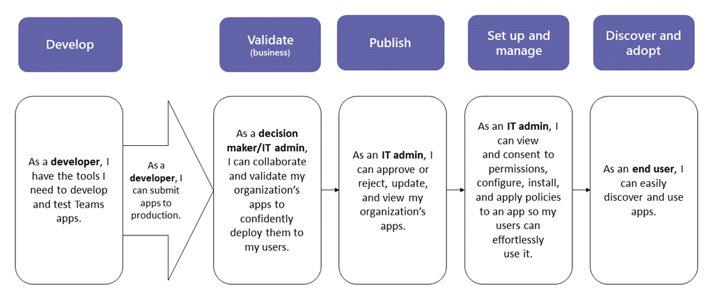

# Publicar um aplicativo personalizado enviado por meio da API Teams envio de aplicativos

## Visão Geral

> [!NOTE]
> Quando você publica um aplicativo Teams personalizado, ele está disponível para usuários na loja de aplicativos da sua organização. Há duas maneiras de publicar um aplicativo personalizado e a maneira como você usa depende de como você obter o aplicativo. **Este artigo se concentra em como aprovar** e publicar um aplicativo personalizado que um desenvolvedor envia por meio da API Teams envio de aplicativos. O outro método, carregando um aplicativo personalizado, é usado quando um desenvolvedor envia um pacote de aplicativos .zip formato. Para saber mais sobre esse método, consulte <a href="/microsoftteams/upload-custom-apps" target="_blank">Publicar um aplicativo personalizado carregando um pacote de aplicativos</a>. O widget aprovar aplicativo não está disponível em GCC locatários. 

> [!IMPORTANT]
> Este método não está disponível atualmente para ambientes GCC ambientes. Você deve usar o *método de carregamento de um aplicativo* personalizado.

Este artigo fornece orientações de ponta a ponta sobre como levar seu aplicativo Teams do desenvolvimento para a implantação até a descoberta. Você obterá uma visão geral das experiências conectadas que o Teams fornece em todo o ciclo de vida do aplicativo para simplificar como desenvolver, implantar e gerenciar aplicativos personalizados na loja de aplicativos da sua organização.

Vamos abranger cada etapa do ciclo de vida, incluindo como os desenvolvedores podem usar Teams API de Envio de Aplicativos do Teams para enviar aplicativos personalizados diretamente ao centro de administração do Microsoft Teams para que você revise e aprove, como definir políticas para gerenciar aplicativos para usuários em sua organização e como seus usuários os descobrirão no Teams.

Essa orientação se concentra nos aspectos Teams do aplicativo e destina-se a administradores e profissionais de IT. Para obter informações sobre o desenvolvimento Teams aplicativos, consulte a <a href="/microsoftteams/platform" target="_blank">documentação Teams desenvolvedor.</a>

## Desenvolver

### Criar o aplicativo

A Microsoft Teams de desenvolvedores facilita que os desenvolvedores integrem seus próprios aplicativos e serviços para melhorar a produtividade, tomar decisões mais rapidamente e criar colaboração em torno de conteúdo e fluxos de trabalho existentes. Os aplicativos construídos na plataforma Teams são pontes entre o cliente Teams e seus serviços e fluxos de trabalho, trazendo-os diretamente para o contexto da sua plataforma de colaboração. Para obter mais informações, acesse a documentação <a href="/microsoftteams/platform" target="_blank">Teams desenvolvedor.</a>

### Enviar o aplicativo

Quando o aplicativo estiver pronto para uso em produção, o desenvolvedor poderá enviar o aplicativo usando Teams API de Envio de Aplicativos, que pode ser chamada a partir da [API Graph](/graph/api/teamsapp-publish), um ambiente de desenvolvimento integrado (IDE), como o Visual Studio Code, ou uma plataforma como Power Apps e Power Virtual Agents. Isso disponibiliza o aplicativo na  página Gerenciar aplicativos do centro de administração Microsoft Teams, onde você, o administrador, pode revisá-lo e aprove.this

A API de Envio de Aplicativo Teams, criada no <a href="/graph/api/teamsapp-publish" target="_blank">Microsoft Graph</a>, permite que sua organização se desenvolva na plataforma de sua escolha e automatiza o processo de envio para aprovação para aplicativos personalizados no Teams.

Aqui está um exemplo de como essa etapa de envio de aplicativo se parece Visual Studio Code:

Lembre-se de que isso ainda não publica o aplicativo na loja de aplicativos da sua organização. Esta etapa envia o aplicativo para o centro de administração Microsoft Teams local onde você pode aprove-lo para publicação na loja de aplicativos da sua organização.

Para obter mais informações sobre como usar a API Graph para enviar aplicativos, <a href="/graph/api/teamsapp-publish" target="_blank">consulte aqui</a>.

## Validar

A <a href="/microsoftteams/manage-apps" target="_blank">página Gerenciar aplicativos</a> no centro de administração do Microsoft Teams (na navegação à esquerda, vá para Teams **aplicativos** Gerenciar aplicativos ), fornece uma exibição em todos os Teams aplicativos para sua  >  organização. O **widget de aprovação** pendente na parte superior da página permite que você saiba quando um aplicativo personalizado é enviado para aprovação.

Na tabela, um aplicativo recém-enviado mostra automaticamente um **status de** publicação de **Submitted** e **Status** de **Bloqueado**. Você pode classificar a **coluna de status de** publicação em ordem decrescente para encontrar rapidamente o aplicativo.

Clique no nome do aplicativo para ir até a página de detalhes do aplicativo. Na guia **Sobre,** você pode exibir detalhes sobre o aplicativo, incluindo descrição, status, envio e ID do aplicativo.

Para obter mais informações sobre como usar a API Graph para verificar o **status de** publicação, consulte <a href="/graph/api/appcatalogs-list-teamsapps" target="_blank">aqui</a>.

## Publicar

Quando você estiver pronto para disponibilizar o aplicativo aos usuários, publique o aplicativo.

1. Na navegação à esquerda do Centro de Administração do Microsoft Teams, vá para **Aplicativos do Teams** > **Gerenciar aplicativos**.
2. Clique no nome do aplicativo para ir para a página de detalhes do aplicativo e, na caixa **Status** de Publicação, selecione **Publicar**.

    

Depois de publicar o aplicativo, o **status de** publicação muda para **Publicado** e **o Status** muda automaticamente para **Permitido**.

## Configurar e gerenciar

### Controlar o acesso ao aplicativo

Por padrão, todos os usuários em sua organização podem acessar o aplicativo na loja de aplicativos da sua organização. Para restringir e controlar quem tem permissão para usar o aplicativo, você pode criar e atribuir uma política de permissão de aplicativo. Para saber mais, confira <a href="/microsoftteams/teams-app-permission-policies" target="_blank">Gerenciar políticas de permissão de aplicativos no Teams</a>.

### Fixar e instalar o aplicativo para que os usuários descubram

Por padrão, para os usuários encontrarem o aplicativo, eles precisam ir até a loja de aplicativos da sua organização e procurar ou pesquisar por ele. Para facilitar o acesso dos usuários ao aplicativo, você pode fixar o aplicativo na barra de aplicativos Teams. Para fazer isso, crie uma política de configuração de aplicativo e atribua-a aos usuários. Para saber mais, confira <a href="/microsoftteams/teams-app-setup-policies" target="_blank">Gerenciar políticas de configuração de aplicativos no Teams</a>.

### Pesquisar o log de auditoria para Teams eventos do aplicativo

Você pode pesquisar o log de auditoria para exibir Teams de aplicativos em sua organização. Para saber mais sobre como pesquisar o log de auditoria e ver uma lista de atividades Teams que estão registradas no log de auditoria, consulte Pesquisar o log de auditoria em busca de eventos em <a href="/microsoftteams/audit-log-events" target="_blank">Teams</a>.

Para examinar o log de auditoria, você precisa ativar a auditoria no <a href="https://protection.office.com" target="_blank">Centro de Conformidade e Segurança</a>. Para obter instruções, confira <a href="https://support.office.com/article/Turn-Office-365-audit-log-search-on-or-off-e893b19a-660c-41f2-9074-d3631c95a014" target="_blank">Ativar ou desativar a pesquisa de log de auditoria</a>. Tenha em mente que os dados de auditoria só estão disponíveis a partir do ponto em que você ativou a auditoria.

## Descobrir e adotar

Os usuários que têm permissões para o aplicativo podem encontrá-lo na loja de aplicativos da sua organização. Vá para **Built for Your Organization *Name*** na página Aplicativos para encontrar os aplicativos personalizados da sua organização.

Se você criou e atribuiu uma política de configuração de aplicativo, o aplicativo será fixado na barra de aplicativos Teams acesso fácil para os usuários que foram atribuídos à política.

## Atualizar

Para atualizar um aplicativo, os desenvolvedores devem continuar seguindo as etapas na [seção](#develop) Desenvolver.

Quando o desenvolvedor enviar uma atualização para um aplicativo personalizado publicado, você será notificado no **widget** de aprovação pendente da página <a href="/microsoftteams/manage-apps" target="_blank">Gerenciar aplicativos.</a> Na tabela, o **status de publicação** do aplicativo será definido como Update **enviado**.

Para revisar e publicar uma atualização de aplicativo:

1. Na navegação à esquerda do Centro de Administração do Microsoft Teams, vá para **Aplicativos do Teams** > **Gerenciar aplicativos**.
2. Clique no nome do aplicativo para ir até a página de detalhes do aplicativo e selecione **Atualizar disponível** para revisar detalhes da atualização.

    
3. Quando estiver pronto, selecione **Publicar para** publicar a atualização. Fazer isso substitui o aplicativo existente, atualiza o número da versão e altera o **status de** Publicação para **Publicado.** Todas as políticas de permissão de aplicativo e políticas de configuração de aplicativo permanecem impostas para o aplicativo atualizado.

    Se você rejeitar a atualização, a versão anterior do aplicativo permanecerá publicada.

Lembre-se do seguinte:

- Quando um aplicativo é aprovado, qualquer um pode enviar uma atualização para o aplicativo. Isso significa que outros desenvolvedores, incluindo o desenvolvedor que originalmente enviou o aplicativo, podem enviar uma atualização para o aplicativo.
- Quando um desenvolvedor envia um aplicativo e a solicitação está pendente, somente esse mesmo desenvolvedor pode enviar uma atualização para o aplicativo. Outros desenvolvedores só podem enviar uma atualização depois que o aplicativo for aprovado.

Para obter mais informações sobre como usar a API Graph para atualizar aplicativos, <a href="/graph/api/teamsapp-update">consulte aqui</a>.

## Tópicos relacionados

- [Publicar um aplicativo personalizado carregando um pacote de aplicativos](upload-custom-apps.md)
- [Gerenciar seus aplicativos no Microsoft Teams de administração](manage-apps.md)
- [Gerenciar políticas de aplicativo personalizado e as configurações no Teams](teams-custom-app-policies-and-settings.md)
- [Gerenciar políticas de permissões de aplicativo no Teams](teams-app-permission-policies.md)
- [Gerenciar políticas de configuração de aplicativo no Teams](teams-app-setup-policies.md)
- <a href="/graph/api/resources/teamsapp" target="_blank">API Graph Microsoft para Teams aplicativos</a>
