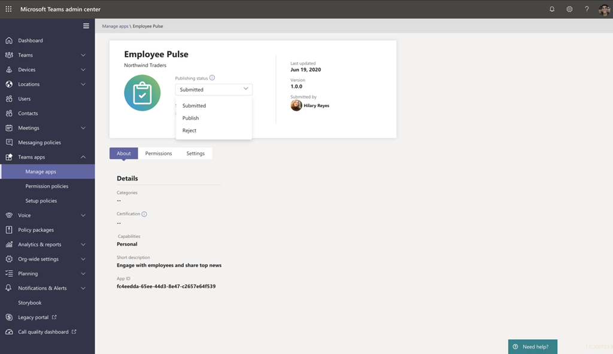

# Publicar um aplicativo personalizado enviado por meio da API de envio do aplicativo Teams

[!INCLUDE [preview-feature](includes/preview-feature.md)]

## Visão geral

> [!NOTE]
> Quando você publica um aplicativo personalizado do Teams, ele está disponível para os usuários na loja de aplicativos da sua organização. Há duas maneiras de publicar um aplicativo personalizado e a maneira como você pode usar depende de como você obtém o aplicativo. **Este artigo se concentra em como aprovar e publicar um aplicativo personalizado que um desenvolvedor envia por meio da API de envio do aplicativo Teams**. O outro método, upload de um aplicativo personalizado, é usado quando um desenvolvedor envia um pacote de aplicativo em formato. zip. Para saber mais sobre esse método, consulte [publicar um aplicativo personalizado carregando um pacote de aplicativo](manage-your-custom-apps.md).
 
Este artigo fornece uma orientação de ponta a ponta para como levar o aplicativo Teams do desenvolvimento à implantação para descoberta. Você terá uma visão geral das experiências conectadas que o Microsoft Teams oferece em todo o ciclo de vida do aplicativo para simplificar o desenvolvimento, a implantação e o gerenciamento de aplicativos personalizados na loja de aplicativos da sua organização.

Abordaremos cada etapa do ciclo de vida, incluindo como os desenvolvedores podem usar a API de envio de aplicativos do teams para enviar aplicativos personalizados diretamente para o centro de administração do Microsoft Teams para que você possa revisar e aprovar, como definir políticas para gerenciar aplicativos para os usuários de sua organização e como os usuários os descobrirão no Teams.

Esta orientação concentra-se nos aspectos da equipe do aplicativo e destina-se a administradores e profissionais de ti. Para obter informações sobre o desenvolvimento de aplicativos Teams, consulte a <a href="https://docs.microsoft.com/microsoftteams/platform" target="_blank">documentação do desenvolvedor do teams</a>.

## Desenvolver

### Criar o aplicativo

A plataforma de desenvolvedor do Microsoft Teams facilita para os desenvolvedores integrarem seus próprios aplicativos e serviços para melhorar a produtividade, tomar decisões mais rápidas e criar colaboração em torno de conteúdo e fluxos de trabalho existentes. Os aplicativos criados na plataforma de equipe são pontes entre o cliente do Teams e seus serviços e fluxos de trabalho, trazendo-os diretamente para o contexto de sua plataforma de colaboração. Para obter mais informações, acesse a <a href="https://docs.microsoft.com/microsoftteams/platform" target="_blank">documentação do desenvolvedor do teams</a>.

### Enviar o aplicativo

Quando o aplicativo está pronto para uso na produção, o desenvolvedor pode enviar o aplicativo usando a API de envio do aplicativo Teams, que pode ser chamada a partir da API do Graph, um IDE (ambiente de desenvolvimento integrado), como o código do Visual Studio ou uma plataforma como aplicativos de energia e agentes de energia virtual. Isso torna o aplicativo disponível na página <a href="https://docs.microsoft.com/microsoftteams/manage-apps" target="_blank">gerenciar aplicativos</a> do centro de administração do Microsoft Teams, no qual você, o administrador pode revisar e aprová-lo. isso 

A API de envio do aplicativo Teams, criada no Microsoft Graph, permite que sua organização se desenvolva na plataforma de sua escolha e automatiza o processo de envio para aprovação para aplicativos personalizados no Teams.

Veja um exemplo de como essa etapa de envio de aplicativo parece no código do Visual Studio:

Lembre-se de que isso ainda não publica o aplicativo na loja de aplicativos da sua organização. Esta etapa envia o aplicativo para o centro de administração do Microsoft Teams, onde você pode aprová-lo para publicação na loja de aplicativos da sua organização.

## Válida

A página <a href="https://docs.microsoft.com/microsoftteams/manage-apps" target="_blank">gerenciar aplicativos</a> no centro de administração do Microsoft Teams (no painel de navegação à esquerda, vá até **Team apps**  >  **gerenciar aplicativos**), oferece um modo de exibição para todos os aplicativos do teams para sua organização. O widget **aprovação pendente** na parte superior da página permite que você saiba quando um aplicativo personalizado é enviado para aprovação.

Na tabela, um aplicativo recém enviado mostra automaticamente um **status de publicação** de **enviado** e **status** de **bloqueado**. Você pode classificar a coluna **status da publicação** em ordem decrescente para localizar rapidamente o aplicativo.

Clique no nome do aplicativo para ir para a página de detalhes do aplicativo. Na guia **sobre** , você pode exibir detalhes sobre o aplicativo, incluindo descrição, status, emissor e ID do aplicativo.

## Publicado

Quando você estiver pronto para disponibilizar o aplicativo para os usuários, publique o aplicativo.

1. Na navegação à esquerda do centro de administração do Microsoft Teams, vá até **Team apps**  >  **gerenciar aplicativos**.
2. Clique no nome do aplicativo para acessar a página de detalhes do aplicativo e, em seguida, na caixa **status de publicação** , selecione **publicar**.

    Depois de publicar o aplicativo, o **status de publicação** muda para **publicado** e o **status** muda automaticamente para **permitido**.

## Configurar e gerenciar

### Controlar o acesso ao aplicativo

Por padrão, todos os usuários em sua organização podem acessar o aplicativo na loja de aplicativos da sua organização. Para restringir e controlar quem tem permissão para usar o aplicativo, você pode criar e atribuir uma política de permissão do aplicativo. Para saber mais, consulte <a href="https://docs.microsoft.com/microsoftteams/teams-app-permission-policies" target="_blank">gerenciar políticas de permissão do aplicativo no Microsoft Teams</a>.

### Fixar e instalar o aplicativo para que os usuários descubram

Por padrão, para que os usuários localizem o aplicativo, eles precisam ir para a loja de aplicativos da sua organização e procurar ou procurá-lo. Para facilitar para os usuários acessar o aplicativo, você pode fixar o aplicativo à barra de aplicativos no Microsoft Teams. Para fazer isso, crie uma política de configuração de aplicativo e atribua-a a usuários. Para saber mais, consulte <a href="https://docs.microsoft.com/microsoftteams/teams-app-setup-policies" target="_blank">gerenciar políticas de configuração de aplicativos no Microsoft Teams</a>.

## Descubra e adote

Os usuários que têm permissões para o aplicativo podem encontrá-lo na loja de aplicativos da sua organização. Vá para ** *o nome da sua organização* específico** na página aplicativos para localizar os aplicativos personalizados da sua organização.

Se você criou e atribuiu uma política de configuração de aplicativo, o aplicativo é fixado à barra de aplicativos no Teams para facilitar o acesso para os usuários que receberam a política.

## Atualizar

Para atualizar um aplicativo, os desenvolvedores devem continuar a seguir as etapas na seção [desenvolver](#develop) .

Quando o desenvolvedor envia uma atualização para um aplicativo personalizado publicado, você receberá uma notificação no widget **aprovação pendente** da página <a href="https://docs.microsoft.com/microsoftteams/manage-apps" target="_blank">gerenciar aplicativos</a> . Na tabela, o **status de publicação** do aplicativo será definido como **atualização enviada**.

Para revisar e publicar uma atualização de aplicativo:

1. Na navegação à esquerda do centro de administração do Microsoft Teams, vá até **Team apps**  >  **gerenciar aplicativos**.
2. Clique no nome do aplicativo para acessar a página de detalhes do aplicativo e selecione **Atualizar disponível** para revisar os detalhes da atualização.

    
3. Quando estiver pronto, selecione **publicar** para publicar a atualização. Isso substitui o aplicativo existente, atualiza o número da versão e altera o **status de publicação** para **publicado**. Todas as políticas de permissão do aplicativo e políticas de configuração do aplicativo permanecem impostas para o aplicativo atualizado.

    Se você rejeitar a atualização, a versão anterior do aplicativo permanecerá publicada.

Tenha em mente o seguinte:

- Quando um aplicativo é aprovado, qualquer um pode enviar uma atualização para o aplicativo. Isso significa que outros desenvolvedores, incluindo o desenvolvedor que enviou o aplicativo originalmente, podem enviar uma atualização para o aplicativo.
- Quando um desenvolvedor envia um aplicativo e a solicitação está pendente, somente esse mesmo desenvolvedor pode enviar uma atualização para o aplicativo. Outros desenvolvedores podem enviar uma atualização somente após o aplicativo ser aprovado.

### Experiência de atualização para usuários

Na maioria dos casos, após a publicação de uma atualização de aplicativo, a nova versão será exibida automaticamente para os usuários. No entanto, há algumas atualizações do <a href="https://docs.microsoft.com/microsoftteams/platform/resources/schema/manifest-schema" target="_blank">manifesto do Microsoft Teams</a> que exigem a aceitação do usuário para serem concluídas:

* Um bot foi adicionado ou removido
* A propriedade "botId" de um bot existente foi alterada
* A propriedade "isNotificationOnly" de um bot existente foi alterada
* A propriedade "supportsFiles" do bot foi alterada
* Uma extensão de mensagens foi adicionada ou removida
* Um novo conector foi adicionado
* Uma nova guia estática foi adicionada
* Uma nova guia configurável foi adicionada
* As propriedades dentro de "webApplicationInfo" foram alteradas

## Tópicos relacionados

- [Gerenciar seus aplicativos no centro de administração do Microsoft Teams](manage-apps.md)
- [Gerenciar políticas de aplicativo personalizado e as configurações no Teams](teams-custom-app-policies-and-settings.md)
- [Gerenciar políticas de permissões de aplicativo no Teams](teams-app-permission-policies.md)
- [Gerenciar políticas de configuração de aplicativo no Teams](teams-app-setup-policies.md)
