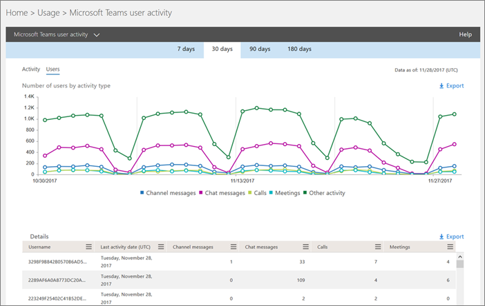

# Usar relatórios de atividades do Microsoft Teams 

Você pode usar relatórios de atividades no centro de administração do Microsoft 365 para ver como os usuários da sua organização estão usando o Microsoft Teams. Por exemplo, se alguns ainda não Microsoft Teams, talvez não saibam como começar ou entender como podem usar o Teams para serem mais produtivos e colaborativos. Sua organização pode usar os relatórios de atividades para decidir onde priorizar os esforços de treinamento e comunicação.

## Como exibir os relatórios do Teams no painel relatórios

1. No [centro de administração da Microsoft 365](https://portal.office.com/adminportal/home), selecione **Relatórios** > **Uso**.
 
2. Na página **Uso**, escolha **Selecione um relatório** e dentro da lista de relatórios do **Microsoft Teams**, escolha o relatório que você deseja exibir.

## Relatórios de atividades do Teams disponíveis

Atualmente, há dois relatórios de atividade que você pode exibir:

- [Relatório de atividades do usuário do Microsoft Teams](#microsoft-teams-user-activity-report) 
- [Relatório de uso de dispositivos do Microsoft Teams](#microsoft-teams-device-usage-report) 

### Relatório de atividades do usuário do Microsoft Teams

O relatório de atividades do usuário do Teams oferece uma visão das atividades mais comuns que seus usuários realizam no Teams. Isso inclui quantas pessoas participam de um chat em um canal, quantas se comunicam por meio de uma mensagem de bate-papo particular e quantas participam de chamadas ou reuniões. Você pode ver essas informações para toda a sua organização, e também para cada usuário individual.

#### Interpretar o relatório de atividade de usuários do Microsoft Teams

Você pode observar a atividade de usuários do Teams examinando os gráficos **Atividade** e **Usuários**.

|Texto Explicativo |Descrição  |
|--------|-------------|
|**1**   |O relatório Atividade de usuários do Teams pode ser consultado sobre tendências dos últimos 7, 30, 90 ou 180 dias. No entanto, se você clicar em um intervalo de tempo específico no relatório, a tabela (7) mostrará dados por 30 dias, atualizados (2) para quando o relatório tiver sido gerado. |
|**2**   |Cada relatório tem uma data de geração. O relatório geralmente reflete um período de latência de atividade de 24 a 48 horas. |
|**3**   |O modo de exibição **Atividade** mostra o número de atividades do Microsoft Teams por tipo de atividade. Os tipos de atividade são o número de mensagens de chat de equipes, mensagens de chat privadas, chamadas e reuniões. |
|**4**   |Os modo de exibição **Usuários** mostra o número de usuários por tipo de atividade. Os tipos de atividade são o número de mensagens de chat de equipes, mensagens de chat privadas, chamadas e reuniões. |
|**5**   |O eixo X nos gráficos representa o intervalo de datas selecionado para esse relatório específico. <ul><li>No gráfico **Atividades**, o eixo Y representa a contagem de atividade especificada.</ul></li> <ul><li>No gráfico **Usuários**, o eixo Y representa o número de usuários que fazem parte dos gráficos de equipe, conversas particulares, chamadas ou reuniões.</ul></li> |
|**6**   |Para filtrar a série apresentada no gráfico, clique no item da legenda. Por exemplo, no gráfico **Atividade**, clique ou toque em **Mensagens do Canal**, **Mensagens do bate-papo**, **Chamadas**, ou **Reuniões** para ver apenas as informações relacionadas a cada uma delas. Alterar essa seleção não altera as informações na tabela de grade. |
|**7**   |A lista de equipes ativas no período de relatório mais amplo (180 dias).  A contagem de atividades variará de acordo com a seleção de data.    Para ver as informações a seguir na tabela, certifique-se de adicionar as colunas à tabela. <ul><li>**Nome de usuário** é o endereço de email do usuário. Você pode exibir o endereço de email real ou tornar este campo anônimo.</ul></li> <ul><li>**Data da última atividade (UTC)** se refere à data da última atividade que o usuário participou em uma atividade do Microsoft Teams.</ul></li> <ul><li>**Mensagens do canal** é o número de mensagens exclusivas que o usuário publicou em um chat de equipe durante o período de tempo especificado.</ul></li> <ul><li>**Mensagens de chat** é o número de mensagens exclusivas que o usuário publicou em um chat particular durante o período de tempo especificado.</ul></li> <ul><li>**Chamadas** é o número de chamadas das quais o usuário participou durante o período especificado.</ul></li> <ul><li>**Reuniões** é o número de reuniões online das quais o usuário participou durante o período especificado.</ul></li> <ul><li>**Outra atividade** é o número de outras atividades da equipe pelo usuário, algumas das quais incluem, e não se limitam a: curtir mensagens, aplicativos, trabalhar em arquivos, fazer pesquisas, seguir equipes e canais e favoritá-los.</ul></li> <ul><li>**Excluído** indica se a equipe foi excluída. Se a equipe for excluída, mas tiver atividades no período do relatório, elas serão exibidas na grade com a definição de excluído definido como true.</ul></li> <ul><li>**Data de exclusão** é a data em que o usuário foi excluído.</ul></li> <ul><li>**Produto atribuído** é a lista de produtos atribuídos ao usuário.</ul></li>Se as políticas da sua organização impedem a exibição de relatórios em que as informações do usuário podem ser identificadas, você pode alterar a configuração de privacidade de todos esses relatórios. Confira a seção **Como faço para ocultar detalhes no nível do usuário?** em Relatórios de atividade na [ visualização do Centro de administração do Office 365](https://support.office.com/article/activity-reports-in-the-office-365-admin-center-0d6dfb17-8582-4172-a9a9-aed798150263).</ui> |
|**8**   |Clique ou toque em **Editar colunas** para adicionar ou remover colunas na tabela. |
|**9**   |Clique ou toque em **Exportar** para exportar dados de relatório para um arquivo. csv do Excel. Esse protocolo exporta os dados de todos os usuários e permite que você execute a classificação e a filtragem simples para análises posteriores. Se tiver menos de 2.000 usuários, você poderá classificar e filtrar dentro da tabela no próprio relatório. Se tiver mais de 2.000 usuários, você precisará exportar os dados para filtrar e classificar o relatório. 

### Relatório de uso de dispositivos do Microsoft Teams

O relatório de uso de dispositivos do Teams fornece informações sobre como os usuários se conectam ao Teams, incluindo aplicativos móveis. O relatório ajuda você a entender quais dispositivos são populares em sua organização e quantos usuários trabalham de qualquer lugar.

### Interpretar o relatório de uso do dispositivo Microsoft Teams

Você pode ver detalhes de uso do dispositivo Teams examinando os gráficos **Usuários** e **Distribuição**.

|Texto Explicativo |Descrição  |
|--------|-------------|
|**1**   |O relatório de dispositivos do Teams pode ser consultado sobre tendências dos últimos 7, 30, 90 ou 180 dias. No entanto, se você clicar em um intervalo de tempo específico no relatório, a tabela (7) mostrará dados por 30 dias, atualizados (2) para quando o relatório tiver sido gerado. |
|**2**   |Cada relatório tem uma data de geração. O relatório geralmente reflete um período de latência de atividade de 24 a 48 horas. |
|**3**   |O modo de exibição **Usuários** mostra o número de usuários exclusivos diariamente por tipo de dispositivo. |
|**4**   |O modo de exibição **Distribuição** mostra o número de usuários por dispositivo no intervalo de tempo selecionado.  |
|**5**   | <ul><li>No gráfico **Usuários**, o eixo X é o intervalo de datas selecionado para o relatório e o eixo Y é o número de usuários por tipo de dispositivo.</ul></li> <ul><li>No gráfico **Distribuição**, o eixo X mostra os diferentes dispositivos usados para se conectar ao Teams e o eixo Y é o número de usuários que usam o dispositivo.</ul></li> |
|**6**   |Para filtrar a série apresentada no gráfico, clique no item da legenda. Por exemplo, no gráfico **Distribuição,** clique ou toque em Windows **,** **Mac,** **Linux,** **Web,** **iOS** ou **Android** para ver apenas as informações relacionadas a cada uma delas. Alterar essa seleção não altera as informações na tabela de grade. |
|**7**   |A lista de equipes ativas no período de relatório mais amplo (180 dias).  A contagem de atividades variará de acordo com a seleção de data.    Para ver as informações a seguir na tabela, certifique-se de adicionar as colunas à tabela. <ul><li>**Nome de usuário** é o endereço de email do usuário. Você pode exibir o endereço de email real ou tornar este campo anônimo.</ul></li> <ul><li>**Data da última atividade (UTC)** se refere à data da última atividade que o usuário participou em uma atividade do Teams. </ul></li> <ul><li>**Excluído** indica se a equipe foi excluída. Se a equipe for excluída, mas tiver atividades no período do relatório, elas serão exibidas na grade com a definição de excluído definido como true.</ul></li><ul><li>**Data de exclusão** é a data em que o usuário foi excluído.</ul></li> <ul><li>**Windows** estará selecionado se o usuário estiver ativo no cliente de desktop do Teams em um computador com Windows.</ul></li> <ul><li>**Mac** estará selecionado se o usuário estiver ativo no cliente de desktop do Teams em um computador com macOS.</ul></li>  <ul><li>**O Linux** é selecionado se o usuário estava ativo no Teams da área de trabalho em um computador Linux.</ul></li>   <ul><li>**Web** estará selecionado se o usuário estiver ativo no cliente Web do Teams.</ul></li> <ul><li>**iOS** estará selecionado se o usuário estiver ativo no cliente do Mobile Teams para iOS.</ul></li> <ul><li>**O telefone Android** estará selecionado se o usuário estiver ativo no cliente móvel do Teams para Android.</ul></li></li> Se as políticas da sua organização impedem a exibição de relatórios em que as informações do usuário podem ser identificadas, você pode alterar a configuração de privacidade de todos esses relatórios. Confira a seção **Como faço para ocultar detalhes no nível do usuário?** em Relatórios de atividade na [ visualização do Centro de administração do Office 365](https://support.office.com/article/activity-reports-in-the-office-365-admin-center-0d6dfb17-8582-4172-a9a9-aed798150263).</ui> |
|**8**   |Clique ou toque em **Editar colunas** para adicionar ou remover colunas na tabela. |
|**9**   |Clique ou toque em **Exportar** para exportar dados de relatório para um arquivo. csv do Excel. Esse protocolo exporta os dados de todos os usuários e permite que você execute a classificação e a filtragem simples para análises posteriores. Se tiver menos de 2.000 usuários, você poderá classificar e filtrar dentro da tabela no próprio relatório. Se tiver mais de 2.000 usuários, você precisará exportar os dados para filtrar e classificar o relatório. 

## Quem pode acessar os relatórios de atividades do Teams

Os relatórios de atividade podem ser acessados por usuários que estão atribuídos:

- Função de administrador global
- Função de administrador específica do produto (Exchange, Skype for Business ou SharePoint)
- Função leitor de relatórios

### Função leitor de relatórios

Você pode atribuir a função de leitor de relatórios a pessoas que não têm direitos de administrador, mas são responsáveis por conduzir a adoção ou controlar o uso de licenças Teams. Para saber como atribuir funções, leia Atribuir funções de administrador e não administrador aos [usuários com](/azure/active-directory/fundamentals/active-directory-users-assign-role-azure-portal)Azure Active Directory .

## Outras informações sobre o painel Relatórios

### Widget atividade rápida

O painel Relatórios inclui os dados de uso do Teams no widget de atividade de relance, o que oferece uma visão entre produtos de como os usuários se comunicam e colaboram usando os outros vários serviços no Microsoft 365 ou Office 365.

### Cartão de atividades do Teams

O cartão de atividades do Teams no painel Relatórios fornece uma visão geral das atividades no Teams, incluindo o número de usuários ativos, para que você possa entender rapidamente quantos usuários estão usando o serviço. Ao clicar no cartão de atividade no painel, você será direcionado para o relatório de atividades do usuário do Teams. 

