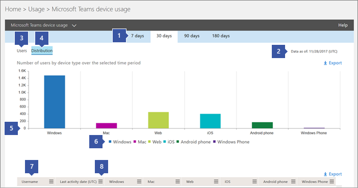

Usar relatórios de atividades do Microsoft TeamsUse activity reports for Microsoft Teams 
========================================

Você pode usar relatórios de atividades no centro de administração do Microsoft 365 para ver como os usuários da sua organização estão usando o Microsoft Teams.You can use activity reports in the Microsoft 365 admin center to see how users in your organization are using Microsoft Teams. Por exemplo, se algumas delas ainda não usam o Microsoft Teams, talvez não saibam como começar ou compreender como elas podem usar o Microsoft Teams para serem mais produtivos e colaborativas.For example, if some don’t use Microsoft Teams yet, they might not know how to get started or understand how they can use Teams to be more productive and collaborative. Sua organização pode usar os relatórios de atividades para decidir onde priorizar os esforços de treinamento e comunicação.Your organization can use the activity reports to decide where to prioritize training and communication efforts.

## Como exibir os relatórios do teams no painel relatóriosHow to view the Teams reports in the Reports dashboard

1. No [centro de administração do Microsoft 365](https://portal.office.com/adminportal/home), selecione**uso**de **relatórios** > .In the [Microsoft 365 admin center](https://portal.office.com/adminportal/home), select **Reports** > **Usage**.
 
2. Na página **uso** , escolha **selecionar um relatório**e, em **Microsoft Teams** , na lista de relatórios, escolha o relatório que você deseja exibir.On the **Usage** page, choose **Select a report**, and then under **Microsoft Teams** in the list of reports, choose the report you want to view.

## Relatórios de atividades de equipe disponíveisTeams activity reports that are available

Atualmente, há dois relatórios de atividades que você pode exibir:There are currently two activity reports you can view:

- [Relatório de atividades do usuário do Microsoft TeamsMicrosoft Teams user activity report](#microsoft-teams-user-activity-report) 
- [Relatório de uso de dispositivos do Microsoft TeamsMicrosoft Teams device usage report](#microsoft-teams-device-usage-report) 

### Relatório de atividades do usuário do Microsoft TeamsMicrosoft Teams user activity report

O relatório de atividade de usuários do teams oferece uma visão das atividades mais comuns que os usuários executam no Teams.The Teams user activity report gives you a view of the most common activities that your users perform in Teams. Isso inclui o número de pessoas que participam de um chat em um canal, o número de comunicação por meio de uma mensagem de chat particular e a quantidade de participantes em chamadas ou reuniões.This includes how many people engage in a chat in a channel, how many communicate via private chat message, and how many participate in calls or meetings. Você pode ver essas informações para toda a sua organização, bem como para cada usuário individual.You can see this information for your whole organization, as well as for each individual user.

#### Interpretar o relatório de atividade do usuário do Microsoft TeamsInterpret the Microsoft Teams user activity report

Você pode obter uma visão da atividade de usuários do teams examinando os gráficos **atividade** e **usuários** .You can get a view into Teams user activity by looking at the **Activity** and **Users** charts.

|Texto explicativoCallout |DescriçãoDescription  |
|--------|-------------|
|**1****1**   |O relatório de atividade de usuários do teams pode ser visualizado em busca de tendências nos últimos sete dias, 30 dias, 90 dias ou 180 dias.The Teams user activity report can be viewed for trends over the last 7 days, 30 days, 90 days, or 180 days. No entanto, se você clicar em um intervalo de tempo específico no relatório, a tabela (7) mostrará os dados por 30 dias até a data (2) para quando o relatório foi gerado.However, if you click into a particular time range in the report, the table (7) will show data for 30 days, up to the date (2) for when the report was generated. |
|**2****2**   |Cada relatório tem uma data de geração. O relatório geralmente reflete um período de latência de atividade de 24 a 48 horas.Each report has a date for when this report was generated. The reports usually reflect a 24 to 48 hour latency from time of activity. |
|**3****3**   |O modo de exibição **atividade** mostra o número de atividades do Microsoft Teams por tipo de atividade.The **Activity** view shows you the number of Microsoft Teams activities by activity type. Os tipos de atividade são o número de mensagens de chat da equipe, mensagens de chat particulares, chamadas e reuniões.The activity types are number of team chat messages, private chat messages, calls, and meetings. |
|**4****4**   |O modo de exibição **usuários** mostra o número de usuários por tipo de atividade.The **Users** view shows you the number of users by activity type. Os tipos de atividade são o número de mensagens de chat da equipe, mensagens de chat particulares, chamadas e reuniões.The activity types are number of team chat messages, private chat messages, calls, and meetings. |
|**5****5**   |O eixo X nos gráficos é o intervalo de datas selecionado para o relatório específico.The X axis on the charts is the selected date range for the specific report. <ul><li>No gráfico **atividade** , o eixo Y é a contagem da atividade especificada.On the **Activity** chart, the Y axis is the count of the specified activity.</ul></li> <ul><li>No gráfico **usuários** , o eixo Y é o número de usuários que participam de chats de equipe, chats privados, chamadas ou reuniões.On the **Users** chart, the Y axis is the number of users participating in teams chats, private chats, calls, or meetings.</ul></li> |
|**6****6**   |Você pode filtrar a série que vê no gráfico clicando em um item na legenda.You can filter the series you see on the chart by clicking on an item in the legend. Por exemplo, no gráfico **atividade** , clique ou toque em **mensagens de canal**, **mensagens de chat**, **chamadas**ou **reuniões** para ver apenas as informações relacionadas a cada uma delas.For example, on the **Activity** chart, click or tap **Channel messages**, **Chat messages**, **Calls**, or **Meetings** to see only the info related to each one. Alterar essa seleção não altera as informações na tabela de grade.Changing this selection doesn’t change the information in the grid table. |
|**7****7**   |A lista de equipes ativas pelo período de tempo de relatório mais largo (180 dias).The list of active teams across the widest (180-day) reporting time frame.  A contagem de atividades vai variar de acordo com a seleção de data.The activity count will vary according to the date selection.    Para ver as informações a seguir na tabela, certifique-se de adicionar as colunas à tabela.To see the following information the table, make sure you add the columns to the table. <ul><li>**Nome** de usuário é o endereço de email do usuário.**Username** is the email address of the user. Você pode exibir o endereço de email real ou transformar este campo em anônimo.You can display the actual email address or make this field anonymous.</ul></li> <ul><li>**Data da última atividade (UTC)** refere-se à última data em que o usuário participou de uma atividade do Microsoft Teams.**Last Activity Date (UTC)** refers to the last date that the user participated in a Microsoft Teams activity.</ul></li> <ul><li>**Mensagens de canal** é o número de mensagens exclusivas que o usuário publicou em um chat de equipe durante o período de tempo especificado.**Channel messages** is the number of unique messages that the user posted in a team chat during the specified time period.</ul></li> <ul><li>**Mensagens de chat** é o número de mensagens exclusivas que o usuário publicou em um chat particular durante o período de tempo especificado.**Chat messages** is the number of unique messages that the user posted in a private chat during the specified time period.</ul></li> <ul><li>**Chamadas** é o número de chamadas que o usuário participou durante o período de tempo especificado.**Calls** is the number of calls that the user participated in during the specified time period.</ul></li> <ul><li>**Reuniões** é o número de reuniões online das quais o usuário participou durante o período de tempo especificado.**Meetings** is the number of online meetings that the user participated in during the specified time period.</ul></li> <ul><li>**Outra atividade** é o número de outras atividades da equipe pelo usuário que incluem, e não se limitam a: mensagens de preferência, aplicativos, trabalho em arquivos, pesquisa, seguir equipes e canal e adicionar-los.**Other activity** is the number of other team activities by the user some of which include, and not limited to: liking messages, apps, working on files, searching, following teams and channel and favoriting them.</ul></li> <ul><li>**Excluído** indica se a equipe foi excluída.**Deleted** indicates if the team is deleted. Se a equipe for excluída, mas tiver atividade no período do relatório, ela será mostrada na grade com excluído definido como verdadeiro.If the team is deleted, but had activity in the reporting period, it will show up in the grid with deleted set to true.</ul></li> <ul><li>**Data de exclusão** é a data em que o usuário foi excluído.**Deleted date** is the date that the user was deleted.</ul></li> <ul><li>**Produto atribuído** é a lista de produtos atribuídos ao usuário.**Product assigned** is the list of products that are assigned to the user.</ul></li>Se as políticas da sua organização impedirem você de exibir relatórios nos quais as informações do usuário sejam identificáveis, você pode alterar a configuração de privacidade de todos esses relatórios.If your organization's policies prevents you from viewing reports where user information is identifiable, you can change the privacy setting for all these reports. Confira a seção **como faço para ocultar detalhes do nível do usuário?** nos [relatórios de atividades na visualização do centro de administração do Microsoft 365](https://support.office.com/article/activity-reports-in-the-office-365-admin-center-0d6dfb17-8582-4172-a9a9-aed798150263).</ui>Check out the **How do I hide user level details?** section in the [Activity Reports in the Microsoft 365 Admin Center Preview](https://support.office.com/article/activity-reports-in-the-office-365-admin-center-0d6dfb17-8582-4172-a9a9-aed798150263).</ui> |
|**08****8**   |Clique ou toque em **colunas** para adicionar ou remover colunas na tabela.Click or tap **Columns** to add or remove columns in the table. |
|**222****9**   |Clique ou toque em **Exportar** para exportar dados de relatório para um arquivo. csv do Excel.Click or tap **Export** to export report data to an Excel .csv file. Isso exporta dados de todos os usuários e permite que você faça uma classificação e filtragem simples para uma análise mais detalhada.This exports data of all users and enables you to do simple sorting and filtering for further analysis. Se você tiver menos de 2.000 usuários, poderá classificar e filtrar dentro da tabela no próprio relatório.If you have less than 2,000 users, you can sort and filter within the table in the report itself. Se você tiver mais de 2.000 usuários, será preciso exportar os dados para filtrar e classificar o relatório.If you have more than 2,000 users, you will have to export the data to filter and sort the report. 

### Relatório de uso de dispositivos do Microsoft TeamsMicrosoft Teams device usage report

O relatório de uso de dispositivos do teams fornece informações sobre como seus usuários se conectam ao Teams, incluindo aplicativos móveis.The Teams device usage report provides you with information about how your users connect to Teams, including mobile apps. O relatório ajuda você a entender quais dispositivos são populares em sua organização e quantos usuários trabalham em trânsito.The report helps you understand which devices are popular in your organization and how many users work on the go.

### Interpretar o relatório de uso do dispositivo do Microsoft TeamsInterpret the Microsoft Teams device usage report

Você pode obter uma visão do uso do dispositivo do teams examinando os gráficos **usuários** e **distribuição** .You can get a view into Teams device usage by looking at the **Users** and **Distribution** charts.

|Texto explicativoCallout |DescriçãoDescription  |
|--------|-------------|
|**1****1**   |O relatório de dispositivos do teams pode ser exibido para obter tendências nos últimos sete dias, 30 dias, 90 dias ou 180 dias.The Teams device report can be viewed for trends over the last 7 days, 30 days, 90 days, or 180 days. No entanto, se você clicar em um intervalo de tempo específico no relatório, a tabela (7) mostrará os dados por 30 dias até a data (2) para quando o relatório foi gerado.However, if you click into a particular time range in the report, the table (7) will show data for 30 days, up to the date (2) for when the report was generated. |
|**2****2**   |Cada relatório tem uma data de geração. O relatório geralmente reflete um período de latência de atividade de 24 a 48 horas.Each report has a date for when this report was generated. The reports usually reflect a 24 to 48 hour latency from time of activity. |
|**3****3**   |O modo de exibição **usuários** mostra o número de usuários diários por tipo de dispositivo.The **Users** view shows you the number of daily users by device type. |
|**4****4**   |O modo de exibição de **distribuição** mostra o número de usuários por dispositivo durante o período de tempo selecionado.The **Distribution** view shows you the number of users by device over the selected time period.  |
|**5****5**   | <ul><li>No gráfico **usuários** , o eixo X é o intervalo de datas selecionado para o relatório e o eixo Y é o número de usuários por tipo de dispositivo.On the **Users** chart, the X axis is the selected date range for the report and the Y axis is the number of users by device type.</ul></li> <ul><li>No gráfico de **distribuição** , o eixo X mostra os diferentes dispositivos usados para se conectar ao Teams e o eixo Y é o número de usuários que estão usando o dispositivo.On the **Distribution** chart, the X axis shows the different devices used to connect to Teams and the Y axis is the number of users using the device.</ul></li> |
|**6****6**   |Você pode filtrar a série que vê no gráfico clicando em um item na legenda.You can filter the series you see on the chart by clicking on an item in the legend. Por exemplo, no gráfico **de distribuição** , clique ou toque em **Windows**, **Mac**, **Web**, **Ios**ou **Android** para ver apenas as informações relacionadas a cada uma delas.For example, on the **Distribution** chart, click or tap **Windows**, **Mac**, **Web**, **iOS**, or **Android** to see only the info related to each one. Alterar essa seleção não altera as informações na tabela de grade.Changing this selection doesn’t change the information in the grid table. |
|**7****7**   |A lista de equipes ativas pelo período de tempo de relatório mais largo (180 dias).The list of active teams across the widest (180-day) reporting time frame.  A contagem de atividades vai variar de acordo com a seleção de data.The activity count will vary according to the date selection.    Para ver as informações a seguir na tabela, certifique-se de adicionar as colunas à tabela.To see the following information in the table, make sure you add the columns to the table. <ul><li>**Nome** de usuário é o endereço de email do usuário.**Username** is the email address of the user. Você pode exibir o endereço de email real ou transformar este campo em anônimo.You can display the actual email address or make this field anonymous.</ul></li> <ul><li>**Data da última atividade (UTC)** refere-se à última data em que o usuário participou de uma atividade de equipe.**Last Activity Date (UTC)** refers to the last date that the user participated in a Teams activity.</ul></li> <ul><li>**Excluído** indica se a equipe foi excluída.**Deleted** indicates if the team is deleted. Se a equipe for excluída, mas tiver atividade no período do relatório, ela será mostrada na grade com excluído definido como verdadeiro.If the team is deleted, but had activity in the reporting period, it will show up in the grid with deleted set to true.</ul></li><ul><li>**Data de exclusão** é a data em que o usuário foi excluído.**Deleted date** is the date that the user was deleted.</ul></li> <ul><li>O **Windows** estará selecionado se o usuário estava ativo no cliente da área de trabalho do teams em um computador com Windows.**Windows**  is selected if the user was active in the Teams desktop client on a Windows-based computer.</ul></li> <ul><li>**Mac** estará selecionado se o usuário estava ativo no cliente da área de trabalho do teams em um computador MacOS.**Mac** is selected if the user was active in the Teams desktop client on a macOS computer.</ul></li>  <ul><li>**Web** estará selecionado se o usuário estava ativo no cliente da Web do teams.**Web** is selected if the user was active on the Teams web client.</ul></li> <ul><li>**Ios** estará selecionado se o usuário estava ativo no cliente móvel do teams para Ios.**iOS** is selected if the user was active on the Teams mobile client for iOS.</ul></li> <ul><li>**Telefone Android** estará selecionado se o usuário estava ativo no cliente do teams Mobile para Android.**Android phone**  is selected if the user was active on the Teams mobile client for Android.</ul></li></li> <ui>Se as políticas da sua organização impedirem você de exibir relatórios nos quais as informações do usuário sejam identificáveis, você pode alterar a configuração de privacidade de todos esses relatórios. Confira a seção **como faço para ocultar detalhes do nível do usuário?** nos [relatórios de atividades na visualização do centro de administração do Microsoft 365](https://support.office.com/article/activity-reports-in-the-office-365-admin-center-0d6dfb17-8582-4172-a9a9-aed798150263).</ui><ui>If your organization's policies prevents you from viewing reports where user information is identifiable, you can change the privacy setting for all these reports. Check out the **How do I hide user level details?** section in the [Activity Reports in the Microsoft 365 Admin Center Preview](https://support.office.com/article/activity-reports-in-the-office-365-admin-center-0d6dfb17-8582-4172-a9a9-aed798150263).</ui> |
|**08****8**   |Clique ou toque em **colunas** para adicionar ou remover colunas na tabela.Click or tap **Columns** to add or remove columns in the table. |
|**222****9**   |Clique ou toque em **Exportar** para exportar dados de relatório para um arquivo. csv do Excel.Click or tap **Export** to export report data to an Excel .csv file. Isso exporta dados de todos os usuários e permite que você faça uma classificação e filtragem simples para uma análise mais detalhada.This exports data of all users and enables you to do simple sorting and filtering for further analysis. Se você tiver menos de 2.000 usuários, poderá classificar e filtrar dentro da tabela no próprio relatório.If you have less than 2,000 users, you can sort and filter within the table in the report itself. Se você tiver mais de 2.000 usuários, será preciso exportar os dados para filtrar e classificar o relatório.If you have more than 2,000 users, you will have to export the data to filter and sort the report. 

## Quem pode acessar os relatórios de atividades da equipeWho can access the Teams activity reports

Os relatórios de atividades podem ser acessados por usuários atribuídos:The activity reports can be accessed by users that are assigned:

- Função de administrador global do Office 365Office 365 global admin role
- Função de administrador específica do produto (Exchange, Skype for Business ou SharePoint)Product-specific admin role (Exchange, Skype for Business, or SharePoint)
- Função de leitor de relatóriosReports reader role

### Função de leitor de relatóriosReports reader role

Você pode atribuir a função *leitor de relatórios* a uma equipe que não seja de ti que você deseja que tenha acesso a esses relatórios.You can assign the *Reports reader* role to non-IT staff who you want to have access to these reports. Atribuindo esta função a gerentes de treinamento ou stakeholders corporativos, você pode garantir que eles tenham acesso às ideias úteis para direcionar e rastrear a adoção de equipes.By assigning this role to training managers or business stakeholders, you can make sure that they have access to the insights that are helpful to drive and track adoption of Teams.

## Outras informações sobre o painel relatóriosOther information on the Reports dashboard

### Widget atividade em resumoAt-a-glance activity widget

O painel relatórios inclui os dados de uso do teams no widget atividade em resumo, que oferece uma visão de produtos para a maneira como os usuários se comunicam e colaboram usando os vários serviços do Office 365.The Reports dashboard includes the usage data from Teams in the at-a-glance activity widget, which gives you a cross-product view of how users communicate and collaborate using the other various services in Office 365.

### Cartão de atividade do teamsTeams activity card

O cartão de atividades do teams no painel Relatórios fornece uma visão geral da atividade no Teams, incluindo o número de usuários ativos, para que você possa entender rapidamente quantos usuários estão usando o serviço.The Teams activity card on the Reports dashboard gives you an overview of the activity in Teams, including the number of active users, so that you can quickly understand how many users are using the service. Clicar no cartão de atividade no painel leva você ao relatório de atividades do usuário do teams.Clicking the activity card on the dashboard takes you to the Teams user activity report. 

